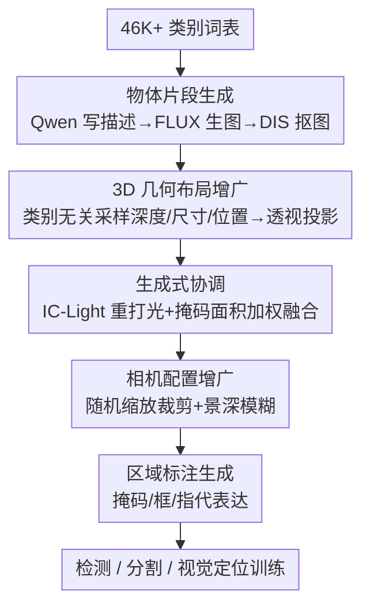

# Synthetic Object Compositions for Scalable and Accurate Learning in Detection, Segmentation, and Grounding

**会议**: CVPR 2026  
**论文**: [CVF Open Access](https://openaccess.thecvf.com/content/CVPR2026/html/Huang_Synthetic_Object_Compositions_for_Scalable_and_Accurate_Learning_in_Detection_CVPR_2026_paper.html)  
**代码**: 无  
**领域**: 合成数据 / 目标检测 / 实例分割 / 视觉定位  
**关键词**: 合成数据, 物体组合, 3D 布局增广, 生成式协调, 开放词表检测

## 一句话总结
SOC 是一条"以物体为中心"的合成数据流水线：先用生成模型造出 2000 万个高质量单物体分割片段，再用 3D 几何布局 + 相机配置增广把它们拼进 200 万张图，配上像素级精确的掩码/框/指代表达——仅用 10 万张合成图训练，开放词表检测/分割/定位就能超过 GRIT 20M、V3Det 200K 等真实数据集（LVIS +10.9 AP，gRefCOCO +8.4 NAcc）。

## 研究背景与动机
**领域现状**：实例分割、视觉定位（referring grounding）、目标检测这些"视觉分组"任务，性能高度依赖大规模、人工精标的数据集。COCO 仅标 10 万张图就花了 220 万工时。

**现有痛点**：真实数据集贵、难扩、类别覆盖偏。合成数据看似是出路，但两条主流路线都有硬伤——① 仿真渲染整个场景虽能给出精确稠密标注，却受限于 3D 资产稀缺，物体多样性差、只能覆盖室内/驾驶等刚性域；② 在真实或生成图像上用模型自动打标（pseudo-label，如 GRIT、SynGround），场景和外观更丰富，却同时继承了"打标模型"和"图像生成器"两层标注噪声，掩码/框往往不准。

**核心矛盾**：现有合成方法被迫在"标注精度"和"组合多样性/可控性"之间二选一——要么像仿真那样精确但僵硬，要么像伪标注那样灵活但脏。

**本文目标**：造一条同时具备精确区域标注、可控性、组合灵活性、开放词表覆盖、可无限扩展的合成流水线。

**切入角度**：作者反其道而行——不从一整张图出发再去标注，而是**自底向上从物体片段拼装场景**。既然每个物体片段是单独生成、单独抠出来的，它的掩码就是"天然真值"，根本不需要事后再让模型去猜框猜掩码。

**核心 idea**：用"物体片段组合"代替"整图渲染/整图伪标注"——先攒一个海量高质量片段库，再按设计好的 3D 布局把片段贴进图、做生成式协调，标注随拼贴自动产生且精确。

## 方法详解
### 整体框架
SOC（Synthetic Object Compositions）把"造数据集"拆成两步走：先**离线建一个 2000 万规模的单物体分割片段库**，再**在线把片段组合成任意数量的图像**，每张图自带掩码、框、类别和指代表达。整条流水线是一条 5 阶段串行管线：①生成物体片段 → ②3D 几何布局把 5–20 个片段摆进一张"3D 场景" → ③生成式协调（重打光 + 重融合）消除拼贴痕迹 → ④相机配置增广（缩放/景深模糊）模拟真实拍摄 → ⑤直接从拼贴关系算出区域标注。关键在于，整张图是从已知掩码的片段拼出来的，所以②之后框和掩码就已经是精确的，③④只负责让图"看起来真"，⑤只负责把标注汇总成检测/分割/定位三套格式。

### 关键设计

**1. 以物体为中心的片段生成：把"标注"变成"天然真值"**

针对伪标注路线"框和掩码不准"这个根本痛点，SOC 不在杂乱场景里抠物体，而是先单独生成每个物体。对收集到的 46000+ 个类别，先用 Qwen2.5-32B 为每类写文本描述，再喂给文生图模型 FLUX-1-dev，在**纯白背景**上以随机视角渲染单物体图，最后用 DIS 做显著性抠图得到带 alpha 的精确片段。作者发现白底单物体比"在杂乱场景里生成再分割"得到的掩码边界干净得多——因为没有遮挡、没有背景干扰，抠图任务被简化到了极致。最终生成 2000 万片段：1000 万覆盖 LVIS/COCO/ADE20K 的 1.6K 高频类（每类 200 prompt），1000 万覆盖 LAION/GQA/Flickr30K 的 4 万通用类（每类 10 prompt），每个 prompt 用不同随机种子合 3 个片段。一旦有了这个库，就能拼出**任意数量**带精确标注的图，这是 SOC"可无限扩展"的根。

**2. 3D 几何布局增广：用"类别无关采样"打掉捷径相关性**

真实数据训出来的模型常常学到"伪相关"捷径——比如"车总是又大又在画面底部"，靠图像里的位置/尺寸线索而非语义来识别。为打断这种捷径，SOC 把每张合成图建模成一个 3D 场景，让深度、尺寸、位置的采样**独立于物体类别**，即 $p(d_i, X_i, Y_i \mid c_i) = p(d_i, X_i, Y_i)$。具体地：每类有一个常识物理尺寸范围（车 4–5m、杯子 10–20cm，由 Qwen2.5-32B 生成）；先采样相机焦距 $f \sim U(f_{min}, f_{max})$，定最大深度 $D_{max} = \alpha \cdot f$，划分近/中/远三段深度（按 COCO/SA-1B 观察到的 40%/35%/25% 分布采）；对每个片段采物理尺寸 $S_i \sim N(\mu_{c_i}, \sigma_{c_i})$、3D 位置均匀采，再用透视投影落到 2D：

$$x_i = f \cdot \frac{X_i}{d_i}, \quad y_i = f \cdot \frac{Y_i}{d_i}, \quad s_i = f \cdot \frac{S_i}{d_i}$$

其中 $(x_i, y_i)$ 是 2D 中心、$s_i$ 是像素尺寸。若投影后物体太小/太大、或几乎完全遮挡了另一个物体（$\text{IoU}(M_i, M_j) \ge 0.9$）就重采位置和深度。这样同一类物体会出现在各种深度/尺寸/位置上，逼模型学语义而非位置捷径——消融里它给到 10.03 AP，碾压 COCO 布局（8.60）和随机 2D 布局（9.07）。

**3. 生成式协调 + 掩码面积加权融合：消灭"边缘捷径"又不毁掉小物体**

直接把片段贴到背景上会留下**不自然的锐利边缘**，分割模型会偷懒去学这种边缘伪影而不是真正的语义。SOC 用扩散模型 IC-Light 同时做背景重绘（inpainting）和全局重打光（relighting），为贴上去的物体生成协调的背景并统一全场光照，让图更真实、没有边缘破绽。但 IC-Light 有副作用：会扭曲小物体细节、甚至改物体颜色（蓝→红），破坏与文本描述的一致性。对此作者再把**原始片段按掩码面积加权地重新融合**回协调后的图——每个掩码 $M_i$ 用融合权重 $\alpha_i \in [0,1]$，**越小的物体给越高的 $\alpha_i$**（更多保留原貌），最后再用一步轻量软抠图把二值掩码转成软 alpha matte 平滑边界。这一融合步骤在 LVIS-mini-val 上带来 +2.3 AP，消融里"重绘+打光+融合"相比只贴背景把 COCO 零样本分割 AP 从 6.28 拉到 12.79（+103.7%）。

**4. 相机配置增广：让物体尺度不再是可靠的类别线索**

布局和打光之后，SOC 再叠一层相机增广，进一步把物体外观与语义解耦。一是**随机缩放裁剪**：从布局阶段采的焦距 $f$ 出发，按 $s \sim U(1.0, 4.0)$ 放大（等价于改焦距 $f' = s \cdot f$）再裁回原尺寸，模拟相机变焦，使物体尺度不再是识别类别的可靠线索。二是**景深模糊**：随机采焦平面深度 $d_{focal}$ 和光圈 f-number $N \sim U(1.4, 16)$，按弥散圆公式给每个深度 $d$ 的物体算模糊核：

$$\sigma(d) = \frac{f^2}{N \cdot d_{focal}} \cdot \frac{|d - d_{focal}|}{d}$$

焦平面附近的物体保持清晰（$\sigma \approx 0$），越远越糊；小 f-number（f/1.4）产生强背景虚化模拟人像摄影，大 f-number（f/16）则大部分清晰模拟风光摄影。最后第 ⑤ 阶段汇总标注：检测/分割直接由片段拼贴关系减去被遮挡像素算出框和掩码；视觉定位则把每个物体的框、掩码、类别、生成 prompt 喂给 QwQ-32B，产出每张图至少 9 条属性/空间维度的稠密指代表达。

### 一个完整示例
拼一张图的过程：从 46K 词表里按平衡采样抽 5–20 个类别（比如 dog、car、cup），各从片段库取一个白底片段；给 dog 采物理尺寸 0.5m、深度落"近"段，car 采 5m、落"远"段——注意 car 物理上大，但因为在远处，投影到画面里反而可能比近处的 dog 小，**彻底打破"车=大"的捷径**；透视投影把它们摆到 2D 上、检查无 ≥0.9 的完全遮挡；IC-Light 给整图重打光重绘背景，再把原始 dog/cup（小物体高 $\alpha$）融回去保住细节和颜色；叠一层 f/2.0 景深，让远处的 car 自然虚化；最后输出 dog/car 的精确框+掩码，加上"画面里所有的狗"、"左后方那个物体"等指代表达。整张图的标注全程零人工、零事后打标。

## 实验关键数据

### 主实验
开放词表检测（MM-Grounding-DINO，在 O365+GoldG 预训练权重上继续训），关键结论：仅 50K 合成图就超 20M 的 GRIT、追平 200K 的 V3Det，且与真实数据互补叠加。

| 训练数据 | 规模 | LVIS AP | LVIS AP_rare | OdinW-35 avg |
|----------|------|---------|--------------|--------------|
| O365+GoldG（基线） | 1.4M | 20.1 | 10.1 | 20.3 |
| +GRIT（模型标注） | +20M | 27.1 | 17.3 | 22.8 |
| +V3Det（人工标注） | +200K | 30.6 | 21.5 | 21.4 |
| **+SOC-FC-50K** | +50K | 29.8 | 23.5 | 20.5 |
| **+SOC-FC-200K+GC-200K** | +400K | 31.4 | 27.9 | 21.2 |
| O365+GoldG+GRIT+V3Det | 21.6M | 31.9 | 23.6 | 23.2 |
| **↑ 再+SOC-100K** | +100K | **33.2** | **29.8** | 23.1 |

视觉定位（gRefCOCO / DoD / RefCOCO avg），关键结论：现有大数据集因缺高质量指代表达只带来微弱提升，SOC 在 gRefCOCO 的 no-target 准确率（NAcc）和 DoD mAP 上涨幅明显更大。

| 训练数据 | 规模 | gRefCOCO P@1 | gRefCOCO NAcc | DoD FULL mAP |
|----------|------|--------------|---------------|--------------|
| O365+GoldG（基线） | 1.4M | 39.8 | 89.3 | 15.6 |
| +GRIT | +20M | 40.7 | 89.3 | 17.0 |
| +V3Det | +200K | 40.3 | 89.3 | 16.7 |
| **+SOC-FC-100K** | +100K | **41.3** | **97.7** | **19.4** |

### 消融实验
COCO 零样本实例分割 AP（Sec 4.7），逐项验证四大设计：

| 配置 | AP | 说明 |
|------|-----|------|
| COCO 布局 | 8.60 | 沿用真实数据集布局统计 |
| 随机 2D 布局 | 9.07 | 2D 随机摆放 |
| **3D 几何布局增广** | **10.03 (+16.6%)** | 类别无关 3D 采样，打掉捷径 |
| w/o 相机配置增广 | 10.03 | — |
| **w/ 相机配置增广** | **10.58 (+5.5%)** | 加缩放/景深 |
| w/o 生成式协调 | 6.28 | 直接贴图，留边缘伪影 |
| w/ 重绘+打光 | 10.58 | IC-Light |
| **w/ 重绘+打光+融合** | **12.79 (+103.7%)** | 加掩码面积加权融合 |
| 仅真实片段 | 7.03 | — |
| **真实+SOC 合成片段** | **12.79 (+81.9%)** | 合成片段大幅增益 |

### 关键发现
- **生成式协调（尤其融合步骤）贡献最大**：去掉它 AP 从 12.79 暴跌到 6.28，几乎腰斩——说明"边缘捷径"是合成数据训坏模型的头号元凶，而掩码面积加权融合（保住小物体）是把"重打光的副作用"摁住的关键补丁。
- **稀有类增益最猛**：50K SOC 把 LVIS rare-class AP 从 10.1 拉到 23.5（+13.4），远超 GRIT 的 +7.0——合成可控性正好补上真实数据覆盖不到的长尾类别。
- **极低真实数据时增益放大**：仅用 1% COCO 数据时混入 SOC 片段带来 +6.59 AP，远高于充足数据时的 ~3%，说明合成片段在数据稀缺时不只是补充而是"放大"真实标注。
- **3D 布局 > 真实布局**：类别无关的 3D 采样（10.03）反而打败了直接照搬 COCO 真实布局（8.60），印证"刻意打破伪相关"比"模仿真实分布"更有利于学语义。

## 亮点与洞察
- **"标注即真值"的范式反转**：先有精确片段、再拼图，标注随拼贴自动生成——绕过了所有伪标注路线的标注噪声问题，这是 SOC 能"合成超真实"的根本原因，思路可迁移到任何需要稠密标注的合成任务。
- **把数据增广当"反捷径工程"来设计**：3D 布局、相机增广、生成式协调三件套都不是为了"更真"，而是为了**主动拆掉模型可能偷懒的每一条捷径**（位置捷径、尺度捷径、边缘捷径）——这个"以捷径为靶子"的设计视角很值得借鉴。
- **可控性带来诊断能力**：因为能精确控制"同类多物体不同属性"，作者顺手提出了 intra-class referring（ICR）诊断任务，专门测模型能否区分同类不同属性的物体——合成数据的可控性反过来成了构造细粒度 benchmark 的工具。

## 局限与展望
- 流水线重度依赖多个大模型（Qwen2.5-32B、FLUX、IC-Light、QwQ-32B、DIS），算力成本和各模型自身偏差会层层传入合成数据，作者未充分量化这些上游偏差的影响。⚠️
- 片段在白底单独生成，物体间的**真实交互/接触关系**（如手握杯、人坐椅）较难合成，对需要关系推理的定位任务可能仍有 gap。
- 单物体片段虽干净，但"贴上去的世界"本质是物体的随机摆放，长程场景语义/常识布局（厨房里该有什么）不如真实图自然，可能限制需要场景级先验的任务。
- 改进方向：把"关系/交互"也纳入可控生成、用更轻量的协调模型降成本、探索片段库随任务自适应扩充。

## 相关工作与启发
- **vs Copy-Paste / X-Paste**：它们也是贴片段，但贴的是真实图里抠出的物体、缺乏真实感和 3D 布局控制，照搬背景；SOC 用生成式片段 + 3D 几何布局 + 生成式协调，COCO 实例分割上分别领先 +36.1% / +36.0%。
- **vs SynGround / SegGen 等扩散+伪标注**：它们从掩码/布局生成整图再让模型打标，标注不准；SOC 标注是拼贴的天然真值，COCO 上分别领先 +24.1% / +28.5%。
- **vs GRIT / V3Det 真实数据集**：GRIT 有规模（20M）但只有框且噪声大，V3Det 精但贵且类别有限；SOC 仅 50–100K 就追平甚至超过，且能与二者**叠加**继续涨（+6.2 rare AP），证明它引入的是真实数据没覆盖的新词表和组合。

## 评分
- 新颖性: ⭐⭐⭐⭐⭐ "片段先行、标注即真值"的物体中心组合范式，是对合成数据生成路线的真正反转。
- 实验充分度: ⭐⭐⭐⭐⭐ 覆盖检测/分割/定位三任务、多 benchmark、低数据/闭词表/ICR 诊断 + 四项干净消融。
- 写作质量: ⭐⭐⭐⭐ 方法分阶段清晰、公式与消融对得上；个别表格符号（如 LVIS 引用）有 OCR 残缺。
- 价值: ⭐⭐⭐⭐⭐ 首个在多任务多模型上系统超过真实数据集的大规模合成数据，且数据集开放、可控、可扩展。

<!-- RELATED:START -->

## 相关论文

- [\[CVPR 2026\] Conversational Image Segmentation: Grounding Abstract Concepts with Scalable Supervision](conversational_image_segmentation_grounding_abstract_concepts_with_scalable_supe.md)
- [\[CVPR 2026\] AFRO: Bootstrap Dynamic-Aware 3D Visual Representation for Scalable Robot Learning](bootstrap_dynamic-aware_3d_visual_representation_for_scalable_robot_learning.md)
- [\[ICCV 2025\] LEGION: Learning to Ground and Explain for Synthetic Image Detection](../../ICCV2025/segmentation/legion_learning_to_ground_and_explain_for_synthetic_image_detection.md)
- [\[CVPR 2026\] Beyond Appearance: Camouflaged Object Detection via Geometric Structure](beyond_appearance_camouflaged_object_detection_via_geometric_structure.md)
- [\[CVPR 2026\] RAVEN: Radar Adaptive Vision Encoders for Efficient Chirp-wise Object Detection and Segmentation](raven_radar_adaptive_vision_encoders_for_efficient_chirp-wise_object_detection_a.md)

<!-- RELATED:END -->
