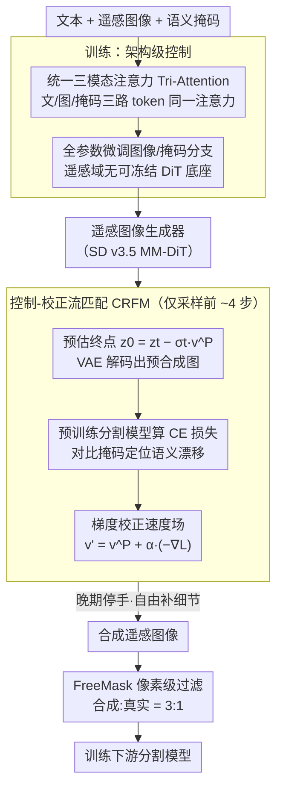

# Task-Oriented Data Synthesis and Control-Rectify Sampling for Remote Sensing Semantic Segmentation

**会议**: CVPR 2026  
**arXiv**: [2512.16740](https://arxiv.org/abs/2512.16740)  
**代码**: [GitHub](https://github.com/Yunkai-Yang/crfm)  
**领域**: 分割 / 遥感图像  
**关键词**: 遥感语义分割, 数据合成, 可控生成, 扩散模型, 流匹配

## 一句话总结

本文提出TODSynth框架，通过MM-DiT的统一三模态注意力实现文本-图像-掩码联合控制的遥感图像合成，并创新性地提出控制-校正流匹配（CRFM）方法，在采样阶段利用下游分割模型的语义损失动态调整生成轨迹，使合成数据在FUSU-4k和LoveDA上分别提升4.14%和2.08%的mIoU。

## 研究背景与动机

**领域现状**：遥感语义分割是土地利用分类、环境监测的基础任务，但构建大规模像素级标注数据集成本极高。近年来，基于扩散模型的数据合成成为扩充训练集的有前景方案，ControlNet等方法可以从语义掩码生成对应图像。

**现有痛点**：（1）**控制方案不成熟**：DiT架构的生成模型（如SD v3.5）已显著优于UNet架构，但如何有效地在DiT中注入语义掩码控制仍是开放问题。适配器方式的cross-attention控制效率低、存在模态冲突。（2）**采样质量不稳定**：即使控制方案合理，扩散/流匹配采样过程的随机性仍会导致生成图像在局部区域偏离掩码约束（语义漂移），降低合成数据对下游任务的有效性。（3）**后处理方案有限**：现有方法（如CLIP打分、FreeMask自适应过滤）都是生成后的补救措施，在复杂场景或少样本类别中，严格过滤会丢弃有用标注。

**核心矛盾**：生成模型的随机性与下游任务需要的确定性语义控制之间的矛盾。遥感图像的域差异大、缺少预训练DiT模型、精细文本描述稀缺，进一步加剧了这一矛盾。

**本文目标** （1）找到适合遥感M2I（mask-to-image）任务的DiT控制方案；（2）在采样过程中（而非生成后）纠正语义偏移，提升合成数据的任务相关性。

**切入角度**：作者观察到直接优化隐变量 $z_t$ 会导致模式崩溃，而优化速度场 $v_\Theta$ 则提供稳定的连续校正。基于此，在流匹配的早期高可塑阶段注入下游分割模型的梯度信号来校正生成轨迹。

**核心 idea**：用三模态联合注意力做架构级控制，用下游分割损失的梯度在采样早期做速度场校正（CRFM），实现任务导向的遥感数据合成。

## 方法详解

### 整体框架

TODSynth要解决的是"怎么合成出真正帮得上下游分割的遥感图像"。它把流程拆成前后衔接的两半：训练时在 SD v3.5 上把文本、图像、掩码三个模态塞进同一个注意力里（统一三模态注意力 Tri-Attention），并对图像/掩码分支做全参数微调，学一个能听懂掩码约束的遥感图像生成器；采样时不是让生成器自由发挥再事后筛选，而是在生成轨迹刚展开的几步里，借一个现成分割模型当"裁判"，用它的语义损失梯度把速度场往"更符合掩码"的方向拽一把（控制-校正流匹配 CRFM）。最后把这样合成出来的图像经 FreeMask 像素级过滤后按 3:1 掺进真实数据训练分割模型。换句话说，控制做在架构里、纠偏做在采样中，两处都围着"下游任务好不好用"这个目标转。

### 关键设计

**1. 统一三模态注意力（Tri-Attention）：把掩码当成和文本平起平坐的一路模态**

控制方案不成熟是第一个痛点：DiT 已经全面超越 UNet，但怎么在 DiT 里注入掩码控制还没有好答案。已有的两条路各有缺陷——mask-adapter 把掩码单独走一路 cross-attention，掩码既不和文本融合、表示在去噪全程还固定不变，语义没用透；Siamese 双塔的 M2I 分支只有纯掩码、丢了局部文本描述，反而削弱了解耦的好处。作者的做法很直接：在 MM-DiT 原本的文本-图像双模态联合注意力上，再加一路掩码序列 $h^m$，三路各自带独立的 $W_q, W_k, W_v$，token 拼到一起在同一个注意力里算 $h_o^t, h_o^z, h_o^m = \text{Attn}([h^t W_q^t, h^z W_q^z, h^m W_q^m], ...)$。这样掩码能直接和文本 embedding 交互，全局语义理解更强，而代价只是多了一路投影——是三模态交叉注意力里最省事的实现。

**2. 控制-校正流匹配（CRFM）：在采样途中用下游损失梯度纠偏，而不是事后补救**

第二个痛点是采样的随机性会让局部区域偏离掩码（语义漂移），而 CLIP 打分、FreeMask 这类后处理都是生成完才补救，严格过滤还会误删少样本类别的有用标注。CRFM 把纠偏前移到采样过程里：在早期某一步，先用当前状态 $z_t$ 和预测速度场 $v^P$ 一步预估终点 $z_0^t = z_t - \sigma_t v^P$，经 VAE 解码得到预合成图像 $x_0^t$，把它喂给预训练分割网络算交叉熵 $\mathcal{L}_{CE}(\mathcal{S}(x_0^t), C^m)$，再对速度场求梯度拿到校正向量 $v_{rec}' = -\nabla_{v_t} \mathcal{L}_{CE}$，最后

$$v' = v^P + \alpha \cdot v_{rec}'$$

这里有两个关键选择。一是校正对象——作者发现直接改隐变量 $z_t$ 会导致模式崩溃（多样性丧失），而改速度场是通过 ODE 积分间接更新 $z_t$，纠偏更平滑稳定。二是校正时机——只在早期几步动手：早期随机性高、可塑性强，分割模型即便预测有误，在粗粒度调整下影响也可控；越到晚期图像越定型，这时再校正等于放大分割模型的误差，容易生成对抗性扰动、把图像质量拉崩。

**3. 全参数微调图像和掩码分支：因为遥感域根本没有可冻结的 DiT 底座**

自然图像上"冻结 backbone + 加适配器"之所以好用，前提是 backbone 已经在同域预训练过。但遥感图像是俯视视角、光谱特性和尺度都和自然图像差很远，又没有任何在遥感数据上预训练好的 DiT 生成模型可借。所以作者干脆放弃轻量适配，对图像分支和掩码分支做全参数微调，让模型从分布层面充分吃透遥感图像的特殊性——这是被域差异逼出来的务实选择，代价是训练成本偏高。

### 一个完整示例：CRFM 在一步采样里怎么纠偏

设采样总步数 23、CRFM 在前 4 步生效（论文最优配置）。某早期步走到状态 $z_t$，生成器给出速度场 $v^P$：

1. **预估终点**：算 $z_0^t = z_t - \sigma_t v^P$，相当于"如果照现在这个速度一路走到底会得到什么"，再用 VAE 解码出预合成遥感图像 $x_0^t$；
2. **请裁判打分**：把 $x_0^t$ 丢进预训练分割网络 $\mathcal{S}$，和给定掩码 $C^m$ 比，算出交叉熵 $\mathcal{L}_{CE}$——比如某块本该是"建筑"的区域被生成成了"裸地"，损失就高；
3. **反传到速度场**：对 $v_t$ 求梯度得 $v_{rec}' = -\nabla_{v_t}\mathcal{L}_{CE}$，这个方向正是"让那块区域更像建筑"的修正；
4. **温和地拽一把**：更新成 $v' = v^P + \alpha\, v_{rec}'$，按校正后的速度走这一步。

前 4 步反复这样纠偏，把还没定型的语义往掩码上拉回来；第 5 步之后停手，让生成器自由补细节、不破坏画质。这一"早期纠偏、晚期放手"的节奏正是消融里 4 步最优、6 步 FID 飙到 66.95 的原因。

### 损失函数 / 训练策略

训练阶段用标准的 Rectified Flow 损失（速度场预测的 MSE）。采样阶段的校正强度由超参数 $\alpha$ 控制，CRFM 只在前若干步生效。后处理叠加 FreeMask 的像素级过滤，合成/真实数据比例为 3:1。模型在 8×RTX 4090 上训练 200K 步，分辨率 512×512，AdamW 优化器，学习率 $10^{-5}$。

## 实验关键数据

### 主实验

| 方法 | 后处理 | 合成/真实 | FUSU-4k OA | FUSU-4k mIoU | FUSU-4k mAcc |
|------|--------|----------|------------|-------------|-------------|
| Baseline (仅真实) | - | - | 74.27 | 45.27 | 56.44 |
| ControlNet (SD v1.5) | × | ×10 | 73.85 | 45.13 | 56.77 |
| FreeMask | FM | ×5 | 74.23 | 45.83 | 56.29 |
| SynthEarth | CLIP | ×5 | 75.35 | 47.53 | 58.91 |
| SD v3.5 (Tri-Attn) | FM | ×3 | 75.41 | 48.57 | 61.67 |
| **TODSynth (Ours)** | FM | **×3** | **75.66** | **49.41** | **63.27** |

LoveDA数据集：TODSynth相比baseline提升 OA +1.60% / mIoU +2.08% / mAcc +2.22%。

### 消融实验

控制策略对比（FUSU-4k）：

| 方法 | OA | mIoU | mAcc |
|------|-----|------|------|
| ControlNet (SD v1.5) | 73.85 | 45.13 | 56.77 |
| Mask-adapter | 74.94 | 47.41 | 59.62 |
| Siamese MM-attention | 74.94 | 48.46 | 61.44 |
| **Tri-Attention** | **75.41** | **48.57** | **61.67** |

CRFM步数消融（step=23）：

| CRFM步数 | mIoU | mAcc | FID |
|----------|------|------|-----|
| 0 (无校正) | 48.57 | 61.67 | 35.85 |
| 2 | 48.80 | 61.05 | 34.86 |
| **4** | **49.41** | **63.27** | 38.65 |
| 6 | 48.74 | 61.30 | 66.95 |

### 关键发现
- **DiT >> UNet**：同样是可控生成，MM-DiT方法大幅优于UNet-based的ControlNet和FreeMask，即使SynthEarth是专门的遥感生成基础模型
- **CRFM有效但需控制步数**：4步校正在mIoU/mAcc上最优；过多校正步（6步）导致FID急剧上升（66.95），说明过度校正会破坏图像质量
- **像素级过滤 > 图像级过滤**：FreeMask的像素级过滤显著优于CLIP的图像级过滤，更精细的筛选适合分割任务
- TODSynth用**更少的合成数据**（×3 vs ×5/×10）取得更好效果，体现了任务导向合成的高效性
- 直接优化隐变量导致模式崩溃，验证了校正速度场而非隐变量的设计必要性

## 亮点与洞察
- **速度场校正 vs 隐变量优化**：这是本文最核心的洞察。在流匹配框架中，优化速度场而非直接修改隐变量，避免了模式崩溃，提供了稳定的轨迹校正。这一思路可推广到其他条件生成任务
- **任务反馈驱动采样**：不像传统方法在生成后筛选，而是在生成过程中利用下游任务信号引导采样——从"生成后选优"到"生成中纠偏"的范式转变
- **早期可塑性窗口**：发现流匹配早期步骤是校正的最佳时机，晚期校正反而有害，这与扩散模型中"早期决定语义、晚期决定细节"的观察一致
- 三模态注意力的简洁实现证明了"统一融合优于解耦处理"在遥感M2I场景下的适用性

## 局限与展望
- CRFM依赖预训练分割模型的质量——如果分割模型本身在目标域上不好，校正信号可能不准确
- 目前 $\alpha$ 和CRFM步数需要手动调参，自适应调节策略可能更鲁棒
- 仅在两个遥感数据集上验证，是否对医学图像等其他标注稀缺域同样有效有待验证
- 512×512分辨率对于高分辨率遥感图像可能不够，需要探索更高分辨率的生成方案
- 全参数微调计算成本高（8×4090），LoRA等轻量微调方案的效果对比缺失

## 相关工作与启发
- **vs ControlNet**: 基于UNet的控制方案，在遥感域上效果有限。本文用DiT的Tri-Attention显著更优
- **vs FreeMask**: 后处理过滤方案，与CRFM互补。本文证明将CRFM叠加在FreeMask之上可进一步提升
- **vs SynthEarth**: 遥感生成基础模型，使用CLIP打分过滤。本文用更少数据量（×3 vs ×5）取得更好效果
- **vs 训练无关L2I编辑**: 直接优化隐变量的方法会导致模式崩溃。本文的速度场校正提供了更优的替代方案

## 评分
- 新颖性: ⭐⭐⭐⭐ CRFM速度场校正思路新颖，"生成中纠偏"的范式值得关注
- 实验充分度: ⭐⭐⭐⭐ 控制策略和CRFM超参数的消融实验充分，但仅两个数据集略显不足
- 写作质量: ⭐⭐⭐⭐ 理论推导清晰，实验框架完整
- 价值: ⭐⭐⭐⭐ 对遥感数据合成有实际价值，CRFM思路可推广到其他域

<!-- RELATED:START -->

## 相关论文

- [\[CVPR 2026\] SGMA: Semantic-Guided Modality-Aware Segmentation for Remote Sensing with Incomplete Multimodal Data](sgma_semantic-guided_modality-aware_segmentation_for_remote_sensing_with_incompl.md)
- [\[CVPR 2026\] MatchMask: Mask-Centric Generative Data Augmentation for Label-Scarce Semantic Segmentation](matchmask_mask-centric_generative_data_augmentation_for_label-scarce_semantic_se.md)
- [\[NeurIPS 2025\] FAST: Foreground-aware Diffusion with Accelerated Sampling Trajectory for Segmentation-oriented Anomaly Synthesis](../../NeurIPS2025/segmentation/fast_foreground-aware_diffusion_with_accelerated_sampling_trajectory_for_segment.md)
- [\[CVPR 2026\] F2Net: A Frequency-Fused Network for Ultra-High Resolution Remote Sensing Segmentation](f2net_a_frequency-fused_network_for_ultra-high_resolution_remote_sensing_segment.md)
- [\[CVPR 2026\] Test-Time Multi-Prompt Adaptation for Open-Vocabulary Remote Sensing Image Segmentation](test-time_multi-prompt_adaptation_for_open-vocabulary_remote_sensing_image_segme.md)

<!-- RELATED:END -->
