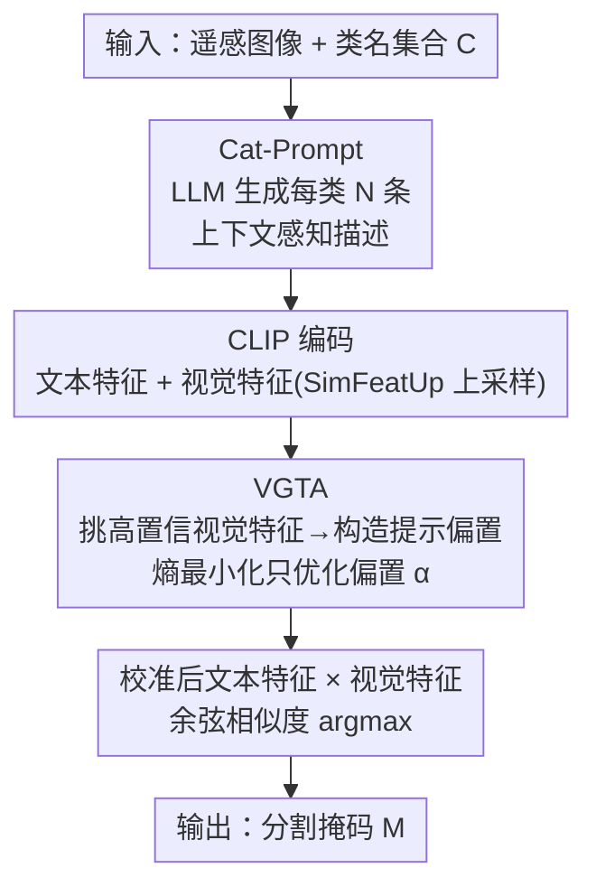

# Test-Time Multi-Prompt Adaptation for Open-Vocabulary Remote Sensing Image Segmentation

**会议**: CVPR 2026  
**论文**: [CVF Open Access](https://openaccess.thecvf.com/content/CVPR2026/html/Yang_Test-Time_Multi-Prompt_Adaptation_for_Open-Vocabulary_Remote_Sensing_Image_Segmentation_CVPR_2026_paper.html)  
**代码**: https://github.com/TiY68/TMPA  
**领域**: 语义分割 / 开放词汇 / 遥感  
**关键词**: 开放词汇分割, 遥感, 测试时自适应, 文本歧义, CLIP

## 一句话总结
针对开放词汇遥感图像分割（OVRSIS）里被忽视的"文本歧义"问题，提出即插即用的 TMPA：先用 LLM 把朴素类名扩写成多条上下文感知描述，再在推理阶段用高置信视觉特征引导地校准文本嵌入，在 17 个遥感数据集上把 SegEarth-OV 平均涨 4.6%。

## 研究背景与动机
**领域现状**：遥感图像语义分割长期是闭集设定，只能识别预定义的固定类别，遇到新建基础设施、不断演化的地物类型就抓瞎。为了打破这个限制，近期工作借助 CLIP 等视觉语言模型（VLM）开始探索开放词汇遥感分割（OVRSIS）：用任意文本描述给每个像素打标签。代表性工作如 SegEarth-OV 加了特征上采样器细化低分辨率特征、OVRS 做旋转聚合的相似度计算、RSKT-Seg 引入 DINO 增强空间表征。

**现有痛点**：这些方法清一色地在"增强视觉表征"上做文章，却几乎没人管文本侧。作者指出 OVRSIS 存在一个被忽视的关键问题——**文本歧义（textual ambiguity）**：① 同义（synonymy），视觉上相似的地物被标成不同名字（"cropland" vs "agricultural"）；② 多义（polysemy），同一个类名在不同任务里对应完全不同的视觉内容（"background" 在不同数据集含义完全不同）。实验里光是把 SegEarth-OV 的提示词从 "background" 换成 "cluster"、"road" 换成 "pavement"，分割性能就明显抖动，说明模型对文本提示极其敏感。

**核心矛盾**：OVRSIS 靠的是把图像和"类别文本描述"投到共享嵌入空间做匹配，因此文本提示的质量直接决定了对目标概念的理解。但朴素类名因为标注标准不一致、词汇变体（同义/多义）天然带歧义，破坏了图文对齐。而另一派 OVRS、RSKT-Seg 走域适应路线，需要在标注 benchmark 上训练，又有过拟合源域、可扩展性差的风险。

**本文目标**：在不需要标注、不需要重训的前提下，从文本侧入手缓解文本歧义，并对那些"图文不对齐"导致的高不确定区域加强匹配。

**切入角度**：作者观察到一个可利用的信号——预测错误的区域往往伴随高熵（高不确定性），而预测正确的区域熵低（高置信）。那么就可以拿同类里的高置信视觉特征去"拉"那些高熵区域的文本表示，把图文对齐修回来。

**核心 idea**：用"多条上下文感知文本描述 + 测试时视觉引导的文本嵌入校准"代替"单个朴素类名"，专治 OVRSIS 的文本歧义。

## 方法详解

### 整体框架
TMPA 是一个即插即用模块，可以接到现有 OVRSIS 方法（如 SegEarth-OV、CASS、ClearCLIP）上。给定遥感图像 $X \in \mathbb{R}^{H\times W\times 3}$ 和一组自然语言概念 $C=\{C_1,\dots,C_K\}$，目标是输出逐像素的语义掩码 $M$。整条流水线分两步走：第一步 **Cat-Prompt** 离线地把每个类名扩成 $N$ 条多样化、上下文感知的描述（替代朴素类名），缓解类名本身的歧义；第二步 **VGTA** 在推理时动态校准这些文本嵌入——它从当前图像里挑出高置信视觉特征，构造一个"提示偏置（prompt bias）"加到文本嵌入上，并用逐像素熵最小化损失只优化这个偏置（base 模型全程冻结）。最后用校准后的文本特征 $\tilde{F}^t_{\text{clip}}$ 和上采样视觉特征 $F^v_{\text{up}}$ 算余弦相似度取 argmax 得到掩码：$M=\arg\max_k \operatorname{softmax}(\operatorname{sim}(F^v_{\text{up}}, \tilde{F}^t_{\text{clip}}))$。

### 关键设计

**1. Cat-Prompt：用任务驱动提示让 LLM 把朴素类名扩成上下文感知描述**

朴素类名带歧义（同义/多义），直接拿去和视觉特征匹配会错位。Cat-Prompt 的做法是构造一个结构化的任务驱动提示去问 LLM（如 Gemini），让它为每个类别生成 $N$ 条（默认 5 条）多样、细致、视觉落地的一句话描述，当作该类别的"文本原型"。这个提示由三块拼成：**系统提示**定义任务目标和输出格式，引导 LLM 给出结构化、任务相关的回答；**数据集描述**提供域级和场景级上下文，让描述贴合该数据集的视觉特征；**视觉特征多样性约束**要求每条描述强调不同侧面（颜色、形状、尺寸、纹理、季节变化），且不重复措辞。论文用 WHUAerial 的 "building" 举例说明缺一不可：纯 direct prompt（无约束）给的是泛泛的字典式定义，匹配不上遥感影像；只加视觉约束会编出 "circular/curved"、"white" 这种和武汉建筑实际不符的特征；只有把视觉约束和数据集描述（场景感知文本）结合，才能准确抓住建筑的视觉模式和空间布局。这一步是离线生成、即插即用，不依赖任何标注。

**2. VGTA：用高置信视觉特征构造提示偏置，测试时熵最小化校准文本嵌入**

预生成的多提示能缓解类名歧义，但场景/任务切换时图文仍会错位，尤其是视觉相似的地物。作者观察到一条可用线索：**预测正确的区域熵低、预测错误的区域熵高**。于是 VGTA 的核心是把"高不确定区域的视觉特征"和"同类高置信区域的视觉特征"做匹配，反过来修文本表示。具体地：先用 CLIP 视觉特征和文本嵌入算每像素的类别概率 $\hat{P}=\operatorname{softmax}(F^v_{\text{clip}}(F^t_{\text{clip}})^\top)$，再算逐像素熵 $U_{x,y}=-\sum_k \hat{P}_{x,y,k}\log\hat{P}_{x,y,k}$ 作为不确定度；对第 $k$ 类，从那些被预测为 $k$、且熵低于全图均值 $\bar{U}$ 的像素里选 Top-$n$ 个最低熵位置，取它们视觉特征的均值 $\overline{f}_k$ 作为该类的高置信原型。然后把它注入文本嵌入构造校准结果：

$$\tilde{F}^t_{\text{clip}}(\alpha) = (1-\alpha)\odot F^t_{\text{clip}} + \alpha\odot\overline{F}$$

其中 $\overline{F}$ 是把各类均值视觉特征重复到和 $F^t_{\text{clip}}$ 同尺寸的矩阵，$\alpha\in[0,1]^{KN}$ 是逐描述、零初始化的可学习强度矩阵，$\alpha\odot\overline{F}$ 就是"视觉引导的提示偏置"。推理时只优化 $\alpha$（base 模型冻结），目标是逐像素熵最小化：$\min_\alpha \frac{1}{H'W'}\sum_{x,y} P_{x,y}^\top(\alpha)\log P_{x,y}(\alpha)$，其中 $P(\alpha)=\operatorname{softmax}(F^v_{\text{up}}(\tilde{F}^t_{\text{clip}}(\alpha))^\top)$。这样做的好处是：用熵当无监督信号、用同类高置信视觉特征当"锚"去拉文本嵌入，让高不确定区域的图文匹配被修正，且全程不需要标签——零初始化保证起点等于原始文本嵌入、不破坏已对齐的部分，只在需要时才注入视觉偏置。

### 损失函数 / 训练策略
唯一的优化目标就是上面那个逐像素熵最小化损失，只更新提示偏置参数 $\alpha$；base 模型（SegEarth-OV 的视觉/文本编码器，CLIP ViT-B/16）全程冻结。每张测试图只跑 3 步 Adam 优化即可。输入长边 resize 到 448，用 $224\times224$ 滑窗、步长 112 推理。

## 实验关键数据

### 主实验
在 17 个遥感数据集（8 个多类语义分割 + 9 个单类地物提取）上评测，base 取 SegEarth-OV。多类分割用 mIoU：

| 数据集 | SegEarth-OV | CASS | MLMP | TMPA(本文) | 较 SegEarth-OV |
|--------|------|------|------|------|------|
| OpenEarthMap | 39.8 | 38.2 | 35.5 | **42.2** | ↑2.4 |
| LoveDA | 36.9 | 37.0 | 30.4 | **39.7** | ↑2.8 |
| iSAID | 21.7 | 20.7 | 17.9 | **26.2** | ↑4.5 |
| Potsdam | 47.1 | 43.8 | 37.6 | **51.1** | ↑4.0 |
| Vaihingen | 29.1 | 33.5 | 27.3 | **43.4** | ↑14.3 |
| VDD | 45.3 | 42.0 | 37.56 | **49.0** | ↑3.7 |
| **平均** | 39.1 | 37.4 | 33.1 | **43.7** | **↑4.6** |

平均涨 4.6%，Vaihingen 上更是猛涨 14.3%（比 CASS 高 9.9%）；比专为自然图像 TTA 设计的 MLMP 高 10.6%，凸显自然图像与遥感的域差。单类提取（IoU）同样全面 SOTA，把分辨率从 448 升到 896 后增益更大（建筑提取 +7.9%、洪水检测 +8.6%）。

### 消融实验
在 Vaihingen / WHUAerial 上拆组件（DD=数据集描述，VF=视觉特征构造偏置）：

| 配置 | Vaihingen | WHUAerial | 说明 |
|------|------|------|------|
| baseline (SegEarth-OV) | 29.1 | 49.2 | 仅朴素类名 |
| + Cat-Prompt (w/o DD) | 32.1 | 50.4 | 仅加描述、无数据集上下文 |
| + Cat-Prompt (w/ DD) | 35.9 | 52.4 | 数据集描述额外 +3.8/+2.0 |
| + VGTA (w/o VF) | 41.3 | 54.5 | 直接学零初始化向量 |
| Full (w/ VF) | **43.4** | **55.6** | VF 偏置再 +2.1/+1.1 |

文本描述条数也做了扫描：0→1→3→5 逐步涨，5 条达峰（Vaihingen 较朴素类名 +6.8%），7 条反而因冗余/噪声略降，故默认 5 条。

### 关键发现
- **VGTA 贡献最大**：在 Cat-Prompt 基础上，VGTA 在 Vaihingen/WHUAerial 再涨 7.5%/3.2%，是单组件里增益最高的。
- **数据集描述（DD）确实有用**：去掉 DD 后两数据集各掉 3.8%/2.0%，说明场景级上下文能让生成描述更贴合视觉。
- **用视觉特征构造偏置优于盲学**：w/ VF 比 w/o VF（直接学零初始化向量）高 2.1%/1.1%，验证"高置信视觉锚"是有效的引导。
- **即插即用且通用**：接到 SCLIP / ClearCLIP / CASS 上都稳定涨，WHUAerial 上分别 +9.5% / +10.5% / +18.5%。

## 亮点与洞察
- **第一个把"文本歧义"当成 OVRSIS 一等问题**：以往全在卷视觉表征，本文反其道指出文本侧才是被忽视的瓶颈，并用"换同义词性能就抖"的实验把问题坐实，切入点新颖。
- **熵当无监督信号、视觉特征当锚**：用"错误区域高熵 / 正确区域低熵"这条几乎免费的统计规律，把同类高置信视觉特征当锚去校准文本嵌入，巧妙地在无标签下修图文对齐。
- **零初始化 + 只学偏置**：$\alpha$ 零初始化使校准起点恰好等于原文本嵌入，只在需要处注入视觉偏置，既不破坏已对齐部分，每图 3 步就收敛，开销小。
- **可迁移**：这套"LLM 扩描述 + 测试时熵驱动校准文本"的思路不限遥感，作者也提到可推广到开放词汇检测、场景解析。

## 局限与展望
- **依赖外部 LLM 生成描述**：Cat-Prompt 的质量受 LLM（Gemini）和提示模板影响，描述好坏直接传导到分割，作者未深入讨论 LLM 选择/失败模式的鲁棒性。⚠️ 描述需离线预生成，对全新数据集仍要人工提供数据集描述上下文。
- **熵最小化的固有风险**：熵最小化可能放大已有的高置信错误预测（自信地错），论文用"只取低于均值熵的高置信像素当锚"缓解，但极端域偏移下是否稳健未充分验证。
- **测试时额外开销**：虽只 3 步优化，但每张图都要前向算熵、挑 Top-$n$、再反传优化 $\alpha$，相比纯前向推理仍有额外延迟。
- **改进思路**：可探索把视觉锚的选择从"按熵阈值"换成更可靠的伪标签筛选，或对 LLM 描述做自动质量过滤以减少噪声描述。

## 相关工作与启发
- **vs SegEarth-OV / OVRS / RSKT-Seg**：它们都在增强视觉表征（特征上采样、旋转聚合、DINO），TMPA 正交地从文本侧切入，且即插即用接在它们之上还能再涨；OVRS/RSKT-Seg 还需训练易过拟合源域，TMPA 无需标注。
- **vs TPT / DiffTPT / CLIP-OT 等 VLM-TTA**：这些是为分类设计的测试时提示优化，靠跨增广视图一致性最小化边际熵；TMPA 面向像素级分割，且独创"用高置信视觉特征构造提示偏置"来修文本嵌入。
- **vs MLMP**：MLMP 把 TTA 扩到 OVSS，靠融合多层视觉特征 + 微调视觉编码器 LN 层；TMPA 不动视觉编码器，专修文本嵌入，且在遥感上比 MLMP 高 10.6%，凸显自然图像方法直接搬到遥感的域差。

## 评分
- 新颖性: ⭐⭐⭐⭐ 首个把文本歧义当 OVRSIS 核心问题，文本侧切入 + 视觉锚校准的组合新颖。
- 实验充分度: ⭐⭐⭐⭐⭐ 17 个数据集、多 base 泛化、组件/描述条数消融齐全。
- 写作质量: ⭐⭐⭐⭐ 动机用对比实验讲清楚，方法公式完整；个别句子英文表达略绕。
- 价值: ⭐⭐⭐⭐ 即插即用、无需标注、稳定涨点，对 OVRSIS 实用价值高。

<!-- RELATED:START -->

## 相关论文

- [\[CVPR 2026\] ReAttnCLIP: Training-Free Open-Vocabulary Remote Sensing Image Segmentation via Re-defined Attention in CLIP](reattnclip_training-free_open-vocabulary_remote_sensing_image_segmentation_via_r.md)
- [\[CVPR 2026\] Mixture of Prototypes for Test-time Adaptive Segmentation](mixture_of_prototypes_for_test-time_adaptive_segmentation.md)
- [\[CVPR 2026\] The Golden Subspace: Where Efficiency Meets Generalization in Continual Test-Time Adaptation](the_golden_subspace_where_efficiency_meets_generalization_in_continual_test-time.md)
- [\[CVPR 2026\] MARIS: Marine Open-Vocabulary Instance Segmentation](maris_marine_open-vocabulary_instance_segmentation.md)
- [\[CVPR 2026\] BiPA: Bilevel Prompt Adaptation for Underwater Instance Segmentation](bipa_bilevel_prompt_adaptation_for_underwater_instance_segmentation.md)

<!-- RELATED:END -->
