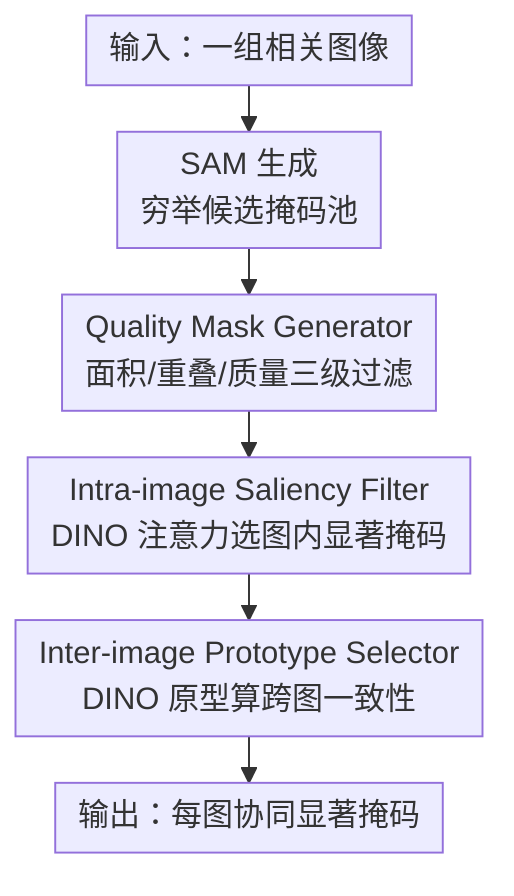

# TF-SSD: A Strong Pipeline via Synergic Mask Filter for Training-free Co-salient Object Detection

**会议**: CVPR 2026  
**论文**: [CVF Open Access](https://openaccess.thecvf.com/content/CVPR2026/html/He_TF-SSD_A_Strong_Pipeline_via_Synergic_Mask_Filter_for_Training-free_CVPR_2026_paper.html)  
**代码**: https://github.com/hzz-yy/TF-SSD  
**领域**: 协同显著目标检测 / 视觉基础模型  
**关键词**: 协同显著检测, training-free, SAM, DINO, 掩码筛选

## 一句话总结
不训练任何网络，把 SAM 生成的海量候选掩码当"原料池"，用三级质量过滤 + DINO 注意力做图内显著性 + DINO 原型做跨图语义一致性，逐级把掩码收敛成协同显著预测，在 CoCA 上比此前 training-free SOTA 高 13.7% F-measure。

## 研究背景与动机
**领域现状**：协同显著目标检测（Co-salient Object Detection, CoSOD）要在一组相关图像里，分割出"反复共同出现的那个显著物体"——比如一组"手风琴"图里都把手风琴抠出来。主流做法是 training-based：在带标注的闭集数据上监督训练一个共识提取网络。

**现有痛点**：监督方法被闭集数据集绑死，泛化能力有限，容易过拟合到训练集的类别偏置；而 CoSOD 的本质要求是"发现可泛化的视觉共识"，这两者存在根本性错配。作者还观察到，视觉基础模型（VFM）在 CoSOD 上几乎没人系统探索过。

**核心矛盾**：作者做了一个关键的 oracle 实验——如果用 GT 引导，从 SAM 的 top-10 掩码里挑出最佳掩码，在 CoCA 上的分割性能竟然超过所有现有 SOTA（包括全监督）。这说明 **SAM 的分割能力本身足够好，瓶颈不在"切得准不准"，而在 SAM 缺乏语义理解、不知道哪个掩码才是跨图共有的那个显著物体**。

**切入角度**：SAM 和 DINO 天然互补——SAM 边界精确但随机生成一堆无语义的碎片，DINO 自监督特征/注意力图对显著物体有强语义一致性但定位粗糙。把两者拼起来：DINO 的语义引导去消解 SAM 的随机性，SAM 的精确边界去落实 DINO 的粗定位。

**核心 idea**：不训练，把 SAM 的穷举掩码当候选池，在 DINO 引导下分两个层级（图内视觉显著性 + 图间语义一致性）渐进式过滤，得到协同显著掩码。

## 方法详解

### 整体框架
TF-SSD 是一条纯推理的渐进式流水线：对组内每张图 $I_n$，先用 SAM（ViT-H）生成穷举候选掩码 $M^{raw}_n$，再经过三个组件逐级收窄。**Quality Mask Generator (QMG)** 用掩码自身的面积/重叠/质量分把成百上千的碎掩码砍到精炼集 $M^{refine}_n$（约 10 个）；**Intra-image Saliency Filter (ISF)** 借 DINO 的 [CLS] 注意力图，在单张图内挑出真正"显眼"的掩码 $M^{salient}_n$（约 6 个）；**Inter-image Prototype Selector (IPS)** 用 DINO 提取每个掩码的语义原型，在整组图之间算相似度，选出"在别的图里也都能找到对应物"的那个掩码作为最终协同显著预测 $Y$。整条链可以概括为：候选爆炸 → 凭掩码内禀属性瘦身 → 凭图内显著性瘦身 → 凭图间共识定案。

### 关键设计

**1. Quality Mask Generator（QMG）：先用掩码自身属性把噪声砍掉九成**

SAM 对一张显著前景物会吐出大量极小、重叠、尺寸离谱的掩码，绝大多数和协同显著物无关。QMG 不引入任何语义，只靠掩码的内禀几何属性做三级渐进过滤。第一级 **SAM-based 初筛**：算面积占比 $r^{area}_{n,t}=\frac{|m^{raw}_{n,t}|}{H\times W}$，把 $r^{area}_{n,t}<\tau_{area}$（$\tau_{area}=0.01$）的"琐碎掩码"全丢掉。第二级 **重叠过滤**：把掩码按面积升序排，对每个小掩码算它与更大掩码的重叠率 $\rho_{i\to j}=\frac{|m_{n,i}\cap m_{n,j}|}{|m_{n,j}|}$，若与任一更大掩码的重叠率超过 $\tau_{con}=0.85$ 就删掉（保大去小，避免同物体被多个嵌套掩码重复表示）。第三级 **质量评估**：SAM 自带预测 IoU 分 $IoU^{pred}_{n,t}$，作者再补一个面积分——显著物通常是"中等大小"而非极端尺寸，于是

$$S^{area}_{n,t}=\begin{cases}1.0 & r_{min}\le r^{area}_{n,t}\le r_{max}\\ r^{area}_{n,t}/r_{min} & r^{area}_{n,t}<r_{min}\\ P(r^{area}_{n,t}) & r^{area}_{n,t}>r_{max}\end{cases}$$

其中 $P(r^{area}_{n,t})=\max(\sigma,\,1.0-(r^{area}_{n,t}-r_{max})\times\gamma)$ 是对超大掩码的惩罚（$[r_{min},r_{max}]=[0.15,0.7]$，$\sigma=0.7,\gamma=1.5$）。再与 IoU 分加权融合成 $S^{ba}_{n,t}=\alpha\cdot IoU^{pred}_{n,t}+\beta\cdot S^{area}_{n,t}$（$\alpha=0.7,\beta=0.3$），取 top $T_r=10$ 进入下一阶段。这一步纯靠"掩码长什么样"就把候选从成百上千压到 10 个，是整条流水线的地基。

**2. Intra-image Saliency Filter（ISF）：借 DINO 注意力补上 SAM 缺的"显著性语义"**

QMG 过滤后的掩码质量高，但 SAM 不知道哪个才是"显眼"的物体——它对背景的某块墙和前景的手风琴一视同仁。作者利用一个已被验证的现象：DINO 的 [CLS] token 注意力图无需监督就能高亮显著物。具体地，从 DINO ViT 编码器取注意力图 $A_n\in[0,1]^{h\times w}$，对每个候选掩码 $m^{refine}_{n,t}$ 算它落在高注意力区域的均值响应作为显著性分：

$$s^{sal}_{n,t}=\frac{1}{|m^{refine}_{n,t}|}\sum A_n(x,y)\odot m^{refine}_{n,t}(x,y)$$

掩码与显著区重叠越多得分越高（论文 Fig.4 里手风琴本体的 Mask 1 高分，背景碎块的 Mask 2/3 因不重叠几乎 0 分）。按 $s^{sal}_{n,t}$ 取 top $T=6$ 得到单图显著掩码集 $M^{salient}_n$。这一步把"几何上干净"升级为"语义上显眼"，是性能第二次大跳的来源。

**3. Inter-image Prototype Selector（IPS）：用跨图原型相似度定案"哪个才是协同的"**

ISF 解决了单图内"谁显著"，但一张图里可能有多个显著物，必须靠整组图的共识来判断"哪个才是大家共有的"。IPS 给每个显著掩码抠出语义原型 $p_{n,t}=F(I_n\odot m_{n,t})$（$F$ 即取 DINO 的 [CLS] token），堆成 $P\in\mathbb{R}^{NT\times d}$，算成对余弦相似度矩阵 $C=\frac{PP^\top}{\|P\|^2}$。关键在打分方式：把矩阵 reshape 后**剔除同图内部的相似（与跨图一致性无关）**，对每个原型，在除自己外的每张图里取**最大**相似度，再把这 $N-1$ 个最大值求和得到协同显著分 $s^{co}=\sum_{n=1}^{N-1}C_{N-1max}[:,n]$。每张图里挑 $s^{co}$ 最高的那个掩码作为最终预测。这里"取最大而非取平均"是刻意设计——同类物体在不同图里只要有一个强匹配就说明语义对得上，平均会被同图里的干扰掩码稀释（消融里 Max 比 Avg 在 CoSal2015 上高 12.4% F-measure）。

> ⚠️ **框架↔关键设计一致**：流水线里点名的四个东西——SAM（候选生成，是脚手架）、QMG、ISF、IPS——三个贡献组件都对应上面三个设计；DINO 不是独立模块，而是 ISF（注意力）和 IPS（原型）共用的特征/注意力来源，已在两个设计里交代。

### 一个完整示例
以一组 $N=3$ 张手风琴图、ISF 后每图保留 $T=3$ 个掩码为例（论文 Fig.5）：先得到 $3\times3=9$ 个原型，算出 $9\times9$ 相似度矩阵。对图 $I_1$ 的候选 $p_{1,1}$，分别在 $I_2$、$I_3$ 的三个候选里各取一个**最大**相似度（图中深红格），把这 2 个最大值相加得 $p_{1,1}$ 的协同分；对 $I_1$ 的另外两个候选同理。$I_1$ 里协同分最高的掩码即为它的最终输出，三张图各自选出一个，构成整组的协同显著预测。整个过程没有任何参数更新——只有 SAM 推理 + DINO 推理 + 矩阵运算。

## 实验关键数据

### 主实验
三个基准（CoCA / CoSal2015 / CoSOD3k），与全监督（S）、无监督（U）、training-free（TF）方法对比。下表摘 CoCA 与 CoSal2015 的 $F^{max}_\beta$ / $S_\alpha$。

| 方法 | 类型 | CoCA $F_\beta$↑ | CoCA $S_\alpha$↑ | CoSal2015 $F_\beta$↑ | CoSal2015 $S_\alpha$↑ |
|------|------|------|------|------|------|
| GCoNet+ (TPAMI23) | S | 0.637 | 0.738 | 0.891 | 0.881 |
| VCP (CVPR25) | S | 0.680 | 0.774 | 0.920 | 0.911 |
| SCoSPARC (ECCV24) | U | 0.614 | 0.711 | 0.869 | 0.851 |
| ZS-CoSOD (ICASSP24) | TF | 0.549 | 0.667 | 0.799 | 0.785 |
| **TF-SSD (本文)** | TF | **0.686** | **0.763** | **0.899** | **0.890** |

关键对比：相比此前 training-free SOTA（ZS-CoSOD），在 CoCA 上 $F^{max}_\beta$ +13.7%、$S_\alpha$ +9.6%、MAE +3.8%；在 CoSal2015 上 $F^{max}_\beta$ +10.0%。同时不训练就追平甚至超过部分全监督方法（在 CoSal2015 上 $F_\beta$ 0.899 已接近 VCP 的 0.920，$S_\alpha$ 反超多数监督方法）。

### 消融实验
三级 QMG + ISF + IPS 在 CoCA 上的逐组件消融（baseline = QMG-1 + IPS，否则无法得到最终预测）。

| 配置 | CoCA $F_\beta$↑ | CoCA $S_\alpha$↑ | 说明 |
|------|------|------|------|
| QMG-1 + IPS | 0.447 | 0.578 | 仅初筛，SAM 噪声掩码太多 |
| + QMG-2 | 0.497 | 0.650 | 加重叠过滤，去冗余 |
| + QMG-3 | 0.522 | 0.634 | 加质量评估，第一次明显提升 |
| + ISF（Full） | **0.686** | **0.763** | DINO 显著性，性能跃至 SOTA |

IPS 选择策略（Eq.9）与 ISF 掩码数 $T$ 的消融：

| 配置 | 关键指标 | 说明 |
|------|---------|------|
| IPS: Avg | CoSal2015 $F_\beta$ 0.775 | 跨图取平均相似度 |
| IPS: Max | CoSal2015 $F_\beta$ 0.899 | 取最大，+12.4%，语义关联更强 |
| ISF: $T=6$ | CoCA $F_\beta$ 0.686 | 最优 trade-off |
| ISF: $T=10$ / $T=5$ | 0.616 / 0.667 | 留太多引噪、留太少过滤过度 |

### 关键发现
- **加 ISF（DINO 注意力）是最大单步增益**：相比只有三级 QMG 的 row 3，ISF 在 CoCA 上把 $F^{max}_\beta$ 拉高 16.4%、$S_\alpha$ 拉高 12.9%，印证"SAM 缺的就是显著性语义，DINO 正好补上"这一核心论断。
- **IPS 里"取最大而非平均"很关键**：同类物在不同图里只要有一个强匹配就够，平均会被同图干扰掩码稀释（+12.4% $F_\beta$）。
- **$T=6$ 是甜区**：留太多掩码引入噪声、留太少过度过滤，呈现典型的 recall/noise 权衡。
- 整套方法单卡 4090 即可跑，无需任何训练，工程门槛极低。

## 亮点与洞察
- **Oracle 实验先立靶再设计**：先用 GT 证明"SAM 的掩码上界已超 SOTA"，把问题从"怎么分割得更准"重定义为"怎么从穷举掩码里挑对那一个"，整个方法据此顺理成章——这种先量化瓶颈再对症下药的叙事很值得学。
- **SAM 管边界、DINO 管语义的互补范式**：把两个 VFM 各自的强项拼成一条 training-free 流水线，不引入任何可学习参数就打过监督方法，是"基础模型组合优于专门训练"的一个干净案例。
- **渐进式三级过滤**：几何属性 → 图内显著 → 图间共识，每一级用的信息源和判据都不同且单调收窄，这种"分层降噪"的思路可迁移到任何"候选爆炸 + 需多准则筛选"的任务（如开放词表检测的 proposal 后处理）。

## 局限与展望
- 性能上界被 SAM/DINO 的能力天花板锁死：若 SAM 根本没在候选池里生成那个协同物，后续再聪明也救不回来（作者也提到值得探索 VFM 能否给出更好的显著提示）。
- ⚠️ 大量阈值/超参（$\tau_{area},\tau_{con},r_{min},r_{max},\sigma,\gamma,\alpha,\beta,T_r,T$）靠手工设定，跨数据集是否稳健、对超参的敏感性论文只给了 $T$ 的曲线，其余未充分展开。
- IPS 假设"组内只有一个共有类别"，对一组图里存在多个协同物或类别混杂的场景适配性存疑。
- 推理时要对每张图跑 SAM 全图分割 + DINO 编码，候选规模大时算力开销不低（虽无训练，但单图推理成本高于轻量监督模型）。

## 相关工作与启发
- **vs ZS-CoSOD（ICASSP24，training-free）**：ZS-CoSOD 用基础模型生成"组 prompt"再去 prompt SAM；本文反过来，让 SAM 先穷举、再用 DINO 的注意力+原型逐级筛选。本文把"语义理解"放在筛选端而非提示端，CoCA 上高 13.7% $F_\beta$。
- **vs VCP（CVPR25，监督）**：VCP 把视觉共识嵌入 prompt 做参数高效微调，仍需训练；本文完全不训练却在 CoSal2015 上接近它，证明 VFM 组合可逼近监督上限。
- **vs SCoSPARC（ECCV24，无监督）**：两者都不用标注，但 SCoSPARC 仍要两阶段自监督训练特征对应；本文连无监督训练都省了，纯推理拼装。

## 评分
- 新颖性: ⭐⭐⭐⭐ 用 oracle 实验重定义问题 + SAM/DINO 互补的 training-free 范式，组合巧但单个组件机制偏工程
- 实验充分度: ⭐⭐⭐⭐ 三基准、四指标、组件/策略/超参三类消融齐全，缺更系统的超参敏感性
- 写作质量: ⭐⭐⭐⭐ 动机推导清晰、Fig.2 oracle 立靶有力，公式与流程交代完整
- 价值: ⭐⭐⭐⭐ 不训练即超 SOTA、单卡可跑，作为强 baseline 实用性高

<!-- RELATED:START -->

## 相关论文

- [\[CVPR 2026\] Generalizable Co-Salient Object Detection via Mixed Content-Style Modulation](generalizable_co-salient_object_detection_via_mixed_content-style_modulation.md)
- [\[CVPR 2026\] Uncertainty-Aware Modality Fusion for Unaligned RGB-T Salient Object Detection](uncertainty-aware_modality_fusion_for_unaligned_rgb-t_salient_object_detection.md)
- [\[CVPR 2025\] Visual Consensus Prompting for Co-Salient Object Detection](../../CVPR2025/segmentation/visual_consensus_prompting_for_co-salient_object_detection.md)
- [\[CVPR 2026\] Training-Free Open-Vocabulary Camouflaged Object Segmentation via Fine-Grained Object Binding and Adaptive Hybrid Prompt](training-free_open-vocabulary_camouflaged_object_segmentation_via_fine-grained_o.md)
- [\[CVPR 2026\] INSID3: Training-Free In-Context Segmentation with DINOv3](insid3_training-free_in-context_segmentation_with_dinov3.md)

<!-- RELATED:END -->
