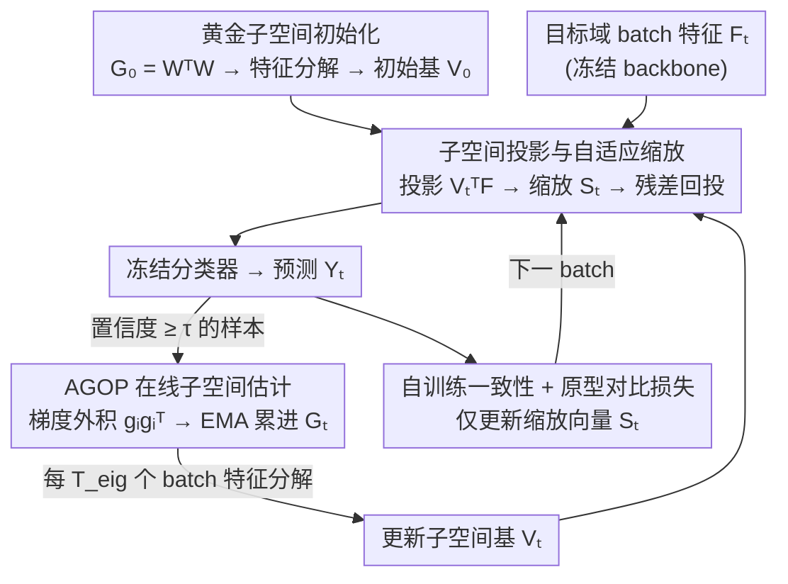

# The Golden Subspace: Where Efficiency Meets Generalization in Continual Test-Time Adaptation

**会议**: CVPR 2026  
**arXiv**: [2603.21928](https://arxiv.org/abs/2603.21928)  
**代码**: [https://github.com/AIGNLAI/GOLD](https://github.com/AIGNLAI/GOLD)  
**领域**: 持续测试时适应 / 域适应  
**关键词**: 持续测试时适应, 黄金子空间, AGOP, 低秩适应, 分类器行空间

## 一句话总结

提出 GOLD 框架用于持续测试时适应（CTTA），核心发现是最小特征更新子空间（"黄金子空间"）与分类器权重行空间一致且天然低秩；通过 Average Gradient Outer Product (AGOP) 在线估计该子空间，结合轻量缩放向量进行特征适应，在分类和分割基准上以极低计算开销达到 SOTA 性能。

## 研究背景与动机

**领域现状**：持续测试时适应（CTTA）要求模型在部署时面对不断变化的未标注目标数据流，在不回访源数据的情况下持续在线适应。代表性方法包括：CoTTA（教师-学生框架 + 随机权重恢复）、PETAL（参数恢复正则化）、RMT/SANTA（特征级一致性）、DSS（伪标签过滤）等。

**现有痛点**：CTTA 面临效率-泛化的根本权衡——更新更多参数可以提升适应能力，但大幅降低在线推理效率，同时放大伪标签噪声和参数漂移。如图 1(b) 所示，当新域到来时，现有方法出现明显的性能骤降（"golden-shaded intervals"），无法在保持泛化的同时快速适应。

**核心矛盾**：理想目标是在特征子空间内实现所需的输出变化（保证泛化），同时最小化更新幅度（保证效率）。关键问题是：这个"最小子空间"是否存在？如何定义和维护？

**本文目标**（1）证明"黄金子空间"的存在——即最小特征更新子空间与分类器权重行空间重合且低秩；（2）找到一种无需重训练分类器就能在线估计该子空间的方法；（3）设计一个实际的轻量适应框架。

**切入角度**：作者从单步适应的最优解出发进行代数分析。对于冻结分类器 $W$ 和期望的输出修正 $\Delta Y$，最小范数特征更新的解为 $\Delta F^* = \Delta Y (W^\top)^\dagger$，其秩受 $\text{rank}(W^\top W)$ 约束——在分类任务中这等于类别数，远小于特征维度。这意味着只需要分类器定义的少数方向就足以修改整个批次的预测。

**核心 idea**：特征空间中由分类器权重定义的低秩行空间就是最小有效适应子空间（黄金子空间），可用 AGOP 在线估计并高效维护。

## 方法详解

### 整体框架

GOLD 想回答一个很具体的问题：在持续测试时适应里，模型到底应该「往哪个方向、改多少」才能既跟上新域又不拖垮在线效率？它的答案是把所有更新都锁进一个由分类器几何决定的低秩子空间里。整套方法挂在一个**冻结**的预训练特征提取器之上，每来一个目标域 batch，就在两件事之间交替：先用一个极小的缩放向量在「黄金子空间」内微调一下当前 batch 的特征（Adapt），再用这一批里置信度高的样本去在线修正子空间本身的估计（Update）。前者负责实时适应，后者负责让子空间随目标域慢慢漂到该去的地方，两者轮流推进，全程不碰 backbone、也不重训分类器。

### 关键设计

**1. 黄金子空间的理论证明与初始化：先用代数证明「最小有效更新方向」确实存在且低秩**

CTTA 的核心两难是更新越多越能适应、但效率越差、漂移越大，所以作者干脆从「最省的更新是什么」反推。固定冻结分类器 $W \in \mathbb{R}^{C \times L}$，若想把输出修正 $\Delta Y$，使范数最小的特征更新解析解是 $\Delta F^* = \Delta Y (W^\top)^\dagger$。对 $W^\top = V \Sigma U^\top$ 做 SVD 就能看出，这个最优更新被牢牢限制在 $W$ 的主特征向量张成的子空间内，且 $\text{rank}(\Delta F^*) \leq \text{rank}(W^\top W)$——在分类任务里这个秩等于类别数 $C$，通常远小于特征维度 $L$。换句话说，只要沿着分类器自己定义的那几十个方向去推特征，就足以改写整批样本的预测，根本用不上全参数更新。这给了「黄金子空间」一个干净的落脚点，也顺带解释了为什么这种约束天然抑制参数漂移、压住伪标签噪声的放大。具体落地时，辅助矩阵直接初始化为 $G_0 = W^\top W$，让子空间从分类器的源域几何起步。

**2. AGOP 在线子空间估计：不重训分类器，也能让子空间随目标域漂移**

光有源域的 $W^\top W$ 还不够——它只编码了源域信息，目标域让分类器「困惑」的新方向它看不见。问题是分类器是冻结的，没法靠重训去更新它。作者借的是 AGOP 定理：训练好的网络里，层权重的谱结构与样本梯度外积的均值成正比，于是可以反过来用梯度外积去逼近这套几何。在 CTTA 里，只挑高置信样本（$\max_c \text{Softmax}(Y)_{i,c} \geq \tau$）算一个梯度代理 $g_i = \nabla_{f_i}(\max_c h_\psi(f_i)_c)$，拼成这一批的 AGOP

$$\hat{G}_t^{(b)} = \frac{1}{|\mathcal{M}_t|} \sum_{i \in \mathcal{M}_t} g_i g_i^\top,$$

再用 EMA 把它和历史融合 $G_t = (1-\alpha) G_{t-1} + \alpha \hat{G}_t^{(b)}$，每隔 $T_\text{eig}$ 个 batch 才做一次特征分解、取前 $r$ 个特征向量当作当前子空间基 $V_t$。这样梯度方向就成了分类器的无监督代理——它反映的正是目标域样本此刻在分类器上的响应方向，把目标域信息隐式注回了子空间。论文报告这个估计收敛得很快，少量样本后子空间相似度就能稳到 >0.98 ⚠️ 以原文为准。

**3. 子空间投影与自适应缩放：把全部可学习参数压到只有 $r$ 个**

有了子空间基 $V_t$，真正的特征适应反而做得极轻。对一个特征 $f \in \mathbb{R}^L$，先投影到子空间拿到坐标 $u = V_t^\top f \in \mathbb{R}^r$，沿每个坐标做一次逐元素缩放，再残差映射回原空间：

$$\mathcal{A}(f) = f + V_t\big(S_t \odot (V_t^\top f)\big),$$

整批写成矩阵形式就是 $F_t^\text{adapt} = F_t + (S_t \odot (F_t V_t)) V_t^\top$。这里全部可学习量就是那条缩放向量 $S_t \in \mathbb{R}^r$（实验取 $r = 64$）。这么设计有三层好处：当 $S_t = 0$ 时整个变换退化成恒等映射，意味着适应是从「什么都不改」零起步、逐步增强，最坏也不劣于不适应；只有 $r$ 个参数（对比更新 BN 的数千个、整网的上百万个）几乎堵死了过拟合和漂移的空间；而投影操作本身又保证了任何更新都只能发生在黄金子空间内，和设计 1 的理论约束严丝合缝。

### 一个完整示例：一个 batch 怎么走完 Adapt + Update

以 CIFAR100-C（$C=100$、特征维 $L$ 较大、取 $r=64$）为例，看看部署中某一个 batch 的流转。**起点**：$G_0 = W^\top W$ 已初始化，对它特征分解得到初始 $V_0$，缩放向量 $S_0 = 0$。**Adapt**：新 batch $F_t$ 进来，先投影到子空间 $F_t V_t$（把高维特征压到 64 维坐标），用当前 $S_t$ 逐元素缩放后残差加回，得到 $F_t^\text{adapt}$ 再送进冻结分类器出预测——此刻若 $S_t$ 还接近 0，输出几乎等于原模型，不会贸然改写。**Update**：从这批里挑出 Softmax 置信度 $\geq \tau$ 的样本，算它们的梯度代理 $g_i$、拼出 $\hat{G}_t^{(b)}$，EMA 进 $G_t$；同时用自训练一致性损失和原型对比损失反传，**只更新** $S_t$（外加少量 BN 参数），让缩放向量学会在这几十个方向上该放大还是压低。**漂移**：连续 $T_\text{eig}$ 个 batch 后才重新对 $G_t$ 做一次特征分解，把子空间基从 $V_{t-1}$ 更新到 $V_t$——子空间于是随目标域缓慢转向，而不是每步抖动。新域到来时就这样重复，靠 64 个参数 + 周期性子空间刷新一路跟下去。

### 损失函数 / 训练策略

总损失 $\mathcal{L} = \lambda_\text{trg} \mathcal{L}_\text{st} + \lambda_\text{cont} \mathcal{L}_\text{cont}$：

- **自训练一致性损失**：使用 EMA 教师模型，对原始视图和增强视图分别计算 SCE 损失：$\mathcal{L}_\text{st} = \frac{1}{2} \text{SCE}(Y_t, Y_t^\text{ema}) + \frac{1}{2} \text{SCE}(Y_t^+, Y_t^\text{ema})$，增强视图提升鲁棒性
- **原型对比损失**：源域类原型 $P_c$ 预计算并冻结，对每个样本找最近原型，用 InfoNCE 损失拉近原始和增强视图特征到对应原型：$\mathcal{L}_\text{cont} = -\frac{1}{2|\mathcal{B}|} \sum_{i} [\log \frac{\exp(\text{sim}(f_i, P_{k(i)})/\kappa)}{\sum_c \exp(\text{sim}(f_i, P_c)/\kappa)} + \text{augmented view term}]$
- 梯度只更新缩放向量 $S_t$ 和少量 BN 参数

## 实验关键数据

### 主实验

CIFAR10/100-C 和 ImageNet-C 在线分类错误率（%，severity 5）：

| 方法 | CIFAR10-C | CIFAR100-C | ImageNet-C |
|------|-----------|------------|------------|
| TENT | 20.7 | 60.9 | 62.6 |
| CoTTA | 16.2 | 32.5 | 62.7 |
| SANTA | 16.1 | 30.4 | 60.1 |
| OBAO | 14.6 | 29.5 | 59.6 |
| **GOLD** | **14.1** | **28.6** | **59.3** |

CarlaTTA 语义分割 mIoU (%)：

| 方法 | day2night | clear2fog | clear2rain | highway |
|------|-----------|-----------|------------|---------|
| Source | 58.4 | 52.8 | 71.8 | 24.7 |
| CoTTA | 61.4 | 56.8 | 70.7 | 33.8 |
| **GOLD** | **61.8** | **57.1** | 71.0 | **34.5** |

### 消融实验

| $W^\top W$ 初始化 | AGOP 更新 | $\mathcal{L}_\text{cont}$ | CIFAR10-C | CIFAR100-C | ImageNet-C |
|:---:|:---:|:---:|-----------|------------|------------|
| - | - | - | 16.24 | 29.87 | 62.45 |
| ✓ | - | - | 15.11 | 29.15 | 60.24 |
| ✓ | ✓ | - | 15.06 | 28.77 | 59.87 |
| - | ✓ | ✓ | 14.32 | 28.61 | 59.52 |
| ✓ | ✓ | ✓ | **14.12** | **28.56** | **59.32** |

### 关键发现

- **$W^\top W$ 初始化即可带来明显提升**：CIFAR10-C 从 16.24 降到 15.11，验证了理论——分类器行空间确实是有效的适应方向
- **AGOP 在线更新进一步提升**，但收益叠加在初始化之上而非替代——两者互补，初始化提供源域几何，AGOP 注入目标域信息
- **对比损失的贡献在 CIFAR10-C 上最显著**（15.06→14.12），说明原型锚定对防止小数据集漂移尤为重要
- **AGOP 的谱能量高度集中**：top 64-128 特征向量捕获 >99% 的能量，验证了黄金子空间的低秩性
- **AGOP 收敛极快**：初始化后少量批次即达 >0.8 的子空间相似度，稳定后 >0.98
- **推理效率极高**：GOLD 每批次处理时间约 0.25 秒，与最快的 SANTA 方法相当，但性能显著更好（14.1 vs 16.1 on CIFAR10-C）
- **分割任务中 GOLD 同样有效**：在 CarlaTTA 的 highway 场景（涉及协变量偏移和标签分布偏移）上超越 CoTTA 0.7%

## 亮点与洞察

- **理论驱动的算法设计**：先证明"黄金子空间存在且低秩"，再发现 AGOP 可以在线估计它，最后设计 GOLD 框架——整个推导环环相扣，理论与实践紧密结合。这种"先证明再设计"的研究范式值得学习。
- **只需 64 个可学习参数做适应**：缩放向量 $S_t \in \mathbb{R}^{64}$——这可能是 CTTA 领域最少参数的方法之一，却获得了最好的性能。极低参数量自然抑制了过拟合和参数漂移，是一种"约束即正则化"的巧妙思路。
- **AGOP 作为分类器的无监督代理**是方法论上的重要贡献。它提供了一种从测试样本的梯度信息中隐式获取类似分类器权重结构的方法，无需标签。该技术可迁移到其他需要在线维护核心子空间的场景（如在线学习、增量学习）。
- **残差缩放设计**简洁有效：$S_t = 0$ 时恒等变换，$S_t \neq 0$ 时仅在子空间内做微调——这保证了最坏情况下不劣于不适应。

## 局限与展望

- 每 $T_\text{eig}$ 步的特征分解计算开销未详细分析——当特征维度 $L$ 很大时可能成为瓶颈
- 实验仅用 severity 5 评估，未报告中低 severity 下的表现——GOLD 在温和域偏移下是否仍有优势？
- 类原型 $P_c$ 来自源域且冻结，在目标域类别分布严重偏移时可能不是好的锚点
- 未与 prompt-based 适应方法（如 VPT、Adapter-TTA）进行对比
- AGOP 依赖高置信样本（$\tau$ 阈值），在严重域偏移导致所有样本低置信时可能失效
- 分割任务上的优势相对分类较小（0.7% vs 2.1%），低秩假设在密集预测中的适用性可进一步探讨

## 相关工作与启发

- **vs CoTTA**: CoTTA 通过教师-学生 + 随机权重恢复抑制遗忘，但更新整个网络导致效率低且漂移大。GOLD 只更新 64 个参数且理论保证在最优子空间内操作，效率和稳定性都更好
- **vs TENT/EATA/SAR**: 这些方法通过熵最小化或自适应 BN 统计适应，但缺乏对"应该在哪个方向更新"的理论指导。GOLD 的黄金子空间直接回答了这个问题
- **vs RFM/AGOP 理论工作**: AGOP 原本用于特征学习的可解释性分析，GOLD 首次将其应用于在线测试时适应，建立了梯度外积与分类器几何的桥梁——这是一个有趣的理论-应用交叉

## 评分

- 新颖性: ⭐⭐⭐⭐⭐ "黄金子空间"的形式化和 AGOP 在线估计的结合极具原创性，理论优美
- 实验充分度: ⭐⭐⭐⭐ 三个分类基准 + 分割基准 + 效率分析 + 完整消融，但缺少不同 severity 和大规模模型实验
- 写作质量: ⭐⭐⭐⭐⭐ 从理论推导到算法设计到实验验证的叙述极其流畅，数学推导清晰
- 价值: ⭐⭐⭐⭐⭐ 为 CTTA 提供了理论基础和高效实用的解决方案，黄金子空间的概念有广泛启发价值

<!-- RELATED:START -->

## 相关论文

- [\[CVPR 2026\] Test-Time Multi-Prompt Adaptation for Open-Vocabulary Remote Sensing Image Segmentation](test-time_multi-prompt_adaptation_for_open-vocabulary_remote_sensing_image_segme.md)
- [\[CVPR 2026\] Mixture of Prototypes for Test-time Adaptive Segmentation](mixture_of_prototypes_for_test-time_adaptive_segmentation.md)
- [\[ICCV 2025\] Hybrid-TTA: Continual Test-time Adaptation via Dynamic Domain Shift Detection](../../ICCV2025/segmentation/hybrid-tta_continual_test-time_adaptation_via_dynamic_domain_shift_detection.md)
- [\[ICCV 2025\] TopoTTA: Topology-Enhanced Test-Time Adaptation for Tubular Structure Segmentation](../../ICCV2025/segmentation/topotta_topology-enhanced_test-time_adaptation_for_tubular_structure_segmentatio.md)
- [\[CVPR 2026\] BiPA: Bilevel Prompt Adaptation for Underwater Instance Segmentation](bipa_bilevel_prompt_adaptation_for_underwater_instance_segmentation.md)

<!-- RELATED:END -->
