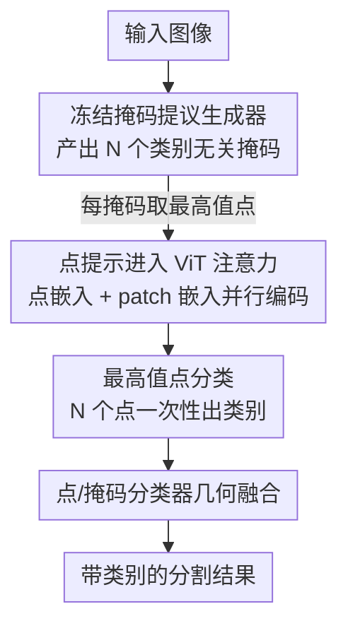

# The Missing Point in Vision Transformers for Universal Image Segmentation

**会议**: CVPR 2026  
**论文**: [CVF Open Access](https://openaccess.thecvf.com/content/CVPR2026/html/Shahabodini_The_Missing_Point_in_Vision_Transformers_for_Universal_Image_Segmentation_CVPR_2026_paper.html)  
**代码**: https://github.com/sajjad-sh33/ViT-P  
**领域**: 通用图像分割  
**关键词**: 通用分割、掩码分类、ViT 适配器、点提示、标注成本

## 一句话总结
本文指出当前掩码分割模型（Mask2Former/OneFormer 等）的瓶颈不在掩码生成而在掩码分类，提出 ViT-P——一个把掩码生成与分类解耦的两阶段框架：冻结的提议生成器产出类别无关掩码，再用基于 ViT 的「点分类器」对每个掩码的最高值点做分类，在 ADE20K 全景 54.0 PQ、Cityscapes 语义 87.4 mIoU 等多个基准刷到 SOTA。

## 研究背景与动机
**领域现状**：自 MaskFormer 起，主流分割范式从「逐像素分类」转向「掩码分类」——模型预测一组二值掩码，每个掩码配一个类别标签。Mask2Former、OneFormer、InternImage 等沿着这条路不断改进，掩码质量已经相当高。

**现有痛点**：作者观察到一个被普遍忽视的事实——这些模型「掩码生成得不错，但分类经常出错」。当物体边界模糊、类别分布不均衡时，掩码被贴错标签的情况很常见，而这直接拖垮了整体分割指标。论文给了一个极具说服力的数字：InternImage 在 ADE20K 语义分割上只有 62.9% mIoU，但若把它生成的掩码用 ground-truth 标签「完美分类」（upper bound），mIoU 直接飙到 87%。这 24 个点的鸿沟几乎全部来自分类，而非掩码本身。

**核心矛盾**：现有掩码分割模型用同一套 per-segment embedding 既生成掩码又预测类别，两个任务被强行耦合在一个 transformer decoder 里。掩码生成需要捕捉空间细节，分类需要语义判别，二者共享表示时分类能力被压制——这就是标题里「The Missing Point（缺失的那个点）」所指的瓶颈。

**切入角度**：作者发现，与其对整张掩码做分类，不如只盯掩码内部「最高值点」这一个像素来分类。这个最高值点往往落在掩码中心附近、远离模糊边界，分类起来更可靠；只要这个点分对，整张掩码的类别就基本对了。upper bound 实验也正是用 ground-truth 掩码里最高值点的标签做出来的，证明这个点确实是「决定性的点」。

**核心 idea**：把掩码生成与分类彻底解耦——第一阶段用冻结的提议生成器产出类别无关掩码，第二阶段用一个专门的、基于 ViT 的点分类器（ViT-P）对每个掩码的最高值点做分类，用免训练适配器的方式即插即用，专攻那个「缺失的分类点」。

## 方法详解

### 整体框架
ViT-P 是一个两阶段的通用分割框架。**输入**是一张图像，**输出**是带类别的分割掩码（语义/实例/全景统一处理）。第一阶段，一个**冻结的掩码提议生成器**（如 OneFormer 或 InternImage）产出 $N$ 个类别无关的二值掩码提议；对每个掩码取其「最高值点」的坐标。第二阶段，**ViT-P 点分类器**把这 $N$ 个点位置当作输入提示，连同图像 patch 一起送进一个标准 ViT 编码器，一次性并行地给 $N$ 个点（即 $N$ 张掩码）输出类别。推理时再把 ViT-P 的分类概率与原掩码生成器自带的分类概率做几何融合，得到最终类别。

整个框架的精髓在于：掩码生成器全程冻结、不动其架构，ViT-P 作为一个**免预训练适配器**挂在后面，专门修复分类这一环。

### 关键设计

**1. 解耦掩码生成与最高值点分类：让分类不再被掩码生成拖累**

这一设计直击「掩码好、分类差」这个痛点。传统模型用 per-segment embedding 同时干生成和分类两件事，分类被迫共享生成用的表示；ViT-P 则把分类拎出来单独做，并且把分类目标从「整张掩码」缩小到「掩码内最高值点」这一个像素。为什么是最高值点？因为掩码的逐像素得分图里，最高值点几乎总是落在物体中心、远离边界，是语义最纯、最不易混淆的位置——只要它分对，整张掩码类别就对。消融实验（表 4b）验证了这点：用随机点分类只有 58.7 mIoU，而用中心点或最高值点都能到 59.7 mIoU，且最高值点免去了额外的「找中心」计算，性价比最高。

**2. ViT-P 点提示架构：把点位置塞进注意力，N 张掩码一次分类**

普通 ViT 给整张图输出一个类别，无法直接服务于「给 $N$ 个点分别贴标签」。ViT-P 的做法是在 patch 嵌入序列前拼接 $N$ 个**点嵌入**：图像被切成 patch 得到 $x_I \in \mathbb{R}^{N'\times D}$，输入的归一化点坐标经一个线性层的点编码器映射成 $x_p \in \mathbb{R}^{N\times D}$，二者拼成序列 $z = [x_p^1;\dots;x_p^N;\,x_I^1;\dots;x_I^{N'}]$ 送进标准 transformer 编码器。点嵌入参与全局注意力，从而既看到图像全局上下文、又彼此区分，最后每个点的输出特征经一个 MLP 头得到类别概率 $C_p \in \mathbb{R}^{N\times K}$。这样一次前向就能并行分类全部 $N$ 张掩码，计算高效。

关键在于它是**免预训练的适配器**：除了点嵌入层和 MLP 头从零初始化，其余参数全部继承自现成的预训练 ViT，连 CLS token 的位置嵌入都被复用为点 token 的位置嵌入。这意味着不改 ViT 架构、不需要大量点标注数据，就能把任意先进 ViT（甚至多模态预训练的 backbone）接进密集预测任务。消融（表 4c）显示 DINOv2 backbone 效果最好（59.7 mIoU），但即便换成 plain ViT 也有 58.8，说明该框架对 backbone 的适应性很强。

**3. 三类标注协同训练：用便宜标注补分类，砍标注成本**

精细标注一个物体要 1–2 分钟、极其昂贵，但分类阶段其实不需要那么精细的边界。作者据此设计了三类标注协同：**精细标注**用 ground-truth 掩码精确取点；**粗标注**只勾大致区域、标得快得多；**框标注**最快（约 10 秒/物体），仅用于预训练——此阶段不采样点，而是直接把框坐标 $[x,y,w,h]$ 喂给模型学习物体的位置与尺度。训练流程是「先用框标注预训练、再用点（精细或粗）标注微调」。为弥合两阶段输入格式的差异，微调时把采样点 $(x,y)$ 表示成 $[x,y,0,0]$（即宽高为 0 的退化框），保持输入结构一致。Cityscapes 上「精细+粗」标注（表 4d）比纯精细标注还高 0.5 mIoU，证明廉价的粗标注确实能在几乎不加成本的情况下提升分类。

**4. 点/掩码分类器几何融合：兼收两路分类器之长**

ViT-P 的点分类器和原掩码生成器各有所长，作者发现把二者融合最稳。推理时对掩码生成器的类别概率 $C_m$（先去掉「no object」标签 $\varnothing$）与 ViT-P 的 $C_p$ 做几何集成：

$$C_{\text{fuse}} = C_m^{(1-\alpha)} \cdot C_p^{\alpha}$$

其中 $\alpha$（实验取 0.4）平衡两路权重；融合后再把 $\varnothing$ token 拼回去，以兼容实例/全景分割中「丢弃无效掩码」的需求。这一步让 ViT-P 不是简单替换原分类头，而是与之互补。

### 损失函数 / 训练策略
训练时用 SGD + 1000 步 warmup + cosine 调度，学习率 $1\times10^{-2}$，全局范数 1 的梯度裁剪；COCO 训 30 epoch，ADE20K/Cityscapes 训 60 epoch。crop size：COCO/ADE20K 用 $518\times518$，Cityscapes 用 $518\times1036$。掩码生成器全程**冻结**，只训 ViT-P。值得注意的训练-推理差异：训练时在图像内**随机采点**以增强鲁棒性，推理时才改用掩码的最高值点。

## 实验关键数据

### 主实验
在 ADE20K、Cityscapes、COCO/COCO-Stuff-164K 三大基准、覆盖语义/实例/全景三任务上验证。下表摘取代表性结果（均为接上 ViT-P 后的提升）：

| 数据集 / 任务 | 指标 | 掩码生成器 | 接 ViT-P 前 | 接 ViT-P 后 | 提升 |
|--------------|------|-----------|------------|------------|------|
| ADE20K 全景 | PQ | OneFormer†(DiNAT-L) | 53.4 | 54.0 | +0.6 |
| ADE20K 语义 (m.s.) | mIoU | OneFormer†(DiNAT-L) | 58.8 | 59.9 | +1.1 |
| ADE20K 语义 (best) | mIoU | Mask2Former†(InternImage-H) | 62.9 | 63.6 | +0.7 |
| Cityscapes 语义 (m.s.) | mIoU | Mask2Former†(InternImage-H) | 87.0 | 87.4 | +0.4 |
| Cityscapes 实例 | AP | OneFormer†(ConvNeXt-L) | 48.7 | 49.0 | +0.3 |
| COCO-Stuff-164K 语义 | mIoU | Mask2Former(InternImage-H) | 52.6 | 53.5 | +0.9 |

ViT-P 在 ADE20K 全景 54.0 PQ、ADE20K 语义 63.6 mIoU、Cityscapes 语义 87.4 mIoU 等多项上刷新 SOTA，且对掩码生成器始终保持稳定增益。

### 消融实验
| 配置 | 关键指标 (ADE20K, OneFormer) | 说明 |
|------|------|------|
| 完整模型 (N=250, 最高值点, DINOv2) | 54.0 PQ / 40.7 AP / 59.7 mIoU | 默认设置 |
| 推理用随机点 | 53.4 PQ / 40.4 AP / 58.7 mIoU | 不取最高值点，掉 1.0 mIoU |
| 推理用中心点 | 54.0 PQ / 40.6 AP / 59.7 mIoU | 与最高值点持平，但需额外算中心 |
| backbone 换 plain ViT | 53.4 PQ / 40.2 AP / 58.8 mIoU | 仍有效，但弱于 DINOv2 |
| N=50（点太少） | 53.4 PQ / 40.3 AP / 58.6 mIoU | 训练质量下降 |
| Cityscapes 纯精细标注 | 69.8 PQ / 48.5 AP / 84.4 mIoU | 比「精细+粗」低 0.5 mIoU |

### 关键发现
- **分类才是瓶颈**：upper bound 实验（InternImage 62.9 → 87 mIoU）揭示了约 24 点的「分类缺口」，这是全文最有冲击力的发现，也解释了为何只修分类就能涨点。
- **点的选择有讲究**：随机点比最高值/中心点低 1.0 mIoU，说明「分哪个点」比「分整张掩码」更关键；最高值点因免计算且天然靠近中心而成为首选。
- **粗标注几乎白嫖增益**：Cityscapes 上「精细+粗」比纯精细高 0.5 mIoU，而粗/框标注的标注耗时只有精细的几分之一甚至 1/10。
- **输入点数有饱和阈值**：从 N=50 提到 250 持续涨点，但 250→350 不再提升，说明点数够覆盖掩码即可。

## 亮点与洞察
- **重新定义瓶颈**：本文最大的「啊哈」在于用一个简单的 upper bound 实验，把社区默认在卷「掩码质量」的注意力拉回到「掩码分类」上——同样的掩码换个完美分类就能涨 24 点，这个 framing 本身比方法更有价值。
- **「最高值点」是个便宜又准的代理**：把整张掩码的分类压缩到一个最纯净的像素上，既降计算又避开边界歧义，是可迁移到其它「区域→类别」任务的小 trick。
- **免预训练适配器的工程友好性**：不改 ViT 架构、复用 CLS 位置嵌入、掩码生成器冻结，意味着任何新出的强 ViT backbone 都能即插即用地提升老分割模型，落地成本极低。
- **标注成本视角的巧思**：把「框标注→预训练、点标注→微调」用 $[x,y,0,0]$ 这种退化框统一起来，让廉价标注真正参与进来，对工业级标注预算很实用。

## 局限与展望
- **依赖外部掩码生成器**：ViT-P 只修分类，掩码质量完全取决于冻结的提议生成器，掩码本身的错误（漏检/边界错）无法被纠正，整体上限仍受第一阶段制约。
- **两阶段推理开销**：相比单模型，多了一个 ViT 前向和几何融合，参数量与 FLOPs 都有上升（如 OneFormer+ViT-P 比 OneFormer 多约 90M 参数）。⚠️ 论文未给出端到端延迟对比，实际推理速度代价不明。
- **融合权重 $\alpha$ 需调**：几何融合的 $\alpha=0.4$ 是实验选的固定值，跨数据集/任务是否最优、敏感性如何，论文未深入讨论。
- **增益幅度温和**：多数任务提升在 +0.3~+1.3 之间，虽稳定但并非颠覆性，距离 upper bound 揭示的 24 点缺口仍很远，作者也坦承「可进一步逼近 upper bound」。

## 相关工作与启发
- **vs Mask2Former / MaskFormer**：它们把分割当作「掩码分类」问题，用同一 transformer decoder 端到端生成掩码+类别；本文指出这种耦合压制了分类能力，转而把分类解耦成独立的点分类器，是对该范式分类短板的针对性修补。
- **vs OneFormer**：OneFormer 是首个单模型统一三任务的通用分割器，本文直接把它当作冻结的掩码生成器来用，ViT-P 在其之上再加一层分类增强，二者是「被增强 / 增强器」的关系而非竞争。
- **vs Mask-DINO / OpenSeeD**：这两者用框标注辅助分割（主要增强掩码生成/解码），本文受其启发但用法不同——把框/粗标注用于增强**分类**并降低标注成本，扩展了廉价标注的利用维度。
- **vs ViT-Adapter**：同为给 ViT 接密集预测能力的适配器，但 ViT-Adapter 注入空间先验改进特征，ViT-P 则用点提示专攻掩码分类，且强调免预训练、不改架构。

## 评分
- 新颖性: ⭐⭐⭐⭐ 用 upper bound 重新 framing 出「分类才是瓶颈」并用最高值点+点提示 ViT 解决，视角新颖；方法组件本身较朴素。
- 实验充分度: ⭐⭐⭐⭐ 覆盖三任务三数据集、消融到位，但缺端到端速度/延迟对比。
- 写作质量: ⭐⭐⭐⭐ 动机链条清晰，upper bound 的引入很有说服力。
- 价值: ⭐⭐⭐⭐ 即插即用、标注成本友好，对已有分割模型有直接可落地的增益。

<!-- RELATED:START -->

## 相关论文

- [\[CVPR 2026\] MPM: Mutual Pair Merging for Efficient Vision Transformers](mpm_mutual_pair_merging_for_efficient_vision_transformers.md)
- [\[CVPR 2026\] GeomPrompt: Geometric Prompt Learning for RGB-D Semantic Segmentation Under Missing and Degraded Depth](geomprompt_rgbd_segmentation.md)
- [\[ECCV 2024\] UniFS: Universal Few-Shot Instance Perception with Point Representations](../../ECCV2024/segmentation/unifs_universal_few-shot_instance_perception_with_point_representations.md)
- [\[ICLR 2026\] Revisiting \[CLS\] and Patch Token Interaction in Vision Transformers](../../ICLR2026/segmentation/revisiting_cls_and_patch_token_interaction_in_vision_transformers.md)
- [\[CVPR 2026\] ReSAM: Refine, Requery, and Reinforce: Self-Prompting Point-Supervised Segmentation for Remote Sensing Images](resam_refine_requery_and_reinforce_self-prompting_point-supervised_segmentation_.md)

<!-- RELATED:END -->
