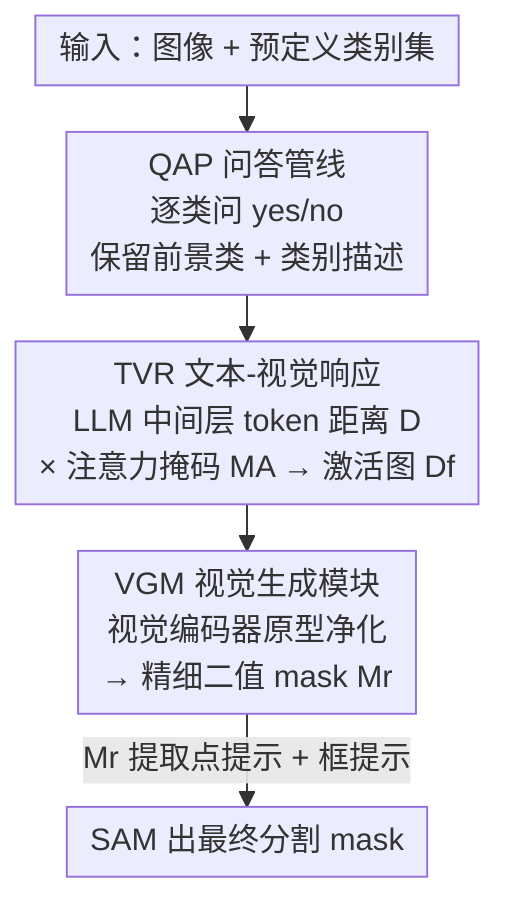

# The Power of Prior: Training-Free Open-Vocabulary Semantic Segmentation with LLaVA

**会议**: CVPR 2026  
**论文**: [CVF Open Access](https://openaccess.thecvf.com/content/CVPR2026/html/Zhang_The_Power_of_Prior_Training-Free_Open-Vocabulary_Semantic_Segmentation_with_LLaVA_CVPR_2026_paper.html)  
**代码**: https://github.com/zbf1991/FSeg-LLaVA  
**领域**: 开放词汇分割 / 多模态VLM  
**关键词**: 训练免调、开放词汇语义分割、MLLM 先验、LLaVA、SAM 提示

## 一句话总结
把冻结的 LLaVA 当成分割器：通过结构化问答让它"承认"图里有哪些类，再从 LLM 中间层的视觉-类别 token 距离里反查激活区域，最后用原型净化后的高置信区域当点/框提示喂给 SAM，完全不训练就在 VOC21（68.0% mIoU）和 COCO-Object（42.0%）上刷新 SOTA。

## 研究背景与动机
**领域现状**：训练免调的开放词汇语义分割（OVSS）目前几乎被 CLIP 一系方法垄断——拿冻结的 CLIP 算图像 patch 和类别文本序列的嵌入距离，谁近就把这个 patch 判给谁，再想各种办法（重标定 patch 自相关、引入 DINO/SAM 等外部视觉先验）去强化 patch 表征。

**现有痛点**：CLIP 路线有两个绕不过去的硬伤。其一，为了把前景和背景分开，必须**显式给出背景子类名**（如 "sky""wall""floor"……），但现实场景里背景到底该枚举哪些子类本身就模糊、难收集。其二，预测完全靠"patch 嵌入 vs 所有预定义类名嵌入"的距离来选，于是经常把某个 patch 判给一个**长得像但根本不在图里**的类（false positive）。

**核心矛盾**：作者把根因归到架构上——CLIP 是 **encoder-only** 的判别式架构，它只会在"给定的若干类里二选一/多选一"，天生没有"这张图里到底有没有这个类"的生成式判断能力，于是被迫枚举背景、被迫硬选。

**本文目标**：换一个**非判别式**的架构来做 OVSS，既能自己判断某类在不在图里、又能定位到像素，从而摆脱背景子类枚举和误激活。

**切入角度**：多模态大模型（MLLM）大多是 **decoder-only 的生成式**架构，LLM 部分带着海量先验知识和指令跟随能力。作者做了一个关键观察（见原文 Fig.1）：把图像+一句简单指令喂给 LLaVA 拿到文本答案后，回到 LLM 里取出"类别文本 token"和"图像 patch token"的特征，算二者余弦距离，得到的"视觉-类别激活图"竟然能高亮出目标物体；而且**中间层（如第 7、11 层）的激活比浅层（第 3 层）和深层（第 19、30 层）更精准**——浅层弥散、深层碎噪、最深层甚至铺满全图。

**核心 idea**：不微调、直接"压榨"LLaVA 里现成的先验——用问答让它生成式地确认类别，用中间层的视觉-类别 token 距离反查激活区域，再净化成可靠提示交给 SAM 出最终 mask。

## 方法详解

### 整体框架
FSeg-LLaVA 是一条**三模块串行 + SAM 收尾**的纯推理流水线，全程零训练、零梯度。输入是一张图 $I$ 和一个预定义类别集合，输出是每个类的分割 mask。三步走：① **QAP**（问答管线）逐个类问 LLaVA"图里有没有这个类"，只保留它回答 yes 的前景类，并顺带拿到一句类别描述；② **TVR**（文本-视觉响应）从 LLaVA 的 LLM 中间层抽出类别 token 与视觉 token 的特征和注意力，算出一张"可靠的视觉-类别激活图" $D_f$；③ **VGM**（视觉生成模块）用 LLaVA **视觉编码器**的特征做前景/背景原型，把激活图里残留的噪声进一步净化成高置信、但往往破碎的小块区域，再从这些区域提取点提示与框提示喂给 **SAM** 出最终 mask。

### 关键设计

**1. QAP 问答管线：用生成式问答把"类在不在图里"变成一个 yes/no 信号**

CLIP 路线被迫枚举背景、被迫在所有类里硬选，根因是它没有"这张图到底有没有这个类"的判断力。QAP 直接利用 LLaVA 的生成式能力补上这一环：对类集合里的**每个**类名 $c_{name}$（如 bird），用一段固定格式的提示询问 LLaVA——"图里有没有 {$c_{name}$}？只回答 yes/no；若 no 就只说 'No.'；若 yes 必须回两句话，第一句是 'yes, it contains a {$c_{name}$}.'，第二句描述这个 {$c_{name}$}"。LLaVA 据此返回文本答案 $T^c_{output}=(S_0,S_1)$：判 $S_0$ 第一个 token 是不是 "yes" 就知道该类在不在图里（在才会输出第二句 $S_1$）。这样做有两个好处：一是只保留 yes 的类当前景，**根本不需要任何背景子类名**，直接绕开了 CLIP 的背景枚举难题；二是 $S_0$ 里显式带类名、$S_1$ 给出细粒度描述，这两句话后面分别用于反查类别 token 和补充注意力线索，为定位铺好路。

**2. TVR 文本-视觉响应：从 LLM 中间层把"类别-视觉距离"和"注意力"乘起来得到干净激活图**

光有"图里有 bird"还不够，得定位到像素。TVR 的关键洞察是：LLaVA 的 LLM 中间层特征本身就携带定位信息。它先对 $S_0$ 里类别 token $t^0_c$ 取第 $l_s$ 到 $l_e$ 层（实测 7–13 层最佳）特征，与每个图像 token $v_i$ 算逐层余弦距离再平均，得到初始距离图 $\tilde D(v_i, t^0_c)=\frac{1}{l_e-l_s+1}\sum_{l=l_s}^{l_e}\cos(F^l(v_i),F^l(t^0_c))$。但 $\tilde D$ 含噪，于是用一个**动态阈值** $\tau=\min(\alpha\cdot\max(\tilde D),\beta)$ 把低置信区域清零，得到高置信距离图 $D$。同时它再利用第二句描述 $S_1$ 的文本 token 与视觉 token 的**跨模态注意力**，按空间熵取 top-$K$ 平均得 $A_v$，并按"高于自身均值"阈值化成二值注意力掩码 $M_A$。最后两路**逐元素相乘** $D_f^c = D\cdot M_A$——$D$ 提供语义距离、$M_A$ 滤掉距离图里的噪声区域，得到该类可靠的视觉-类别激活图。消融（原文 Tab.5）显示：只用 $D$ 仍有 67.3%、只用 $M_A$ 暴跌到 27.3%、两者相乘 68.0%，说明 $D$ 是定位主力、$M_A$ 是去噪辅助。背景则用 $D_f^{bg}=\min(\alpha\cdot\max(\{D_f^c\}),\beta)$ 隐式构造，依旧不需要背景类名。

**3. VGM 视觉生成模块 + SAM：用视觉编码器原型净化破碎区域，再转成 SAM 提示**

TVR 的激活图来自 LLM，而 LLM 是生成模型、不天生擅长稠密空间预测，$D_f$ 仍缺细粒度空间感。VGM 转而压榨 LLaVA 里真正负责视觉的部件——**视觉编码器** $\phi_v$。它先把各类激活图按 $\hat M_f(i,j)=\arg\max_c D_f^c(i,j)$ 合成语义引导图，再用视觉特征 $F_v$ 在引导图监督下为每个类算**前景原型** $p_c^+$ 和**背景原型** $p_c^-$（属于该类的特征均值 vs 其余特征均值）。然后对每个位置比较它离哪个原型更近，得到原型 mask $M_v^c(i,j)=\mathbb{1}[\cos(F_v,p_c^+)>\cos(F_v,p_c^-)]$，再与引导图相乘得精细二值 mask $M_r^c=M_v^c\cdot\hat M_f^c$。$M_r$ 区域往往置信极高但**破碎、不连续、盖不全整个物体**——但这恰恰是 SAM 最想要的强提示。于是对 $M_r$ 做形态学去噪取连通域，每块质心当**正点提示**、整体最小外接矩形当**框提示**，喂给 ViT-H SAM 出最终 mask $M_{sam}^c=\phi_{sam}(I\mid S_p,S_b)$。消融（原文 Tab.4）显示点提示（61.4%）比框提示（57.8%）更准，二者并用最佳（68.0%），说明互补空间线索有用。

## 实验关键数据

### 主实验
在 5 个数据集上比 mIoU（含背景的 VOC21/Context60/Object，不含背景的 Stuff/ADE）。FSeg-LLaVA 全程**不需要背景类定义**，而所有对手都要。

| 方法 | 骨干 | VOC21 | Object | Context60 | Stuff | ADE | Avg. |
|------|------|-------|--------|-----------|-------|-----|------|
| SCLIP (ECCV'24) | CLIP | 61.7 | 32.1 | 31.5 | 23.9 | 17.8 | 33.4 |
| ProxyCLIP (ECCV'24) | CLIP+DINO | 61.3 | 37.5 | 35.3 | 26.5 | 20.2 | 36.2 |
| FreeCP (ICCV'25) | CLIP | 65.8 | 37.2 | 35.3 | 24.9 | 18.4 | 36.3 |
| **FSeg-LLaVA1.5** | Vicuna-7B | **68.0** | **42.0** | 30.6 | 21.2 | 16.9 | 35.7 |
| **FSeg-LLaVA1.6** | Vicuna-7B | 65.9 | 41.6 | 33.4 | 23.1 | 20.0 | **36.8** |

在两个 "Thing"（前景物体）类数据集 VOC21、COCO-Object 上以明显优势刷新 SOTA（VOC21 比 FreeCP 高 2.2、Object 比 ProxyCLIP 高 4.5）；在含大面积/复杂 "Stuff"（如天空、地面）类的数据集上只是有竞争力，因为点/框提示难以盖满大面积非物体类。值得注意：**换更大模型（Vicuna-13B）反而掉点**（Avg. 35.6），说明 LLaVA 的定位能力并不随规模单调变强。

### 消融实验
全部在 VOC21 上，LLaVA1.5 / LLaVA1.6 (Vicuna-7B) 两套。

| 配置 | 关键指标(1.5) | 说明 |
|------|--------------|------|
| 取 LLM 第 7–13 层 | **68.0** | 最佳层段；浅层弥散、深层碎噪 |
| 取第 15–22 层 | 49.1 | 语义抽象、丢空间细节，骤降 |
| 取第 22–30 层 | 15.2 | 几乎失去定位能力 |
| $D_f=D$（只距离图） | 67.3 | LLM 特征本身就含丰富分割语义 |
| $D_f=M_A$（只注意力） | 27.3 | 单靠注意力定位很差 |
| $D_f=D\cdot M_A$（完整） | **68.0** | $M_A$ 去噪 + $D$ 定位，最佳 |
| 只点提示 / 只框提示 | 61.4 / 57.8 | 点比框准 |
| 点+框提示 | **68.0** | 互补线索最佳 |
| $M_r=M_v$（只原型） | 48.4 | 原型单独不稳 |
| $M_r=\hat M_f$（只距离引导） | 67.3 | 视觉-文本距离是定位关键 |
| $M_r=M_v\cdot\hat M_f$（完整） | **68.0** | 原型净化补一点 |

### 关键发现
- **层选择是命门**：LLaVA 的 LLM 中间层（7–13）做稠密预测远胜浅/深层——浅层激活弥散、深层引入大量小噪声、最深层（30 层）甚至铺满全图。这揭示了 MLLM 内部"哪一层最懂空间"的非平凡现象。
- **去噪是辅助、定位靠距离**：$M_A$ 单独只有 27.3%、$\hat M_f$（距离引导）单独就有 67.3%，说明 LLM 里"类别 token vs 视觉 token"的余弦距离才是定位主力，注意力和原型都是锦上添花。
- **大模型不等于强定位**：13B 反而不如 7B，提示 MLLM 的定位先验和语言规模解耦。

## 亮点与洞察
- **把生成式 MLLM 当判别器又当定位器**：用一句问答的 yes/no 解决"类在不在"（绕开背景枚举），又用中间层 token 距离解决"在哪里"，两个老大难一次性化解，且**全程冻结、零训练**。这是把"MLLM 内隐空间先验"显式挖出来用的一个干净范例。
- **中间层 > 深层的反直觉发现**：通常以为越深语义越强越该用来分割，但本文实测中间层定位最准、深层因语义抽象丢失空间细节，给"哪层做稠密任务"提供了可迁移的经验。
- **D·M_A 的双路相乘净化**：用"语义距离图"和"注意力二值掩码"逐元素相乘互相纠错的思路，可迁移到任何"主信号含噪 + 有第二弱监督线索"的定位场景。
- **破碎高置信区 → SAM 提示**：不强求自己出完整 mask，只负责给出最可靠的几个点/框，把"补全成连续物体"外包给 SAM，是 training-free 流水线里很实用的分工。

## 局限与展望
- 作者承认：在含大面积/复杂 "Stuff" 类（天空、地面等）的数据集上只是竞争力水平，因为点/框提示天然难覆盖大面积非物体区域——方法本质偏向 "Thing" 类。
- 流水线对**每个类**都要单独问一遍 LLaVA、单独跑一遍 TVR/VGM，类集合大时推理开销随类数线性增长（⚠️ 原文未给逐图耗时，此为笔者据流程推断）。
- 强依赖三个超参（层段 $l_s,l_e$、阈值 $\alpha,\beta$）且不同 LLM 骨干取值不同（如 $l_e$ 在 Vicuna-7B/Mistral-7B/Vicuna-13B 分别为 13/13/23），泛化到新骨干需重新调参。
- 改进方向：为 "Stuff" 类设计区域级（而非点/框）提示；探索一次前向同时问多类以降开销；自动选层而非手调。

## 相关工作与启发
- **vs CLIP 系（SCLIP / ProxyCLIP / FreeCP）**：它们用 encoder-only 的 CLIP 算 patch-文本嵌入距离做判别式多选，必须枚举背景子类、易误激活相似但不存在的类；本文用 decoder-only 生成式 LLaVA，先问答确认类存在性再反查激活，**无需背景类名**，在 "Thing" 类上明显更准。
- **vs 引入外部视觉先验的方法（Trident / CorrCLIP 用 SAM 约束 CLIP）**：它们仍以 CLIP 为主、SAM 为辅修正；本文把 SAM 放在最后只做"提示→mask"的几何补全，主语义判断与定位全交给 LLaVA 的内隐先验，思路上是"换发动机"而非"打补丁"。
- **vs PnP-OVSS（BLIP 系生成式）**：同样用生成式 MLLM，但本文系统性地揭示了 LLaVA **中间层**的定位优势并据此设计 TVR，定位质量与可解释性更强。

## 评分
- 新颖性: ⭐⭐⭐⭐⭐ 首次把冻结 LLaVA 的中间层先验系统性地用于 training-free OVSS，视角新颖
- 实验充分度: ⭐⭐⭐⭐ 5 数据集 + 3 模型变体 + 6 张消融表，但缺推理开销分析
- 写作质量: ⭐⭐⭐⭐ 动机推导清晰、图示丰富，公式记号略密
- 价值: ⭐⭐⭐⭐ 揭示 MLLM 内隐空间先验，对"哪层做稠密任务"有可迁移启发

<!-- RELATED:START -->

## 相关论文

- [\[CVPR 2026\] PEARL: Geometry Aligns Semantics for Training-Free Open-Vocabulary Semantic Segmentation](pearl_geometry_aligns_semantics_for_training-free_open-vocabulary_semantic_segme.md)
- [\[CVPR 2026\] Direct Segmentation without Logits Optimization for Training-Free Open-Vocabulary Semantic Segmentation](direct_segmentation_without_logits_optimization_for_training-free_open-vocabular.md)
- [\[CVPR 2026\] Looking Beyond the Window: Global-Local Aligned CLIP for Training-free Open-Vocabulary Semantic Segmentation](looking_beyond_the_window_global-local_aligned_clip_for_training-free_open-vocab.md)
- [\[CVPR 2026\] Making Training-Free Diffusion Segmentors Scale with the Generative Power](making_training-free_diffusion_segmentors_scale_with_the_generative_power.md)
- [\[ICCV 2025\] Training-Free Class Purification for Open-Vocabulary Semantic Segmentation](../../ICCV2025/segmentation/training-free_class_purification_for_open-vocabulary_semantic_segmentation.md)

<!-- RELATED:END -->
