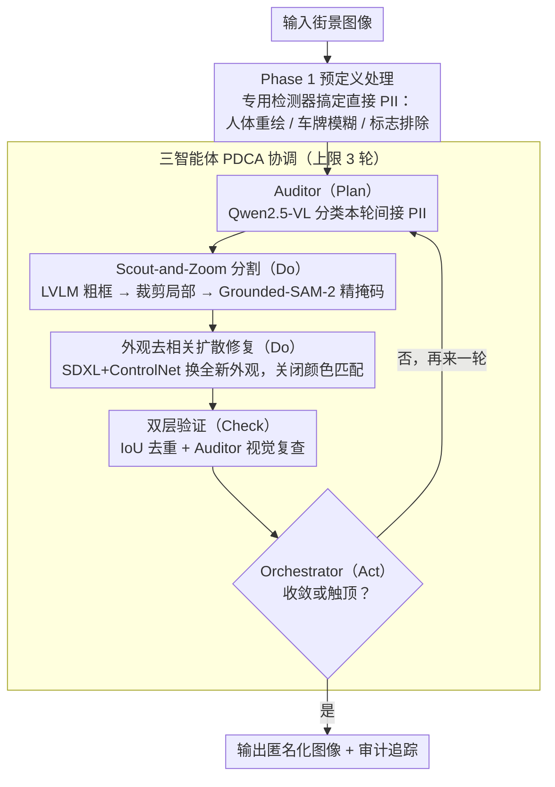

# Towards Context-Aware Image Anonymization with Multi-Agent Reasoning

**会议**: CVPR 2026  
**arXiv**: [2603.27817](https://arxiv.org/abs/2603.27817)  
**代码**: 无  
**领域**: 图像分割  
**关键词**: 图像匿名化, 多智能体推理, 扩散模型修复, 隐私保护, GDPR合规

## 一句话总结

提出 CAIAMAR 多智能体框架，将预定义的高置信度直接 PII（人体、车牌）处理与基于大视觉语言模型的上下文感知推理相结合，通过 PDCA 迭代优化循环检测间接隐私标识符，使用扩散模型进行外观去相关修复，在 CUHK03-NP 上将行人重识别风险降低 73%，同时在 CityScapes 上保持 FID 9.1 的高图像质量。

## 研究背景与动机

1. **领域现状**：街景图像广泛用于导航、城市规划和自动驾驶数据集，但包含大量个人隐私信息（PII）。现有匿名化方法主要处理人脸和车牌等直接标识符。
2. **现有痛点**：(1) 传统模糊方法（如高斯模糊）降低下游任务性能（CityScapes 实例分割 AP 下降 5.3%），且可被反转攻击恢复（CelebA-HQ 上 95.9% 身份恢复率）；(2) 现有生成方法（DeepPrivacy2、FADM 等）仅关注人体/人脸，忽略间接标识符（衣物、配件、上下文对象）；(3) 前沿 LVLM 可从上下文线索推断隐私属性（准确率达 76.4%），o3 模型从随意照片实现 99% 城市级地理定位。
3. **核心矛盾**：有效匿名化不能仅处理直接 PII，还必须处理上下文相关的间接标识符，但间接 PII 的语义多样性使得固定检测器和刚性类别规则难以覆盖。
4. **本文目标**：能否通过多智能体协作实现上下文感知的图像匿名化，同时保持数据效用和提供可解释审计追踪？
5. **切入角度**：用多智能体系统将任务分解为审计（PII 分类）、生成（修复）和协调（工作流管理），通过 PDCA 循环迭代优化，而非单次检测-修复流程。
6. **核心idea**：两阶段架构——Phase 1 用专用模型处理直接 PII，Phase 2 用多智能体+LVLM 推理处理上下文相关的间接标识符。

## 方法详解

### 整体框架

这篇论文要解决的核心问题是：街景图像里真正泄露隐私的不只是人脸和车牌，还有大量"在特定上下文里才敏感"的间接标识符——衣物配色、随身物件、店铺招牌、墙上涂鸦。固定检测器和死板的类别规则根本枚举不完这些东西，所以作者把匿名化拆成两个阶段、并在第二阶段引入会推理的智能体来兜住这些漏网之鱼。

整体怎么转：图像先进 **Phase 1（预定义处理）**，用现成的专用检测器把高置信度的直接 PII 一次性处理掉——YOLOv8 检出人体后交给 SDXL+OpenPose ControlNet 重绘，YOLOv8s 检出车牌后做高斯模糊，YOLO-TS 检出交通标志后生成排除掩码（标志属于公共信息，要保护不被误改）。处理过的图像再进 **Phase 2（多智能体协作）**，由三个分工明确的智能体在 AutoGen 框架里按固定轮转顺序协作，跑一个有上限的 PDCA 迭代循环：每一轮发现一批间接 PII、修掉、再回头检查有没有遗漏，直到收敛或触顶。两阶段的分界本质是"能用专用模型可靠搞定的就别麻烦 LVLM，剩下需要语境判断的才上推理"。

### 关键设计

**1. 三智能体 PDCA 协调机制：把"检测—处理—验证"做成可收敛的闭环，而不是一次性扫描**

单次检测注定漏掉间接 PII——画面里东西多、语义杂，一遍扫不全。作者借 PDCA（Plan-Do-Check-Act）质量管理循环的思路，让三个智能体按固定顺序轮转：Auditor（Qwen2.5-VL-32B）先做 Plan，分类出本轮要处理的 PII 实例；Generative Agent 做 Do，执行分割与修复；回到 Check 阶段做双层验证——Generative 自己用 IoU 去重防止重复处理，Auditor 再独立做一次视觉检查确认修干净了；最后 Orchestrator 在 Act 阶段决定是再来一轮还是收工。整个循环带硬上限 $n_{\max}=3$，避免智能体之间来回扯皮陷入死循环。这套设计的好处是把"漏检"变成可以靠多轮逐步补齐的问题，同时用上限把开销摁住——实测 76% 的图像 2 轮内就收敛，智能体之间的通信开销只占总时间的 7.4%。

**2. Scout-and-Zoom 分割：先让 LVLM 大致圈一下，再让分割模型精确抠出来**

这一步要解决 LVLM 和分割模型各自的短板：LVLM 懂语义、能判断"这块涂鸦算隐私"，但它给的框往往歪歪扭扭定位粗糙；Grounded-SAM-2 这类分割模型抠边精准，却不会做语义推理。作者借 Faster R-CNN "先提区域再细化" 的思路把两者串起来——先用 Qwen2.5-VL-32B 生成粗略 bbox 当候选区域，把图裁到这个 bbox 局部，再在裁剪图上跑 Grounded-SAM-2 拿到精确掩码，最后把局部掩码坐标映射回全图。"先 zoom 进局部再分割" 的关键作用是：在小图上分割模型更不容易被背景干扰，定位精度明显更好。同一实例可能被不同轮次重复圈到，所以这里还卡了一道 30% IoU 去重阈值——比如 berlin_000002 在第 2 轮被重新框到时算出 IoU=0.88，远超阈值，直接跳过不再处理。

**3. 外观去相关扩散修复：不是模糊掉，而是换一套全新外观，从根上断掉重识别特征链**

传统高斯模糊保留了结构信息，可以被反转攻击恢复（CelebA-HQ 上 95.9% 身份恢复率就是证据），GAN 修复又在多样性和可控性上不够。作者改用 SDXL+ControlNet 做生成式重绘：人体用 OpenPose ControlNet（条件尺度 0.8、强度 0.9）保住姿态、体型这些下游任务有用的属性，让 LVLM 生成衣物描述时从 20 种颜色×10 个亮度级里随机抽配色，把人换成"还是个人、但不是原来那个人"；物体和文字则用 Canny ControlNet 守住边缘几何。最关键的一刀是把颜色匹配彻底关掉（luminance=0.0, chrominance=0.0）——常规修复会让重绘区域的色调去贴合原图，这恰恰把外观相关性又接回去了；作者宁可让修补区域颜色"不搭"，也要保证新外观和原外观在统计上彻底无关，这样重识别模型再也抓不到可用的外观线索。

### 一个完整示例

以一张柏林街景 berlin_000002 走一遍 Phase 2：图像先经 Phase 1 处理掉人体和车牌后进入循环。

- **第 1 轮 Plan**：Auditor 用 Qwen2.5-VL-32B 扫描全图，识别出若干间接 PII 候选——比如车身上的品牌贴标、店铺招牌文字。**Do**：Generative Agent 对每个候选先用 LVLM bbox 粗定位、再 zoom 进局部跑 Grounded-SAM-2 抠掩码，然后用 SDXL+Canny ControlNet 重绘（贴标换成无意义图案、文字替换成抽象纹理）。**Check**：IoU 去重确认本轮没重复处理，Auditor 复查重绘区域确实不再含可读信息。**Act**：Auditor 判断仍有疑似遗漏 → 进入第 2 轮。
- **第 2 轮 Plan**：Auditor 重新扫描，又圈出几个新目标，但其中一个的框和第 1 轮已处理实例算出 IoU=0.88。**Do**：去重逻辑发现 IoU 远超 30% 阈值，直接跳过这个实例，只修真正新发现的目标。**Check/Act**：本轮无新增遗漏 → 收敛终止。

整张图就在 2 轮内处理完毕，符合"76% 图像 2 轮收敛"的统计；若到第 3 轮（$n_{\max}=3$）仍未收敛则强制停止，避免无限迭代。

### 损失函数 / 训练策略

- 框架本身无需训练，全部使用预训练模型的 zero-shot / few-shot 能力。
- Re-ID 评估用 ResNet50 + triplet loss + center loss 训练 120 epochs（SGD，lr=0.05）。
- 车牌检测器在 UC3M-LP 数据集上微调 YOLOv8s，达到 mAP50-95=0.82。

## 实验关键数据

### 主实验

| 方法 | CUHK03 R1↓ | CUHK03 mAP↓ | CityScapes KID↓ | CityScapes FID↓ |
|------|-----------|-------------|-----------------|-----------------|
| 原始(无匿名化) | 62.4% | 66.0% | - | - |
| Gauss. Blur | 9.4% | 6.4% | 0.224 | 178.5 |
| DeepPrivacy2 | **8.6%** | **4.4%** | 0.066 | 59.7 |
| FADM | 33.4% | 32.9% | 0.032 | 33.3 |
| **CAIAMAR (Ours)** | 16.9% | 13.7% | **0.001** | **9.1** |

### 消融实验

| 配置 | 间接PII检测数 | 时间/图 | 说明 |
|------|-------------|---------|------|
| Phase 1 only | 0 | 67.8s | 仅处理直接PII |
| Full pipeline | 1,107 | 133.5s | 覆盖54类间接PII |
| 下游 mIoU (Ours) | 0.877 (-0.123) | - | 语义分割保持 |
| 下游 mIoU (SVIA) | 0.478 (-0.522) | - | 严重下降 |

### 关键发现

- Re-ID 风险降低 73%（R1: 62.4% → 16.9%），同时图像质量远优于暴力方法（FID 9.1 vs Blur 178.5）
- Phase 2 额外检测到 1,107 个间接 PII 实例，覆盖 54 类对象（车辆标记 57.4%、文字元素 37.8%）
- 隐私-效用权衡：比 FADM 更强的隐私保护（R1 降低 49%）同时更好的分布保持（KID 降低 56%）
- 下游语义分割 mIoU 仅下降 0.123（vs SVIA 下降 0.522），静态类别几乎无损（road -0.005，sky -0.005）
- 76% 的图像在 2 轮 PDCA 内收敛，智能体通信开销仅占 7.4%

## 亮点与洞察

- **从"什么是PII"到"在这个上下文中什么是PII"**：这是匿名化思维的质变。私人车道上的车辆标记是 PII，公共停车场的则不是——上下文决定隐私敏感性，这需要推理能力而非固定规则。
- **双层验证防止遗漏和冗余**：Generative Agent 的 IoU 去重防止重复处理（效率），Auditor Agent 的独立视觉检查确保质量，两者互补的设计思路值得借鉴。
- **全本地部署+审计追踪**：完全使用开源模型（Qwen2.5-VL、SDXL、Grounded-SAM-2），符合 GDPR 数据主权要求，生成的结构化审计追踪支持透明性和可解释性。

## 局限与展望

- 处理速度慢（133.5s/图），无法实时部署，仅适合批量处理场景
- Zero-shot PII 检测在细粒度定位上表现不佳（Visual Redactions Dataset 上 Dice 仅 25.78%）
- 未与单智能体方案对比（缺少消融证明多智能体 vs 单 LVLM 的优势）
- 缺乏系统性超参消融（$n_{\max}$、IoU 阈值、ControlNet 条件尺度等）
- LLM 固有的"确认不执行"、格式不一致等问题虽有缓解但未根本解决
- 可探索对高频类别（人脸/人体）使用专用检测器+对低频开放词汇类别使用 LVLM 的混合架构

## 相关工作与启发

- **vs DeepPrivacy2**: DP2 是 GAN-based 方法，隐私保护更强（R1 8.6%）但图像质量严重受损（SSIM 0.443, KID 0.066）；CAIAMAR 在更好的图像质量下仍有 73% 的 Re-ID 降低
- **vs FADM**: FADM 仅做全身匿名化，不处理间接标识符；CAIAMAR 额外发现 1,107 个间接 PII 实例
- **vs SVIA**: SVIA 对建筑、道路等大范围区域进行匿名化，导致灾难性质量下降（FID 44.3 vs 9.1, mIoU 0.478 vs 0.877）

## 评分

- 新颖性: ⭐⭐⭐⭐ 多智能体+PDCA 循环用于匿名化是新颖的系统设计，上下文感知PII分类思路超越传统方法
- 实验充分度: ⭐⭐⭐ Re-ID 和图像质量评估全面，但缺少关键消融（多智能体 vs 单智能体、不同 LVLM 对比等）
- 写作质量: ⭐⭐⭐⭐ 系统架构描述清晰，表格和案例分析详尽，但正文含大量实现细节显得冗长
- 价值: ⭐⭐⭐⭐ 提出了实际可部署的 GDPR 合规匿名化方案，首次系统性地处理间接 PII，对工业界有实用价值

<!-- RELATED:START -->

## 相关论文

- [\[AAAI 2026\] Guideline-Consistent Segmentation via Multi-Agent Refinement](../../AAAI2026/segmentation/guideline-consistent_segmentation_via_multi-agent_refinement.md)
- [\[CVPR 2026\] INSID3: Training-Free In-Context Segmentation with DINOv3](insid3_training-free_in-context_segmentation_with_dinov3.md)
- [\[ICLR 2026\] VINCIE: Unlocking In-context Image Editing from Video](../../ICLR2026/segmentation/vincie_unlocking_in-context_image_editing_from_video.md)
- [\[ICLR 2026\] RegionReasoner: Region-Grounded Multi-Round Visual Reasoning](../../ICLR2026/segmentation/regionreasoner_region-grounded_multi-round_visual_reasoning.md)
- [\[ACL 2025\] Pixel-Level Reasoning Segmentation via Multi-turn Conversations](../../ACL2025/segmentation/pixel-level_reasoning_segmentation_via_multi-turn_conversations.md)

<!-- RELATED:END -->
