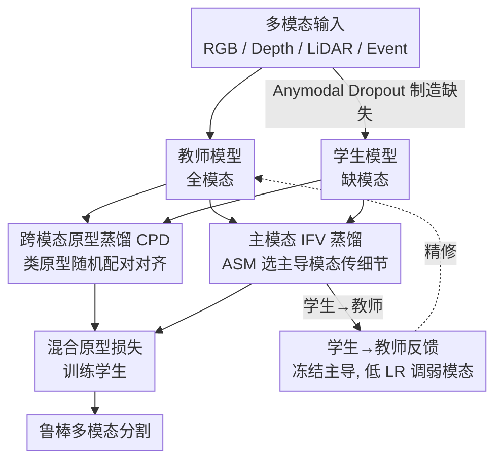

# Towards Robust Multi-Modal Semantic Segmentation with Teacher-Student Framework and Hybrid Prototype Distillation

**会议**: CVPR 2026  
**论文**: [CVF Open Access](https://openaccess.thecvf.com/content/CVPR2026/html/Tan_Towards_Robust_Multi-Modal_Semantic_Segmentation_with_Teacher-Student_Framework_and_Hybrid_CVPR_2026_paper.html)  
**关键词**: 多模态语义分割, 缺失模态鲁棒性, 自蒸馏, 原型蒸馏, 教师-学生反馈

## 一句话总结
提出 RobustSeg——一个带反馈回环的教师-学生自蒸馏框架，用「跨模态原型蒸馏 + 主模态 IFV 蒸馏」混合策略（HPD）让模型在传感器缺失/退化时保持鲁棒，同时几乎不损失全模态精度（DeLiVER 上缺失模态 +2.40% mIoU，全模态仅 -0.1%）。

## 研究背景与动机
**领域现状**：多模态语义分割（MMSS）把 RGB、深度、LiDAR 点云、事件流等互补传感器融合起来，弥补单模态在几何线索缺失、光照/天气敏感上的短板。主流融合范式分三类：以 RGB 为主导融合辅助模态、各模态平等拼接、按上下文自适应选主导模态。

**现有痛点**：这些方法几乎都默认训练和推理时所有模态都在线。一旦现实中某个传感器退化或失效，性能就断崖式下跌——例如 CMNeXt 从理想的 RDEL 设置（66.30% mIoU）切到退化的 REL 设置时，直接掉到 22.92%。

**核心矛盾**：性能退化有两个根因。其一是**完整模态假设**让模型过拟合到理想输入；其二是**模态不平衡**，由于各模态信息量不同，模型会过度依赖容易学习的主导模态（如 RGB），形成单模态偏置，导致融合次优、鲁棒性弱。已有的自蒸馏 / 模态掩码方法虽然用「冻结教师 + 掩码学生」提升缺失鲁棒性，却带来两个新问题：一是全模态精度明显下降（鲁棒性和精度此消彼长）；二是这些 pipeline 大多是**单模态蒸馏**，在传递细粒度细节的同时，也把教师的模态偏置原封不动地复制给学生，反而放大了模态间的不平衡。

**本文目标**：在缺失模态下提升鲁棒性，同时保住全模态精度，且不增加参数、不引入外部数据。

**切入角度**：作者观察到「细节传递」和「跨模态对齐」是一对矛盾——直接用细粒度的 IFV（类内特征变化）图做跨模态蒸馏，会引入模态特异的噪声造成信息混淆（实验里全模态掉 8.55%）。而高层语义原型擅长跨模态对齐却丢细节。于是干脆把两者拆开各司其职：原型管跨模态语义、IFV 管模态内细节。

**核心 idea**：用「跨模态原型蒸馏减偏置 + 主模态 IFV 蒸馏补细节」的混合蒸馏，再加一条「学生把弱模态信息反馈给教师」的闭环，让教师自己也变得更均衡。

## 方法详解

### 整体框架
RobustSeg 是一个教师-学生自蒸馏框架。教师吃**全模态**输入，学生通过 Anymodal Dropout 吃**随机缺失模态**的输入，学生在教师和真值的双重监督下学会逼近全模态性能。给定 $M$ 个模态输入 $x_m$，每个模态各自的编码器提取四个阶段的特征 $f^1_m,\dots,f^4_m$；教师把全模态特征送进分割头出稠密预测，学生则在缺模态下逼近教师。

知识从教师传到学生分三路：① 标准的 logits 蒸馏 $L_{KL}$ + 监督分割 $L_{CE}$；② 核心的 **Hybrid Prototype Distillation（HPD）**，内部并联「跨模态原型蒸馏 CPD」和「主模态 IFV 图蒸馏」；③ 反馈回环——学生把非主导模态的 IFV 反馈给教师，教师以低学习率微调非主导模态编码器，从而逐渐产出更均衡的表征。整个过程形成闭环：学生在缺模态下向教师学，教师又根据学生的弱模态线索精修自己。

### 关键设计

**1. 跨模态原型蒸馏 CPD：用高层语义原型对齐而非细节图，避免把模态偏置传下去**

直接拿 IFV 图（细粒度类内特征分布）做跨模态蒸馏会出问题——t-SNE 显示 LiDAR 特征变得更可分，但 RGB 特征因 LiDAR 干扰而坍缩，全模态掉 8.55%，因为 IFV 携带了模态特异噪声。CPD 改用**类级语义原型**作为跨模态传递的代理：先把真值标签最近邻插值到特征图尺寸 $l'$，再对每个模态每阶段做带标签掩码的平均池化得到原型 $p=[p_0,\dots,p_C]$，其中

$$p_c = \frac{\sum_j f^{i,j}_m \,\mathbf{1}[l'_j = c]}{\sum_j \mathbf{1}[l'_j = c]}$$

每个 $p_c\in\mathbb{R}^d$ 是类 $c$ 的紧凑语义中心。关键招数是**模态随机置换匹配**：计算原型前先在样本级把不同模态的顺序随机打乱，让学生原型 $p_{\pi(m)}$ 去匹配教师在另一模态上的原型 $g_m$，损失为

$$L_{cp} = \frac{1}{N}\sum_{n=1}^{N}\sum_{i=1}^{4}\sum_{m=1}^{M} \mathrm{KL}\big(p^{n,i}_{\pi(m)},\, g^{n,i}_m\big)$$

其中 $\pi(m)$ 是模态顺序的随机排列。这样每个模态都被迫去对齐别的模态的语义强项，从全局语义层面拉近模态差异、显式减小模态偏置，而又因为只传高层原型、不传逐像素细节，避免了信息混淆。消融里它单用就能把 EMM 从 39.36% 拉到 49.06%（+9.70），全模态只掉 1.81%。

**2. 主模态 IFV 蒸馏：补回原型丢掉的细粒度结构，但只信「主导模态」**

原型擅长跨模态对齐却丢了分割最需要的细节，所以并联一条单模态 IFV 通道把细节补回来。先用类原型构造中心特征图（Center Feature Map），把每个像素替换成它所属类的原型：

$$\mathrm{CFM} = \sum_{c=0}^{C-1} p_c \otimes \mathbf{1}[l'=c]$$

$\otimes$ 表示在类 $c$ 的所有像素上广播。再计算 CFM 与原始特征 $f$ 的余弦相似度，得到 IFV 图 $M$，它刻画了类内特征的精细变化。这里的关键是**只蒸馏主导模态的 IFV**：作者沿用 ASM（Arbitrary-Modal Selection Module）算每个单模态特征与融合特征的余弦相似度，挑出主导模态（数量取总模态数的一半向上取整），因为主导模态含更多分割相关细节，弱模态的细节往往不可靠。损失为

$$L_{ifv} = \frac{1}{N}\sum_{n=1}^{N}\sum_{i=1}^{4}\sum_{m=1}^{M'} \mathrm{KL}\big(M^{n,i,m}_s,\, M^{n,i,m}_t\big)$$

合并后的混合原型损失为 $L_{hp}=L_{origin}+\alpha L_{cp}+\beta L_{ifv}$。消融证实了「选主导」的必要：直接把 IFV+原型硬合（不选模态）反而把鲁棒性从 49.06% 拉回 48.63%，因为弱模态在细节传递时引入了不可靠信息；加上主导特征选择后才升到 49.10% 且全模态恢复到 61.26%（仅 -0.66）。

**3. 学生→教师反馈：让教师反过来跟学生学弱模态，打破「教师永远更强」的假设**

传统 KD 默认教师恒优，但这里的多模态教师本身就有模态偏置，它在指导弱模态学生时不仅指导不力，还会把偏置传下去。反馈机制让教师**反向**从学生的弱模态线索里学。具体地，同样用 ASM 按跨模态余弦相似度找出非主导模态；为了稳住教师对主导模态的感知，**冻结**主导模态的 ViT 编码器和融合块，只训练非主导模态的 ViT 编码器，且用 0.1× 的低学习率（$6\times10^{-6}$）。反馈微调损失为

$$L_{feedback} = L_{CE} + L_{ifv}$$

这里 $L_{ifv}$ 中的 $M'$ 改为**非主导模态**数量（总数一半向下取整），用 CE 保正确性、用 IFV 专门精修弱模态。这样教师逐渐产出更均衡鲁棒的表征，整个蒸馏闭环受益。消融显示用「模态特征反馈」比用「学生输出 logits 反馈」好（学生在鲁棒训练下很难产出比教师更优的 logits），且冻结部分参数 + 只调弱模态最优：最终教师在 Event+Lidar 组合上从 1.57% 飙到 27.28%，学生 EMM 升到 49.91%（+0.81），全模态还反升到 61.85%。

### 损失函数 / 训练策略
基础自蒸馏损失 $L_{origin}=L_{CE}+\lambda L_{KL}$；学生训练用混合原型损失 $L_{hp}=L_{origin}+\alpha L_{cp}+\beta L_{ifv}$；教师反馈微调用 $L_{feedback}=L_{CE}+L_{ifv}$。超参经渐进搜索定为 $\lambda=50,\ \alpha=100,\ \beta=12$。训练上，教师和学生同初始化、同时训 120 epoch；为防早期反馈干扰教师表征，学生用原学习率、教师用 0.1× 学习率。AdamW，分辨率 $1024\times1024$。

## 实验关键数据

### 主实验
DeLiVER 全模态任意组合评测（MiT-B0 主干），跨 15 种模态组合的均值：

| 方法 | 全模态 RDEL | 弱组合 EL | 任意组合均值 |
|------|------|------|------|
| CMNeXt | 60.59 | 4.97 | 34.09 |
| MAGIC | 63.40 | 0.26 | 40.49 |
| M-SegFormer | 61.92 | 1.57 | 39.36 |
| AnySeg (前 SOTA) | 59.41 | 27.57 | 47.51 |
| **RobustSeg (本文)** | **61.85** | **33.01** | **49.91 (+2.40)** |

亮点是把极弱的 EL 组合从 M-SegFormer 的 1.57% 救到 33.01%，而全模态只掉 0.07%。

三数据集鲁棒性评测（MiT-B2 主干，EMM=整体缺失/RMM=随机缺失/NM=噪声模态的均值）：

| 数据集 | 前最优 | 前最优均值 | 本文均值 |
|------|------|------|------|
| DeLiVER | AnySeg | 41.46 | **45.16** |
| MUSES | MAGIC++ | 27.00 | **32.58** |
| MCubeS | MAGIC++ | 25.25 | **29.19** |

在最难的「噪声模态 NM」上提升最猛（DeLiVER NM：AnySeg 20.18 → 本文 27.31）。

### 消融实验
HPD 各组件消融（MiT-B0，Baseline 即全模态预训练）：

| 配置 | EMM | 全模态 | 说明 |
|------|------|------|------|
| Baseline | 39.36 | 61.92 | 无蒸馏 |
| Basic-distillation | 46.42 | 61.34 | 仅 $L_{origin}$ |
| 单模态特征 IFV | 47.51 | 59.71 | 细节好但全模态掉 2.21 |
| 跨模态特征 IFV | 43.42 | 53.38 | 跨模态用 IFV 灾难性掉 8.54 |
| 跨模态原型 (CPD) | 49.06 | 60.11 | 跨模态对齐强 |
| IFV + 原型（不选模态） | 48.63 | 61.11 | 弱模态噪声拖累鲁棒 |
| **主导 IFV + 原型 (完整 HPD)** | **49.10** | **61.26** | 全模态仅 -0.66 |

反馈策略消融（学生 EMM / 教师 Event+Lidar）：CE+KL 反馈使教师 EL 从 1.57→20.03；改用 CE + 非主导 IFV 特征 + 冻结主导参数后，教师 EL 升到 27.28、全模态反升 +0.02，学生 EMM 也升到 49.91（+0.81），是唯一师生双赢的配置。

不同主干泛化（HPD vs HPD+Feedback，EMM 提升）：M-SegFormer 39.36→49.91（+10.55），CMNeXt 32.84→47.04（+14.20），均不增参数。

### 关键发现
- **「跨模态用什么代理」是全文胜负手**：跨模态 IFV 全模态崩 8.54%，跨模态原型只掉 1.81%——证明高层语义原型才适合跨模态对齐，细节图会传偏置。这是 HPD 拆分两条通道的实验依据。
- **细节通道必须「选主导模态」**：不选模态时弱模态噪声把鲁棒性从 49.06 拖到 48.63，ASM 选主导后恢复，说明弱模态的细节不可信。
- **反馈要传特征不传 logits**：学生在鲁棒训练下 logits 弱于教师，用 logits 反馈无效；用弱模态 IFV 特征反馈 + 冻结主导参数才能在不伤主导感知的前提下补弱模态。
- **超参敏感性**：$\lambda$ 在 50、$\alpha$ 在 100 时 EMM 最高；$\beta$ 在 12（EMM 最优）与 15（全模态最优）接近，选更鲁棒的 12。

## 亮点与洞察
- **把「跨模态对齐」与「模态内细节」解耦到两条蒸馏通道**：这是最巧的设计——先用反例证明 IFV 不能跨模态、原型不擅长细节，再让两者各管一摊，避免了单一目标既要又要的内耗。这个「不同知识用不同代理传」的思路可迁移到任何异构模态蒸馏（音视频、文本视觉）。
- **教师可学的闭环**：打破 KD「教师恒优」假设，用「冻结主导 + 低 LR 调弱模态」的精细反馈，让有偏置的教师自我纠偏，且师生双赢。可复用到任何「监督者自身有偏」的蒸馏场景。
- **带标签掩码的原型平均池化 + 随机模态配对**，是把逐像素稠密知识压成类级语义、再强制跨模态交换的轻量做法，零额外参数。

## 局限与展望
- **强依赖真值标签构造原型**：原型平均池化和 CFM 都需要把 GT 下采样到特征图来选像素，半监督/无监督场景下不可直接用。
- **主导/非主导的判定靠 ASM 余弦相似度**，数量按「总数一半向上/向下取整」硬性切分，模态数很多或信息量接近时这种二分可能不够精细，作者未讨论模态数 >4 时的行为。
- **效率与训练稳定性细节被放进补充材料**，正文未给出训练开销，闭环反馈是否拖慢收敛、对学习率敏感程度如何，从正文难以判断。
- 作者展望把框架推广到极端天气和**多模态医学图像分割**等更多缺失/退化场景。

## 相关工作与启发
- **vs AnySeg（前 SOTA 自蒸馏）**：AnySeg 走单模态蒸馏，传细节的同时把教师模态偏置一并传给学生；RobustSeg 用原型做跨模态对齐显式减偏置，再用主导 IFV 补细节，三数据集鲁棒 mIoU 全面超越且全模态几乎不掉。
- **vs MAGIC / MAGIC++（鲁棒性设计）**：它们聚焦融合层面的鲁棒模块；本文不改融合结构、不增参数，纯靠蒸馏范式 + 反馈回环提升鲁棒，可即插到 M-SegFormer、CMNeXt 等不同主干。
- **vs 传统 IFV 蒸馏 [38]**：IFV 原本用于同构师生的密集预测细节传递；本文揭示 IFV 跨模态会传噪声，把它限定在「主导模态 + 模态内」使用，并用原型接管跨模态部分，是对 IFV 适用边界的重要修正。

## 评分
- 新颖性: ⭐⭐⭐⭐ 「原型管跨模态、IFV 管模态内」的解耦 + 「教师可被学生反馈」的闭环组合新颖，且有清晰反例驱动设计。
- 实验充分度: ⭐⭐⭐⭐ 三数据集、两主干、HPD/反馈/超参逐项消融充分，唯效率与训练稳定性放进补充材料。
- 写作质量: ⭐⭐⭐⭐ 动机—反例—设计逻辑链清晰，图 1/2/3 把「为何不用 IFV 跨模态」讲得直观。
- 价值: ⭐⭐⭐⭐ 不增参数、不用外部数据即可显著提升缺失模态鲁棒性，且可迁移到不同主干与异构模态蒸馏，实用性强。

<!-- RELATED:START -->

## 相关论文

- [\[CVPR 2026\] Brewing Stronger Features: Dual-Teacher Distillation for Multispectral Earth Observation](brewing_stronger_features_dual-teacher_distillation_for_multispectral_earth_obse.md)
- [\[NeurIPS 2025\] OmniSegmentor: A Flexible Multi-Modal Learning Framework for Semantic Segmentation](../../NeurIPS2025/segmentation/omnisegmentor_a_flexible_multi-modal_learning_framework_for_semantic_segmentatio.md)
- [\[CVPR 2026\] GKD: Generalizable Knowledge Distillation from Vision Foundation Models for Semantic Segmentation](gkd_generalizable_knowledge_distillation_vfm.md)
- [\[CVPR 2026\] Denoise and Align: Towards Source-Free UDA for Robust Panoramic Semantic Segmentation](denoise_and_align_towards_source-free_uda_for_robust_panoramic_semantic_segmenta.md)
- [\[CVPR 2026\] 3M-TI: High-Quality Mobile Thermal Imaging via Calibration-free Multi-Camera Cross-Modal Diffusion](3m-ti_high-quality_mobile_thermal_imaging_via_calibration-free_multi-camera_cros.md)

<!-- RELATED:END -->
