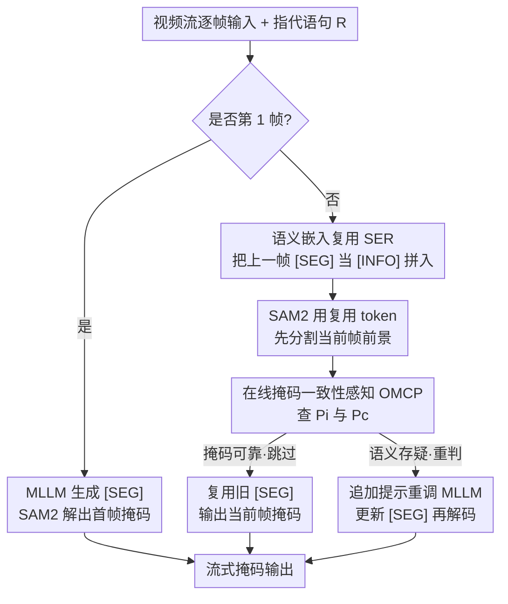

# Towards Streaming Referring Video Segmentation via Large Language Model

**会议**: CVPR 2026  
**论文**: [CVF Open Access](https://openaccess.thecvf.com/content/CVPR2026/html/Zhang_Towards_Streaming_Referring_Video_Segmentation_via_Large_Language_Model_CVPR_2026_paper.html)  
**代码**: https://github.com/wkzhang636/StreamingRVOS  
**领域**: 视频理解 / 指代分割 / 多模态VLM  
**关键词**: 指代视频分割, 流式推理, MLLM, 语义嵌入复用, 自适应调用

## 一句话总结
StreamingRVOS 把基于 MLLM 的指代图像分割改造成「逐帧流式」的指代视频分割：用 **语义嵌入复用（SER）** 把上一帧的 `[SEG]` token 当作时序上下文喂回 MLLM，再用 **在线掩码一致性感知（OMCP）** 判断当前帧要不要重新调用 MLLM，从而在不加任何参数的前提下，1B 变体在 MeViS 上比 Sa2VA 提升 19.2%，流式推理达到 7 FPS（单卡 A800）。

## 研究背景与动机

**领域现状**：指代视频物体分割（RVOS）要求根据一句自然语言描述（如「a person wearing black pants」）在整段视频里把目标分割并跟踪出来。目前基于 MLLM 的主流做法（VISA、VideoLISA、Sa2VA、VRS-HQ、GLUS 等）几乎都是「离线三段式」：先用采样策略从视频里挑出若干稀疏关键帧 → 让 MLLM 在这些帧上做图像级指代分割、输出 `[SEG]` token → 再把得到的稀疏掩码作为提示，交给分割助手（如 SAM2）传播到其余帧。

**现有痛点**：这套离线流水线有三个老毛病。其一是**预处理负担**——它依赖精心设计的帧采样策略，引入额外开销且整个流程被切成互相隔离的步骤；其二是**优化困难**——采样、图像分割、掩码传播三个阶段缺乏紧耦合，无法端到端联合优化；其三是**适用性受限**——它本质是离线模式，必须事先拿到整段视频，没法处理真实世界的视频流，少数支持在线的方法实时性也不够。

**核心矛盾**：要做成真正的流式（逐帧到达、逐帧出结果），就撞上一对两难。如果处理当前帧时把之前所有帧信息都丢掉，会产生**时序遗忘**，表现为掩码在帧间突然跳变、语义前后不一致；可如果把视频帧不加压缩地顺序全喂进去，冗余视觉信息会不断累积，显存和算力急剧上升，训练推理效率崩坏。再加上，如果每一帧都独立调一次 MLLM 去理解语义，相邻帧高度相似导致大量重复计算，吞吐量成了瓶颈。

**本文目标**：在不破坏已有图像级分割框架、不新增模块和参数的前提下，把图像级指代分割「升维」成视频级，并且要做成能吃视频流、吐掩码流的在线范式。这分解为两个子问题——(1) 语义如何在帧间高效传播而不遗忘也不爆显存；(2) 何时才有必要重新调用昂贵的 MLLM。

**切入角度**：作者注意到，连接 MLLM 与分割助手的 `[SEG]` token 本身就是当前帧前景语义的「浓缩表示」。既然它能编码语义，那它天然可以被当成下一帧的时序提示循环利用——这就把「时序记忆」问题转化成了「token 复用」问题，无需任何额外的记忆库或注意力模块。

**核心 idea**：用「复用上一帧的分割 token 作为时序提示 + 用掩码自身的质量信号决定是否重新调用 MLLM」来替代「采样 + 传播」的离线流水线，实现 sampling-free 的流式指代视频分割。

## 方法详解

### 整体框架
StreamingRVOS 建立在 LISA 式的「MLLM 生成 `[SEG]` token、分割助手（SAM2）据此解码掩码」这一图像级框架之上，把它改成逐帧流式运行。视频以图像序列的形式逐帧进入模型：**第 1 帧**当作纯图像级指代分割，输入是「图像 + 指代语句 R」，MLLM 产出 `[SEG]`，SAM2 解出首帧掩码。**从第 2 帧起**，模型先把上一帧浓缩出的语义嵌入（记作 `[INFO]`）拼进 MLLM 输入作为时序上下文（这就是 SER）；但并不是每帧都真的去跑 MLLM，而是先用上一帧 token 让 SAM2 直接分割前景，再由 OMCP 评估这张掩码的质量与连续性——只有当 OMCP 判定「语义可能变了 / 掩码不可靠」时，才重新调用 MLLM 去纠正语义、重生成 `[SEG]`，否则直接复用、跳过 MLLM 以省算力。整个 pipeline 不引入任何新模块，全部能力来自对 `[SEG]`/`[INFO]` token 的循环利用和一个无参数的触发判据。

### 关键设计

**1. 语义嵌入复用 SER：把分割 token 当时序记忆循环利用**

逐帧独立处理会把视频上下文打碎，导致 MLLM 误判「被指代的动作此刻有没有发生」，掩码在帧间忽明忽暗、前后矛盾。SER 的做法是：把 MLLM 为分割生成的 `[SEG]` token 视为上一帧前景信息的浓缩表示 `[INFO]`，用 `[context]` 和 `[/context]` 标记起止，连同当前帧和指代语句一起喂回 MLLM。形式上，MLLM 的输入为

$$\text{Input} = \begin{cases} I_i + R, & i = 1 \\ I_i + R + [\text{INFO}], & i > 1 \end{cases}$$

其中 $i$ 是帧索引；对单图或视频首帧，`[INFO]` 只是一个无语义的占位符。这一设计的妙处在于**零额外参数**——它不像 SAM2 那样要建记忆库、做记忆注意力，而是直接复用本来就要在 MLLM 与分割助手之间传递的那个 token，等于免费拿到了一条时序信息通道。消融显示，去掉语义复用后视频分割性能明显退化，MeViS 上掉了 6.1 分（见消融表），证明这条「token 当记忆」的通道确实承担了关键的时序语义传递。

**2. 在线掩码一致性感知 OMCP：用掩码质量信号决定要不要重新调 MLLM**

如果每帧都重新调 MLLM 去理解场景，相邻帧高度相似会带来大量冗余计算。OMCP 的关键观察是：与其盲目逐帧调用，不如让掩码「自己报告」是否可信。它用两个无参数指标联合判断——**当前帧掩码置信度** $P_i$ 直接复用分割助手 SAM2 预测出的 IoU（不引入新模块），**帧间掩码一致性** $P_c$ 用当前帧与上一帧掩码的 IoU 度量：

$$P_c = \frac{|M_i \cap M_{i-1}|}{|M_i \cup M_{i-1}|}$$

触发条件写成

$$\text{OMCP} = (P_i > \tau_1) \,\&\, (P_c > \tau_2)$$

当两个条件都满足时，说明当前掩码既可靠又与前一帧连贯，可直接复用旧 `[SEG]`、跳过 MLLM；一旦置信度或连续性低于阈值，就在输入里追加一句显式指令（提示「目标可能已改变，请关注上下文」）重新调用 MLLM，纠正语义并重生成 `[SEG]`。这一自适应判据把「调用频率」和「场景难度」直接挂钩：简单连续的片段几乎不调 MLLM，复杂跳变处才重判，从而在精度和速度间动态平衡。消融显示，OMCP 相比「每帧都更新」既更快又更准（6.7 vs 3.4 FPS，且 Ref-DAVIS 从 75.4 升到 76.4）。

**3. 流式训练流水线 + 端到端联合优化：弥合训练与流式推理的鸿沟**

现有 RVOS 难优化，根子在「后处理传播掩码」这一步把流程割裂。为了让训练贴合流式推理，作者把训练分两阶段。**阶段一·联合优化**：首帧本质是图像级分割且其精度严重影响后续帧，因此按常规在图文混合数据集上训练，把图像级分割能力打牢。**阶段二·视频语义微调**：为加速推理、避免不必要的 MLLM 调用，专门在「语义模糊、时序不连续」的条件下微调（依据 OMCP 模拟真实推理场景），让模型学会在该跳过时跳过、该重判时重判。整个模型端到端优化，掩码损失结合二元交叉熵与 DICE：

$$L_{mask} = \lambda_{bce} L_{bce}(X_M^s, \hat{X}_M^s) + \lambda_{dice} L_{dice}(X_M^s, \hat{X}_M^s)$$

总损失再加上文本自回归交叉熵 $L_{txt}$：

$$L_{total} = \lambda_{txt} L_{txt}(y_{txt}, \hat{y}_{txt}) + \lambda_{mask} L_{mask}$$

所有 $\lambda$ 都设为 1。值得注意的是，阶段二的「在 OMCP 触发条件下训练」是把推理时的自适应跳过机制提前注入训练，这正是消融里「OMCP 比逐帧更新还准」的原因——训练和推理用了同一套触发逻辑，消除了二者的分布差异。

### 损失函数 / 训练策略
如上，损失为文本生成损失 + 掩码损失（BCE + DICE），$\lambda_{bce}=\lambda_{dice}=\lambda_{txt}=\lambda_{mask}=1$。MLLM 用 InternVL2.5-1B / 4B，借助 XTuner 训练评测，只冻结感知模型、对 LLM 用 LoRA 微调，最大序列长 8192，初始学习率 $4\times10^{-5}$，8×A800（80GB）训练。OMCP 阈值：1B 变体 $\tau_1=0.7,\tau_2=0.1$；4B 变体 $\tau_1=0.8,\tau_2=0.2$。训练时把视频片段切成 5 帧做流式处理。

## 实验关键数据

### 主实验
在 Ref-DAVIS17、Ref-YouTube-VOS、MeViS、ReVOS(Referring) 四个 RVOS 基准上与 SOTA 对比（J&F 指标，节选）：

| 方法 | 参数/来源 | Ref-DAVIS17 | Ref-YT-VOS | MeViS | ReVOS |
|------|-----------|-------------|------------|-------|-------|
| GLUS [CVPR'25] | 7B | - | 67.3 | 51.3 | 58.3 |
| VRS-HQ [CVPR'25] | 7B | 76.0 | 70.4 | 50.6 | 62.1 |
| ViLLa [ICCV'25] | 6B | 74.3 | 67.5 | 49.4 | - |
| Sa2VA-1B [Arxiv'25] | 1B | 72.3 | 65.3 | 41.7 | 39.0* |
| Sa2VA-4B [Arxiv'25] | 4B | 73.8 | 70.0 | 46.2 | 59.8* |
| **StreamingRVOS-1B** | 1B | 76.4 | 69.1 | 49.7 | 59.7 |
| **StreamingRVOS-4B** | 4B | **76.6** | 70.5 | 50.9 | **63.0** |

1B 变体在 MeViS 上从 Sa2VA-1B 的 41.7 升到 49.7（论文摘要称提升 19.2%），且只用 1B 参数就逼近 VRS-HQ-7B；4B 变体在 Ref-DAVIS 和 ReVOS 上拿到 SOTA。在 RES 基准（RefCOCO/+/g）上同样保持强势，4B 变体在 RefCOCOg val/test 达 79.9/80.3，说明流式改造没有牺牲图像级能力。

### 消融实验
SER 与 OMCP 的逐组件拆解（与同训练数据重训的 Sa2VA 对比，括号为相对纯流式 Sa2VA 的变化）：

| 配置 | SER | OMCP | Ref-DAVIS | MeViS(valu) | ReVOS |
|------|-----|------|-----------|-------------|-------|
| Sa2VA-1B-Stream† | | | 74.4 | 57.1 | 58.0 |
| Ours-1B | ✓ | | 75.0 (↓0.2) | 58.5 (↑6.1) | 58.9 (↑1.1) |
| Ours-1B | ✓ | ✓ | 76.4 (↑1.2) | 59.5 (↑7.1) | 59.7 (↑1.9) |
| Ours-4B | ✓ | ✓ | 76.6 (↑1.4) | 60.2 (↑7.8) | 63.0 (↑5.2) |

`[INFO]` 更新策略对比（速度/精度权衡）：

| 更新策略 | Ref-DAVIS | MeViS(valu) | ReVOS | FPS |
|----------|-----------|-------------|-------|-----|
| 仅首帧 | 70.8 | 54.4 | 56.5 | 8.9 |
| 每 1 帧更新 | 75.4 | 59.2 | 58.9 | 3.4 |
| 每 5 帧更新 | 75.2 | 59.0 | 59.3 | 6.7 |
| 每 10 帧更新 | 75.1 | 58.4 | 58.7 | 8.1 |
| **OMCP（自适应）** | **76.4** | **59.5** | 59.7 | 6.7 |

### 关键发现
- **SER 在动态场景收益最大**：去掉语义复用后 MeViS 掉 6.1 分（动态场景最吃时序一致性），而 Ref-DAVIS（场景较静）几乎不变，说明 SER 主要补的是「动作随时间变化」时的语义连贯。
- **OMCP 是「又快又准」而非「以快换准」**：相比「每 1 帧都更新」，OMCP 把 FPS 从 3.4 提到 6.7（近 2 倍），且 Ref-DAVIS/MeViS 还更高——因为视频微调阶段就用 OMCP 触发条件训练，训推一致消除了分布差。
- **`[INFO]` 不是越多越好**：用 FIFO 队列堆叠多个 `[INFO]`（2×、3×）并未带来稳定提升，作者归因于简单 FIFO 队列可能污染语义 token、损害传播表示的保真度。
- **阈值越高越准但越慢**：$P_i$、$P_c$ 阈值升高会让 MLLM 重判更频繁，精度上升但延迟增加，是一条可调的精度-速度曲线。

## 亮点与洞察
- **「分割 token 即时序记忆」的视角很巧**：`[SEG]` token 本来只是 MLLM 与 SAM2 之间的桥，作者发现它天然是前景语义的浓缩表示，循环回喂就成了零参数的时序通道——不建记忆库、不加注意力，把记忆问题降维成 token 复用。
- **用掩码自身质量当调度信号，零额外模块**：OMCP 直接借 SAM2 已经算好的预测 IoU 当置信度、用相邻掩码 IoU 当一致性，不训练任何「是否调用」的判别器，却实现了与场景难度自适应的算力分配，这个 trick 可迁移到任何「昂贵大模型 + 廉价质量信号」的级联系统（如流式检测、流式 VQA）。
- **训推一致是性能来源而非附带**：把推理时的自适应跳过逻辑提前放进训练阶段二，是 OMCP「比逐帧还准」的根因，提醒做流式/自适应推理时要让训练分布对齐推理行为。
- **小模型打平大模型**：1B 变体逼近 VRS-HQ-7B，说明在指代分割里「怎么传时序语义」比「堆参数」更关键。

## 局限性 / 可改进方向
- **作者承认**：对需要「全局离线推理」的视频推理分割（VRS）任务表现受限——这类任务用复杂文本查询、要求事先拿到整段视频做全局推断，而流式范式的时序因果性决定了它只能看到过去帧，无法回看未来；作者计划探索带在线推理能力的流式方法。
- **`[INFO]` 队列机制偏简陋**：仅用 FIFO 队列存历史 token，多 token 反而因「污染」失效，说明时序记忆的聚合/去噪还有改进空间（可借鉴 SAM2Long 的树状记忆或带门控的聚合）。
- **OMCP 阈值需按模型规模手调**（1B 用 0.7/0.1、4B 用 0.8/0.2），缺乏自适应阈值机制，换数据集/模型可能要重调。
- **首帧依赖性强**：流式范式下首帧分割质量「严重影响后续帧」，首帧若错会沿时间传播，虽有 OMCP 在线纠正但纠正能力上限未充分压力测试。

## 相关工作与启发
- **vs Sa2VA（同 MLLM 基线）**：Sa2VA 是离线/多图处理，本文把它改成逐帧流式并加 SER+OMCP——去掉 SER、OMCP 后本文就退化成 Sa2VA-Stream。在动态场景 MeViS 上提升尤为显著（1B 从 41.7→49.7），核心差异是「时序语义怎么在线传」。
- **vs VRS-HQ [CVPR'25]**：VRS-HQ 用时序动态聚合 + token 驱动关键帧选择来解决单 token 表达力不足，仍是离线选帧；本文不选帧、纯流式，用更少参数（1B/4B vs 7B）打平甚至超过，且支持视频流实时输入。
- **vs GLUS [CVPR'25]**：GLUS 把帧分成上下文帧与查询帧来兼顾全局/局部，仍需预先访问整段视频；本文逐帧到达、逐帧产出，真正在线。
- **vs SAM2 系记忆方案（SAM2Long/SAMURAI/MPG-SAM2）**：它们靠增强记忆库/记忆注意力或运动评分来抗遮挡误差累积；本文不改 SAM2 内部记忆，而是在 MLLM 侧用 token 复用注入时序语义，并用 OMCP 调度调用，路线互补。
- **启发**：OMCP「用廉价质量信号自适应触发昂贵大模型」的级联思想，可推广到任何流式多模态任务，是一种通用的算力-精度调度范式。

## 评分
- 新颖性: ⭐⭐⭐⭐ 「`[SEG]` token 即时序记忆」+「掩码质量自适应调度 MLLM」两点视角新颖且零额外参数，但底座仍是 LISA/Sa2VA 框架的改造。
- 实验充分度: ⭐⭐⭐⭐ 覆盖 4 个 RVOS + 3 个 RES 基准、含组件/数量/更新策略多维消融与 FPS 分析，公平对比同训练数据 Sa2VA；VRS 任务未覆盖。
- 写作质量: ⭐⭐⭐⭐ 动机三难讲得清楚、图对比直观，公式定义完整；缓存文本有个别拼写噪声但不影响理解。
- 价值: ⭐⭐⭐⭐ 首个真正面向视频流、7 FPS 实时、sampling-free 的 MLLM 指代视频分割框架，对实时人机交互场景实用价值高，代码开源。

<!-- RELATED:START -->

## 相关论文

- [\[CVPR 2026\] InterRVOS: Interaction-Aware Referring Video Object Segmentation](interrvos_interaction-aware_referring_video_object_segmentation.md)
- [\[CVPR 2025\] GLUS: Global-Local Reasoning Unified into A Single Large Language Model for Video Segmentation](../../CVPR2025/segmentation/glus_global-local_reasoning_unified_into_a_single_large_language_model_for_video.md)
- [\[CVPR 2026\] Long-RVOS: A Comprehensive Benchmark for Long-term Referring Video Object Segmentation](long-rvos_a_comprehensive_benchmark_for_long-term_referring_video_object_segment.md)
- [\[CVPR 2026\] RobotSeg: A Model and Dataset for Segmenting Robots in Image and Video](robotseg_a_model_and_dataset_for_segmenting_robots_in_image_and_video.md)
- [\[CVPR 2026\] DeRVOS: Decoupling Consistent Trajectory Generation and Multimodal Understanding for Referring Video Object Segmentation](dervos_decoupling_consistent_trajectory_generation_and_multimodal_understanding_.md)

<!-- RELATED:END -->
