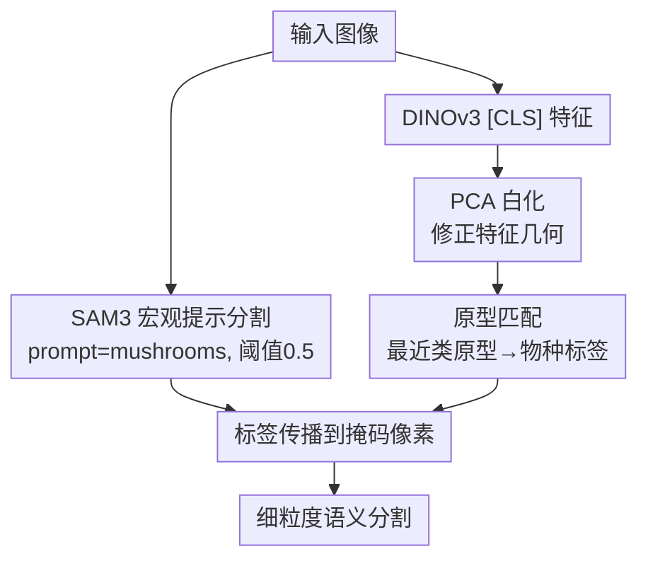

# Training-Free Fine-Grained Semantic Segmentations in Low Data Regimes: A FungiTastic Baseline

**会议**: CVPR 2026 (Workshop)  
**arXiv**: [2605.22492](https://arxiv.org/abs/2605.22492)  
**代码**: 无  
**领域**: 语义分割 / 细粒度识别 / 基础模型 / 小样本  
**关键词**: 免训练分割, 细粒度, 原型匹配, PCA白化, SAM3, DINOv3

## 一句话总结
针对菌类细粒度分割这种「类别多、样本少、长尾、采集条件杂」的场景，本文提出一个**完全免训练**的两阶段流水线——先用 SAM3 配「mushrooms」这种宏观提示拿到类无关掩码，再用 DINOv3 特征做原型匹配贴细粒度标签，并发现对 DINOv3 特征做一次 **PCA 白化**就能把原型分类准确率从约 30% 拉到 55%，由此给出 FungiTastic 上首个低数据细粒度分割基线。

## 研究背景与动机
**领域现状**：细粒度语义分割同时要求「精确定位」和「区分视觉上极相似的类别」。在真菌识别（mycology）里这个问题尤其棘手——同属物种长得几乎一样、类内变化大、类别呈严重长尾分布；FungiTastic 数据集还叠加了背景、光照、缩放等采集条件的巨大差异。

**现有痛点**：稠密像素级标注成本极高，在这种专业领域几乎没有分割监督数据，因此低数据/免训练管线很有吸引力。SAM3 有很强的「类无关」分割能力，但要让它输出**语义**分割，得给它喂类别提示（class-specific prompting）。问题是：推理时根本不知道正确的物种类别是什么；如果穷举提示，每张图要前向 194 次（一类一次），分割开销随类别数线性增长，完全不可扩展。

**核心矛盾**：SAM3 给出语义掩码的前提（知道类别提示）与细粒度推理的前提（类别恰恰是要预测的未知量）相互冲突；把「分割」和「分类」捆在一起做，要么需要 oracle 类别、要么开销爆炸。

**本文目标**：在只有图像级类别标注、没有任何分割监督的前提下，做出可扩展、低成本的细粒度语义分割，并把它做成低数据 regime 下的可复现基线。

**切入角度**：作者假设——分割这一步其实不需要知道细粒度类别。先用一个**宏观分类**概念（「mushrooms」）把蘑菇这个大类整体抠出来，分割成本就和类别数无关、保持恒定；细粒度类别交给一个独立的、基于 DINOv3 特征的免训练分类器去贴。

**核心 idea**：**解耦分割与分类**——SAM3 负责「框出蘑菇」（类无关、宏观提示），DINOv3 原型匹配负责「这是哪种蘑菇」，再把标签传播到掩码像素上；并用 PCA 白化修正 DINOv3 特征几何，让原型比较更可靠。

## 方法详解

### 整体框架
整个方法是一条**免训练的两阶段双分支流水线**，输入一张蘑菇图片，输出细粒度（按物种）的语义分割掩码，中间没有任何针对本任务的训练。

两条分支并行：**分割分支**把图片喂给 SAM3，用宏观分类提示「mushrooms」+ 0.5 阈值，得到一张**类无关**的蘑菇掩码（分割开销与 194 个类别数无关，恒定）；**分类分支**把同一张图喂给冻结的 DINOv3，取 `[CLS]` token 作为图像级特征，先做 PCA + 白化变换，再在变换后的空间里找最近的类原型，得到细粒度物种标签。最后**融合**：把预测出的物种标签传播给掩码里的所有像素，类无关区域就变成了类特定的细粒度分割。

作者特意验证了两阶段的**先后顺序**：理论上也可以先分类、再用细粒度物种名去提示 SAM3，但 Table 1 显示「先分割后分类」精度更高（且避免了 194 次提示），因此采用这个顺序。原型在「原型构建阶段」离线算好：对每个训练样本提 DINOv3 特征、做 PCA 白化、按类取归一化特征的均值即为该类原型。

### 关键设计

**1. 解耦的两阶段框架：把「分割」和「分类」拆开，让分割成本与类别数无关**

痛点直接来自 SAM3：要它出语义掩码就得给类别提示，但推理时类别未知，穷举提示会让开销随 194 个类别线性膨胀。作者的做法是**不在分割阶段引入细粒度类别**——只用「mushrooms」这个**宏观分类（macro-taxonomic）**概念让 SAM3 整体抠出蘑菇，分割复杂度因此恒定，与标签空间大小脱钩；细粒度判别完全甩给后面独立的分类分支。这样既可扩展、又把最贵的分割那一步做成了一次性、低成本操作。Table 1 还证明这个顺序是对的：用宏观提示先分割（mIoU 0.8937）远好于假设 oracle 类别后再用细粒度物种名提示 SAM3（mIoU 0.5522）——说明 SAM3 对具体物种名的提示反而置信度更低、分割更差（细粒度 oracle 那行甚至要把阈值降到 0.3 才能用），这反向支撑了「分割就该用宏观提示」的设计。

**2. DINOv3 原型匹配做免训练细粒度分类**

分类分支要在没有任何训练的前提下区分 194 个长得很像的物种。作者用冻结的 DINOv3 作 backbone，取 `[CLS]` token 当图像级表示，走经典的原型（prototype）路线：每个类的原型是该类训练样本归一化特征的均值 $\mathbf{p}_c = \frac{1}{|S_c|}\sum_{x\in S_c}\hat{f}(x)$，推理时给测试图提特征、在（变换后的）空间里用余弦相似度选**最近原型**作为预测类别。这条路天然适配低数据：每类只要几张图就能构造原型，作者在 $k=5,10,20,50,100,200$ 张/类的设定下都做了评测，并用 20 个随机种子取均值/标准差。原型法把「细粒度分类」从需要训练的判别器，降级成一次特征提取 + 一次最近邻比较。

**3. PCA 白化：修正 DINOv3 特征几何，是整篇真正的性能拐点**

这是论文最关键、也最反直觉的发现。FungiTastic 里背景、光照、缩放等**干扰因素（nuisance）**会主导 DINOv3 `[CLS]` 嵌入的几何结构，让那些真正利于细粒度判别的方向被高方差的干扰方向淹没。结果是：在原始 4096 维空间里直接归一化、或者只做普通 PCA，都**分不开类别**——原型比较所需的度量结构和预训练嵌入空间的结构不匹配。PCA 白化的修法是：把特征投影到主成分基上后，**每个保留分量再除以自己的标准差**重标定到单位方差，于是各方向更均衡、高方差的干扰主导方向被压制，类别相关的信息得以参与到余弦比较里。效果是决定性的：原始归一化特征 mAcc 仅约 30%，加白化后直接 +20% 到约 50%（峰值 0.55），而普通 PCA 几乎没用甚至略掉点。作者据此给出一个更普适的判断——**在低数据细粒度场景里，表示的预处理可能和选哪个基础模型一样重要**。

### 损失函数 / 训练策略
本方法**完全免训练**，没有损失函数。唯一的「拟合」是离线按类求均值得到原型，以及在训练子集上估计 PCA 白化的投影矩阵。为模拟低数据 regime，作者从训练集均匀采样构造多个子集，在 $n=20$ 个随机种子上重复实验取均值/标准差。SAM3 宏观提示阈值取 0.5，细粒度 oracle 对照取 0.3（因物种名提示置信度更低）。

## 实验关键数据

数据集为 FungiTastic 中带分割掩码的子集：训练约 13k 图、测试约 9k 图，覆盖 194 个类别；评测指标为图像级 mean class accuracy（mAcc）与分割 mean IoU（mIoU），均在测试集上跑 20 次取均值。

两个核心指标的定义（按类平均，$C$ 为类别数，$M^I$、$M^P$ 分别为图像级与像素级混淆矩阵，$M_{ij}$ 为真值类 $i$、预测类 $j$ 的样本数）：

$$\mathrm{mAcc}=\frac{1}{C}\sum_{i=1}^{C}\frac{M^{I}_{ii}}{\sum_{j=1}^{C}M^{I}_{ij}}, \qquad \mathrm{mIoU}=\frac{1}{C}\sum_{i=1}^{C}\frac{M^{P}_{ii}}{\sum_{j=1}^{C}M^{P}_{ij}+\sum_{j=1}^{C}M^{P}_{ji}-M^{P}_{ii}}$$

### 主实验

**提示策略对比（Table 1，含 oracle 上界）**：

| 提示策略 | mIoU | 非空/总图像数 | 说明 |
|----------|------|---------------|------|
| 宏观提示（mushrooms）+ oracle 分类 | **0.8937** | 9643/9763 | SAM3 抠蘑菇的能力上界 |
| oracle 细粒度物种名提示 SAM3 | 0.5522 | 6341/9763 | 用具体物种名提示反而更差 |

关键结论：宏观提示分割（0.8937）远好于细粒度物种名提示（0.5522），证明「分割就用宏观提示、把细粒度交给后面」是对的。

### 消融实验

**特征预处理 × 每类样本数 $k$（Table 2，20 种子均值，最大标准差 ≤ 0.01）**：

| 配置 | mAcc (k=5) | mAcc (k=20) | mAcc (k=50→200) | mIoU (k=50) |
|------|-----------|-------------|-----------------|-------------|
| Norm. cosine（原始归一化） | 0.24 | 0.31 | 0.32→0.33 | 0.15 |
| PCA cosine（普通 PCA） | 0.23 | 0.30 | 0.32→0.32 | 0.14 |
| **PCA white cosine（白化）** | **0.33** | **0.51** | **0.55→0.55** | **0.31** |

### 关键发现
- **PCA 白化是唯一拉开差距的因素**：mAcc 从约 0.33 抬到 0.55（+20 个百分点），mIoU 从约 0.15 抬到 0.31（翻倍）；而普通 PCA 几乎和不做预处理一样，甚至略差——说明关键不在降维，而在「除以标准差」抑制干扰主导方向。
- **小子集即可覆盖大部分变化**：mAcc 和 mIoU 在每类约 40–60 张图后基本饱和（Figure 1），50 张/类时分割 mIoU 达到约 30% 峰值，再加数据收益甚微，印证「低数据足够」。
- **最终分割性能受 SAM3 掩码与原型分类器共同制约**：即便分类做对，分割上界也由 SAM3 宏观掩码质量（0.8937）封顶。

## 亮点与洞察
- **「分割成本与类别数解耦」是个很实用的工程洞察**：把贵的 SAM3 调用做成一次宏观提示、与 194 个类别脱钩，避免了 per-class 穷举提示的 194× 开销，这种「用粗粒度提示 + 后置细粒度判别」的范式可迁移到任何「foundation 分割模型 + 大量细分类」的场景。
- **最让人「啊哈」的是 PCA 白化的威力**：一个经典预处理技巧，在 DINOv3 特征上贡献了 +20% 准确率，而换更强的 backbone 都未必有这么大收益——「修特征几何」可能比「换基础模型」更划算。
- **Table 1 的反直觉结论**：用更精确的物种名提示 SAM3，分割反而更差（0.55 vs 0.89），因为 SAM3 对具体细粒度概念的置信度更低——提示越「专业」未必越好，给基础模型喂它擅长的粒度更重要。

## 局限性 / 可改进方向
- **只用 `[CLS]` 全局描述子**：忽略了 `[PATCH]` token 的局部信息，对同图多株、遮挡、多类共存的场景表达力受限；作者把引入掩码化 `[PATCH]` token 列为未来工作。
- **绝对精度仍很低**：最佳 mAcc 0.55、mIoU 0.31，作为「首个基线」可用，但离实用还远；这更多是 FungiTastic 任务本身极难（194 类长尾、强干扰）所致。
- **分割上界被 SAM3 封死**：宏观掩码 mIoU 0.8937 是天花板，分类再准也越不过；且整套依赖 SAM3 / DINOv3 两个特定基础模型，对其它 backbone 的泛化未验证。
- **单类分割设定**：当前只处理「蘑菇 vs 背景」式的单前景，多类共存分割（multi-class segmentation）尚未评测，作者列为后续方向。

## 相关工作与启发
- **vs 细粒度小样本分类（如 FungiCLEF 方案 [4][8]）**：它们靠特征工程、集成、轻量微调做长尾**分类**，不碰分割；本文把原型分类和类无关分割组合成单一管线，第一次给出细粒度**分割**基线。
- **vs 类别条件提示的 SAM3 用法**：标准用法要给 SAM3 喂类别提示才能出语义掩码，推理时不可行且开销 194×；本文用宏观提示让分割成本恒定，是更可扩展的替代方案。
- **vs 普通原型 / PCA 预处理**：本文延续原型学习思路，但点出在强干扰低数据下，原始 DINOv3 特征几何与原型度量不匹配，必须靠 PCA 白化（而非普通 PCA/归一化）修正——把「白化提升自监督表示」[6][20] 的观察落到了细粒度分割管线上。

## 评分
- 新颖性: ⭐⭐⭐ 组合现成模块（SAM3+DINOv3+PCA白化）而非全新方法，但「解耦+宏观提示+白化」的配方和首个低数据细粒度分割基线有价值
- 实验充分度: ⭐⭐⭐ 20 种子、多 $k$ 设定、含 oracle 上界，但只在单一数据集、单一 backbone 组合上验证
- 写作质量: ⭐⭐⭐⭐ 短小清晰，动机与发现讲得明白，Table 1/2 直击要点
- 价值: ⭐⭐⭐⭐ 为一个无人涉足的难题（低数据细粒度分割）立了可复现基线，并给出「修特征几何 ≈ 换更强模型」的实用洞察

<!-- RELATED:START -->

## 相关论文

- [\[CVPR 2026\] Training-Free Open-Vocabulary Camouflaged Object Segmentation via Fine-Grained Object Binding and Adaptive Hybrid Prompt](training-free_open-vocabulary_camouflaged_object_segmentation_via_fine-grained_o.md)
- [\[CVPR 2026\] INSID3: Training-Free In-Context Segmentation with DINOv3](insid3_training-free_in-context_segmentation_with_dinov3.md)
- [\[CVPR 2026\] The Power of Prior: Training-Free Open-Vocabulary Semantic Segmentation with LLaVA](the_power_of_prior_training-free_open-vocabulary_semantic_segmentation_with_llav.md)
- [\[CVPR 2026\] PEARL: Geometry Aligns Semantics for Training-Free Open-Vocabulary Semantic Segmentation](pearl_geometry_aligns_semantics_for_training-free_open-vocabulary_semantic_segme.md)
- [\[CVPR 2026\] Direct Segmentation without Logits Optimization for Training-Free Open-Vocabulary Semantic Segmentation](direct_segmentation_without_logits_optimization_for_training-free_open-vocabular.md)

<!-- RELATED:END -->
