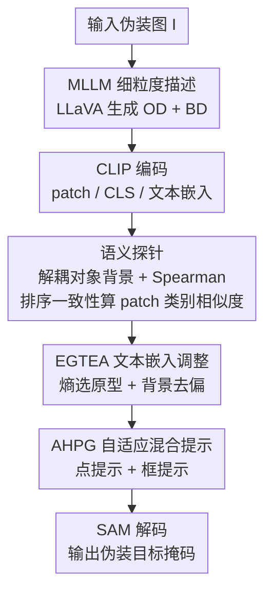

# Training-Free Open-Vocabulary Camouflaged Object Segmentation via Fine-Grained Object Binding and Adaptive Hybrid Prompt

**会议**: CVPR 2026  
**论文**: [CVF Open Access](https://openaccess.thecvf.com/content/CVPR2026/html/Ren_Training-Free_Open-Vocabulary_Camouflaged_Object_Segmentation_via_Fine-Grained_Object_Binding_and_CVPR_2026_paper.html)  
**领域**: 语义分割 / 开放词表 / 伪装目标分割  
**关键词**: 伪装目标分割, 开放词表, 训练自由, 对象绑定, CLIP+SAM

## 一句话总结
本文提出一个**完全免训练**的开放词表伪装目标分割（OVCOS）框架：用 MLLM 为每张图生成细粒度的「对象描述 + 背景描述」补全稀疏文本语义，再用语义探针（Semantic Probe）解耦对象/背景特征、按 Spearman 排序一致性建模 patch 之间的类别相似度实现精确「对象绑定」，配合熵引导的文本嵌入调整（EGTEA）和自适应混合提示（AHPG）驱动 SAM，在 OVCamo 上大幅超过此前最强的免训练方法 ResCLIP（六指标平均 +16.8%）。

## 研究背景与动机

**领域现状**：伪装目标分割（COS）旨在分割那些与背景高度相似、肉眼难辨的物体（如枯枝上的竹节虫、草丛里的麻鸦）。开放词表版本 OVCOS 进一步要求模型能分割**训练时没见过的**伪装类别。现有 OVCOS 方法（OVCoser、SuCLIP）走的是全监督路线，依赖像素级 mask 标注训练。

**现有痛点**：全监督范式有两个硬伤——一是需要昂贵的 mask 标注，二是容易过拟合到已见类（seen class），泛化到新伪装类别时掉点严重。而 OVSS 领域已有的**免训练**范式（直接复用 CLIP + SAM/DINO，无需任何训练）虽然能即插即用、快速迁移到新域，但搬到伪装场景就失灵了：它们普遍用稀疏文本提示（"a photo of a {class}"）并直接拿 patch-文本相似度图做分割，缺乏精确的「对象绑定」（object binding，即文本提示与具体视觉对象之间的准确映射）能力。

**核心矛盾**：作者把免训练方法在伪装场景失灵的根因归为两点。① **文本语义稀疏**：一句"a photo of a {class}"只给了类别名，没有伪装对象的细粒度属性（颜色、纹理、形状）和背景语义描述，模型很容易被背景语义干扰。② **忽视 patch 间类别相似关系**：现有方法直接用单个 patch 的相似度，而在伪装场景里物体和背景的局部视觉特征极其相似，单 patch 的文本相似度极易被背景扭曲。但同属一个伪装物体的不同 patch，其类别分布本应高度相关——这种相关性没被建模，进一步阻碍了准确绑定。

**本文目标 & 核心 idea**：不训练、不标注，靠「**补全文本语义 + 显式建模 patch 间类别一致性**」来恢复对象绑定能力。具体把 MLLM 生成的细粒度描述当文本先验，用语义探针 + Spearman 排序一致性把绑定做精，再用熵引导调整文本嵌入压制背景偏置，最后生成混合提示喂给 SAM 出 mask。

## 方法详解

### 整体框架
整个框架是一条**全冻结、零训练**的串行流水线：输入一张伪装图，输出该图中伪装物体的分割掩码及其开放词表类别。所有大模型（CLIP ViT-L/14、SAM ViT-H、LLaVA-1.5-7B）参数全程不动。流程是：先用 LLaVA 离线为每张图生成对象描述（OD）和背景描述（BD），把"一句话类名"扩成细粒度文本先验；CLIP 视觉/文本编码器分别抽取 patch 特征 $F_{patch}$、[CLS] 特征 $F_{cls}$ 和文本嵌入；语义探针用 OD/BD 嵌入解耦对象与背景，并用 Spearman 排序一致性算出 patch 间类别相似度，对 patch 特征做重加权得到绑定后的对象/背景相似度图 $S_o^*$、$S_b^*$；EGTEA 基于熵筛出对象/背景原型，去除文本嵌入在背景方向上的投影来纠偏；AHPG 从精化后的相似度图里生成点提示 + 框提示；最后把混合提示送进 SAM 解码出最终掩码。

需要强调的一个工程点：CLIP 原本只擅长 [CLS] 全局对齐、局部表示弱，作者沿用 ResCLIP 的做法，去掉 ViT 最后一层的残差连接和 FFN，用中间层注意力特征去精化末层视觉特征，从而保留更多密集预测所需的局部细节。

### 关键设计

**1. MLLM 细粒度对象/背景描述：把稀疏类名扩成富语义文本先验**

针对"文本语义稀疏"这个痛点，作者不再用"a photo of a {class}"这种空壳提示，而是调用 LLaVA-1.5 为**每张输入图**单独生成两段文本：对象描述（OD）聚焦伪装物体的判别性属性（颜色、纹理、形状，如"灰白羽毛、细长脖颈、尖喙，乍看难以发现"），背景描述（BD）聚焦场景属性（环境纹理、空间分布，如"密集的高草与芦苇丛，绿褐相间"）。这两段文本经 CLIP 文本编码器得到 $F_t^{od}\in\mathbb{R}^{C\times D}$ 和 $F_t^{bd}\in\mathbb{R}^{C\times D}$，拼成语义探针 $SP_t=[F_t^{od}, F_t^{bd}]$。这么做的好处是给后续绑定提供了"对象长什么样"和"背景长什么样"两套对照先验，模型不再只能靠一个类名去硬猜，从源头缓解背景语义干扰。为了不拖慢推理，OD/BD 是**离线**生成并存成 JSON 的，推理时直接读取，不实时调用 MLLM。

**2. 语义探针 + Spearman 排序一致性：显式建模 patch 间类别相似度实现对象绑定**

这是全文核心，针对"忽视 patch 间类别相似关系"的痛点。先按 $S=\cos(F_{patch}, F_t)$ 在每个 patch 与 $2C$ 个语义探针（$C$ 个对象 + $C$ 个背景）之间算出得分矩阵 $Score(n,m)\in\mathbb{R}^{N\times L\times 2C}$，并按探针归属拆出单维的对象相似度图 $S_o$ 和背景相似度图 $S_b$：

$$S_o = \frac{1}{C}\sum_{m=1}^{C}Score(n,m),\qquad S_b = \frac{1}{C}\sum_{m=C+1}^{2C}Score(n,m)$$

关键一步是**不直接用绝对相似度**，而是把每个 patch 的得分行 $Score(n,:)$ 降序排序（并列取平均秩）得到排序向量 $R(n,m)$，再用 Spearman 相关系数衡量任意两 patch 的类别相似度 $Sim_{class}(n_1,n_2)\in[0,1]$：

$$Sim_{class}(n_1,n_2) = 1 - \frac{\sum_{m=1}^{2C}\big(R(n_1,m)-R(n_2,m)\big)^2}{M(M^2-1)}$$

其中 $M$ 为语义探针数量。**为什么用排序而不是绝对值**：在伪装场景里对象和背景的绝对响应值会因视觉模糊而趋同，KL/JS 散度这类基于绝对响应分布的度量会把对象和背景误判为"分布相似"；而 Spearman 只看语义排序向量之间的关系——同一伪装物体的不同 patch 哪怕视觉上和背景混淆，其类别排序模式仍高度一致，因此能稳健地把它们绑到一起（消融中 Spearman 明显优于 KL/JS）。最后用 $Sim_{class}$ 分别乘 $S_o$、$S_b$ 得到对象/背景语义置信分 $Score_o=Sim_{class}\cdot S_o$、$Score_b=Sim_{class}\cdot S_b$，再去加权 $F_{patch}$ 得到绑定后的 $F_{patch}^o$、$F_{patch}^b$，回代得到精化的相似度图 $S_o^*$、$S_b^*$。

**3. 熵引导文本嵌入调整 EGTEA：压制背景偏置、纠正类别预测**

语义探针完成初步绑定后，对象与背景的高相似度仍会带来类别预测偏置。已有方法 CASS 用层次聚类从图像里抽"对象专属视觉向量"来优化文本嵌入，但伪装场景下根本抽不到可靠的对象专属向量。EGTEA 改用**熵**来定位可信原型：对 $S_o^*$ 沿类别维做 Softmax 得到每个 patch 的概率分布 $Probs_{i,j}$，算出逐 patch 熵 $H=-\sum_c Probs_{i,c}\log Probs_{i,c}$；取熵**最高**的 top-K 个 patch 当伪装对象候选（最不确定 ≈ 与背景最纠缠，正是伪装物体所在），熵**最低**的 K 个当背景候选，分别求出对象视觉原型 $\varepsilon_o$、背景视觉原型 $\varepsilon_b$ 和文本嵌入原型 $\varepsilon_t$。然后构造融合视觉上下文与语义先验的锚点，并把文本嵌入在背景方向上的投影减掉以去偏：

$$A_{anchor} = \alpha\cdot\varepsilon_o + \varepsilon_t,\quad \dot{F}_t = \varepsilon_t - \Big(\varepsilon_t\cdot\frac{\varepsilon_b}{\lVert\varepsilon_b\rVert^2}\Big)\cdot\frac{\varepsilon_b}{\lVert\varepsilon_b\rVert^2}$$

$$F_t^* = \gamma\cdot A_{anchor} + (1-\gamma)\cdot\dot{F}_t$$

其中 $\alpha=0.3$ 控制对象视觉原型的融合权重，$\gamma=0.3$ 调节背景抑制强度与对齐程度。调整后的 $F_t^*$ 与 [CLS] 重新做类别预测。这一步等于在文本侧"擦掉"背景语义分量、又"注入"对象视觉证据，让文本嵌入真正贴合伪装对象的判别特征。

**4. 自适应混合提示生成 AHPG：给 SAM 喂点+框混合提示出完整掩码**

SAM 虽通用，但伪装场景下若提示不准就会分割到无关区域、掩码残缺。AHPG 基于 $S_o^*$、$S_b^*$ 自动生成提示。先取相似度最高的 top-$K^*$（$K^*=[0.1\cdot L]$）空间位置求平均，选出最优前景类 $c_o^*$ 和背景类 $c_b^*$，导出对应单通道相似度图 $\dot S_o^*$、$\dot S_b^*$；用阈值 $\tau_m=0.8$ 取出前景/背景候选点 $P_{fg}$、$P_{bg}$，再并集去重得到点提示 $P=\text{Unique}(P_{fg}\cup P_{bg})$。为提升稳定性，还从前景点集算最小外接矩形、并按 $\delta=\rho\cdot\max(w_B,h_B)$（$\rho=0.1$）做轴对齐外扩，避免出现零面积框：

$$B_{final} = [B_{min}-\delta,\; B_{max}+\delta]$$

点提示 + 框提示一起送进 SAM。**为什么要混合**：消融显示只用点会分割不完整、只用框会漏掉局部，点负责定位、框负责约束完整范围，两者互补才能把伪装目标完整抠出来。

### 损失函数 / 训练策略
本方法**完全免训练**，无任何损失函数与参数更新。CLIP ViT-L/14（VLM）、SAM ViT-H（分割器）、LLaVA-1.5-7B（MLLM）全部冻结，输入图 resize 到 $336\times336$，单张 NVIDIA A40 即可推理；OD/BD 离线生成存 JSON。

## 实验关键数据

### 主实验
OVCamo benchmark，novel 含 61 个未见伪装类别，六个指标 cSm / cF$^\omega_\beta$ / cMAE / cFβ / cEm / cIoU（除 cMAE 越低越好外其余越高越好）。

| 模型 | 设定 | cSm↑ | cF$^\omega_\beta$↑ | cMAE↓ | cIoU↑ |
|------|------|------|------|------|------|
| ResCLIP (CVPR25) | 免训练 ViT-L/14 | 0.326 | 0.156 | 0.508 | 0.144 |
| CASS (CVPR25) | 免训练 ViT-B/16 | 0.328 | 0.128 | 0.424 | 0.097 |
| OVCoser (ECCV24) | 全监督 | 0.579 | 0.490 | 0.336 | 0.443 |
| SuCLIP (ICCV25) | 全监督 | 0.667 | 0.594 | 0.242 | 0.540 |
| **本文** | 免训练 ViT-B/16 | 0.371 | 0.294 | 0.399 | 0.243 |
| **本文** | 免训练 ViT-L/14 | **0.502** | **0.418** | **0.379** | **0.371** |

在免训练赛道里，本文 ViT-B/16 比同架构 CASS 六指标平均 +7.2%，ViT-L/14 比 ResCLIP 六指标平均 **+16.8%**，cIoU 从 0.144 拉到 0.371（约 2.6 倍），大幅刷新免训练 SOTA。需注意全监督的 SuCLIP/OVCoser 数值更高，但它们需要 mask 标注训练，与免训练方法不在同一可比设定下。

### 消融实验
组件逐步叠加（CLIP ViT-L/14 为 baseline），同时报告显存与速度（表 2）：

| 配置 | 显存(G) | 速度(FPS) | cSm↑ | cIoU↑ | 说明 |
|------|------|------|------|------|------|
| #1 Baseline | 4.58 | 65.1 | 0.248 | 0.041 | 纯 CLIP 密集推理 |
| #2 +SP | 4.58 | 55.3 | 0.416 | 0.270 | 语义探针，六指标均 +15.1% |
| #3 +SP+SAM | 8.26 | 42.8 | 0.447 | 0.308 | 引入 SAM，+2.6% |
| #4 +SP+SAM+AHPG | 8.26 | 36.7 | 0.493 | 0.356 | 混合提示，+3.9% |
| #5 +全部+EGTEA | 8.26 | 30.2 | **0.502** | **0.371** | 完整模型，最优 |

语义探针内部消融（表 3）：去掉 LLaVA 改用 CamoTemplate 平均 -2.4%；只用对象探针比只用背景探针反而掉 7.4%（说明背景描述对反衬伪装对象很关键）；距离度量上 Spearman 全面优于 KL / JS 散度。AHPG/EGTEA 消融（表 4）：去框 -0.6%、去点 -2.4%、只用对象图生成提示 -1.4%；用 CASS 替换 EGTEA -0.7%、去背景去偏模块 -0.2%。

### 关键发现
- **语义探针是涨点主力**：单独加 SP 就让六指标平均 +15.1%、cIoU 从 0.041→0.270，远超 SAM(+2.6%)、AHPG(+3.9%) 的边际贡献——说明"建模 patch 间类别一致性"才是伪装场景绑定的核心瓶颈。
- **排序度量胜在抗模糊**：Spearman 只看排序关系，不受对象/背景绝对响应值趋同的影响，因此在伪装这种"视觉混淆"场景比 KL/JS 更稳。
- **对象与背景描述缺一不可**：只给对象描述比只给背景描述还差，背景描述提供了"什么不是对象"的对照，反而帮助绑定。
- **效率可接受**：完整模型 30.2 FPS、8.26G 显存，OD/BD 离线化避免了 MLLM 实时开销。

## 亮点与洞察
- **"绝对相似度 → 排序一致性"的视角转换很巧妙**：伪装的本质就是对象/背景绝对响应趋同，作者绕开绝对值、改用 Spearman 排序相关来度量 patch 间类别相似，正中伪装场景的要害，是可迁移到其他"高混淆"密集预测任务的思路。
- **用熵定位伪装对象**：把"熵最高=最不确定=最可能是伪装物体"当作原型筛选准则，再配合背景方向投影去偏，是一个不需训练就能纠正文本嵌入偏置的轻量技巧。
- **全免训练却逼近可用**：在不碰任何标注、不更新任何参数的前提下把免训练 SOTA 的 cIoU 翻了约 2.6 倍，对快速处理未见伪装数据的实际部署很有吸引力。
- **混合提示驱动 SAM** 的点（定位）+框（完整性）互补设计，给"如何把弱相似度图转成 SAM 高质量提示"提供了可复用范式。

## 局限与展望
- **强依赖 MLLM 描述质量**：OD/BD 由 LLaVA-1.5-7B 离线生成，若描述出错或泛化，绑定会跟着崩；文中未分析换更强/更弱 MLLM 的鲁棒性。
- **与全监督仍有明显差距**：本文 cIoU 0.371 vs 全监督 SuCLIP 0.540，免训练范式上限仍受限，离实用精度有距离。
- **多个手工阈值/系数**：$\alpha=0.3$、$\gamma=0.3$、$\tau_m=0.8$、$\rho=0.1$、$K^*=0.1L$ 等均为固定超参，跨数据集是否稳健、敏感性如何未充分讨论。
- **仅在 OVCamo 单一 benchmark 验证**：缺少跨数据集/真实多对象场景的泛化检验，且当前流程默认场景里只有一个主伪装目标。
- **改进方向**：可探索让 MLLM 描述与绑定形成反馈闭环、用自适应阈值替代手工常数，或把语义探针扩展到多伪装对象共存场景。

## 相关工作与启发
- **vs ResCLIP / CASS / ProxyCLIP（免训练 OVSS）**: 它们直接用稀疏文本提示 + 单 patch-文本相似度，忽视 patch 间类别关系，搬到伪装场景失灵；本文补全细粒度描述并用 Spearman 排序一致性显式建模 patch 类别相似度，六指标大幅领先。
- **vs CASS 的文本嵌入调整**: CASS 靠层次聚类抽对象专属视觉向量，在伪装场景抽不可靠；本文 EGTEA 改用熵筛原型 + 背景方向去偏，消融中替换为 CASS 策略掉 0.7%。
- **vs OVCoser / SuCLIP（全监督 OVCOS）**: 它们需 mask 标注训练、易过拟合已见类；本文走免训练路线，牺牲部分精度换来零标注、即插即用与对新类的强迁移性。

## 评分
- 新颖性: ⭐⭐⭐⭐ 把伪装绑定难点归到"绝对相似度趋同"并用 Spearman 排序一致性破局，视角新且对症。
- 实验充分度: ⭐⭐⭐⭐ 主表覆盖免训练/全监督多基线，组件/探针/AHPG/EGTEA 消融完整，含度量对比与可视化；但仅 OVCamo 单 benchmark。
- 写作质量: ⭐⭐⭐⭐ 动机—方法—消融逻辑清晰，公式与图示完整。
- 价值: ⭐⭐⭐⭐ 免训练即用、刷新该赛道 SOTA，对零标注伪装分割部署有实用意义。

<!-- RELATED:START -->

## 相关论文

- [\[CVPR 2026\] Seeing Both Sides: Towards Bidirectional Semantic Alignment for Open-Vocabulary Camouflaged Object Segmentation](seeing_both_sides_towards_bidirectional_semantic_alignment_for_open-vocabulary_c.md)
- [\[CVPR 2026\] SDDF: Specificity-Driven Dynamic Focusing for Open-Vocabulary Camouflaged Object Detection](sddf_specificity-driven_dynamic_focusing_for_open-vocabulary_camouflaged_object.md)
- [\[CVPR 2026\] The Power of Prior: Training-Free Open-Vocabulary Semantic Segmentation with LLaVA](the_power_of_prior_training-free_open-vocabulary_semantic_segmentation_with_llav.md)
- [\[CVPR 2026\] PEARL: Geometry Aligns Semantics for Training-Free Open-Vocabulary Semantic Segmentation](pearl_geometry_aligns_semantics_for_training-free_open-vocabulary_semantic_segme.md)
- [\[CVPR 2026\] Direct Segmentation without Logits Optimization for Training-Free Open-Vocabulary Semantic Segmentation](direct_segmentation_without_logits_optimization_for_training-free_open-vocabular.md)

<!-- RELATED:END -->
