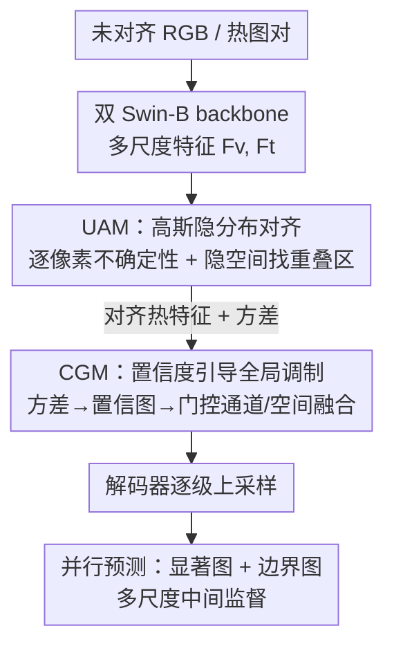

# Uncertainty-Aware Modality Fusion for Unaligned RGB-T Salient Object Detection

**会议**: CVPR 2026  
**论文**: [CVF Open Access](https://openaccess.thecvf.com/content/CVPR2026/html/Wang_Uncertainty-Aware_Modality_Fusion_for_Unaligned_RGB-T_Salient_Object_Detection_CVPR_2026_paper.html)  
**领域**: 显著目标检测 / 多模态融合  
**关键词**: RGB-T 显著目标检测, 跨模态对齐, 不确定性建模, 概率特征空间, 置信度引导融合

## 一句话总结
针对 RGB 与热红外图像空间未对齐的显著目标检测，UMFNet 把"对齐"从显式几何配准改写成特征空间里的**不确定性表示学习**——用逐像素高斯分布隐式找跨模态一致区域、再用不确定性导出的置信图门控融合，在 5 个未对齐 + 3 个对齐基准上全面 SOTA，且比配准式方法更快更省。

## 研究背景与动机

**领域现状**：RGB-T 显著目标检测（SOD）想借热红外在低光、雨雾下的稳定结构线索，补足 RGB 在恶劣光照下的失效。主流做法是双流编码器分别提 RGB / 热特征，再用注意力或中间层交互把两者融合，近年也从 CNN 走向 Transformer（如 SwinNet、HRTransNet）来建模全局依赖。

**现有痛点**：几乎所有这些方法都建立在一个理想假设上——RGB 和热图**像素级严格对齐**。但真实系统（尤其无人机这类平台）里，两个传感器的成像机理和物理位置不同，配准误差、视差、遮挡让两模态普遍存在不同程度的空间错位。一旦错位，逐像素融合就会把语义不一致的内容硬拼到一起，导致特征畸变、错误信息注入，最终掉点。

**核心矛盾**：为了对付错位，一类方法走"显式几何配准"路线（仿射变换预测、可变形卷积做目标级对齐）。但配准模块计算重、且对视差/遮挡/模态退化极其敏感，鲁棒性差。另一类用语义引导、跨模态注意力、局部窗口匹配等"软对齐"绕开配准，可在 SOD 这种**逐像素**任务里、尤其语义本就模糊时，仍解决不了像素级一致性。更糟的是，即便对齐拿到了热特征，它在空间上的**可靠性也是不均匀的**——有的区域热信息有用、有的区域是模态冲突或退化产生的噪声；若融合时一视同仁地注入，反而会污染原本干净的 RGB 特征。

**本文目标**：拆成两个子问题——(1) 不靠显式配准，怎么在错位条件下学到对齐的、鲁棒的热表示；(2) 融合阶段怎么动态评估对齐后热特征的局部可靠性、抑制不可靠噪声。

**切入角度**：作者的关键观察是——错位是"像素坐标"层面的，但如果把每个像素的特征建成一个**局部连续的概率分布**而非一个确定点，那么即使两模态像素坐标错开，它们对应的高斯分布在特征空间里仍可能**重叠**。重叠区就是语义/结构一致的地方，于是"对齐"变成"在隐空间找分布重叠区"，天然不需要几何配准。

**核心 idea**：把未对齐 RGB-T 融合**重写成不确定性感知的表示学习**——用逐像素高斯隐变量做隐式对齐（UAM），再用分布方差导出的置信图门控融合（CGM）。

## 方法详解

### 整体框架
UMFNet 是一个编码器-解码器网络。输入是一对**未对齐**的可见光和热红外图像，两路并行的 Swin-B backbone 提多尺度特征。融合发生在编码侧：先由 **UAM（不确定性对齐模块）** 把可见光、热特征各自重建为带逐像素不确定性的高斯隐分布，在隐空间里找跨模态一致区，输出"对齐后的热特征" $\tilde{F}_t$；再由 **CGM（置信度引导的全局调制模块）** 拿 UAM 估出的方差生成置信图，对可见光和对齐热特征做通道 + 空间双重调制后融合。融合后的多尺度特征在解码器逐级上采样，并行预测显著图和边界图，配多尺度中间监督。

### 关键设计

**1. UAM 不确定性对齐：把"几何配准"换成"隐空间分布重叠"**

针对痛点(1)——显式配准既贵又脆。UAM 不再去预测像素位移，而是给每个模态 $M\in\{F_v, F_t\}$ 的每个像素 $p$ 建一个高斯分布

$$z_M(p)\sim\mathcal{N}\!\left(\mu_M(p),\,\sigma_M^2(p)\right)$$

其中均值 $\mu_M(p)$ 继承原始特征的语义，方差 $\sigma_M^2(p)$ 表征该处估计的不确定性，两者都由一个轻量注意力自适应学出。这样每个模态内部就成了一个**局部连续的隐特征空间**：跨模态的像素哪怕坐标错开，它们的高斯分布在特征空间里仍可能重叠，重叠区就是语义结构一致的地方，对齐由此变成"找重叠"而非"算位移"。为了拿到可交互的隐表示，用重参数化采样 $\tilde{z}_M(p)=\mu_M(p)+\sigma_M(p)\odot\varepsilon(p),\ \varepsilon\sim\mathcal{N}(0,I)$，让复杂区域的估计更可靠。

为防止分布"过度自信"导致对齐漂移，UAM 加了 KL 正则把每个模态的隐分布拉向标准正态：

$$D_{\mathrm{KL}}=\tfrac{1}{2}\left(\sigma_M^2+\mu_M^2-1-\log\sigma_M^2\right)$$

逐像素求平均得到模态级正则损失，专门压制低置信区的不稳定激活。最后，UAM 还基于 $\tilde{z}_{F_v}$ 和 $\tilde{z}_{F_t}$ 用轻量注意力联合推出一个**条件融合分布** $\tilde{z}_{F_{vt}}$——它刻画的不是单模态内部结构，而是两模态之间的对齐关系；把热模态隐表示 $\tilde{z}_{F_t}$ 与这个一致性表示 $\tilde{z}_{F_{vt}}$ 喂给映射函数，就生成对齐热特征图 $\tilde{F}_t$。整套机制把对齐从"像素级空间配准"搬到了"隐空间概率对齐"，绕开了几何差异和模态异质带来的麻烦。

**2. CGM 置信度引导的全局调制：让融合"信可靠的、压不可靠的"**

针对痛点(2)——对齐后的热特征可靠性空间不均，传统注意力分不清哪块该信。CGM 复用 UAM 算出的方差 $\sigma_M^2(p)$ 当不确定性先验，先把方差转成各模态的**可靠性图** $\mathrm{InvU}_M(p)$：对 log 方差做 Softplus 平滑再指数变换、按通道平均，

$$\mathrm{InvU}_M(p)^{-1}=\frac{1}{C}\sum_{c=1}^{C}\exp\!\big(\mathrm{s}(\log\sigma_{M,c}^2(p))\big)+\epsilon$$

$\mathrm{InvU}_M(p)$ 越大表示该处估计越可信。把可见光、热两路可靠性图拼起来过一个轻量逐像素卷积 $h(\cdot)$、再除以可学缩放因子 $T$ 并经 Sigmoid 归一到 $[0,1]$，得到置信图 $\mathrm{Conf}(p)=\sigma\!\left(\tfrac{1}{T}h([\mathrm{InvU}_{F_v}(p),\mathrm{InvU}_{F_t}(p)])\right)$。

这张置信图随后当门控信号，对融合做**通道 + 空间**两级调制。通道级：从对齐热特征 $\tilde{F}_t$ 经全局平均池化和非线性变换生成通道缩放/偏置 $\gamma_t,\beta_t$，与广播后的置信图组合 $F_m=(\gamma_t\cdot F_v+\beta_t)\cdot\mathrm{Conf}$；空间级：再从 $\tilde{F}_t$ 预测一张空间先验图 $P_t$（标出适合增强的区域），与置信图逐元素相乘得融合掩码 $\tilde{P}_t=P_t\cdot\mathrm{Conf}$。最终输出写成残差形式

$$F_{\mathrm{fused}}=F_v+\tilde{P}_t\cdot(F_m-F_v)$$

这个写法的妙处在于数值稳定且自适应：当置信度低时 $\tilde{P}_t\to 0$，等于直接退回干净的 RGB 特征 $F_v$、把不可靠热信息挡在外面；置信度高时才让热线索充分注入。比起一刀切的注意力融合，CGM 真正做到了"按可靠性分配融合强度"。

### 损失函数 / 训练策略
统一的多任务损失联合优化结构建模、跨模态对齐与语义融合三件事：

$$\mathcal{L}_{\mathrm{total}}=\lambda_1\mathcal{L}_{\mathrm{sal}}+\lambda_2\mathcal{L}_{\mathrm{bd}}+\lambda_3\left(\overline{D}_{\mathrm{KL}}^{F_v}+\overline{D}_{\mathrm{KL}}^{F_t}\right)$$

- **显著分支** $\mathcal{L}_{\mathrm{sal}}$：对解码器四个多尺度预测 + 最终融合输出都用二元交叉熵监督。
- **边界分支** $\mathcal{L}_{\mathrm{bd}}$：BCE + Dice + 一个"容忍 Dice"组合损；容忍 Dice 对 GT 边界图做 max pooling，放宽严格逐像素对齐约束，缓解真实场景的边缘模糊。
- **正则分支**：把 UAM 的两个模态 KL 正则并入总目标，稳定隐分布、抑制低置信区过激活。

实现：PyTorch，4×GTX3090；backbone 用 Swin-B 预训练初始化、其余随机初始化；输入 resize 到 $384\times384$；Adam，batch 64，初始学习率 $5\times10^{-5}$、每 100 epoch 衰减 10 倍，共训 200 epoch。

## 实验关键数据

### 主实验
在 5 个未对齐/弱对齐 + 3 个对齐基准上，与 12 个 SOTA（含专为未对齐设计的 DCNet/SACNet/PCNet）对比，指标为 S-measure（$S_\alpha$）、E-measure（$E_S$）、加权 F（$F_\beta^w$），越高越好。UMFNet 在全部 5 个未对齐/弱对齐数据集上三项指标几乎全部第一。

| 数据集（条件） | 指标 | UMFNet | 次优方法 | 提升 |
|--------|------|------|----------|------|
| UVT20K（最难·未对齐） | $S_\alpha$ / $E_S$ / $F_\beta^w$ | 0.890 / 0.918 / 0.836 | PCNet 0.871 / 0.911 / 0.808 | +1.9 / +0.7 / +2.8 pt |
| UVT2000（未对齐） | $S_\alpha$ / $E_S$ / $F_\beta^w$ | 0.837 / 0.855 / 0.708 | PCNet 0.819 / 0.862 / 0.679 | $F_\beta^w$ +2.9 pt |
| un-VT5000（弱对齐） | $F_\beta^w$ | 0.887 | SACNet 0.799 | +8.3 pt（原文口径）|
| un-VT1000（弱对齐） | $S_\alpha$ / $E_S$ / $F_\beta^w$ | 0.941 / 0.972 / 0.927 | PCNet 0.922 / 0.964 / 0.904 | +1.9 / +0.8 / +2.3 pt |
| VT821（对齐·标准） | $S_\alpha$ / $E_S$ / $F_\beta^w$ | 0.930 / 0.960 / 0.907 | PCNet 0.915 / 0.945 / 0.873 | +1.5 / +1.5 / +3.4 pt |

> ⚠️ 原文称 un-VT5000 上 $F_\beta^w$ 较 SACNet 提升 8.3%，但表中 UMFNet 该项为 0.887、SACNet 为 0.799（差 8.8 pt），口径以原文为准。在 3 个**标准对齐**基准（VT5000/VT1000/VT821）上 UMFNet 同样全面领先，说明它不是只擅长处理错位，对齐场景也照样涨点。

### 效率对比
UMFNet 在精度领先的同时计算量明显小于其它未对齐专用方法：

| 方法 | GFLOPs | 参数量(M) | FPS |
|------|--------|-----------|-----|
| baseline | 126.38 | 213.18 | 24.76 |
| **UMFNet** | **126.10** | 217.60 | 22.16 |
| SACNet | 143.33 | 300.12 | 22.85 |
| PCNet | 148.36 | 291.75 | 11.31 |

UAM/CGM 相比 baseline 几乎不增 FLOPs（126.10 vs 126.38），参数仅 +4M，FPS 略降到 22.16；而 PCNet 慢到 11.31 FPS、SACNet 参数/FLOPs 大得多。即"两个模块带来明显精度提升却几乎零额外开销"。

### 消融实验
> ⚠️ 缓存中消融 Table 3/4 的数值存在 OCR 错位（多行与主表数值重复、行间不自洽），下表仅保留**作者文字结论**，不照搬可疑数字。

| 配置 | 文字结论 |
|------|---------|
| baseline（去 UAM+CGM） | 性能最低，证明简单融合无法处理未对齐输入 |
| w/o UAM（留 CGM、禁概率对齐） | 掉点；说明高斯隐表示对跨模态一致性贡献关键 |
| w/o CGM（用对齐特征但去置信融合） | 噪声/不可靠热信号场景明显变差 |
| w/o $D_{\mathrm{KL}}$ | 明显掉点，KL 正则对稳定隐分布、防过自信激活必要 |
| w/o Conf | 鲁棒性下降，抑制不确定区噪声能力变弱 |
| w/o CAM（通道调制） | 跨通道语义判别力减弱 |
| w/o SAM（空间调制） | 定位空间精度下降 |
| w/o $\mathcal{L}_{\mathrm{bd}}$ | 物体轮廓变差，验证边界监督对分割质量的作用 |

### 关键发现
- **浅层融合最有效**：把 UAM/CGM 插在浅层比插深层好。浅层特征跨模态异质性更强，早对齐更能消差异；深层特征语义已趋一致、对齐需求小——这给"在哪融"提供了清晰指导。
- **UAM 与 CGM 是互补而非冗余**：UAM 负责语义对齐、CGM 负责融合鲁棒性，两者协同才在错位 + 模态变化下都稳。
- **定性场景**：在假目标（热图几乎无效）、复杂背景、多目标、小目标、低光五类困难场景下，UMFNet 都能正确抑制误导区/保边界/保细节，体现对错位和光照变化的强韧性。

## 亮点与洞察
- **范式转换很漂亮**：把"对齐"从坐标空间的几何配准搬到特征空间的"分布重叠"，一句"像素错位但高斯分布可重叠"就把显式配准这个又贵又脆的环节整个绕过去了——这是全文最"啊哈"的点。
- **不确定性一鱼两吃**：UAM 估出的方差既用于 KL 正则稳住对齐，又被 CGM 当置信先验门控融合，同一套不确定性贯穿"对齐"和"融合"两阶段，设计很经济。
- **残差门控的数值稳定性**：$F_{\mathrm{fused}}=F_v+\tilde{P}_t\cdot(F_m-F_v)$ 在低置信时自动退回纯 RGB，等于给融合加了"信不过就别动"的安全阀，这个 trick 可迁移到任何"主模态 + 辅助模态可靠性不均"的融合场景（如 RGB-D、RGB-事件相机）。
- **精度-效率双赢**：几乎零额外 FLOPs 还反超重型配准方法，说明概率对齐确实比几何配准更省。

## 局限与展望
- **对齐建立在高斯/局部连续假设上**：当两模态错位极大、或语义内容根本不同（如热图完全失效的假目标场景）时，隐空间未必真有可靠重叠区，分布重叠的前提会变弱，作者未量化错位幅度与性能的关系。
- **缓存里消融数值不可信**：无法从笔记核验各模块的精确掉点幅度，只能依赖作者定性结论，UAM/CGM 谁贡献更大缺乏可比数字。
- **参数量偏大**：217.6M 参数（Swin-B backbone 占大头），对边缘/无人机这类真实部署场景仍偏重，可探索更轻 backbone + 概率对齐的组合。
- **可推广性待验**：方法理念通用，但只在 RGB-T SOD 上验证，未试 RGB-T 目标检测/语义分割等其它未对齐任务。

## 相关工作与启发
- **vs 显式几何配准（DCNet / SACNet / PCNet 等）**：它们靠仿射预测、可变形卷积、语义引导做坐标级对齐，计算重且对视差/遮挡敏感；UMFNet 完全不做几何配准，用隐空间分布重叠隐式对齐，更快更稳，且在对齐数据上也不掉队。
- **vs 注意力软对齐 / 跨模态注意力融合**：传统注意力融合默认对齐热特征处处可靠、一视同仁注入；CGM 用不确定性导出的置信图分区门控，专门识别并抑制不可靠区，解决了"软对齐绕开配准但仍治不了像素级可靠性不均"的遗留问题。
- **vs 概率/不确定性表示学习**：本文把 VAE 式的高斯隐变量 + 重参数化 + KL 正则这套工具用到**跨模态对齐**上，是不确定性建模在多模态融合的一个具体落地，启发是"不确定性不只是衡量置信度，还能直接当对齐和门控的信号"。

## 评分
- 新颖性: ⭐⭐⭐⭐⭐ "分布重叠隐式对齐"把未对齐融合从几何配准范式整体改写，视角新且自洽。
- 实验充分度: ⭐⭐⭐⭐☆ 8 个基准 + 12 个 SOTA + 效率对比很扎实，但缓存消融数值 OCR 失真、无法核验模块贡献量级。
- 写作质量: ⭐⭐⭐⭐☆ 动机推导清晰、公式完整，图 2 框架信息密但可读，整体表达到位。
- 价值: ⭐⭐⭐⭐⭐ 几乎零开销反超重型配准方法，残差置信门控可迁移到多种"主+辅模态可靠性不均"融合，实用性强。

<!-- RELATED:START -->

## 相关论文

- [\[CVPR 2026\] M4-SAM: Multi-Modal Mixture-of-Experts with Memory-Augmented SAM for RGB-D Video Salient Object Detection](m4-sam_multi-modal_mixture-of-experts_with_memory-augmented_sam_for_rgb-d_video_.md)
- [\[CVPR 2026\] Generalizable Co-Salient Object Detection via Mixed Content-Style Modulation](generalizable_co-salient_object_detection_via_mixed_content-style_modulation.md)
- [\[CVPR 2026\] RDNet: Region Proportion-Aware Dynamic Adaptive Salient Object Detection Network in Optical Remote Sensing Images](rdnet_region_proportion-aware_dynamic_adaptive_salient_object_detection_network_.md)
- [\[CVPR 2026\] TF-SSD: A Strong Pipeline via Synergic Mask Filter for Training-free Co-salient Object Detection](tf-ssd_a_strong_pipeline_via_synergic_mask_filter_for_training-free_co-salient_o.md)
- [\[CVPR 2025\] G2HFNet: GeoGran-Aware Hierarchical Feature Fusion Network for Salient Object Detection in Optical Remote Sensing Images](../../CVPR2025/segmentation/binwang2hfnet_geogran-aware_hierarchical_feature_fusion_network_for_salient_obje.md)

<!-- RELATED:END -->
