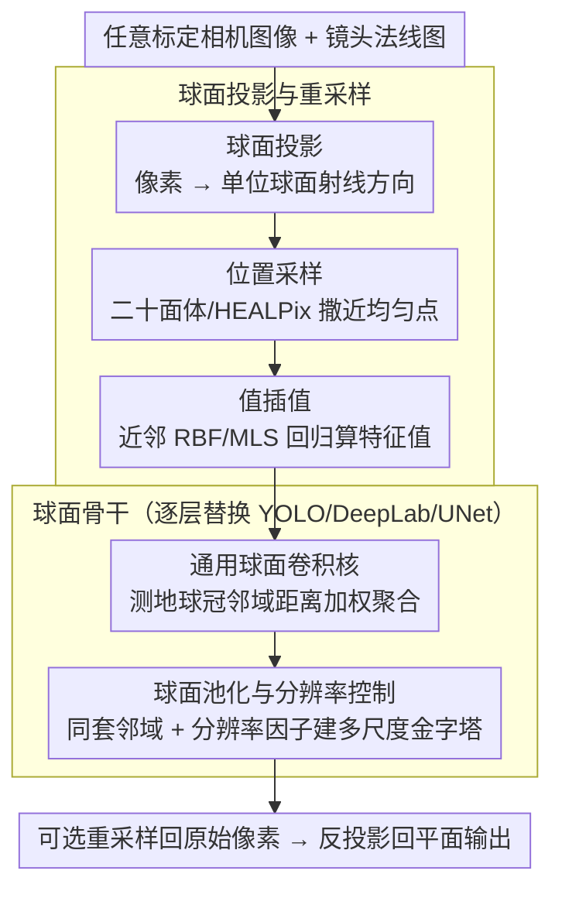

# Unified Spherical Frontend: Learning Rotation-Equivariant Representations of Spherical Images from Any Camera

**会议**: CVPR 2026  
**arXiv**: [2511.18174](https://arxiv.org/abs/2511.18174)  
**代码**: [https://tomnotch.com/USF](https://tomnotch.com/USF) (项目页面)  
**领域**: 图像分割  
**关键词**: 球面卷积, 旋转等变性, 广角相机, 全景图像, 镜头无关

## 一句话总结
USF 提出了一个模块化、镜头无关的球面视觉前端，通过将任意标定相机图像投影到单位球面上执行空间域球面重采样、卷积和池化操作，仅用距离加权核就能天然保证旋转等变性，在分类、检测和分割任务上展现了对随机旋转和跨镜头的零样本泛化鲁棒性。

## 研究背景与动机

1. **领域现状**：现代感知系统越来越多地使用鱼眼、全景等广角相机，但主流 CNN pipeline 仍假设小孔相机模型，在 2D 图像网格上做卷积操作。

2. **现有痛点**：(a) 将广角图像直接输入平面 CNN 时，图像空间中的相邻像素不反映物理邻接关系（如等距矩形投影中极点附近的像素在图像上离得远但实际相邻），导致卷积核的空间假设失效。(b) 平面卷积核固定于图像坐标系，对全局旋转敏感。(c) 传统球面 CNN（如 S2CNN）需要昂贵的球谐变换，限制了分辨率和效率。

3. **核心矛盾**：根据高斯绝妙定理（Theorema Egregium），没有 2D 投影能保持球面的内蕴曲率——任何平面表示必然引入畸变。因此需要直接在球面上操作，但现有球面 CNN 要么依赖特定的网格/连接结构（如多面体细分、HEALPix），要么需要高计算量的球谐域变换。

4. **本文目标** (a) 如何从任意标定相机无畸变地获取球面信号？(b) 如何高效地在球面上做卷积而不经过球谐变换？(c) 如何确保旋转等变性？(d) 如何让方案与现有架构（YOLO、DeepLab、UNet）即插即用？

5. **切入角度**：将球面上的像素视为无序点集而非结构化网格，通过分离位置采样和值插值来处理非均匀密度，用仅依赖测地距离的权重函数保证旋转等变性。

6. **核心 idea**：把任意相机图像投影到球面→均匀重采样→用纯距离加权核在空间域做球面卷积，天然等变、镜头无关、即插即用。

## 方法详解

### 整体框架
USF pipeline 包含六个阶段：(i) 将平面图像与镜头法线图（lens normal map）结合形成球面图像；(ii) 不同镜头在球面上产生不同密度分布的像素；(iii) 球面重采样统一分布；(iv) 送入由球面卷积和池化层组成的骨干网络；(v) 可选地重采样回原始球面像素位置；(vi) 反投影回平面图像。每个阶段完全解耦且可独立配置。

### 关键设计

**1. 球面投影与重采样：把任意相机图像变成球面上一摊近均匀的无序点**

广角图像直接喂给平面 CNN 的根本麻烦在于，图像网格上相邻的两个像素未必在物理世界里相邻（等距矩形投影里极点附近尤其明显），卷积核的"邻域"假设从一开始就错了。USF 的第一步是把每个图像坐标 $\mathbf{u} \in \mathbb{R}^2$ 经镜头法线图映射成单位球面上的射线方向 $\mathbf{p}_\mathbf{u} \in \mathbb{S}^2$，让像素回到它真正所在的球面位置。但投影后的密度并不均匀——鱼眼在极点挤成一团、边缘稀疏——所以紧接着要在球面上重新铺一层近均匀的采样点。关键的取舍是把"位置"和"取值"两件事拆开：位置采样负责在球面上撒一批均匀点，可选二十面体 Goldberg 多面体、HEALPix、Fibonacci 格点或拟随机采样，并用 Voronoi 单元面积的下 75% 分位均值来匹配输入像素密度、用测地距离阈值判断点是否落在 FoV 内；值插值则在每个新点的 $N$ 近邻或球冠邻域上做聚合，配合 RBF 径向基权重或球谐 MLS 回归算出特征值。之所以坚持"无序点集"而不是沿用多面体细分、HEALPix 那种固定网格结构，是因为点集天然不挑连接拓扑，能直接处理只覆盖半个球面的部分 FoV——这正是真实广角相机的常态。整条重采样管线对给定相机是确定的几何关系，可以一次算好、反复缓存复用。

**2. 通用球面卷积核：只靠测地距离，就让卷积天然旋转等变**

有了球面上的点集，下一个问题是怎么在上面做卷积、又不掉进传统球面 CNN（S2CNN 那类）的球谐变换坑里——后者随频带 $\ell$ 增大复杂度涨到 $O(\ell^3)$，分辨率一高就跑不动。USF 干脆把球面卷积定义成局部球冠邻域上的加权聚合：

$$x_o = \frac{1}{|\mathcal{N}(\mathbf{p}_o)|}\sum_{k \in \mathcal{N}(\mathbf{p}_o)} x_k \prod_m f_{weight}^{(m)}(\mathcal{M}_m(\mathbf{p}_k, \mathbf{p}_o))$$

邻域 $\mathcal{N}(\mathbf{p}_o)$ 就是所有满足测地距离 $d(\mathbf{p}_k, \mathbf{p}_o) \leq r$ 的输入点，权重被拆成距离分量和方向分量的乘积，各自用独立的权重函数实现（PWC 分段常数、MLP 或网格插值）。整篇论文最漂亮的洞察就藏在这个分解里：如果只保留距离分量、把方向分量拿掉，核就退化成 zonal/radial 滤波器，而测地距离在 $SO(3)$ 旋转下不变，于是卷积**天然**就是旋转等变的——不需要球谐域、也不需要复杂的群等变结构，等变性是几何送的。反过来，一旦加回方向分量就引入了 gauge 依赖，等变性被打破，但换来了区分 "6" 和 "9" 这种朝向敏感模式的表达力。所以距离-方向这条解耦轴其实是一个旋钮：让用户按任务需要在"旋转鲁棒"和"表达力"之间自己拧。聚合用均值而非求和，则是为了消化采样密度不均的影响。

**3. 球面池化与分辨率控制：和卷积共用同一套邻域，把多尺度也搬上球面**

要替换 YOLO、UNet 这类多尺度骨干，光有卷积还不够，下采样和上采样也得在球面上自洽地发生。USF 的池化沿用了和卷积完全相同的测地球冠邻域定义 $x_o = f_{pool}(x_k: k \in \mathcal{N}(\mathbf{p}_o))$，$f_{pool}$ 可以是 min/max/avg 或更复杂的局部统计量；输出点的位置则交给配置好的位置采样器、用一个分辨率因子来控制，从而在球面上拉出一个多尺度金字塔。复用同一套邻域语义的好处是几何操作前后一致，平面层换成球面层时不会出现"卷积按球面、池化却按网格"的割裂。同样因为每层坐标固定，所有邻域结构和几何测量都能在首次前向后缓存，后续推理几乎零额外开销——这对实时部署是实打实的便利。

举个具体的画面把三步串起来：一张鱼眼图先按镜头法线图投到球面上，极点附近原本挤成一团的像素被摊到各自真实的方向；重采样器在球面铺一层二十面体均匀点、用 RBF 把鱼眼的密集值插值过去，得到一张"镜头无关"的球面图；骨干里每一层都在测地球冠邻域上做距离加权卷积和池化，逐级降分辨率提特征；最后可选地重采样回原始球面像素位置、再反投影回平面输出。整条链路里没有任何一步假设小孔相机，换个镜头只需换最前面的法线图，后面骨干一字不改。

### 损失函数 / 训练策略
不涉及自定义损失——每个下游任务使用标准损失函数。关键策略是用球面层直接替换平面层，保持其他训练设置完全一致以公平对比。旋转测试时通过旋转球面向量后重采样到规范位置实现。

## 实验关键数据

### 主实验

| 任务 | 模型 | 训练 | NR (无旋转) | RR (随机旋转) |
|------|------|------|-------------|--------------|
| MNIST 分类 | Planar CNN | NR | 98.45% | 41.08% |
| | S2CNN (球谐) | NR | 96% | 94% |
| | SO(3) CNN (球谐) | NR | 98.7% | 98.1% |
| | **Spherical Dis PWC×3** | **NR** | 87.18% | **85.43%** |
| | Spherical Dis×Dir MLP | NR | 98.28% | 43.54% |
| 目标检测 (PANDORA) | Planar YOLOv11 | NR | mAP10=39.65% | mAP10=12.71% |
| | Planar YOLOv11 | RR | mAP10=27.76% | mAP10=28.01% |
| | **Spherical YOLOv11** | **NR** | mAP10=29.54% | **mAP10=29.59%** |
| 语义分割 (Stanford 2D-3D-S) | Planar DeepLab v3 | NR | mIoU=35.01% | mIoU=12.11% |
| | Planar DeepLab v3 | RR | mIoU=32.29% | mIoU=38.30% |
| | **Spherical DeepLab v3** | **NR** | mIoU=28.78% | **mIoU=28.09%** |

### 消融实验（语义分割 DeepLab v3）

| 位置采样器 | 距离段数 | NR mIoU | RR mIoU | 说明 |
|-----------|---------|---------|---------|------|
| **Icosahedron** | **3** | 28.78% | **28.09%** | 最佳等变性保持 |
| Icosahedron | 4 | 27.99% | 23.50% | 更多段→过拟合 |
| Icosahedron | 5 | 29.66% | 22.82% | NR 上升但 RR 大幅下降 |
| Fibonacci | 3 | 31.69% | 12.60% | 非均匀采样破坏等变性 |
| HEALPix | 3 | 29.59% | 13.87% | 同上 |
| Quasi-random | 3 | 29.85% | 8.70% | 最差等变性 |
| Equirectangular | 3 | 30.25% | 12.87% | 极点畸变严重 |

### 跨镜头零样本泛化（DeepLab v3 单 batch 过拟合）

| 训练镜头 | Planar Pinhole mIoU | Spherical Pinhole mIoU | Planar Panoramic mIoU | Spherical Panoramic mIoU |
|---------|---------------------|----------------------|----------------------|------------------------|
| Pinhole | 53.75% | 48.71% | 19.57% | **35.62%** |
| Fisheye | 67.95% | 40.27% | 57.46% | **48.04%** |
| Panoramic | 51.56% | 36.54% | 71.20% | **65.71%** |

### 关键发现
- **距离-only 核保证旋转鲁棒性**：球面模型在未经旋转增强训练时，随机旋转测试下性能下降 <1%（如 MNIST 87.18%→85.43%），而平面模型暴跌（98.45%→41.08%）
- **等变性与表达力的权衡**：加入方向权重后 NR 性能接近平面 CNN 但 RR 退化至类似水平（98.28%→43.54%），说明方向分量引入了 gauge 依赖性
- **位置采样器的均匀性决定等变性质量**：Icosahedron 在 RR 测试中最稳，Fibonacci/HEALPix 等虽然 NR 上略高但 RR 暴跌
- **距离段数不是越多越好**：3 段最优，更多段导致每段样本过少引发过拟合
- **球面模型跨镜头泛化显著优于平面模型**：从 Pinhole 训练到 Panoramic 测试时，球面模型 mIoU 35.62% vs 平面 19.57%

## 亮点与洞察
- **"只用距离就能保证旋转等变性"这个洞察是最核心的贡献**：因为测地距离是 $SO(3)$ 不变量，所以基于测地距离的权重函数天然等变。这比球谐域方法（计算昂贵）或群等变网络（结构复杂）简洁得多
- **完全解耦的模块化设计**：投影、位置采样、值插值、分辨率控制互不依赖，支持即插即用替换任何平面 CNN 的卷积/池化层。这种设计哲学适用于其他信号域的推广（如双曲空间、流形上的学习）
- **几何缓存策略**：重采样和卷积的几何关系（邻域结构、权重系数）对给定相机只需计算一次，后续推理零开销复用。对实时部署非常有利
- **无需前训练直接替换的实验设计很有说服力**：在 YOLOv11、DeepLab v3、UNet 三种不同架构上统一证明了方案的即插即用性

## 局限与展望
- 纯距离核在旋转鲁棒性和原始精度之间存在固有权衡——NR 场景下球面模型精度低于平面模型
- 角度/朝向相关的预测目标（如旋转边界框方向）无法仅靠等变架构解决，需要 gauge-equivariant 方法或数据增强
- 目前仅在 CNN 上验证，未扩展到 Vision Transformer——ViT 中的 patch embedding 和位置编码如何适应球面是开放问题
- 高分辨率输入的邻域搜索（球面上 KNN 或球冠查询）可能成为瓶颈
- 评估主要在合成/室内数据集上，户外自动驾驶等更复杂场景的验证不充分

## 相关工作与启发
- **vs S2CNN/SO(3) CNN**: 这些球谐域方法在低分辨率（MNIST）上精度更高（98.1%），但计算成本随分辨率急剧增长。USF 在空间域操作，可高效扩展到高分辨率全景图
- **vs SphereNet**: SphereNet 在切平面上采样特征，仍依赖预定义的采样方案。USF 将球面数据视为无序点集，更灵活
- **vs DISCO**: DISCO 使用径向-方向可学习核但针对全球面密集信号和固定离散化，不支持部分 FoV 覆盖。USF 支持任意 FoV

## 评分
- 新颖性: ⭐⭐⭐⭐ 核心洞察（距离-only 等变性+空间域卷积）简洁优雅，但部分组件（球面投影、重采样）已有先例
- 实验充分度: ⭐⭐⭐⭐ 三个任务、三种骨干、详细消融，但检测/分割的绝对性能指标偏低
- 写作质量: ⭐⭐⭐⭐ 数学推导完整，模块化展示清晰，但论文偏长
- 价值: ⭐⭐⭐⭐ 对机器人感知、AR/VR 广角视觉有实际意义，即插即用设计降低了使用门槛

<!-- RELATED:START -->

## 相关论文

- [\[CVPR 2026\] REL-SF4PASS: Panoramic Semantic Segmentation with REL Depth Representation and Spherical Fusion](rel-sf4pass_panoramic_semantic_segmentation_with_rel_depth_representation_and_sp.md)
- [\[CVPR 2026\] FoV-Net: Rotation-Invariant CAD B-rep Learning via Field-of-View Ray Casting](fov-net_rotation-invariant_cad_b-rep_learning_via_field-of-view_ray_casting.md)
- [\[CVPR 2026\] SAMTok: Representing Any Mask with Two Words](samtok_representing_any_mask_with_two_words.md)
- [\[CVPR 2026\] Fast Reasoning Segmentation for Images and Videos](fast_reasoning_segmentation_for_images_and_videos.md)
- [\[CVPR 2026\] SPAR: Single-Pass Any-Resolution ViT for Open-Vocabulary Segmentation](spar_single-pass_any-resolution_vit_for_open-vocabulary_segmentation.md)

<!-- RELATED:END -->
