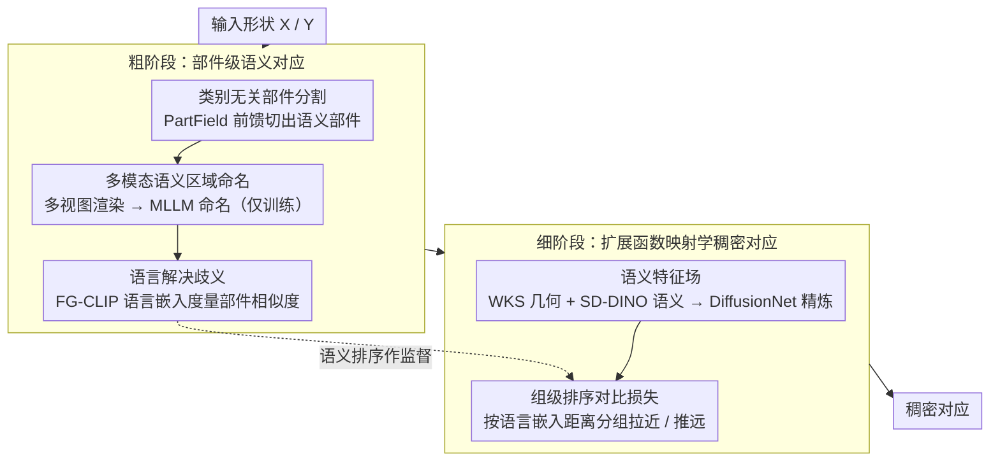

# Universal 3D Shape Matching via Coarse-to-Fine Language Guidance

**会议**: CVPR 2026  
**arXiv**: [2602.19112](https://arxiv.org/abs/2602.19112)  
**代码**: 无  
**领域**: 分割  
**关键词**: 3D Shape Matching, Functional Maps, Language Guidance, Contrastive Learning, Cross-Category Correspondence  

## 一句话总结

提出 UniMatch，一个语义感知的粗到细 3D 形状匹配框架：粗阶段通过类别无关 3D 分割 + MLLM 命名 + FG-CLIP 语言嵌入建立部件级对应；细阶段通过组级排序对比损失(Group-wise RnC Loss)在扩展的函数映射框架中学习稠密对应，实现跨类别、非等距形状的通用匹配。

## 研究背景与动机

3D 形状匹配是计算机视觉和图形学中的核心任务，广泛应用于纹理迁移、参数人体建模、机器人操作和形状插值。当前方法面临三个关键挑战：

**函数映射方法的等距假设**：经典的 functional map 及其深度学习变体依赖近等距假设，面对强非等距变形或拓扑噪声时性能退化，且纯几何线索难以支持跨类别匹配

**语义方法的局限性**：Diff3F 依赖扩散模型但不够通用；DenseMatcher 需要手动标注部件；ZSC 需要预定义部件提案，限制了对开放世界物体的泛化

**缺乏通用解决方案**：现有方法要么只能处理同类形状，要么需要类别特定的先验知识，无法在完全无监督设置下处理野外物体

UniMatch 的核心洞察：将"粗糙"的语义线索提升为"精细"的对应关系——先用语言建立部件级语义关联，再用排序对比学习驱动稠密匹配。

## 方法详解

### 整体框架

UniMatch 想解决的是「两个形状即便不同类、不等距也能逐点对上」的通用匹配难题。它的破题思路是先粗后细：粗阶段不直接谈顶点对应，而是把形状切成若干语义部件，借自然语言把"人的嘴"和"狗的口鼻"这种跨类别部件牵到一起，得到一张结构化的部件级关联图；细阶段再带着这层语义先验，在扩展的函数映射框架里学每个顶点的稠密对应。

整条管线大致是：输入形状先经 PartField 做类别无关部件分割，渲染成多视图后让 MLLM 给每个部件命名，名字过一遍 FG-CLIP 变成语言嵌入——这层嵌入既是粗对应又是后面排序对比的监督信号；进入细阶段，几何描述子和 SD-DINO 语义特征拼起来送进 DiffusionNet 精炼，再用组级排序对比损失把语言嵌入里的序数关系压进逐点特征，最后落到稠密对应。

### 关键设计

**1. 类别无关部件分割：先把形状切成语义部件，再谈对应**

跨类别匹配的第一道坎是「连切哪些部件都没法预设」——人和章鱼根本没有共同的部件清单。UniMatch 用 PartField 对输入形状 $\mathcal{X}$ 直接前馈出一组互不重叠的语义区域 $\mathcal{R}_x$，只需给定部件数 $n_\mathcal{R}$，不需要预定义部件提案或类别提示。之所以不用文本引导分割，作者给了四条很具体的理由：文本引用方法对无纹理、低分辨率的 mesh 几乎失效；它要预先给出语义部件名，反而把开放词汇物体框死；它常常覆盖不全整个形状，导致后续匹配出现空洞；而 PartField 是前馈推理，速度上也更划算。这一步保证了无论遇到什么野外物体，都能拿到一套覆盖完整、类别无关的部件切分作为后续语义对齐的载体。

**2. 多模态语义区域命名：让 MLLM 给每个部件起名，且只在训练时用**

分出来的部件还只是几何块，要跨类别关联得先知道它们「是什么」。UniMatch 把每个 3D mask 渲染成多视图图像，再把对应的 2D mask 叠回原图，提示 GPT-5 说出这个高亮区域的部件名称；像素占比小于 5% 的 mask 太碎，直接丢弃；得到的 2D 命名借助已知相机参数聚合回 3D 域，落到每个语义区域上。关键的工程取舍是：MLLM 只在训练阶段参与数据处理，推理时完全不调用大模型——这正好避开了 ZSC 那种推理时还得跑大模型的部署负担。

**3. 语言解决歧义：用连续语言嵌入做隐式对应，而非硬编码**

有了部件名还不够，"mouth"和"muzzle"是两个词，硬按字符串匹配只会错过。UniMatch 把每个部件名映射到 FG-CLIP 的语言嵌入空间 $\mathcal{E} \in \mathbb{R}^{C_{\text{lang}}}$，用嵌入间的距离来度量部件语义相似度——人的"mouth"和狗的"muzzle"在这个空间里本就彼此靠近，于是隐式地连成一对。比起把对应关系写死成查找表，连续嵌入更能消化 MLLM 输出里的措辞歧义，而且嵌入距离天然给出了部件之间的语义排序关系，这一点恰好被下游的排序对比损失接住。

**4. 语义特征场：几何描述子拼上 SD-DINO 语义特征，给每个顶点更强的判别力**

纯几何描述子在跨类别、非等距的场景下分辨力不足，这也是经典函数映射退化的根源。细阶段为每个顶点构建融合几何与语义的特征：几何侧取 WKS 描述子 $\boldsymbol{f}_{\text{geo}}$，语义侧用 SD-DINO 配合 FeatUp 提取高分辨率特征 $\boldsymbol{f}_{\text{sem}}$，两者拼接后送入 DiffusionNet 精炼网络：

$$\boldsymbol{f}_{\text{in}} = \text{Concat}(\boldsymbol{f}_{\text{geo}}, \boldsymbol{f}_{\text{sem}})$$

对于本身没有颜色的形状，先用 SyncMVD 做视图一致的纹理合成，再去抽语义特征，避免无纹理 mesh 喂给 2D 基础模型时特征塌缩。消融里去掉语义特征后 SNIS 误差从 0.19 一路涨到 0.49，说明这层语义信息是稠密匹配能站住的关键。

**5. 组级排序对比损失（Group-wise RnC Loss）：把语言嵌入的序数关系压进逐点特征**

要把粗阶段的语义排序传到细阶段，普通对比损失并不好用——它需要显式的正/负样本，而这里只有"谁离锚点更近、谁更远"的连续排序。RnC 损失正是按这个序数信号工作：对源形状上的锚点特征 $\boldsymbol{f}_i^x$，把目标形状的顶点按语言嵌入距离动态分成若干参考组 $\mathcal{G}_j^y$，每个组相对锚点的「拉近概率」写作

$$\mathbb{P}(\mathcal{G}_j^y | \boldsymbol{f}_i^x, \mathcal{S}_{i,j}) = \frac{\sum_l \exp(\text{sim}(\boldsymbol{f}_i^x, \boldsymbol{f}_l^y)/\tau)}{\sum_{\boldsymbol{f}_k^y \in \mathcal{S}_{i,j}} \exp(\text{sim}(\boldsymbol{f}_i^x, \boldsymbol{f}_k^y)/\tau)}$$

总损失是所有源锚点上的平均负对数似然：

$$\mathcal{L}_{\text{RnC}} = \frac{1}{n_x} \sum_{i=1}^{n_x} \ell_{\text{RnC}}^{(i)}(\mathcal{X}, \mathcal{Y})$$

这样做有两个好处：一是把逐点对比的 $O(n_x \times n_y)$ 代价降到组级的 $O(n_x \times n_R)$，其中组数 $n_R \ll n_y$，算得起；二是组的划分本身由语言嵌入距离决定，于是组间依赖直接建模了语义层级，匹配出来的对应在语义上也是一致的。消融中它稳定优于 SupCon——因为 SupCon 只认离散的正样本，吃不下语言嵌入给的连续语义。

### 一个完整示例

以「一个人 $\mathcal{X}$ 对一只狗 $\mathcal{Y}$」走一遍：PartField 先把人切成头/躯干/四肢等部件，把狗切成头/躯干/四条腿等部件，此时两套部件只是几何块，没有任何跨类别联系。多视图渲染后 GPT-5 给人脸上那块命名为 "mouth"、给狗对应区域命名为 "muzzle"，过小的碎块（如指甲）被 5% 阈值滤掉。两个词进 FG-CLIP，"mouth" 与 "muzzle" 的嵌入距离很近、与 "leg" 很远——这就建立了粗阶段的隐式对应和部件间排序。进入细阶段，人嘴区域某个顶点作为锚点 $\boldsymbol{f}_i^x$，狗身上的顶点按语言嵌入距离分组：muzzle 组最近、head 其他部分次之、leg 组最远；RnC 损失据此把锚点特征往 muzzle 组拉、往 leg 组推。训练收敛后，人嘴上的顶点就稳定对到狗的口鼻，而不会跑到腿上——即便两者几何形状差异巨大。

### 损失函数 / 训练策略

总损失为函数映射目标加排序对比：

$$\mathcal{L} = \mathcal{L}_{\text{fm}} + \mathcal{L}_{\text{RnC}}$$

其中函数映射目标包含：
- 数据保持损失 $\mathcal{L}_{\text{data}}$：保留精炼后的特征
- 正则化损失 $\mathcal{L}_{\text{reg}}$：确保双射性和正交性
- 耦合损失 $\mathcal{L}_{\text{couple}}$：确保软对应与函数映射一致

基于 URSSM 的函数映射框架，精炼器使用 DiffusionNet。只在训练时使用 MLLM 提示，推理时无需。

## 实验关键数据

### 主实验

**跨类别形状匹配**（平均测地误差，越低越好）：

| 方法 | SNIS | TOSCA | SHREC07 |
|------|------|-------|---------|
| ZoomOut | 0.51 | 0.55 | 0.57 |
| URSSM | 0.49 | 0.53 | 0.49 |
| Diff3F | 0.57 | 0.45 | 0.50 |
| ZSC | 0.36 | 0.56 | 0.60 |
| DenseMatcher | 0.28 | 0.30 | 0.39 |
| **UniMatch** | **0.19** | **0.23** | **0.37** |

**非等距形状匹配**（平均测地误差 x100）：

| 方法 | SMAL | TOPKIDS |
|------|------|---------|
| URSSM | 6.0 | 8.9 |
| DenseMatcher | 4.7 | 6.2 |
| **UniMatch** | **4.8** | **5.9** |

**近等距形状匹配**（平均测地误差 x100）：

| 方法 | FAUST | SCAPE | SHREC19 |
|------|-------|-------|---------|
| URSSM | 1.6 | 1.9 | 5.7 |
| DenseMatcher | 1.6 | 2.0 | 3.1 |
| **UniMatch** | **1.6** | **1.9** | **3.2** |

### 消融实验

| 变体 | SNIS | TOSCA | SHREC07 |
|------|------|-------|---------|
| **语言嵌入模型** | | | |
| CLIP | 0.21 | 0.26 | 0.37 |
| SigLip | 0.19 | 0.24 | 0.37 |
| FG-CLIP (ours) | **0.19** | **0.23** | **0.37** |
| **语义特征场** | | | |
| 仅几何特征 | 0.49 | 0.53 | 0.49 |
| 几何+语义 (ours) | 0.22 | 0.26 | 0.39 |
| **对比损失** | | | |
| SupCon loss | 0.21 | 0.29 | 0.40 |
| 无对比损失 | 0.22 | 0.26 | 0.39 |
| Group-wise RnC (ours) | **0.19** | **0.23** | **0.37** |

### 关键发现

1. 跨类别匹配优势巨大：在 SNIS 上从 DenseMatcher 的 0.28 降到 0.19，相对提升 32%
2. 语义特征场至关重要：去除后误差从 0.19 升至 0.49（SNIS），几何描述子不足以支持语义匹配
3. Group-wise RnC 优于 SupCon：因为 SupCon 依赖离散正样本选择，无法捕获语言嵌入提供的连续语义关系
4. FG-CLIP 优于标准 CLIP，特别是在 TOSCA 上（0.23 vs 0.26），证实细粒度嵌入的重要性
5. UniMatch 在近等距/非等距/跨类别三种设定下均达到 SOTA 或持平，真正实现"通用"
6. 学到的特征还能涌现语义一致的共分割能力，虽然并非专门设计

## 亮点与洞察

- **语言作为通用语义桥梁**：用自然语言嵌入解决跨类别匹配中的语义对齐问题非常优雅——"mouth"和"muzzle"在连续嵌入空间中自然关联
- **粗到细的级联设计**避免了端到端训练中跨模态对齐的困难，粗阶段提供结构化监督信号，细阶段专注于精化
- **组级 RnC Loss** 是核心创新：将不可行的 $O(n^2)$ 逐点对比降低到 $O(n \times n_R)$，同时利用语义排序而非二值正/负标签
- MLLM 仅用于训练数据处理，推理时无需调用大模型，实际部署友好

## 局限与展望

- 椅子腿匹配顺序错误的问题（所有腿都叫"leg"），需要引入物体朝向信息
- 依赖 PartField 分割质量——分割错误会级联到后续匹配
- 无纹理形状需要 SyncMVD 纹理合成，引入额外计算和潜在伪影
- 当前仅评估形状匹配精度，未评估时间效率（PartField + GPT-5 + SD-DINO 的端到端开销）
- 对极端拓扑差异（如章鱼 vs 桌子）的匹配仍可能失败

## 评分

- **新颖性**: ⭐⭐⭐⭐⭐ — 首次将语言引导系统性地引入 3D 形状匹配，粗到细框架设计和组级 RnC Loss 均为原创贡献
- **实验**: ⭐⭐⭐⭐⭐ — 覆盖跨类别/非等距/近等距三大设定共六个基准，消融完整，并展示了共分割和野外物体的泛化
- **写作**: ⭐⭐⭐⭐ — 方法阐述清晰，图示丰富，但部分细节（如 MLLM 提示模板）放在附录
- **价值**: ⭐⭐⭐⭐⭐ — 开创了通用 3D 形状匹配的新范式，对图形学、机器人、3D 理解等领域有广泛影响

<!-- RELATED:START -->

## 相关论文

- [\[CVPR 2026\] GeoGuide: Hierarchical Geometric Guidance for Open-Vocabulary 3D Semantic Segmentation](geoguide_hierarchical_geometric_guidance_for_open-vocabulary_3d_semantic_segment.md)
- [\[ECCV 2024\] Active Coarse-to-Fine Segmentation of Moveable Parts from Real Images](../../ECCV2024/segmentation/active_coarsetofine_segmentation_of_moveable_parts_from_real.md)
- [\[CVPR 2025\] Robust 3D Shape Reconstruction in Zero-Shot from a Single Image in the Wild](../../CVPR2025/segmentation/robust_3d_shape_reconstruction_in_zero-shot_from_a_single_image_in_the_wild.md)
- [\[CVPR 2026\] Combining Boundary Supervision and Segment-Level Regularization for Fine-Grained Action Segmentation](boundary_segment_action_segmentation.md)
- [\[CVPR 2026\] AFRO: Bootstrap Dynamic-Aware 3D Visual Representation for Scalable Robot Learning](bootstrap_dynamic-aware_3d_visual_representation_for_scalable_robot_learning.md)

<!-- RELATED:END -->
