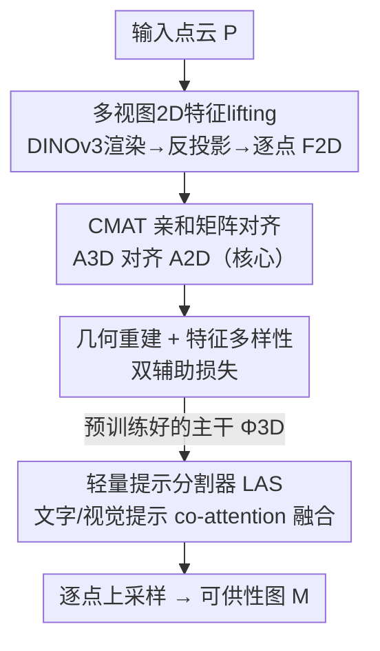

# Unlocking 3D Affordance Segmentation with 2D Semantic Knowledge

**会议**: CVPR 2026  
**论文**: [CVF Open Access](https://openaccess.thecvf.com/content/CVPR2026/html/Huang_Unlocking_3D_Affordance_Segmentation_with_2D_Semantic_Knowledge_CVPR_2026_paper.html)  
**代码**: 待确认  
**领域**: 3D视觉 / 可供性分割  
**关键词**: 3D可供性分割, 跨模态知识迁移, 2D视觉基础模型, 亲和矩阵对齐, DINOv3

## 一句话总结
针对稀疏点云几何线索不足、3D 编码器缺乏功能语义的问题，本文用 DINOv3 这类 2D 视觉基础模型的语义知识，通过"跨模态亲和迁移"(CMAT) 预训练让 3D 编码器对齐 2D 的 patch 间关系结构，再配一个轻量级提示分割器，在 PIAD/PIADv2/LASO 上以远小于 MLLM 方案的参数量取得 SOTA。

## 研究背景与动机
**领域现状**：3D 可供性分割（affordance segmentation）要把一个 3D 物体拆成承担不同**功能角色**的部件——比如把椅子分成座面、靠背、椅腿，让智能体不止"认出物体"，还能推理"怎么和它交互"。主流做法有两类：一类沿用 3D 语义分割范式，用点云编码器（PointNet++、PointMAE 等）纯靠几何预测部件标签；另一类是提示驱动（prompt-based），用文字指令或视觉示例（甚至接 MLLM）来引导预测哪块区域可交互。

**现有痛点**：很多可供性**并不由局部几何唯一决定**。马克杯可抓握的把手和杯沿几何上很像，能"支撑"或"接触"的表面往往是光滑对称的形状；当扫描稀疏、有遮挡或重建带噪时，纯几何模型会给出不稳定、粗糙的功能边界。而提示驱动方法虽然加了复杂的提示处理模块，提升却很有限。

**核心矛盾**：作者认为提示方法的瓶颈**不在提示本身，而在 3D 编码器**——它们仍把编码器当成纯几何特征提取器来训练。稀疏点云本就缺功能线索，如果特征空间里没有"语义感知的结构"，再花哨的提示也无法可靠地把语义压进去。所以问题应该从"如何学 3D 特征"重新想，而不是一味丰富提示模态。

**切入角度**：2D 视觉基础模型（VFM，如 DINOv3）在海量图像上无监督训练，天然学到了**结构清晰的语义组织**——如论文 Fig.1 所示，DINOv3 的特征会自然聚成"把手""座面"这类功能一致的簇，远比纯几何 3D 嵌入有条理。已有工作会把多视图 2D 特征"lift"到点云上当稠密监督，但它们大多只对齐**单点特征**或保证宽泛一致性，没有显式建模部件之间的**关系结构**，导致表示碎片化。

**核心 idea**：用 2D VFM 的**关系结构**（patch 之间的亲和矩阵）而非单点特征来监督 3D 编码器——提出 Cross-Modal Affinity Transfer (CMAT) 预训练，强迫 3D patch 的亲和矩阵对齐 2D patch 的亲和矩阵，把"部件—整体"的功能关系灌进 3D 表示，再用一个轻量提示分割器把这套干净的语义直接拿来用。

## 方法详解

### 整体框架
整个框架是一条三阶段串行管线，目标是从一团缺语义的稀疏点云 $P=\{p_i\in\mathbb{R}^3\}_{i=1}^N$ 出发，最终产出一张提示条件下的稠密可供性图 $M\in\mathbb{R}^N$。**Stage 0** 先把 2D 语义"搬"到 3D：多视图渲染 + 冻结 DINOv3 抽特征 + 反投影 lifting，得到每个点的 2D 语义描述子 $F^{2D}$ 作为监督信号。**Stage 1（CMAT，核心）**用 $F^{2D}$ 预训练 3D 主干 $\Phi^{3D}$，让 3D 特征的亲和矩阵去对齐 2D 亲和矩阵，从而把功能化的关系结构内化进主干。**Stage 2** 把预训练好的 $\Phi^{3D}$ 接进一个轻量提示分割器（LAS），用文字/视觉提示做跨注意力融合，上采样回逐点分辨率输出 $M$。

### 关键设计

**1. 多视图 2D 特征 lifting：把 DINOv3 的语义灌进每个 3D 点**

痛点是点云本身没有功能语义，需要一个高质量的语义"教师信号"。作者构建了一个含 1 万多个 3D 模型（来自 Objaverse、Behavior-1K，覆盖 101 类日常物体）的预训练集；每个模型在均匀分布的相机位姿下渲染 $V=12$ 张 224×224 的 RGB 图，送进**冻结**的 DINOv3（ViT-Large）抽稠密特征图，再按已有 lifting 技术做反投影 + 最近邻插值，把逐像素嵌入投回对应 3D 点，得到逐点语义描述子 $F^{2D}=\{f^{2D}_i\in\mathbb{R}^{d_{2D}}\}_{i=1}^N$。多视图设计保证可见面和被遮挡面都能拿到一致的 2D 语义。这一步本身用的是成熟技术，但它是后续 CMAT 的地基——没有这套稠密、语义有结构的 grounding 信号，亲和对齐就无从谈起。

**2. CMAT 亲和矩阵对齐：迁移"关系结构"而非单点特征**

这是全文的核心。已有 2D→3D 迁移大多只对齐单个点的特征，丢掉了部件之间的相对关系，表示容易碎。CMAT 改成对齐**亲和矩阵**：3D 主干用 PointMAE 风格的 transformer 把点云切成 $m$ 个 patch token，对每个 patch 把点级特征平均池化成 patch 级特征 $\bar f^{2D}_j$、$\bar f^{3D}_j$；然后分别构造 2D 教师亲和矩阵和 3D 学生亲和矩阵，矩阵元就是 patch 对之间的余弦相似度：

$$A^{2D}_{jk}=\frac{\bar f^{2D}_j\cdot\bar f^{2D}_k}{\|\bar f^{2D}_j\|\,\|\bar f^{2D}_k\|},\qquad A^{3D}_{jk}\text{ 同理由 }\bar f^{3D}\text{ 计算}$$

亲和矩阵编码的是"哪些 patch 在功能上相近"这种**部件—整体关系**。核心目标语义对齐损失 $\ell_{aff}$ 直接逐元素拉平两个矩阵：

$$\ell_{aff}=\frac{1}{m^2}\sum_{j=1}^{m}\sum_{k=1}^{m}\big(A^{3D}_{jk}-A^{2D}_{jk}\big)^2$$

这迫使 3D 特征空间复现 2D 空间里同样的"部件间语义关系"，而且**不需要任何显式语义标签或部件标注**。相比只对齐单点特征，对齐关系结构能让功能相近的区域在 3D 里保持一致、功能不同的部件被拉开，这正是可供性分割需要的细粒度部件区分能力。

**3. 几何重建 + 特征多样性双辅助损失：防塌缩、保几何**

只对齐语义关系还不够稳：一来可能丢掉点云本身的几何结构，二来特征容易塌缩到一起。作者加两个成熟的辅助目标。几何保真损失 $\ell_{rec}$ 沿用 PointMAE 的掩码自编码策略（掩码比例 60%），保住主干重建几何、理解点云的能力；特征多样性损失 $\ell_{div}$ 用 KoLeo 正则器，惩罚嵌入空间里过小的最近邻距离，从而最大化特征熵、避免塌缩、让嵌入更分散更具判别力。三者加权求和构成预训练目标：

$$\ell_{pretrain}=\lambda_{aff}\ell_{aff}+\lambda_{rec}\ell_{rec}+\lambda_{div}\ell_{div}$$

权重设为 $\lambda_{rec}=1.0,\ \lambda_{aff}=0.1,\ \lambda_{div}=0.2$。消融显示：只有 $\ell_{rec}$ 时 aIoU 仅 39.27%，加上核心的 $\ell_{aff}$ 直接跳到 44.13%，再加 $\ell_{div}$ 到 44.88%——说明亲和对齐是主力，两个辅助项各司其职地稳住几何与多样性。

**4. 轻量提示分割器 LAS：用 co-attention 把提示直接注入干净的 3D 语义空间**

痛点是以往提示驱动方法要堆一个大 MLLM 来"翻译"交互意图，又重又可能污染预训练学到的干净语义。Stage 2 反其道而行：先用预训练好的 $\Phi^{3D}$ 抽几何 patch token $F^{3D}$；文字提示（如"马克杯哪部分该抓握"）经冻结的 RoBERTa-base 编码为 $F_{text}$，视觉示例经冻结的 DINOv3(ViT-B) 编码为 $F_{img}$；三者各自投影到共享嵌入空间，并加上可学习的模态嵌入以保留来源身份：

$$T_P=\mathrm{Proj}_{3D}(F^{3D})+E_{point},\quad T_{text}=\mathrm{Proj}_{text}(F_{text})+E_{text},\quad T_{img}=\mathrm{Proj}_{img}(F_{img})+E_{img}$$

把可用的提示 token 聚成 $T_Q$、与几何 token 拼成 $[T_Q;T_P]$，过 $L=6$ 层 co-attentional transformer——自注意力让几何 token 被提示条件化、提示也被 3D 几何 grounding，双向交互。最后融合后的 patch 特征经特征传播上采样回原始点分辨率，一个轻量 MLP 头映射成逐点分割 logits $M$。这套设计避免了冗余推理模块，保住了预训练时建立的结构化语义，用约 300M 参数就吃下了 4B 级 MLLM 方法的活。

### 损失函数 / 训练策略
- 预训练（Stage 1）：150 epoch，batch 128，AdamW，学习率 1e-4 + 15 epoch warmup 后余弦衰减；点云切 64 个 patch，掩码比 60%。
- 微调（Stage 2）：差异化学习率——主干 $\Phi^{3D}$ 用 1e-5、新模块用 1e-4；分割损失 $\lambda_{focal}=\lambda_{dice}=1.0$；100 epoch，batch 16，点云统一采样到 2048 点。三阶段全程在 4×RTX 3090 上完成。

## 实验关键数据

### 主实验
在视觉提示基准 PIAD/PIADv2 上对比 SOTA（六指标，下表节选核心的 aIoU 与 SIM）：

| 数据集 / split | 指标 | 本文(w/ CMAT) | 之前最好 | 提升 |
|--------|------|------|----------|------|
| PIAD Seen | SIM ↑ | 0.725 | 0.590 (LASO) | +22.9%（相对） |
| PIADv2 Seen | aIoU ↑ | 44.88 | 38.03 (GREAT) | +6.85 |
| PIADv2 Unseen | aIoU ↑ | 27.40 | 20.16 (GREAT) | +7.24 |
| PIADv2 Seen | SIM ↑ | 0.783 | 0.676 (GREAT) | +0.107 |

在纯文字提示的 LASO 基准上同样夺得双 split 最高 aIoU：

| split | 本文 aIoU ↑ | LASO | IAGNet |
|------|------|------|--------|
| Seen | 21.7 | 20.8 | 17.8 |
| Unseen | 17.5 | 14.6 | 12.9 |

效率对比尤其亮眼——在比 MLLM 方案小近一个数量级的体量下反超精度：

| 模型 | 参数量 | 显存 | PIADv2 Seen aIoU |
|------|--------|------|------|
| IAGNet (ICCV23) | 30M | 0.8–2.0 GB | 34.29 |
| LASO (CVPR24) | 130M | 2.0–3.5 GB | 34.88 |
| GREAT† (CVPR25, MLLM) | 4B | 16–30 GB | 38.03 |
| **Ours** | **300M** | **4–8 GB** | **44.88** |

### 消融实验（PIADv2 Seen split）
| 配置 | aIoU (%) ↑ | 说明 |
|------|---------|------|
| 仅 $\ell_{rec}$ | 39.27 | 纯几何重建，功能推理不足 |
| $\ell_{rec}+\ell_{aff}$ | 44.13 | 加核心亲和对齐，暴涨 +4.86 |
| 完整 $\ell_{rec}+\ell_{aff}+\ell_{div}$ | 44.88 | 再加多样性，+0.75 |
| 完整目标但教师换 DINOv2 | 43.26 | 教师变弱掉 1.62，更强 2D 教师更有效 |
| 分割主干 PointNet++（从头训） | 37.91 | 无 CMAT 预训练 |
| 分割主干 PointMAE（从头训） | 38.16 | 无 CMAT 预训练 |

### 关键发现
- **亲和对齐是绝对主力**：从仅 $\ell_{rec}$ 的 39.27% 到加 $\ell_{aff}$ 的 44.13%，单这一项就贡献了几乎全部增益，证明迁移"关系结构"比堆数据或纯几何自监督有效得多。
- **CMAT 不只是更好的初始化**：同样用 PointMAE/PointNet++ 但从头训只有 37–38%，而 CMAT 预训练后 44.88%，差距来自"语义组织"本身而非权重起点。
- **教师质量直接传导**：DINOv3 比 DINOv2 高 1.62 aIoU，更丰富的 2D 语义能更有效地迁移进 3D。
- **小身量打赢大 MLLM**：300M 参数 / 4–8GB 显存即超过 4B 参数的 GREAT 6.85 aIoU，可供性理解不必靠超大语言模型。

## 亮点与洞察
- **把监督信号从"单点特征"升级成"亲和矩阵"**：这是最巧的一刀。可供性的本质是"部件相对整体的功能角色"，天然是关系问题；用亲和矩阵当迁移目标，正好把这种关系结构显式建进 3D，比对齐单点 embedding 更契合任务。
- **诊断对了瓶颈**：作者没去卷更花哨的提示/MLLM，而是指出瓶颈在"3D 编码器的语义容量"，把力气花在预训练表示上——这个判断被"从头训 vs CMAT 预训练差 6–7 点"直接验证。
- **预训练与下游解耦、提示零成本注入**：CMAT 不依赖任何可供性标注（自监督式对齐），学好的主干可被轻量 co-attention 直接复用；这套"先用 2D VFM 把 3D 表示养好、再轻量适配"的范式可迁移到 3D 分割、检测等其他需要细粒度语义的任务。

## 局限与展望
- **真多模态提示未被检验**：框架本可同时吃文字+视觉提示，但现有基准只支持单模态，作者只能给缺失模态喂 null 输入，方法的完整能力尚未在真·多模态查询上展示。
- **依赖渲染 + lifting 的预训练管线**：Stage 0 要对上万个 3D 模型做 12 视图渲染、DINOv3 抽特征、反投影插值，预训练成本和 lifting 质量（遮挡、插值误差）会影响上界，论文未深入分析其敏感性。
- **教师天花板**：性能与 2D VFM 强弱强绑定（DINOv2→DINOv3 +1.62），对 VFM 本身没覆盖好的稀有/抽象功能部件可能力不从心。
- **300M 仍不算"轻"**：相对 MLLM 是轻，但相对 IAGNet(30M)/LASO(130M) 仍偏大，移动端/实时场景的可部署性待考。

## 相关工作与启发
- **vs 纯几何 3D 分割（PointNet++、PointMAE 等）**：它们纯靠几何推功能标签，几何模糊时边界不稳；本文把 2D 语义结构注入主干，从根上补足功能语义，消融里同主干从头训差 6–7 aIoU。
- **vs 提示驱动 / MLLM 方法（LASO、GREAT 等）**：它们靠丰富提示甚至 4B MLLM 解释交互意图，但受限于纯几何编码器；本文主张瓶颈在编码器而非提示，用 300M 模型反超 4B 的 GREAT。
- **vs 2D→3D 特征 lifting 类工作**：以往多对齐单点特征或宽泛一致性，关系结构丢失导致表示碎片化；CMAT 显式对齐亲和矩阵，建模部件间关系，得到更细粒度可分的 3D 表示。

## 评分
- 新颖性: ⭐⭐⭐⭐ 把可供性迁移从"单点特征"改成"亲和矩阵关系结构"是清晰且对任务的创新，单组件思想成熟但组合得当。
- 实验充分度: ⭐⭐⭐⭐ 三大基准 + 六指标 + 损失/教师/主干多维消融 + 效率对比，扎实；多模态提示因基准缺失未验证。
- 写作质量: ⭐⭐⭐⭐ 动机—瓶颈诊断—方法逻辑链顺畅，三阶段图文清晰，公式规范。
- 价值: ⭐⭐⭐⭐ 小模型反超大 MLLM、范式可迁移到更广的 3D 理解任务，实用性强。

<!-- RELATED:START -->

## 相关论文

- [\[CVPR 2026\] From 2D Alignment to 3D Plausibility: Unifying Heterogeneous 2D Priors and Penetration-Free Diffusion for Occlusion-Robust Two-Hand Reconstruction](from_2d_alignment_to_3d_plausibility_unifying_heterogeneous_2d_priors_and_penetr.md)
- [\[CVPR 2026\] GKD: Generalizable Knowledge Distillation from Vision Foundation Models for Semantic Segmentation](gkd_generalizable_knowledge_distillation_vfm.md)
- [\[CVPR 2026\] SAQN: Semantic-based Adaptive Query Network for 3D Referring Expression Segmentation](saqn_semantic-based_adaptive_query_network_for_3d_referring_expression_segmentat.md)
- [\[CVPR 2026\] GeoGuide: Hierarchical Geometric Guidance for Open-Vocabulary 3D Semantic Segmentation](geoguide_hierarchical_geometric_guidance_for_open-vocabulary_3d_semantic_segment.md)
- [\[ECCV 2024\] PartSTAD: 2D-to-3D Part Segmentation Task Adaptation](../../ECCV2024/segmentation/partstad_2d-to-3d_part_segmentation_task_adaptation.md)

<!-- RELATED:END -->
