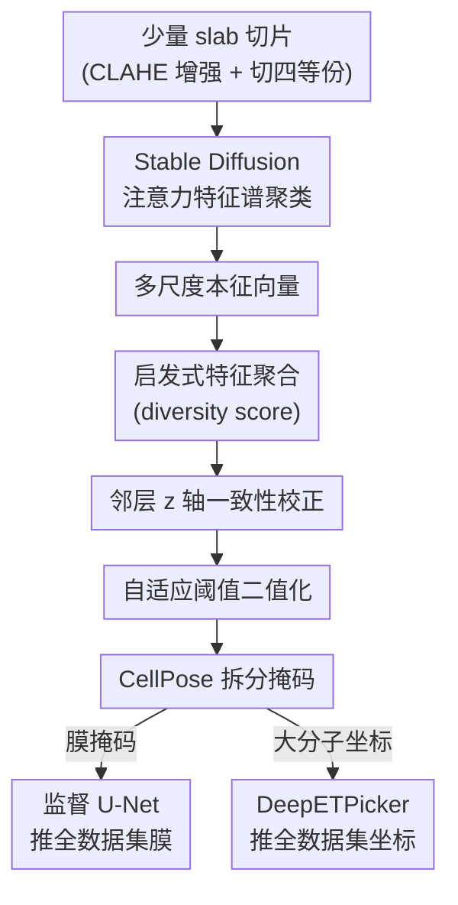

# Unsupervised Multi-Scale Segmentation of 3D Subcellular World with Stable Diffusion Foundation Model

**会议**: CVPR 2026  
**论文**: [CVF Open Access](https://openaccess.thecvf.com/content/CVPR2026/html/Uddin_Unsupervised_Multi-Scale_Segmentation_of_3D_Subcellular_World_with_Stable_Diffusion_CVPR_2026_paper.html)  
**领域**: 3D视觉 / 无监督分割  
**关键词**: 冷冻电镜断层成像, 无监督分割, Stable Diffusion特征, 谱聚类, 亚细胞结构

## 一句话总结
不训练、不标注，直接借用预训练 Stable Diffusion 的注意力特征做谱聚类，再配一套启发式特征聚合与自适应阈值，把冷冻电镜断层图（cryo-ET）里大到细胞膜、小到核糖体的多尺度亚细胞结构一并分割出来，得到的伪标签训练下游模型后，效果逼近人工专家标注。

## 研究背景与动机
**领域现状**：冷冻电镜断层成像（cryo-ET）能在细胞原位、近原生状态下用 3D 方式同时看到大尺度的膜/细胞器和小尺度的大分子复合物（核糖体、蛋白酶体等）。要从这些断层图里读出生物学信息，第一步就是把这些亚细胞结构分割出来。目前主流是 Membrain、DeePiCt 这类 3D U-Net 监督分割模型。

**现有痛点**：监督方法有三个硬伤。一是单个断层图体积巨大（典型 4000×4000×2000 体素，四倍 binning 后仍约 1000×1000×500），逐体素标注既慢又贵；二是一个模型往往只能分割一种尺寸的结构——要么大膜要么小分子，无法跨尺度统一处理；三是不同实验、不同样品的 cryo-ET 图存在严重的域差异（domain gap），在一种细胞断层图上训好的模型换一种细胞就大幅掉点。

**核心矛盾**：高质量分割依赖大量标注，而 cryo-ET 标注恰恰是最稀缺、最不可迁移的资源——监督学习的能力天花板被标注瓶颈死死压住。已有的自然图无监督分割方法（FreeSOLO、LOST、CutLER）又因为 cryo-ET 图与自然图性质相差太大而完全失效。

**本文目标**：在零人工标注的前提下，做出一个能跨尺度（膜+大分子）、跨域（不同实验/物种）的统一无监督分割框架，并且只需用户从极少数代表性断层图里挑几层切片即可启动。

**切入角度**：作者发现预训练 Stable Diffusion 的 UNet 注意力层里藏着强空间定位信息——也就是视觉的「where」通路。虽然它几乎只在自然图上训练，但其 query-key 嵌入对「物体在哪、有多少类」这种 objectness 的刻画足够通用，可以迁移到 cryo-ET 这种完全不同的成像模态上。

**核心 idea**：把 Stable Diffusion 当成免训练的特征提取器，对其全部注意力层的特征做谱聚类得到本征向量，再用一套针对 cryo-ET 量身定制的启发式聚合 + 自适应阈值把本征向量变成多尺度掩码，最后用这些掩码当伪标签训下游模型扫全数据集。

## 方法详解

### 整体框架
整个 pipeline 要解决的是「没有标注、又要同时分割大小差异巨大的结构」这个难题，核心思路是「用基础模型的通用特征生成可信的伪标签，再用伪标签把能力放大到整个数据集」。流程是：用户从断层图里挑几层富含结构的切片（slab）→ 增强对比度并切成四等份 → 送进 Stable Diffusion 注意力层取特征、做谱聚类得到本征向量 → 用启发式策略把本征向量聚合成一张特征图、自适应阈值二值化得到多尺度掩码 → 用 CellPose 把掩码拆成「膜」和「大分子」两路 → 膜掩码训一个 U-Net、大分子坐标训一个 DeepETPicker，再用这两个监督模型推断整个数据集里所有断层图。注意：Stable Diffusion 和 CellPose 都是现成预训练模型，唯一的「训练」是在本征向量上做的梯度优化，所以整体仍是无监督的。

### 关键设计

**1. 借用 Stable Diffusion「where」通路 + 全层注意力做特征提取**

cryo-ET 图与自然图相差悬殊，专门训练又没有标注，作者的破局点是：不重训，直接抽预训练 Stable Diffusion 条件 UNet 里所有注意力层的 query-key 嵌入。具体地，把 512×512 的四等份切片以 patch size 8 切成 $N=512\times512/(8\times8)=4096$ 个视觉 token，取每层注意力的 $(Q_l, K_l)$，构造每层的亲和矩阵：

$$A_l(i,j)=\exp\!\left(\frac{Q_l(i)\,K_l(j)^\top}{\sqrt{d}}\right)$$

关键在于「用全部 16 层、而非只用最后一层」。FreeSOLO/CutLER 这类方法只取最后一层特征，但作者指出 objectness 信息其实分散在各层注意力里，cryo-ET 的多尺度结构尤其需要不同层级的特征互补——大膜靠浅层全局结构、小分子靠深层局部纹理，只取一层会丢掉一半信息。之所以选 Stable Diffusion 而不是 ResNet/ViT，是因为其 query-key 嵌入提供了最强的空间级线索（即视觉「where」通路），实验里它给出的特征质量在所有候选基础模型里最好。

**2. 跨全层谱聚类 + 梯度优化本征向量**

有了一组亲和矩阵 $\mathbf{A}=\{A_1,\dots,A_L\}$，要把 objectness 提炼成可分割的特征，就走谱聚类。单个亲和矩阵的标准本征问题是 $(D-A)X=\lambda DX$（$D$ 是 $A$ 的对角度矩阵）。但这里有 16 个矩阵，作者把它近似成一个对全层取期望的优化目标：

$$\max_{X}\ \mathbb{E}_{A\in\mathbf{A}}\!\left[g(X)^\top D^{-1}A\,g(X)\right]\quad \text{s.t.}\quad X^\top X=\mathbf{I}$$

其中 $g(\cdot)$ 把本征向量 $X$ 映射成与 $A$ 同尺寸的矩阵。实现上把 $X$ 当成可学习的特征图，用 PyTorch autograd 像训神经网络一样做梯度下降（Adam，lr=0.002，2000 步），最小化 $\mathbb{E}_{A}\big|g(X)^\top D_A^{-1}A\,g(X)-1\big|+\|X^\top X-I\|_F$。之后再对 $X^\top X$ 求正交本征向量，强制各通道相互正交，让不同本征图对应不同的结构成分。这样得到 $C$ 个本征向量，每个 $N\times1$，reshape 成 64×64 的灰度本征图。这步把「散在多层注意力里的 objectness」收敛成几张干净、互不冗余的结构候选图。

**3. diversity score 驱动的启发式特征聚合**

得到一堆本征图后，哪几张真正对应亚细胞结构、该怎么合并？作者定义了一个新启发式指标 diversity score 来量化一张灰度图的「结构丰富度」：把图 $I$ 按 patch 切开，对每个 patch $I_{ij}$ 算像素标准差 $\sigma_{ij}=\mathrm{std}(I_{ij})$，再取所有 patch 标准差集合的标准差作为整图分数：

$$\mathrm{DiversityScore}(I)=\mathrm{std}\big(\{\sigma_{ij}\}\big)$$

直觉是：结构丰富的图，各局部的纹理强度差异大，所以「局部标准差的标准差」更高。先选 diversity score 最高的本征图当「base」图，然后迭代地往里合并满足三个条件的其它本征图——① 与 base 高度相似、② 合并后 diversity score 上升、③ 合并后不引入更多噪声（用轮廓数量衡量），直到没有本征图满足条件为止。这套基于内容质量而非固定 top-k 的贪心聚合，正是它能同时抓住大膜和小分子、又不混入噪声的关键，也是它与 FreeSOLO/CutLER 初始掩码生成策略最不同的地方。

**4. z 轴邻层一致性校正 + 自适应阈值二值化**

虽然 slab 被当成独立 2D 图处理，但相邻深度切片其实看的是几乎同一批结构，本应高度相似。作者用 SSIM 度量相邻聚合特征图的相似度并做两步校正：若第 $z$ 层与上下邻层都不像、但上下邻层彼此很像（$\mathrm{sim}(F^{z+1},F^{z-1})>0.9$ 且 $\mathrm{sim}(F^{z+1},F^{z})<0.8$），判定第 $z$ 层是错误图，直接用上下邻层均值替换；否则做加权平滑 $F^{z}=0.5F^{z}+0.25F^{z-1}+0.25F^{z+1}$ 以保证 z 轴连续性。校正后先高斯平滑，再做高斯自适应阈值（block size $b=15$、常数 $C=3$）——对每个像素按其局部邻域算阈值，高于阈值记前景（255）否则背景（0），从而得到二值掩码 $M$。自适应而非全局阈值，是为了对付 cryo-ET 固有的强噪声与不均匀强度。

**5. CellPose 拆分多尺度掩码 + 下游模型放大到全数据集**

二值掩码里膜和大分子是混在一起的，但两者形态截然不同：膜是细长连续的曲面，大分子是小而近球形的点。作者用预训练 CellPose（原本为荧光显微镜细胞分割设计）来拆——大分子在掩码里长得像 CellPose 眼中的「细胞」，于是直接用它抽出大分子掩码；剩下的前景主要是膜，再用形态学闭运算和膨胀精修。拆完后两路分别放大：膜掩码当伪标签从零训一个 U-Net（Dice + 交叉熵损失，配随机翻转/旋转增强），用它推断整盘断层图剩余切片的膜；大分子坐标当伪标签训 DeepETPicker（弱监督粒子拾取网络，沿用其默认配置），扫出全数据集的大分子坐标。这一步把「几层切片上昂贵得到的精细掩码」廉价地外推到成千上万张切片，是无监督方案能覆盖整个大体积数据集的工程支点。

### 损失函数 / 训练策略
真正的无监督优化只发生在本征向量上：Adam，lr=0.002，2000 次迭代，单张 NVIDIA A5000。下游 U-Net 用 Dice + 交叉熵组合损失（兼顾区域级与像素级精度），DeepETPicker 用官方默认设置。整条 pipeline 用 PyTorch 实现。实验设置上，从 TS_0008 里挑 z=200–299 共 100 层富结构切片送入 pipeline，仅占整个数据集切片总量的 1.33%。

## 实验关键数据

### 主实验
在公开标注最完整的 S. Pombe 细胞 cryo-ET 断层图上评测。膜分割用 Dice 系数，大分子定位用 F1。

膜分割 Dice（VPP S. Pombe，越高越好）：

| 方法 | 类型 | TS_0008(训练) | Overall |
|------|------|------|------|
| Supervised U-Net | 监督 | 0.665 | 0.324 |
| SAM | 现成 | 0.03 | 0.048 |
| FreeSOLO | 无监督 | 0.002 | 0.003 |
| CutLER | 无监督 | 0.007 | 0.003 |
| **本文** | 无监督 | 0.508 | **0.309** |

本文 Overall Dice 0.309，仅比全监督 U-Net（0.324）低约 4%，在训练断层图上差距约 23%；而 SAM、FreeSOLO、CutLER 几乎全线崩盘（Dice ≤0.05），印证「自然图无监督方法无法迁移到电镜图」。

大分子定位 F1（越高越好，$n$ 为监督训练用的真值坐标数）：

| 方法 | 训练坐标 | Overall F1 |
|------|------|------|
| CrYOLO | n=500 | 0.31 |
| DeepETPicker | n=100 | 0.35 |
| DeepETPicker | n=500 | 0.57 |
| **本文** | 88 个伪坐标 | **0.43** |

本文用 88 个伪真值坐标训出的 DeepETPicker，F1=0.43，比 100 真值坐标训的 DeepETPicker 高 +22.84%，比 500 真值坐标训的 CrYOLO 高 +38.71%；但仍落后 500 真值坐标训的 DeepETPicker（0.57，相对 +32.55%），说明喂更多 slab 还能进一步涨点。

### 消融实验
完整消融在补充材料 S11，正文给出关键组件的必要性对照：

| 配置 | 关键现象 | 说明 |
|------|---------|------|
| 全层注意力 vs 仅末层 | 全层特征质量更优 | objectness 分散于各层，单层丢信息 |
| Stable Diffusion vs 其它 VFM | SD 特征整体最好 | 与 [22] 观察一致，故选 SD |
| 仅自然图无监督法(FreeSOLO/CutLER/SAM) | Dice ≤0.05 | 完全无法迁移到 cryo-ET |
| z 轴邻层校正 | 修正错误特征图 + 保证深度连续 | SSIM 双规则纠错 |

### 关键发现
- 无监督逼近监督：膜分割只差全监督约 4%，且完全省去人工标注，这是本文最强的结论。
- 伪标签 + 下游放大很划算：88 个伪坐标训出的检测器，竟超过 100 个真值坐标训出的同款检测器，说明伪标签的「覆盖广度」可以补偿单点精度。
- 跨域泛化有真实生物价值：在 C. Elegans、人 RPE 细胞断层图上无需任何标注就能分割膜与肌动蛋白丝（actin filaments），而用其它域人工标注训出的监督模型反而检不出这些丝状结构。
- 成本短板明显：本征向量优化在单 GPU 上每个 slab 要 7–8 分钟，是当前最重的计算瓶颈。

## 亮点与洞察
- 把生成模型当判别特征源：用「画图」的 Stable Diffusion 来做「分割」，靠的是其注意力 query-key 里的空间定位通路——这是「基础模型能力可跨任务复用」的漂亮例证，思路可迁移到其它缺标注的科学成像模态。
- diversity score 是个轻巧又对路的指标：用「局部标准差的标准差」量化结构丰富度，比固定 top-k 选本征图更鲁棒，且天然适配「同图里既有大膜又有小分子」的多尺度场景。
- 全层注意力聚合的取舍很有针对性：明确反对只用末层特征，把多尺度需求直接落到「多层特征互补」上，这点对任何用 ViT/扩散模型抽特征做分割的工作都有参考价值。
- 「少量精标 → 伪标签 → 监督放大」的范式在大体积数据上极具性价比：1.33% 切片撬动全数据集，是处理超大 3D 体数据的实用工程模板。

## 局限与展望
- 只按强度分大类，分不到细粒度：方法靠强度变化感知物体，只能分出「膜」和「大分子」两大类，无法直接区分线粒体、ER、高尔基体等具体细胞器（作者承认需额外后处理靠膜形态再分）。
- 计算昂贵：单 GPU 下每 slab 本征向量优化 7–8 分钟，处理大数据集时间成本可观，作者寄望于多 GPU 并行。
- 评测域偏窄：定量评测主要靠唯一标注完整的 S. Pombe，其它物种/细胞系只能定性展示，缺乏跨域定量验证。
- 依赖现成模型的归纳偏置：CellPose 拆分大分子的前提是「大分子像荧光图里的细胞」，对形态更不规则的结构这一假设可能失效；自适应阈值的 $b,C$ 也是经验值，鲁棒性未充分探讨。

## 相关工作与启发
- **vs FreeSOLO / CutLER**：同样从基础模型抽特征 + 自训练精修最终掩码，但本文初始掩码生成策略完全不同——它用全层注意力 + diversity score 启发式聚合，而非 FreeMask/MaskCut；且只取末层特征的它们在 cryo-ET 上 Dice ≈0.003，几乎失效，凸显电镜图需要专门设计。
- **vs Membrain / DeePiCt（监督 3D U-Net）**：它们对每类亚细胞结构各训一个模型、且跨实验严重掉点；本文是跨结构、跨域的统一无监督框架，省掉标注还能泛化到新物种。
- **vs DeepETPicker / CrYOLO（监督粒子拾取）**：本文不替换它们，而是把它们当下游放大器——用无监督伪坐标喂 DeepETPicker，反而超过用更多真值坐标训的 CrYOLO 与同等量级的 DeepETPicker。
- **vs SAM**：现成 SAM 在膜分割上 Dice 仅 0.048，说明通用自然图分割大模型并不能零成本解决电镜领域的多尺度分割。

## 评分
- 新颖性: ⭐⭐⭐⭐⭐ 首次把 Stable Diffusion 全层注意力 + 谱聚类用于 cryo-ET 多尺度无监督分割，diversity score 与全层聚合都是切题的新设计。
- 实验充分度: ⭐⭐⭐⭐ 膜与大分子两任务都有定量对照、跨域定性验证充分，但定量评测域较窄、主消融放在补充材料。
- 写作质量: ⭐⭐⭐⭐ pipeline 与公式交代清楚，启发式条件略多但逻辑连贯；部分细节（如 $g(\cdot)$ 推导）需查引用。
- 价值: ⭐⭐⭐⭐⭐ 直击 cryo-ET 标注瓶颈，无监督逼近监督且能跨域发现新结构，对结构生物学有实打实的加速意义。

<!-- RELATED:START -->

## 相关论文

- [\[CVPR 2026\] Making Training-Free Diffusion Segmentors Scale with the Generative Power](making_training-free_diffusion_segmentors_scale_with_the_generative_power.md)
- [\[CVPR 2026\] XSeg: A Large-scale X-ray Contraband Segmentation Benchmark for Real-World Security Screening](xseg_a_large-scale_x-ray_contraband_segmentation_benchmark_for_real-world_securi.md)
- [\[CVPR 2026\] MV3DIS: Multi-View Mask Matching via 3D Guides for Zero-Shot 3D Instance Segmentation](mv3dis_multi-view_mask_matching_via_3d_guides_for_zero-shot_3d_instance_segmenta.md)
- [\[ICLR 2026\] TRACE: Your Diffusion Model is Secretly an Instance Edge Detector](../../ICLR2026/segmentation/trace_your_diffusion_model_is_secretly_an_instance_edge_detector.md)
- [\[CVPR 2026\] Prompt-Driven Lightweight Foundation Model for Instance Segmentation-Based Fault Detection in Freight Trains](promptdriven_lightweight_foundation_model_for_inst.md)

<!-- RELATED:END -->
