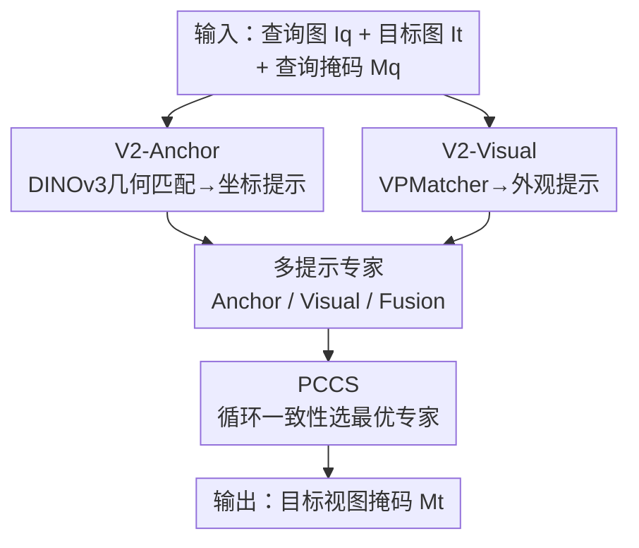

# V²-SAM: Marrying SAM2 with Multi-Prompt Experts for Cross-View Object Correspondence

**会议**: CVPR 2026  
**论文**: [CVF Open Access](https://openaccess.thecvf.com/content/CVPR2026/html/Pan_V2-SAM_Marrying_SAM2_with_Multi-Prompt_Experts_for_Cross-View_Object_Correspondence_CVPR_2026_paper.html)  
**代码**: 待发布（论文承诺 release）  
**领域**: 分割 / 跨视图对应  
**关键词**: SAM2、跨视图对应、Ego-Exo、坐标提示、多专家MoE

## 一句话总结
V²-SAM 把单视图分割大模型 SAM2 改造成跨视图物体对应框架，用一个几何感知的坐标提示生成器（V2-Anchor）和一个外观感知的视觉提示生成器（V2-Visual）分别解决「目标在哪」和「目标长什么样」，再用三专家 + 循环一致性选择器（PCCS）自适应挑出最可靠的预测，在 Ego-Exo4D、DAVIS-17、HANDAL-X 三个基准上都刷新了 SOTA。

## 研究背景与动机

**领域现状**：跨视图物体对应（cross-view object correspondence）要做的是——给定查询视图里某物体的掩码标注，在另一个视图里把同一个物体分割出来。其最具代表性也最难的实例是 ego–exo 对应：同一物体同时被一个移动的第一人称（ego）相机和一个固定的第三人称（exo）相机观测。这是多视图场景理解、视频感知、具身智能的基础能力。

**现有痛点**：单视图分割已经被 SAM2 这类基础模型推到很高水平，但它依赖**空间锚定的提示**（点坐标、框）来条件化解码器。跨视图场景里，同一物体在两个视图中的位置可能天差地别，直接把查询视图的坐标搬到目标视图根本不成立。已有的 referring-based 改法（Ref-SAM）干脆用视觉引导提示替换掉位置提示，但带来两个新问题：① 视图间外观剧变时容易失效；② 丢掉空间提示等于废掉了 SAM2 最擅长的定位能力。

**核心矛盾**：跨视图对应同时需要「定位」（target 在目标视图的哪里）和「外观关联」（哪个区域看起来是同一个物体），但现有方法要么只保留视觉线索（丢定位），要么靠外部分割模型做 mask matching（学习与泛化能力受限于外部 proposal）。空间提示与外观提示这两类线索被割裂使用，没人把它们在 SAM2 框架内统一起来。

**本文目标**：① 能不能在跨视图场景下重新解锁 SAM2 的空间提示能力？② 如果能，空间提示和视觉提示能否互补，进一步提升性能？

**切入角度**：作者观察到 DINOv3 的 patch 级特征空间是**几何感知**的——跨视图同一物体的 patch 在特征上仍可匹配。于是可以用特征匹配在目标视图里恢复出一个可靠的坐标，把它当作 SAM2 的点提示。同时经验上发现两类提示各有所长：anchor 擅长「知道在哪」，visual 擅长「知道长什么样」，天然适合用多专家来融合。

**核心 idea**：用 DINOv3 几何匹配为 SAM2 在跨视图下「凭空造出」一个坐标点提示，再配一个跨视图视觉提示匹配器，并用三专家 + 循环一致性选择把二者的互补优势组合起来。

## 方法详解

### 整体框架

输入是一对时间对齐的查询–目标图像 $(I_q, I_t)$ 与查询视图的物体掩码 $M_q$，输出是目标视图的预测掩码 $\hat{M}_t$。整个框架建在 SAM2 之上：保留 SAM2 的图像编码器 $\phi(\cdot)$、提示编码器、掩码解码器，**丢掉与记忆相关的模块**（专注帧级对应，从而能无缝迁移到图像与视频两类任务）。

流程分三步：先由两个提示生成器把物体信息从查询视图搬到目标视图——V2-Anchor 在 DINOv3 特征上建立几何对应、产出坐标提示 $P^{q2t}_{anchor}$；V2-Visual 在 SAM2 特征上做区域池化、经 VPMatcher 跨视图映射，产出外观提示 $P^{q2t}_{visual}$。然后用这两类提示构造三个专家（Anchor / Visual / Fusion Expert），各自接同一套解码器架构但参数独立，并行预测候选掩码。最后由 PCCS 用循环一致性无参数地挑出最可靠的那一个作为最终输出。

### 关键设计

**1. V2-Anchor：用 DINOv3 几何匹配为 SAM2 在跨视图里造出坐标提示**

这是为了解决「SAM2 离开空间提示就废了，但跨视图位置又对不上」的死结。作者完全**非学习**地走四步：(a) 特征匹配——对每个查询 patch 计算它与所有目标 patch 的余弦相似度热图

$$\mathbf{H}_{ij} = \frac{\varphi(I_q)_i^{\top}\,\varphi(I_t)_j}{\|\varphi(I_q)_i\|_2\,\|\varphi(I_t)_j\|_2}$$

其中 $\mathbf{H}\in\mathbb{R}^{(H_qW_q)\times(H_tW_t)}$，对每个查询 patch 取 $j^*=\arg\max_j \mathbf{H}_{ij}$ 作为最佳匹配；并把查询掩码 $M_q$ 投到 DINOv3 patch 网格上只保留前景 patch（$P_q=\{i\mid (x_i,y_i)\in M_q\}$），抑制背景噪声。(b) 点分层（point stratification）——匹配点可能冗余或局部成簇，于是做分层采样强制点间最小距离 $\tau$：

$$\mathcal{P}'_t = \{p_i \mid \|p_i - p_j\|_2 > \tau,\ \forall j<i\}$$

得到一组紧凑而空间多样的高质量对应。(c) 坐标变换——把 $\mathcal{P}'_t$ 用确定性几何投影 $\Pi(\cdot)$ 线性映射到 SAM2 的规范坐标空间。(d) 提示编码——送入提示编码器得到坐标提示 $P^{q2t}_{anchor}$。这一支「首次」让 SAM2 在跨视图（尤其 ego–exo）场景里用上坐标点提示，恢复了它最强的定位能力；而且因为全程非学习、产出的就是 SAM2 原生支持的坐标提示，对应的 Anchor Expert 可以**完全 training-free**地复用预训练解码器。

**2. V2-Visual：用 VPMatcher 从特征与结构两路弥合跨视图外观鸿沟**

V2-Anchor 解决「在哪」，但外观剧变时几何匹配也会糊；V2-Visual 负责「长什么样」。先用 SAM2 编码器抽 $\phi(I_q),\phi(I_t)$，训练时用掩码池化得区域级特征 $\mathbf{v}_q=\mathrm{MaskP}(\phi(I_q),M_q)$、$\mathbf{v}_t=\mathrm{MaskP}(\phi(I_t),M_t)$。核心是 VPMatcher，含两条互补支路：

**特征映射支路**——把融合提示 $p_f=\mathbf{v}_q+F_{mask}(M_q)$ 作为 query，目标特征作 key/value 做交叉注意力 $\alpha=\mathrm{Softmax}(qk^\top/\sqrt{D_e})$，并用空间门控抑制背景，再过若干 Transformer 交叉注意力层和残差 MLP，得到预测的跨视图嵌入 $\hat{\mathbf{v}}_c$，学的是「语义一致」的表示。**结构映射支路**——从粗几何先验重建目标掩码：查询掩码下采样成 $\mathbf{m}_{prior}$，再用 FiLM 把语义条件注入掩码空间

$$\tilde{\mathbf{m}} = \mathbf{m}_{prior}\odot(1+\tanh(\gamma)) + \beta + F_{mask}(M_q)$$

解码器逐步上采样得预测掩码 $\hat{M}_c$，学的是「结构连贯」。两路结果拼接后过轻量 MLP 得最终外观提示 $P^{q2t}_{visual}=\mathrm{MLP}([\hat{\mathbf{v}}_c, \mathbf{v}_{c'}])$（其中 $\mathbf{v}_{c'}=\mathrm{MaskP}(\phi(I_q),\hat{M}_c)$ 是基于预测掩码再池化的区域特征）。从特征和结构两个视角对齐，比只搬查询视图特征更能跨过外观 gap。

**3. 多提示专家：把「在哪」与「长什么样」交给三个分工的专家**

单一提示在不同场景下各有短板：Anchor 在结构化、相对静态场景（烹饪、健康）强，但大运动/外观剧变时退化；Visual 在动态、人体中心场景（篮球、音乐）强。受 MoE 启发，作者把「一个提示生成器 + 一个 SAM2 解码器」定义为一个专家，训练三个：Anchor Expert（只用几何提示）、Visual Expert（只用视觉提示）、Fusion Expert（把两类提示融成统一提示嵌入）。三者共享解码器架构但参数独立。其中 Anchor Expert 因提示是 SAM2 原生坐标点，**训练免费**；Visual 与 Fusion Expert 引入了 VPMatcher 的新参数，需要训练（SAM2 编码器冻结）。Fusion Expert 同时推理两类提示，在多数场景给出最均衡的表现。

**4. PCCS：后验循环一致性选择器，在点级别无参数挑专家**

有了三个候选，怎么选最可靠的？PCCS 利用跨视图掩码的**双向循环一致性**：把第 $k$ 个专家的预测 $\hat{M}_{t_k}$ 通过 V2-Anchor 反向映射回查询视图

$$P^{t2q}_k = \mathrm{V^2\text{-}Anchor}(I_t, I_q; \hat{M}_{t_k})$$

然后计算这些反投影点与查询掩码采样参考点之间的平均距离作为代理分数，距离越小说明这个预测越自洽，就选它。与以往「重建一张查询视图掩码再比对」的循环方案不同，PCCS 直接在**点级别**操作，省掉一次额外解码、还保住了选择精度，是一个轻量的推理期验证机制。

### 损失函数 / 训练策略

总损失是三项加权（仅 Visual / Fusion Expert 训练，Anchor Expert 免训）：

$$\mathcal{L} = \lambda_1\mathcal{L}_v(\hat{\mathbf{v}}_c, \mathbf{v}_t) + \lambda_2\mathcal{L}_s(\hat{M}_c, M_t) + \lambda_3\mathcal{L}_m(\hat{M}_t, M_t)$$

其中 $\mathcal{L}_v$ 是跨视图区域特征的视觉对比损失（InfoNCE 形式，拉近正对、推远负对）；$\mathcal{L}_m$ 是掩码预测损失，结合像素级交叉熵与区域级 Dice：$\mathcal{L}_m=\mathcal{L}_{CE}(\hat{M},M)+\mathcal{L}_{Dice}(\hat{M},M)$；$\mathcal{L}_s$ 是结构约束损失，约束 VPMatcher 学到固定的空间变换。骨干为 SAM2-Hiera-Large + DINOv3 ViT-L/16，8 张 H 系列 GPU、每卡 batch 16、学习率 $4\times10^{-5}$，权重比 $\lambda_1:\lambda_2:\lambda_3=1:1:10$；前 4K 步用 $\lambda_1=100$ 的对比目标增强特征表示。推理时三专家并行出候选，PCCS（batch=1）选最终结果。

## 实验关键数据

### 主实验

Ego-Exo4D Correspondences v2 测试集（IoU↑，越高越好；参数量列为总/可训练 M）：

| 方法 | Ego2Exo IoU | Exo2Ego IoU | Total IoU | 可训练参数(M) |
|------|------|------|------|------|
| ObjectRelator | 35.3 | 40.3 | 37.8 | 1587.3 |
| Ref-SAM* | 29.2 | 42.2 | 37.8 | 4.3 |
| O-MaMa | 42.6 | 44.1 | 43.4 | 11.6 |
| **V2-SAM (Single-Expert)** | 44.5 | 47.3 | 45.9 | 7.6 |
| **V2-SAM (Multi-Experts)** | **46.3** | **49.6** | **48.0** | 15.3 |

多专家版相比此前最强的 O-MaMa，在两个方向分别 +3.7 / +5.5 IoU；连单专家版（45.9）也已超过 O-MaMa（43.4）。尤其惊人的是参数效率：多专家总参数 543M、可训练仅 15M，约为 ObjectRelator（1.6B）的 ~1%，却带来 +10.2 total IoU。

跨基准泛化（DAVIS-17 视频对应，时间间隔 20 帧；HANDAL-X 零样本机器人场景）：

| 基准 | 指标 | 之前最佳 | V2-SAM | 提升 |
|------|------|------|------|------|
| DAVIS-17 | J&Fm↑ | 70.2 (PCC) | **78.8** | +8.6 |
| HANDAL-X (ZSL) | IoU↑ | 42.8 (ObjectRelator) | **77.2** | +34.4 |

HANDAL-X 是用 Ego-Exo4D 训练的模型直接零样本迁移，单专家就到 66.4、多专家 77.2，显示出很强的跨视图泛化。

### 消融实验

单专家内部组件消融（Table 4，Total IoU）：

| 配置 | Total IoU | 说明 |
|------|------|------|
| Anchor Expert w/o V2-Anchor | 1.5 | 用 $M_q$ 质心直接当提示 → 近乎归零 |
| Anchor Expert w/ V2-Anchor | 40.1 | 跨视图定位能力被解锁 |
| Visual Expert w/o V2-Visual | 3.0 | 直接用查询视图特征 → 崩溃 |
| Visual Expert w/ V2-Visual | 41.4 | VPMatcher 弥合外观 gap |

专家组合消融（Table 5，Total IoU）：A=Anchor 40.1，B=Visual 41.4，C=Fusion 45.9，A+B 45.5，**A+B+C 48.0**。

### 关键发现

- **两个提示生成器各自都是命门**：去掉 V2-Anchor，Anchor Expert 从 40.1 掉到 1.5；去掉 V2-Visual，Visual Expert 从 41.4 掉到 3.0——说明跨视图下「凭空造坐标」和「跨视图外观对齐」都不是锦上添花，而是从能用到不能用的开关。
- **三专家互补且可叠加**：Anchor + Visual 已带来明显增益（Ego2Exo 38.7→42.7），Fusion Expert 单独就接近双专家组合，三者全开（A+B+C）拿到 48.0 的最优，验证 PCCS 选择确实把互补优势用上了。
- **专家有清晰的场景特化**：Anchor 在结构化静态场景（烹饪、健康）强，Visual 在动态人体场景（篮球、音乐）强，Fusion 在雷达图上覆盖最均衡——这正是需要 PCCS 做实例级自适应选择的原因。

## 亮点与洞察
- **「几何匹配造坐标」是点睛之笔**：以往一遇跨视图就放弃 SAM2 的坐标提示，本文用 DINOv3 的几何感知特征非学习地恢复出一个高置信坐标点，等于把 SAM2 最强的定位能力原封不动搬进跨视图——而且这一支完全免训，工程上极轻。
- **PCCS 在点级别做循环一致性**：把预测反投影回查询视图、只比对点距离，避免了「再解码一张掩码」的额外开销，是个可复用的轻量无参数选择 trick，可迁移到任何「多候选 + 跨视图可逆映射」的场景。
- **参数效率的对比极具说服力**：15M 可训练参数打过 1.6B 的 ObjectRelator，说明跨视图对应的瓶颈不在模型容量，而在「怎么把空间与外观线索喂给一个好分割器」。

## 局限与展望
- **依赖 DINOv3 几何特征的可匹配性**：当两视图外观剧变到几何对应也失效时（论文也承认 music 这类场景 Anchor 退化），V2-Anchor 造出的坐标可能不可靠，此时只能靠 Visual Expert 兜底。
- **三专家并行 + DINOv3 + SAM2-Large 推理成本不低**：虽然可训练参数少，但总参数 543M 且三专家并行出候选，实时性/部署成本论文未深入讨论。
- **PCCS 选择粒度是实例级**：对一张图里多个物体、或专家在不同区域各有对错的情况，整图选一个专家可能不是最优；像素/区域级的混合选择是潜在改进方向。
- **去掉了 SAM2 的 memory 模块**做帧级对应，长视频里的时序一致性没有显式建模，可能在长时跟踪上让出一部分潜力。

## 相关工作与启发
- **vs O-MaMa / DOMR（matching-based）**：它们把跨视图分割当成对外部分割模型 mask proposal 的后验匹配，学习与泛化受限于外部 proposal 质量；V2-SAM 是 learnable model-based，直接在 SAM2 内端到端学跨视图对应，且首次引入坐标线索，参数更少、性能更高。
- **vs ObjectRelator（learnable model-based）**：同属端到端学习路线，但 ObjectRelator 用视觉+文本条件、模型高达 1.6B；本文用「坐标提示 + 视觉提示」的多专家，~1% 参数即超越，证明线索设计比堆参数更关键。
- **vs Ref-SAM / VRP-SAM / ViRefSAM（视觉参考分割）**：这些方法主要做**视图内**视觉提示，去掉位置提示后在跨视图下（尤其 Ego2Exo）外观剧变就垮；V2-SAM 强调空间+外观线索的整合，把视觉参考分割推广到跨视图与具身感知场景。

## 评分
- 新颖性: ⭐⭐⭐⭐⭐ 首次在跨视图场景为 SAM2 解锁坐标提示，几何/外观双提示 + 点级循环一致性选择的组合很有原创性。
- 实验充分度: ⭐⭐⭐⭐⭐ 三基准全 SOTA，组件/组合/场景特化消融完整，参数效率对比有力。
- 写作质量: ⭐⭐⭐⭐ 方法叙述清晰、图表完备；部分符号（VPMatcher 内部张量）略密集，初读需对照图。
- 价值: ⭐⭐⭐⭐⭐ 跨视图对应是具身智能的基础能力，方案轻量且可迁移到视频跟踪/机器人，落地潜力大。

<!-- RELATED:START -->

## 相关论文

- [\[CVPR 2026\] M4-SAM: Multi-Modal Mixture-of-Experts with Memory-Augmented SAM for RGB-D Video Salient Object Detection](m4-sam_multi-modal_mixture-of-experts_with_memory-augmented_sam_for_rgb-d_video_.md)
- [\[CVPR 2026\] Learning Cross-View Object Correspondence via Cycle-Consistent Mask Prediction](learning_cross-view_object_correspondence_via_cycle-consistent_mask_prediction.md)
- [\[CVPR 2026\] VGGT-Segmentor: Geometry-Enhanced Cross-View Segmentation](vggt-segmentor_geometry-enhanced_cross-view_segmentation.md)
- [\[CVPR 2026\] Cross-Domain Few-Shot Segmentation via Multi-view Progressive Adaptation](cross-domain_few-shot_segmentation_via_multi-view_progressive_adaptation.md)
- [\[CVPR 2026\] SAM2Text: Towards Prompt-Free and Multi-Resolution Video Scene Text Segmentation](sam2text_towards_prompt-free_and_multi-resolution_video_scene_text_segmentation.md)

<!-- RELATED:END -->
