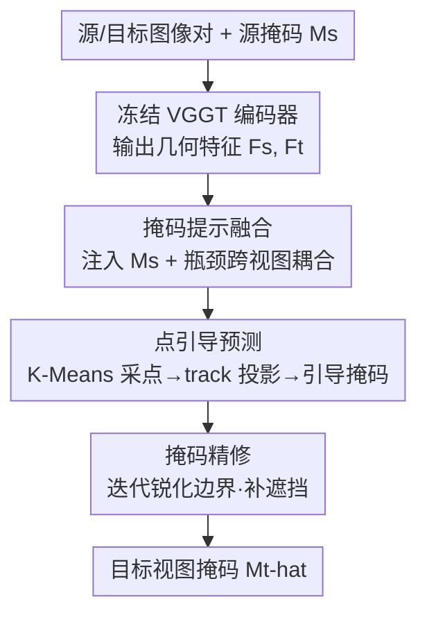

# VGGT-Segmentor: Geometry-Enhanced Cross-View Segmentation

**会议**: CVPR 2026  
**论文**: [CVF Open Access](https://openaccess.thecvf.com/content/CVPR2026/html/Gao_VGGT-Segmentor_Geometry-Enhanced_Cross-View_Segmentation_CVPR_2026_paper.html)  
**领域**: 跨视图分割 / 3D 视觉  
**关键词**: 跨视图分割, ego-exo, VGGT, 几何先验, 自监督

## 一句话总结
VGGT-Segmentor（VGGT-S）把多视图几何大模型 VGGT 当冻结骨干，在其上接一个三阶段的「联合分割头」，把 VGGT 可靠的物体级特征对齐转译成像素级掩码，并用单图自监督训练摆脱配对标注，在 Ego–Exo4D 跨视图分割上把平均 IoU 刷到 67.7%/68.0%，比之前最好方法高出 18.0%/12.8%。

## 研究背景与动机

**领域现状**：在第一人称（ego，戴在操作者头上的相机）和第三人称（exo，旁观相机）两个视角之间，找到并分割出**同一个物体**的实例级跨视图对应，是具身智能和远程协作的关键能力——比如把操作者手里正在用的工具，在外部视角里同步标出来给协作者看。Ego–Exo4D 数据集发布后，这个任务才有了系统研究的基础：给定一个视角里的物体掩码作为 query，要在另一个视角里把同一物体定位并分割出来。

**现有痛点**：两个视角之间尺度、视角、遮挡差异极大——ego 相机贴着手，画面常被手和工具挡住；exo 相机离得远、背景里全是干扰物，导致直接做像素级匹配极不稳定。早期方法要么靠语义一致性、要么靠大语言模型的上下文理解（如 PSALM、ObjectRelator），但它们都**忽略了几何结构和空间关系**，在大视角差下容易匹配错。

**核心矛盾**：VGGT 这类几何感知大模型本来是个好底座——它前馈地联合推断多视图的深度、相机参数和点图，提供跨视图一致的特征。但作者发现一个关键现象：直接拿 VGGT 做密集分割时，它的**像素级点投影会系统性漂移**（在 ego-exo 严重遮挡 + 大视角变化下尤其明显），可它**内部的物体级注意力却依然可靠**，能稳稳聚焦到目标物体的大致区域。也就是说，VGGT 的「高层特征对齐」是对的，但「逐像素点对应」是错的，两者之间存在落差。

**本文目标**：把 VGGT 可靠的高层特征对齐，转译成像素精确的分割掩码——既要利用它的几何先验，又要绕开它点投影漂移的短板；同时希望摆脱昂贵的配对标注，做到强泛化。

**核心 idea**：冻结 VGGT、只训一个轻量「联合分割头」，把物体掩码作为显式 query 注入跨视图推理；用**稀疏的、几何感知的点提示**（而非稠密像素匹配）来引导掩码预测，再迭代精修边界；训练侧用单图增强构造伪配对，彻底不依赖跨视角标注。

## 方法详解

### 整体框架
VGGT-S 的输入是一对源视图—目标视图图像 $(I_s, I_t)$（例如 Exo→Ego）加上源视图的物体掩码 $M_s$，输出是目标视图里同一物体的掩码 $\hat{M}_t$。整条管线分两大块：先用**冻结的 VGGT 编码器**把两张图编码成几何对齐的稠密特征 $F_s, F_t$，再用一个轻量的 **Union Segmentation Head（联合分割头）** 把这些跨视图几何线索翻译成目标视图掩码。训练时 VGGT 全程冻结，只优化分割头，既保持端到端又把显存和算力开销压到最低。

联合分割头内部是三个串行阶段：**掩码提示融合**把源掩码注入两视图特征并做跨视图耦合 → **点引导预测**用 VGGT 追踪出的稀疏锚点引导出初始掩码 → **掩码精修**迭代地锐化边界、补全遮挡区域。下面这张图给出从输入到掩码的完整数据流：

### 关键设计

**1. 掩码提示融合（Mask Prompt Fusion）：把「要分割哪个物体」显式写进两视图特征**

痛点是 VGGT 只给出通用的几何特征，并不知道这次要找哪个物体；而源掩码 $M_s$ 一开始只跟源特征有关，跟目标特征 $F_t$ 几乎没交互。本设计先用卷积把源掩码编码成高维嵌入 $E_m = \text{Conv}(M_s)$，直接加到源特征上 $F'_s = F_s + E_m$，让源特征带上「身份」信息。但仅这样 $M_s$ 还没和 $F_t$ 充分耦合，于是引入一个 **Bottleneck Fusion（瓶颈融合）模块**：先把 $F'_s, F_t$ 降采样到 $\tilde{F}_s, \tilde{F}_t$，拼接后过自注意力 + FFN，再上采样回去：

$$\dot{F}_s, \dot{F}_t = \text{FFN}\big(\text{SelfAttn}([\tilde{F}_s, \tilde{F}_t])\big), \quad F^\star = [U_r(\dot{F}_s), U_r(\dot{F}_t)]$$

降采样（默认到 $37\times37$）是关键——自注意力是平方复杂度，在原分辨率上做跨视图耦合会直接 OOM，瓶颈结构让两视图能负担得起地互相「看见」对方，把源物体的空间先验传到目标特征里。消融显示，光是加上这一步就把 IoU 从 Plain Head 的 35.5/37.1 抬到 50.2/52.3，证明跨视图特征聚合是视角迁移的核心。

**2. 点引导预测（Point-Guided Prediction）：用稀疏几何锚点绕开 VGGT 的像素漂移**

这是全文的关键洞察落地点：VGGT 逐像素稠密投影会漂移，但只取**少量代表点**做几何锚定就稳得多。具体做法是先在源掩码前景 $\Omega = \{(x,y)\mid M_s(x,y)=1\}$ 上用 K-Means 采 $K_{pt}$ 个代表点 $P_s = \text{kmeans}(\Omega, K_{pt})$（默认 5 个），再用 VGGT 的 track head 把它们投影到目标帧 $P_t = T(P_s; I_s, I_t)$。这些点连同从源特征采样出的点特征 $E_p$、一个可学习的输出掩码 token $O$ 一起组成 prompt query $Q_0 = [E_p, E_s, E_t, O]$，送进 $L$ 层轻量解码块。每块先在 prompt 之间自注意力，再做点→图、图→点双向交叉注意力：

$$\bar{Q}_\ell = \text{SelfAttn}(Q_{\ell-1}),\quad Q_\ell = \text{CrossAttn}_{P\to I}(\bar{Q}_\ell, F^\star_\ell),\quad H_\ell = \text{CrossAttn}_{I\to P}(F^\star_\ell, Q_\ell)$$

最后用精修后的输出 token $O_L$ 对目标特征 $H_t$ 做一次点→图交叉注意力，再逐像素点积 + sigmoid 得到初始掩码 $\hat{M}^{(0)}_t(x,y) = \sigma\big((W\tilde{O}+b)^\top f_t(x,y)\big)$。之所以有效，是因为稀疏点对透视和尺度变化天然鲁棒——消融里点数从 1 增到 5，IoU 涨 6.2%/4.6%，但从 5 增到 9 只多 0.6%/0.5%，说明少量几何锚点就是高性价比的引导信号。加上这一步 IoU 进一步升到 62.2/63.5。

**3. 掩码精修（Mask Refinement）：迭代锐化边界、补全被遮挡区域**

初始掩码在边界和遮挡处往往糊。本设计用一个轻量掩码解码器 $\Psi$ 做迭代精修：$\hat{M}^{(k+1)}_t = \Psi(F_s, M_s, F_t, \hat{M}^{(k)}_t, Q)$，每轮把上一轮掩码、双视图特征和精修后的 query 再喂回去，逐步把边界磨锐、把遮挡空洞填上。一个工程细节是训练时只在**最后一次迭代**反传梯度，且每个 batch 里只有一半样本走精修、另一半不走，省训练开销又不至于过拟合精修路径。消融显示迭代 0→2 轮 IoU 涨 5.5%/4.5%（62.2→67.7、63.5→68.0），延迟只从 153.2ms 增到 161.4ms；第 3 轮收益就很微（+0.2/+0.4），所以默认 2 轮，是精度和速度的甜点。

**4. 单图自监督训练（Single-Image Self-Supervised Training）：不靠配对标注也能学跨视图迁移**

配对的 ego-exo 标注极贵，限制了规模化。受 MASA 增强思路启发，本设计只需任意单图 $I$：用离线分割器（SAM）拿伪掩码 $M$，对 $I$ 做增强得到 $I'$，要求模型在 $I'$ 上预测同一物体的掩码 $\hat{M}'$。关键是把增强分成两族来覆盖真实跨视图分布：**VGGT-adaptive**（缩放、轻微旋转、裁剪）保留 VGGT 的点映射能力，此时两视图都过 VGGT 编码器、由 track head 给点提示；**VGGT-non-adaptive**（大角度旋转、水平翻转）会严重破坏跨视图对齐、让 VGGT 失效，此时两视图各自独立编码，并对目标真值点做扰动来合成提示。两族混合，模型就学会一个与 VGGT 特征良好对齐、又能在大视角变化下恢复掩码的分割头。作者只在 SA-1B 的 1/20 子集上训出一个「无对应（correspondence-free）」预训练变体，零样本评测 Ego–Exo4D 就能超过全监督的 DOMR，说明这套自监督的泛化是真的强。

### 损失函数 / 训练策略
沿用 SAM 的监督方式，用 focal loss 与 dice loss 的线性组合（权重 20:1）监督预测掩码。优化器 AdamW，初始学习率 $5\times10^{-5}$、权重衰减 $1\times10^{-4}$，训练 12 个 epoch，在第 8、11 epoch 各把学习率乘 0.1；梯度 L2 范数裁剪到 1.0 防爆炸。VGGT patch size 取 14，瓶颈融合默认 $37\times37$，点引导默认采 5 个点、K-Means 只精修一次。全部实验在 4×RTX 4090 上完成，batch size 8。

## 实验关键数据

### 主实验

Ego–Exo4D 跨视图分割，指标为预测掩码与真值掩码的平均 IoU（%）。

| 设定 | 方法 | Ego→Exo IoU | Exo→Ego IoU |
|------|------|------|------|
| 全监督 | XView-XMem + XSegTx | 36.9 | 36.1 |
| 全监督 | PSALM | 41.3 | 47.3 |
| 全监督 | ObjectRelator | 45.4 | 50.9 |
| 全监督 | DOMR（前 SOTA） | 49.7 | 55.2 |
| 全监督 | **VGGT-S（本文）** | **67.7** | **68.0** |
| 零样本 | XView-XMem | 16.2 | 13.5 |
| 零样本 | SSCC | 38.4 | 43.7 |
| 零样本 | **VGGT-S（本文）** | **54.1** | **58.4** |

全监督版比 DOMR 高 18.0%/12.8%、比 LLM 系的 ObjectRelator 高 22.3%/17.1%，且推理效率更高。尤其值得注意：**无对应预训练的零样本变体（54.1/58.4）就反超了全监督的 DOMR（49.7/55.2）**，分别高出 4.4%/3.2%。把这个预训练模型在多视图跟踪数据集 MvMHAT 上微调 1 个 epoch，AP 直接到 80.7%，比 DOMR（71.1）高 9.6%，进一步印证泛化能力。

### 消融实验

组件逐步叠加（Table 3，IoU% / 单图推理延迟 ms）：

| 配置 | Ego→Exo | Exo→Ego | Time(ms) | 说明 |
|------|---------|---------|----------|------|
| Plain Head | 35.5 | 37.1 | 105.8 | 仅编码源掩码 + 输出 token 的基线 |
| + Bottleneck Fusion | 50.2 | 52.3 | 107.4 | 跨视图特征聚合，几乎不加延迟 |
| + Point-Guided Prediction | 62.2 | 63.5 | 153.2 | 稀疏几何锚点引导 |
| + Mask Refinement | **67.7** | **68.0** | 161.4 | 迭代精修，完整模型 |

完整模型比 Plain Head 总共提升 32.2%/30.9%。其他敏感性：点数 1→5→9（61.5→67.7→68.3）边际递减，故取 5；精修 0→2→3 轮（62.2→67.7→67.9）第 3 轮收益微，故取 2；融合分辨率 $37\to74$ 仅 +0.7/+0.5 却显著加延迟、$518$ 直接 OOM，故取 37；解码块 1→2→6（65.1→67.7→68.8）也是递减，默认 2。

### 关键发现
- **三个组件各司其职、缺一掉点明显**：Bottleneck Fusion 解决「两视图没耦合」（+~15 IoU），Point-Guided Prediction 解决「VGGT 像素漂移」（+~12 IoU），Mask Refinement 解决「边界/遮挡糊」（+~5 IoU），叠加起来才有 SOTA。
- **稀疏点是性价比之王**：5 个 K-Means 锚点几乎拿满收益，比稠密像素匹配既稳又省，直接印证「用稀疏几何锚点绕开 VGGT 漂移」的核心假设。
- **几何先验 + 自监督 = 强泛化**：零样本反超全监督 DOMR、MvMHAT 1-epoch 微调即新高，说明 VGGT 的几何一致表征 + 单图自监督把对配对标注的依赖真正打掉了。

## 亮点与洞察
- **「特征对齐对、点投影错」的诊断很犀利**：作者没有把 VGGT 当黑盒直接接头，而是先看清它「物体级注意力可靠、像素级投影漂移」的内部矛盾，再针对性地用稀疏点而非稠密匹配——这种「先诊断再下药」的思路可迁移到任何「拿大模型做下游密集预测」的场景。
- **冻结骨干 + 轻量头**：VGGT 全程冻结，只训分割头，既省显存又保住了几何先验不被下游小数据带偏，是利用几何大模型的经济做法。
- **两族增强构造伪跨视图**：把增强按「是否保留 VGGT 点映射」分成 adaptive / non-adaptive 两族，分别走不同的提示生成路径，巧妙地用单图模拟了真实跨视图里「有时几何能对上、有时完全对不上」两种情形，这个构造思路对其他需要配对数据的对应任务很有借鉴价值。

## 局限与展望
- **强依赖 VGGT 骨干**：整套方法建立在 VGGT 的几何表征质量上，VGGT 失效（如极端非刚体、纯无纹理场景）时分割头能否兜底，文中未充分探讨。
- **只做单帧、未用时序**：方法纯靠 image-level 特征，虽然已超过用时空线索的 XView-XMem，但视频里的时序一致性（跨帧 track drift）没有显式利用，扩展到视频跨视图跟踪还有空间。
- **精度—效率仍是手调权衡**：融合分辨率、点数、精修轮数、解码块数都靠消融选甜点，且更高分辨率会 OOM，部署到更高分辨率/实时场景需要进一步的效率设计。
- **零样本仍逊于全监督本身**：零样本 54.1/58.4 虽超过旧 SOTA，但离本文全监督 67.7/68.0 还有 ~10–13 个点的差距，无标注上限尚未触顶。

## 相关工作与启发
- **vs DOMR**：DOMR 用稠密物体匹配、联合建模视觉/空间/语义线索来配对跨视图物体；本文不做稠密匹配，而是借 VGGT 几何先验 + 稀疏点锚定，全监督高出 18.0%/12.8%，且零样本就反超 DOMR 全监督。
- **vs ObjectRelator / PSALM**：它们靠大语言模型的语义/上下文理解做跨视图，忽略几何结构；本文显式引入几何，精度更高、推理更快。
- **vs SegMASt3R**：同样用 3D 几何先验做跨视图分割，但本文专门处理了 VGGT 在 ego-exo 大视角下的像素漂移问题，并加了单图自监督。
- **vs MASA**：本文的单图自监督训练受 MASA 增强思路启发——MASA 用几何变换从无标注图 bootstrap 实例关联，本文把它适配成「保留/破坏 VGGT 点映射」两族增强，专门服务跨视图掩码头。

## 评分
- 新颖性: ⭐⭐⭐⭐⭐ 「VGGT 特征对齐对、点投影漂移」的诊断 + 稀疏点锚定的对策，是把几何大模型用于跨视图密集预测的漂亮新解法。
- 实验充分度: ⭐⭐⭐⭐⭐ 主表 + 零样本 + 跨数据集泛化 + 6 张消融表，组件、点数、轮数、分辨率全覆盖。
- 写作质量: ⭐⭐⭐⭐ 动机—诊断—方法逻辑清晰，公式完整；个别工程细节（remapping/cropping）推到补充材料略影响自洽阅读。
- 价值: ⭐⭐⭐⭐⭐ Ego–Exo4D 大幅刷新 SOTA，且零样本反超全监督、几乎不依赖配对标注，对具身智能/远程协作落地价值高。

<!-- RELATED:START -->

## 相关论文

- [\[CVPR 2026\] V²-SAM: Marrying SAM2 with Multi-Prompt Experts for Cross-View Object Correspondence](v2-sam_marrying_sam2_with_multi-prompt_experts_for_cross-view_object_corresponde.md)
- [\[CVPR 2026\] Cross-Domain Few-Shot Segmentation via Multi-view Progressive Adaptation](cross-domain_few-shot_segmentation_via_multi-view_progressive_adaptation.md)
- [\[CVPR 2026\] Learning Cross-View Object Correspondence via Cycle-Consistent Mask Prediction](learning_cross-view_object_correspondence_via_cycle-consistent_mask_prediction.md)
- [\[CVPR 2026\] GeoMotion: Rethinking Motion Segmentation via Latent 4D Geometry](geomotion_rethinking_motion_segmentation_via_latent_4d_geometry.md)
- [\[CVPR 2026\] GeCo: Geometry-Consistent Regularization for Domain Generalized Semantic Segmentation](geco_geometry-consistent_regularization_for_domain_generalized_semantic_segmenta.md)

<!-- RELATED:END -->
