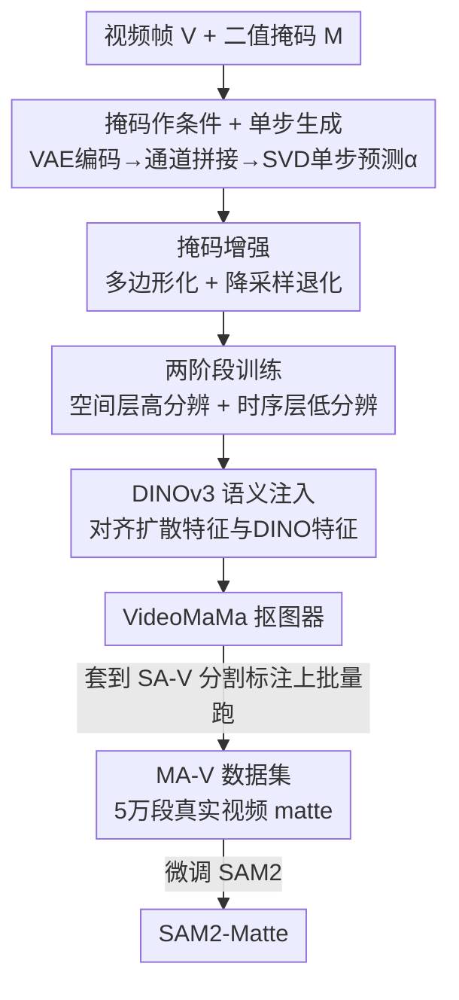

# VideoMaMa: Mask-Guided Video Matting via Generative Prior

**会议**: CVPR 2026  
**论文**: [CVF Open Access](https://openaccess.thecvf.com/content/CVPR2026/html/Lim_VideoMaMa_Mask-Guided_Video_Matting_via_Generative_Prior_CVPR_2026_paper.html)  
**代码**: https://cvlab-kaist.github.io/VideoMaMa （项目页）  
**领域**: 视频抠图 / 分割  
**关键词**: 视频抠图, alpha matte, 视频扩散先验, 伪标注, SAM2

## 一句话总结
VideoMaMa 用预训练视频扩散模型（SVD）把粗糙的二值分割掩码"翻译"成像素级精确的 alpha matte，仅靠合成数据训练却能零样本泛化到真实视频，并借此把 SA-V 的分割标注自动转成 5 万多段真实视频的抠图数据集 MA-V，反过来把普通 SAM2 微调成更鲁棒的抠图模型 SAM2-Matte。

## 研究背景与动机

**领域现状**：视频抠图（video matting）要从视频里逐像素地把前景"抠"出来，输出连续的不透明度 $\alpha$，是背景替换、合成、重打光等视频编辑的基础组件。现有方法分两类：无辅助方法多只做人像；trimap / mask 引导方法（MaGGIe、MatAnyone、GVM）需要额外标注或局限在特定域。

**现有痛点**：两个根本性瓶颈。一是**真实 alpha matte 标注极度稀缺**——真值 matte 通常要在绿幕棚或特殊相机阵列里采集，难以规模化，导致现有数据集几乎全是人像、几百段的量级（VM800 才 826 段）。二是**合成-真实域差**——为了凑数据，主流做法把抠出的前景合成到随机背景上，但这种合成会在光照、运动模糊、时序一致性上引入不真实的痕迹，模型一上真实视频就崩。

**核心矛盾**：要规模化真实视频抠图标注，但真值 matte 几乎拿不到；而分割掩码（二值）却很容易拿到（SAM2、SA-V 都有海量）。问题变成：能不能用"廉价的分割掩码"换"昂贵的 alpha matte"？

**切入角度**：作者借鉴 Marigold 把 Stable Diffusion 微调成深度估计器、只用合成数据就零样本泛化的经验——扩散模型在互联网级数据上学到的生成先验，天然懂自然场景的边界、运动模糊和时序连贯。如果把视频扩散模型当作"mask→matte 的翻译器"，它就能用先验补全掩码里没有的发丝、半透明、动模等细节。

**核心 idea**：在预训练视频扩散模型 SVD 上做掩码引导的单步生成，把二值掩码 $M$ 转成连续 alpha matte $\alpha$；再用这个翻译器把 SA-V 的分割标注批量转成抠图标注，自举出大规模真实视频抠图数据集。

## 方法详解

### 整体框架

VideoMaMa 解决的是"给定视频帧 + 一条二值掩码轨迹，输出像素级 alpha matte"。它把抠图建模成 alpha 合成方程 $I = \alpha F + (1-\alpha)B$ 的逆问题：掩码 $M\in\{0,1\}$ 只给出形状，模型负责补出 $\alpha\in[0,1]$ 里的发丝、动模、半透明等细节。整条 pipeline 是：视频帧 $V$ 和引导掩码 $M$ 各自经 VAE 编码进同一潜空间，沿通道维和高斯噪声拼接后送进改造过的 SVD U-Net，**单步**直接预测 alpha matte 的潜变量，再解码回像素空间。训练时额外注入 DINOv3 语义特征做对齐。

之所以选二值掩码作条件（而非语义类别或点/框）有两层考虑：掩码已经把"物体在哪"说清了，扩散模型可以**只专注生成细节**而不用再去推断边界，把"定位"和"抠细节"两个难题解耦；而且掩码来源广（任何分割模型都能给），模型的适用面因此被极大拓宽。

VideoMaMa 训练完不只是个抠图器，更是个**伪标注器**：把它套到 SA-V 的分割标注上批量跑，就生成了 MA-V 数据集；用 MA-V 微调 SAM2 又得到 SAM2-Matte。整个工作是"模型→数据→更强模型"的自举闭环。

### 关键设计

**1. 掩码条件下的单步扩散生成：把"抠细节"和"定位"解耦**

抠图最难的是边界细节，但物体在哪其实掩码已经告诉你了。作者把 SVD 原本的图像条件输入替换成"视频潜变量 $z_V$ + 掩码潜变量 $z_M$ + 噪声 $\varepsilon$"沿通道拼接的张量：

$$\hat{z}_\alpha = F_{\text{SVD}}\big(\text{concat}(z_V, z_M, \varepsilon)\big), \quad \hat{\alpha} = D(\hat{z}_\alpha)$$

视频帧、掩码、matte 三种模态因为空间尺寸一致，被 VAE 编码进同一潜空间统一处理。与传统扩散需要多步迭代去噪不同，VideoMaMa 用 v-参数化做**单步**生成——直接从噪声预测干净的 alpha 潜变量，一次前向就出结果。这对要给 5 万段视频批量打标注的场景至关重要：迭代去噪太慢，单步把生成成本压到能规模化的程度。形状由 $z_M$ 给定后，模型只需调用 SVD 的时序建模能力，结合 $z_V$ 的外观线索补出 matte 细节。

**2. 掩码增强：防止模型偷懒"复制粘贴"掩码**

直接拿二值掩码当条件有个隐患：对简单形状（车、桌子）或本身就含细节的掩码（二值化后的 matte），模型会发现最省事的办法是**直接把掩码抄成输出**，而不去看 RGB 推理真实的抠图细节。作者用两种增强在训练时主动"破坏"输入掩码的细节，逼模型去看图：（1）**多边形化**——用多边形逼近掩码边界，抹平轮廓里的精细结构；（2）**降采样退化**——同尺度下先降采样再上采样，去掉高频细节但保住整体形状。两者各有 weak / strong 两档。这样输入的粗掩码和目标 alpha matte 之间被人为拉开了差距，模型只能借助 RGB 视频的外观线索去生成真实细节，而不是照抄形状。

**3. 两阶段训练：空间分辨率与时序一致性的"分而治之"**

matting 是逐像素连续值任务，降分辨率会毁掉发丝级细节，但在高分辨率上直接训视频扩散模型算力又扛不住。作者把学习过程拆开：**第一阶段**冻结时序层，只在单帧高分辨率（$1024\times1024$）上训空间层，专心学像素级细节；**第二阶段**冻结已学好的空间层，只在低分辨率（$704\times704$）的 3 帧短片上训时序层，学时序连贯和运动感知。这样既拿到了高分辨细节、又拿到了时序一致性，绕开了"全程高分辨率训视频"的算力墙。有意思的是，虽然只用最多 3 帧训练，推理时却能稳定处理 1~24 帧（见消融）。

**4. DINOv3 语义注入：给生成先验补上"物体理解"**

扩散先验擅长生成精细 alpha，但对物体边界的语义理解和复杂结构（重叠物体、铰接结构）的稳定跟踪较弱。作者把冻结 DINOv3 编码器的语义特征对齐进训练：从视频帧抽 DINO 特征 $h_{\text{dino}}=F_{\text{dino}}(V)$，再从扩散模型第 $l$ 层抽中间特征 $h_l$、用可学习 MLP $p_\vartheta$ 投影到 DINO 特征空间，最大化逐 patch 余弦相似度：

$$L_{\text{reg}} = -\,\mathbb{E}\big[\text{cos-sim}(h_{\text{dino}},\, p_\vartheta(h_l))\big]$$

这让模型在保留扩散生成能力的同时获得物体类别和结构的语义理解，对重叠物体、复杂铰接结构这类难例的 matte 生成更准。消融显示加 DINO 能在两阶段基础上再降一截 MAD。

### 损失函数 / 训练策略
主损失 $L_{\text{mat}}=\mathbb{E}[\text{sim}(D(\hat{z}_\alpha), \alpha)]$ 在像素空间计算，由 **L1 损失**（保证逐像素精度）+ **Laplacian 损失**（保边界锐度和细节）组成；配合 DINO 对齐损失 $L_{\text{reg}}$。两阶段都用 batch size 64、学习率 $5\times10^{-5}$、AdamW，各训 1 万步，A100 + 混合精度。SAM2-Matte 仅需把 SAM2 mask logits 后加一个 sigmoid 把输出变成 $[0,1]$ 连续值，无需改架构，在"现有数据集 + MA-V"组合上微调。

## 实验关键数据

### 主实验

全帧掩码引导（V-HIM60 Hard / YouTubeMatte，MAD/Gradient 越低越好），VideoMaMa 在各种掩码质量下都稳定领先：

| 设置（V-HIM60 Hard, MAD↓） | 输入掩码 | MaGGIe-FT | 本文 Ours |
|------|------|------|------|
| 降采样 8× | 2.744 | 2.652 | **1.306** |
| 降采样 32× | 5.132 | 2.896 | **1.461** |
| 多边形(难) | 6.771 | 3.446 | **1.640** |
| SAM2 生成掩码 | 4.666 | 3.644 | **2.435** |

首帧掩码引导（V-HIM60 Hard，越低越好），SAM2-Matte 全面超过此前 SOTA MatAnyone：

| 方法 | MAD↓ | MAD-T↓ | MSE↓ | GRAD↓ |
|------|------|------|------|------|
| SAM2 | 7.85 | 130.0 | 6.01 | 26.34 |
| MatAnyone | 5.72 | 102.5 | 3.46 | 9.82 |
| SAM2+VideoMaMa | 2.78 | 53.4 | 1.44 | 4.83 |
| **SAM2-Matte** | **2.61** | 58.8 | **1.08** | 5.09 |

仅靠 SAM2 propagate 第一帧掩码、再用 VideoMaMa 精修，就把 MAD 从 7.85（SAM2 原始）压到 2.78，验证了 VideoMaMa 作为伪标注器/精修器的威力。

### 消融实验

| 配置 | 32×降采样 MAD↓ | 多边形(难) MAD↓ | SAM2 MAD↓ |
|------|------|------|------|
| 仅空间层 S1 | 3.76 | 4.83 | 4.05（反而退化） |
| 仅时序层 S2 | 1.24 | 2.24 | 2.31 |
| S1+S2 无 DINO | 1.26 | 2.00 | 1.94 |
| **S1+S2+DINO（完整）** | **1.03** | **1.40** | **1.74** |

训练数据消融（V-HIM60 Hard / DAVIS）：

| 训练数据 | V-HIM60 MAD↓ | DAVIS J&F↑ |
|------|------|------|
| MatAnyone | 4.67 | 79.7 |
| (a) 仅现有数据集 ED | 7.58 | 77.0 |
| (b) 仅 MA-V | 3.18 | 87.9 |
| (c) ED + MA-V | **2.61** | 85.9 |

### 关键发现
- **两阶段缺一不可，DINO 锦上添花**：只训空间层（S1）在 SAM2 掩码上甚至比输入更差（-13.46%），加上时序层后大幅翻正，再加 DINO 在三种掩码上分别再降到 75.5% / 85.2% / 51.3% 的相对提升——三者互补。
- **MA-V 单独就能打**：仅用 MA-V 训练（b）在 DAVIS 跟踪上 J&F=87.9，甚至超过 ED+MA-V 组合，说明真实视频伪标注比合成数据更利于泛化；抠图精度上 ED+MA-V 组合最佳。
- **训 3 帧、测 24 帧也稳**：推理帧数从 1 到 24，MAD 几乎不变，时序泛化能力强。

## 亮点与洞察
- **"用分割换抠图"的自举闭环最妙**：分割掩码廉价、alpha matte 昂贵，作者用扩散先验当桥梁，把 SA-V 的 5 万段分割标注一键转成抠图标注，绕开了"真值 matte 拿不到"这个十年老瓶颈——这是整篇最有价值的洞察。
- **掩码增强是个可复用的反作弊 trick**：任何"输入条件和目标高度相似"的条件生成任务（如 mask→matte、低质→高质精修）都可能遇到模型抄输入的偷懒问题，主动破坏输入细节逼模型看原图，思路可直接迁移。
- **单步扩散 + 两阶段分辨率分离**：把"要高分辨细节"和"要时序一致"这对算力上互斥的需求拆成两阶段分别满足，再加单步推理压成本，是把扩散先验落到大规模标注生产上的关键工程取舍。
- **SAM2-Matte 零架构改动**：只在 mask logits 后加 sigmoid 就把分割模型变成抠图模型，证明瓶颈从来不在架构而在数据。

## 局限与展望
- 全程依赖输入二值掩码的质量与目标指定，本身不做"该抠谁"的决策；掩码错了（如 SAM2 跟丢目标）matte 也会跟着错。
- MA-V 是伪标注，质量上限受 VideoMaMa 本身约束，可能继承其在极端半透明、烟雾、玻璃等场景的系统性偏差，缺少人工真值校验的量化分析。
- VideoMaMa 推理是把 12 帧分段处理再拼接，长视频跨段的时序连贯性如何保证、会不会有段间跳变，文中未深入；超长视频的全局一致性存疑。
- 评测仍以人像为主的 benchmark（V-HIM60、YouTubeMatte）为主，虽强调多类别泛化，但非人像类的定量评测相对有限。

## 相关工作与启发
- **vs MaGGIe / MatAnyone**：它们用专门架构（掩码轨迹解耦、记忆增强传播）做掩码引导抠图，但仍局限人像、靠合成数据；本文改用通用视频扩散先验 + 真实伪标注数据，在难例和泛化上全面更优。
- **vs GVM**：GVM 也用扩散做视频抠图但专注人像发丝；VideoMaMa 不限类别、且把模型当伪标注器去造数据集，野心从"做一个抠图器"升级到"造一套数据生态"。
- **vs Marigold（扩散做感知）**：思路一脉相承——都是微调生成扩散模型做密集预测、只用合成数据零样本泛化；VideoMaMa 把这套从深度估计扩展到视频抠图，并补上了 DINO 语义注入和掩码增强两个 matting 专属设计。
- **vs ZIM**：ZIM 训练 image mask→matte 转换器但用图像数据；本文把这个范式搬到视频，并解决了视频抠图真值更稀缺的问题。

## 评分
- 新颖性: ⭐⭐⭐⭐⭐ "用扩散先验把分割掩码转抠图、自举真实视频抠图数据集"的闭环切口干净且解决真问题
- 实验充分度: ⭐⭐⭐⭐ 多掩码类型/多 benchmark/训练配方与数据双消融都到位，但非人像定量评测与伪标注质量校验略欠
- 写作质量: ⭐⭐⭐⭐⭐ 动机-方法-数据自举逻辑清晰，图表充分，设计取舍交代到位
- 价值: ⭐⭐⭐⭐⭐ MA-V（5 万段真实视频抠图）+ 即插即用的 SAM2-Matte 对视频抠图社区是实打实的数据与工具贡献

<!-- RELATED:START -->

## 相关论文

- [\[CVPR 2026\] MatAnyone 2: Scaling Video Matting via a Learned Quality Evaluator](matanyone_2_scaling_video_matting_via_a_learned_quality_evaluator.md)
- [\[CVPR 2026\] MatchMask: Mask-Centric Generative Data Augmentation for Label-Scarce Semantic Segmentation](matchmask_mask-centric_generative_data_augmentation_for_label-scarce_semantic_se.md)
- [\[CVPR 2025\] MatAnyone: Stable Video Matting with Consistent Memory Propagation](../../CVPR2025/segmentation/matanyone_stable_video_matting_with_consistent_memory_propagation.md)
- [\[CVPR 2026\] SPOT: Spatiotemporal Prompt Optimization for Motion-Stabilized MLLM-Guided Video Segmentation](spot_spatiotemporal_prompt_optimization_for_motion-stabilized_mllm-guided_video_.md)
- [\[CVPR 2025\] Generative Video Propagation](../../CVPR2025/segmentation/generative_video_propagation.md)

<!-- RELATED:END -->
