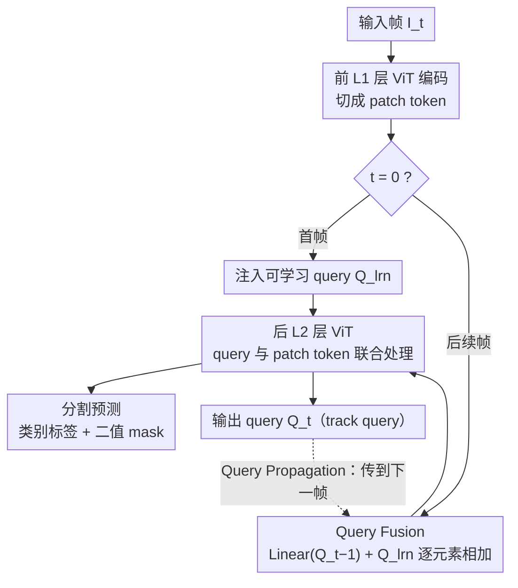

<!-- 由 src/gen_stubs.py 自动生成 -->
# VidEoMT: Your ViT is Secretly Also a Video Segmentation Model

**会议**: CVPR2026  
**arXiv**: [2602.17807](https://arxiv.org/abs/2602.17807)  
**代码**: [tue-mps.org/videomt](https://www.tue-mps.org/videomt/)  
**领域**: 视频分割 / Video Segmentation  
**关键词**: encoder-only, ViT, 视频实例分割, 视频全景分割, query propagation, query fusion, DINOv2

## 一句话总结

提出 VidEoMT，一种纯编码器（encoder-only）视频分割架构，通过 query propagation 和 query fusion 将分割与时序关联统一在单个 ViT 编码器中，在保持与 SOTA 可比精度的同时实现 5×–10× 加速（ViT-L 达 160 FPS）。

## 背景与动机

1. **现有方法过于复杂**：当前 SOTA 在线视频分割模型（如 CAVIS、DVIS++、DVIS-DAQ）将流程解耦为分割器 + 跟踪器，每一模块内部又包含大量专用组件（ViT-Adapter、Mask2Former pixel decoder、Transformer decoder、上下文感知特征、重识别层等），导致架构臃肿且推理缓慢。
2. **VFM 预训练的潜力未被充分利用**：DINOv2 等视觉基础模型已经通过大规模预训练学到了跨视角一致的特征表示，理论上足以承担实例级分割和时序跟踪双重功能，但现有方法仍在其上堆叠大量冗余组件。
3. **EoMT 在图像分割已验证 encoder-only 可行性**：EoMT 证明只需将可学习 query 注入预训练 ViT 后几层即可实现 SOTA 图像分割，无需专用解码器——这为视频领域的简化提供了直接启发。
4. **DINO 式预训练目标促进跟踪**：DINO/DINOv2 的训练目标鼓励同一物体在不同视角下具有一致特征，这恰好是跟踪所需的关键能力，使得 ViT 编码器天然适合视频分割。
5. **推理速度对视频应用至关重要**：在线视频处理要求实时或更快的推理速度，现有 SOTA（如 CAVIS 仅 15 FPS）远无法满足实际部署需求。
6. **核心研究问题**：能否移除所有专用跟踪模块，让一个足够大的预训练 ViT 编码器同时完成分割和时序关联？

## 方法详解

### 整体框架

VidEoMT 的出发点是：现在的在线视频分割 SOTA（CAVIS、DVIS++、DVIS-DAQ）都把流程拆成「分割器 + 跟踪器」，每块里再堆一大堆专用组件，臃肿又慢。它沿用 EoMT 的 encoder-only 范式，把可学习 query 直接注入预训练 ViT 编码器的最后 L₂ 层、和 patch token 一起处理；真正的新东西是 query propagation 和 query fusion 两个轻量机制，让时序关联在编码器内部就完成，彻底省掉独立跟踪器，新增参数只有 2M。具体到每帧：输入帧先过前 L₁ 层 ViT 切成 patch token；首帧（$t=0$）注入可学习 query 走标准 EoMT，后续帧（$t>0$）则把上一帧传过来的输出 query 与可学习 query 经 query fusion 合并后再注入；后 L₂ 层把 query 与 patch token 联合处理，输出分割预测和供下一帧使用的输出 query。

### 关键设计

**1. Query Propagation：用上一帧的输出 query 当这一帧的输入**

要在 encoder-only 框架里做跟踪，最直接的办法是让 query 跨帧传递身份。首帧 $t=0$ 走标准 EoMT：可学习 query $Q^{\text{lrn}}$ 注入 ViT 最后 L₂ 层，产出 object query $Q_0^S$ 和分割预测。后续帧 $t>0$ 不再用可学习 query，而是把上一帧的输出 query $Q_{t-1}^S$ 直接当输入——零额外计算就把同一物体的身份带了过来。但它有个副作用：帧数一多，可学习 query 的影响被稀释，模型慢慢认不出新出现的物体。

**2. Query Fusion：把传播 query 和可学习 query 加在一起**

为了补上「认不出新物体」的漏洞，query fusion 用一步极轻的融合：
$$\mathbf{Q}_t^{\mathcal{F}} = \text{Linear}(\mathbf{Q}_{t-1}^{\mathcal{S}}) + \mathbf{Q}^{\text{lrn}}$$
上一帧 query 过一个线性层后，与可学习 query 逐元素相加。这样传播 query 负责时序连续性、可学习 query 负责对新物体的感知，两者相加取得平衡；再配合让 query 顺序跨帧一致的监督策略，这个逐元素加法才成立。正是这一步把退化成逐帧 EoMT 后骤降的 AP 从 63.9 拉回 68.6。

### 一个完整示例：从 CAVIS 一步步拆到 VidEoMT

VidEoMT 的设计是被「逐个删模块、看精度和速度怎么变」逼出来的，整条路径很能说明每个组件到底有没有用：

1. 先把 CAVIS 的 ViT-Adapter + Mask2Former 分割器换成 EoMT——FPS 从 15 蹿到 42，AP 只掉 0.8；
2. 删掉上下文感知特征（Laplacian 边界 + 平均滤波池化）——FPS 到 72，AP 不降反升；
3. 删掉重识别层（对比学习 MLP）——FPS 到 74，AP 基本持平；
4. 再删跟踪器、退化成逐帧 EoMT——FPS 飙到 162，但 AP 骤降 7.6 到 61.3；
5. 加回 Query Propagation——AP 回到 63.9，FPS 保持 162；
6. 再加 Query Fusion，就是完整的 VidEoMT——AP 68.6、FPS 160。

一删一加之间能看清：那些专用组件几乎都是冗余的，唯独时序关联不能丢，而它用 2M 参数的 propagation + fusion 就补回来了。

### 损失函数 / 训练策略

损失与 Mask2Former 一致：分类用交叉熵、分割用 BCE + Dice。GT 匹配沿用 DVIS++ 的时序一致策略——物体只在首次出现帧做匈牙利匹配，后续帧保持 query 对应关系。优化器 AdamW，lr=1e-4，层级学习率衰减（LLRD）因子 0.6，多项式 lr 衰减（power=0.9）。

## 实验关键数据

### 主结果：YouTube-VIS 2019 val（VIS）

| 方法 | Backbone | AP | GFLOPs | FPS |
|------|----------|-----|--------|-----|
| CAVIS | ViT-L/DINOv2 | **68.9** | 838 | 15 |
| DVIS-DAQ | ViT-L/DINOv2 | 68.3 | 851 | 10 |
| DVIS++ | ViT-L/DINOv2 | 67.7 | 846 | 18 |
| **VidEoMT** | ViT-L/DINOv2 | 68.6 | **566** | **160** |

### 跨任务泛化

| 任务/数据集 | VidEoMT 指标 | CAVIS 指标 | VidEoMT FPS | CAVIS FPS |
|-------------|-------------|-----------|-------------|-----------|
| VPS / VIPSeg | VPQ=55.2 | VPQ=56.9 | **75** | 10 |
| VSS / VSPW | mIoU=**64.9** | — | **73** | — |
| VIS / OVIS | AP=52.5 | AP=**53.2** | **115** | 15 |
| VIS / YT-VIS 2022 | AP=**42.6** | AP=39.5 | **161** | 15 |

### 消融实验：渐进式模块移除

| 步骤 | 变更 | AP | FPS |
|------|------|-----|-----|
| (0) CAVIS 基线 | — | 68.9 | 15 |
| (1) 替换分割器为 EoMT | ↓0.8 | 42 |
| (2) 去上下文感知特征 | 68.4 | 72 |
| (3) 去重识别层 | 68.0 | 74 |
| (4) 去跟踪器 = EoMT | 61.3 | 162 |
| (5) + Query Propagation | 63.9 | 162 |
| (6) + Query Fusion = VidEoMT | **68.6** | **160** |

### 预训练与模型规模影响

- **预训练**：DINOv2/DINOv3 下 VidEoMT 与 CAVIS 差距仅 0.3 AP；IN1K 下差距扩大至 2.7 AP → 大规模预训练是关键
- **模型规模**：ViT-L 差距 0.3 AP → ViT-B 差距 1.3 AP → ViT-S 差距 2.7 AP，但 VidEoMT ViT-L (160 FPS) 比 CAVIS ViT-S (19 FPS) 快 8× 且精度高 13+ AP

## 亮点

1. **极致简洁**：将视频分割从复杂的分割器+跟踪器多模块流水线简化为单个 ViT encoder + 轻量 query fusion，新增参数仅 2M
2. **数量级加速**：ViT-L 达 160 FPS，相比 CAVIS 快 10×+，得益于纯 Transformer 可充分利用 FlashAttention 和 torch.compile 等硬件/软件优化
3. **渐进式验证假设**：通过 6 步消融清晰展示每个专用组件的冗余性，实验设计令人信服
4. **跨任务通用**：VIS、VPS、VSS 三大任务/六个基准均表现优异，尤其在 VSPW VSS 上超越所有已有方法

## 局限与展望

1. **依赖大规模预训练**：在 IN1K 等小规模预训练下精度明显下降（与 CAVIS 差 2.7 AP），对 VFM 有强依赖
2. **小模型效果下降**：ViT-S 上差距达 2.7 AP，encoder-only 范式在小模型下优势减弱
3. **VIPSeg 上有差距**：VPS 任务上 VPQ 落后 CAVIS 1.7、DVIS-DAQ 2.2，全景场景下跟踪能力仍有提升空间
4. **OVIS 挑战性场景**：在遮挡严重的 OVIS 数据集上落后 DVIS-DAQ 1.8 AP，极端遮挡下纯 query 传播可能不够
5. **仅限在线模式**：未探索离线/半在线模式下利用未来帧信息的可能性
6. **query fusion 仅用单帧历史**：仅传播上一帧 query，未尝试多帧聚合或记忆机制

## 与相关工作的对比

- **EoMT**：VidEoMT 的直接前身，仅支持图像分割；VidEoMT 通过 query propagation + fusion 将其扩展到视频领域，AP 从 61.3 恢复至 68.6
- **CAVIS**：当前 VIS SOTA，包含 ViT-Adapter、Mask2Former decoder、上下文感知特征、重识别层、Transformer 跟踪器等大量组件；VidEoMT 移除所有这些组件仍保持可比精度
- **DVIS / DVIS++ / DVIS-DAQ**：同为解耦式分割+跟踪范式，VidEoMT 在多数基准上精度相当或更优，速度快 5×–14×
- **MinVIS**：也追求简洁高效，但仍使用 Swin-L + Mask2Former decoder；VidEoMT 更简洁且更快更准
- **TrackFormer**：在检测+跟踪中使用 query propagation，VidEoMT 将此思路迁移到 encoder-only 分割框架并加入 query fusion 改进

## 评分

- 新颖性: ⭐⭐⭐⭐ — encoder-only 视频分割思路新颖，渐进式模块移除的验证方式很有说服力
- 实验充分度: ⭐⭐⭐⭐⭐ — 6 个基准、3 个任务、详尽消融、预训练/模型规模分析，非常全面
- 写作质量: ⭐⭐⭐⭐⭐ — 逻辑清晰，假设-验证-结论的叙事结构，图表设计优秀
- 价值: ⭐⭐⭐⭐ — 10× 加速的实际意义巨大，为实时视频分割部署提供了可行方案

<!-- RELATED:START -->

## 相关论文

- [\[CVPR 2025\] Your ViT is Secretly an Image Segmentation Model](../../CVPR2025/segmentation/your_vit_is_secretly_an_image_segmentation_model.md)
- [\[ICLR 2026\] TRACE: Your Diffusion Model is Secretly an Instance Edge Detector](../../ICLR2026/segmentation/trace_your_diffusion_model_is_secretly_an_instance_edge_detector.md)
- [\[CVPR 2026\] Towards Streaming Referring Video Segmentation via Large Language Model](towards_streaming_referring_video_segmentation_via_large_language_model.md)
- [\[CVPR 2026\] RobotSeg: A Model and Dataset for Segmenting Robots in Image and Video](robotseg_a_model_and_dataset_for_segmenting_robots_in_image_and_video.md)
- [\[CVPR 2026\] SPAR: Single-Pass Any-Resolution ViT for Open-Vocabulary Segmentation](spar_single-pass_any-resolution_vit_for_open-vocabulary_segmentation.md)

<!-- RELATED:END -->
