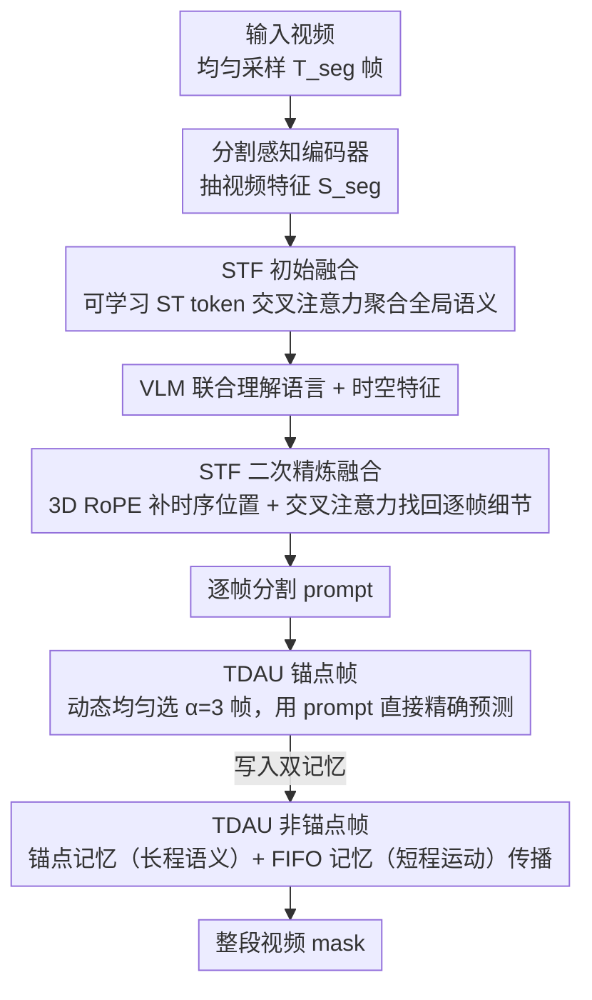

# VIRST: Video-Instructed Reasoning Assistant for SpatioTemporal Segmentation

**会议**: CVPR 2026  
**arXiv**: [2603.27060](https://arxiv.org/abs/2603.27060)  
**代码**: [https://github.com/AIDASLab/VIRST](https://github.com/AIDASLab/VIRST)  
**领域**: 分割  
**关键词**: 视频目标分割、RVOS、视觉语言模型、时空融合、动态锚点、推理分割

## 一句话总结

VIRST 提出端到端框架将全局视频推理和像素级 mask 预测统一在单个视觉语言模型中，通过时空融合（STF）和时序动态锚点更新器（TDAU）实现时空一致的视频分割，在 ReVOS 上 J&F 达 70.8（+7.5 over SOTA），MeViS 62.9（+9.2），同时推理速度 5.1 FPS（比 VRS-HQ 快 1.3 倍）。

## 研究背景与动机

1. **领域现状**：Referring Video Object Segmentation (RVOS) 需要根据语言描述在视频中分割目标对象。近年来基于 VLM 的方法（VISA、VRS-HQ、HyperSeg）通过将分割解码器接入大语言模型取得了显著进展。
2. **现有痛点**：(1) 关键帧方法只在少数帧上预测 mask 然后传播，但遇到遮挡或外观变化时传播会漂移；(2) 全帧预测方法内存消耗巨大且无法处理长视频；(3) 现有 VLM 分割模型的视频特征和语义特征融合不充分。
3. **核心矛盾**：需要既能"理解"复杂语言推理（如"左边跳舞时间最长的人"）又能"精确"地逐帧分割——前者需要全局视频理解，后者需要逐帧像素级精度。
4. **本文目标**：在单个模型中统一全局语义推理和局部时空分割。
5. **切入角度**：关键帧（锚点）机制——不在所有帧上做完整预测，而是在动态选择的锚点帧上做精确预测，然后通过 SAM2 的记忆机制传播到其他帧。
6. **核心 idea**：两阶段时空融合（STF）将分割感知视频特征注入 VLM 的语义空间；时序动态锚点更新器（TDAU）在锚点帧做直接预测、非锚点帧用混合记忆做传播。

## 方法详解

### 整体框架

VIRST 要在一个模型里同时解决两件原本互相拖后腿的事：既要"读懂"像"左边跳舞时间最长的人"这种需要全局视频推理的描述，又要在每一帧上给出像素级精确的 mask。它的做法是把全局语义推理和局部时空分割拧进同一个 VLM。一段视频先均匀采样 $T_{seg}$ 帧，由分割感知编码器抽出视频特征 $S_{seg}$；STF（时空融合）分两步把这些分割特征注入 VLM 的语义空间，让 VLM 在理解语言的同时也"看得到"逐帧的时空细节，并为每一帧吐出一个分割 prompt；最后 TDAU（时序动态锚点更新器）只在少数动态选出的锚点帧上做直接预测，其余帧靠 SAM2 的记忆机制传播，拼出整段视频的 mask。这样既不必在每帧上跑昂贵的完整预测，又能让推理结果驱动分割。

> 三阶段渐进训练（设计 3）是贯穿整套 pipeline 的训练策略，不是单独的数据流阶段，故未画进上图。

### 关键设计

**1. 时空融合 STF：把分割特征注入 VLM 的语义空间，并补回逐帧细节**

痛点在于，现有 VLM 分割模型常常只把视频特征做一次性融合塞给大模型，结果 VLM 拿到的是被压扁的全局语义，丢掉了逐帧的时空细节，复杂运动描述就容易分错。STF 改成两阶段。初始融合阶段用一组可学习的 [ST] token 通过交叉注意力把视频特征聚合进来，$F_{Init} = \text{CrossAttn}(E_{ST}, S_{down})$，让 VLM 先获得全局语义。VLM 处理之后再进二次精炼融合：先用 3D RoPE 给特征补上时序位置信息，再做一次交叉注意力，$\tilde{F}_{ST} = \text{CrossAttn}(F'_{ST}, S'_{down})$，把每一帧各自的时空细节"找回来"，最终得到逐帧的分割 prompt。之所以分两步有效，是因为第一步负责"懂语义"、第二步负责"对得上每帧"，两者职责不同；消融里两阶段融合比单阶段高 3.5 J&F，用 MLP 替代二次融合则掉到 59.4，说明精炼这一步不能省。

**2. 时序动态锚点更新器 TDAU：少数锚点帧精确预测、其余帧靠双记忆传播**

逐帧都做完整预测内存撑不住、长视频更不可控，但纯靠传播又会在遮挡或外观突变处一路漂移。TDAU 在这两个极端之间折中：均匀选出 $\alpha=3$ 个锚点帧，直接用 STF 给的 prompt 做精确 mask 预测，作为可靠的"参考点"；非锚点帧则不重新理解语义，而是走一套双记忆系统——锚点记忆存最近 $\alpha$ 个锚点的编码，提供语义稳定的长程参照；FIFO 记忆存最近 $P$ 帧的编码，提供短程的运动连续性，两者混合后送进 SAM2 解码器预测 mask。举个具体的传播过程：第 1 帧是锚点，直接出 mask 并写入两套记忆；往后的非锚点帧每来一帧，就从锚点记忆里取语义参照、从 FIFO 取上一帧的运动线索做传播，直到遇到下一个锚点帧再用 prompt 重新校准一次，避免误差累积。正因为锚点是"动态均匀"选出而非固定首帧，遮挡后还能靠后续锚点把目标拉回来；消融里动态锚点比首帧锚点高 5.0 J&F，比 CLIP 引导选择（59.3）也更好，而锚点数从 3 加到 8 仅提升 0.3，说明 3 个锚点已接近饱和。

**3. 三阶段渐进训练：从图像级到视频级逐步解冻，稳住稀疏的视频监督**

直接端到端训练这套系统并不稳定，因为视频级别的损失信号太稀疏，一上来就让所有模块一起动很容易训崩。于是训练拆成三步逐渐放开：Stage 1 冻住 SAM2，只训 STF 和 LoRA，先把分割特征和 VLM 语义空间对齐；Stage 2 解冻 mask 解码器和记忆模块，用少量图像预测把分割头练起来；Stage 3 才全解冻，做真正的锚点传播训练。这条"先对齐、再分割、最后传播"的路径让每一步都有相对密集的监督，最后才把难度最大的视频传播放到模型已经稳定之后。消融印证了这点：完整三阶段在 MeViS 达 72.6，跳过 Stage 1 的对齐损失只剩 65.8，差出 6.8 J&F。

### 损失函数 / 训练策略

$L_{total} = \lambda_{bce} L_{bce} + \lambda_{dice} L_{dice} + \lambda_{token} L_{token} + \lambda_{occ} L_{occ} + \lambda_{iou} L_{iou}$，各 $\lambda$ 分别为 1.0, 1.0, 1.0, 0.05, 0.05。bfloat16 训练，micro-batch 1，16 步梯度累积。8×H100 GPU，3 天。

## 实验关键数据

### 主实验

| 方法 | ReVOS-Ref J&F | ReVOS-Reason J&F | MeViS J&F | Ref-DAVIS17 J&F |
|------|--------------|-------------------|-----------|-----------------|
| VISA-13B | 57.4 | 44.3 | 44.5 | 70.4 |
| HyperSeg | 58.5 | 53.0 | - | - |
| VRS-HQ-13B | 63.3 | 56.8 | 50.9 | 76.0 |
| RGA3-7B | 60.5 | 55.4 | - | - |
| **VIRST** | **70.8** | **66.1** | **62.9** | **79.5** |

### 消融实验

| 配置 | MeViS J&F | 说明 |
|------|-----------|------|
| 仅初始 ST-Fusion | 59.7 | 缺乏逐帧精炼 |
| w/o 二次 ST-Fusion (MLP) | 59.4 | MLP 替代效果差 |
| **两阶段 STF** | **62.9** | 完整设计 |
| 首帧锚点 | 57.9 | -5.0 vs 动态 |
| CLIP 引导选择 | 59.3 | 不如均匀采样 |
| **动态锚点** | **62.9** | 最优 |
| 训练 Stage 1+2+3 | 72.6 | 完整渐进训练 |
| 训练 Stage 2+3 | 65.8 | 跳过对齐损失 6.8 |

### 关键发现

- ReVOS Reasoning 任务提升最大（+9.3 vs VRS-HQ），说明 STF 的两阶段融合对复杂推理查询特别有帮助
- 推理速度 5.1 FPS，比 VRS-HQ 的 3.81 FPS 快 34%，且精度大幅领先
- 图像分割也达 SOTA（RefCOCO testA 90.7），证明视频能力没有损害图像性能
- 三阶段训练中 Stage 3（传播训练）贡献最大（+8.2 J&F），是视频性能的关键

## 亮点与洞察

- **统一推理与分割的端到端设计**：不需要独立的"先理解再分割"两步，VLM 直接输出分割 prompt，消除了中间信息瓶颈
- **动态锚点 > 固定锚点**：均匀采样 3 个锚点就能达到几乎最优效果（vs α=8 仅差 0.3），极大降低了复杂度
- **三阶段渐进训练的工程价值**：从图像到视频的渐进解冻策略可迁移到其他视频 VLM 任务

## 局限与展望

- 在有大量视觉相似干扰物的场景中仍容易出错
- 需要多步语义推理的查询（如计数特定属性）表现不佳
- 持续遮挡下 mask 仍会逐渐漂移，锚点机制只能缓解但不能根治
- 超长视频（>10 分钟）受内存限制
- 细粒度部位分割（如手指）性能有限

## 相关工作与启发

- **vs VISA/VRS-HQ**: 关键帧传播方案在遮挡场景下漂移严重。VIRST 通过 TDAU 的双记忆机制大幅提升鲁棒性
- **vs SAM2**: VIRST 可视为 SAM2 的视频语言扩展——保留了 SAM2 的高效传播机制，但增加了 VLM 的语义理解能力
- **vs VideoGLaMM**: VideoGLaMM 缺乏时空融合，在复杂运动描述（MeViS）上差距明显（45.2 vs 62.9）

## 评分

- 新颖性: ⭐⭐⭐⭐ STF双阶段融合和TDAU锚点策略有设计巧思
- 实验充分度: ⭐⭐⭐⭐⭐ 6+RVOS benchmark+图像分割+详细消融+效率分析
- 写作质量: ⭐⭐⭐⭐ 方法描述清晰，实验全面
- 价值: ⭐⭐⭐⭐⭐ RVOS领域大幅度SOTA+开源+实用速度

<!-- RELATED:START -->

## 相关论文

- [\[CVPR 2026\] SPOT: Spatiotemporal Prompt Optimization for Motion-Stabilized MLLM-Guided Video Segmentation](spot_spatiotemporal_prompt_optimization_for_motion-stabilized_mllm-guided_video_.md)
- [\[CVPR 2026\] Fast Reasoning Segmentation for Images and Videos](fast_reasoning_segmentation_for_images_and_videos.md)
- [\[CVPR 2026\] SegCompass: Exploring Interpretable Alignment with Sparse Autoencoders for Enhanced Reasoning Segmentation](segcompass_exploring_interpretable_alignment_with_sparse_autoencoders_for_enhanc.md)
- [\[CVPR 2026\] DPAD: Discriminative Perception via Anchored Description for Reasoning Segmentation](discriminative_perception_via_anchored_description_for_reasoning_segmentation.md)
- [\[CVPR 2026\] Efficient Video Object Segmentation and Tracking with Recurrent Dynamic Submodel](efficient_video_object_segmentation_and_tracking_with_recurrent_dynamic_submodel.md)

<!-- RELATED:END -->
