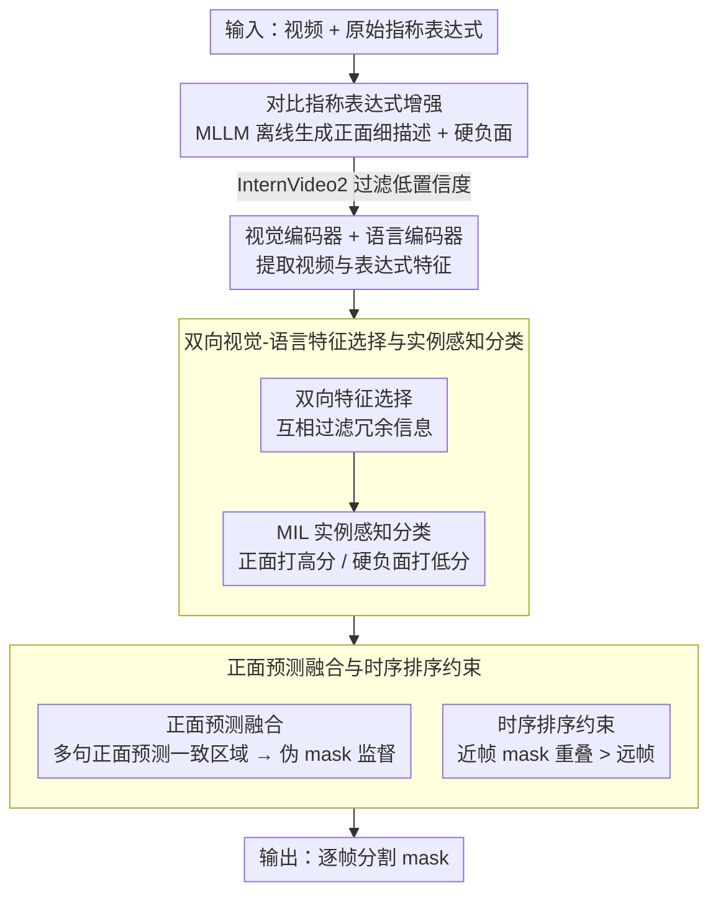

# Weakly-Supervised Referring Video Object Segmentation through Text Supervision

**会议**: CVPR 2026 Findings  
**arXiv**: [2604.17797](https://arxiv.org/abs/2604.17797)  
**代码**: [https://github.com/viscom-tongji/WSRVOS](https://github.com/viscom-tongji/WSRVOS)  
**领域**: 分割  
**关键词**: 弱监督, 视频目标分割, 指称表达, 文本监督, 多模态对齐

## 一句话总结

提出 WSRVOS，首个仅使用文本表达式作为监督信号的弱监督指称视频目标分割框架，通过 MLLM 驱动的对比表达式增强、双向视觉-语言特征选择、实例感知表达式分类和时序分段排序约束，显著减少了对像素级标注的依赖。

## 研究背景与动机

**领域现状**：指称视频目标分割（RVOS）根据文本表达式在视频中分割目标实例。主流方法（如 ReferFormer、SAMWISE）依赖像素级 mask 标注进行监督学习，效果出色但标注成本极高。

**现有痛点**：弱监督 RVOS 的探索刚起步——已有工作如 WRVOS 使用首帧 mask + 后续帧 bbox，OCPG 使用 bbox/point 标注生成伪 mask。但 bbox 和 point 标注仍需大量逐帧人工标注，在长视频中依然成本不菲。

**核心矛盾**：如何在不提供任何空间标注（mask、bbox、point）的前提下，仅通过文本表达式让模型学会定位和分割视频中的目标实例？挑战在于：(1) 视觉和语言特征的异质性使语义对齐困难；(2) 视频的时序动态和遮挡进一步复杂化对齐过程。

**本文目标**：设计端到端的弱监督 RVOS 框架，训练时仅使用文本表达式作为监督信号，无需任何空间标注。

**切入角度**：多模态大语言模型（MLLM）如 Qwen3-VL 的字幕生成能力可以为视频生成丰富的正负文本描述，提供远超原始简短表达式的监督信号。通过对比学习让模型区分正确和错误的描述，间接学习定位能力。

**核心 idea**：用 MLLM 生成对比表达式增强数据（正面丰富描述 + 硬负面描述），通过实例感知分类和伪 mask 融合来训练分割模型，全程不使用空间标注。

## 方法详解

### 整体框架

WSRVOS 想回答一个看似不可能的问题：训练时一张 mask、一个 bbox、一个 point 都不给，只给一句指称文本，模型能不能学会在视频里把目标抠出来？它的破题点是把"弱"监督换成"富"监督——离线用 MLLM 把原本干巴巴的一句指称扩成一组正面细描述和一组硬负面描述，然后让模型学会区分"哪句描述真的对应视频里的目标"。一旦模型能可靠地把正面描述匹配到正确的视觉区域，就反过来把多句正面描述各自的预测融合成伪 mask，给分割头补上原本缺失的空间监督，再叠一条时序约束保证帧间平滑。整条链路是"文本增强 → 双向特征对齐与分类 → 伪 mask 自监督 → 时序正则"，全程不碰任何人工空间标注。

### 关键设计

**1. 对比指称表达式增强：把一句话的指称扩成正负对照的丰富监督**

原始 RVOS 数据集的表达式往往只有"穿红衣的人"这种几个词，语义稀薄，既不够训练对齐、也无法逼模型学到判别性。这里离线请 Qwen3-VL 出马：给它视频和原始表达式，让它生成 $P$ 个更细的正面描述，覆盖外观、动作、交互关系等细节；再用 InternVideo2 算视频-文本相似度，把置信度过低（$c^k < 0.8$）的描述过滤掉，剩下的与原始表达式拼接以保留原意。负面那一侧则让 Qwen3-VL 故意篡改目标的类别、属性或动作，造出一批"语义上似是而非、但其实指向别的实例"的硬负面。正面提供更密的对齐信号，硬负面则把决策边界顶到细处——模型不能靠"大概是个人"蒙混，必须分清是不是那个穿红衣、正在跑的人。关键是 MLLM 只在数据预处理阶段用一次，推理时完全不在场，所以不增加在线成本。

**2. 双向视觉-语言特征选择与实例感知分类：先把无关信息删掉再做对齐**

视频里绝大部分像素和指称无关，文本里也夹着介词、冠词这类非信息词，直接对齐等于在噪声里找对应。这一步先做双向选择：在视觉和语言两侧各自挑出彼此高度相关的特征子集，互相过滤掉冗余，留下精简且对齐友好的表示。在这之上套一个 Multiple Instance Learning 的框架做 proposal 聚合与表达式匹配——把视频中的候选实例当作一个 bag，让模型学会给正面表达式打高分、给硬负面打低分。因为没有 mask 监督，分类这条信号实际承担了"教模型定位"的任务：能稳定区分正负文本，就意味着它已经隐式找对了视觉证据所在的实例。

**3. 正面预测融合与时序排序约束：用预测的一致性造伪 mask，用时间连续性兜底**

光有分类损失，定位还是糊的——它告诉模型"是这个实例"，却没说"边界在哪"。作者的巧思是：如果模型对同一目标的多句正面描述给出的预测高度一致，那这些被反复命中的区域大概率就是真实目标，于是把多个正面表达式的预测融合成一张伪 mask，反过来当空间监督喂给分割头，把模糊的分类信号蒸馏成像素级目标。时序这一侧则用一条排序约束利用视频的连续性先验：时间上更近的帧，其 mask 重叠应当更高，即

$$\text{IoU}(m_t, m_{t+\delta_1}) > \text{IoU}(m_t, m_{t+\delta_2}) \quad \text{当} \ \delta_1 < \delta_2$$

它不要求精确的帧间 mask 传播，只施加"近帧更像"的软约束，既鼓励时序平滑、又避免引入额外的跟踪误差。

### 损失函数 / 训练策略

训练目标由三部分叠加：实例感知表达式分类损失负责区分正负文本（隐式监督定位）、伪 mask 监督损失提供像素级空间约束、时序分段排序损失维持帧间一致性。MLLM 与 InternVideo2 都只在数据预处理时离线参与，训练和推理阶段不依赖它们。

## 实验关键数据

### 主实验

| 数据集 | 指标 | WSRVOS(本文) | OCPG(点监督) | 差距 |
|--------|------|-------------|-------------|------|
| A2D-Sentences | mAP | 最优 | 基线 | 显著超越 |
| J-HMDB Sentences | J&F | 最优 | 基线 | 显著超越 |
| Ref-YouTube-VOS | J&F | 最优 | 基线 | 显著超越 |
| Ref-DAVIS17 | J&F | 最优 | 基线 | 显著超越 |

### 消融实验

| 配置 | 性能变化 | 说明 |
|------|---------|------|
| Full WSRVOS | 最优 | 完整模型 |
| w/o 对比表达式增强 | 下降 | 监督信号不够丰富 |
| w/o 双向特征选择 | 下降 | 对齐精度降低 |
| w/o 正面预测融合 | 下降 | 缺少空间监督信号 |
| w/o 时序排序约束 | 下降 | 时序一致性变差 |

### 关键发现

- 仅用文本监督的 WSRVOS 超越了使用 bbox/point 标注的弱监督方法 OCPG，说明丰富的文本监督信号比稀疏的空间标注更有效
- 对比表达式增强的贡献最大——硬负面的区分性和正面的丰富性都很重要
- 时序排序约束在长视频上效果更明显，短视频中相邻帧差异小故贡献有限

## 亮点与洞察

- "无需任何空间标注"的设定在 RVOS 领域是一个重大跨步。利用 MLLM 的描述能力将文本从"弱监督"变为"丰富监督"，这个思路非常有前瞻性
- 正面预测融合策略巧妙：如果模型对多个正确描述的预测高度一致，那么这些区域大概率就是目标——用"预测的一致性"作为伪标签的可靠性度量
- 时序排序约束的设计简洁且有效，不需要精确的帧间 mask 传播，只需要"近帧更相似"的软约束

## 局限与展望

- 依赖 MLLM (Qwen3-VL) 生成表达式的质量，如果 MLLM 对视频理解有误会引入噪声
- InternVideo2 的过滤阈值 0.8 是手工设定的，对不同域可能需要调整
- 在目标实例小或高度遮挡的场景中，纯文本监督的定位能力可能不足
- 未来可探索自适应的表达式生成和过滤策略，或结合视觉 grounding 预训练增强定位

## 相关工作与启发

- **vs WRVOS**: 需要首帧 mask + bbox，WSRVOS 完全不需要空间标注
- **vs OCPG**: 使用 bbox/point 生成伪 mask，但 WSRVOS 仅用文本反而性能更好
- **vs TRIS/PCNet (图像级)**: 图像级弱监督指称分割方法，WSRVOS 扩展到更困难的视频场景

## 评分

- 新颖性: ⭐⭐⭐⭐⭐ 首个纯文本监督的 RVOS 方法，范式创新
- 实验充分度: ⭐⭐⭐⭐ 四个数据集验证，消融全面
- 写作质量: ⭐⭐⭐⭐ 问题定义清晰，方法描述系统
- 价值: ⭐⭐⭐⭐⭐ 大幅降低 RVOS 的标注成本，实用价值极高

<!-- RELATED:START -->

## 相关论文

- [\[CVPR 2026\] Rethinking Box Supervision: Bias-Free Weakly Supervised Medical Segmentation](rethinking_box_supervision_bias-free_weakly_supervised_medical_segmentation.md)
- [\[CVPR 2026\] FCL-COD: Weakly Supervised Camouflaged Object Detection with Frequency-aware and Contrastive Learning](fcl-cod_weakly_supervised_camouflaged_object_detection_with_frequency-aware_and_.md)
- [\[CVPR 2026\] InterRVOS: Interaction-Aware Referring Video Object Segmentation](interrvos_interaction-aware_referring_video_object_segmentation.md)
- [\[CVPR 2026\] Beyond Text: Visual Description Assembly by Probabilistic Model for CLIP-based Weakly Supervised Semantic Segmentation](beyond_text_visual_description_assembly_by_probabilistic_model_for_clip-based_we.md)
- [\[CVPR 2026\] Frequency-Aware Affinity for Weakly Supervised Semantic Segmentation](frequency-aware_affinity_for_weakly_supervised_semantic_segmentation.md)

<!-- RELATED:END -->
