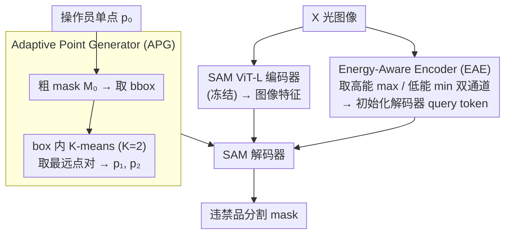

# XSeg: A Large-scale X-ray Contraband Segmentation Benchmark for Real-World Security Screening

**会议**: CVPR 2026  
**arXiv**: [2604.03706](https://arxiv.org/abs/2604.03706)  
**代码**: 无  
**领域**: 语义分割
**关键词**: X光违禁品分割、安检数据集、SAM适配、双能量编码器、自适应点提示

## 一句话总结

本文构建了目前最大的 X 光违禁品分割数据集 XSeg（98,644 张图像、295,932 个实例 mask、30 个细粒度类别），并提出域特化模型 APSAM，通过 Energy-Aware Encoder 利用 X 光双能量物理特性 + Adaptive Point Generator 智能扩展用户点击提示，mIoU 达 72.83%，比 SAM 微调高 4.96%。

## 研究背景与动机

1. **领域现状**：X 光安检图像的违禁品检测是机场、地铁、物流中心的核心安全需求。现有 X 光数据集（SIXray、PIXray、PIDray）规模小（<5 万张）、类别少（<15 类）、且主要提供检测框而非分割 mask。
2. **现有痛点**：(1) 数据匮乏——最大的 PIDray 也只有 47K 图像且只覆盖 12 类；(2) SAM 等通用分割模型在 X 光域迁移效果差——X 光的色域、纹理与自然图像差异巨大；(3) 单点提示在复杂重叠场景下不够信息化——安检图像中物品高度重叠。
3. **核心矛盾**：X 光安检的精确分割需要大规模高质量标注数据和域适配的分割方法，但两者都严重不足。
4. **本文目标**：同时解决数据和方法两个瓶颈——构建大规模分割 benchmark + 设计域特化的 SAM 适配方案。
5. **切入角度**：X 光成像的物理特性提供了独特信号——双能量通道（高能/低能）可以区分不同材质，这是 RGB 图像不具备的领域先验。
6. **核心 idea**：EAE 利用 X 光 max/min 通道提取双能量特征初始化解码器；APG 将用户单点扩展为两个信息化提示点。

## 方法详解

### 整体框架

这篇论文要同时补两块短板：X 光违禁品分割缺大规模数据，且 SAM 这类通用分割模型直接搬到 X 光上效果很差。数据侧产出 XSeg 数据集，方法侧提出域特化模型 APSAM——核心是把 SAM 冻住，只往里塞两个轻量模块，让它学会"读懂 X 光"和"用好用户的一次点击"。

推理时整条链路是这样转的：X 光图像先过 SAM 的 ViT-L 编码器拿到图像特征，同时 EAE 从图像里抽出双能量物理先验、用它初始化解码器的 query token；操作员在目标上点一下得到 $p_0$，APG 据此先估一个粗 mask，再从中挑出两个更有代表性的点 $(p_1, p_2)$ 替换掉单点；最后 SAM 解码器拿着增强后的提示和被物理先验初始化过的 token 预测最终 mask。（XSeg 数据集是离线的数据侧贡献，为这条推理链路提供训练与评测基座，见关键设计 3。）

### 关键设计

**1. Energy-Aware Encoder (EAE)：把 X 光的双能量物理信号灌进解码器初始化**

SAM 在自然图像上预训练，它的解码器 query 是随机初始化的，对 X 光这种色域、纹理都迥异的图像没有任何先验。EAE 的切入点是 X 光成像本身的物理特性：图像的三个通道其实编码了不同能量级别的透射信息，金属、塑料、有机物在高能和低能下的衰减差异很大，这正是 RGB 自然图像不具备的材质线索。EAE 先用逐像素取极值的方式抽出高能通道 $I_H = \max_c I(\cdot,\cdot,c)$ 和低能通道 $I_L = \min_c I(\cdot,\cdot,c)$，拼接后过三层 Conv+LayerNorm+GELU+MaxPool 编码，再用 channel-wise attention 加 top-k 特征选择生成一组初始化 query，替代 SAM 原本的随机 token。这样解码器一开始就带着"哪里是金属、哪里是有机物"的判断进场，消融里它单独贡献 +3.02 mIoU。

**2. Adaptive Point Generator (APG)：把操作员的一次点击自动扩展成两个信息更足的提示点**

安检场景里物品高度重叠，操作员实际部署时也只来得及点一下，但单点根本框不住目标的真实范围，SAM 容易把相邻物体或背景一起圈进来。APG 的做法是先用单点 $p_0$ 生成一个初始 soft mask $M_0$，从中提取 bounding box 并做随机缩放（$s \sim \mathcal{U}(0.9, 1.1)$）增加鲁棒性，然后在 box 内做 K-means（$K=2$）聚类，取两个簇的最远点对 $(p_1^*, p_2^*)$ 作为新提示；如果两个簇心靠得太近、不足以提供有效空间线索，就退化为随机采样兜底。关键在于这两个点不是随便撒的——它们落在目标内部差异最大的两处，能把目标的空间跨度交代清楚。消融显示，同样给两个点，APG 选的点比随机两点高 1.59 mIoU（71.90 vs 70.31）。

**3. XSeg 数据集构建：用半自动闭环标注把规模和粒度同时拉满**

现有的 SIXray、PIXray、PIDray 要么不到 5 万张、要么只有十几类，且多数只给检测框而非分割 mask，不足以训练和评估可部署的安检分割模型。XSeg 整合 114Xray、PIXray、PIDray 和真实安检图像，先按分辨率、宽高比、清晰度过滤，从约 150K 张精选到 98,644 张。标注用的是 MobileSAM 辅助生成、安检专家人工校验的闭环策略，迭代 5 轮逐步收紧质量，最终给出 295,932 个实例 mask、30 个细粒度类别——细到把剪刀拆成金属柄和塑料柄这种程度，正是为了配合 EAE 区分材质的目标。

### 损失函数 / 训练策略

标准 SAM 训练损失（Dice + Cross-Entropy）。ViT-L/14 骨干，512×512 输入，AdamW 优化器，lr=1e-5，batch 16，12 epochs。大部分参数冻结，仅训练 EAE + APG + adapter（11.91M 可训练参数）。

## 实验关键数据

### 主实验

| 方法 | Backbone | mIoU↑ | Dice↑ | 可训练参数 |
|------|----------|-------|-------|-----------|
| DeepLabV3+ | ResNet101 | 57.29 | 72.84 | 60.21M |
| Mask2former | Swin-L | 69.59 | 81.44 | 144.85M |
| SAM (frozen) | ViT-L | 53.82 | 64.99 | 0M |
| SAM (finetune) | ViT-L | 67.87 | 77.45 | 10.06M |
| SAMUS | ViT-L | 68.56 | 78.46 | 43.21M |
| **APSAM** | **ViT-L** | **72.83** | **82.31** | **11.91M** |

### 消融实验

| 配置 | mIoU↑ | Dice↑ | 说明 |
|------|-------|-------|------|
| w/o EAE & APG (SAM FT) | 67.87 | 77.45 | 基线 |
| w/o APG | 70.89 | 79.50 | EAE 贡献 +3.02 |
| w/o EAE | 71.90 | 81.62 | APG 贡献 +4.03 |
| **Full (EAE + APG)** | **72.83** | **82.31** | 两者互补 |
| 1个随机点 | 67.87 | 77.45 | 基线 |
| 2个随机点 | 70.31 | 80.18 | 多点有帮助 |
| **APG 2点** | **71.90** | **81.62** | 智能选点更优 |

### 关键发现

- APG 贡献（+4.03 mIoU）大于 EAE（+3.02），说明提示质量对 SAM 的影响比编码器初始化更大
- 跨域泛化强：在 PIDray 和 PIXray 上分别达 71.23% 和 83.61% mIoU，比 SAMUS 高 4.22% 和 3.70%
- SAM 零样本在 X 光上仅 53.82% mIoU——域差距非常大
- APSAM 用 11.91M 参数超越了使用 144.85M 参数的 Mask2former（72.83 vs 69.59）

## 亮点与洞察

- **物理先验的巧妙利用**：X 光的双能量通道不是简单的 RGB 分解，而是携带了材质信息的物理信号——EAE 用 max/min 操作提取高低能特征，简单但有效
- **APG 的实用性**：安检场景中操作员只有时间点击一下——APG 自动将单击扩展为更信息化的两点提示，降低了部署时的人工负担
- **数据集的长期价值**：98K 图像 + 30 类细粒度标注，填补了安检领域分割数据的空白

## 局限与展望

- 数据源虽多但主要来自中国安检系统，不同国家/厂商的 X 光设备色域差异可能影响泛化
- 30 类分类仍可能不够——实际安检中违禁品种类更多（如液体、粉末状物品）
- 闭环标注策略虽有 5 轮迭代，但某些高度重叠场景的标注质量仍难保证
- APG 的 K-means 聚类在极端瘦长物体上可能失效（两个点在同一方向上）
- 从安全角度看，模型的漏检率（false negative）比 IoU 更关键，但论文未重点分析

## 相关工作与启发

- **vs SAMUS**: 同样是 SAM 的域适配方法，但 SAMUS 使用 43.21M 可训练参数且不利用 X 光物理特性。APSAM 用更少参数（11.91M）取得更好效果
- **vs Mask2former**: 完全监督方法需要 145M 参数但 mIoU 仅 69.59%，说明基于 SAM 的半监督适配方案是更高效的路径
- **vs PIDray/PIXray**: 规模上 XSeg 是两者总和的 2 倍，类别粒度是 2.5 倍——量变可能带来质变

## 评分

- 新颖性: ⭐⭐⭐⭐ EAE和APG设计均有新意但不算突破性
- 实验充分度: ⭐⭐⭐⭐⭐ 完整消融+跨域+多框架对比+点提示策略对比
- 写作质量: ⭐⭐⭐⭐ 数据集和方法描述清晰
- 价值: ⭐⭐⭐⭐⭐ 数据集贡献对安检领域有长期影响，方法可直接部署

<!-- RELATED:START -->

## 相关论文

- [\[CVPR 2026\] RealVLG-R1: A Large-Scale Real-World Visual-Language Grounding Benchmark for Robotic Perception and Manipulation](realvlg-r1_a_large-scale_real-world_visual-language_grounding_benchmark_for_robo.md)
- [\[CVPR 2026\] UnrealPose: Leveraging Game Engine Kinematics for Large-Scale Synthetic Human Pose Data](unrealpose_leveraging_game_engine_kinematics_for_large-scale_synthetic_human_pos.md)
- [\[CVPR 2026\] PRUE: A Practical Recipe for Field Boundary Segmentation at Scale](prue_a_practical_recipe_for_field_boundary_segmentation_at_scale.md)
- [\[ICCV 2025\] RAGNet: Large-scale Reasoning-based Affordance Segmentation Benchmark towards General Grasping](../../ICCV2025/segmentation/ragnet_large-scale_reasoning-based_affordance_segmentation_benchmark_towards_gen.md)
- [\[CVPR 2026\] FoV-Net: Rotation-Invariant CAD B-rep Learning via Field-of-View Ray Casting](fov-net_rotation-invariant_cad_b-rep_learning_via_field-of-view_ray_casting.md)

<!-- RELATED:END -->
