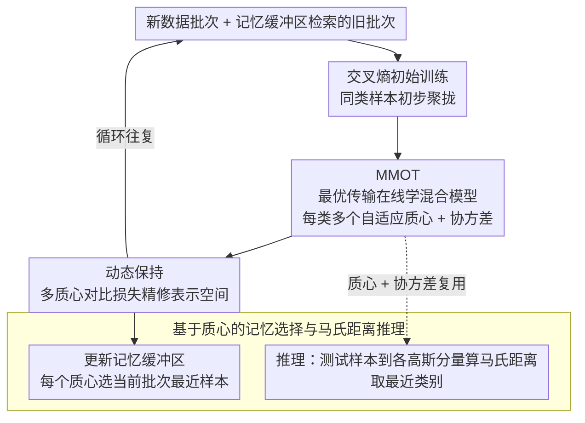

# An Optimal Transport-driven Approach for Cultivating Latent Space in Online Incremental Learning

**会议**: CVPR 2026  
**arXiv**: [2211.16780](https://arxiv.org/abs/2211.16780)  
**代码**: 无  
**领域**: 持续学习 / 在线增量学习  
**关键词**: 在线类增量学习, 最优传输, 高斯混合模型, 灾难性遗忘, 潜在空间

## 一句话总结

提出基于最优传输理论的在线混合模型学习框架 (MMOT)，通过为每个类别维护多个自适应质心来更精确地表征在线数据流的多模态特性，结合动态保持策略增强类别区分能力，在在线类增量学习 (OCIL) 中有效缓解灾难性遗忘。

## 研究背景与动机

在线类增量学习 (OCIL) 是持续学习中最具挑战性的场景：数据分布动态变化，模型只能对每个到达的小批量数据进行单次迭代更新，且推理时没有任务 ID 可用。这要求模型在极其有限的回放条件下持续适应新类别，同时保持对旧类别的记忆。

现有方法面临两个核心痛点。第一，大多数方法使用单个分类头或单个原型（质心）来表示潜在空间中的每个类别，但实际数据流天然具有多模态特性——一个类别可能由多个聚类组成，单个质心无法捕捉这种复杂性。第二，虽然有些方法使用高斯混合模型 (GMM) 来表示每个类别，但它们的均值和方差在计算后就被固定不再更新，随着骨干网络不断适应新数据导致特征漂移，这些固定的质心会变得越来越不准确。

这两个问题的根本矛盾在于：OCIL 环境中数据不断到达且分布持续变化，但现有的类别表征方式要么过于简单（单质心），要么过于僵化（固定 GMM）。作者的核心观察是：如果能够利用最优传输 (OT) 理论的丰富数学工具，设计一种能够随数据流增量更新的混合模型，就能同时解决多模态表征和特征漂移两个问题。

核心 idea：利用 Wasserstein 距离的熵正则化对偶形式，将 GMM 参数学习转化为期望形式的优化问题，使其天然适配 OCIL 中基于小批量的在线更新场景，用梯度下降替代传统 EM 算法来增量更新多个自适应质心。

## 方法详解

### 整体框架

OTC 要解决的是：在数据流不断到来、每批只能更新一次、且类别表征会随骨干漂移的 OCIL 场景下，如何让每个类别的潜在空间表征既能刻画类内的多模态结构、又能随数据流持续校准。它的整条流水线在每个时间步同时拿到新数据批次和从记忆缓冲区检索的旧数据批次，然后分三步把潜在空间「养」起来：先用交叉熵损失做一遍初始训练，把同类样本初步聚到一起；接着用 MMOT 框架为每个类别在线估计一个混合模型分布——也就是学出多个自适应质心和对应的协方差；最后拿这些质心信息执行动态保持策略，进一步把表示空间拉紧。一轮结束后再据此更新记忆缓冲区。质心因此不是训练的副产品，而是贯穿建模、损失、记忆选择、推理四个环节的核心载体。

### 关键设计

**1. MMOT：用最优传输把固定 GMM 变成能在线更新的多质心模型**

现有方法要么用单质心、表达不了类内多模态，要么用 GMM 但参数算完就冻住、跟不上特征漂移。MMOT 的做法是给每个类别 $c$ 维护一个高斯混合 $\mathbb{Q}_c = \sum_{k=1}^K \pi_{k,c} \mathcal{N}(\mu_{k,c}, \text{diag}(\sigma_{k,c}^2))$ 去近似真实数据分布 $\mathbb{P}_c$，并通过最小化两者之间的 Wasserstein 距离来学参数。关键的一步是借熵正则化的对偶形式，把 WS 距离改写成一个对 Kantorovich 势 $\phi$ 取极大的期望目标

$$\max_\phi \left\{ \mathbb{E}_{\mathbb{P}_c}[\phi(z^c)] + \mathbb{E}_{\mathbb{Q}_c}[\tilde{\phi}(\tilde{z}^c)] \right\}$$

期望形式天然适配 OCIL 里基于小批量的逐步估计，再配上 Gumbel-Softmax 重参数化让离散的混合比例 $\pi_{k,c}$ 也可微，于是所有 GMM 参数都能直接用几步梯度下降在线更新，绕开了传统 EM 反复迭代的开销。之所以选 OT 而不是 KL 散度，是因为 KL 对应的就是那个开销大的 EM；而 WS 距离连续可微、在两个分布支撑不重叠时仍数值稳定、且尊重数据的几何结构——这几条恰好都是在线漂移场景最看重的性质。

**2. 动态保持：把多质心信息灌进对比损失，换更细的类别边界**

既然 MMOT 已经为每类学出了多个质心，动态保持策略就顺势把这些质心当作对比学习的锚点，用损失 $\mathcal{L}_{DP}$ 来精修表示空间。其正样本项 $g_{cen}^c$ 把样本特征与该类全部 $K$ 个质心的相似度求和，从而把同类表示朝各自最近的子聚类质心拉；负样本项则同时纳入其他类的质心和特征，把不同类别推开。相比单原型方法只能给一个粗糙的类心，多质心在类别边界处提供了更精细的分界信息——尤其是落在边界附近的那些质心，对增强类间分离贡献最大，这正好补上了单原型表达不了类内多模态结构的短板。

**3. 基于质心的记忆选择与马氏距离推理：让质心在训练之外继续干活**

同一套质心还被复用到记忆和推理两个环节。更新缓冲区时，对每个质心挑当前批次里离它最近的样本存进去，这样所选样本能覆盖一个类别的多个子分布，避免随机选择漏掉少数子聚类、导致回放样本代表性不足。推理时则计算测试样本到每个类别各高斯分量的马氏距离，取最小距离对应的类别作为预测。马氏距离吃进了协方差信息，比欧氏距离更能贴合不同形状、不同松紧的类别分布，于是一套质心表征同时服务了建模、记忆和分类。

### 损失函数 / 训练策略

整体损失由三项构成，对应流水线的三步：交叉熵损失负责初始分离，MMOT 的 Wasserstein 距离损失负责在线学 GMM 参数，动态保持损失 $\mathcal{L}_{DP}$ 负责精细化表示空间。每个时间步的顺序是先用 CE 做初始训练，再跑 MMOT 更新质心，最后用动态保持策略拉紧表示，循环往复。

## 实验关键数据

### 主实验

| 数据集 | 指标 | OTC (本文) | BiC+AC (之前最佳) | GSA | MOSE |
|--------|------|------|----------|------|------|
| CIFAR-10 (M=0.2k) | Avg Acc↑ | **64.8** | 63.5 | 58.0 | 53.3 |
| CIFAR-10 (M=1k) | Avg Acc↑ | **76.1** | 75.8 | 69.1 | 70.7 |
| CIFAR-100 (M=2k) | Avg Acc↑ | **48.5** | 47.3 | 39.7 | 45.1 |
| CIFAR-100 (M=5k) | Avg Acc↑ | **56.5** | 54.2 | 49.7 | 54.5 |
| Tiny-ImageNet (M=2k) | Avg Acc↑ | **19.5** | 17.6 | 18.5 | 18.2 |
| Tiny-ImageNet (M=5k) | Avg Acc↑ | **31.6** | 22.6 | 26.0 | 30.9 |
| Tiny-ImageNet (M=10k) | Avg Acc↑ | **39.5** | 26.5 | 33.2 | 38.7 |

### 消融实验

| 配置 | Avg Acc (CIFAR-10, M=1k) | 说明 |
|------|---------|------|
| 1 centroid + random buffer | 71.6 | 单质心+随机选择 |
| 4 centroids + random buffer | 75.3 | 多质心但随机选择 |
| 4 centroids + centroid-based buffer | **75.9** | 完整模型 |
| 1 centroid + centroid-based buffer | 71.6 | 单质心+质心选择 |

### 关键发现

- **多质心贡献最大**：从 1 到 4 个质心，CIFAR-10 上准确率从 71.6% 提升到 75.9%，验证了多模态建模的必要性
- **最优质心数与记忆大小相关**：记忆越小，最优质心数越少（M=200 时最优为 3，M=1k 时最优为 4），超过阈值后性能下降
- **Tiny-ImageNet 上优势最明显**：20 个任务的长序列学习中，OTC 在 M=5k 和 M=10k 时比第二名分别高出 0.7% 和 0.8%，说明多质心在长任务序列中更有优势
- **遗忘方面表现稳定**：在 CIFAR-10 和 CIFAR-100 上遗忘率排名前二，Tiny-ImageNet 上遗忘排名前三

## 亮点与洞察

- **OT 替代 EM 做 GMM 学习**是核心创新——将计算开销大的多次迭代 EM 替换为几步梯度下降更新，这在在线学习场景中特别关键。巧妙之处在于利用了 WS 距离的熵对偶形式天然具有期望形式，完美适配小批量更新
- **质心参与训练和推理的双重作用**：不仅用于训练时的动态保持，还用于推理时的马氏距离分类和记忆选择，一套表征服务于多个环节
- **多质心思路可迁移**：在联邦学习、域自适应等需要处理数据分布漂移的场景中，多自适应质心 + OT 更新的框架都可能有价值

## 局限与展望

- 质心数量 $K$ 仍然是需要手动设置的超参数，没有自适应确定机制
- 在 Tiny-ImageNet 上遗忘仍然较高（16.5%），说明 20 个任务的超长序列对质心更新的稳定性有更高要求
- Kantorovich 网络 $\phi$ 的参数量和更新次数对性能的影响未充分分析
- 未在更大规模数据集（如 ImageNet-1k）上验证可扩展性

## 相关工作与启发

- **vs CoPE**: CoPE 使用单个自适应质心，遗忘低但初始准确率差；OTC 用多质心获得更高准确率，但遗忘略高。t-SNE 可视化清楚显示 CoPE 的类间分离度不如 OTC
- **vs MOSE**: MOSE 在大记忆时性能接近 OTC，但在小记忆时差距明显，说明 OTC 的多质心策略在资源受限时更有效
- **vs GSA**: GSA 使用固定 GMM + EM，OTC 的自适应 GMM + OT 更新在所有设置下都优于 GSA

## 评分

- 新颖性: ⭐⭐⭐⭐ 首次将 OT 用于 OCIL 中 GMM 的在线参数学习，理论贡献扎实
- 实验充分度: ⭐⭐⭐⭐ 三个数据集、多种记忆大小、详细消融，但缺少大规模实验
- 写作质量: ⭐⭐⭐⭐ 理论推导清晰，动机链条完整，图表丰富
- 价值: ⭐⭐⭐⭐ 多自适应质心 + OT 的范式对持续学习领域有启发，但实际性能提升幅度有限

<!-- RELATED:START -->

## 相关论文

- [\[CVPR 2026\] Beyond Myopic Alignment: Lookahead Optimization for Online Class-Incremental Learning](beyond_myopic_alignment_lookahead_optimization_for_online_class-incremental_lear.md)
- [\[CVPR 2026\] Shape-of-You: Fused Gromov-Wasserstein Optimal Transport for Semantic Correspondence in-the-Wild](shape-of-you_fused_gromov-wasserstein_optimal_transport_for_semantic_corresponde.md)
- [\[CVPR 2026\] Assignment-Driven Hash Learning in a Hyper-Semantic Space for On-the-Fly Category Discovery](assignment-driven_hash_learning_in_a_hyper-semantic_space_for_on-the-fly_categor.md)
- [\[CVPR 2026\] Geometry-driven OOD Detectors Are Class-Incremental Learners](geometry-driven_ood_detectors_are_class-incremental_learners.md)
- [\[ICCV 2025\] MoSiC: Optimal-Transport Motion Trajectory for Dense Self-Supervised Learning](../../ICCV2025/self_supervised/mosic_optimal-transport_motion_trajectory_for_dense_self-supervised_learning.md)

<!-- RELATED:END -->
