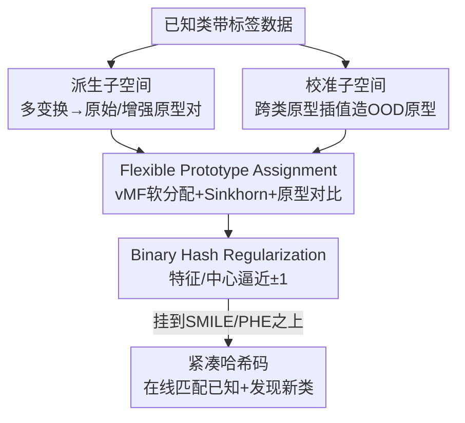

# Assignment-Driven Hash Learning in a Hyper-Semantic Space for On-the-Fly Category Discovery

**会议**: CVPR 2026  
**论文**: [CVF Open Access](https://openaccess.thecvf.com/content/CVPR2026/html/Yang_Assignment-Driven_Hash_Learning_in_a_Hyper-Semantic_Space_for_On-the-Fly_Category_CVPR_2026_paper.html)  
**代码**: 论文声明开源（CVF 页标注 Code，未给出明确仓库链接，⚠️ 以原文为准）  
**领域**: 自监督 / 表示学习（On-the-fly 类别发现 + 哈希学习）  
**关键词**: On-the-fly 类别发现, 哈希学习, 原型软分配, 超语义空间, 即插即用  

## 一句话总结
针对在线类别发现（OCD）中"特征到哈希码级联退化"和"已知类垄断表示空间"两大顽疾，本文先构造一个含「派生子空间 + 校准子空间」的超语义空间来同时刻画类内多样性并为新类预留空间，再在该空间里做"软原型分配 + 二值哈希正则"的赋值驱动哈希学习；作为即插即用模块挂到 SMILE / PHE 上，在六个细粒度数据集上 All 准确率平均提升约 12.78%（SMILE 基础上）。

## 研究背景与动机

**领域现状**：广义类别发现（GCD）能同时识别已知类、发现未标注新类，但绝大多数 GCD 方法是离线推理——要把整个未标注集成批处理后才能聚类。On-the-fly Category Discovery（OCD）去掉了"预定义查询集"假设，让流式样本逐条进来、被编码成紧凑的二值哈希码，既能高效匹配已知类，又能在哈希空间里即时发现新类。代表方法是 SMILE 和在其上加原型引导哈希学习的 PHE。

**现有痛点**：作者用 alignment / uniformity 两个度量做了三组可控实验，揭示出 OCD 现有方法的两个被忽视的失效。其一是**特征到哈希码的级联退化**：已知类内部 alignment 本就很差（同类样本特征距离大），这种脆弱性在哈希量化阶段被急剧放大——一个简单的几何变换（如旋转）就让同一样本的哈希码翻好几位，导致同类样本平均汉明距离 $d_H \ge 7$，预测出的类别数远超真实值。其二是**已知类垄断空间**：超球面 uniformity 分析显示已知类特征占据了大部分角度空间（SMILE 约 1.9、PHE 约 1.5 的对齐距离），新类被挤到边缘或塞进已有区域，无法形成独立的峰，新类发现能力被压制。

**核心矛盾**：训练阶段只有已知类监督、完全没有新类样本，已知类于是自然地"扩张"占满整个表示空间；同时哈希量化对类内扰动极度敏感。两个问题耦合在一起——类内不稳定造成冗余碎片，空间垄断造成新类无处容身。

**本文目标**：拆成两个子问题——(i) 解决类内敏感与哈希量化不稳定以消除冗余；(ii) 阻止旧类表示过度扩张造成的空间垄断。

**切入角度**：与其在原始特征空间里硬学，不如先**人为构造一个几何约束的"超语义空间"**：一边用原型增强把类内多样性显式建出来，一边用跨类原型插值"占位"，强行给未来的新类留出区域。

**核心 idea**：用"先建几何受限的超语义空间、再在其中做软分配哈希学习"替代"直接在原始空间硬分配学哈希"，同时治住类内敏感和空间垄断，且整体设计为即插即用模块。

## 方法详解

### 整体框架
方法是一个两阶段、即插即用的框架，挂在已有 OCD 方法（SMILE / PHE）之上。**第一阶段——超语义空间构造**：只用带标签的已知类数据，造出两个互补子空间——派生子空间（Derived Subspace）通过对每张图做多种变换、再算"原始原型 / 增强原型"配对来刻画类内细粒度多样性；校准子空间（Calibrated Subspace）通过对不同已知类原型做插值合成"OOD 原型"，占据语义模糊的空白区域、防止已知类塌缩扩张。**第二阶段——赋值驱动哈希学习**：在这个几何受限的空间里，用 Flexible Prototype Assignment（FPA）做软原型分配（建类内多样性 + 拉开类间），再用 Binary Hash Regularization（BHR）把连续哈希特征及其类中心推向 $\{-1,+1\}$，得到紧凑可判别的二值码。两阶段的损失以系数 $\alpha,\beta,\gamma$ 加到原方法的损失上。

### 关键设计

**1. 派生子空间：用原型增强把类内多样性显式刻画出来**

针对"类内 alignment 差、同类样本散、一扰动哈希码就翻位"这个痛点，作者不直接拉近同类样本，而是为每个已知类构造一对原型来表征它的"典型形态"与"变体形态"。给定一组 $M$ 个变换 $\mathcal{F}=\{f_1,\dots,f_M\}$，每张带标签图 $(x,y)$ 被变成 $M$ 个变体 $x_m=f_m(x)$；对类 $i$ 分别算原始样本原型 $P_i^{\text{par}}$ 和增强集原型 $P_i^{\text{aug}}$，所得原型对 $\{(P_i^{\text{par}},P_i^{\text{aug}})\}$ 就构成派生子空间。这样模型不是被迫把所有类内样本压成一个点，而是显式感知到"同类有原始也有变体"的多样性，为下一阶段的软分配提供锚点。实验里增加变换数量 $M$ 能持续提升性能，印证了"更丰富的变换 → 更细粒度的类内表示"。

**2. 校准子空间：跨类原型插值"占位"，逼退已知类的空间垄断**

针对"训练时没有新类、已知类自然扩张占满空间、新类无处容身"这个痛点，作者用不同已知类原型之间的插值合成一批"语义上不属于任何已知类"的 OOD 原型：

$$P^{\text{ood}} = \lambda_{ood}\,P_i^{\text{par}} + (1-\lambda_{ood})\,P_j^{\text{par}},\quad i\neq j,\ \lambda_{ood}\in[0,1]$$

其中 $\lambda_{ood}$ 随机取值以增强鲁棒性，并在已知类原型之间施加平滑的过渡约束。这些 OOD 原型像"占位桩"一样标记出语义模糊的空白区域，为潜在新类预留容量。为防止已知样本自己塌进这块预留区，作者再加一个 margin 分离损失：

$$\mathcal{L}_{\text{OOD}} = \frac{1}{B}\sum_{i=1}^{B}\max\Big(0,\ 0.5 + \max_j \text{sim}(f_i,p_j^{\text{ID}}) - \min_k \text{sim}(f_i,p_k^{\text{OOD}})\Big)$$

它把每个样本拉近自己的 ID 原型、推离所有 OOD 原型，并保证至少 0.5 的分离 margin。消融显示去掉它（w/o $\mathcal{L}_{\text{OOD}}$）在三数据集上 All 平均掉约 2.7%、New 掉约 4%，说明这块预留空间确实在为新类"放哨"。

**3. Flexible Prototype Assignment：软分配代替硬分配，治类内敏感**

针对"硬分配把每个样本只映到单一原型，无法表达类内多样性、最终把类别数估高"的痛点，作者给每类维护 $K=2$ 个单位范数原型 $P^c=\{p_k^c\}_{k=1}^K$，把样本嵌入 $z_i$ 以软分配权重 $w_i^c\in\mathbb{R}^K$ 建成 von Mises–Fisher（vMF）混合分布：

$$p(z_i\mid w_i^c,P^c,\kappa)=\sum_{k=1}^K w_{i,k}^c\,Z_D(\kappa)\exp(\kappa\,p_k^{c\top}z_i)$$

$\kappa$ 是浓度参数（越大越聚集），$\tau=1/\kappa$ 当温度。软分配权重矩阵 $W^c$ 用 Sinkhorn-Knopp 归一化求得：$W^c=\text{diag}(u)\exp(P^{c\top}Z^c/\epsilon)\,\text{diag}(v)$，避免所有样本塌到同一原型。基于这些权重，用一个软 MLE 损失 $\mathcal{L}_{\text{soft-MLE}}$ 把样本紧凑聚到其分配的原型周围。光有类内聚合还不够判别，作者再加原型对比损失 $\mathcal{L}_{\text{proto}}$（式 7）：对同一原型的两个视图 $\hat{p}_k^c,\tilde{p}_k^c$ 互相拉近、把不同类原型推开，强化类间分离。两者合成 $\mathcal{L}_{\text{FPA}}=\mathcal{L}_{\text{soft-MLE}}+\lambda_{FPA}\mathcal{L}_{\text{proto}}$，原型用 EMA 异步更新保持稳定。一张对照表很说明问题：CUB 上硬分配 34.6/63.6/20.1 → 软分配 41.4/66.9/28.6（All/Old/New），New 类直接涨 8.5。

**4. Binary Hash Regularization：把连续哈希特征与类中心一起逼向 ±1**

OCD 最终要落到二值哈希码做高效存储与检索，但连续特征量化成二值时易丢判别性。BHR 让连续哈希特征矩阵 $H\in\mathbb{R}^{N\times D}$ 和类中心 $C\in\mathbb{R}^{K\times D}$ 都逼近 $\{-1,+1\}$：

$$\mathcal{L}_{\text{BHR}}=\frac{1}{KD}\sum_{k=1}^K\sum_{d=1}^D\big||c_{k,d}|-1\big| + \frac{1}{ND}\sum_{i=1}^N\sum_{d=1}^D\big||h_{i,d}|-1\big|$$

惩罚项 $||x|-1|$ 仅在取值为 $\pm 1$ 时为 0，强制连续特征二值化。同时用 Hash Center Manager 以动量 $m=0.9$ 更新中心：$c_k\leftarrow m\,c_k+(1-m)\,\bar{h}_k$（$\bar{h}_k$ 为当前 batch 内 $k$ 类哈希特征均值）。这一项让特征级与中心级同时"对齐到二值"，缓解了哈希量化造成的同类码碎片化。

### 损失函数 / 训练策略
框架以即插即用方式扩展原方法损失。挂到 SMILE 上：$\mathcal{L}=\mathcal{L}_{sup}+\mathcal{L}_{reg}+\alpha\mathcal{L}_{OOD}+\beta\mathcal{L}_{BHR}+\gamma\mathcal{L}_{FPA}$；挂到 PHE 上：$\mathcal{L}=\mathcal{L}_p+\lambda_1\mathcal{L}_c+\lambda_2\mathcal{L}_f+\alpha\mathcal{L}_{OOD}+\beta\mathcal{L}_{BHR}+\gamma\mathcal{L}_{FPA}$。主实验取 $\alpha=0.1$（FPA 权重，注意原文 Fig.4 文字描述里 $\alpha,\beta,\gamma$ 与三个损失的对应略有出入，⚠️ 以原文为准）、OOD 与 BHR 权重 0.2。backbone 用 DINO 预训练的 ViT-B/16，只微调最后一个 block；特征投影输出 768 维，每类 $K=2$ 原型；哈希投影三层线性输出 $L=12$ 维（$2^{12}=4096$ 个二值编码）。SGD（动量 0.9，初始 lr 0.1，cosine annealing，20 epoch，batch 128）。

## 实验关键数据

### 主实验
六个细粒度数据集（CUB、Stanford Cars、Oxford Pets、iNaturalist 的 Animalia / Fungi / Arachnida），指标为聚类准确率 ACC（含最优排列对齐），分 All/Old/New。本文作为即插即用模块分别挂到 SMILE 与 PHE 上。

| 方法 | CUB All/Old/New | Stanford Cars All | Animalia All | Arachnida All |
|------|------|------|------|------|
| SMILE | 32.2 / 50.9 / 22.9 | 26.2 | 35.9 | 29.9 |
| SMILE+DiffGRE | 35.4 / 58.2 / 23.8 | 30.5 | 37.4 | 35.4 |
| **SMILE+Ours** | **41.4 / 66.9 / 28.6** | 31.0 | **57.1** | **57.2** |
| PHE | 36.4 / 55.8 / 27.0 | 31.3 | 40.3 | 37.0 |
| **PHE+Ours** | **45.8 / 75.7 / 30.9** | **38.8** | 36.4 | 39.4 |

挂到 SMILE 上，六数据集 All 平均提升约 12.78%，Old/New 平均提升约 4.65% / 7.93%；挂到 PHE 上在 CUB、Stanford Cars 提升尤其明显（CUB All 36.4→45.8、Cars All 31.3→38.8）。注意在 Animalia 上 PHE+Ours 反而低于 PHE（40.3→36.4），并非所有组合都正向。

### 消融实验
在 Stanford Cars / Arachnida / CUB 上逐个去模块（基于 SMILE+Ours）：

| 配置 | Cars All/Old/New | Arachnida All | CUB All | 说明 |
|------|------|------|------|------|
| SMILE（基线） | 26.2 / 46.7 / 16.3 | 29.9 | 32.2 | 原方法 |
| w/o $\mathcal{L}_{OOD}$ | 30.8 / 51.5 / 20.5 | 55.8 | 34.9 | 去校准子空间，三数据集 All 均掉 |
| w/o $\mathcal{L}_{FPA}$ | 30.2 / 51.6 / 19.6 | 53.4 | 34.2 | 去软分配 |
| w/o $\mathcal{L}_{BHR}$ | 30.8 / 51.4 / 20.6 | 53.6 | 33.7 | 去二值正则 |
| **SMILE+Ours（Full）** | **31.0 / 53.7 / 19.8** | **57.2** | **41.4** | 完整 |

去 $\mathcal{L}_{OOD}$ 三数据集 All 平均掉约 2.7%、New 约 4%；去 $\mathcal{L}_{FPA}$ 平均掉 All 3.8% / Old 2.7% / New 2.6%；去 $\mathcal{L}_{BHR}$ 平均掉 All 3.8% / Old 2.4% / New 4.0%。三个模块各有不可替代的作用。

另一张"估计类别数"表直击 OCD 的核心病——预测类别数远超真值：

| 数据集（真值） | SMILE+Ours | PHE+Ours |
|------|------|------|
| CUB (200) | 412 → 397 | 431 → 418 |
| Stanford (196) | 298 → 260 | 498 → 459 |
| Fungi (321) | 789 → 750 | 408 → 370 |

加入本文模块后估计类别数普遍向真值收敛（Stanford 上降 38–39 个），印证"软分配 + 哈希正则"抑制了过度碎片化。

### 关键发现
- **超参敏感性有明确最优点**：$\alpha=0.1$ 时 All 提升 5–6%、New 几乎翻倍（保留足够特征多样性给新类）；$\beta$ 在 0.2 附近最佳；$\gamma=0.2$ 在哈希紧凑与类间分离间最平衡，过大反而把 New 拉低 2%。OOD 原型数在 10 个时最优、margin 在 0.5 时峰值。
- **空间几何指标全面改善**（Tab.5）：CUB 上 SMILE+Ours 的类内汉明距离 2.28→1.78、类间 4.34→5.20，alignment 与 uniformity 都更紧凑，直接对应"图 1 揭示的失效被治好"。
- **校准子空间确实在"占位"**：对 sample-to-OOD 距离做 KDE 出现清晰双峰——已知类在高距离、未知类向低距离靠拢，说明新类对预留 OOD 区有更强亲和力。

## 亮点与洞察
- **把"诊断"做成了卖点**：论文先用 alignment/uniformity 把 OCD 的两个失效量化出来（图 1），再让方法逐一对症，最后用同样的指标回测改善（Tab.5），形成"发现问题 → 设计 → 验证"的闭环，说服力强。
- **"为未来的类占位"很巧**：训练时根本没有新类样本，却用已知类原型插值合成 OOD 原型去抢占空间、加 margin 损失把已知样本推开——这是用已知类的"边角料"主动给未知类腾地方，思路可迁移到任何"开放世界但训练只有闭集"的场景。
- **软分配 + Sinkhorn 治哈希碎片**：每类 2 原型 + vMF 软分配 + Sinkhorn 归一化避免塌缩，直接把"估计类别数远超真值"这个 OCD 老毛病往真值方向拉，是个可复用的反碎片化套路。
- **即插即用**：所有模块以加权损失项形式接到 SMILE / PHE，不改 backbone 与推理流程，落地成本低。

## 局限与展望
- **并非全场景正向**：PHE+Ours 在 Animalia 上反而掉点（40.3→36.4），说明该即插即用模块与不同基方法/数据分布的适配性不稳定，作者未深入解释何时失效。
- **公式与文字标注存在小出入**：Fig.4 描述里 $\alpha/\beta/\gamma$ 与 FPA/OOD/BHR 三损失的对应关系，与式 (10)(11) 的写法不完全一致（⚠️ 以原文为准），复现时需对照附录核实。
- **超参较多且需网格搜索**：$\alpha,\beta,\gamma$、OOD 原型数、margin、变换数 $M$、$K$ 都要调，论文在 CUB 上 grid search 得到的最优值是否跨数据集稳健，未充分论证。
- **每类仅 $K=2$ 原型**：对类内变化极大的细粒度类别，2 个原型是否够表达多样性存疑，可探索自适应原型数。

## 相关工作与启发
- **vs SMILE / PHE（OCD 基线）**：它们直接在原始特征空间学哈希码，未显式建类内多样性、也未给新类预留空间；本文把这两件事拆成"超语义空间构造"显式处理，再做软分配哈希学习，作为模块挂回去普遍涨点。
- **vs DiffGRE（同为增强 OCD 的插件）**：DiffGRE 在多数数据集上提升有限，本文在 CUB、Stanford Cars 等上明显更强，差异主要来自"校准子空间为新类占位 + FPA 软分配抑制碎片"。
- **vs GCD 离线方法**：传统 GCD 成批聚类，无法应对流式新类；OCD（含本文）靠哈希码即时匹配/发现，本文进一步解决了哈希量化的不稳定问题。

## 评分
- 新颖性: ⭐⭐⭐⭐ "超语义空间 + 跨类原型插值占位"针对 OCD 两大失效，切口清晰但用的多是软分配/对比/哈希正则等已有组件
- 实验充分度: ⭐⭐⭐⭐ 六数据集 + 双基方法 + 消融 + 估计类别数 + 几何指标回测，较扎实；但存在反向掉点案例未深究
- 写作质量: ⭐⭐⭐⭐ "诊断→设计→验证"叙事清楚，图 1/图 6 直观；个别公式与文字标注有小出入
- 价值: ⭐⭐⭐⭐ 即插即用、对 OCD 落地友好，反碎片化与占位思路可迁移到开放世界识别

<!-- RELATED:START -->

## 相关论文

- [\[CVPR 2026\] An Optimal Transport-driven Approach for Cultivating Latent Space in Online Incremental Learning](an_optimal_transport_driven_approach_for_cultivating_latent_space_in_online_incr.md)
- [\[CVPR 2026\] TAR: Token-Aware Refinement for Fine-grained Generalized Category Discovery](tar_token-aware_refinement_for_fine-grained_generalized_category_discovery.md)
- [\[CVPR 2026\] Decouple Your Discovery and Memory in Continual Generalized Category Discovery](decouple_your_discovery_and_memory_in_continual_generalized_category_discovery.md)
- [\[CVPR 2026\] The Devil Is in Gradient Entanglement: Energy-Aware Gradient Coordinator for Robust Generalized Category Discovery](the_devil_is_in_gradient_entanglement_energy-aware_gradient_coordinator_for_robu.md)
- [\[CVPR 2026\] Learning Like Humans: Analogical Concept Learning for Generalized Category Discovery](learning_like_humans_analogical_concept_learning_for_generalized_category_discov.md)

<!-- RELATED:END -->
