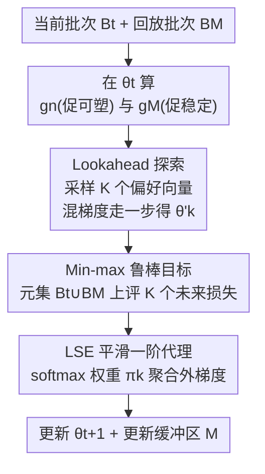

# Beyond Myopic Alignment: Lookahead Optimization for Online Class-Incremental Learning

**会议**: CVPR 2026  
**论文**: [CVF Open Access](https://openaccess.thecvf.com/content/CVPR2026/html/Lai_Beyond_Myopic_Alignment_Lookahead_Optimization_for_Online_Class-Incremental_Learning_CVPR_2026_paper.html)  
**代码**: 无  
**领域**: 持续学习 / 在线类增量学习  
**关键词**: 在线类增量学习, 经验回放, 梯度冲突, lookahead 优化, min-max 鲁棒优化  

## 一句话总结
针对在线类增量学习中"当前任务梯度与回放梯度冲突"导致遗忘的问题，本文先从理论上揭示 hypergradient 方法本质是把任务梯度对齐到共享元目标、却只看当下一步因而"短视"，进而提出 LOR：在更新前先沿一组"可塑性-稳定性"权衡方向探查多个未来模型状态，再用 Log-Sum-Exp 软化的 min-max 目标优化最坏方向，把模型推向更平坦、更抗遗忘的区域，在 Seq-CIFAR10/100 与 Seq-TinyImageNet 上全面超过 SOTA。

## 研究背景与动机
**领域现状**：在线类增量学习（OCIL）里，数据以流式到来、每个任务通常只过一遍，模型要在不断学新类的同时不忘旧类。主流且强力的范式是**基于回放（rehearsal）**——维护一个小记忆缓冲区 $\mathcal{M}$，把旧样本和当前批次混在一起训练，代表方法有 ER、DER/DER++、iCaRL 等。

**现有痛点**：回放并非万能。核心问题是当前任务的优化目标常与"保留旧知识"的目标**冲突**：当前批次梯度 $\mathbf{g}_n$ 与缓冲区梯度 $\mathbf{g}_{\mathcal{M}}$ 的内积可能为负（$\langle \mathbf{g}_n, \mathbf{g}_{\mathcal{M}}\rangle < 0$），两者把参数往相反方向拽，直接加剧灾难性遗忘。GEM/A-GEM 通过投影强行让当前梯度不增大回放损失，但约束过强；近期 MER、La-MAML、VR-MCL 等转向元学习视角，用 **hypergradient** 隐式缓解冲突并拿到 SOTA，**但为什么有效一直缺乏正式解释**。

**核心矛盾**：本文第一项贡献就是补上这个解释——通过双层优化的一阶 Taylor 展开证明 hypergradient 把当前任务与旧任务的梯度都**对齐到同一个共享元目标** $\mathcal{L}_m$ 上，从而倾向于减少二者夹角冲突（见下方公式）。但作者指出这种对齐**本质是短视（myopic）的**：它只在当前参数点 $\theta_t$ 修正梯度方向，完全不考虑更新之后损失曲面的几何形状。一个"不冲突"的更新仍可能把参数带进一个尖锐的山谷，使后续更新互相干扰、旧知识被毁。

**切入角度与核心 idea**：与其只做一次"当下不冲突"的修正，不如**先往前探一探**。LOR 在每步更新前，沿若干条不同"可塑性 vs 稳定性"权衡方向各走一小步，模拟出一组可能的未来参数状态 $\{\theta'_1,\dots,\theta'_K\}$，然后求一个对**最坏未来方向也稳健**的更新（min-max），把模型引向平坦、可泛化、对遗忘更鲁棒的区域——用"探查未来曲面"代替"修正当下梯度"。

作为铺垫，hypergradient 减冲突的机制可写为：单步内层更新得辅助参数 $\tilde\theta_j = \theta - \alpha\nabla_\theta\mathcal{L}_j(\theta)$，其对原参数的 hypergradient 为 $\mathbf{g}_j^{\text{HD}}(\theta) = (I-\alpha\nabla_\theta^2\mathcal{L}_j(\theta))^\top \nabla_{\tilde\theta_j}\mathcal{L}_m(\tilde\theta_j)$，一阶展开后

$$\mathbf{g}_j^{\text{HD}}(\theta) \approx \nabla_\theta\mathcal{L}_m(\theta) - \alpha\,\nabla_\theta^2\mathcal{L}_m(\theta)\,\nabla_\theta\mathcal{L}_j(\theta).$$

其中 Hessian-向量积把任务梯度 $\nabla_\theta\mathcal{L}_j$ 朝"更陡降元损失"的方向旋转；当前任务和旧任务的 hypergradient 都被拉向同一个 $\nabla_\theta\mathcal{L}_m$，冲突自然减小——但这一切只发生在 $\theta_t$ 这一个点上，看不到一步之外。

## 方法详解

### 整体框架
LOR（Lookahead Optimization for Rehearsal）是一个**即插即用的优化层**，不改网络结构、不引入二阶微分，只替换"如何由当前/回放梯度得到本步更新"这一环。一步训练的输入是当前任务批次 $B_t$、从缓冲区采样的回放批次 $B_{\mathcal{M}}$，输出是更新后的参数 $\theta_{t+1}$。

整条流水线是：先在当前参数 $\theta_t$ 算出两条"原始梯度"——当前批次梯度 $\mathbf{g}_n$（促可塑性、学新）和记忆批次梯度 $\mathbf{g}_{\mathcal{M}}$（促稳定性、护旧）；再采样 $K$ 个偏好向量 $\mathbf{w}_k=(w_{k,n}, w_{k,\mathcal{M}})$，把两条梯度按不同权重混成 $K$ 条**冻结的 lookahead 方向**，各走一小步得到 $K$ 个"未来状态" $\theta'_k$；在共享的元评估集 $D_t^{\text{meta}}=B_t\cup B_{\mathcal{M}}$ 上评出每个未来状态的损失 $\hat{\mathcal{L}}_k$；最后用 Log-Sum-Exp 把"最坏未来"软化成可微目标，按 softmax 权重 $\pi_k$ 聚合各未来状态的外梯度 $\mathbf{G}_k$，得到本步真正用来更新的 $\mathbf{g}_t$。直觉上：**哪条权衡方向探到的未来损失越高（越危险），它在最终更新里的话语权就越大**，于是更新会主动绕开"某个方向会掉进尖锐区"的解，落到所有方向都安全的平坦区。

### 关键设计

**1. Lookahead 探索：沿一组可塑性-稳定性权衡方向探查多个未来状态**

这一步直接针对"短视"痛点——既然单点修正看不到一步之外，那就显式地往前各走一小步看看。在当前参数 $\theta$ 处，用偏好向量 $\mathbf{w}_k=(w_{k,n}, w_{k,\mathcal{M}})$ 把当前梯度和记忆梯度线性组合成一条探查方向，得到第 $k$ 个未来状态：

$$\theta'_k(\theta) = \theta - \eta_L\big(w_{k,n}\,\mathbf{g}_n(\theta) + w_{k,\mathcal{M}}\,\mathbf{g}_{\mathcal{M}}(\theta)\big),$$

其中 $\eta_L$ 是 lookahead 步长。偏好向量从 Dirichlet 分布 $\mathbf{w}_k\sim\text{Dir}(\alpha_s,\alpha_s)$ 采样，让 $K$ 条方向**铺满整个权衡谱**：从纯可塑性 $\mathbf{w}=(1,0)$（只学新）到纯稳定性 $\mathbf{w}=(0,1)$（只护旧），再到各种中间混合。每条方向都对应一种"如果这一步偏向学新/护旧，未来会落到哪"的假设。与通用 lookahead 优化器（维护慢权重周期性插值）不同，LOR 的探索是**专门为回放式 OCIL 的冲突结构定制的**：探查轴正是可塑性与稳定性这对核心矛盾。

**2. Min-max 鲁棒目标：对最坏未来方向也稳健的更新**

有了 $K$ 个未来状态，怎么决定这一步真正往哪走？作者不去赌某一条"看起来最好"的方向（那又会退回短视），而是求一个对**最坏情形也不翻车**的更新，写成 min-max：

$$\min_\theta\ \max_{k\in\{1,\dots,K\}}\ \mathcal{L}\big(\theta'_k(\theta);\, D_t^{\text{meta}}\big),$$

损失在共享元评估集 $D_t^{\text{meta}}=B_t\cup B_{\mathcal{M}}$ 上评估（同时覆盖新旧）。为什么这样能抗遗忘？因为一个**尖锐**的极小值，总会让某一条 lookahead 方向落到高损失区，从而被 max 抓出来惩罚掉；只有当所有探查方向都落在低损失区时目标才小——这等价于把优化器推离尖锐解、推向平坦可泛化区。论文还从分布鲁棒优化（DRO）和域适应泛化界两个角度佐证：缓冲区分布与真实旧数据分布的失配可看作一种"训练分布扰动"，min-max 让模型对这种扰动鲁棒，从而降低与理想旧模型 $h^*_{\mathcal{M}}$ 的"分歧风险"（disagreement risk，即遗忘的形式化度量）。

**3. LSE 平滑一阶代理：把不可导的 max 变成易训练的目标**

Eq.5 的硬 max 既不可导、若要严格对 $\theta'_k$ 求导还会牵出二阶微分，难以塞进标准训练流程。LOR 用两步把它落地。其一，采**一阶近似 + stop-gradient**：在 $\theta_t$ 处先算出冻结梯度 $\bar{\mathbf{g}}_n=\text{sg}(\nabla_\theta\mathcal{L}(B_t;\theta_t))$、$\bar{\mathbf{g}}_{\mathcal{M}}=\text{sg}(\nabla_\theta\mathcal{L}(B_{\mathcal{M}};\theta_t))$，据此构造冻结方向 $\mathbf{d}_k=w_{k,n}\bar{\mathbf{g}}_n+w_{k,\mathcal{M}}\bar{\mathbf{g}}_{\mathcal{M}}$ 与未来状态 $\theta'_k=\theta_t-\eta_L\mathbf{d}_k$——**不对 lookahead 方向的构造过程回传梯度**，于是避开二阶项。其二，用 Log-Sum-Exp 软化 max：

$$\hat{\mathcal{L}}_{\text{LOR}}(\theta_t) = \mu\log\Big(\sum_{k=1}^{K}\exp\big(\hat{\mathcal{L}}_k/\mu\big)\Big),$$

其梯度是各未来状态外梯度 $\mathbf{G}_k=\nabla_\theta\hat{\mathcal{L}}_k$ 的 softmax 加权和

$$\mathbf{g}_t = \nabla_\theta\hat{\mathcal{L}}_{\text{LOR}}(\theta_t) = \sum_{k=1}^{K}\pi_k\,\mathbf{G}_k,\qquad \pi_k = \frac{\exp(\hat{\mathcal{L}}_k/\mu)}{\sum_j\exp(\hat{\mathcal{L}}_j/\mu)}.$$

温度 $\mu$ 控制"软最坏"的硬度：$\mu\to 0$ 退化为只盯最坏方向的硬 max，$\mu$ 大则趋于对所有方向均匀平均。这样整个 LOR 只需算 $K$ 次前向+一阶外梯度再聚合，无二阶微分、可直接插入 SGD 训练循环。

### 损失函数 / 训练策略
训练用普通 SGD，主干为 Reduced ResNet-18，遵循在线协议（数据流式到来、每任务通常单 epoch、推理时无任务 ID）。每步算法（Algorithm 1）：取 $B_t$、从 $\mathcal{M}$ 采 $B_{\mathcal{M}}$、令 $D_t^{\text{meta}}=B_t\cup B_{\mathcal{M}}$ → 算 $\mathbf{g}_n,\mathbf{g}_{\mathcal{M}}$ → 采 $K$ 个 $\mathbf{w}_k$ → 对每个 $k$ 构造冻结方向 $\mathbf{d}_k$、得 $\theta'_k$、评 $\hat{\mathcal{L}}_k$、算外梯度 $\mathbf{G}_k$ → 算 LSE 权重 $\pi_k$ → 聚合 $\mathbf{g}_t$ → $\theta_{t+1}=\theta_t-\eta\mathbf{g}_t$ → 更新缓冲区。关键超参为方向数 $K$、LSE 温度 $\mu$、Dirichlet 浓度 $\alpha_s$、lookahead 步长 $\eta_L$。

## 实验关键数据

### 主实验
三个标准基准：Seq-CIFAR10（5 任务）、Seq-CIFAR100（20 任务）、Seq-TinyImageNet（20 任务），主干 Reduced ResNet-18，5 次运行均值。**AAA（Average Anytime Accuracy，全程平均准确率）**对比（节选自 Table 1）：

| 方法 | Seq-CIFAR10 \|M\|=1k | Seq-CIFAR100 \|M\|=5k | Seq-TinyImageNet \|M\|=5k |
|------|------|------|------|
| ER | 54.91 | 20.67 | 16.10 |
| DER++ | 61.01 | 17.08 | 11.93 |
| CLSER | 63.27 | 23.25 | 18.88 |
| POCL（之前最强） | 66.23 | 36.34 | 25.48 |
| **LOR（本文）** | **74.22** | **43.26** | **31.36** |

最终 **Acc**（学完全序列后各任务平均准确率，Table 2）同样大幅领先：Seq-CIFAR100 \|M\|=5k 上 LOR 39.02 vs POCL 33.36 vs CLSER 16.42；Seq-CIFAR10 \|M\|=1k 上 LOR 71.47 vs POCL 58.50。**遗忘度 FM**（越接近 0 越好，Table 3）上 LOR 也明显更优：Seq-CIFAR100 \|M\|=5k 上 LOR −11.12 vs POCL −17.55 vs CLSER −50.71，说明它确实更能保住旧知识。任务序列越长、类别越多（CIFAR100、TinyImageNet）增益越大，印证"短视误差会随时间累积、lookahead 收益是复利"的假设。

### 消融与分析实验

| 配置 | 关键指标 | 说明 |
|------|---------|------|
| 小主干 3 层 DNN（Table 4，Seq-CIFAR10 \|M\|=1k） | LOR AAA 64.41 / Acc 51.81 / FM −18.62 vs ER 48.50 / 33.20 / −38.50 | 即便换成极简网络，LOR 仍大幅领先 ER，说明收益源于学习过程本身、不依赖过参数化大模型 |
| 满血 ResNet-18（Table 7，Seq-CIFAR100 \|M\|=5k） | LOR Acc 25.45 vs VR-MCL 19.68 vs CLSER 19.45 | 架构无关，大网络上照样超过最新 VR-MCL |
| 40 任务长序列（Table 8，Seq-TinyImageNet \|M\|=5k） | LOR AAA 24.15 / Acc 17.21 vs POCL 19.96 / 14.33 | 任务翻倍后与对手差距进一步拉大，验证长程复利收益 |
| 超参敏感性（Table 5，Seq-CIFAR100 \|M\|=5k） | $\mu\in[0.5,2.0]$、$\alpha_s=1.0$ 附近 AAA 均稳定在 42.3–43.3 | 软最坏重加权对平滑强度不敏感；对称 Dirichlet（均匀探索权衡谱）即好用，几乎免调参 |
| 缓冲区大小（Table 6，Seq-CIFAR100，\|M\|=200/600/1000） | LOR AAA 24.50/28.90/31.47 全档领先 CLSER 16.80/19.50/22.58 | 小缓冲区下相对增益尤其大，对内存受限场景友好 |

### 关键发现
- **min-max + lookahead 是抗遗忘主因**：LOR 在 FM 上的优势比在 Acc 上更突出（CIFAR100 \|M\|=5k 上 FM 把 −17.55 改善到 −11.12），说明它真正改善的是"旧知识保留"而非单纯刷新精度。
- **越难越值**：长序列（40 任务）、长任务数（CIFAR100/TinyImageNet）、小缓冲区三类"硬场景"下相对增益最大，呼应"短视误差随步数累积、提前探查的复利效应"这一核心假设。
- **近乎免调参**：$\mu$ 在 0.5–2.0、$\alpha_s$ 取 1.0（即在单纯形上均匀采权衡方向）就稳定有效，降低了部署成本。

## 亮点与洞察
- **先解释、再改进的叙事很扎实**：先用一阶 Taylor 把"hypergradient 为何减冲突"讲清（对齐到共享元目标），再指出它"只看当前点"的短视本质，最后才提出 lookahead——动机不是空谈而是从前人方法的局限里推出来的。
- **把 sharpness-aware 思想搬进持续学习**：核心机制其实是"min-max 探查 + 软最坏惩罚 → 偏好平坦区"，与 SAM 一脉相承，但探查轴专门选成可塑性-稳定性权衡谱，让"平坦区"恰好对应"抗遗忘区"，这个嫁接很巧。
- **工程上够轻**：stop-gradient + 一阶代理 + LSE 三招把原本带二阶 Hessian 的 min-max 砍成"$K$ 次前向加权聚合"，可直接插进任意回放式 OCIL 流水线，复现门槛低。
- **可迁移**："采样多条权衡方向 → 评未来损失 → 软最坏聚合"这套范式，迁到多目标优化、多任务梯度冲突、RLHF 中"helpfulness vs safety"权衡等场景都说得通。

## 局限与展望
- **计算开销随 $K$ 线性增长**：每步要多算 $K$ 次前向与外梯度，论文正文未给出 $K$ 的具体取值与墙钟时间/显存对比（称放在补充材料），实际开销与 $K$ 的最优取值⚠️以原文补充材料为准。
- **仅在小数据集/小主干验证**：实验止于 CIFAR/TinyImageNet 与 (Reduced) ResNet-18，未涉及大规模数据或预训练大模型下的 OCIL，泛化到工业级场景仍待验证。
- **方向仍是梯度线性组合**：lookahead 方向只在 $\mathbf{g}_n,\mathbf{g}_{\mathcal{M}}$ 张成的二维权衡平面内采样，可能错过该平面之外更优的探查方向；引入更丰富（如二阶或历史）方向或许进一步提升。
- **理论与算法之间有近似缺口**：Eq.5 的理想 min-max 与实际用的一阶 stop-gradient 代理（Eq.6/7）并不严格等价，作者明确说实践算法不对方向构造回传梯度，二者差距对最终解的影响未量化。

## 相关工作与启发
- **vs GEM / A-GEM**：它们通过投影硬约束"当前梯度不增大回放损失"来防冲突，约束过强、易过度限制可塑性；LOR 不做硬投影，而是软性地探查多种权衡方向再选稳健更新，更灵活且在所有基准上反超 GEM/A-GEM 一大截。
- **vs MER / La-MAML / VR-MCL（hypergradient 系）**：它们用双层优化/hypergradient 隐式减冲突、拿到 SOTA，但本文证明其对齐只在当前点、是短视的；LOR 把视野从"当前点的梯度方向"扩展到"一步之后的损失曲面几何"，且 Acc 上反超最新的 VR-MCL（CIFAR100 满血 ResNet 上 25.45 vs 19.68）。
- **vs 通用 Lookahead 优化器 / extra-gradient**：通用 lookahead 维护慢权重周期插值以稳训练、extra-gradient 在 min-max 博弈里先探一步再更新；LOR 受其启发但把探查**结构化为可塑性-稳定性权衡谱**，专为回放式 OCIL 的冲突结构定制，而非通用稳定化。
- **vs POCL（Pareto 优化）**：POCL 把持续学习当多目标 Pareto 问题求折中点，是当前最强 baseline 之一；LOR 换成"探查未来 + 软最坏 min-max"，在 AAA/Acc/FM 三项上普遍优于 POCL，尤其长序列差距更大。

## 评分
- 新颖性: ⭐⭐⭐⭐ 把"先解释 hypergradient 短视、再用 lookahead + min-max 探查未来曲面"组合进 OCIL，机制清晰且有理论支撑
- 实验充分度: ⭐⭐⭐⭐ 三基准多缓冲区 + 小/大主干 + 40 任务长序列 + 超参敏感性，覆盖全面；但缺 $K$ 的开销/取值与大模型场景
- 写作质量: ⭐⭐⭐⭐⭐ 动机推导环环相扣，公式与算法表述清楚，从优化和统计两个视角佐证
- 价值: ⭐⭐⭐⭐ 即插即用、近乎免调参、在抗遗忘上提升显著，为回放式 OCIL 提供了"主动探查曲面"的新范式

<!-- RELATED:START -->

## 相关论文

- [\[CVPR 2026\] An Optimal Transport-driven Approach for Cultivating Latent Space in Online Incremental Learning](an_optimal_transport_driven_approach_for_cultivating_latent_space_in_online_incr.md)
- [\[CVPR 2026\] Exemplar-Free Class Incremental Learning via Preserving Class-Discriminative Structure](exemplar-free_class_incremental_learning_via_preserving_class-discriminative_str.md)
- [\[CVPR 2026\] Geometry-driven OOD Detectors Are Class-Incremental Learners](geometry-driven_ood_detectors_are_class-incremental_learners.md)
- [\[CVPR 2026\] Semantic-Guided Global-Local Collaborative Prompt Learning for Few-Shot Class Incremental Learning](semantic-guided_global-local_collaborative_prompt_learning_for_few-shot_class_in.md)
- [\[CVPR 2026\] Temporal Imbalance of Positive and Negative Supervision in Class-Incremental Learning](temporal_imbalance_of_positive_and_negative_supervision_in_class-incremental_lea.md)

<!-- RELATED:END -->
