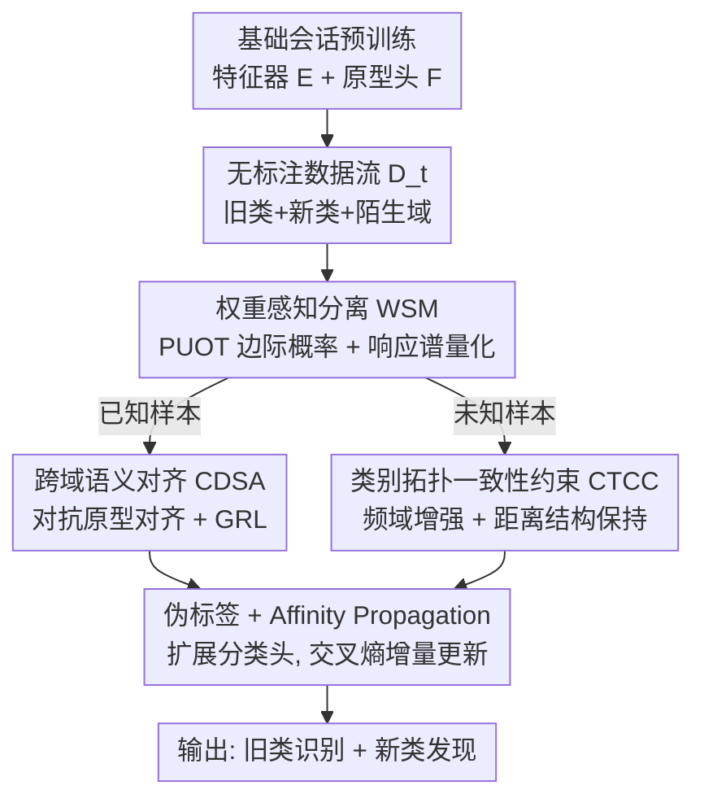

# Beyond the Static World: Continual Category Discovery under Visual Drift

**会议**: CVPR 2026  
**论文**: [CVF Open Access](https://openaccess.thecvf.com/content/CVPR2026/html/Feng_Beyond_the_Static_World_Continual_Category_Discovery_under_Visual_Drift_CVPR_2026_paper.html)  
**代码**: 无  
**领域**: 自监督 / 类别发现 / 持续学习  
**关键词**: 开放持续类别发现, 部分非平衡最优传输, 域偏移, 对抗对齐, 类别拓扑一致性  

## 一句话总结
针对"无标注数据流既冒出新类、又来自陌生域"的现实场景，本文提出 OCCD 任务，并用"最优传输自动分离已知/未知样本 → 对抗对齐已知类原型 → 频域增强约束类别拓扑一致性"三件套，在 DomainNet 和 SSB-C 上同时把新类发现和旧类识别拉到新 SOTA。

## 研究背景与动机
**领域现状**：广义类别发现（GCD）希望从无标注数据里同时认出已知类、聚出新类，但主流 GCD 要求训练时**同时拿到**有标注和无标注数据；持续类别发现（CCD）放松了这一点，让一个预训练模型在不断到来的无标注数据流上增量发现新类，更贴合隐私敏感、去中心化的部署。

**现有痛点**：CCD 默认有标注数据和无标注数据流来自**同一个域**。可现实里数据流往往同时夹着新类别**和**陌生域——不同医院采的医学影像、不同天气下的街景。一旦域漂移，传统无监督域适应（UDA）会无脑对齐分布、把未知类也强行拉到已知类上，造成"负迁移"和语义漂移；而 CCD 在域偏移下直接崩盘。

**核心矛盾**：模型必须在**一个数据流里**同时处理两种偏移——语义偏移（出现没见过的类）和视觉/域偏移（同一类长得不一样）。这两者纠缠在一起：你不先把已知/未知样本分开，对齐就会污染未知类；可在域偏移下又很难干净地分开。

**本文目标**：定义并解决 Open Continual Category Discovery（OCCD），要求模型在异质、漂移的数据流上：(1) 发现并结构化新类；(2) 不灾难性遗忘旧类；(3) 抵抗域偏移。

**切入角度**：先做"分流"再做"对齐"——只有先把已知样本和未知样本可靠地拆开，才能对已知类做域对齐而不殃及未知类，对未知类做结构保持而不被旧类吞掉。

**核心 idea**：用部分非平衡最优传输（PUOT）+ 多尺度响应谱给样本自动打"已知/未知"标签，已知侧走对抗原型对齐抗域偏移，未知侧用频域风格增强 + 类别拓扑一致性约束保住语义结构。

## 方法详解

### 整体框架
模型先在基础会话（base session）上用有标注的已知类做监督预训练，得到特征提取器 $E$ 和原型分类头 $F$，作为后续发现的底座。进入持续发现阶段后，每一步只来一批无标注数据 $D^u_t$（混着旧类、新类，且可能来自陌生域），模型按"分流 → 双路处理 → 聚类扩类"走一遍：

1. **WSM（权重感知分离）**：用 PUOT 估计每个样本属于已知原型的边际概率，再扫一组温度 $\tau$ 得到"响应谱"，把样本二分为已知 $x^t_{kno}$ 与未知 $x^t_{unk}$；
2. **已知侧 → CDSA（跨域语义对齐）**：把已知类样本聚成目标域原型，与源域原型做对抗对齐，抹掉域差异、保住旧类识别；
3. **未知侧 → CTCC（类别拓扑一致性约束）**：对未知样本做频域风格扰动，强制它"扰动前后相对已知原型的距离结构"保持一致，从而稳定地把新类摆进语义空间；
4. **聚类与扩类**：已知样本用上一阶段 checkpoint 直接打伪标签，未知样本用 Affinity Propagation 自动估计簇数、动态扩展在线分类头，再用交叉熵增量更新。

### 关键设计

**1. 权重感知分离 WSM：用最优传输自动把已知/未知样本拆开**

OCCD 的第一关是：无标注流里哪些是旧类、哪些是新类？分错就会污染后续对齐。WSM 分两步。第一步 **IPM（实例概率建模）** 把这件事建成一个**部分非平衡最优传输（PUOT）**：在一个 mini-batch 的 $N$ 个样本和 $C_{kno}$ 个已知原型之间求传输方案 $\pi$，目标是 $\min_{\pi\ge 0}\ \langle U,\pi\rangle+\tau\cdot \mathrm{KL}(\pi\mathbf{1}_{C_{kno}}\Vert a)$，约束 $\pi^\top\mathbf{1}_N=b$。代价矩阵 $U_{ij}$ 用样本熵加权的余弦距离 $U_{ij}=e^{E(z^t_i)}\cdot\lVert z^t_i/\lVert z^t_i\rVert - e^{(o)}_j/\lVert e^{(o)}_j\rVert\rVert_2^2$ 定义——样本预测熵越高（模型越不确定它属于哪个已知类），代价越大、越难被匹配到已知原型。和经典 OT 不同，PUOT 把目标侧的边际约束松成 KL 惩罚，允许"有些样本根本不属于任何已知类"。关键好处是：对偶化后只需优化拉格朗日乘子 $f,\zeta$，每个样本得到边际概率 $q_\tau(x^t_i)=a_i\cdot\exp(-(f^*_i+\zeta^*)/\tau)$，复杂度从 $N\cdot C_{kno}$ 降到 $N+C_{kno}$，不用显式算整个传输矩阵。

第二步 **RSQ（响应谱量化）** 解决"$\tau$ 该取多少"的难题：未知类占比未知，单一 $\tau$ 不可靠。于是扫一组 $\tau\in\{0.01,0.05,0.1,0.5,1,5,10\}$，把每个样本在 7 个温度下的边际概率拼成谱 $Q\in\mathbb{R}^{N\times 7}$，再二值化 $\hat Q_{ij}=\mathbb{1}[Q_{ij}\ge 1/N]$。对二值谱做 K-means 得到两个中心，按范数大小把范数大的判为 $C_{known}$、小的判为 $C_{unknown}$，每个样本就近归类。直觉是：像已知类的样本在各温度下都更容易被匹配（响应高），未知样本则普遍被压低——多尺度看响应比单点阈值稳得多。

**2. 跨域语义对齐 CDSA：对抗对齐已知类原型，抗住域偏移**

被判为已知的样本里仍混着陌生域，直接拿来更新会让旧类识别退化。CDSA 只在**原型层面**做域对齐。先从预训练分类头取源域原型 $P_l=[e^{(l)}_1;\dots;e^{(l)}_{C_{kno}}]$；对无标注已知样本用置信度加权聚合估计目标域原型 $e^{(u)}_c=\frac{\sum_i p^u_{i,c} z_i}{\sum_i p^u_{i,c}}$（按每个样本属于类 $c$ 的预测概率加权，比硬聚类更稳）。把 $P_l$ 标为源域 $d{=}0$、$P_u$ 标为目标域 $d{=}1$，用一个 CNN 判别器 $D$ 区分原型来自哪个域，配 **梯度反转层（GRL）** 做端到端对抗：判别器学着分域，特征器反向被推着"骗过判别器"，对抗目标 $L_{adv}=\max_P\min_D L_{dis}$（$L_{dis}$ 为域二分类的 BCE）。这样学到的已知类表示是域不变的，跨域时旧类识别更稳。注意它**只对齐已知类原型**，不碰未知样本，从根上避开了 UDA"把未知类也拉过去"的负迁移。

**3. 类别拓扑一致性约束 CTCC：用"相对结构不变"稳住新类发现**

未知类没有标签，怎么把它摆进语义空间还不被域偏移带跑？CTCC 抓住 GCD 的原始动机——**已知类与未知类之间的相对关系应当与域无关**（棕榈树无论在哪个域都该比起房子更像枫树）。做法是先对未知样本做**频域风格增强**：对图像做 FFT 得幅度谱 $A_i$，用数据集统计的幅度均值/方差 $\mu_A,\sigma_A$ 做 AdaIN 式重参数化 $\tilde A^t_i=\gamma\cdot\frac{A^t_i-\mu(A^t_i)}{\sigma(A^t_i)}+\beta$（其中 $\beta=\mu_A+\epsilon_\mu\sigma_A,\ \gamma=\sigma_A+\epsilon_\sigma\sigma_A,\ \epsilon\sim\mathcal N(0,1)$），保相位、改幅度后逆 FFT 还原出风格变体——相当于在不改语义的前提下换"画风"。然后对原图和风格图各自算它到每个已知原型的距离 $w_{i,c}=\lVert z^t_{i,unk}-e^{(l)}_c\rVert_2$ 和 $\hat w_{i,c}$，这组距离就是该样本相对已知语义中心的"拓扑图"。最后用高斯势函数形式的损失逼这两张图一致：

$$L_{topo}=\frac{1}{N_u}\sum_{i=1}^{N_u}\log\Big(\frac{1}{C_{kno}}\sum_c \exp\big(-m(\hat w_{i,c}-w_{i,c})^2\big)\Big),\quad m=2.$$

它不要求未知样本贴近某个具体原型（那会错把新类塞进旧类），只要求"换画风前后，它跟各已知类的相对远近排序别变"，从而给新类发现一个结构感知的正则信号。

### 损失函数 / 训练策略
聚类侧用伪标签：已知样本直接用上一阶段模型 checkpoint 打标签，未知样本用 **Affinity Propagation** 这种非参聚类自动估计簇数（开放世界下新类数未知，恰好需要不预设 K），再据此动态扩展在线分类头、用交叉熵增量更新，不回看历史数据。总目标为 $L_{total}=L_{ce}+\lambda_1 L_{adv}+\lambda_2 L_{topo}$，实验取 $\lambda_1=\lambda_2=1$。骨干为 DINO 预训练的 ViT-B/16，每阶段只微调最后一个 block，SGD 跑 50 epoch，阶段数 $T=3$。

## 实验关键数据

### 主实验
两个 benchmark：DomainNet（Real 作已知域，其余 5 个作未知域）和 SSB-C（CUB/Cars/Aircraft 的干净版作已知域、9 种 corruption 作未知域）。指标为聚类准确率 ACC（匈牙利算法最优分配），分 All/Old/New 报告。

DomainNet（取平均 All，对比最强 CCD 基线）：

| Real → 目标域 | 指标 | 本文 | PromptCCD | HiLo |
|---|---|---|---|---|
| Painting (Real侧) | All | **60.2** | 56.5 | 56.1 |
| Painting (Painting侧) | All | **38.9** | 31.5 | 31.0 |
| Quickdraw (Real侧) | All | **53.5** | 45.2 | 43.9 |
| Clipart (Real侧) | All | **57.4** | 54.1 | 55.4 |
| Infograph (Real侧) | All | **59.3** | 47.1 | 49.4 |

SSB-C（平均 All / Old / New，对比 PromptCCD）：

| 数据集 | 设置 | 本文 All | PromptCCD All | 本文 New | PromptCCD New |
|---|---|---|---|---|---|
| CUB-C | Original | **52.9** | 30.1 | **47.1** | 24.5 |
| CUB-C | Corrupted | **47.2** | 27.4 | **40.4** | 20.3 |
| Cars-C | Original | **40.1** | 27.4 | **32.4** | 22.1 |
| Aircraft-C | Original | **43.3** | 29.9 | **42.2** | 26.4 |

在 CUB-C 上，本文在原始域 All 比 PromptCCD 高 **22.8%**、corrupted 域高 **19.8%**，新类（New）也大幅领先。作者指出，一旦数据流带域偏移，现有 GCD/CCD 普遍崩盘；HiLo 虽专门处理偏移但提升有限（patch-mixing 增强可能引入语义噪声、扰动收敛）。

### 消融实验

Real → Painting 上逐模块消融（Table 3）：

| WSM | CDSA | CTCC | Real All | Painting All | Painting New |
|---|---|---|---|---|---|
| ✗ | ✗ | ✗ | 54.6 | 28.7 | 27.9 |
| ✓ | ✓ | ✗ | 57.7 | 34.1 | 31.9 |
| ✓ | ✗ | ✓ | 57.1 | 32.8 | 34.8 |
| ✓ | ✓ | ✓ | **60.2** | **38.9** | **37.7** |

分离策略对比（Table 4，Real → Painting）：

| 分离方法 | Real All | Painting All | Painting New |
|---|---|---|---|
| entropy-based | 54.9 | 29.4 | 28.3 |
| energy-based | 55.6 | 30.1 | 29.4 |
| 本文 PUOT | **60.2** | **38.9** | **37.7** |

### 关键发现
- **三模块分工清晰**：WSM+CDSA 主要拉高旧类识别（Old），CTCC 主要拉高新类发现（New，去掉 CDSA 仅保 CTCC 时 Painting New 反而到 34.8，印证 CTCC 专管新类结构）；三者全开才同时最优。
- **PUOT 分离显著优于熵/能量阈值**：在 Painting 域 All 上比 energy-based 高近 9 个点，说明松弛边际约束 + 多尺度响应谱比单点阈值更能适应"未知类占比未知"的流。可视化显示未知样本的 $Q$ 值明显更低，40%/60% 未知占比下都能稳定分离。
- **对超参不敏感**：$\lambda_1,\lambda_2$ 在合理区间内 ACC 稳定，只有都取 0（即去掉对抗和拓扑约束）才明显掉点。

## 亮点与洞察
- **"先分流再处理"的双路设计很对症**：把"语义偏移"和"域偏移"解耦——已知侧抗域偏移、未知侧保结构，避免了 UDA 一锅端式对齐导致的负迁移。这个分而治之的范式可迁移到任何"开放集 + 域偏移"的持续学习场景。
- **用 PUOT 的对偶乘子当"未知度"打分很巧**：边际概率 $q_\tau$ 天然编码了"匹配不到已知原型的不确定性"，再用多温度响应谱把单一阈值的脆弱性抹平，且复杂度从 $O(NC)$ 降到 $O(N+C)$，工程上可落地。
- **CTCC 只约束"相对结构"而非"绝对位置"**：这是它不把新类错塞进旧类的关键——保序不保位，正好契合"新类该独立成簇、但与旧类的语义远近要合理"的需求；频域换画风做增强也是低成本保语义的好 trick。

## 局限与展望
- 作者承认主要靠三模块协同，没单独讨论计算/显存开销；每阶段扫 7 个 $\tau$ + 对抗训练 + FFT 增强，实际部署的吞吐成本未量化。
- 自己看：⚠️ 论文未提供代码，PUOT 对偶推导细节放在 appendix，复现门槛偏高；RSQ 里 K-means 二分的稳定性在极端未知占比（如 >80%）下是否仍可靠，正文只测到 40%/60%。
- CTCC 依赖"已知类原型"作为锚来定义拓扑，若已知类本身很少或语义覆盖窄，相对结构可能不够判别；可探索把已发现的新类也纳入拓扑锚点做迭代细化。

## 相关工作与启发
- **vs CCD（PromptCCD / DEAN / PA-CGCD）**：它们假设数据流来自已知域、用 proxy anchor / prompt / energy 机制平衡稳定性与可塑性；本文把场景推到"流里还混陌生域"（OCCD），并专门加了分离 + 域对齐 + 拓扑约束，域偏移下大幅反超。
- **vs HiLo**：HiLo 也想处理 GCD 里的分布偏移，但用 patch-mixing 增强，在线流里易引入语义噪声、扰动收敛；本文用频域幅度替换做风格增强（保相位/语义）+ 只对齐已知原型，更稳。
- **vs UDA / 开放集 source-free DA**：传统 UDA 无脑对齐分布会把未知类拉偏（负迁移），开放集方法多只做"拒识"未知、不发现新类；本文先分离再分治，既不污染未知、又能把新类聚出来。

## 评分
- 新颖性: ⭐⭐⭐⭐⭐ 形式化提出 OCCD（流里同时有新类 + 陌生域），用 PUOT + 响应谱做样本分离的角度新颖。
- 实验充分度: ⭐⭐⭐⭐ DomainNet + SSB-C 双 benchmark、对比 8 个基线、模块/分离策略/超参三类消融齐全，但缺开销分析与代码。
- 写作质量: ⭐⭐⭐⭐ 三模块动机—机制—公式讲得清，框架图清晰；部分对偶推导依赖 appendix。
- 价值: ⭐⭐⭐⭐⭐ 直击"开放世界 + 持续 + 域偏移"的真实部署痛点，分而治之范式有很强迁移性。

<!-- RELATED:START -->

## 相关论文

- [\[CVPR 2026\] Decouple Your Discovery and Memory in Continual Generalized Category Discovery](decouple_your_discovery_and_memory_in_continual_generalized_category_discovery.md)
- [\[AAAI 2026\] GOAL: Geometrically Optimal Alignment for Continual Generalized Category Discovery](../../AAAI2026/self_supervised/goal_geometrically_optimal_alignment_for_continual_generalized_category_discover.md)
- [\[CVPR 2026\] Learning Like Humans: Analogical Concept Learning for Generalized Category Discovery](learning_like_humans_analogical_concept_learning_for_generalized_category_discov.md)
- [\[CVPR 2026\] TAR: Token-Aware Refinement for Fine-grained Generalized Category Discovery](tar_token-aware_refinement_for_fine-grained_generalized_category_discovery.md)
- [\[CVPR 2026\] Seeing Through the Shift: Causality-Inspired Robust Generalized Category Discovery](seeing_through_the_shift_causality-inspired_robust_generalized_category_discover.md)

<!-- RELATED:END -->
