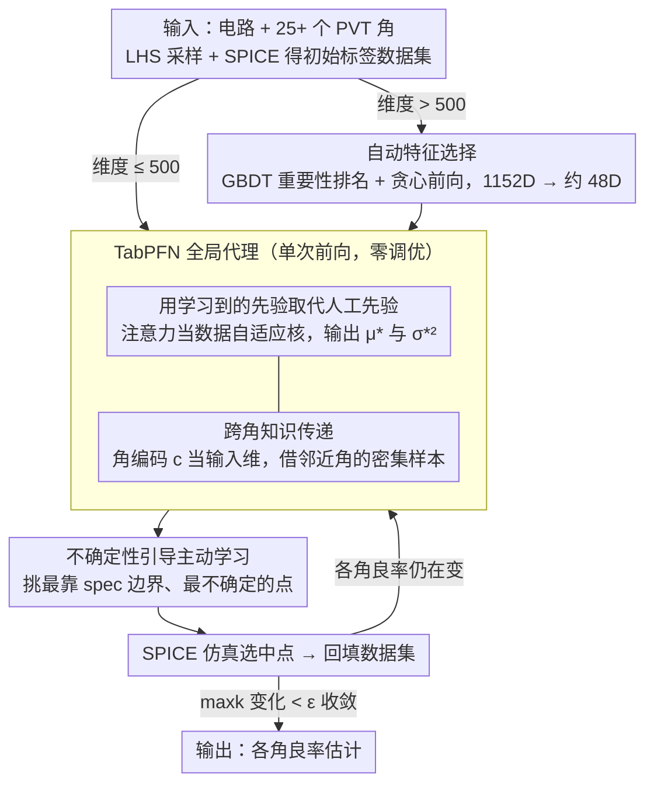

# Breaking the Tuning Barrier: Zero-Hyperparameters Yield Multi-Corner Analysis Via Learned Priors

**会议**: CVPR 2026  
**arXiv**: [2603.13092](https://arxiv.org/abs/2603.13092)  
**代码**: 无  
**领域**: 自监督学习 / 集成电路良率分析（EDA）  
**关键词**: yield analysis, foundation model, TabPFN, in-context learning, zero hyperparameter

## 一句话总结
用 TabPFN 基础模型的学习先验替代人工设计先验，实现零超参数调优的多角（PVT）良率分析，结合自动特征选择（1152D→48D）和不确定性引导主动学习，在工业级 SRAM 基准上达到 SOTA 精度（MRE 低至 0.11%）同时减少 10× 以上验证成本。

## 研究背景与动机
**领域现状**：集成电路良率多角分析 (YMCA) 要求在 25+ 个 PVT（工艺-电压-温度）角下验证电路，产生 $O(K \times N)$ 的组合仿真成本，其中 $K$ 为角数，$N > 10^4$。对 32 晶体管 SRAM 跨 25 角意味着超过 25,000 次 SPICE 仿真，需数周计算。

**现有痛点**：现有加速方法面临根本性权衡——简单模型（如重要性采样 MNIS）实现自动化但无法处理非线性电路（**模型容量屏障**）；高级 AI 模型（GP、深度核、正则化流）能捕获复杂行为但需要数小时的超参数调优（**调优屏障**）。在 ±20% 超参数扰动下，SOTA 方法的误差从 19% 到 111% 剧烈波动。

**核心矛盾**：表达力 vs 自动化的不可能三角——方法要么实现自动化（IS），要么具有表达力（代理模型），但无法两者兼得。

**本文目标**：打破调优屏障——在不需要任何逐电路超参数调优的情况下，实现与调优后 SOTA 相当的良率分析精度。

**切入角度**：用元学习的学习先验替代人工设计先验。传统方法通过手工选择（GP 核、IS 高斯假设）编码先验，本文使用在数百万回归任务上预训练的 TabPFN 基础模型，通过单次前向传播实现上下文贝叶斯推断。

**核心 idea**：用 TabPFN 的注意力机制作为学习的非线性核，在零调优下自动适应每个电路并跨角传递知识，再结合自动特征选择和不确定性引导主动学习构成完整 YMCA pipeline。

## 方法详解

### 整体框架
论文要在 25+ 个 PVT 角下估计 SRAM 良率，但又不想为每个电路手调任何超参数。它把整套流程拼成一个闭环：先用拉丁超立方采样（LHS）抽一批过程参数并跑 SPICE 仿真拿到初始标签；如果参数维度超过 500，就先做一次自动特征选择把它压到 TabPFN 能吃的尺度；然后让 TabPFN 在已有样本上做一次上下文学习，直接给出每个待评估点的均值和方差；再用这个不确定性去挑下一批最值得仿真的样本，跑 SPICE、并回数据集；如此迭代到各角良率估计稳定为止。整条链路里真正贵的只有 SPICE 仿真，建模和采样决策都几乎零成本，而且没有一个旋钮需要人来拧。

### 关键设计

**1. 用学习到的先验取代人工先验：把"调核"这件事彻底删掉**

传统代理模型（尤其是高斯过程）的痛点在于先验是人手工编进去的——GP 要为每一维特征优化一个核长度参数，100 维电路就得优化 100+ 个超参，而且最后只取一个点估计 $\boldsymbol{\theta}^*$，连超参本身的不确定性都丢了。本文换成 TabPFN：一个在数百万个合成回归任务上预训练好的 Transformer，预训练目标是 $\Theta^* = \arg\min_\Theta \mathbb{E}_{f \sim p_{\text{meta}}(f)}[\mathbb{E}_{D_{\text{train}} \sim f}[\mathbb{E}_{(\mathbf{z}^*, y^*) \sim f}[-\log p_\Theta(y^*|\mathbf{z}^*, D_{\text{train}})]]]$，本质是在元分布上学会"看一眼训练集就给出后验预测"。到了电路推理阶段，它直接吃当前电路的数据吐出预测分布

$$(\mu^*, (\sigma^*)^2) = \mathcal{G}_{\Theta^*}(\mathbf{z}^*, D_{\text{circuit}})$$

一次前向传播完成，没有梯度下降、没有超参搜索。之所以有效，是因为 TabPFN 的注意力权重 $k_{\text{learned}}(\mathbf{z}^*, \mathbf{z}_i; D_{\text{circuit}}) \propto \exp(\frac{\mathbf{Q}(\mathbf{z}^*)^T \mathbf{K}(\mathbf{z}_i)}{\sqrt{d_k}})$ 起的正是 GP 核的作用，只不过这个"核"是数据自适应、随每个电路自动重塑的学习核，先验不再靠人猜，而是从海量任务里学来的。

**2. 跨角知识传递：让密集采样的角去补稀疏采样的角**

同一电路在不同 PVT 条件下共享底层物理机制，如果给每个角单独建一个模型，既浪费信息又要维护 $K$ 个模型。本文把角编码当成一个普通输入维度，构造联合输入 $\mathbf{z} = [\mathbf{x}_\mathcal{S}; c]$（稀疏过程参数拼上角编码 $c$），训一个全局代理 $\hat{f}(\mathbf{x}_\mathcal{S}, c)$。注意力机制会自动给相关角 $c_k \approx c_j$ 的训练样本加权，于是一个采样很少的角能借到邻近角的密集样本。这种"借用"可以用有效样本量量化：$n_{\text{eff}}(\mathbf{x}^*, c_2) = \sum_{i} \alpha_i^2 \geq n_2$，当角之间高度相关时，$n_{\text{eff}}$ 会远大于该角自身的样本数 $n_2$——这正是全局建模优于逐角独立建模的根本原因。

**3. 不确定性引导主动学习：把昂贵的 SPICE 仿真花在最该花的点上**

TabPFN 给的不是点估计、而是带方差的后验预测，这份几乎零成本的校准不确定性 $\sigma(\mathbf{z})$ 正好拿来做主动学习——把有限的仿真预算集中到对良率估计信息增益最大的地方，而不是均匀乱撒。本文为每个角设计一个获取函数 $\alpha_k(\mathbf{x}) = \sigma(\mathbf{x}, c_k) \cdot \phi\!\left(\frac{\hat{f}(\mathbf{x}, c_k) - \text{Spec}_k}{\sigma(\mathbf{x}, c_k)}\right)$：第一项偏好模型最不确定的区域，第二项偏好最靠近规格边界 $\text{Spec}_k$ 的点——因为良率取决于有没有踩过 spec 线，边界附近的样本最能改变良率估计。多角时取联合获取 $\alpha(\mathbf{x}) = \max_k \alpha_k(\mathbf{x})$ 同时优化所有角。选中的点跑 SPICE、回填数据集后 TabPFN 再做一次前向，如此闭环。正因为 TabPFN 从约 100 个样本起就能给出像样预测，主动学习能从一开始就有效细化、让误差单调下降，而不像传统代理要先花几百样本把模型调到能用才开始收益。

**4. 自动特征选择：先把维度压到 TabPFN 装得下**

TabPFN 当前只能处理约 500 维以内的特征，而工业电路的参数空间可达 1152 维，所以需要一道无人值守的压缩。本文利用电路物理的固有稀疏性——性能往往只由少数关键晶体管决定，而非全部参数——用默认配置的 LightGBM 训一个 GBDT 拿到特征重要性排名，再贪心前向搜索 $R^2$ 最优的子集 $\mathcal{S}^* = \arg\max_k R^2(\mathcal{S}_k)$，把 1152D 压到约 48D。关键是这一步同样零调优：GBDT 用固定默认配置，批量粒度 $B=10$ 是不敏感参数，因此整条 pipeline 从特征筛选到最终推理都不需要任何逐电路的手动调参。

### 损失函数 / 训练策略
本文没有可训练的损失——TabPFN 预训练后全程冻结，所谓训练其实就是上面设计 3 的主动学习闭环：每轮挑点、跑 SPICE、回填数据集、再前向，直到所有角的良率估计逐轮变化都小于阈值即停：$\max_k |\hat{Y}_k^{(t)} - \hat{Y}_k^{(t-1)}| < \epsilon$。每轮真正的开销几乎全在 SPICE 仿真（分钟到小时级），TabPFN 推理与获取函数优化都是秒级。

## 实验关键数据

### 主实验
8×2 SRAM 各方法跨 PVT 角的良率预测 (MRE %):

| 方法 | TT | FF | SF | FS | SS | 平均 MRE |
|------|----|----|----|----|----|----|
| BI-BD | 0.34 | 0.20 | 0.89 | 0 | 0 | 低 |
| BI-BC | 1.95 | 0.61 | 9.73 | 0 | 0 | 高 |
| OPT | 1.61 | 0.40 | 100+ | 0 | 0 | 极高 |
| **Proposed** | **0.23** | **0.01** | **0.88** | **0** | **0** | **0.22** |

### 消融实验

| 配置 | 关键指标 | 说明 |
|------|---------|------|
| TabPFN vs GP (100样本) | ~5% vs ~30% MAE | 小样本下学习先验远优于 GP |
| TabPFN vs MLP (100样本) | ~5% vs ~45% MAE | MLP 在小数据下表现最差 |
| 有跨角传递 vs 无 | >70% 误差降低 | 跨角知识传递是关键 |
| 超参数扰动 ±20% | 本文稳定 vs 基线波动 | 零调优带来鲁棒性 |

### 关键发现
- OPT 在 SF 角出现 100% 以上的误差，而本文方法仅 0.88%
- 在小样本区间（<1000 样本），TabPFN 的数据效率显著优于所有调优后的传统代理模型
- 特征选择将 1152D 压缩为约 48D，单次运行耗时不到一分钟
- 计算成本以 SPICE 仿真为主（分钟到小时），TabPFN 推理仅需秒级

## 亮点与洞察
- "调优屏障"的形式化定义精准——通过表 1 的超参数扰动实验量化了现有方法的脆弱性
- 将 Transformer 注意力理解为"learnable nonlinear kernel"很有洞察力
- 零调优承诺不是空谈——整个 pipeline 从特征选择到推理确实没有需要手动调的超参数
- 跨角知识传递的有效样本量分析优雅地解释了为什么全局建模优于独立建模

## 局限与展望
- TabPFN 当前限制 500 维特征，需要特征选择作为预处理——未来更大的 TabPFN 可直接处理
- 评估仅在 SRAM 基准上，未扩展到其他电路类型（如模拟电路、混合信号）
- 主动学习的批量大小和多样性参数仍是固定设置
- TabPFN 的预训练数据分布是否覆盖电路仿真的特定模式需要进一步验证

## 相关工作与启发
- **MNIS**：工业标准重要性采样，自动化但模型容量受限
- **TabPFN (Hollmann et al.)**：在表格回归任务上的基础模型，本文将其引入电路分析
- **OPT (Liu et al.)**：复杂模型驱动的良率分析，能力强但需大量调优
- 启发：TabPFN 作为通用的"零调优回归引擎"可推广到任何需要快速代理建模的工程优化场景

## 评分
- 新颖性: ⭐⭐⭐⭐ 将基础模型引入电路良率分析打破调优屏障，视角新颖
- 实验充分度: ⭐⭐⭐⭐ 工业级 SRAM 基准，多角多电路规模评估，调优敏感性分析有力
- 写作质量: ⭐⭐⭐⭐⭐ "调优屏障"概念立论清晰，从理论到实验逻辑严密
- 价值: ⭐⭐⭐⭐ 零调优特性对工业部署有实际价值，有望推动 AI 在 EDA 中的真正落地

<!-- RELATED:START -->

## 相关论文

- [\[CVPR 2026\] Robustness of Vision Foundation Models to Common Perturbations](robustness_of_vision_foundation_models_to_common_perturbations.md)
- [\[CVPR 2026\] Text-Phase Synergy Network with Dual Priors for Unsupervised Cross-Domain Image Retrieval](text-phase_synergy_network_with_dual_priors_for_unsupervised_cross-domain_image_.md)
- [\[CVPR 2026\] GeoBridge: A Semantic-Anchored Multi-View Foundation Model for Geo-Localization](geobridge_semantic-anchored_multi-view_foundation_model_for_geo-localization.md)
- [\[CVPR 2026\] TeFlow: Enabling Multi-frame Supervision for Self-Supervised Feed-forward Scene Flow Estimation](teflow_enabling_multi-frame_supervision_for_self-supervised_feed-forward_scene_f.md)
- [\[CVPR 2026\] Group-DINOmics: Incorporating People Dynamics into DINO for Self-supervised Group Activity Feature Learning](group_dinomics_incorporating_people_dynamics_into_dino_for_self_supervised_group_activity_feature_learning.md)

<!-- RELATED:END -->
