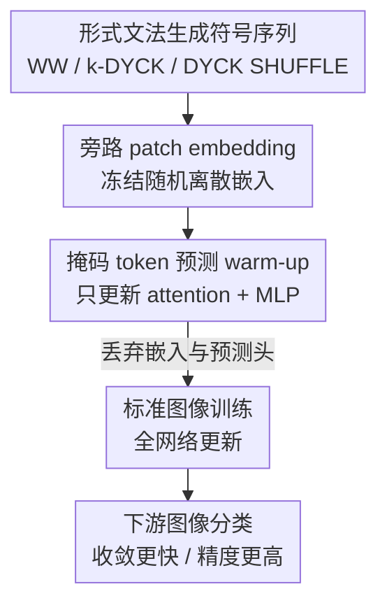

# Can You Learn to See Without Images? Procedural Warm-Up for Vision Transformers

**会议**: CVPR 2026  
**论文**: [CVF Open Access](https://openaccess.thecvf.com/content/CVPR2026/html/Shinnick_Can_You_Learn_to_See_Without_Images_Procedural_Warm-Up_for_CVPR_2026_paper.html)  
**代码**: https://zlshinnick.github.io/procedural-pretraining-page/  
**领域**: 自监督 / 表示学习  
**关键词**: 程序化预训练, 形式文法, ViT 初始化, 归纳偏置, 数据高效  

## 一句话总结
在 ViT 正式看图像之前，先用形式文法生成的「平衡括号」之类**纯符号、无任何视觉内容**的序列做一段轻量 masked-token 预训练（warm-up），逼模型内化栈式层级、长程依赖这类通用计算机制；之后再接标准图像训练，仅花 1% 训练预算就能在 ImageNet-1K 上把 top-1 提升 +1.72%，相当于替代了 28% 的图像数据。

## 研究背景与动机
**领域现状**：Transformer 之所以能跨语言、视觉、语音通吃，被认为是因为它实现了某些**跨模态通用的归纳偏置**。在 LLM 一侧，已有工作发现用形式文法采样出的「程序化数据」（procedural data，没有任何语义、只有结构）做预训练，能提升大模型的收敛速度和推理能力；甚至有研究观察到纯文本训练的模型也能处理视觉信息。这些都暗示存在**与模态无关的计算机制**。

**现有痛点**：视觉这边的「抽象数据预训练」走的是另一条路——FractalDB、轮廓图、波纹、结构化噪声等，本质都是**合成图像**，还是要去模仿自然图像的二维统计特性，目的多半是替代真实数据来规避隐私/公平问题。它们没跳出「视觉」这个框，因此提供的信号和真实图像高度重叠，是替代品而非补充。

**核心矛盾**：如果「在图像上推理」本质上是个**推理问题而非图像问题**，那么强行让预训练数据长得像图像，反而限制了模型学到更通用结构的可能；而现有的结构化初始化（如 Mimetic）又只动 attention 权重，作用面太窄。

**本文目标**：能不能让视觉模型「不看图也学会看」——用**完全没有二维结构、不模仿任何图像属性**的纯符号数据，给 ViT 注入对后续视觉任务有用的通用归纳偏置。

**切入角度**：把 LLM 上验证过的「程序化 warm-up」搬到 ViT。形式文法（如平衡括号 Dyck 语言）能廉价生成带有**精确层级依赖**的序列，识别这些语言需要栈、有限状态机等通用计算机器——而这恰恰是模型可以跨模态复用的东西。

**核心 idea**：在标准图像训练之前，插入一段**旁路 patch embedding、直接用符号序列做 masked-token 预测**的 warm-up，把模型逼成一个更好的初始化，再丢掉符号相关的部件去训图像。

## 方法详解

### 整体框架
方法是一条三阶段串行的管线：**①用形式文法在线生成符号序列 → ②冻结嵌入、做 masked-token warm-up 预训练 → ③丢弃符号部件、转标准图像训练**。输入是几行代码就能生成的抽象 token 序列（如 `( [ ] ) < >`），中间产物是一组「被 warm-up 过」的 ViT 权重，输出是在图像分类上收敛更快、精度更高的模型。整个 warm-up 只占总训练预算的约 1%，可以一次性摊销到后续任意多个下游模型上，因此它被定位成「标准随机初始化 / 结构化初始化的替代品」。

### 关键设计

**1. 用形式文法生成「有结构、无语义」的符号数据：让 warm-up 信号是纯计算机制**

痛点是：抽象图像数据始终在模仿视觉，信号和真实图像重叠。本文索性彻底抛开二维结构，用 Chomsky 层级里三种代表性文法采样序列（见下表），让数据只携带**纯粹的结构依赖**：

| 文法 | 类型 | 示例 | 结构特性 |
|------|------|------|----------|
| WW | 正则 | `a b c a b c` | 全局一一对应（字符串+其精确拷贝） |
| k-DYCK | 上下文无关 | `( [ ] ) < >` | 层级、栈式嵌套依赖 |
| k-DYCK SHUFFLE | 上下文相关 | `( [ ) < ] >` | 交叉、交织依赖 |

识别这三类语言所需的计算机器逐级升高：正则语言用有限状态自动机即可，上下文无关语言需要**栈**来捕捉层级嵌套，上下文相关语言还要表达交叉串行依赖。词表固定 128 个 token（Dyck 取 $k=64$，即 64 种括号对），每条序列长度固定为 $N = H \times W$ 以匹配 ViT 的固定 token 数。生成成本几乎为零，可在线即时采样。

**2. 旁路 patch embedding + 冻结随机离散嵌入：强迫知识进 attention/MLP 而非嵌入层**

ViT 开头本是一个把图像 patch 线性投影成特征向量的 patch embedding。符号数据是离散词表，作者改用 LLM 式的**离散查表嵌入**，但关键在于把它**冻结成随机向量**——这样词表里各 token 被分配到近似正交的向量。位置编码同样在 warm-up 阶段保持冻结。

这一步是整个方法的「逼迫」机制：如果嵌入可学，模型完全可以靠调嵌入层走捷径解掉 masked-token 任务，根本不碰中间的计算结构。冻结嵌入堵死这条捷径，使得唯一能降低损失的途径就是**让 attention 和 MLP 真正学会跟踪栈深、识别括号类型**，从而把通用计算机制压进网络主体。

**3. 掩码结构性 token 的预测目标：用「解出生成算法」当监督信号**

warm-up 用标准 masked-token 目标，配一个 token 预测头。掩码策略是**专挑结构信息量大的 token 来遮**：Dyck 系列遮闭括号、WW 遮重复的那一半。对 k-DYCK 和 WW 用损失掩码保证每个样本有**唯一合法补全**；而 k-DYCK SHUFFLE 一个序列可能有多个合法补全（如 `( [ ? < ? >` 可补成 `( [ ] < ) >` 或 `( [ ) < ] >`），作者用 teacher-forcing 监督其中一个合法续写——此时模型**无法达到 100% 准确率**，但这恰好驱动它去学会追踪栈深和括号类型、给所有合法续写赋非零概率。解这些任务等价于实现层级组合、长程依赖、栈操作这些通用机制。整个 warm-up 阶段冻结嵌入、只更新 attention 与 MLP。

**4. 丢弃符号部件、转标准图像训练：把 warm-up 当作一种初始化**

warm-up 结束后，符号专用的 token 嵌入和预测头被**整体丢弃**，换回视觉 patch embedding 和分类头，然后用标准学习率、超参对**整个网络**做常规图像训练。因为只有「中间的 attention/MLP 权重结构」被带过去，warm-up 后的模型就能和随机初始化、Mimetic 初始化、FractalDB warm-up 放在同一框架下公平比较——它本质上提供的是一组更好的**初始权重**，而非一个图像预训练的 head-start。

## 实验关键数据

### 主实验
ViT-B/16 跑 ImageNet-1K，ViT-T/16 跑小数据集；warm-up 用 k-DYCK（k=64），预算固定为 1% 的图像样本量。绿色下标是相对默认初始化的绝对提升。

| 方法 | ImageNet-1K | Tiny-IN | Food-101 | CIFAR-10 | CIFAR-100 | STL-10 |
|------|-------------|---------|----------|----------|-----------|--------|
| 默认随机初始化 | 77.49 | 55.42 | 74.52 | 91.29 | 68.52 | 60.52 |
| Mimetic 初始化 | 78.68 | 57.20 | 79.21 | 92.89 | 70.72 | 65.37 |
| FractalDB warm-up | 78.06 | 55.17 | 74.25 | 88.98 | 64.61 | 58.62 |
| **程序化 warm-up（本文）** | **79.21** (+1.72) | **58.20** (+2.78) | **79.47** (+4.95) | 92.81 (+1.52) | **71.98** (+3.46) | **66.48** (+5.96) |

平均比默认初始化高 +3.4%。值得注意的是它**全面压过 FractalDB**——后者还是视觉数据、专门为视觉结构设计，本文却用「跟图像毫无对应关系」的更通用符号数据反而更好。

ImageNet-1K 上还测了「程序化 warm-up + 大规模预训练再微调」的叠加效果（additive 设定，E2≈385M 图像样本固定，E1≈3.8M 符号样本）：

| 方法 (+ImageNet-1K 预训练) | Tiny-IN | Food-101 | CIFAR-10 | CIFAR-100 | STL-10 |
|------|---------|----------|----------|-----------|--------|
| 随机初始化 | 86.59 | 89.64 | 98.59 | 87.54 | 98.55 |
| Mimetic | 87.29 | 90.74 | 98.68 | 88.78 | 98.81 |
| FractalDB | 88.42 | 90.13 | 98.41 | 88.35 | 98.46 |
| **本文** | 87.93 | **90.79** | 98.68 | **89.20** | 98.66 |

增益在经过大规模预训练 + 微调后**依然存活**，说明程序化数据提供的是和自然图像**互补**的信号，而非被覆盖的 head-start。在 substitutive 设定下，用 1% 预算的 3.8M 符号样本替换图像，可在精度持平的前提下少用 28%（约 108M 张）真实图像。

### 消融实验
全部在 CIFAR-100、k-DYCK(k=64) 基线上单变量改动：

| 配置 | CIFAR-100 (%) | 说明 |
|------|---------------|------|
| 随机初始化 | 68.52 | 基线 |
| WW（正则） | 66.44 | 无嵌套结构，反而掉到基线以下 |
| k-DYCK（上下文无关） | **71.98** | 栈式层级，增益最强 |
| k-DYCK SHUFFLE（上下文相关） | 70.11 | 结构过度交织，反而弱于 Dyck |
| k-DYCK 序列内 token 打乱 | 67.22 | 破坏层级依赖后跌破随机初始化 |
| k-DYCK 全部权重打乱 | 69.51 | 只保留权重幅度分布、毁掉结构 → 增益几乎全失 |
| k-DYCK attention 权重打乱 | 70.57 | 信息分布在全网，非单一组件 |
| k-DYCK MLP 权重打乱 | 70.71 | 同上，MLP 也承载了归纳偏置 |
| 只迁移前 4 层 | 68.91 | 早层几乎无贡献 |
| 只迁移中间 4 层 | 70.19 | 中层有限贡献 |
| 只迁移最后 4 层 | 71.66 | **深层贡献几乎全部增益** |

### 关键发现
- **层级结构是增益来源**：上下文无关的 Dyck（需要栈）最强，纯重复的正则 WW 完全无效甚至有害；把序列内 token 打乱（保留分布、毁掉顺序）会跌破随机初始化——证明有用的是**精确的层级依赖**，不是 token 频率或共现。
- **作用面与标准视觉预训练相反**：增益靠**精确的权重结构**（打乱权重值即失效），且 attention 与 MLP 都参与（只动 attention 的 Mimetic 复刻不出来）；更反直觉的是增益**几乎全集中在深层**——而标准视觉预训练公认主要受益于早层低级特征。这强力支持「程序化 warm-up 提供了一种质上不同的训练信号」。
- **warm-up 时长有甜点**：步数太短或太长都掉点，过度预训练会让模型对符号数据过拟合、损害对视觉任务的适应性。

## 亮点与洞察
- **「看图本质是推理」这个 reframe 很漂亮**：作者直接论断 reasoning over images 首先是 reasoning problem，于是敢于彻底丢掉二维约束，用平衡括号去训视觉模型——这是整篇论文最让人「啊哈」的认知跳跃。
- **冻结随机嵌入是个可复用 trick**：想逼模型把知识学进网络主体而非走嵌入捷径，把输入嵌入冻成近似正交的随机向量是个干净的做法，可迁移到任何「想控制知识落点」的探针/预训练实验。
- **深层受益的反常现象**有独立的科学价值：它把「程序化 warm-up ≠ 视觉预训练 head-start」从口号变成了可观测证据，也给「归纳偏置如何在 Transformer 内传播」开了一个有趣的研究口子。
- **几乎零成本**：数据几行代码在线生成、warm-up 只占 1% 预算、且可摊销到无数下游模型，性价比极高。

## 局限与展望
- 作者承认：(1) 只验证了标准 ViT，没测 Swin、XCiT 等其它架构；(2) 程序化生成器只试了很有限的几种（形式文法），元胞自动机等大量替代方案未探索；(3) 只在图像分类上评估，分割、OOD 泛化、多模态等场景未知。
- 自己发现的局限：主实验小数据集多用 ViT-T、增益绝对值可观但部分场景（如 CIFAR-10）已接近 Mimetic，**warm-up 相对结构化初始化的优势在简单任务上会被压缩**；substitutive 的「28% 数据等价」是在特定预算配比下测得，外推到更大规模需谨慎 ⚠️。
- 改进思路：作者提出一个有野心的方向——既然增益来自精确权重结构、而生成算法的 Kolmogorov 复杂度极低，理论上或许能像 Mimetic 那样给出 procedural warm-up 权重的**闭式解**，彻底省掉 warm-up 这步训练。

## 相关工作与启发
- **vs Mimetic 初始化**：Mimetic 只在 attention 矩阵里造对角结构、只动注意力层；本文作用于 attention + MLP 全网且主要在深层，提供的归纳偏置更丰富，主实验全面更强。
- **vs FractalDB warm-up**：FractalDB 用程序化生成的**视觉**数据（分形图），本意是替代真实图像；本文用程序化**符号**数据做互补。在 sample-matched 公平比较下，本文用非视觉数据反而胜过为视觉设计的 FractalDB，说明「更通用的结构」比「模仿视觉」更值钱。
- **vs LLM 程序化预训练 [19, 22, 44]**：本文是把 LLM 上验证过的「形式文法 warm-up」首次系统迁移到 ViT，并贡献了视觉侧独有的分析（深层受益、attention+MLP 协同），把这一思路扩成跨模态的通用预训练范式。

## 评分
- 新颖性: ⭐⭐⭐⭐⭐ 「不看图学会看」的 reframe + 把符号程序化预训练首次系统搬到 ViT，概念上很大胆
- 实验充分度: ⭐⭐⭐⭐ 多数据集 + 叠加大规模预训练 + 丰富消融（语言类型/顺序/权重结构/逐层），但限于分类、单一架构
- 写作质量: ⭐⭐⭐⭐⭐ 问题驱动、每个实验回答一个明确假设，take-away 清晰
- 价值: ⭐⭐⭐⭐ 指向数据高效、模态无关的预训练新路径，且几乎零成本，启发性强

<!-- RELATED:START -->

## 相关论文

- [\[CVPR 2026\] Vision Transformers Need More Than Registers](vision_transformers_need_more_than_registers.md)
- [\[CVPR 2025\] Transformers without Normalization](../../CVPR2025/self_supervised/transformers_without_normalization.md)
- [\[CVPR 2026\] A Stitch in Time: Learning Procedural Workflow via Self-Supervised Plackett-Luce Ranking](a_stitch_in_time_learning_procedural_workflow_via_self_supervised_plackett_luce_r.md)
- [\[CVPR 2026\] Learning to See Through a Baby's Eyes: Early Visual Diets Enable Robust Visual Intelligence in Humans and Machines](learning_to_see_through_a_babys_eyes_early_visual_diets_enable_robust_visual_int.md)
- [\[CVPR 2026\] DiverseDiT: Towards Diverse Representation Learning in Diffusion Transformers](diversedit_towards_diverse_representation_learning_in_diffusion_transformers.md)

<!-- RELATED:END -->
