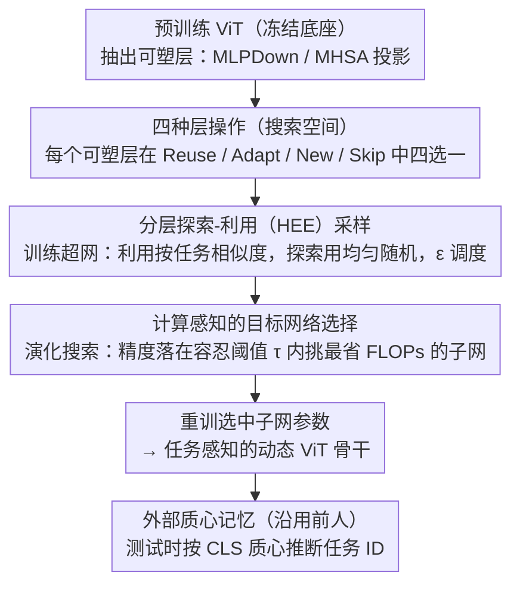

# CHEEM: Continual Learning by Reuse, New, Adapt and Skip -- A Hierarchical Exploration-Exploitation Approach

**会议**: CVPR 2026  
**arXiv**: [2303.08250](https://arxiv.org/abs/2303.08250)  
**代码**: [GitHub](https://github.com/savadikarc/cheem)  
**领域**:自监督学习
**关键词**: 持续学习, 无样本类增量学习, 神经架构搜索, 层间操作, Vision Transformer

## 一句话总结

提出 CHEEM 框架，通过分层探索-利用采样的 NAS 自动学习任务感知的动态 ViT 骨干——在每一层选择 Reuse/New/Adapt/Skip 四种操作——在 MTIL 和 VDD 两个挑战性持续学习基准上显著超越提示类方法，接近全量微调上界。

## 研究背景与动机

**领域现状**：基于 ViT 的持续学习取得进展，主要分为提示类方法（冻结骨干+学习提示）和参数调整类方法（适配器/掩码）。

**现有痛点**：(a) 提示类方法保持稳定性但缺乏可塑性——冻结骨干无法适应与预训练显著不同的任务；(b) 参数调整类方法每层统一操作，忽略了任务难度/相似度的差异——简单任务不需要所有层，困难任务可能需要全新层。

**核心矛盾**：现有方法将计算固定或递增，无论任务难度如何——没有 Skip（简化模型处理简单任务）和 New（引入全新层处理极不相似任务）操作。

**本文目标**：学习任务感知的动态模型结构，自动在层间分配 Reuse/Adapt/New/Skip 操作。

**切入角度**：将持续学习视为持续记忆学习问题，由内部参数记忆（NAS 驱动的动态骨干）和外部质心记忆（任务 ID 推断）组成。

**核心 idea**：分层探索-利用（HEE）采样的 NAS，基于任务相似性自动选择层操作。

## 方法详解

### 整体框架

CHEEM 把持续学习重新表述成一个"持续记忆学习"问题：内部参数记忆是一个会随任务生长的动态 ViT 骨干，外部质心记忆负责在测试时推断样本属于哪个任务。真正要解决的核心问题是——面对一串难度、与预训练分布相似度都各不相同的任务，到底该在骨干的哪些层复用旧知识、哪些层微调、哪些层另起炉灶、哪些层干脆跳过。现有方法要么把骨干冻死（提示类），要么对每一层一视同仁地加适配器（参数调整类），都没有"按层、按任务难度动态决定"这一步。

它以一个预训练 ViT 为底座，把每个 block 里的 MLPDown 层和 MHSA 投影层挑出来作为"可塑组件"。每来一个新任务，流程走四步：先围绕这些可塑组件搭出一个包含全部候选操作的超网（搜索空间）；再用分层探索-利用（HEE）采样把这个超网训练好；接着做一次计算感知的演化搜索，从超网里挑出一个具体子网当作目标网络；最后把目标网络里的可学习参数从头重训一遍定稿。测试时再靠一块沿用前人的外部质心记忆推断样本属于哪个任务、调用对应骨干。

### 关键设计

**1. 四种层操作：把"复用 / 微调"扩展到"新建 / 跳过"**

每个可塑层都可以从四种操作里选一种。Reuse 直接拿旧任务训好的层参数过来用，做的是知识迁移；Adapt 在旧参数上叠一个 LoRA 低秩分支，$\theta_l^{(3,)} = \theta_l^{(2,)} + B_l \cdot A_l$，只学少量增量就完成微调。这两个是现有方法的常规选项。真正被忽视、也是 CHEEM 的关键，是另外两个：New 引入一个随机初始化的全新层，专门应对与旧任务差异极大、复用反而拖后腿的情况；Skip 则整块跳过这个 FFN / MHSA block，让简单任务用更浅的网络就够了。直观例子是从 ImageNet 迁到 MNIST——任务太简单，大量层可以直接 Skip 掉，既省算力又避免过拟合。有了 New 和 Skip，模型才第一次具备"既能向上生长、也能向下剪枝"的完整自由度。

**2. 分层探索-利用（HEE）采样：用任务相似度引导该复用谁、何时冒险**

超网里每层有四种操作、还可能有多个旧任务的专家可复用，搜索空间巨大，纯均匀随机采样会浪费在明显不靠谱的组合上，纯贪心利用又容易困在局部最优。HEE 的做法是把"利用"和"探索"按 epoch 调度混在一起。利用这一侧基于任务相似度采样：对每层用归一化余弦相似度 $S_l^{i,t} = \text{NormCosine}(\mu_l^i, \mu_l^{i \to t})$ 衡量旧专家 $i$ 和新任务 $t$ 有多像（$\mu$ 取 CLS token 的均值表示），把相似度变成一个分类分布。采样分两级走：第一级在"各个旧任务"和一个把 New / Skip 打包在一起的 Aux 选项之间选；第二级再用一个 Bernoulli 以概率 $\rho_i$ 决定 Reuse、以 $1-\rho_i$ 决定 Adapt。探索这一侧就是均匀随机采样，给冷门组合一个被看到的机会。两侧用一个概率开关切换：超网训练阶段偏利用（探索概率 $\epsilon_1=0.3$），后面的演化搜索阶段偏探索（$\epsilon_2=0.5$），让搜索先快速收敛到相似度指向的区域、再适度跳出去找更优解。

**3. 计算感知的目标网络选择：同等精度下挑最省算力的那个**

超网训完后要从中选出一个具体子网。如果只盯着最高精度，往往会选到又重又只多涨零点几个点的结构。CHEEM 先设一个性能容忍阈值 $\tau=2\%$：把精度落在最优解 $2\%$ 以内的候选都视为"同组"，在同组里按 FLOPs 升序排，优先选最轻量的那个。整个挑选通过交叉和变异的演化搜索完成，选定后再把可学习参数从头重训一遍。这样换来的结构在精度几乎不掉的前提下显著更省算力。

**4. Figure of Merit (FoM)：用一个数同时衡量精度差距与算力**

持续学习方法之间互相比较时，精度和计算量常常是此消彼长的，单看任一项都不公平。论文提出 FoM 把两者合成一个数：

$$\text{FoM}(m,n) = \frac{A\mathbb{A}^{UB} - A\mathbb{A}^n}{A\mathbb{A}^{UB} - A\mathbb{A}^m} \cdot \frac{\text{FLOPs}^n}{\text{FLOPs}^m}$$

前一项比较方法 $m$、$n$ 各自离全量微调上界 $A\mathbb{A}^{UB}$ 的精度差距，后一项比较两者的算力开销。FoM > 1 就表示 $m$ 在"精度-计算"综合权衡上优于 $n$，给社区提供了一个能横向比较的统一标尺。

### 一个完整示例

拿两个难度悬殊的新任务走一遍，能看清 HEE 实际怎么"因任务制宜"。来一个简单任务 Caltech101：逐层算它与各旧专家的 CLS-token 相似度，发现浅层信息已经够用，于是 HEE 在多层把概率压向 Aux 里的 Skip——最终搜出的结构直接跳过了 5 个 MLP 块，用一个明显更浅的网络就达标。换成细粒度、与预训练分布差异大的困难任务 FGVC Aircraft：相似度普遍偏低，单纯复用扛不住，HEE 就在不同层分别采到 New（补全新容量）、Adapt（在可复用处做低秩微调）和少量 Skip，搜出一个 New + Adapt + Skip 混合的复杂结构。两个任务从同一个超网里长出截然不同的子网，且"简单任务轻、困难任务重"的分配与人的直觉一致——这正是四操作 + HEE 想要的任务感知效果。

## 实验关键数据

### 主实验 — CHEEM vs 上界

| 方法 | MTIL (ViT-B) | MTIL (DEiT-T) | VDD (ViT-B) | VDD (DEiT-T) |
|------|-------------|---------------|-------------|---------------|
| Upper Bound (Full-FT) | 88.1 | 75.3 | 88.7 | 76.21 |
| CHEEM | 85.9 | 74.5 | 86.7 | 76.18 |
| 差距 | -2.2 | -0.8 | -2.0 | **-0.03** |

### 消融实验 — FoM 对比

| 方法 | MTIL ViT-B | MTIL DEiT-T | VDD ViT-B | VDD DEiT-T |
|------|-----------|-------------|-----------|------------|
| CODA-P | 24.2 | 84.6 | 35.9 | 2811.3 |
| S-Prompts | 3.2 | 10.5 | 5.5 | 338.8 |
| LoRA-CL | 1.7 | 5.7 | 1.5 | 73.6 |
| Tuna | 50.6 | 242.4 | 58.6 | 4538.8 |

所有 FoM > 1 表明 CHEEM 在精度-计算综合指标上优于所有基线。

### 关键发现

1. **任务感知结构语义合理**：Caltech101（简单任务）Skip 5 个 MLP 块；FGVC Aircraft（细粒度困难任务）使用 New + Adapt + Skip 组合。
2. **DEiT-Tiny 上 VDD 几乎无损**：76.18 vs 76.21（Full-FT），差距仅 0.03%，说明 CHEEM 在小模型上也能充分挖掘容量。
3. **LoRA-CL（CHEEM 的特例，所有层 Adapt）**在 ViT-Base 上接近 CHEEM（FoM 1.7），但 DEiT-Tiny 上差距大（FoM 73.6），说明小模型需要 New/Skip 操作。
4. 提示类方法在 DEiT-Tiny 上几乎失效（CODA-P 仅 5.6% Acc），因为其受限于骨干容量。

## 亮点与洞察

- 首次在持续学习中完整实现 Reuse/New/Adapt/Skip 四操作，形成从"学习复用"到"学习成长"到"学习剪枝"的完整谱系。
- 学到的任务结构非常可解释——简单任务轻量、困难任务复杂，与人类直觉一致。
- HEE 采样巧妙利用 CLS token 相似度作为任务相似性代理。
- FoM 指标为持续学习社区提供了综合评价工具。

## 局限与展望

- NAS 搜索增加训练时间，虽然单次任务开销可控但多任务累积不可忽视。
- 外部任务质心记忆（任务 ID 推断）沿用前人工作，与内部记忆的联合优化未深入。
- 仅在分类任务上验证，未推广到检测/分割等更复杂视觉任务。
- New 操作引入全新参数，在任务极多时可能导致参数增长过快。

## 相关工作与启发

- 与 L2G 方法（DARTS 驱动的 ConvNet 持续学习）思路相似，但 CHEEM 加入了 Skip 操作和 HEE 采样，针对 ViT 设计。
- 为"持续学习中自适应计算分配"这一开放问题提供了可行方案。
- HEE 采样可推广到其他需要平衡探索-利用的 NAS 场景。

## 评分

- 新颖性: ⭐⭐⭐⭐ 四操作+HEE采样的组合新颖，但各技术组件（NAS/LoRA/Skip）均为已有
- 实验充分度: ⭐⭐⭐⭐⭐ 两基准×两骨干×多基线+可解释结构分析
- 写作质量: ⭐⭐⭐⭐ 框架图清晰，但文章较长
- 价值: ⭐⭐⭐⭐ 在挑战性基准上显著超越提示类方法，接近全量微调

<!-- RELATED:START -->

## 相关论文

- [\[ICML 2026\] Learning to Extrapolate to New Tasks: A Relational Approach to Task Extrapolation](../../ICML2026/self_supervised/learning_to_extrapolate_to_new_tasks_a_relational_approach_to_task_extrapolation.md)
- [\[CVPR 2026\] Is Parameter Isolation Better for Prompt-Based Continual Learning?](is_parameter_isolation_better_for_prompt-based_continual_learning.md)
- [\[CVPR 2026\] HCL-FF: Hierarchical and Contrastive Learning for Forward-Forward Algorithm](hcl-ff_hierarchical_and_contrastive_learning_for_forward-forward_algorithm.md)
- [\[CVPR 2026\] Free-Grained Hierarchical Visual Recognition](free-grained_hierarchical_visual_recognition.md)
- [\[CVPR 2026\] An Optimal Transport-driven Approach for Cultivating Latent Space in Online Incremental Learning](an_optimal_transport_driven_approach_for_cultivating_latent_space_in_online_incr.md)

<!-- RELATED:END -->
