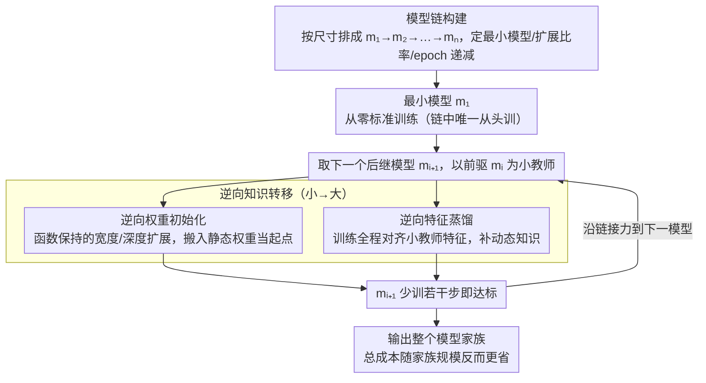

# Chain-of-Models Pre-Training: Rethinking Training Acceleration of Vision Foundation Models

**会议**: CVPR 2026  
**arXiv**: [2604.12391](https://arxiv.org/abs/2604.12391)  
**代码**: [https://github.com/deep-optimization/CoM-PT](https://github.com/deep-optimization/CoM-PT)  
**领域**: 自监督学习 / 训练加速  
**关键词**: 模型链, 预训练加速, 逆向知识转移, CLIP, 视觉基础模型

## 一句话总结

提出 Chain-of-Models Pre-Training (CoM-PT)，将视觉基础模型按大小排列形成"模型链"，通过从小到大的逆向知识转移（权重初始化+特征蒸馏）逐步加速训练，实现性能无损的训练加速且效率随模型家族规模增长而提升。

## 研究背景与动机

**领域现状**：视觉基础模型（VFM）的预训练代价极其高昂（如 ViT-L/14 在 LAION-2B 上需 1.2×10⁵ A100 GPU 小时），现有加速方法（混合精度、掩码建模、数据高效方法等）都是在单模型维度优化。

**现有痛点**：VFM 通常以模型家族形式预训练（不同大小满足不同部署场景），但标准的独立训练方式高度冗余——模型共享相同的优化目标、数据集和训练协议，产生的共同知识被反复学习。

**核心矛盾**：模型家族规模不断增长（更多专用模型尺寸 + 更大模型范围），独立训练的总成本线性增长，产生"承担不断升级的预训练成本"与"牺牲部署灵活性"的困境。

**本文目标**：实现随模型家族规模高效扩展的预训练加速。

**切入角度**：从微观看，大模型的训练成本是主要来源；从宏观看，独立训练的冗余是低效根源。同时解决这两个瓶颈的关键是实现家族内小到大的知识复用。

**核心 idea**：将模型家族按大小排序形成模型链，最小模型标准训练，后续模型通过逆向知识转移（小→大）加速预训练。

## 方法详解

### 整体框架

这篇论文要解决的是模型家族预训练的总成本问题：同一套数据、同一个目标，却要训练好几个不同大小的 VFM 去适配不同部署场景，而标准做法是每个都从头独立训练，导致那些共享的"共同知识"被反复学习。CoM-PT 的破局点是把家族里的模型按尺寸从小到大串成一条链 $C_M: m_1 \rightarrow m_2 \rightarrow \cdots \rightarrow m_n$——只有最小的 $m_1$ 老老实实从头标准训练，之后每个 $m_{i+1}$ 都站在前一个 $m_i$ 的肩膀上：把小模型已经学到的知识"逆向"转移过来当训练起点（注意方向是小→大，和常规知识蒸馏的大→小正好相反），从而省掉大量训练步数。这种转移走两条通道并行进行——参数空间的权重初始化和特征空间的特征蒸馏。

### 关键设计

**1. 逆向权重初始化：把小模型的权重直接搬进大模型当起点**

大模型最贵的地方在于从随机权重出发收敛慢。CoM-PT 索性复用已经训好的小模型权重作为大模型的初始值，用两种"函数保持"的扩展操作完成尺寸对接：宽度扩展时，把小教师的参数原样嵌入大学生的对应位置，只有多出来的那部分维度才随机初始化；深度扩展时，把每一层的权重复制一份充当它的后继层。"函数保持"的意思是扩展完成的那一刻，大模型的输出和小模型几乎一致——相当于让大模型从一个"已经会做这件事"的状态开始微调，而不是从零摸索，收敛自然快得多。不过这只搬走了某一时刻的权重快照，属于**静态**知识。

**2. 逆向特征蒸馏：补上权重搬不过来的动态知识**

光靠权重初始化不够，因为快照捕捉不到小模型在不同样本上的响应规律。逆向特征蒸馏在训练全程持续让大学生的特征去对齐小教师的特征：

$$\mathcal{L}_{IFD}(F^t, F^s) = \alpha \| F^t - \mathbf{T}(F^s) \|_2^2$$

其中特征变换 $\mathbf{T}(\cdot)$ 把学生特征投影到教师特征空间以对齐维度。在 CLIP 这种双塔结构里，视觉和文本两路特征都要蒸馏并取平均 $\hat{\mathcal{L}}_{IFD} = (\mathcal{L}_{IFD}(v^t,v^s) + \mathcal{L}_{IFD}(t^t,t^s))/2$。权重初始化给的是静态起点、特征蒸馏给的是跨样本的动态知识，两条通道接力，"小→大"的知识传递才算完整——消融里两者单独用都不如合用，正印证了这种互补性。

**3. 模型链的三条设计原则：决定链怎么串才最省**

有了转移机制，还得回答"这条链具体放哪些模型、各训多久"。论文给出三条经验原则：(i) 最小模型按数据规模来选，要小到足够省、又得有足够容量把数据分布拟合住，否则它学到的知识不够扎实，后面接力的起点就差；(ii) 相邻模型的扩展比率取 2×–4×，比率大一点更省成本、小一点则加速比更高，是个可调的权衡；(iii) 训练 epoch 沿链线性递减——越靠后的大模型因为起点更好，需要补的训练越少。正是这三条原则催生出一个反直觉的结果：多塞了两个小模型的 ViT-T→S→B→L 链，总成本反而比只串两个模型的 ViT-B→L 链更低，因为那些中间小模型本身训练极廉价、又能让后面的大模型收敛得更快。

### 一个完整示例：ViT-T→S→B→L 把 ViT-L 的训练成本压到 28%

以训练 ViT-L 为目标，标准独立训练记作 100% MACs（加速比 1.0×），看这条链怎么一步步省下来：

1. 先从头标准训练最小的 **ViT-T**（成本很低，是整条链唯一"从零开始"的环节）；
2. **ViT-S** 用 ViT-T 做逆向权重初始化 + 特征蒸馏，少训很多步就能达标；
3. **ViT-B** 再接 ViT-S 的力；
4. 最后 **ViT-L** 接 ViT-B 的力。

把整条链四个模型的开销全加起来，只占独立训练 ViT-L 的 **28% MACs**，即 **3.6×** 加速，而且 ImageNet Top-1 不降反升（38.3% vs 独立训练的 38.2%）。对比只串两个模型的 ViT-B→L 链（48% MACs、2.1×），多接进 T 和 S 这两个廉价模型后，总成本反而从 48% 降到 28%——这就是"训练更多模型反而更高效"最直观的来源。

### 损失函数 / 训练策略

总损失 $\mathcal{L} = \mathcal{L}_{task} + \hat{\mathcal{L}}_{IFD}$，任务损失采用 LaCLIP 的对比损失（含文本增强）；训练中确保 $\mathcal{L}_{IFD} < \mathcal{L}_{task}$，让蒸馏起辅助作用而不喧宾夺主。

## 实验关键数据

### 主实验

| 模型链 | ImageNet Top-1 | 训练MACs | 加速比 |
|--------|---------------|---------|--------|
| ViT-L 独立训练 | 38.2% | 100% | 1.0× |
| ViT-B→L | 38.0% | 48% | 2.1× |
| ViT-S→B→L | 38.1% | 36% | 2.8× |
| ViT-T→S→B→L | **38.3%** | **28%** | **3.6×** |

### 消融实验

| 配置 | ImageNet Top-1 | 说明 |
|------|---------------|------|
| 完整 CoM-PT | 38.3% | 权重初始化+特征蒸馏 |
| 仅权重初始化 | 37.8% | 无蒸馏 |
| 仅特征蒸馏 | 37.5% | 随机初始化 |
| 独立训练 | 38.2% | 基线 |

### 关键发现

- 反直觉现象：训练更多模型反而更高效——3→4→7个模型时加速比从 4.13× 跃升到 5.68× 和 7.09×
- 模型链本身驱动主要效率增益，权重初始化和蒸馏各自贡献较小但协同效果好
- 在 45 个下游数据集上验证了性能无损（<0.5% 精度损失）

## 亮点与洞察

- "训练更多模型反而更高效"是一个极具洞察力的发现：因为扩展链中的中间模型借助前驱快速收敛，总开销甚至小于直接训练大模型
- 方法对预训练范式不可知，可推广到 LLM 预训练等更计算密集的场景
- 逆向知识转移（小→大）与传统知识蒸馏（大→小）形成对偶，思路新颖

## 局限与展望

- 主要在 CLIP 上验证，尚未在 LLM 预训练上规模化测试
- 模型链的设计仍需人工调整，缺乏自动化方法
- 宽度和深度扩展使用简单的复制/插入策略，可能有更优方案
- 跨架构的模型链（如 ViT→Swin）尚未探索

## 相关工作与启发

- **vs Net2Net**: Net2Net 首先提出函数保持变换用于模型扩展，CoM-PT 将其扩展为系统性的训练管线
- **vs FLIP/DeCLIP**: 这些方法在单模型维度加速，CoM-PT 在模型家族维度加速，正交互补

## 评分

- 新颖性: ⭐⭐⭐⭐⭐ 模型家族级训练加速是全新视角
- 实验充分度: ⭐⭐⭐⭐⭐ 45个下游数据集的全面验证
- 写作质量: ⭐⭐⭐⭐⭐ 微观/宏观视角分析透彻
- 价值: ⭐⭐⭐⭐⭐ 对大规模预训练有重要实际意义

<!-- RELATED:START -->

## 相关论文

- [\[CVPR 2026\] Robustness of Vision Foundation Models to Common Perturbations](robustness_of_vision_foundation_models_to_common_perturbations.md)
- [\[CVPR 2026\] Scaling Parallel Sequence Models to Vision Foundation Models](scaling_parallel_sequence_models_to_vision_foundation_models.md)
- [\[CVPR 2026\] JetViT: Efficient High-Resolution Vision Transformer with Post-Training Attention Search](jetvit_efficient_high-resolution_vision_transformer_with_post-training_attention.md)
- [\[CVPR 2026\] Reading Your Actions: Learning Generalizable Action Representations via Pre-training AEMG](reading_your_actions_learning_generalizable_action_representations_via_pre-train.md)
- [\[CVPR 2026\] Harnessing the Power of Foundation Models for Accurate Material Classification](harnessing_the_power_of_foundation_models_for_accurate_material_classification.md)

<!-- RELATED:END -->
