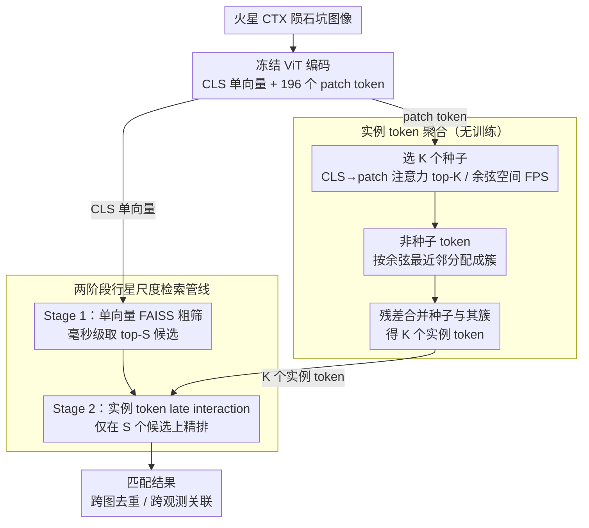

# CraterBench-R: Instance-Level Crater Retrieval for Planetary Scale

**会议**: CVPR 2026  
**arXiv**: [2604.06245](https://arxiv.org/abs/2604.06245)  
**代码**: [https://hf.co/datasets/jfang/CraterBench-R](https://hf.co/datasets/jfang/CraterBench-R)  
**领域**: 行星科学 / 图像检索  
**关键词**: 陨石坑检索, 实例级检索, ViT patch token, 无训练token聚合, 两阶段检索

## 一句话总结
首次将陨石坑分析形式化为实例级图像检索问题——提出CraterBench-R基准(~25K火星陨石坑ID, 50K gallery, 5K查询)，诊断发现单向量池化有精度上限+有监督度量学习反而退化，提出无训练的实例token聚合(选K个种子+余弦最近邻残差分配)将196个ViT patch token压缩为K个代表token做late interaction匹配，K=64时匹配全token精度且存储大幅降低，实用两阶段管线(单向量粗筛+实例token精排)恢复89-94%完整精度。

## 研究背景与动机

**领域现状**：火星轨道图像含数百万陨石坑结构。深度学习聚焦检测——输出位置/直径但不提供用于关联的视觉表示。

**现实需求**：科学工作流依赖于**关联**——跨图像的同一陨石坑去重、跨观测匹配、形态类比发现。这些本质上是**检索**任务而非检测任务。

**核心挑战**：火星陨石坑外观极度复杂——退化状态各异(原始vs严重侵蚀)、填充机制多样(沙丘/尘埃/熔岩)、照明条件跨轨道剧变→结构和光度变化极大。

**表示瓶颈发现**：(1) 单向量全局描述符(CLS/GeM池化)过度压缩空间细节→精度上限低；(2) 有监督度量学习(三种常用损失)一致退化检索精度（含late interaction精度）→原因是每ID仅2个视图→正样本多样性不足；(3) 保留全196个patch token的late interaction精度高但行星尺度上存储/计算不可行。

**核心idea**：无训练的实例token聚合——从冻结ViT特征中后处理压缩→不受微调退化之害+保持spatial detail。

## 方法详解

### 整体框架

这篇论文先把"陨石坑分析"从检测任务重新定义为实例级图像检索任务，再围绕这个新任务做诊断和提方法。整体分三步走：先建一个 CraterBench-R 基准，把"跨图关联同一陨石坑"变成可评测的检索问题；再用 30 种冻结 backbone 跑一遍诊断，定位出"单向量池化精度有上限、有监督度量学习反而退化"两个瓶颈；最后提出一个无训练的实例 token 聚合，把 196 个 ViT patch token 压成 K 个代表 token 做 late interaction 匹配，并用"单向量粗筛 + 实例 token 精排"的两阶段管线落到行星尺度。下图画的是论文最终落地的检索方法本身（对应下方的设计 3、设计 4），基准与诊断是支撑这条方法的前置工作。

### 关键设计

**1. CraterBench-R 基准：把陨石坑关联做成可评测的实例检索**

科学工作流真正需要的是跨图像去重、跨观测匹配这类"关联"操作，但已有深度学习只输出位置和直径，没有可用于关联的视觉表示。本文据此构建首个实例级陨石坑检索基准：约 25K 陨石坑 ID，每个 ID 提供 2 个 gallery 视图（共约 50K gallery 图像），外加 5K 人工验证的查询图像（1000 个 ID × 5 个视图），全部来自 Mars CTX 图像。直径覆盖 1.0–401km（中位数 1.5km，69% 小于 2km），gallery 同时给出 2× 和 3× 直径两种上下文裁剪以显式考查上下文鲁棒性，查询经人工剔除纯背景、严重伪影等退化样本。评估用 Recall@K (K=1,5,10) 和 mAP，并用 cluster-tolerant relevance 处理共视情况。

**2. 冻结 backbone 诊断：定位单向量上限与有监督退化两个瓶颈**

有了基准就能系统回答"什么表示适合陨石坑检索"。本文对 30 种冻结 backbone 做诊断，得到两个关键负面结论。其一，CLS/GeM 这类单向量全局描述符把空间细节过度压缩，构成一道无法逾越的精度上限——最佳的 ViT-B/16 MarsDINO 也只能到 R@1=.374、mAP=.553。其二，Triplet/ArcFace/SupCon 三种有监督度量学习损失全部使检索精度退化（Triplet 把 CLS mAP 从 .368 降到 .318、late interaction 从 .602 降到 .530），根因是每个 ID 仅 2 个视图、正样本多样性不足，full-backbone 微调破坏了 late interaction 依赖的 token 级结构。诊断同时显示自监督预训练（尤其域内的 MarsDINO）远胜 MAE（.022）/CLIP（.058），说明预训练目标比架构和参数量更重要。

**3. 实例 token 聚合：无训练地把 196 个 patch token 压成 K 个代表 token**

既然微调会退化、而保留全部 196 个 token 做 late interaction 又在行星尺度上存不下、算不动，本文走第三条路：在冻结 ViT 特征上做无训练的后处理压缩。先选 K 个种子索引 $\mathcal{S}=\{s_1,\ldots,s_K\}$（按 CLS→patch 注意力取 top-K 的 attention-based，或在余弦空间做最远点采样 FPS）；再把非种子 token 按余弦相似度分配到最近种子形成簇 $C_k$；最后以残差形式合并种子与其簇：

$$\mathbf{z}_k = \ell_2\left(\mathbf{t}_{s_k} + \frac{1}{\max(|C_k|, \epsilon)}\sum_{i \in C_k} \mathbf{t}_i\right)$$

之所以用残差而非 k-means 质心，是因为残差保留了种子自身的身份信息，即使簇很小也保有区分力，而质心会把局部形态细节抹平。产出的 K 个实例 token 用 ColBERT 式 late interaction 匹配：

$$s_{\mathrm{LI}}(q,g) = \frac{1}{K_q}\sum_{i=1}^{K_q}\max_{1 \leq j \leq K_g} \langle \mathbf{t}_i^q, \mathbf{t}_j^g \rangle$$

因为全程无训练，自然绕开了微调退化陷阱；K=16 时 mAP 已比"只选 token 不聚合"高 +17.9，K=64 时逼近全 196 token 精度而存储减少 3×。

**4. 两阶段行星尺度检索管线：单向量粗筛 + 实例 token 精排**

实例 token 精度高但逐对算 late interaction 成本不低，直接全库匹配在行星尺度仍不现实。本文用两阶段管线平衡精度和成本：Stage 1 用单向量在 FAISS 上毫秒级粗筛 top-S 候选，Stage 2 只在这 S 个候选上做实例 token late interaction 精排。离线聚合复杂度 $O(NK)$/图像，在线匹配 $O(K^2D)$/候选；S=100 时已能恢复 89–94% 的完整精度，S=500 时恢复约 96%，用很小的精度代价换来可落地的检索速度。

## 实验关键数据

### 核心结果——冻结backbone单向量检索

| 模型 | 参数量 | 池化 | R@1 | R@5 | mAP |
|------|--------|------|-----|-----|-----|
| EfficientNet-B0 | 4M | GAP | .150 | .214 | .248 |
| ResNet-50 | 24M | GeM | .142 | .217 | .244 |
| ViT-S/16 DINO | 22M | CLS | .273 | .360 | .420 |
| ViT-B/8 DINO | 86M | GeM | .304 | .379 | .461 |
| ViT-B/14 DINOv2 | 87M | Max | .240 | .323 | .377 |
| ViT-7B/16 DINOv3_sat | 6.7B | Max | .330 | .416 | .505 |
| ViT-B/16 MAE | 86M | GeM | .022 | .042 | .043 |
| ViT-B/16 CLIP | 86M | GeM | .058 | .091 | .107 |
| ViT-S/16 MarsDINO | 22M | GeM | .269 | .356 | .412 |
| **ViT-B/16 MarsDINO** | **85M** | **CLS** | **.374** | **.472** | **.553** |

### 消融实验——实例token聚合效果

| 配置 | mAP | 说明 |
|------|-----|------|
| 单向量(最佳backbone) | .553 | MarsDINO CLS池化上限 |
| 原始attention选择 K=16 | .444 | 仅选token不聚合 |
| **实例token聚合 K=16** | **.623** | **+17.9 pts，显著提升** |
| 原始attention选择 K=64 | .716 | token增多精度上升 |
| **实例token聚合 K=64** | **.760** | **接近全token精度** |
| 全196 token late interaction | .744 (MarsDINO) | 完整上限 |
| 有监督Triplet微调 | .318 (CLS) | **退化**，低于冻结 .368 |

### 关键发现
- **"fine-tuning退化"** 是本文最重要的负面结果——在few-view regime(每ID仅2视图)下暴力学习不如冻结+后处理
- 残差分配(vs k-means质心)保留了更多局部形态细节→对陨石坑边缘/纹理的区分力更强
- 自监督ViT > CLIP > ImageNet预训练→域内预训练是检索性能的关键因素
- Attention-based种子选择在低K值时优势最大(K=16比random多+14 mAP)，高K值时差距缩小
- 预训练目标比参数量更重要: 22M ViT-S/16 DINO (.420 mAP) 超越 86M DeiT-B/16 (.303) 和 134M VGG-16 (.068)

## 亮点与洞察
- **任务重新定义的洞察力**：从检测(输出坐标)到检索(输出相似匹配)的范式转换→触及行星科学工作流的真实需求
- **"有监督退化"的重要发现+解释**：few-view regime下度量学习缺乏足够正样本多样性→fine-tuning反而损害通用表示→冻结+后处理是这类regime的正确策略
- **无训练token聚合的通用性**：不限于陨石坑→任何需要在冻结ViT特征上做高效检索的场景(遥感变化检测/场景去重/地理定位)都适用
- **GeoAI的方法论贡献**：late interaction + 确定性压缩 + 两阶段搜索 的pipeline是domain-agnostic的

## 局限与展望
- 每ID仅2个视图→更多视图可能让有监督方法重新有效
- 当前仅Mars CTX→月球/其他行星的泛化待验证
- 种子token选择基于attention→其他显著性指标可能更优
- K的最优值可能因陨石坑大小/类型不同而异

## 评分
- 新颖性: ⭐⭐⭐⭐⭐ 首个陨石坑检索基准+无训练token聚合+有监督退化发现
- 实验充分度: ⭐⭐⭐⭐⭐ 30种backbone+3种度量学习损失+K值消融+两阶段参数分析
- 写作质量: ⭐⭐⭐⭐⭐ 问题定义→诊断→方案→实验的逻辑链清晰
- 价值: ⭐⭐⭐⭐ 行星科学+GeoAI双重贡献+通用检索方法论

<!-- RELATED:START -->

## 相关论文

- [\[CVPR 2026\] Text-Phase Synergy Network with Dual Priors for Unsupervised Cross-Domain Image Retrieval](text-phase_synergy_network_with_dual_priors_for_unsupervised_cross-domain_image_.md)
- [\[ICML 2026\] PartCo: Part-Level Correspondence Priors Enhance Category Discovery](../../ICML2026/self_supervised/partco_part-level_correspondence_priors_enhance_category_discovery.md)
- [\[CVPR 2025\] MaRI: Material Retrieval Integration across Domains](../../CVPR2025/self_supervised/mari_material_retrieval_integration_across_domains.md)
- [\[ECCV 2024\] COHO: Context-Sensitive City-Scale Hierarchical Urban Layout Generation](../../ECCV2024/self_supervised/coho_context-sensitive_city-scale_hierarchical_urban_layout_generation.md)
- [\[ECCV 2024\] MarineInst: A Foundation Model for Marine Image Analysis with Instance Visual Description](../../ECCV2024/self_supervised/marineinst_a_foundation_model_for_marine_image_analysis_with_instance_visual_des.md)

<!-- RELATED:END -->
