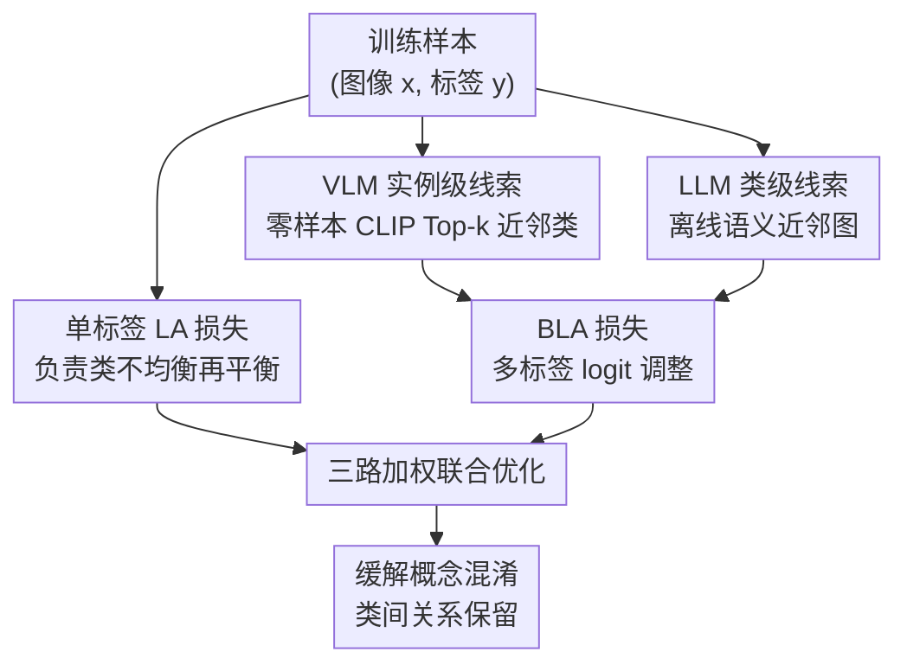

# CUE: Concept-Aware Multi-Label Expansion to Mitigate Concept Confusion in Long-Tailed Learning

**会议**: CVPR 2026  
**arXiv**: [2605.01309](https://arxiv.org/abs/2605.01309)  
**代码**: https://github.com/zhangruichi/CUE (有)  
**领域**: 长尾学习 / 基础模型微调 / 表示学习  
**关键词**: 长尾分布, 概念混淆, 多标签扩展, CLIP 零样本, LLM 语义近邻

## 一句话总结
针对微调基础模型做长尾识别时出现的「概念混淆」（尾类样本被错分到语义相关类），CUE 用零样本 CLIP 提供实例级、用 LLM 提供类级的多标签语义线索，通过两个二值 logit 调整（BLA）辅助损失把这些相关类一起当正标签监督，从而保留预训练时的类间关系，在四个长尾基准上尾类显著涨点。

## 研究背景与动机
**领域现状**：长尾学习（LTL）近年主流是微调 CLIP 这类基础模型——用 prompt tuning / adapter / LoRA 等参数高效方式适配下游，再叠加 logit adjustment（LA）等再平衡技巧来缓解类不均衡，代表方法是 LIFT、LPT。

**现有痛点**：这些方法只盯着「类别频次不均衡」这一个偏差，却忽略了微调过程本身引入的另一种偏差。作者在 CIFAR100-LT 上观察到：很多原本零样本 CLIP 能分对的样本，微调后反而错了，尤其是尾类；而且这些错误大量落到**语义相关的近邻类**上（如把某种鸟错分成另一种鸟）。Grad-CAM 显示微调把注意力从物体本体移到了错误区域。作者把这个现象命名为**概念混淆（concept confusion）**。

**核心矛盾**：根因在于**单标签监督的互斥性**——单标签强制每个样本只能属于一个类，哪怕它和别的类语义/视觉高度相关。在长尾分布下，这种互斥性会让模型偏向样本更多、更具代表性的头类，头类主导了优化，预训练时学到的类间相关结构被破坏，于是语义相邻类被互相压制，概念混淆被放大。

**本文目标**：在不丢掉类不均衡再平衡的前提下，额外**保住微调时本应保留的类间关系**，让模型显式学习「这个样本和哪些类相关」而不是硬塌缩成单标签决策。

**切入角度**：基础模型自带强语义先验——VLM 在图文预训练里学到了细粒度的实例级视觉关联，LLM 则握有类别之间高层的语义/概念关联。既然概念混淆是「相关类被互斥压制」，那就直接把这些相关类**找出来当额外正标签**喂回去。

**核心 idea**：用 VLM + LLM 为每个样本生成一组语义相关的扩展标签，把单标签训练改造成「真标签 + 相关类」的多标签监督，用相关类的正信号去抵消单标签互斥，从而修复类间关系、缓解概念混淆。

## 方法详解

### 整体框架
CUE 是一个**即插即用模块**，挂在标准长尾微调流程（CLIP backbone + AdaptFormer + LA 损失）之上，不改架构、不改优化器。它的核心是把原本只有「真标签 $y_i$」的监督，扩展成三路监督叠加：① 原有的单标签 LA 损失（继续负责类不均衡再平衡）；② 由零样本 CLIP 给出的**实例级**相关类，转成多标签目标后过一个 BLA 损失；③ 由 LLM 离线构建的**类级**语义近邻，同样转成多标签目标过另一个 BLA 损失。三路损失加权求和联合优化。两路 cue 互补：VLM 抓「这张图具体像哪些类」，LLM 抓「这个类天然和哪些类近」。

### 关键设计

**1. 概念混淆诊断：把错误归因到单标签互斥**

CUE 的出发点不是又一个 trick，而是一个被忽视的诊断。作者先用实验证明：长尾微调掉的点很大一部分不是「类别少」造成的，而是微调把预训练里的类间结构搅乱了——零样本 CLIP 注意力还相对集中在物体上，一微调注意力就跑偏，错误集中流向语义近邻类。作者把根因精确定位到单标签交叉熵的**互斥性**：监督信号要求 $\theta_{y_i}$ 远大于所有其它类的 logit，等于强行压低所有语义相关类。在长尾下，头类样本多、优化更划算，于是这种压制偏向头类、破坏类间相关——这正是后面所有设计要对症下药的痛点。把问题讲清楚本身，就决定了解法应该是「给相关类发正标签」而不是「再调一次频次权重」

**2. VLM 实例级线索：用零样本 CLIP 找「这张图具体像谁」**

针对单标签把实例级视觉相关压平的问题，CUE 让每张训练图 $\mathbf{x}_i$ 走一遍冻结的零样本 CLIP：用 "a photo of a [CLASS]" 模板算图文余弦相似度得到打分 $\theta^{\text{zs}}(\mathbf{x}_i)$，然后在**非真标签**类里取 Top-$k$ 个最相似的作为额外线索：$\mathcal{T}^{\text{zs}}(x_i)=\text{Top-}k(\operatorname{argsort}_{y\neq y_i}\theta^{\text{zs}}_y(\mathbf{x}_i))$（实验固定 $k=5$）。再把「真标签 + 这 Top-$k$」标成 1、其余标 0，得到二值多标签目标 $\tilde{t}^{\text{zs}}_i$。这一路捕捉的是预训练空间里**针对当前这张图**的局部类邻域，逐样本不同，相当于把 CLIP 学到的细粒度视觉结构原样保下来，让模型承认「这张图确实也长得像那几个类」而不是被强行否定

**3. LLM 类级线索：用 LLM 建「这个类天然和谁近」的语义近邻图**

VLM 给的是 per-image 的视觉线索，CUE 再补一路 per-class 的高层语义线索：离线为每个类 $c$ 用 LLM 构建近邻集 $\mathcal{N}^{\text{llm}}(c)$。做法上有个工程坑——直接把整张标签表丢给 LLM 会超出其有效工作范围，导致中间类被跳过或塌缩、产出粗糙噪声关系。CUE 因此设计**分批提示 + 过滤**流水线：把标签表切成小批，每次只约束 LLM 在给定子集里返回「类名→语义近邻」的 JSON 映射，再把各批输出合并、剔除越界/歧义/重复项，最后把类名对齐到标签索引。训练时同类样本共享这份近邻集，标成多标签目标 $\tilde{t}^{\text{llm}}_i$。它补的是 VLM 看不到的更广语义关联，且因为是离线类级的，对单张图的噪声不敏感

**4. BLA 损失：让多标签监督在长尾下也公平校准**

把相关类当正标签直接做二值交叉熵会有问题：长尾下正负样本严重不均，sigmoid 决策会再次偏向头类。CUE 把 LA 的先验 logit 平移思想搬到二值场景，提出 **Binary Logit-Adjustment（BLA）**：在过 sigmoid 前给每个类 logit 加上 $\tau_b\log\pi_c$（$\pi_c$ 是经验类先验），即 $\tilde{\theta}_c(\mathbf{x})=\theta_c(\mathbf{x})+\tau_b\log\pi_c$，再算多标签二值交叉熵。这样两路 cue 的监督都在与 baseline LA 一致的频次校准下进行，扩展出来的相关类正标签不会反过来把频次偏差再放大一遍——这是让「多标签扩展」和「长尾再平衡」能共存的关键黏合剂

### 损失函数 / 训练策略
总目标把三项加权相加：

$$\mathcal{L}=\underbrace{\mathcal{L}^{\text{LA}}(\mathbf{x}_i,y_i)}_{\text{baseline}}+\lambda_{\text{zs}}\underbrace{\mathcal{L}^{\text{BLA}}(\mathbf{x}_i,\tilde{\mathbf{t}}^{\text{zs}}_i)}_{\text{VLM cue}}+\lambda_{\text{llm}}\underbrace{\mathcal{L}^{\text{BLA}}(\mathbf{x}_i,\tilde{\mathbf{t}}^{\text{llm}}_i)}_{\text{LLM cue}}$$

其中 $\mathcal{L}^{\text{LA}}$ 是带温度 $\tau$ 的类平衡 logit 调整 softmax 损失（$\theta'_c=\theta_c+\tau\log\pi_c$）。backbone 用 CLIP-ViT-B/16 + AdaptFormer，SGD（lr=0.01、momentum=0.9、weight decay=$5\times10^{-4}$）、batch=128、cosine 调度，单卡 RTX 5090。$\lambda_{\text{zs}}$、$\lambda_{\text{llm}}$ 在 0~1 间扫，方法对其相当鲁棒。

## 实验关键数据

### 主实验
四个长尾基准（CIFAR100-LT、ImageNet-LT、Places-LT、iNaturalist2018），backbone 与参数量对齐 LIFT，重点看尾类（Few）与整体（All）。

| 数据集 | 指标 | CUE | LIFT(SOTA) | 提升 |
|--------|------|------|----------|------|
| CIFAR100-IR100 | All | 82.8 | 80.3 | +2.5 |
| CIFAR100-IR100 | Few | 82.0 | 74.3 | +7.7 |
| ImageNet-LT | All | 77.4 | 77.0 | +0.4 |
| ImageNet-LT | Few | 73.0 | 71.5 | +1.5 |
| Places-LT | All | 51.7 | 51.5 | +0.2 |
| Places-LT | Few | 52.4 | 50.5 | +1.9 |
| iNaturalist2018 | All | 79.6 | 79.1 | +0.5 |
| iNaturalist2018 | Many | 73.4 | 72.4 | +1.0 |

参数量与 LIFT 持平（如 CIFAR100 上仅 0.10M、ImageNet-LT 0.62M），涨点几乎全部来自尾类，且头/中类不掉，体现「更均衡」而非「拆东补西」。在 iNaturalist 上 LIFT 因过度适配出现头类退化，CUE 反而把 Many 和 Few 同时拉起（+1.0 / +0.6）。

### 消融实验
从 LIFT baseline（AdaptFormer + LA）出发逐步加两路 cue（Table 5）：

| 配置 | CIFAR100-IR100 Few | ImageNet-LT Few | Places-LT Few |
|------|------|---------|------|
| baseline (无 cue) | 74.3 | 71.5 | 50.5 |
| + VLM cue | 81.6 | 72.6 | 52.3 |
| + LLM cue | 80.2 | 72.5 | 51.1 |
| + VLM + LLM (Full) | 82.0 | 73.0 | 52.4 |

### 关键发现
- 两路 cue 单独都能在尾类上大幅涨点，其中 **VLM 实例级线索增益略高于 LLM**——逐样本的视觉指导比类级语义更直接、更细粒度。
- 两者**互补**：合用时（Full）在三个数据集尾类上都拿到最均衡的最优，说明视觉与语义线索作用不同、需要平衡，单独过度依赖任一路反而略掉点。
- 超参鲁棒：$\lambda_{\text{VLM}}$、$\lambda_{\text{LLM}}$ 在 0~1 大范围内都不退化，非零组合通常最好。
- 即插即用得到充分验证：套到 LoRA / VPT-shallow / VPT-deep / Adapter / AdaptFormer 五种 PEFT 都涨（VPT-shallow 的 Few 从 52.2→75.2，+23）；套到 DODA / LOS / LA / ResLT 四种 from-scratch 方法也都涨（LOS 的 Few 从 1.5→6.8）。
- Table 8 用 balancedness $\beta(V)$ 指标证明 CUE 误分类更少、类间可分性更均匀。

## 亮点与洞察
- **重新定义了问题**：把长尾微调掉点拆成「类不均衡」+「概念混淆」两个偏差，并用 Grad-CAM + 错误流向实证后者，再把根因精确归到单标签互斥——这种「先把现象命名清楚再对症下药」的叙事比直接堆模块更有说服力。
- **用基础模型治基础模型的病**：概念混淆是微调把预训练类间结构搅乱了，CUE 直接回头问 CLIP/LLM「原本这些类怎么相关」，把答案当正标签喂回去，逻辑闭环很干净。
- **BLA 是被低估的黏合剂**：多标签扩展在长尾下天然会放大频次偏差，作者没忽略这点，把 LA 的先验平移搬进二值损失，保证扩展与再平衡不打架——可迁移到任何「在长尾上做多标签/伪标签」的场景。
- **即插即用价值高**：对 PEFT 和 from-scratch 两大范式都涨，且不改架构，落地成本低。

## 局限与展望
- 两路 cue 的质量直接依赖外部 CLIP 和 LLM 的先验：若数据集是 CLIP/LLM 预训练时罕见的领域（如专业医学细分类），Top-$k$ 近邻和语义近邻图可能本身就是噪声，论文实验集中在自然图像类基准，跨域稳健性未充分检验。
- LLM 近邻图是**离线类级**且对同类所有样本共享，无法刻画「同类不同图」的差异；分批提示虽缓解了超长标签表问题，但批边界附近的跨批近邻可能被漏掉。
- Top-$k$ 固定 $k=5$，对类数差异极大的数据集（CIFAR100 vs iNaturalist 8142 类）是否应自适应未讨论；扩展标签若混入真正不相关类，等于引入标签噪声。
- 增益在大规模标准基准（ImageNet-LT / Places-LT）上偏小（All 仅 +0.2~0.4），主要红利集中在尾类与小规模合成基准。

## 相关工作与启发
- **vs LIFT / LPT（基础模型长尾微调）**：它们只用 LA / 多种长尾 trick 缓解类不均衡，CUE 的差异在于额外识别并治理「概念混淆」这一微调专属偏差，且 CUE 是叠加在 LIFT 之上的即插即用增量。
- **vs 伪标签（FixMatch / SoftMatch / OTAMatch）**：传统伪标签给无标注样本推**单个**真标签，CUE 反其道而行——对**有标注**样本主动扩展出**多个**语义相关标签，目的不是补标注而是保住类间关系。
- **vs LA（logit adjustment）**：CUE 复用 LA 做 baseline 再平衡，并把它的先验平移思想推广成二值场景的 BLA，让多标签监督也能在长尾下公平校准。

## 评分
- 新颖性: ⭐⭐⭐⭐ 「概念混淆」的命名+归因到单标签互斥+用 VLM/LLM 双线索多标签扩展，问题定义新颖、解法自然。
- 实验充分度: ⭐⭐⭐⭐ 四基准 + 组件消融 + 超参敏感 + 两大范式即插即用扩展 + balancedness 分析，覆盖全面；大规模基准整体增益偏小。
- 写作质量: ⭐⭐⭐⭐ 从现象到归因到解法叙事清晰，Grad-CAM 与错误流向佐证有力。
- 价值: ⭐⭐⭐⭐ 即插即用、参数零增、对尾类增益明显，长尾微调可直接借鉴。

<!-- RELATED:START -->

## 相关论文

- [\[CVPR 2026\] Learning Like Humans: Analogical Concept Learning for Generalized Category Discovery](learning_like_humans_analogical_concept_learning_for_generalized_category_discov.md)
- [\[CVPR 2026\] Reframing Long-Tailed Learning via Loss Landscape Geometry](reframing_long-tailed_learning_via_loss_landscape_geometry.md)
- [\[CVPR 2026\] Trust-calibrated Collaborative Learning for Long-Tailed Visual Recognition](trust-calibrated_collaborative_learning_for_long-tailed_visual_recognition.md)
- [\[CVPR 2026\] GaussianMatch: Semi-Supervised Regression with Pseudo-Label Filtering via Multi-View Gaussian Consistency](gaussianmatch_semi-supervised_regression_with_pseudo-label_filtering_via_multi-v.md)
- [\[AAAI 2026\] BCE3S: Binary Cross-Entropy Based Tripartite Synergistic Learning for Long-tailed Recognition](../../AAAI2026/self_supervised/bce3s_binary_cross-entropy_based_tripartite_synergistic_learning_for_long-tailed.md)

<!-- RELATED:END -->
