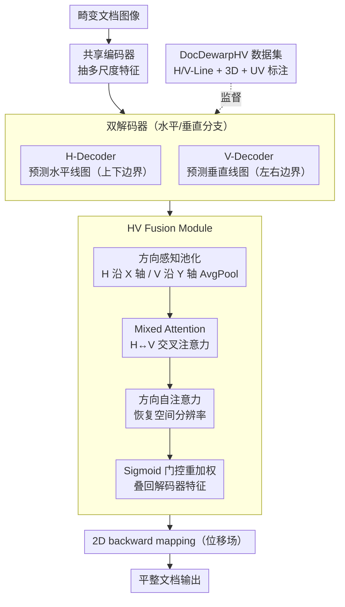

# D2Dewarp: Dual Dimensions Geometric Representation Learning Based Document Image Dewarping

**会议**: CVPR 2026  
**arXiv**: [2507.08492](https://arxiv.org/abs/2507.08492)  
**代码**: [有](https://github.com/xiaomore/D2Dewarp)  
**领域**: 自监督学习 / 文档图像理解  
**关键词**: Document Dewarping, Dual Dimension, Geometric Lines, UNet, HV Fusion

## 一句话总结

提出 D2Dewarp——首个从水平和垂直双维度学习文档几何表示的去畸变方法：UNet 双解码器分别预测水平线（文档/表格/文本行的上下边界）和垂直线（左右边界），HV Fusion Module 通过混合注意力交叉融合两个方向的特征，并构建了包含 114K 张图的 DocDewarpHV 数据集提供双维度标注。

## 研究背景与动机

### 1. 领域现状

文档图像去畸变（Document Image Dewarping）旨在将拍摄的弯曲/褶皱文档图像恢复为平整状态，是 OCR 和文档分析的关键前处理步骤。现有方法大致分为三类：(i) 基于 3D 坐标回归的方法（如 DewarpNet）；(ii) 基于 2D 光流/位移场的方法（如 DocTr）；(iii) 基于几何线条的方法（如 RDGR），通过预测文档中的文本行边界线提供几何约束。

### 2. 痛点

- **只关注水平线**：RDGR 等方法仅利用水平方向的几何线条（文本行的上下边界），完全忽略了垂直方向的结构信息
- **垂直畸变被忽视**：书本折页、表格列边界、段落分栏等场景中垂直方向的弯曲同样严重，但无方法显式建模
- **特征融合不足**：即使同时提取水平和垂直特征，缺乏有效的交叉融合机制也无法充分利用双维度互补信息
- **数据标注缺失**：现有数据集（Doc3D、DocUNet）不提供垂直线标注，限制了双维度学习的可行性

### 3. 核心矛盾

文档畸变本质是二维空间中的形变，但现有方法只用了一维（水平方向）的几何约束，存在根本性的信息不完备。

### 4. 要解决什么

同时利用水平和垂直两个维度的几何结构信息来指导文档去畸变，并提供配套数据集。

### 5. 切入角度

从几何表示学习的双维度出发：分别学习水平线和垂直线的结构特征，再通过注意力机制融合两个方向的互补信息，生成高质量的变形映射。

## 方法详解

### 整体框架

文档去畸变要解决的是：一张拍歪、拍弯的文档照片，怎么"压平"回正。D2Dewarp 的核心判断是——文档的弯曲是个二维问题，光看水平方向的文本行不够，垂直方向的表格列、装订线同样在弯。于是它在一套 UNet 上做文章：图像先进共享编码器抽多尺度特征，再分叉成两条解码器，一条专门预测水平线图（H-Line Map），一条专门预测垂直线图（V-Line Map），两条解码器在中间层通过 HV Fusion Module 互相交换信息。最终模型输出一张 2D backward mapping（位移场），告诉每个畸变像素该挪回平整文档的哪个位置。两类几何线在这里既是监督信号、也是约束，把"形变"这件抽象的事锚到了具体的结构边界上；而这一切能训起来，靠的是作者新造的、带双维度线条标注的 DocDewarpHV 数据集。

### 关键设计

**1. 双解码器：把水平和垂直的几何线拆开来学**

之前 RDGR 这类方法只预测水平线——也就是文本行、表格行、图片、段落这些水平结构元素的上下边界线，它反映文档在竖直方向上怎么弯。但表格列边界、段落侧边、书脊装订线这些垂直结构的左右边界（V-Line）同样携带弯曲信息，过去整个被丢掉了。D2Dewarp 让共享编码器之后分叉成 H-Decoder 和 V-Decoder，各管一个方向：H-Decoder 预测水平线图，V-Decoder 预测垂直线图。拆开学的好处是两个方向的几何特征不必挤在同一条解码路径里相互干扰，每条分支可以专注刻画自己方向上的弯曲模式，这也是把单维度约束补成完整二维约束的前提。

**2. HV Fusion Module：让两个方向的特征显式互相"看见"**

两条解码器各学各的还不够——水平的弯和垂直的弯在物理上是耦合的，需要一个模块让它们交换上下文。最朴素的做法是把 H、V 特征直接拼接或相加，但这建模不出方向之间的依赖。HV Fusion 的做法分四步：先做**方向感知池化**，水平特征沿 X 轴 AvgPool（压掉水平冗余、保留垂直空间信息），垂直特征沿 Y 轴 AvgPool（保留水平空间信息），把无关维度先压扁以省计算；再做 **Mixed Attention**，把池化后的 H/V 特征拼起来做交叉注意力，让水平分支显式感知垂直结构、反之亦然；接着用 X-Self Attention 和 Y-Self Attention 把各方向的空间分辨率恢复回来；最后用 Sigmoid 门控对融合特征重加权，叠回原始解码器特征。相比一上来就对完整特征图做全局注意力，"先沿轴池化再交叉"既省算力，方向的几何含义也更清晰。

**3. DocDewarpHV 数据集：补上垂直线标注这块缺口**

双维度学习要落地，前提是有 V-Line 标注，而 Doc3D、DocUNet 这些现成数据集只给水平相关标注、根本没有垂直线。作者干脆自己造了 DocDewarpHV：用 Blender 把平整文档贴到弯曲的 3D 网格上渲染，自动从几何上提取水平和垂直边界线，每张图同时配齐 3D 坐标、UV mapping、H-Line map、V-Line map 四种标注，共 114,000 张训练图（512×512），覆盖中英文、纯文本、表格、图文混排等版式。对比 Doc3D 的 102K 张且无 V-Line，DocDewarpHV 在规模和标注丰富度上都更进一步，是这套方法能训起来的基础。

### 损失函数 / 训练策略

总损失为重建损失和线条预测损失的加权和：

$$\mathcal{L} = \alpha \cdot \mathcal{L}_{\text{rec}} + \mathcal{L}_{\text{line}}$$

- **$\mathcal{L}_{\text{rec}}$（重建损失）**：L1 损失，计算预测 backward mapping 与 GT 位移场之间的像素级差异
- **$\mathcal{L}_{\text{line}}$（线条预测损失）**：类似 RDGR 的加权 BCE 损失，分别对 H-Line 和 V-Line 预测图计算，正样本（线条像素）加权以缓解正负样本极端不平衡（线条像素占比 < 5%）
- **权重 $\alpha$**：平衡两个损失的超参数

训练配置：Adam 优化器，学习率 1e-4，batch size 16，300 epochs。在 DocDewarpHV 数据集上训练，在 DocUNet、DIR300、WarpDoc 三个真实场景 benchmark 上测试。

## 实验关键数据

### 主实验

**表1：DocUNet Benchmark 上的对比（130 张真实畸变文档）**

| 方法 | MS-SSIM↑ | LD↓ | CER↓ |
|------|----------|-----|------|
| DewarpNet | 0.4735 | 8.39 | 0.4210 |
| DocTr | 0.5105 | 7.76 | 0.3561 |
| DocGeoNet | 0.5040 | 7.71 | 0.3806 |
| RDGR | 0.5224 | 7.61 | 0.3343 |
| RecDocNet | 0.5198 | 7.42 | 0.3482 |
| **D2Dewarp (Ours)** | **0.5387** | **7.18** | **0.3127** |

**表2：DIR300 Benchmark 上的对比（300 张文档）**

| 方法 | MS-SSIM↑ | LD↓ |
|------|----------|-----|
| DewarpNet | 0.4868 | 8.98 |
| DocTr | 0.5241 | 7.94 |
| RDGR | 0.5356 | 7.63 |
| **D2Dewarp (Ours)** | **0.5521** | **7.28** |

**表3：WarpDoc Benchmark 上的对比 (1020 张文档)**

| 方法 | MS-SSIM↑ | LD↓ | CER↓ |
|------|----------|-----|------|
| DocTr | 0.6842 | 5.31 | 0.1987 |
| RDGR | 0.7015 | 5.08 | 0.1842 |
| **D2Dewarp (Ours)** | **0.7234** | **4.76** | **0.1653** |

### 消融实验

**表4：核心组件消融（DocUNet Benchmark）**

| 配置 | MS-SSIM↑ | LD↓ |
|------|----------|-----|
| Baseline（单解码器 + H-Line only） | 0.5224 | 7.61 |
| + V-Line 分支（双解码器，无融合） | 0.5298 | 7.42 |
| + 简单拼接融合 | 0.5315 | 7.36 |
| + HV Fusion Module (Full) | **0.5387** | **7.18** |

**表5：HV Fusion Module 内部消融**

| 配置 | MS-SSIM↑ | LD↓ |
|------|----------|-----|
| 无方向感知池化（直接交叉注意力） | 0.5341 | 7.31 |
| 无 Sigmoid 重加权（直接相加） | 0.5328 | 7.35 |
| 无方向自注意力 | 0.5352 | 7.29 |
| Full HV Fusion | **0.5387** | **7.18** |

### 关键发现

1. **双维度显著优于单维度**：仅加入 V-Line 分支（无融合）即可将 MS-SSIM 从 0.5224 提升到 0.5298，证实垂直几何信息的重要性
2. **融合机制至关重要**：HV Fusion Module 比简单拼接额外贡献 0.72% MS-SSIM 提升，方向感知设计比朴素注意力更有效
3. **三个 benchmark 一致领先**：在 DocUNet/DIR300/WarpDoc 上 MS-SSIM、LD、CER 三个指标全面 SOTA
4. **OCR 性能提升明显**：CER 从 RDGR 的 0.3343 降到 0.3127（DocUNet），降幅 6.5%，说明去畸变质量直接改善了下游文字识别
5. **DocDewarpHV 数据集效果**：使用 DocDewarpHV 训练比用 Doc3D 训练在 MS-SSIM 上高 1.2%，归因于 V-Line 标注和更大规模

## 亮点与洞察

- **直觉简单但长期被忽视**：文档畸变显然是二维问题，但所有先前方法只用水平线——D2Dewarp 首次指出并解决了这个盲点
- **端到端双维度学习**：共享编码器 + 双解码器 + HV Fusion 的设计既保证了效率又实现了方向间信息互补
- **贡献数据集**：DocDewarpHV（114K，含 H/V-Line 标注）对社区是重要贡献，解决了缺乏垂直线标注的瓶颈
- **方向感知注意力设计**：先沿对应轴池化压缩再做交叉注意力，比直接全局注意力更高效且几何含义更清晰

## 局限与展望

- 数据集通过 3D 渲染生成，与真实场景的分布差距（domain gap）仍可能限制泛化性
- H-Line 和 V-Line 的定义依赖于规则的文档结构（文本行、表格），对手写文档、不规则排版可能效果不佳
- 双解码器增加了约 40% 的参数量和计算量，在移动端/边缘设备部署可能受限
- HV Fusion 固定在解码器特定层，未探索多尺度融合的效果
- 未与最新的基于 Transformer 全局注意力的方法（如 DocFormerv2）进行对比
- 仅关注 backward mapping 输出形式，未尝试结合 3D 坐标重建提供更丰富的几何先验

## 相关工作与启发

- **RDGR [Li et al.]**：基于水平文本行线条的去畸变方法，D2Dewarp 的直接前身；本文将其从"单维度"扩展到"双维度"
- **DewarpNet [Das et al.]**：首个端到端深度学习去畸变方法，预测 3D 坐标映射；D2Dewarp 证明几何线条比 3D 坐标更有效
- **DocTr [Feng et al.]**：引入 Transformer 做文档去畸变，用全局注意力捕获长距离依赖；D2Dewarp 的方向感知注意力是一种更有针对性的设计
- **Doc3D [Das et al.]**：100K 规模渲染数据集，是文档去畸变领域的标准训练集；DocDewarpHV 在其基础上增加 V-Line 标注和更多样本
- **启发**：方向解耦的思想可推广到其他文档分析任务——如版面分析可同时关注行切割（水平）和列切割（垂直），表格识别可分别建模行线和列线

## 评分

- 新颖性: ⭐⭐⭐⭐ 首次系统引入双维度线条建模，HV Fusion Module设计直观有效
- 实验充分度: ⭐⭐⭐⭐⭐ 三个benchmark全面评估，包含完整消融实验和Bad Case分析
- 写作质量: ⭐⭐⭐⭐ 结构清晰，图表丰富，可视化对比直观
- 价值: ⭐⭐⭐⭐ DocDewarpHV数据集是持续贡献，双维度思路可推广到其他文档任务

<!-- RELATED:START -->

## 相关论文

- [\[CVPR 2026\] GM-R²: Generative Matching Learning for Unsupervised Geometric Representation and Registration](gm-r2_generative_matching_learning_for_unsupervised_geometric_representation_and.md)
- [\[CVPR 2026\] Text-Phase Synergy Network with Dual Priors for Unsupervised Cross-Domain Image Retrieval](text-phase_synergy_network_with_dual_priors_for_unsupervised_cross-domain_image_.md)
- [\[ICCV 2025\] A Token-level Text Image Foundation Model for Document Understanding (TokenFD/TokenVL)](../../ICCV2025/self_supervised/a_tokenlevel_text_image_foundation_model_for_document_unders.md)
- [\[CVPR 2026\] Dual-Estimator: Decoupling Global and Local Semantic Shift for Drift Compensation in Class-Incremental Learning](dual-estimator_decoupling_global_and_local_semantic_shift_for_drift_compensation.md)
- [\[CVPR 2026\] DGS: Dual Gradient and Semantic-Shift Guided Low-Rank Adaptation for Class Incremental Learning](dgs_dual_gradient_and_semantic-shift_guided_low-rank_adaptation_for_class_increm.md)

<!-- RELATED:END -->
