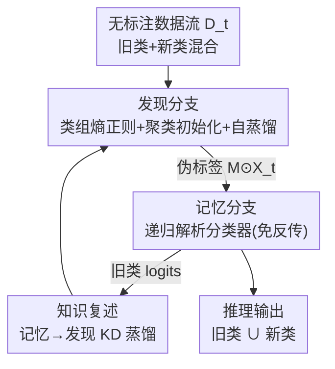

# Decouple Your Discovery and Memory in Continual Generalized Category Discovery

**会议**: CVPR 2026  
**论文**: [CVF Open Access](https://openaccess.thecvf.com/content/CVPR2026/html/Yu_Decouple_Your_Discovery_and_Memory_in_Continual_Generalized_Category_Discovery_CVPR_2026_paper.html)  
**代码**: 论文未提供  
**领域**: 持续学习 / 广义类别发现  
**关键词**: 持续广义类别发现, 双分支解耦, 解析学习, 灾难性遗忘, 稳定-可塑性权衡  

## 一句话总结
针对持续广义类别发现（C-GCD）中"为防遗忘而过度保护旧类、反过来压垮新类发现"的痛点，本文提出 DYDM 双分支框架——发现分支专注无约束地认出新类、记忆分支用免反传的递归最小二乘解析分类器稳稳记住所有旧类，再用一条知识复述蒸馏把两者串成闭环，在四个基准上把新类精度和总体精度同时大幅拉高（CAA 比 SOTA Happy 高 3.2–9.9%）。

## 研究背景与动机
**领域现状**：现实世界里类别边界不是固定的，会随时间和任务不断出现新类。广义类别发现（GCD）要求模型从无标注数据里同时认出"见过的旧类"和"没见过的新类"，但它只在单阶段静态场景下做一次发现。把 GCD 推到连续数据流、且不允许回看旧数据（replay-free）的设定，就是**持续广义类别发现（C-GCD）**：每个阶段 $t\ge1$ 来一批无标注数据 $D_t$，既含旧类也含新类，模型要边发现新类边记住旧类。

**现有痛点**：现有 C-GCD 方法（如特征蒸馏类方法、SOTA 的 Happy）为了对抗灾难性遗忘，普遍靠**特征蒸馏 / 原型回放**这类强正则把模型"焊死"在上一阶段的特征空间上。作者做了一个关键的实证分析（CIFAR100，6 阶段和 11 阶段）：这些防遗忘策略确实把稳定性（旧类精度）和总体精度抬上去了，但**代价是可塑性（新类精度）被拖垮**——刚性正则阻碍了特征空间里类分布的自然演化，新类根本学不进来。

**核心矛盾**：anti-forgetting 的正则项被**直接加在同一套用于发现新类的参数 / 特征上**，于是"记住旧的"和"发现新的"这两个目标在同一个特征空间里互相打架，形成经典的稳定-可塑性两难。绝大多数方法都倒向了过度保护旧类那一侧。

**本文目标**：让稳定性和可塑性不再是此消彼长的 trade-off，而是能同时变好的 win-win。

**切入角度**：既然冲突来自"发现"和"记忆"共用一套机制，那就**把这两个过程在架构上显式解耦**——让发现分支不背任何防遗忘的包袱、专心认新类；让记忆分支用一套天然不会遗忘的机制（解析学习/最小二乘的递归更新）专心记旧类。

**核心 idea**：用"发现分支（自蒸馏 + 类组熵正则）负责可塑性 + 记忆分支（递归解析分类器）负责稳定性 + 知识复述把两者耦合成正反馈"替代"单分支 + 强防遗忘正则"，从而把稳定-可塑性两难拆成两个互不拖累、还能互相增益的子问题。

## 方法详解

### 整体框架
DYDM 把 C-GCD 目标拆成两条共享大部分参数的分支：**发现分支**在无标注数据上无约束地识别新类、产出伪标签；**记忆分支**把发现分支认出的所有类别用递归解析的方式逐阶段累加进一个线性分类器、并充当最终的推理分支；中间再加一条**知识复述**，让记忆分支把旧类知识蒸馏回发现分支，反过来发现分支更准的伪标签又强化记忆分支——形成"记忆越强→新类越好认→记忆又被强化"的正反馈。

两条分支共用骨干（DINO 预训练 ViT-B/16），只有**最后一个 Transformer block 不同**：记忆分支在第一个任务后**冻结**自己那份 block 以锁住旧知识，发现分支那份继续微调以适应新类。这种"共享主体 + 末端分叉"的设计让解耦几乎不增加参数开销，记忆分支每阶段只需在 CPU 上做一次前向更新。

### 关键设计

**1. 发现分支：用类组熵正则 + 聚类初始化压住"全猜旧类"的偏置**

C-GCD 在增量阶段没有新类标签，模型会习惯性地把预测概率质量全压向已学过的旧类（probability mass collapse），导致新类几乎认不出来（消融里不加任何组件时新类精度只有 3.9% / 4.81%）。本文从信息论角度引入**类组熵正则 $L_{GER}$**：先把 batch 的边际预测分布 $\bar p=\frac{1}{|B|}\sum_{i\in B}p_i$ 按旧/新两组聚合成 $\pi_{old}=\sum_{c\in C_{old}}\bar p(c)$、$\pi_{new}=\sum_{c\in C_{new}}\bar p(c)$，用组间熵 $L_{bal}=-(\pi_{old}\log\pi_{old}+\pi_{new}\log\pi_{new})$ 逼模型在"旧类组"和"新类组"之间均衡分配置信度，避免一边倒；再用组内 Shannon 熵 $L_{E\text{-}old}$、$L_{E\text{-}new}$ 防止置信度在组内过度尖锐：

$$L_{GER}=L_{bal}+L_{E\text{-}old}+L_{E\text{-}new}.$$

发现分支再叠加无标签自蒸馏 $L_{self\text{-}train}=\frac{1}{2|B|}\sum_i\big(\ell(q'_i,p_i)+\ell(q_i,p'_i)\big)$（两个增强视角互为软标签）和无监督对比损失 $L^u_{rep}$，总损失 $L_{New}=L_{self\text{-}train}+L_{GER}+L^u_{rep}$。此外，新类 head 随机初始化会带来不稳定，于是在阶段 $t$ 对训练集做 KMeans 得到 $K_t=K^{old}_t+K^{new}_t$ 个簇，挑出**与现有类 head 最大余弦相似度最低**的 $K^{new}_t$ 个质心来初始化新 head——保证新 head 从一开始就落在远离旧类的特征区域。消融显示单独的 $L_{GER}$ 就把 CIFAR100 新类精度从 3.9% 抬到 42.06%，单独的聚类初始化在 CUB 上把新类抬到 35.33%，两者叠加进一步互补。

**2. 记忆分支：递归解析分类器，用最小二乘把"记住旧类"变成免反传的闭式更新**

发现分支不背防遗忘约束，那旧类靠谁记住？答案是一个**冻结编码器 + 2 层解析分类器**的记忆分支，它根本不靠反向传播，因此天然不会灾难性遗忘。结构上：冻结的编码器 $f_0$ 提特征，随机投影的扩展层 $f_E$（形状 $d_{FE}\times d_E$，ReLU 激活）把特征升维 $X^E_0=f_{act}(f_E(f_{flat}(X^{FE}_0)))$，再用一个线性层 $f_L$ 把扩展特征对齐到 one-hot 标签空间。基础阶段的对齐就是一个带 $\ell_2$ 正则的最小二乘问题 $\arg\min_{W^L_0}\|Y_0-X^E_0 W^L_0\|^2_F+\gamma\|W^L_0\|^2_F$，有闭式解 $\hat W^L_0=(X^{E\top}_0 X^E_0+\gamma I)^{-1}X^{E\top}_0 Y_0$。

进入增量阶段后，用一个指示矩阵 $M=\mathbb{I}(\arg\max_c p_c(X_t)\in C^t_{new})$ 只挑出发现分支判为**新类**的样本 $\hat X_t=M\odot X_t$ 及其 one-hot 伪标签 $\hat Y_t$，递归地把新类的对齐关系并进分类器。关键在于不需要重训历史数据：维护自相关矩阵 $R_t=(X^{E\top}_{0:t}X^E_{0:t}+\gamma I)^{-1}$，则权重可由上一阶段的 $\hat W^L_{t-1}$、$R_{t-1}$ 和当前数据递归得到（论文 Theorem 1）：

$$\hat W^L_t=\hat W^{L\prime}_{t-1}+R_t\hat X^{E\top}_t\big(\hat Y_t-\hat X^E_t\hat W^{L\prime}_{t-1}\big),\quad R_t=R_{t-1}-R_{t-1}\hat X^{E\top}_t\big(I+\hat X^E_t R_{t-1}\hat X^{E\top}_t\big)^{-1}\hat X^E_t R_{t-1}.$$

这本质是递归最小二乘（RLS），等价于"把 0…t 所有阶段数据一次性喂进去求解"，但实际只用当前阶段数据 + 缓存的 $R_{t-1}$ 和 $\hat W^L_{t-1}$，因此严格 replay-free，且每阶段只需一次 CPU 前向，开销极小。各阶段类别互斥使得堆叠的标签矩阵 $Y_{0:t}$ 是块对角稀疏结构。这条分支也是最终的推理分支。

**3. 知识复述：让记忆分支把旧类知识蒸馏回发现分支，闭合正反馈**

解耦之后还有个隐患：发现分支只顾认新类，可能把旧类和新类混淆。本文用一条简单的**知识复述（knowledge rehearsal）**把记忆分支稳住的旧类知识喂回发现分支。给定图像 $x$，记记忆分支输出旧类 logits $\hat O(x)$、发现分支输出全类 logits $O(x)$，只在**旧类那段**做温度软化得到 $\hat q(x)$、$q(x)$，用 KL 散度蒸馏：

$$L_{KD}(\hat q\,\|\,q)=\tau^2\sum_{i=1}^{C^t_{old}}\hat q_i(x)\log\frac{\hat q_i(x)}{q_i(x)}.$$

蒸馏时记忆分支冻结、只更新发现分支。这条复述把两条分支耦合成交替增益的闭环：记忆分支的鲁棒旧类知识让发现分支不再在旧类上犯错、从而把注意力腾给新类；发现分支更准的伪标签又让记忆分支记得更准。消融里加上 $L_{KD}$ 后 CIFAR100 新类精度从 66.30% 升到 69.20%、CUB 从 50.85% 升到 56.61%，在不掉旧类的前提下进一步提了新类，印证了"记忆与发现互依"的设计动机。

### 损失函数 / 训练策略
- **基础阶段（Stage-0）**：监督训练发现分支，$L_{Base}=L_{ce}+L^u_{rep}+L^s_{rep}$（交叉熵 + 有/无监督对比损失）；之后把编码器 $f_0$ 拷给记忆分支并冻结，完成解析分类器的初始对齐。
- **增量阶段（Stage-$t$）**：发现分支用 $L_{New}=L_{self\text{-}train}+L_{GER}+L^u_{rep}$ 加上知识复述 $L_{KD}$；记忆分支用递归最小二乘闭式更新（无梯度）。
- **关键超参**：DINO 预训练 ViT-B/16，仅微调最后一个 Transformer block；正则 $\gamma=0.1$，扩展层维度 $d_E=3k$。

## 实验关键数据

### 主实验
四个基准（CIFAR100 / Tiny-ImageNet / ImageNet-100 / CUB200），每个数据集取 50% 类为基础类、其余均分到各增量阶段，6 阶段设定。指标 CAA（Cumulative Average Accuracy，累计平均精度）：

| 数据集 | 指标 | DYDM(本文) | Happy(NeurIPS24 SOTA) | 提升 |
|--------|------|------|----------|------|
| CIFAR100 | CAA | 79.72 | 69.85 | +9.87 |
| Tiny-ImageNet | CAA | 70.52 | 63.22 | +7.30 |
| ImageNet-100 | CAA | 87.92 | 84.74 | +3.18 |
| CUB200 | CAA | 72.20 | 63.64 | +8.25 |

关键看点是**新类精度（可塑性）的大幅提升而非牺牲旧类**：在 CIFAR100 上 DYDM 把后期阶段（S2、S4）的新类精度分别拉高 +25.30% 和 +19.20%，且越往后阶段优势越大——符合"动态记忆巩固 + 灵活特征适应"的设计预期。相比之下 SimGCD 这类强防遗忘方法在 6 阶段后新类精度常掉到个位数（C100 S5 仅 4.60%）。

### 消融实验
CIFAR100 / CUB200，6 阶段平均精度（All / Old / New）：

| LGER | Init | 记忆分支 | LKD | C100 All | C100 New | CUB All | CUB New |
|:---:|:---:|:---:|:---:|---|---|---|---|
| × | × | × | × | 55.83 | 3.90 | 57.57 | 4.81 |
| ✓ | × | × | × | 59.66 | 42.06 | 57.10 | 9.22 |
| × | ✓ | × | × | 58.32 | 9.70 | 59.04 | 35.33 |
| ✓ | ✓ | × | × | 64.00 | 56.10 | 59.24 | 50.90 |
| ✓ | ✓ | ✓ | × | 78.96 | 66.30 | 71.48 | 50.85 |
| ✓ | ✓ | ✓ | ✓ | **79.72** | **69.20** | **72.20** | **56.61** |

### 关键发现
- **类组熵正则是破"全猜旧类"偏置的关键**：单独加 $L_{GER}$ 就把 C100 新类从 3.9% 抬到 42.06%，是新类发现的最大单点贡献。
- **记忆分支贡献最大的总体跃升**：在 GER+Init 基础上接入记忆分支，C100 总体精度从 64.00% 跳到 78.96%（+14.96%），印证解耦架构的核心价值在于把旧类稳稳兜住。
- **知识复述在不掉旧类前提下补新类**：加 $L_{KD}$ 后 CUB 新类 +5.76%、旧类基本不动，说明两分支确实互依、复述闭合了正反馈。
- **即插即用增益显著**：作为插件接到 SimGCD⋆ 和 Happy 上，发现度 $M_d$ 一致提升（接 Happy 时 C100 的 $M_d$ 从 50.20 → 68.74，+18.54），遗忘指标 $F_{base}$、$F_{old}$ 同时下降，证明记忆分支可作为通用增强模块。

## 亮点与洞察
- **"解耦"这刀切在了对的地方**：把冲突的根源（发现与记忆共用一套可训练特征）从架构上分开，而不是再设计一个更精巧的折中正则——这让稳定-可塑性从 trade-off 变成 win-win，是本文最"啊哈"的点。
- **用解析学习/RLS 做记忆分支非常巧**：最小二乘的递归闭式更新天生 replay-free 且无遗忘，还只需一次 CPU 前向，几乎零训练开销地拿到了"完美记忆"，把持续学习里最难的稳定性问题外包给了一个有解析解的子问题。
- **插件化设计可复用**：记忆分支 + 知识复述可以挂到任意现有 C-GCD pipeline 上即插即用，这种"给别人补上记忆短板"的范式很容易迁移到其他持续发现/开放世界任务。

## 局限与展望
- 记忆分支依赖发现分支产出的伪标签（指示矩阵 $M$ 按 argmax 选新类样本），若发现分支在某阶段把新类判错，错误会被解析分类器**永久固化**进 $R_t$，且无法回看历史数据纠正——⚠️ 论文未充分讨论伪标签噪声在长序列下的累积效应。
- 新类数量 $K^{new}_t$ 的获取依赖 KMeans 估计或预定义，类数估计不准会直接影响初始化和记忆对齐质量。
- 扩展层用随机投影升到 $3k$ 维，$d_E$ 偏大可能带来内存/自相关矩阵求逆成本，论文未给类数极多场景下的可扩展性分析。
- 仅在 DINO ViT-B/16 这一冻结骨干 + 只调最后一个 block 的设定下验证，骨干表征本身够强时记忆分支的解析对齐才成立；换更弱骨干是否仍 work 待考。

## 相关工作与启发
- **vs Happy（NeurIPS24，前 SOTA）**：Happy 用去偏 + 类难度感知学习对抗遗忘，本质仍是单分支 + 防遗忘正则，因此在新类（可塑性）上受限；DYDM 把记忆外包给独立的解析分支，新类与总体精度同时反超（CAA +3.2~9.9%），且能反过来把 DYDM 当插件装到 Happy 上再提一截。
- **vs 特征蒸馏类方法（FROST / GM 等）**：它们靠把上一阶段特征蒸下来防遗忘，刚性正则阻碍特征演化、压垮新类；DYDM 让发现分支完全无防遗忘约束，遗忘交给免反传的记忆分支兜底。
- **vs SimGCD（ICCV23）**：SimGCD 是单阶段参数化 GCD，强防遗忘下持续设定里新类精度崩到个位数；DYDM 直接把它当 baseline，作为插件就能把它的发现度近乎翻倍。

## 评分
- 新颖性: ⭐⭐⭐⭐⭐ 把稳定-可塑性两难用"双分支解耦 + 解析记忆 + 复述闭环"重构成 win-win，切口干净且少见
- 实验充分度: ⭐⭐⭐⭐ 四基准 + 6/11/26 阶段 + 完整消融 + 插件验证，较扎实；长序列伪标签噪声累积分析略缺
- 写作质量: ⭐⭐⭐⭐ 动机的实证分析（Figure 1）说服力强，方法公式完整，逻辑清晰
- 价值: ⭐⭐⭐⭐⭐ 即插即用、几乎零额外训练开销，对开放世界持续学习有直接落地价值

<!-- RELATED:START -->

## 相关论文

- [\[CVPR 2026\] Seeing Through the Shift: Causality-Inspired Robust Generalized Category Discovery](seeing_through_the_shift_causality-inspired_robust_generalized_category_discover.md)
- [\[CVPR 2026\] TAR: Token-Aware Refinement for Fine-grained Generalized Category Discovery](tar_token-aware_refinement_for_fine-grained_generalized_category_discovery.md)
- [\[CVPR 2026\] Learning Like Humans: Analogical Concept Learning for Generalized Category Discovery](learning_like_humans_analogical_concept_learning_for_generalized_category_discov.md)
- [\[CVPR 2026\] Beyond the Static World: Continual Category Discovery under Visual Drift](beyond_the_static_world_continual_category_discovery_under_visual_drift.md)
- [\[AAAI 2026\] GOAL: Geometrically Optimal Alignment for Continual Generalized Category Discovery](../../AAAI2026/self_supervised/goal_geometrically_optimal_alignment_for_continual_generalized_category_discover.md)

<!-- RELATED:END -->
