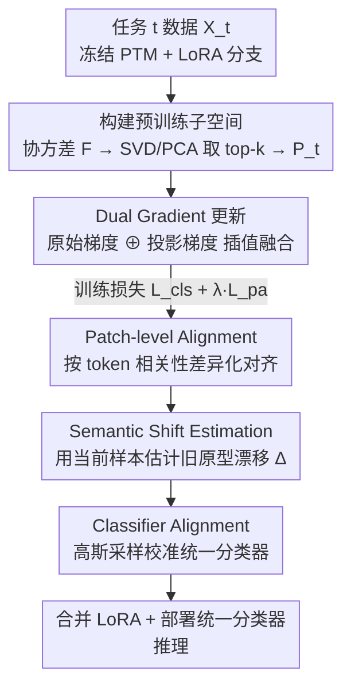

# DGS: Dual Gradient and Semantic-Shift Guided Low-Rank Adaptation for Class Incremental Learning

**会议**: CVPR 2026  
**论文**: [CVF Open Access](https://openaccess.thecvf.com/content/CVPR2026/html/Li_DGS_Dual_Gradient_and_Semantic-Shift_Guided_Low-Rank_Adaptation_for_Class_CVPR_2026_paper.html)  
**代码**: 暂未公开（论文称 "Code will be available"）  
**领域**: 持续学习 / 类增量学习  
**关键词**: 类增量学习, LoRA, 梯度投影, 稳定性-可塑性, 语义漂移  

## 一句话总结
针对预训练模型 + LoRA 做类增量学习时正交梯度约束"太死、压可塑性"的问题，DGS 用一条**插值融合梯度**（原始梯度 ⊕ 投影到预训练子空间的梯度）替代硬正交约束，再配上**语义漂移校准的统一分类器对齐**和**patch-token 对齐损失**，在六个标准 benchmark 上全面超过现有 PEFT-CIL 方法。

## 研究背景与动机
**领域现状**：类增量学习（Class-Incremental Learning, CIL）要求模型按 session 顺序学一批批互不相交的新类，推理时没有 task id，目标是在所有见过的类上都不退化。借助预训练 ViT（PTM）+ 参数高效微调（PEFT，如 prompt / LoRA / adapter）冻结骨干、只训少量参数，已成为当前主流，因为隔离的任务专属模块天然能减轻灾难性遗忘。

**现有痛点**：即便用 LoRA，增量更新仍会带来**表示漂移**——任务专属的 LoRA 子空间会逐渐偏离预训练模型那个结构化流形，导致遗忘加剧。为对抗这点，Gradient Projection Memory 一类方法（InfLoRA 等）把新任务梯度**强行约束为与旧任务子空间正交**。但硬正交把更新限制在一个很窄的子空间里，严重损害**可塑性**，模型学新知识的能力被压死。

**核心矛盾**：稳定性（不忘旧）与可塑性（学得动新）之间的经典权衡。硬正交约束站在稳定性这端，却不尊重 PTM 流形的内在结构，强迫优化偏离"预训练表示本可以自然演化"的方向。

**本文目标**：在不牺牲新任务表达力的前提下抑制遗忘——拆成三件事：(1) 让参数更新方向既稳又能学新；(2) 增量过程中让旧类原型/分类器跟着特征分布漂移做校准；(3) 保住细粒度 patch-token 表示的一致性。

**切入角度**：作者的几何观察是——线性层的梯度更新本就大致落在输入数据张成的 span 内，所以可以用新任务输入在冻结 PTM 下提取的特征子空间，作为"锚定预训练知识"的方向，而不是简单地把旧任务方向"禁掉"。

**核心 idea**：不做硬正交的"减法约束"，改做**插值的"加法融合"**——把原始任务梯度和它在预训练子空间上的投影按比例混合，得到一条同时压低新任务 loss 又保留预训练知识的更新方向，自然导向两个任务低损区的交集。

## 方法详解

### 整体框架
DGS 的骨干是一个冻结的预训练 ViT，每个新任务 $t$ 扩展一支独立的 LoRA 分支 $\Delta W_t = B_t A_t$（$A_t\in\mathbb{R}^{r\times d}$ 降维、$B_t\in\mathbb{R}^{d\times r}$ 升维，秩 $r\ll d$），第 $l$ 层等效权重为 $W_t^l = W_0^l + \sum_{i=1}^{t} B_i^l A_i^l$。一个任务的训练分两阶段走：**训练时**用 Dual-Gradient（DG）策略更新 LoRA，损失为分类损失加 patch 对齐损失 $\mathcal{L}_{cls}+\lambda\mathcal{L}_{pa}$；**训练后（post-train）**用语义漂移估计校准旧类原型，再用高斯采样特征重训一个统一分类器（损失 $\mathcal{L}_{ca}$）。推理时把所有 LoRA 合并进 $W_0$，部署那个校准过的统一分类器。

### 关键设计

**1. Dual Gradient 更新（DG）：用插值融合梯度替代硬正交，把稳定和可塑性"调"出来而不是"砍"出来**

这是全文的核心，直接针对正交约束"压死可塑性"的痛点。训练某任务前，先把该任务数据 $X_t$ 喂进冻结的 $f(\cdot,W_0^l)$ 拿到每层输入特征，计算未中心化的协方差矩阵 $\mathbf{F}_t^l=\frac{1}{n_t}(\mathbf{X}_t^l)^\top \mathbf{X}_t^l$，它刻画了"建立在预训练表示之上的新任务学习空间"。再对 $\mathbf{F}_t^l$ 做 SVD（PCA 思想），取 top-$k$ 特征向量构成投影基 $\mathbf{P}_t^l=(\mathbf{U}_t^l)_k$，这个子空间保留了 PTM 的泛化能力方向。

更新时不直接用原始梯度，而是把它和它在该子空间上的投影做线性插值：

$$\Delta \mathbf{w}_{t,s}^l = -\eta\,(\boldsymbol{g}^*)_{t,s}^l,\qquad (\boldsymbol{g}^*)_{t,s}^l = (1-\alpha)\,\boldsymbol{g}_{t,s}^l + \alpha\,\big(\mathbf{P}_t^l(\mathbf{P}_t^l)^\top \boldsymbol{g}_{t,s}^l\big)$$

其中 $\boldsymbol{g}_{t,s}^l=\partial\mathcal{L}/\partial w_t$ 是第 $s$ 步原始梯度，$\mathbf{P}_t^l(\mathbf{P}_t^l)^\top \boldsymbol{g}$ 是投影到预训练子空间的部分，$\alpha$ 是稳定-可塑性的旋钮。投影项把学习"锚"在 PTM 流形里抑制漂移、保旧知识；原始项保留完整的任务专属适配力不被压制。$\alpha$ 越大越偏投影方向、更稳但学得慢；越小越偏原始梯度、可塑但易忘。和正交方法的本质区别在于：正交是"禁止某个方向"，DG 是"在两条好方向之间取折中"，因此能把优化自然导向新旧任务低损区的交集。注意分类头 $cls_t$ 只用原始梯度更新，DG 只作用在 LoRA 适配器上。

**2. Patch-level Alignment 损失（PA）：让强相关 patch 自由学、弱相关 patch 向旧模型对齐，护住细粒度结构**

class token 是当前任务的主表示，但 patch token 携带了大量通用预训练知识、对稳定性至关重要——完全放开 patch 会灾难遗忘，完全冻结又压可塑性。PA 损失据此做**差异化**对齐：

$$\mathcal{L}_{pa}=\frac{1}{H}\sum_{j=1}^{H}\frac{\arccos\Theta_{\cos}}{\pi}\,\big\|p_j^t-p_j^{t-1}\big\|_2$$

$p_j^t$、$p_j^{t-1}$ 分别是当前任务与上一任务模型输出的第 $j$ 个 patch token，$\Theta_{\cos}=\frac{p_0^t\cdot p_j^t}{\|p_0^t\|\|p_j^t\|}$ 是该 patch 与 class token $p_0^t$ 的余弦相似度，经 $\arccos(\cdot)/\pi$ 映到 $(0,1)$（0 表示最相似、1 表示最不相似）。这个权重的妙处：与 class token 高度相关（任务相关性强）的 patch，$\arccos$ 权重小，被允许自由适配；相关性弱的 patch 权重大，被强行拉回上一任务的表示。这样在保住通用 patch 结构的同时不挡住任务相关 patch 的学习。

**3. 语义漂移引导的分类器对齐（CA + SSE）：在校准过的旧原型上重训统一分类器，消除子分类器边界错位**

各任务的子分类器是独立更新的，拼起来后决策边界容易错位；而骨干在增量过程中不断变化，旧 session 存下的原型会"过期"，直接拿过期原型重训全局分类器并不合理。CA 先用**语义漂移估计（Semantic Shift Estimation, SSE）**给旧原型打补丁：旧类原型更新为 $\mu_c^t=\Delta_c^{t-1\to t}+\mu_c^{t-1}$，原型本身定义为该类样本特征均值 $\mu_c^t=\frac{1}{N_c}\sum_i [y_i=c]\,\phi_t(x_i,\theta_{fea})$。漂移量 $\Delta_c^{t-1\to t}$ 借鉴 SDC，用当前样本在两任务间的 class-token 位移 $\delta_i^{t-1\to t}=(p_0^t)_i-(p_0^{t-1})_i$ 加权估计：

$$\Delta_c^{t-1\to t}\approx\frac{\sum_i w_i\,\delta_i^{t-1\to t}}{\sum_i w_i},\qquad w_i=\exp\!\Big(-\frac{\|(p_0^{t-1})_i-\mu_c^{t-1}\|}{2\sigma^2}\Big)$$

离类均值越近的样本权重越大，让漂移估计更聚焦于类中心。拿到校准后的原型统计 $\mathcal{N}(\mu_c,\sigma_c)$ 后，对每类高斯采样 $K_n$ 个特征 $\mathcal{V}_c$，把所有任务的子分类器拼成统一分类器，用交叉熵 $\mathcal{L}_{ca}(\mathcal{V}_c,\theta_{cls})=-\sum_{i}\log\frac{\exp(\theta_{cls}(v_i))}{\sum_{k\in C}\exp(\theta_{cls}^k(v_i))}$ 重训。这一步让统一分类器对齐到更新后的特征分布上，纠正子分类器边界错位。

### 损失函数 / 训练策略
分类损失用**角度间隔损失**（angular penalty，替代普通交叉熵以保证类间角度间隔）：$\mathcal{L}_{cls}=-\frac{1}{N_t}\sum_{j}\log\frac{e^{\tau\cos\theta_j}}{e^{\tau\cos\theta_j}+\sum_{i\ne j}e^{\tau\cos\theta_i}}$，其中 $\cos\theta_j=\frac{w_j f_{\theta_j}}{\|w_j\|\|f_{\theta_j}\|}$，$\tau$ 为尺度因子。训练期总损失 $\mathcal{L}_{cls}+\lambda\mathcal{L}_{pa}$ 经 DG 更新 LoRA；任务训练结束后再单独跑 CA 重训分类器。整体流程见原文 Algorithm 1：每任务先存旧原型 → 算 $\mathbf{P}_t^l$ → 逐 batch 用 DG 训 LoRA → 估计原型漂移并重训统一分类器。默认超参 $r=32,\ \tau=20,\ \lambda=0.4,\ \alpha=0.5$；优化器 SGD，lr 0.01 余弦退火，20 epoch，batch 48。

## 实验关键数据

### 主实验
六个 CIL benchmark（ViT-B/16-IN21K 骨干，无 exemplar），DGS 在全部数据集的 $A_{avg}$ 与 $A_{Last}$ 上都拿第一。下表摘取代表性结果（$A_{Last}$ / %，括注与第二名的差距）：

| 数据集 | 之前最佳（方法） | DGS $A_{Last}$ | 提升 |
|--------|------------------|----------------|------|
| ImageNet-R B0Inc20 | 80.87（SLCA） | **81.72** | +0.85 |
| ImageNet-A B0Inc20 | 62.15（SSIAT） | **63.53** | +1.38 |
| CIFAR-100 B0Inc5 | 90.16（InfLoRA） | **90.44** | +0.28 |
| ObjectNet B0Inc10 | 63.62（MOS） | **64.85** | +1.23 |
| OmniBenchmark B0Inc30 | 80.05（MOS） | **80.50** | +0.45 |
| CUB B0Inc10 | 89.44（MOS） | 89.27 | −0.17 ⚠️ |

作者强调在域差距更大的 ImageNet-R/A 上优势最明显，正文称 $A_{Last}$ 较次优"大幅领先 2.14%"、$A_{avg}$ 领先 2.11%（⚠️ 该 2.14% 是与表中不同对比口径下的差距，与上表单列差值不完全一致，以原文为准）。同时在 ImageNet-R 上 DGS 用与其他方法相近的可训练参数量却取得最高精度。

### 消融实验
ImageNet-R B0Inc20 / ObjectNet B0Inc10，逐步叠加组件（$A_{Last}\uparrow$，$F_{Last}\downarrow$ 为遗忘）：

| 配置 | IN-R $A$ | IN-R $F$ | ObjNet $A$ | ObjNet $F$ | 说明 |
|------|---------|---------|-----------|-----------|------|
| I. baseline（LoRA+$\mathcal{L}_{cls}$） | 78.90 | 9.86 | 61.30 | 12.98 | 仅任务专属 LoRA |
| II. +DG | 79.68 | 6.88 | 62.64 | 10.08 | 精度↑、遗忘大幅↓ |
| III. +PA | 80.15 | 5.30 | 63.22 | 9.17 | 遗忘进一步降到最低 |
| IV. +CA（无 PA） | 81.26 | 8.25 | 64.47 | 14.57 | 精度跳升但遗忘回升 |
| V. Full（DG+PA+CA） | **81.72** | 5.14 | **64.85** | 14.02 | 综合最佳 |

### 关键发现
- **DG 是遗忘的主要"刹车"**：单加 DG 就把 ImageNet-R/ObjectNet 遗忘各降 2.98% / 2.9%，验证融合梯度比纯原始梯度更稳。
- **PA 专治遗忘**：No.III 把遗忘压到全表最低（5.30 / 9.17），印证 patch 对齐是在护细粒度一致性。
- **CA 大幅提精度但代价是遗忘回升**：No.IV 精度跳到 81.26/64.47，但 $F$ 反弹（8.25 / 14.57）；最终把 PA 加回（No.V）才把遗忘压回 5.14（IN-R）。⚠️ 注意 ObjectNet 上 Full 的遗忘（14.02）仍明显高于只用 DG+PA 的 9.17——即 CA 换来的是精度而非更低遗忘，这是个值得注意的权衡，原文未深入讨论。
- **$\alpha$ 的物理意义被实验坐实**：$\alpha$ 越大越偏投影（稳但可塑性差、精度降），越小越偏原始梯度（可塑但遗忘升），$\alpha=0.5$ 时稳定-可塑性平衡、综合最好。
- **超参敏感性**（ImageNet-R）：$\tau$ 在 20 最佳（79.15→81.72→80.48→79.68）；$\lambda$ 在 0.4 最佳；秩 $r$ 从 8→64 单调微增（80.65→81.74），作者取 $r=32$ 折中精度与参数量。

## 亮点与洞察
- **把"减法约束"改成"加法融合"是这篇最 aha 的点**：同一个投影矩阵 $\mathbf{P}_t(\mathbf{P}_t)^\top$，正交方法拿它做"投影到补空间去掉"，DGS 拿它做"保留方向并插值"，一个旋钮 $\alpha$ 就把硬约束软化成连续可调的 trade-off，思路干净且即插即用。
- **patch token 的差异化对齐很巧**：用与 class token 的余弦相似度当"该不该放开"的门控权重，避免了"全放/全冻"的二选一，这套"按相关性分配可塑性"的思路可迁移到任意 token 级别的持续学习/蒸馏。
- **复用线性层梯度落在输入 span 内的几何先验**来构造子空间，而非靠存旧数据，整条流程不需要 exemplar，内存友好。

## 局限与展望
- **CA 与低遗忘并不兼得**：消融显示加 CA 后遗忘 $F$ 反而回升（尤其 ObjectNet），说明分类器对齐换精度可能以牺牲稳定性为代价，作者未给出缓解方案。
- **方法栈较重**：DG（每层 SVD/PCA）+ 语义漂移估计 + 高斯采样重训分类器，组件多、每任务有额外预处理与 post-train 开销，论文未报告训练时间成本。⚠️
- **提升幅度在易数据集上较小**：CIFAR-100 仅 +0.28，CUB 上甚至略低于 MOS（−0.17），增益主要集中在大域差距数据集，普适性待观察。
- **代码尚未公开**，复现性暂时受限。作者展望方向是更先进的梯度更新策略与多模态持续学习。

## 相关工作与启发
- **vs InfLoRA / 正交梯度类方法**：它们把新梯度强约束到旧子空间的正交补，硬砍可塑性；DGS 改为原始梯度与投影梯度插值融合，用 $\alpha$ 连续调节稳定-可塑性，消融中遗忘与精度同时改善。
- **vs SSIAT / SDC（语义漂移补偿）**：DGS 借鉴 SDC 的漂移估计来校准旧原型，但把它嵌进"高斯采样重训统一分类器"的 CA 流程，针对的是子分类器边界错位而非单纯原型更新。
- **vs MOS / EASE（adapter 扩展 + 原型合成）**：同属 PTM-CIL，但 DGS 的差异在参数更新层面的梯度融合 + patch 级一致性约束，在大域差距 benchmark（IN-R/A）上更占优，易数据集上与 MOS 互有胜负。

## 评分
- 新颖性: ⭐⭐⭐⭐ 把正交"减法"换成插值"加法"梯度融合，角度新颖且自洽；但 CA/PA 多为已有思路的组合。
- 实验充分度: ⭐⭐⭐⭐ 六数据集 + 多骨干 + 组件/超参全消融，扎实；缺训练成本与遗忘-精度权衡的深入分析。
- 写作质量: ⭐⭐⭐⭐ 动机几何直觉清楚、公式完整；个别数字口径（2.14%）与表格对应需读者自行对齐。
- 价值: ⭐⭐⭐⭐ 即插即用的梯度融合策略对 PEFT-CIL 有实际参考价值，无 exemplar、参数量友好。

<!-- RELATED:START -->

## 相关论文

- [\[CVPR 2026\] Dual-Estimator: Decoupling Global and Local Semantic Shift for Drift Compensation in Class-Incremental Learning](dual-estimator_decoupling_global_and_local_semantic_shift_for_drift_compensation.md)
- [\[CVPR 2026\] Semantic-Guided Global-Local Collaborative Prompt Learning for Few-Shot Class Incremental Learning](semantic-guided_global-local_collaborative_prompt_learning_for_few-shot_class_in.md)
- [\[CVPR 2026\] Geometry-driven OOD Detectors Are Class-Incremental Learners](geometry-driven_ood_detectors_are_class-incremental_learners.md)
- [\[CVPR 2026\] Nonparametric Deep Fine-grained Clustering with Low-Rank Guided Vision-Language Model](nonparametric_deep_fine-grained_clustering_with_low-rank_guided_vision-language_.md)
- [\[CVPR 2026\] The Devil Is in Gradient Entanglement: Energy-Aware Gradient Coordinator for Robust Generalized Category Discovery](the_devil_is_in_gradient_entanglement_energy-aware_gradient_coordinator_for_robu.md)

<!-- RELATED:END -->
