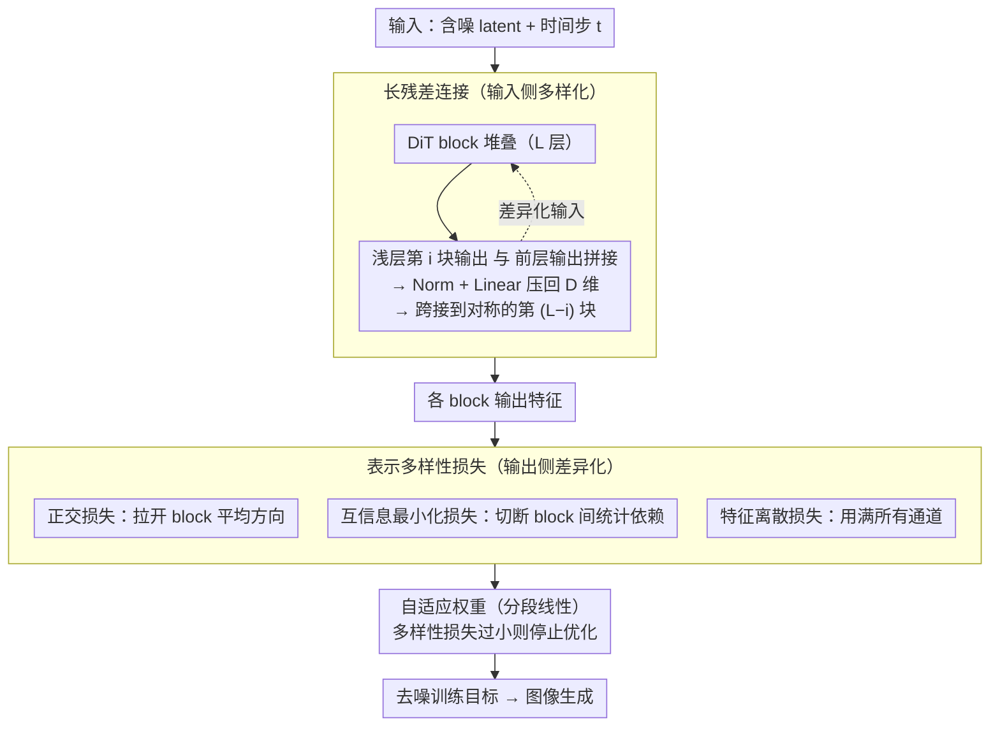

# DiverseDiT: Towards Diverse Representation Learning in Diffusion Transformers

**会议**: CVPR 2026  
**arXiv**: [2603.04239](https://arxiv.org/abs/2603.04239)  
**代码**: [有](https://github.com/kobeshegu/DiverseDiT)  
**领域**: 自监督/表示学习  
**关键词**: 扩散 Transformer, 表示多样性, 长残差连接, 多样性损失, 图像生成

## 一句话总结

通过系统分析发现 DiT 各 block 间的表示多样性是有效学习的关键因素，提出 DiverseDiT：用长残差连接多样化输入 + 表示多样性损失显式促进 block 间特征差异化，无需外部引导模型即可加速收敛并提升生成质量。

## 研究背景与动机

### 1. 领域现状

Diffusion Transformers (DiT) 凭借出色的可扩展性在视觉生成领域取得突破。近期研究发现高性能扩散模型内部能捕获更具判别性的表示，由此催生了 REPA 等方法——将 DiT 中间层表示与预训练视觉编码器（如 DINOv2）的特征对齐来引导表示学习，后续 REPA-E、REG 等进一步扩展了这一思路。

### 2. 痛点

- **依赖外部大模型**：REPA 系列方法需要预训练好的强力视觉编码器（DINOv2、MAE 等），这些编码器本身训练代价巨大
- **机制不清**：DiT 如何学到有意义的表示？为什么外部对齐有效？这些根本问题缺乏理解
- **盲目对齐反而有害**：对更多 block 用更多编码器做对齐，性能反而可能下降

### 3. 核心矛盾

现有方法在"用外部模型提供引导"和"理解模型内在表示学习机制"之间存在断层——大家在用 REPA 但不清楚它为什么有效，导致无法设计更原理性的改进方案。

### 4. 要解决什么

揭示 DiT 表示学习的内在机制，并基于此设计无需外部引导的高效表示学习框架。

### 5. 切入角度

用 CKA（Centered Kernel Alignment）系统度量训练过程中各 block 表示的相似性变化，从"block 间表示多样性"这一新视角理解和改进 DiT。

### 6. 核心 idea

**表示多样性假说**：DiT 中各 block 间的表示差异越大，模型学得越好。REPA 之所以有效，本质是因为它增加了被对齐 block 与其他 block 的表示差异。基于此，可以直接设计机制促进多样性，而不必依赖外部编码器。

## 方法详解

### 整体框架

DiverseDiT 要解决的问题是：DiT 学得好不好，取决于各 block 间表示的多样性，而以往要靠外部编码器（REPA 用 DINOv2）从侧面提升这种多样性。它的思路是直接从内部下手——既改造 block 的输入，也约束 block 的输出，让多样性自己长出来。整条 pipeline 在标准 DiT 之上叠两个互补组件：一个是**长残差连接**，把浅层 block 的输出跨接到对称的深层 block，从源头打破"每层输入都来自上一层"的同质化；另一个是**表示多样性损失**，由正交、互信息最小化、特征离散三项组成，在训练时显式拉开各 block 输出特征的差异。前者管"输入多样化"、后者管"输出差异化"，两层叠加且全程不碰任何外部预训练模型。

### 关键设计

**1. 长残差连接：从输入侧打破 block 间的同质化**

传统 DiT 里每个 block 的输入只来自上一层输出，逐层传递下来信号越来越像，是表示多样性退化的根源。长残差连接把第 $i$ 个 block 的输出直接接到对称位置的第 $(L-i)$ 个 block（$L$ 为总层数），让深层 block 在常规输入之外再收到一路差异化的浅层信号。具体融合方式是把浅层特征 $f_i$ 与前一层输出 $f_{l-1}$ 拼接后投影回原维度：

$$f_l = \text{Linear}(\text{Norm}(f_i \oplus f_{l-1}))$$

其中 $\oplus$ 是拼接，拼出来的 $2D$ 维特征经 LayerNorm 再用一层 Linear 压回 $D$ 维。这样不同 block 拿到的输入不再趋同，既促进了浅层特征的复用，也防止了表示坍缩——而代价只是几个 Linear 层的少量参数。

**2. 正交损失 $\mathcal{L}_{\text{orth}}$：让 block 的平均表示方向彼此正交**

光改输入还不够，输出侧也要主动拉开。正交损失盯的是冗余问题：如果两个 block 的整体表示方向接近，它们学的东西就重复了。做法是先把某个 block 的 token 级表示沿 batch 和 token 维度求均值，得到一个代表该 block 的平均向量 $\mu_l \in \mathbb{R}^D$，再去惩罚所选 block 对之间 $\mu_l$ 的余弦相似度。相似度越高罚得越重，迫使不同 block 朝正交方向发展，减少方向上的重叠。

**3. 互信息最小化损失 $\mathcal{L}_{\text{MI}}$：在统计层面切断 block 间的依赖**

正交只约束了平均方向，block 之间还可能存在更细粒度的统计相关。$\mathcal{L}_{\text{MI}}$ 想让各 block 表示在统计上相互独立，使每个 block 捕获互补信息。直接估计高维表示间的互信息要算协方差矩阵，代价很高；这里改用归一化 token 向量两两之间的平均余弦相似度作为互信息的高效代理，相似度低就近似认为统计依赖小。这样既绕开了高维协方差计算，又能在训练中持续压低 block 间的统计耦合。

**4. 特征离散损失 $\mathcal{L}_{\text{disp}}$：逼模型用满所有通道**

前三项管 block 之间的关系，这一项管单个表示内部的"摊不开"问题——激活如果只集中在少数通道，特征容量就被浪费了。$\mathcal{L}_{\text{disp}}$ 把各 block 表示展平并归一化，算出每个通道维度上的平均激活值，再去最大化这些激活值在通道维度上的方差（实现上取负号作为损失）。方差越大意味着不同通道被用得越均匀，从而鼓励模型充分利用全部特征通道，而不是把信息挤在几个维度里。

### 损失函数 / 训练策略

总多样性损失：$\mathcal{L}_{\text{div}} = 0.33 \cdot \mathcal{L}_{\text{orth}} + 0.33 \cdot \mathcal{L}_{\text{MI}} + 0.33 \cdot \mathcal{L}_{\text{disp}}$

**自适应权重机制**：当 $\mathcal{L}_{\text{div}}$ 过小（趋近 0）时模型会发散（过度分离阻碍学习共享语义表示），因此设置分段线性权重：

- $\mathcal{L}_{\text{div}} > 0.5$：权重 $w=1$（正常优化）
- $0.1 < \mathcal{L}_{\text{div}} \le 0.5$：权重 $w = (\mathcal{L}_{\text{div}} - 0.1) / 0.5$（逐渐减弱）
- $\mathcal{L}_{\text{div}} \le 0.1$：权重 $w=0$（停止优化多样性）

训练配置：AdamW, lr=1e-4, batch size=256, 8×H800 GPU。仅为长残差连接引入少量额外参数（Linear 层）。

## 实验关键数据

### 主实验

**表1：不同模型规模在 ImageNet 256×256 上的结果（无CFG，400K iterations）**

| 模型 | FID↓ | sFID↓ | IS↑ | Prec.↑ | Rec.↑ |
|------|------|-------|-----|--------|-------|
| SiT-B | 36.80 | 6.77 | 40.09 | 0.51 | 0.63 |
| **+ Ours** | **28.05** | **6.04** | **50.66** | **0.57** | 0.63 |
| REPA-B | 22.99 | 6.70 | 64.73 | 0.59 | 0.65 |
| **+ Ours** | **17.29** | **6.56** | **79.92** | **0.62** | 0.65 |
| SiT-XL | 17.43 | 5.11 | 76.00 | 0.64 | 0.64 |
| **+ Ours** | **12.42** | **4.85** | **95.01** | **0.68** | 0.63 |
| REPA-XL | 8.73 | 5.21 | 118.68 | 0.69 | 0.65 |
| **+ Ours** | **8.09** | **5.02** | **123.23** | **0.70** | 0.65 |

**表2：与 SOTA 方法在 ImageNet 256×256 上的对比（有CFG）**

| 方法 | Epochs | FID↓ | IS↑ | Rec.↑ |
|------|--------|------|-----|-------|
| DiT-XL/2 | 1400 | 2.27 | 278.20 | 0.57 |
| SiT-XL/2 | 1400 | 2.06 | 270.30 | 0.59 |
| REPA | 200 | 1.96 | 264.00 | 0.60 |
| REG | 800 | 1.36 | 299.40 | 0.66 |
| SRA | 800 | 1.58 | 311.40 | 0.63 |
| **DiverseDiT (Ours)** | **80** | **1.89** | **276.85** | **0.66** |
| **DiverseDiT (Ours)** | **200** | **1.52** | **282.72** | **0.66** |

**单步生成 SOTA（ImageNet 256×256，有CFG）**：MeanFlow-XL/2 + Ours 达到 FID=**2.99**，超越所有现有单步方法。

### 消融实验

**组件消融（SiT-B / REPA-B, 400K iter）**：

| 配置 | SiT-B FID↓ | REPA-B FID↓ |
|------|-----------|------------|
| Full（完整方法） | 28.05 | 17.29 |
| w/o diversity loss | 32.77 | 20.66 |
| w/o residual connections | 33.72 | 18.18 |

**损失变体消融（REPA-B）**：

| 配置 | FID↓ | IS↑ |
|------|------|-----|
| Full | 17.29 | 79.92 |
| only $\mathcal{L}_{\text{orth}}$ | 18.97 | 75.44 |
| only $\mathcal{L}_{\text{MI}}$ | 17.70 | 78.34 |
| only $\mathcal{L}_{\text{disp}}$ | 20.85 | 68.74 |

**自适应范围消融**：恒定权重导致发散；[0.1, 0.5] 范围最优（FID 28.05），比 [0.2, 0.7]（30.59）和 [0.3, 0.9]（31.85）更好。

### 关键发现

1. **一致性提升**：在 SiT、REPA、MeanFlow 三种基线上，B/L/XL 三种规模下，方法均带来稳定改善
2. **跨规模竞争力**：REPA-B + Ours (17.29) 优于原始 SiT-L (18.77)，REPA-L + Ours (8.47) 优于 REPA-XL (8.73)
3. **训练效率**：仅用 80 epochs 即可达到 FID 1.89，优于 REPA 200 epochs 的 1.96
4. **与现有方法互补**：SiT-B + Ours + DispLoss + SRA = FID 21.95，优于 REPA-B 的 22.99（且不需要外部编码器）

## 亮点与洞察

- **分析驱动设计**：先做系统的 CKA 分析揭示"表示多样性"这一关键因素，再据此设计方法，逻辑链条完整
- **为 REPA 提供新解释**：REPA 有效不是因为外部知识本身，而是因为它增加了目标 block 与其他 block 的表示差异——这一洞察非常有启发性
- **简洁高效**：两个组件概念简单、实现轻量，仅引入少量参数（长残差的 Linear 层），适用性广
- **无需外部模型**：摆脱了对 DINOv2/MAE 等大型预训练编码器的依赖

## 局限与展望

- 自适应权重机制（分段线性函数）略显 ad-hoc，阈值 0.1/0.5 缺乏理论基础
- block 对的选取策略（子集 $\mathcal{P}$）未深入讨论，最优选择可能与模型规模/深度相关
- 仅在 ImageNet 上验证，未测试文本到图像/视频等更复杂场景
- 与 REG (FID 1.36@800ep) 相比仍有差距（Ours FID 1.52@200ep），长训练下的表现未充分探索
- 长残差连接在非对称架构（如 U-ViT）上的泛化性待验证

## 相关工作与启发

- **REPA [Yu et al.]**：用外部编码器对齐中间隐状态，本文解释了其有效性的根源
- **DispLoss [Wang et al.]**：离散损失鼓励表示在嵌入空间中分散，DiverseDiT 的思路更系统（输入多样性 + 输出多样性双管齐下）
- **SRA [Li et al.]**：用低噪声层引导高噪声层的自对齐方法，与 DiverseDiT 互补可叠加
- **MeanFlow [Liu et al.]**：单步生成方法，DiverseDiT 可无缝应用并刷新 SOTA
- **启发**：block 间多样性的视角可推广到其他 Transformer 架构（ViT、LLM）——深层网络中的"层间协作 vs 层间冗余"是个值得深入研究的普适问题

## 评分

⭐⭐⭐⭐ 扎实的分析驱动工作，从 CKA 观察到方法设计逻辑自洽，两个组件简洁有效且与现有方法互补，实验充分覆盖多基线多规模；轻微不足在于自适应权重设计偏经验性，且缺乏对更广泛生成场景的验证。

<!-- RELATED:START -->

## 相关论文

- [\[ICLR 2026\] No Other Representation Component Is Needed: Diffusion Transformers Can Provide Representation Guidance by Themselves](../../ICLR2026/self_supervised/no_other_representation_component_is_needed_diffusion_transformers_can_provide_r.md)
- [\[CVPR 2026\] Vision Transformers Need More Than Registers](vision_transformers_need_more_than_registers.md)
- [\[CVPR 2026\] Representation Learning for Spatiotemporal Physical Systems](representation_learning_for_spatiotemporal_physica.md)
- [\[CVPR 2026\] Finding Distributed Object-Centric Properties in Self-Supervised Transformers](finding_distributed_object-centric_properties_in_self-supervised_transformers.md)
- [\[CVPR 2026\] TrackMAE: Video Representation Learning via Track, Mask, and Predict](trackmae_video_representation_learning_via_track_mask_and_predict.md)

<!-- RELATED:END -->
