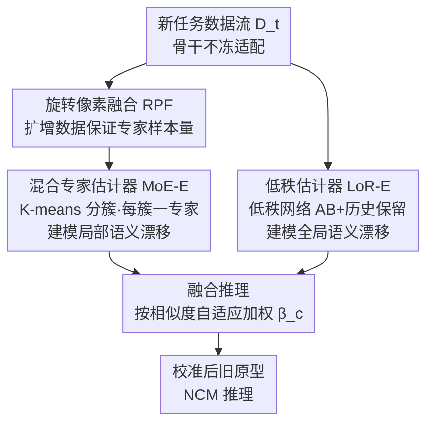

# Dual-Estimator: Decoupling Global and Local Semantic Shift for Drift Compensation in Class-Incremental Learning

**会议**: CVPR 2026  
**论文**: [CVF Open Access](https://openaccess.thecvf.com/content/CVPR2026/html/Xu_Dual-Estimator_Decoupling_Global_and_Local_Semantic_Shift_for_Drift_Compensation_CVPR_2026_paper.html)  
**代码**: https://github.com/AldrinLake/Dual-E.git  
**领域**: 持续学习 / 类增量学习  
**关键词**: 无样本类增量学习, 漂移补偿, 语义漂移, 专家混合, 低秩估计  

## 一句话总结
针对无样本类增量学习中"特征漂移补偿假设语义分布与漂移均匀"这一不切实际的前提，本文用一个混合专家估计器（建模局部语义漂移）和一个低秩估计器（建模全局语义漂移）协同解耦补偿，二者都靠闭式解在几轮内更新、可即插即用挂到现有方法上，在六个数据集上稳定超过当前 SOTA。

## 研究背景与动机
**领域现状**：类增量学习（CIL）要求模型按任务序列依次学习互斥的类别。为了避免缓存旧样本带来的存储与隐私问题，**无样本类增量学习（EFCIL）** 更贴近实际——它不存原始样本，而是把旧类的**类原型（prototype）** 等中间表征存下来，用最近类均值（NCM）做推理或校准分类头。

**现有痛点**：骨干网络（backbone）会随新任务持续更新，导致此前存下的旧类原型相对于新的特征空间"过时"了（语义漂移）；但若把骨干冻住，又会牺牲模型的可塑性。**漂移补偿（drift compensation）** 正是为了化解这个两难：在不冻骨干的前提下，学习表征空间从旧模型 $f_{\theta_{t-1}}$ 到新模型 $f_{\theta_t}$ 的迁移模式，把旧原型"搬运"到更新后的空间里。

**核心矛盾**：现有漂移补偿方法（SDC、ADC、LDC、DP 等）几乎都默认**语义分布均匀、语义漂移均匀**，而真实数据流是随机到来的、远非均匀。这带来两类非均匀性被忽视：

- **任务内（intra-task）语义分布非均匀**：训练漂移估计器时，低频语义（如花椰菜）出现得少，对参数更新贡献小，导致与之语义相关的旧类（如黄瓜）补偿不准；估计器还容易被高频语义主导，把补偿后的旧原型整体拉偏。
- **任务间（inter-task）语义漂移非均匀**：不同旧类与新类的语义相似度不同，本应**按相似度差异化校准**，可均匀的"全幅度校准"会对那些漂移很大的类施加不合适的修正。

**核心 idea**：用**两个互补的估计器解耦"局部语义漂移"和"全局语义漂移"**——混合专家估计器（MoE-E）从局部视角细化低频语义的补偿，低秩估计器（LoR-E）从全局视角给大漂移类提供更温和、保留历史的补偿，推理时按相似度自适应融合二者。

## 方法详解

### 整体框架
Dual-E 是一个挂在标准 EFCIL baseline（交叉熵 + 知识蒸馏）之上的**即插即用补偿模块**。在每个增量任务 $t$ 上，模型先从上一任务初始化参数（$\theta_t \leftarrow \theta_{t-1}$），在新数据 $D_t^{train}$ 上用分类损失 $\mathcal{L}_{cls}$ 加蒸馏损失 $\mathcal{L}_{kd}$ 适配新任务、骨干不冻。适配完成后冻结 $f_{\theta_t}$ 与 $f_{\theta_{t-1}}$，用当前可见数据训练两个漂移估计器：

- **MoE-E** 在旧表征空间用 K-means 把数据切成 $K$ 个局部簇，每个簇训练一个线性专家，建模该局部的迁移模式；为了让每个专家在"一个 epoch + 闭式解"下也有足够样本，引入**旋转像素融合（RPF）** 做数据增强。
- **LoR-E** 用一个低秩网络 $T^{global}=AB$ 拟合整个表征空间的公共迁移模式，并加一项历史保留约束防止过度调整。

推理时，对每个旧类原型 $p_c$，按它与各专家"键向量"的相似度自适应地把两个估计器的补偿结果**融合**，再做 NCM 推理。整体 pipeline 如下：

### 关键设计

**1. 混合专家估计器 MoE-E：用局部专家救活低频语义的补偿**

要解决的是任务内语义分布非均匀。若像 LDC 那样学一个**统一的线性迁移函数** $\mathcal{T}: f_{\theta_{t-1}} \to f_{\theta_t}$，低频语义贡献小、补偿就被高频语义带偏。一个直觉解法是给每个旧类 $c$ 学一个专属迁移 $\mathcal{T}_c$，只用与它语义相似的数据 $SSD_t(c)=\{x \mid \Delta(p_c, m) \le \delta,\, x \in D_t^{train}\}$（$m=f_{\theta_{t-1}}(x)$，$\delta$ 为邻域半径）来拟合 $\min \mathbb{E}_{x\sim SSD_t(c)}\|\mathcal{T}_c(m)-z\|_2$。但"一类一专家"会切断语义相似类之间的知识共享，且当新任务语义大幅偏移时，有些旧类根本找不到语义相关数据。

MoE-E 的折中是：**语义相似的旧类共享同一个局部迁移模式**。把增强后的数据 $\widetilde{D}_t^{train}$ 在旧表征空间用 K-means 切成 $K$ 个簇 $\{S_k\}$，每个簇配一个专家 $\mathcal{T}_k^{local}$（线性层参数 $Q_k\in\mathbb{R}^{d\times d}$，簇心 $\mu_k$ 充当路由"键"）。由于两个骨干都冻住，专家有**闭式解**：

$$\mathbf{Q}_k = \left(\mathbf{M}_k^{\mathrm{T}}\mathbf{M}_k + \varepsilon\mathbf{I}\right)^{-1}\left(\mathbf{M}_k^{\mathrm{T}}\mathbf{Z}_k\right)$$

其中 $\mathbf{M}_k,\mathbf{Z}_k$ 分别是簇 $S_k$ 里样本在旧/新骨干下的嵌入矩阵，$\varepsilon=10^{-9}$ 防病态。补偿旧原型时按 $p_c$ 与各簇心的余弦相似度做 softmax 得到权重 $w_c^k$，加权求和 $\Omega^{MoE}(p_c)=\sum_k \mathcal{T}_k^{local}(p_c)\cdot w_c^k$，其中 $\mathcal{T}_k^{local}(p_c)=p_c Q_k$。这样每个旧类不再被全局高频语义主导，而是匹配到与其语义最近的局部迁移模式。

**2. 低秩估计器 LoR-E：给大漂移旧类一个温和、保历史的全局补偿**

MoE-E 偏局部，对那些与新任务语义差距大、缺乏相似数据的旧类反而容易补偿不当。LoR-E 从全局视角互补：用一个低秩迁移函数 $T^{global}=AB$（$A\in\mathbb{R}^{d\times r}$，$B\in\mathbb{R}^{r\times d}$，$r\ll d$）捕捉整个空间的公共迁移模式，低秩天然避免过拟合到特定语义。其目标是

$$\arg\min_{\mathbf{A},\mathbf{B}}\ \|\mathbf{M}\mathbf{A}\mathbf{B}-\mathbf{Z}\|_{\mathrm{F}}^{2} + \alpha\|\mathbf{P}\mathbf{A}\mathbf{B}-\mathbf{P}\|_{\mathrm{F}}^{2}$$

第一项是岭回归形式的全局漂移拟合（$\mathbf{M},\mathbf{Z}$ 为全体新任务样本在旧/新骨干下的嵌入）；第二项是**历史保留（HP）**——$\mathbf{P}$ 堆叠了所有旧类原型，约束补偿后的原型仍接近原值，从而防止对旧类"过度调整"、并促成跨任务的知识迁移。这正是 LoR-E 比 MoE-E "更温和"的来源。由于是双变量目标，采用交替优化，$A$、$B$ 各有闭式更新式（用 $E=\mathbf{P}^{\mathrm{T}}\mathbf{P}$、$G=\mathbf{M}^{\mathrm{T}}\mathbf{M}$ 表示），几轮迭代即收敛；旧原型按 $p\leftarrow pAB$ 更新。

**3. 旋转像素融合 RPF：让分簇后样本稀少的专家也能学好闭式解**

MoE-E 把数据切成 $K$ 簇后，每个专家拿到的样本骤减；在长任务序列（如 20、50 个任务）下每任务类别本就少，分到每个专家几乎不够"一个 epoch 闭式更新"学出可靠映射。RPF 专门为此扩增：

$$x_{i,j}^{fused}=\tfrac{1}{2}\,\mathrm{rotate}(x_i,\eta)+\tfrac{1}{2}\,\mathrm{rotate}(x_j,\eta),\quad \eta\in\{0,90,180,270\}$$

即随机旋转两张图后做像素级半混合，并入 $\widetilde{D}_t^{train}$。它既补足了每个专家的样本量、保证闭式解可解，又增加了样本语义多样性，间接改善对低频语义迁移模式的建模。消融显示这一步在长序列下至关重要（去掉后 TinyImageNet 20 任务直接崩到个位数）。

**4. 相似度自适应融合推理：按旧类与新任务的语义差距分配全局/局部权重**

这是解决任务间漂移非均匀的落点。对旧类原型 $p_c$，融合两个估计器的补偿：

$$p_c \leftarrow \beta_c\cdot\Omega^{MoE}(p_c) + (1-\beta_c)\cdot\Omega^{LoR}(p_c)$$

权重 $\beta_c=\max_{\mu_k}\dfrac{p_c^{\mathrm{T}}\mu_k}{\|p_c\|_2\|\mu_k\|_2}$ 取 $p_c$ 与所有专家键 $\{\mu_k\}$ 的**最大余弦相似度**。含义直观：当某旧类能在某个局部簇里找到很相似的语义（$\beta_c$ 大），就更信任 MoE-E 的局部补偿；反之（与新任务语义差距大、$\beta_c$ 小），就把权重交给 LoR-E 的全局、保历史补偿，避免被不相关的局部模式误导。最终用融合后的旧原型与新类原型一起做 NCM 推理。

### 损失函数 / 训练策略
新任务适配阶段目标为分类损失加蒸馏损失（均固定旧模型参数）：

$$\min_{\theta_t,\pi_t}\ \mathbb{E}_{(x,y)\sim D_t^{train}}\big[\mathcal{L}_{cls}(\sigma(g_{\pi_t}(\mathbf{z})),y)\big] + \mathbb{E}_{x\sim D_t^{train}}\big[\mathcal{L}_{kd}(g_{\pi_{t-1}}(\mathbf{m}),g_{\pi_t}(\mathbf{z}))\big]$$

其中 $\mathcal{L}_{cls}$ 用交叉熵、$\mathcal{L}_{kd}$ 用 KL 散度。两个估计器本身**不靠梯度训练**，而是用前述闭式 / 交替闭式解在几轮内求得，因此即插即用且开销低。骨干为从零训练的 ResNet-18，初始任务 200 epoch、后续任务 100 epoch。

## 实验关键数据

### 主实验
在 CIFAR-100 / TinyImageNet / ImageNet-Subset 上以 last-task 准确率 $A_{last}$ 与平均增量准确率 $A_{inc}$ 评估，Dual-E 全面领先，且**任务越长优势越明显**（20 任务下相对次优分别提升 2.28% / 1.66% / 2.08% 的 $A_{last}$）。

| 数据集（20 任务） | 指标 | Dual-E | 次优（LDC/DP/ADC） | 提升 |
|------|------|------|----------|------|
| CIFAR-100 | $A_{last}$ | 37.97 | 35.69 (LDC) | +2.28 |
| CIFAR-100 | $A_{inc}$ | 55.10 | 53.82 (DP) | +1.28 |
| TinyImageNet | $A_{last}$ | 30.35 | 28.69 (EFC) | +1.66 |
| ImageNet-Subset | $A_{last}$ | 44.95 | 42.87 (LDC) | +2.08 |
| ImageNet-Subset | $A_{inc}$ | 59.89 | 56.91 (LDC) | +2.98 |

此外：细粒度数据集（CUB-200、Stanford Cars）上 Dual-E 仍最优，得益于 MoE-E 对局部语义变化的建模；50 任务超长序列（TinyImageNet、ImageNet-1K）上也稳超 DP，印证其对非均匀场景的优势；把 Dual-E 当插件挂到 PASS / NAPA-VQ 上，带来的增益也明显大于 LDC、DP（如 PASS + Dual-E 在 TinyImageNet 20 任务 $A_{last}$ 达 27.54，远高于 + DP 的 23.76）。

### 消融实验
在 TinyImageNet / ImageNet-Subset（10、20 任务）上逐组件验证（$A_{last}/A_{inc}$，以 TinyImageNet 20 任务为代表列出）：

| 配置 | TinyImageNet-20 | 说明 |
|------|---------|------|
| Base ($\mathcal{L}_{cls}+\mathcal{L}_{kd}$) | 23.92 / 36.40 | 无漂移补偿 |
| Base + LoR-E | 24.49 / 39.49 | 仅全局补偿 |
| Base + MoE-E | 29.46 / 43.55 | 仅局部补偿（单独时强于 LoR-E） |
| Base + (LoR-E w/o HP) + MoE-E | 29.82 / 44.23 | 去掉历史保留项 |
| Base + LoR-E + (MoE-E w/o RPF) | 3.88 / 15.52 | 去掉旋转像素融合 → 崩溃 |
| **Dual-E（完整）** | **30.35 / 44.36** | 局部+全局互补最佳 |

### 关键发现
- **RPF 是 MoE-E 的命门**：长任务序列下去掉 RPF，TinyImageNet 20 任务 $A_{last}$ 从 30.35 暴跌到 3.88（约掉 26.5 个点），因为分簇后每个专家样本太少、闭式解学不出有效映射。
- **MoE-E 单独强于 LoR-E，但二者互补才最好**：局部建模收益大于纯全局，但 LoR-E 提供的全局、保历史补偿能托住大漂移旧类，合起来才达到上限。
- **历史保留（HP）有正贡献**：去掉 HP 项整体小幅下降，说明它能保留可迁移的历史信息、抑制对旧类的过度调整；$\alpha$ 超过 0.05 后性能上升、到 5 趋于饱和，故全程取 $\alpha=5$。
- **超参不敏感**：专家数 $K=4$、秩 $r=0.4\times d$ 在敏感性分析中都较平稳，无需精细调参。

## 亮点与洞察
- **"非均匀性"这个切入点本身很巧**：把漂移补偿长期默认的"分布/漂移均匀"假设拆成任务内分布非均匀 + 任务间漂移非均匀两类问题，再分别用局部专家与全局低秩对症下药，问题定义清晰、动机具体。
- **全程闭式解 / 交替闭式解**：两个估计器都不靠 SGD，而是几轮内解析更新，使其能作为轻量插件挂到任意 EFCIL 方法上——这也是它能稳定给 PASS、NAPA-VQ 提分的原因。
- **融合权重 $\beta_c$ 取"原型与专家键的最大余弦相似度"**：用一个无需额外训练的标量，自动判断某旧类该信局部还是信全局，是把"任务间非均匀"落到可计算量上的干净做法，可迁移到其他需要"局部/全局补偿权衡"的表征对齐任务。
- **RPF 与闭式解的耦合**：旋转半混合增强不是为了泛化，而是为了让"一个 epoch 闭式解"在分簇后样本稀缺时仍可解——把数据增强当作让解析解可用的"补样本"手段，思路少见。

## 局限与展望
- 作者自陈：MoE-E 基于语义相似度做路由，**仍可能把某些旧类匹配到不合适的局部模式**（语义错配未被完全解决），论文是靠 LoR-E 兜底而非根治。
- ⚠️ 性能强依赖原型质量与 NCM 推理范式；若骨干早期特征本就弱（冷启动从零训 ResNet-18），补偿再准也受限于原型本身的可分性。
- 闭式解依赖矩阵求逆，特征维度 $d$ 很大或类别数极多时，$\mathbf{Q}_k\in\mathbb{R}^{d\times d}$ 与历史保留项 $E=\mathbf{P}^{\mathrm{T}}\mathbf{P}$ 的计算/存储开销值得关注（论文未给大规模下的时间/显存分析）。
- 改进思路：把 K-means 硬分簇换成软路由或可学习路由，或让 $\beta_c$ 不止取最大相似度而综合多专家匹配度，可能进一步缓解语义错配。

## 相关工作与启发
- **vs SDC / LDC / ADC / DP**：这些方法都假设语义分布与漂移均匀——SDC 用新任务数据的分布变化推旧类漂移，ADC 用对抗扰动把当前样本推向旧原型，LDC 学一个投影把新模型输出映回旧模型，DP 也用闭式解但仍设均匀。本文区别在于**显式解耦局部/全局漂移并按相似度自适应融合**，因而在随机类序、低频语义、大漂移类等非均匀场景更稳。
- **vs 分析型持续学习（冻结骨干）**：那类方法冻骨干彻底消除漂移，但牺牲可塑性；本文保持骨干可更新，靠可靠的漂移补偿维持旧表征有效，在可塑性与稳定性间取得更好折中。
- **启发**：当一个补偿/对齐模块默认"均匀假设"时，先问"在真实随机数据流下这个假设哪里破"，再把破的维度拆成可分治的子问题——这套"质疑均匀假设 → 局部+全局分治 → 自适应融合"的范式可迁移到原型校准、特征对齐、域适应等任务。

## 评分
- 新颖性: ⭐⭐⭐⭐ 首个同时正视任务内分布非均匀与任务间漂移非均匀的漂移补偿工作，解耦+融合思路清晰
- 实验充分度: ⭐⭐⭐⭐⭐ 六数据集、10/20/50 任务、细粒度与大规模、插件实验与逐组件消融都覆盖
- 写作质量: ⭐⭐⭐⭐ 动机与公式交代到位，图示稍密但逻辑连贯
- 价值: ⭐⭐⭐⭐ 全闭式解、即插即用、稳定提分，对 EFCIL 实用性强

<!-- RELATED:START -->

## 相关论文

- [\[CVPR 2026\] DGS: Dual Gradient and Semantic-Shift Guided Low-Rank Adaptation for Class Incremental Learning](dgs_dual_gradient_and_semantic-shift_guided_low-rank_adaptation_for_class_increm.md)
- [\[CVPR 2026\] Semantic-Guided Global-Local Collaborative Prompt Learning for Few-Shot Class Incremental Learning](semantic-guided_global-local_collaborative_prompt_learning_for_few-shot_class_in.md)
- [\[CVPR 2026\] Exemplar-Free Class Incremental Learning via Preserving Class-Discriminative Structure](exemplar-free_class_incremental_learning_via_preserving_class-discriminative_str.md)
- [\[CVPR 2026\] Global-Graph Guided and Local-Graph Weighted Contrastive Learning for Unified Clustering on Incomplete and Noise Multi-View Data](global-graph_guided_and_local-graph_weighted_contrastive_learning_for_unified_cl.md)
- [\[CVPR 2026\] Beyond Myopic Alignment: Lookahead Optimization for Online Class-Incremental Learning](beyond_myopic_alignment_lookahead_optimization_for_online_class-incremental_lear.md)

<!-- RELATED:END -->
