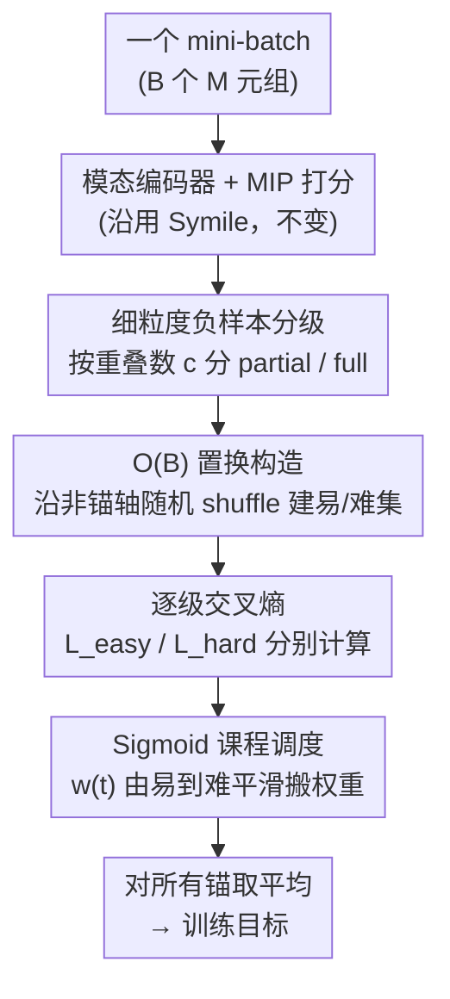

# Easy2Hard: From Partially to Fully Unmatched Modalities as Negative Samples in Contrastive Learning

**会议**: CVPR 2026  
**论文**: [CVF Open Access](https://openaccess.thecvf.com/content/CVPR2026/html/Yang_Easy2Hard_From_Partially_to_Fully_Unmatched_Modalities_as_Negative_Samples_CVPR_2026_paper.html)  
**代码**: 无  
**领域**: 对比学习 / 多模态表示  
**关键词**: 多模态对比学习, 负样本分级, 课程学习, 跨模态检索, total correlation  

## 一句话总结
当模态数 $M>2$ 时，批内负样本天然按「和正样本共享了几个非锚模态」分出难易；Easy2Hard 把负样本显式拆成「部分不匹配（易）」与「完全不匹配（难）」两类，再用一条 sigmoid 课程曲线随训练把权重从易负样本平滑挪到难负样本，在 5 个多模态数据集上的零样本检索都稳超 Symile / CLIP-Pairwise。

## 研究背景与动机
**领域现状**：跨模态表示学习的主流是对比学习——给一个 mini-batch，把同一样本的不同模态当正样本对、不同样本的当负样本对，用温度缩放的 InfoNCE 拉近正样本、推远负样本（CLIP、ALIGN、LiT 都是这个套路）。当模态数从 2 扩到 $M>2$ 时，常见做法要么把所有模态对的成对损失加起来，要么把每个模态都绑定到一个枢轴模态（通常是图像，如 ImageBind、TriCoLo）。

**现有痛点**：这些做法本质上仍只在优化两两之间的成对交互，对负样本的「难度」没有任何显式结构。更前沿的 Symile 用 total correlation（TC）/ 多线性内积（MIP）打分，能捕捉三个以上模态的联合依赖、且保持 $O(B)$ 的批内构造，但它把批内所有负样本一视同仁——在固定锚模态下，它不区分「部分不匹配」和「完全不匹配」的元组，也不在训练过程中调整两者的相对侧重。

**核心矛盾**：双模态时，固定锚后一个负样本对只有一种「不匹配」形态；但 $M>2$ 时不一样——有些负样本仍和正样本共享一个或多个非锚模态（部分不匹配，更"像"正样本、更易），有些一个都不共享（完全不匹配，最具迷惑性、更难）。把它们当成同一种负样本来学，是次优的：模型本该先从简单的部分不匹配负样本学起、再逐步引入完全不匹配的硬负样本。

**本文目标**：在不改编码器、不加任务头、不改 batch 构造的前提下，(1) 给 $M$ 模态对比学习一个按跨模态重叠度分级的细粒度负采样；(2) 一个由易到难、单调推进的轻量课程调度。

**核心 idea**：保留 Symile 的 TC/MIP 打分与编码器不动，只在「负样本集合」上动刀——按和正样本的重叠数把负样本分级，再用一条 sigmoid 课程曲线把训练权重从「易（部分不匹配）」平滑搬到「难（完全不匹配）」。

## 方法详解

### 整体框架
Easy2Hard 是套在标准 TC/MIP 对比训练之上的一层「结构化、随时间变化的负样本」机制。它的底座沿用 Symile：每个模态有自己的编码器产出嵌入 $z^{(m)}_i\in\mathbb{R}^d$，给一个索引元组 $\boldsymbol{j}=(j_1,\dots,j_M)$（每个 $j_m$ 选 batch 里哪个样本来当第 $m$ 个模态）打一个多线性内积分数

$$s(\boldsymbol{j}) = \sum_{r=1}^{d}\prod_{m=1}^{M} z^{(m)}_{j_m,\,r}.$$

固定一个锚模态 $a$，把锚取自样本 $i$、其余非锚模态都取自 $j$，得到混合元组的温度缩放分数 $s^{(a)}_{i,j}=\tau\,s(\boldsymbol{j}^{(a)}(i,j))$，排成 $B\times B$ 的矩阵后对每行做 softmax 交叉熵，就是 per-anchor 对比损失（对角线 $j=i$ 是正样本）。基座目标 $L_{\text{TC/MIP}}$ 就是把它对所有锚和 mini-batch 取平均。

Easy2Hard 在这个基座上插入三步：对每个锚模态，(i) 用沿非锚轴的随机置换在 $O(B)$ 时间里构造出「易集（部分不匹配）」和「难集（完全不匹配）」；(ii) 在每一级负样本集合上分别算交叉熵；(iii) 用一条外部课程权重 $w(t)\in[0,1]$ 把各级损失做凸组合，再对所有锚取平均。编码器、MIP 打分、优化器全程不变。

### 关键设计

**1. 细粒度负样本分级：按和正样本的重叠数把硬度拆开**

针对的痛点是 Symile「所有批内负样本一视同仁」、看不到难度结构。Easy2Hard 固定锚模态 $m$，设其余非锚视图集合 $V=\{1,\dots,M\}\setminus\{m\}$，对每个负样本元组数出它和正样本「重合」的非锚模态个数 $c\in\{0,\dots,M-2\}$。由于一个负样本不可能同时匹配全部 $M-1$ 个非锚模态（否则它就是正样本），定义难度等级

$$\ell = (M-1) - c \in \{1,2,\dots,M-1\},$$

$\ell$ 越大重叠越少、越难。以三模态 (图像, 文本, 音频)、图像为锚为例：在某个锚切片 $I=i$ 里，$\langle I_i,T_i,A_i\rangle$ 是唯一正样本；只换了文本或只换了音频（仍共享一个非锚模态）的是**部分不匹配**负样本（易，$\ell=1$）；文本音频都换掉、只剩锚图像共享的是**完全不匹配**负样本（难，$\ell=2$）。这一刀把原本一团的负样本切成了有序的难度层，是后面课程调度能"由易到难"的前提。

**2. $O(B)$ 置换构造：用轴向 shuffle 在线性时间里造出易集与难集**

如果按定义去枚举所有部分/完全不匹配元组，复杂度会爆炸。Easy2Hard（Algorithm 1）用一个很省的技巧：对每个非锚模态 $m\neq a$ 独立采一个 batch 索引的随机置换 $\pi_m$（沿该模态轴打乱、锚轴不动）。

- **易集** $N^{(a)}_{\text{part}}$：对每个锚索引 $i$，**只随机挑一个**非锚轴 $m'$，把它替换成 $\pi_{m'}(i)$，其余非锚模态仍对齐 $i$——这样得到的元组恰好只在一个非锚模态上和正样本不同（部分不匹配）。
- **难集** $N^{(a)}_{\text{full}}$：对每个 $i$，把**所有**非锚模态都换成 $\pi_m(i)$，只剩锚模态共享（完全不匹配）；允许不同非锚轴映到同一个索引 $j_u=j_v\neq i$，这只是简化实现、不改变"完全不匹配"的语义。

万一某个置换碰巧把正样本 $(i,\dots,i)$ 重建进了负样本集，就对那一行重采样，受影响的比例极小、不改变整体 $O(B)$ 的候选构造。需要注意作者对复杂度的措辞：这里 $O(B)$ 只指**候选构造**（每个锚抽 $M-1$ 个置换、共 $O((M-1)B)$）；算 logits 和逐行 softmax/CE 仍是每个锚 $O(B^2)$，整体每步 $O(MB^2)$、峰值显存 $O(B^2)$，和标准批内对比学习同量级。

**3. Sigmoid 课程调度：用单调平滑的门控随训练把权重从易负样本搬到难负样本**

有了各级损失 $\{L_\ell\}$，关键是怎么混合它们。Easy2Hard 用一组「sigmoid 之差」构成的随时间变化的权重：设转折中点 $t_1<\dots<t_{M-2}$、斜率 $k_j$，令 $S_j(t)=\sigma(k_j(t-t_j))$，则

$$w_1(t)=1-S_1(t),\quad w_{M-1}(t)=S_{M-2}(t),\quad w_\ell(t)=S_{\ell-1}(t)-S_\ell(t),$$

满足 $\sum_\ell w_\ell(t)=1,\ w_\ell(t)\ge 0$（一个非负的"单位分解"）。训练早期 $w_1$ 接近 1、由高重叠的易负样本主导，随 $t$ 增大权重依次流向更高 $\ell$（更难）的层。三模态时退化成一个二元门控

$$L^{(a)}(t)=(1-w(t))\,L^{(a)}_{\text{easy}}+w(t)\,L^{(a)}_{\text{hard}},\qquad w(t)=\sigma\!\big(k(t-t_m)\big).$$

为什么是平滑 sigmoid 而非线性？从梯度看 $\partial_t L = w'(t)\cdot\frac1M\sum_a(\ell^{(a)}_h-\ell^{(a)}_e)$，其中 $w'(t)=k\,w(t)(1-w(t))>0$，所以只要早中期通常有 $\ell_h\ge\ell_e$，硬分支的贡献就**单调平滑**增长；又 $\max_t w'(t)=k/4$，门控对 $t$ 是 Lipschitz 的、过渡受控稳定。直觉上：部分不匹配负样本只差一个非锚模态、梯度方差更低，适合早期建立对齐；完全不匹配负样本更具迷惑性，适合后期强化判别力。

### 损失函数 / 训练策略
基座目标是把 per-anchor 对比损失对锚和 batch 取平均的 $L_{\text{TC/MIP}}$；Easy2Hard 只把每个锚的损失换成上面的课程加权版 $L^{(a)}(t)$，再对锚平均。课程只在训练/验证损失里起作用——检索时用冻结编码器、和 $w(t)$ 无关，保证 epoch 间验证损失可比、检索指标干净。新增的可调超参只有课程的中点 $t_m$ 和斜率 $k$，其余学习率/权重衰减/logit-scale 初值的搜索空间和各 baseline 共享，确保对比公平。

## 实验关键数据

### 主实验
四个三模态数据集（MM-IMDb、Channel、Symile-MIMIC、EH-MIMIC）上的零样本「二对一」检索（两模态查询、第三模态作目标，10-way 候选池，Acc@1，10 次 bootstrap 估 SE/CI）：

| 数据集 | Easy2Hard | Symile | CLIP-Pairwise | vs Symile |
|--------|-----------|--------|---------------|-----------|
| MM-IMDb | **0.421** | 0.404 | 0.388 | +0.017 |
| Channel | **0.573** | 0.567 | 0.564 | +0.006 |
| Symile-MIMIC | **0.462** | 0.434 | 0.395 | +0.028 |
| EH-MIMIC | **0.503** | 0.477 | 0.456 | +0.026 |

整体趋势稳定为 Easy2Hard > Symile > CLIP-Pairwise，且提升幅度普遍高于对应标准误；在两个临床数据集上 margin 尤其明显（对 CLIP-Pairwise 在 Symile-MIMIC 上高出 0.067）。

5 模态可行性研究（HoloAssist：eye gaze 作锚 + head pose + 三路 IMU，10-way Acc@1）：

| 方法 | Acc@1 |
|------|-------|
| **Easy2Hard** | **0.882** |
| Symile | 0.833 |
| ImageBind-like 枢轴 | 0.439 |
| Pairwise-CLIP | 0.295 |

模态越多，显式结构化负样本相对「枢轴式成对对齐」的优势越大，验证了框架对 $M>3$ 的自然可扩展性。

### 消融实验
核心消融是把 sigmoid 课程换成线性课程（去掉中点/斜率这两个控制易→难过渡的参数）：

| 调度器 | Channel | EH-MIMIC | 说明 |
|--------|---------|----------|------|
| Sigmoid（完整） | **0.573** | **0.503** | 平滑门控 |
| Linear | 0.494 | 0.441 | 掉 0.079 / 0.062 |

线性调度明显更差，说明增益来自「结构化 partial/full 切分 + 形状良好的平滑过渡」的组合，而非随便一种课程都行。

超参敏感性（固定一项扫另一项，Channel / EH-MIMIC）：

| 超参 | 现象 |
|------|------|
| 斜率 $k$ | 从很小到中等先升后降：Channel 在 $k{=}0.3$、EH-MIMIC 在 $k{=}0.5$ 附近最好；$k$ 过大时退化，EH-MIMIC 对过激过渡更敏感 |
| 中点 $t_m$ | 影响弱于 $k$，CI 多有重叠；Channel 在 $t_m{\approx}15$ 微峰，EH-MIMIC 略偏早（$t_m{\approx}11\text{–}13$） |

### 关键发现
- 性能增益的主因是「结构化负样本切分 + 平滑课程」的组合，而非课程本身——线性课程几乎吃掉一半优势。
- 课程斜率 $k$ 比中点 $t_m$ 重要得多：实践上建议先在 $\{0.3,0.5,0.7\}$ 里调 $k$、$t_m$ 固定在中段 epoch，再做一次轻量 $t_m\in\{11,13,15,17,19\}$ 扫描即可。
- 模态数越多，Easy2Hard 相对枢轴式成对方法的优势越显著（HoloAssist 上对 ImageBind-like 高出约 0.44）。
- ⚠️ 主实验各数据集用的是各自验证集选出的最优配置（如 EH-MIMIC 是 $k{=}0.9,\,t_m{=}17$），而敏感性表 3/4 是固定一项的局部一因素分析，二者数值不能直接横比。

## 亮点与洞察
- **"不动底座、只动负样本集合"是个干净的切入点**：编码器、MIP 打分、batch 构造、推理打分全不变，纯粹给负样本加结构 + 课程，因而能即插即用地叠在任何 TC 风格对比方法上，迁移成本极低。
- **把"负样本难度"从隐式（基于相似度采样）变成显式（基于跨模态重叠数）**：以往硬负样本挖掘靠 embedding 相似度衡量难度，这里直接用「共享几个非锚模态」这个组合结构定义难度层，定义干净、和 $M$ 解耦、且天然有序。
- **sigmoid-之差 的权重设计很巧**：用 $M-2$ 个 sigmoid 的差自动拼出一个覆盖 $M-1$ 个难度层的"单位分解"，权重依次接力、始终非负且和为 1，把多级课程统一成一个可微、Lipschitz、单调推进的调度，三模态时优雅退化成二元门控。
- 这个「按组合重叠分级 + 平滑课程接力」的思路可迁到任何有「天然难度层级」的对比/检索场景（如多视图、多传感器、层级标签的负样本）。

## 局限与展望
- 论文体量偏小、增益偏窄：四个三模态数据集上对 Symile 的绝对提升多在 0.006–0.028（Channel 仅 +0.006），属"稳定但温和"；是否在更大规模、更高维（图文大模型）下仍成立未验证。
- 5 模态只是「可行性研究」（feasibility）：只在 HoloAssist 单数据集、低维同步传感器流上测，且编码器都是轻量 MLP，不能等同于高分辨率图文场景的多模态扩展性结论。⚠️ HoloAssist 的绝对数值（0.88）和三模态临床数据（0.4–0.5）任务难度不同，不可直接比大小。
- 课程需要额外调 $k,t_m$ 两个超参，虽然作者给了经验范围，但对过激过渡（大 $k$）的敏感性在某些数据集（EH-MIMIC）较明显，可能需要 per-dataset 调参。
- 「完全不匹配」实现里允许不同非锚轴撞到同一索引，作者称不改语义，但这会让难集的分布略偏离严格定义，对极小 batch 是否有影响未细究。

## 相关工作与启发
- **vs Symile**：两者都用 TC/MIP 打分、$O(B)$ 批内构造来捕捉超越成对的联合依赖；区别在 Symile 把所有批内负样本一视同仁，Easy2Hard 在**不改其打分与编码器**的前提下，额外按跨模态重叠把负样本分级、并用易→难课程重加权。本文是对 Symile 的正交增强，实验也显示组合后更强。
- **vs CLIP / ImageBind 等成对/枢轴方法**：它们把 $M>2$ 拆成成对损失之和或绑到单一枢轴，规模性好但只优化两两交互、对负样本难度无结构。Easy2Hard 直接在联合元组层面结构化负样本，模态越多优势越大。
- **vs 硬负样本挖掘（VSE++ / Choi et al. 的自适应采样）**：它们靠 latent 空间相似度调节负样本硬度、且多通过改损失函数引入；Easy2Hard 不改底层对比目标和编码器，只用课程调度去调「结构化负子集」的相对侧重，难度来自跨模态重叠这个显式组合结构而非相似度。

## 评分
- 新颖性: ⭐⭐⭐⭐ 把 $M>2$ 负样本按跨模态重叠显式分级 + sigmoid-之差课程，是对 Symile 干净且正交的新角度
- 实验充分度: ⭐⭐⭐ 五个数据集 + 课程/超参消融较完整，但增益温和、5 模态仅可行性研究、缺大规模图文验证
- 写作质量: ⭐⭐⭐⭐ 动机、分级定义、算法、课程公式与梯度分析交代清楚，图示到位
- 价值: ⭐⭐⭐⭐ 即插即用、零额外编码器成本，可叠在任意 TC 风格多模态对比方法上，工程实用

<!-- RELATED:START -->

## 相关论文

- [\[CVPR 2026\] Temporal Imbalance of Positive and Negative Supervision in Class-Incremental Learning](temporal_imbalance_of_positive_and_negative_supervision_in_class-incremental_lea.md)
- [\[CVPR 2026\] UniGeoCLIP: Unified Geospatial Contrastive Learning](unigeoclip_geospatial_contrastive.md)
- [\[CVPR 2026\] HCL-FF: Hierarchical and Contrastive Learning for Forward-Forward Algorithm](hcl-ff_hierarchical_and_contrastive_learning_for_forward-forward_algorithm.md)
- [\[CVPR 2026\] Learning from Semantic Dictionaries: Discriminative Codebook Contrastive Learning for Unified Visual Representation and Generation](learning_from_semantic_dictionaries_discriminative_codebook_contrastive_learning.md)
- [\[CVPR 2026\] Global-Graph Guided and Local-Graph Weighted Contrastive Learning for Unified Clustering on Incomplete and Noise Multi-View Data](global-graph_guided_and_local-graph_weighted_contrastive_learning_for_unified_cl.md)

<!-- RELATED:END -->
