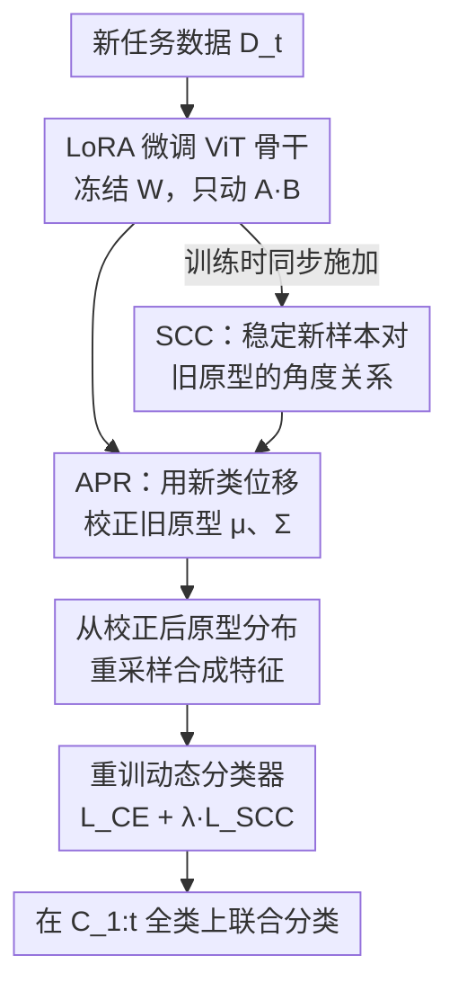

# Exemplar-Free Class Incremental Learning via Preserving Class-Discriminative Structure

**会议**: CVPR 2026  
**论文**: [CVF Open Access](https://openaccess.thecvf.com/content/CVPR2026/html/Zhang_Exemplar-Free_Class_Incremental_Learning_via_Preserving_Class-Discriminative_Structure_CVPR_2026_paper.html)  
**代码**: https://github.com/lambor9973/cds  
**领域**: 持续学习 / 类增量学习  
**关键词**: 无样例类增量学习, 灾难性遗忘, 类判别结构, 原型校正, 预训练ViT  

## 一句话总结
本文指出无样例类增量学习（EFCIL）中灾难性遗忘的本质是"类判别结构"塌缩，提出用 APR 校正旧类原型的均值+协方差（保类内结构）、用 SCC 约束新样本对旧原型的角度关系（保类间结构），在 6 个 benchmark 上超过 SSIAT/SLCA 等方法，细粒度数据集上提升尤为明显。

## 研究背景与动机
**领域现状**：EFCIL 要求模型按任务序列依次学新类、且**不能保存任何旧任务样本**（隐私/内存约束），测试时还要在所有见过的类上联合分类。当前主流做法是基于预训练 ViT 做参数高效微调（PET）——prompt（L2P、DualPrompt）、adapter（EASE、ACMap）、LoRA（infLoRA），或像 SLCA 那样用分层学习率控制更新幅度，核心都是"冻骨干、动少量参数"来缓解遗忘。

**现有痛点**：这些方法都盯着"参数怎么更新"，却忽视了一个更根本的遗忘来源——微调时**特征空间本身在漂移**。骨干从 $f_\theta^{(t-1)}$ 演化到 $f_\theta^{(t)}$，旧类的特征表示会随之迁移，导致当初存下来的旧类原型在新特征空间里"对不上号"。

**核心矛盾**：作者把这个漂移拆成两个相互依赖的结构同时塌缩：① **类内结构**（intra-class）——单个类的"形状"，由原型中心 $\mu_k$ 和协方差 $\Sigma_k$ 共同刻画，反映类的紧致度与完整性；② **类间结构**（inter-class）——所有旧类原型之间的全局几何关系，决定类与类的相对位置和可分性。论文用 Cars-196 上的 t-SNE 和原型分布 KL 散度热图证明：微调后对角元（类内）显著增大、非对角元（类间）混乱波动，**两个结构同时退化**才是灾难性遗忘的真正成因。

**本文目标**：在旧特征空间向新特征空间迁移的过程中，**同时维持类内形状和类间几何**，而且全程不碰任何旧样本。

**核心 idea**：用"保结构"代替"保参数"——既然旧类没法直接观测，就借**新类的位移模式**去推断并校正旧原型分布（保类内），再用**角度不变性**间接锁住旧原型之间的几何关系（保类间）。

## 方法详解

### 整体框架
模型是"预训练 ViT 骨干 + 动态分类器"：骨干用 ViT-B/16-IN21K，只在自注意力的 Query/Value 投影里插 LoRA（$h = xW + \beta(xA)B$，秩 $r=64$）做参数高效微调，骨干权重 $W$ 冻结；分类器随任务到来不断扩展输出维度 $W^{(t)} = [W^{(t-1)}, W^{(t)}_{\text{new}}]$。这套骨干+分类器只是脚手架，真正的贡献在于：每学完一个新任务，先用 **APR** 把所有旧类原型（中心+协方差）迁移校正到新特征空间，再用 **SCC** 在训练时约束新样本相对旧原型的角度关系不变，最后从校正后的原型分布**重采样合成特征**来重训分类器、平衡新旧类。

整个流程是一个清晰的串行 pipeline：

### 关键设计

**1. APR 自适应原型校正：用新类位移推断旧类的整体分布迁移**

痛点很直接：旧任务没有样本，没法直接知道旧类原型在新特征空间里漂到哪去了。APR 的关键观察是——所有类的位移都源自**同一次模型更新**（$f_\theta^{(t-1)}\!\to\!f_\theta^{(t)}$），因此语义相近的类位移模式相似，而新类是有样本的、其位移**可观测**，于是可以拿新类的位移去推断旧类的位移。具体地，每个新类 $j$ 的可观测位移为 $\delta_j = \mu_j^{(t)} - \mu_j^{(t-1)}$，旧类 $k$ 的位移用按余弦相似度加权的注意力聚合：

$$\Delta_k = \sum_{j=1}^{|C_t|} w_{k,j}\,\delta_j = \sum_{j=1}^{|C_t|} \frac{\exp(\gamma \cdot s_{k,j})}{\sum_{l}\exp(\gamma \cdot s_{k,l})}\,\delta_j$$

其中 $s_{k,j}$ 是旧原型 $\mu_k^{(t-1)}$ 与新原型 $\mu_j^{(t-1)}$ 的余弦相似度，$\gamma$ 是控制注意力锐度的温度。中心更新为 $\mu_k^{(t)} = \mu_k^{(t-1)} + \Delta_k$。

APR 比 SSIAT/SDC 更进一步的地方在于：它不只校正中心，还推断**协方差**，从而保住类的完整"形状"。作者把特征扰动建模为 $\delta = \alpha\Delta_k$（$\alpha$ 是期望为 1 的随机标量），推得扰动协方差 $\mathrm{Cov}(\delta) = \mathrm{Var}(\alpha)\Delta_k\Delta_k^{\top}$，在与原特征独立的假设下，校正后的协方差为：

$$\Sigma_k^{(t)} = \Sigma_k^{(t-1)} + \rho\,\Delta_k\Delta_k^{\top} + \epsilon I$$

$\rho = \mathrm{Var}(\alpha)$ 控制扰动引入的协方差幅度，$\epsilon I$ 保数值稳定。这样校正后的分布 $P_k^{(t)} = (\mu_k^{(t)}, \Sigma_k^{(t)})$ 就同时还原了旧类在新空间里的位置和形状——这就是"保类内结构"的具体含义。

**2. SCC 结构一致性约束：用角度不变间接锁住类间几何**

APR 管单个类的形状，但类与类之间的相对位置（类间结构）还会乱。理想做法是直接约束旧类中心间距 $\|\mu_i^{(t)} - \mu_j^{(t)}\|$，但旧样本不可见、没法直接测。SCC 借了一条几何原理：**如果一组参考点到一组空间锚点的角度关系保持稳定，那么锚点之间的内部几何也被保住了**。于是把旧类原型 $\{\mu_k^{(t-1)}\}$ 当作锚点、新任务样本当作参考点，只要锁住"新样本→各旧原型"的角度向量在新旧模型下不变，就间接维持了旧原型之间的几何。

对每个新样本 $x_i$，定义其相对全部旧原型的角度向量 $r_i = [s_{i,1}, \dots, s_{i,K}]^{\top}$（$s_{i,k}$ 是 $f_\theta(x_i)$ 与第 $k$ 个旧原型的余弦相似度），SCC 损失要求新旧模型下的该向量一致：

$$\mathcal{L}_{\text{SCC}} = \frac{1}{B}\sum_{i=1}^{B}\big\|r_i^{(t)} - r_i^{(t-1)}\big\|_2^2$$

它是个轻量正则项，只在 $t>1$ 时加入，不需要任何旧数据，就把"微调别把旧类的相对站位搅乱"这件事变成可优化目标。

**3. 原型重采样 + 余弦分类器：从校正分布合成特征平衡新旧类**

光有校正后的原型分布还不够，分类器若只见新类样本会严重偏向新类。本文从每个类（含 APR 校正后的旧类）的高斯分布里采样合成特征 $\tilde{z}_k \sim \mathcal{N}(\mu_k^{(t)}, \Sigma_k^{(t)})$ 来重训分类器，让新旧类在分类学习中"出场均衡"。分类器用余弦形式（$y_c = \tau \cdot \frac{f(x_i)\cdot w_c}{\|f(x_i)\|\,\|w_c\|}$）配标准交叉熵 $\mathcal{L}_{\text{CE}}$。这一步把 APR 校正的成果真正用到了决策边界上——没有它，保住的原型分布就只是"存着好看"，不会转化为分类增益。

### 损失函数 / 训练策略
总目标联合优化分类正确性与结构稳定性：

$$\mathcal{L}_{\text{total}} = \mathcal{L}_{\text{CE}} + \lambda\,\mathcal{L}_{\text{SCC}}$$

$\lambda$ 平衡"保结构"与"分对类"的 trade-off。训练流程（Algorithm 1）：每个任务先扩分类器、算新类中心 → 训练 batch 上施加 $\mathcal{L}_{\text{CE}} + \lambda\mathcal{L}_{\text{SCC}}$（$t>1$ 才加 SCC）→ 任务结束后更新新类原型 $P_j^{(t)}$、对所有旧类执行 APR、再从全部原型重采样重训分类器。优化用 SGD（lr 0.01，余弦退火，初值 0.0005），batch size 48，LoRA 秩 64。

## 实验关键数据

### 主实验
ViT-B/16-IN21K 骨干，Last-Acc（末任务后全类平均精度）/ Inc-Acc（各阶段平均精度），3 个随机种子。

| 数据集 / 设置 | 指标 | 本文 | 之前最好 | 提升 |
|--------------|------|------|----------|------|
| ImageNet-A (5 task) | Last-Acc | 66.65±0.20 | 64.21 (SSIAT) | +2.44 |
| ImageNet-A (20 task) | Last-Acc | 62.30±0.79 | 60.30 (SSIAT) | +2.00 |
| Cars-196 (5/10/20 task) | Last-Acc | 83.52 / 80.23 / 66.14 | 基线 | +7.79~11.24 |
| ObjectNet (10 task) | Last-Acc | 63.39±0.71 | 59.50 (SLCA) | +3.89 |
| OmniBenchmark (10 task) | Last-Acc | 79.19±0.16 | 77.15 (SSIAT) | +2.04 |
| ImageNet-R (10 task) | Inc-Acc | 83.84±0.56 | 之前最好 | 最优 |

细粒度的 Cars-196 提升最大（7.79%–11.24%），说明"保形状"对高度相似的类尤其关键；ImageNet-R 上 Last-Acc 与 SSIAT 持平（79.17 vs 79.28）但 Inc-Acc 取得最优。

### 消融实验
SCC、APR 双组件消融（Last-Acc）：

| 配置 | ImageNet-A | Cars-196 | 说明 |
|------|-----------|----------|------|
| Baseline | 60.08 | 67.90 | 仅 LoRA + 余弦分类器 |
| + SCC | 63.60 (+3.52) | 74.86 (+6.96) | 保类间结构 |
| + APR | 61.97 (+1.89) | 77.02 (+9.12) | 保类内结构 |
| + 两者 (Full) | 64.58 | 80.23 | 完整模型 |

### 关键发现
- **两组件作用与数据集性质强相关**：ImageNet-A（类间差异大）上 SCC 增益（+3.52）大于 APR（+1.89），说明类间可分性是主导；Cars-196（细粒度、类间高度相似）上 APR 增益（+9.12）远大于 SCC（+6.96），说明保住每个类的形状更要命。两者方向互补、缺一不可。
- **协同效应明显**：Cars-196 上 Full 相对 baseline 共 +12.33%，超过两组件单独增益之和，证明类内、类间结构是耦合的、需要联合维持。
- APR 对比 SDC 等"只校正中心"的替代策略更优，关键在于它额外推断了协方差、还原了完整分布形状。

## 亮点与洞察
- **把"灾难性遗忘"重新归因为几何结构塌缩**：不再笼统说"知识遗忘"，而是用 t-SNE + 原型 KL 热图把遗忘量化拆解成类内退化（对角增大）+ 类间紊乱（非对角波动）两个可观测信号，问题诊断很扎实。
- **"借新推旧"很巧**：旧类不可见这一硬约束，被"同一次模型更新导致语义相近类位移相似"这条假设绕开，用可观测的新类位移按相似度加权推断旧类位移——这个思路可迁移到任何"旧分布不可见但更新同源"的增量场景。
- **角度不变性当几何代理**：用"参考点到锚点的角度稳定 ⇒ 锚点内部几何不变"来间接约束不可见的旧原型间距，是个轻量又无需旧数据的好替代。
- **协方差也被显式建模**：多数原型迁移方法只搬中心，本文从扰动模型推出 $\rho\Delta_k\Delta_k^{\top}$ 的协方差校正项，让"类的形状"真正被保住。

## 局限与展望
- **APR 的核心假设有适用边界**："语义相近类位移相似"在类间差异极大或新旧类语义割裂时可能失效，此时用新类位移推旧类会有偏差——这也部分解释了为何 ImageNet-A 上 APR 单独增益较小。
- **依赖强预训练骨干**：全程基于 ViT-B/16-IN21K，方法对从零训练或弱预训练骨干的有效性未验证；特征空间漂移若过于剧烈，原型校正能否跟上存疑。
- **协方差建模的强假设**：扰动 $\delta = \alpha\Delta_k$（标量缩放）、$z^{(t-1)}$ 与 $\delta$ 独立等假设较强，真实特征形变未必是各向同性的单方向缩放（⚠️ 推导细节以原文为准）。
- 改进方向：可探索自适应的 $\gamma/\rho/\lambda$（随任务难度或类间相似度动态调整），以及在角度约束之外引入更高阶的类间几何（如流形结构）。

## 相关工作与启发
- **vs SSIAT / SDC**：它们用单个新样本估计旧类**中心**的漂移，本文 APR 用整组新类按相似度加权推断旧类的**完整分布迁移**（中心+协方差），保住的是形状而非仅位置，这是细粒度数据集大幅领先的关键。
- **vs SLCA**：SLCA 靠分层学习率+分类器校准控制更新幅度，属于"控参数"思路；本文是"保结构"思路，直接在特征几何层面对抗漂移，二者可能正交可组合。
- **vs EASE / infLoRA / 各类 PET**：prompt/adapter/LoRA 系方法关注怎么高效塞入新任务能力，但都默认旧原型在新空间仍可用；本文恰恰挑明这个默认不成立，并补上原型校正与角度约束这一缺失环节。

## 评分
- 新颖性: ⭐⭐⭐⭐ 把遗忘归因为类内+类间结构塌缩并分别给出 APR/SCC 两个对症机制，视角清晰且可量化。
- 实验充分度: ⭐⭐⭐⭐ 6 个 benchmark、多任务划分、双组件消融 + 与 SDC 替代策略对比，数据集性质相关性分析有说服力。
- 写作质量: ⭐⭐⭐⭐ 动机—诊断—方法逻辑顺畅，t-SNE/KL 热图辅证到位；个别公式推导假设交代略简。
- 价值: ⭐⭐⭐⭐ 即插即用、无需旧数据，对预训练骨干下的 EFCIL 是实用且可复用的结构保持范式。

<!-- RELATED:START -->

## 相关论文

- [\[CVPR 2026\] HyCal: A Training-Free Prototype Calibration Method for Cross-Discipline Few-Shot Class-Incremental Learning](hycal_training_free_prototype_calibration_for_cross_discipline_fscil.md)
- [\[CVPR 2026\] Quantized Residuals to Continuous Prompts for Few-Shot Class Incremental Learning in Vision-Language Models](quantized_residuals_to_continuous_prompts_for_few-shot_class_incremental_learning.md)
- [\[CVPR 2026\] Geometry-driven OOD Detectors Are Class-Incremental Learners](geometry-driven_ood_detectors_are_class-incremental_learners.md)
- [\[CVPR 2026\] Beyond Myopic Alignment: Lookahead Optimization for Online Class-Incremental Learning](beyond_myopic_alignment_lookahead_optimization_for_online_class-incremental_lear.md)
- [\[ACL 2025\] AnalyticKWS: Towards Exemplar-Free Analytic Class Incremental Learning for Small-footprint Keyword Spotting](../../ACL2025/self_supervised/analytickws_towards_exemplar-free_analytic_class_incremental_learning_for_small-.md)

<!-- RELATED:END -->
