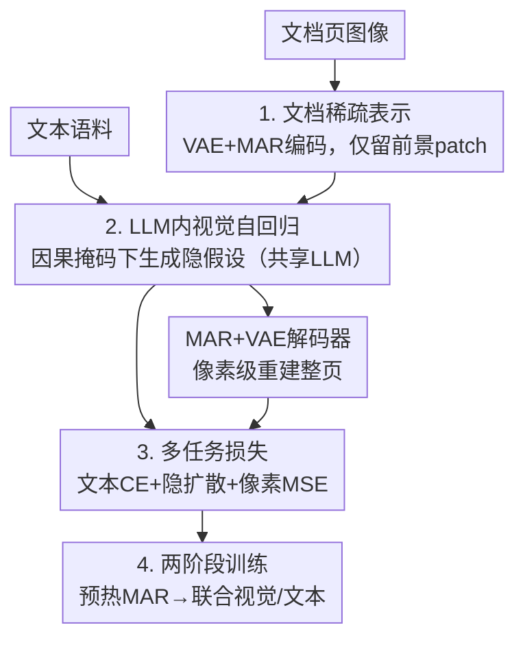

# Exploring Visual Pretraining for Learning Language Intelligence

**会议**: CVPR 2026  
**论文**: [CVF Open Access](https://openaccess.thecvf.com/content/CVPR2026/html/Zhao_Exploring_Visual_Pretraining_for_Learning_Language_Intelligence_CVPR_2026_paper.html)  
**代码**: 待确认  
**领域**: 自监督表示学习 / 多模态预训练  
**关键词**: 视觉预训练, 掩码自回归, LLM, 文档图像, 数学推理  

## 一句话总结
这篇论文提出 MAPLE：不把 PDF 抽成文本喂给 LLM，而是直接拿文档**页面图像**做掩码自回归预训练，让 LLM 通过"为遮挡区域生成隐式假设"来学语言智能，在四个数学推理基准上相对纯文本预训练平均提升至多 40.2%。

## 研究背景与动机
**领域现状**：无监督预训练的主流范式是"模态各练各的"——语言模型在文本上练（text pretraining），视觉大模型在图像上练（visual pretraining）。要造一个数学强的 LLM，通常走数学领域的持续预训练（CPT），从 arXiv、教科书、数学网站挖文本语料。

**现有痛点**：这些管线为了让纯文本 LLM 能消化高质量 PDF，必须先跑 OCR/LaTeX 抽取，然后**把原始页面图像丢掉**。这一步代价很大：(1) 抽取过程有不可避免的信息损失，几何图形、版面布局、二维结构、字体/字号等线索全没了；(2) 标注成本高；(3) 凡是没法干净解析的页面就用不上，文本语料的规模天花板被卡死。

**核心矛盾**：文档里大量信息本来就是以"视觉物件"形式呈现以方便人阅读的——图、版面、显著性线索都很重要，尤其在科研论文和教科书里。把它们压成纯文本字符串，等于丢掉了人类读论文时实际依赖的那部分信号。

**切入角度**：作者从 **Platonic Representation Hypothesis（柏拉图表示假说）** 出发——当数据规模、任务多样性、模型容量增长时，不同模态（语言 vs 视觉）的表示与知识最终会收敛到同一个底层对象。如果这个假说成立，那么给定**同一份文档语料**，一个"看图"预训练的 LLM 应该能达到和"读字"预训练的 LLM 同等的语言智能。

**本文目标**：首次实证验证"用视觉预训练给 LLM 学语言智能"在同等语料下能否打平甚至超过文本预训练。

**核心 idea**：用**掩码自回归（MAR）建模文档页面图像**代替 OCR-抽文本-再训练，让同一个 LLM 在因果掩码下为未见图像 patch 生成隐式假设，并与文本预训练共享参数，从而把图像里"文本之外"的信息也吸收进语言能力。

## 方法详解

### 整体框架
MAPLE 在一个标准 LLM 之上，额外挂一条"文档前景 patch 隐变量"的自回归视觉流。具体地：文档页面先被 VAE 编码成隐变量网格，丢掉纯空白背景、只留前景 patch，按光栅扫描顺序排成序列喂给 LLM；LLM 在**只看图像位置的因果掩码**下，为后续 patch 预测"隐式假设"，再由掩码自回归（MAR）解码器把这些假设解回像素、重建整页。与此同时，**同一个 LLM** 还在普通文本上做常规的 next-token 预训练。两条流共享 LLM 参数，但**不需要任何图文配对**——文档页纯视觉监督、文本语料纯 token 序列，靠共享 LLM 隐式架起两个模态的桥。

完整的视觉路径可以写成一条算子链：

$$\mathcal{I} \xrightarrow{\phi_{\text{VAE}}} \mathcal{Z} \xrightarrow{\phi_{\text{Enc}}} \mathcal{U} \xrightarrow{\Phi_{\text{LLM}}} \mathcal{H} \xrightarrow{\phi_{\text{Dec}}} \hat{\mathcal{I}}$$

其中 $\phi_{\text{VAE}}$ 是 VAE 编码器，$\phi_{\text{Enc}}$ 是 MAR 编码器，$\Phi_{\text{LLM}}$ 是因果自回归 LLM，$\phi_{\text{Dec}}$ 是带预测头的 MAR+VAE 解码器。

### 关键设计

**1. 文档稀疏表示：只保留承载信息的前景 patch，并显式注入二维版面坐标**

针对"文本抽取丢掉版面/结构"的痛点，MAPLE 直接在原始页面上建模，但不会把整页隐变量都喂进去（那样序列太长）。流程是：页面先 bucket 到最近的标准分辨率、栅格化成 RGB 张量 $I \in \mathbb{R}^{H\times W\times 3}$，切成 $n\times m$ 个互不重叠的 $256\times256$ crop，过**冻结的 VAE 编码器**得到隐变量网格 $Z\in\mathbb{R}^{n\times m\times C_v}$。然后一个带光栅掩码的 MAR 编码器消费 $Z$，并**用二值前景掩码丢掉纯背景区域（如白边）**，只留含文字/图形/公式的 patch，得到稀疏序列 $U=\{u_i\}_{i=1}^{L_{\text{img}}}$——既保留页面结构，又缩短了上下文。

光把 patch 排成序列还不够，版面是二维的。所以对每个 patch 既按光栅扫描（左→右、上→下）给一个全局一维索引 $t_i$，又记录其归一化二维坐标 $(x_i/W,\,y_i/H)$，位置编码同时融合一维顺序和二维坐标：

$$e^{\text{pos}}_i = \mathrm{PE}_{\text{1D}}(t_i) + \mathrm{PE}_{\text{2D}}\!\bigl(x_i/W,\,y_i/H\bigr)$$

最后用一个可学习线性映射 $W_{\text{in}}\in\mathbb{R}^{d\times d_v}$ 把每个隐变量投到 LLM 的隐空间并加上位置编码：$\tilde u_i = W_{\text{in}} u_i + e^{\text{pos}}_i \in \mathbb{R}^{d}$。这样 LLM 看到的是一串"带版面坐标的前景视觉 token"。

**2. LLM 内视觉自回归：让语言主干为未见 patch 生成"隐式假设"**

这是 MAPLE 把视觉变成"语言式预训练"的核心。投影后的前景序列 $\tilde U\in\mathbb{R}^{L_{\text{img}}\times d}$ 喂进 LLM，但施加**只在图像位置上的因果注意力掩码**：每个位置只能看光栅顺序里它之前的视觉 token。LLM 输出隐藏态 $H=\{h_i\}$，作者把这些隐藏态解读为"对未来 patch 的隐式假设"（latent hypotheses）——也就是 LLM 根据已见区域去"推测"被遮区域长什么样，这正是 next-token 在视觉上的类比。

然后用线性层 $W_{\text{out}}\in\mathbb{R}^{d_v\times d}$ 把隐式假设映回 MAR 解码器维度：$\tilde h_i = W_{\text{out}} h_i$，由 MAR 解码器重建隐变量网格 $\hat Z$，再经冻结 VAE 解码器还原像素 $\hat I$。关键点在于：**整个重建是以 LLM 生成的隐式假设为条件的**。论文的定性实验（图 7）正面支持了这一点——若绕过 LLM、直接把 MAR 编码器隐变量送进解码器，重建会严重模糊、公式不可读；而让隐变量经过 LLM 再解码，字符、公式、版面都明显更清晰。这说明语言主干为文档结构提供了强先验，"看图重建"逼着 LLM 真正建模了页面的高层规律。

**3. 多任务损失 + 共享主干：无需图文配对就让两模态在同一隐空间对齐**

MAPLE 用一个多任务目标联合优化：

$$\mathcal{L} = \lambda_{\text{text}}\,\underbrace{\mathcal{L}_{\text{CE}}(\mathcal{T})}_{\text{文本CPT}} + \lambda_{\text{diff}}\,\underbrace{\mathcal{L}_{\text{diff}}(\mathcal{U})}_{\text{隐变量扩散}} + \lambda_{\text{pix}}\,\underbrace{\mathcal{L}_{\text{MSE}}(\mathcal{I},\hat{\mathcal{I}})}_{\text{像素重建}}$$

其中 $\mathcal{L}_{\text{CE}}$ 是文本 token 上的自回归交叉熵，$\mathcal{L}_{\text{diff}}$ 是前景隐变量 $U$ 上的扩散/去噪式损失（等价于掩码 AR 回归），$\mathcal{L}_{\text{MSE}}$ 是输入图像与解码图像的重建损失。一个 batch 按比例 $\rho=\frac{N}{N+M}$ 混合图像和文本样本（$N$、$M$ 为图像/文本样本数）；实验默认 $\lambda_{\text{text}}:\lambda_{\text{diff}}:\lambda_{\text{pix}}=1:1:0.2$。

最巧的地方是：**LLM 参数在视觉 AR 流和文本预训练之间完全共享，却不需要任何图文配对**。文档页纯视觉监督、文本语料纯 token 序列，两条流被块对角因果掩码隔开、没有显式 cross-attention 或对齐损失，靠共享的 LLM 隐式搭桥。作者用 CKA 验证：训练前文本流和图像流的逐层相似度图是弥散无结构的；MAPLE 训练后出现明显的近对角带，匹配的文本/图像层相似度显著高于不匹配的——这种**自发涌现的语义耦合**完全由"在文本 token 和前景文档隐变量上联合自回归"诱导出来，正面印证了柏拉图表示假说。论文还从多任务学习理论给了支撑：学到的共享表示 $h$ 在下游任务上的超额风险按 $\tilde{O}(1/\sqrt{n})+\tilde{O}(1/\sqrt{T})$ 衰减（$n$ 样本数、$T$ 任务数），说明不同任务能合力改进同一个 $h$。

**4. 两阶段训练：先把视觉隐空间对齐稳住，再联合语言主干**

直接把生猛的视觉重建任务砸给 LLM 会不稳，所以分两段。**Stage 1 预热**：冻结 LLM 和 VAE，只训 MAR 编码-解码栈，目标是 $\mathcal{L}_{\text{warmup}}=\lambda_{\text{diff}}\mathcal{L}_{\text{diff}}(\mathcal{U})+\lambda_{\text{pix}}\mathcal{L}_{\text{MSE}}(\mathcal{I},\hat{\mathcal{I}})$，先把 MAR 隐空间和稳定的像素重建对齐，再去碰语言主干。**Stage 2 联合预训练**：切到图像+文本混合 batch，MAR 编码-解码器、隐变量↔LLM 隐空间的线性投影层与 LLM 参数一起训（VAE 仍冻结），图像分支走光栅因果掩码 + 扩散+像素目标，文本分支走标准 CPT，整体优化上面的完整多任务损失 $\mathcal{L}$，并用调度比例 $\rho$ 控制视觉 vs 文本更新的占比。消融显示 Stage 1 步数从 25K→100K，重建 PSNR/SSIM 稳步上升的同时，MATH-500 从 14.6% 涨到 31.48%——低层视觉保真度和高层数学推理强相关。

## 实验关键数据

### 主实验
在 GSM8K、MATH-500、OlympiadBench、MMLU-Pro-Math、AIME-24 五个数学基准上，对 InternLM2-1.8B / Qwen2.5-1.5B / LLaMA3.1-8B 三个主干，对比 Base、文本预训练（TP）、MAPLE。Base 用 Pass@1 (4-shot)，SFT 用 Pass@1 (0-shot)。MAPLE 用 128 张 A100、约 100K 步、约 40B 等效文本 token。

| 主干 / 方法 | MATH-500 | Olympiad | GSM8K | MMLU-Pro-Math |
|------|------|------|------|------|
| InternLM2-1.8B Base | 6.33 | 1.81 | 31.24 | 9.84 |
| InternLM2-1.8B TP | 8.30 | 1.90 | 18.20 | 10.73 |
| **InternLM2-1.8B MAPLE** | **10.84** | **2.20** | **36.23** | **12.36** |
| Qwen2.5-1.5B Base | 30.32 | 11.90 | 61.88 | **13.03** |
| Qwen2.5-1.5B TP | 22.94 | 10.09 | 45.64 | 13.55 |
| **Qwen2.5-1.5B MAPLE** | **31.48** | **16.67** | **66.26** | 13.03 |
| LLaMA3.1-8B Base | 20.34 | 14.51 | 56.25 | 23.76 |
| LLaMA3.1-8B TP | 24.24 | 13.91 | 59.92 | 21.46 |
| **LLaMA3.1-8B MAPLE** | **34.82** | **15.73** | **66.03** | 23.76 |

Base 设定下 MAPLE 12 个对比里**赢 10、平 1、仅 1 个微弱第二**；SFT (0-shot) 设定下赢 11/12、平 1，增益在指令微调后依然保留。最显眼的是 LLaMA3.1-8B 的 MATH-500：MAPLE 34.82 vs Base 20.34、TP 24.24，而 TP 在多数项上甚至不如 Base——说明"OCR 抽文本再训"反而可能损害模型，而直接看图能稳定加分。

### 消融实验

| 配置 | 关键指标 | 说明 |
|------|---------|------|
| Stage 1 = 25K 步 | MATH-500 14.60 / PSNR 10.37 / SSIM 0.6253 | 预热不足，重建差、推理弱 |
| Stage 1 = 100K 步 | MATH-500 31.48 / PSNR 22.60 / SSIM 0.9300 | 默认；视觉保真↑则数学推理↑ |
| 掩码比 0.7（InternLM2） | MATH-500 10.84 / Olympiad 2.20 | 默认；强掩码更好正则化 |
| 掩码比 0.3（InternLM2） | MATH-500 7.20 / Olympiad 1.47 | 掩码太弱，两项都掉 |
| 掩码比 0.3（Qwen2.5） | MATH-500 32.90 / Olympiad 10.63 | 简单题微升、难题大跌（Olympiad 16.67→10.63） |
| w/o LLM（直接 MAR 解码） | 重建模糊、公式不可读（定性） | 证明 LLM 提供文档结构强先验 |

### 关键发现
- **视觉损失能当 scaling 预测指标**：MAPLE 的图像侧损失 $L_{\text{img}}=\mathcal{L}_{\text{diff}}+0.2\,\mathcal{L}_{\text{MSE}}$ 与 MATH-500 分数呈强单调相关，Pearson/Spearman $|r|\approx0.9$，对 Qwen2.5/LLaMA3.1 甚至比文本损失相关性更强——意味着文本预训练的 scaling law 可能也适用于视觉预训练。
- **TXT:IMG 混比 1:2 最优**：在 1:1/1:2/1:4/1:8 上扫，两个主干都呈凹形曲线，1:2 是文本与视觉的 Pareto 平衡点；继续加大图像占比（1:4、1:8）会过度偏向 MAPLE、侵蚀语言先验。
- **空白对照实验干净地隔离了增益来源**：把合成数学文本无损渲染成 PDF 再完美还原成文本（MAPLE-blank vs TP-blank），两者学习曲线几乎重合——说明底层信号严格等价时，看图和读字一样有效；一旦换成**真实**带图/公式/版面的 PDF 页，MAPLE 学得更快、收敛更高，证明它确实吸收了文本管线丢弃的非文本信息。
- **掩码比有难度依赖的权衡**：0.7 在更难的 Olympiad 上更稳，0.3 只在简单题上偶尔微升。

## 亮点与洞察
- **把"视觉预训练"重新定义为给 LLM 学语言、而非学视觉**：以往 optical language modeling / MLLM 都是把视觉当下游 VL/OCR 任务的辅助输入、用显式标签监督；MAPLE 是首个证明 label-free 的文档掩码建模能直接提升**纯文本数学推理**的工作，范式上是新的。
- **"绕过 LLM 重建就糊掉"是个特别有说服力的定性证据**：它把"LLM 到底学没学到文档知识"这种抽象问题，变成肉眼可见的图像清晰度差异。
- **无配对却自发对齐（CKA 近对角带）**：在没有任何 cross-attention 和对齐损失、两流被因果掩码隔开的情况下涌现出模态对齐，是对柏拉图表示假说很漂亮的经验支撑，这个"用 CKA 验证涌现对齐"的思路可迁移到任何想验证跨模态隐式对齐的工作。
- **视觉损失↔下游分数的高相关**给了一个可复用的工程价值：训练早期就能用重建损失预判最终推理能力，省去频繁跑 benchmark。

## 局限与展望
- **只在数学推理这一个域验证**：作者明确说"in the domain of math reasoning"，是否能推广到通识、代码、多语言等语言智能维度尚未验证。
- **成本不低**：128×A100、100K 步、40B 等效 token，且视觉流额外引入 VAE+MAR 编解码栈，相比纯文本 CPT 的算力/工程开销更大；论文未给"同等算力下"的严格对照（⚠️ 以原文为准，TP 与 MAPLE 是否严格等 FLOPs 比较未完全说清）。
- **掩码比/混比都有主干依赖**：0.7 vs 0.3、1:2 vs 其他在不同主干上结论不完全一致，超参可能需要逐主干调，泛化性存疑。
- **改进方向**：把"页面图像直接建模"扩展到更长文档/跨页结构、引入真正的多页布局建模，或验证 scaling 是否在更大主干（>8B）上继续成立。

## 相关工作与启发
- **vs 数学持续预训练（CPT，如 OpenWebMath/FineMath 系）**：他们从 arXiv/教科书挖文本、必须先 OCR/LaTeX 抽取再丢掉页面图像；MAPLE 把页面当一等视觉信号、OCR-free 地建模前景隐变量，并与文本 CPT 耦合，从而用上无法干净解析的语料，在数学基准上超过纯文本 CPT。
- **vs Optical Language Modeling / MLLM（文档 QA、图表推理、长上下文压成视觉 token 等）**：他们用视觉作为下游 VL/OCR 任务的辅助输入、靠显式标签监督；MAPLE 在文档上做 label-free 掩码建模，隐变量喂进与文本预训练同一个自回归 LLM，并能提升纯文本数学推理——是从"视觉预训练"到"语言智能"的新路径。
- **vs Harmon**：MAPLE 受 Harmon 启发用 MAR 编码器把原始图像 patch 编成隐嵌入、用 Harmon wrapper 把视觉隐变量注入 LLM，使主干看到统一的文本 token + 视觉隐变量序列；区别在于目标是"学语言智能"而非统一的图像理解/生成。

## 评分
- 新颖性: ⭐⭐⭐⭐⭐ 首次证明 OCR-free 视觉预训练能直接提升 LLM 纯文本语言智能，为柏拉图表示假说提供实证。
- 实验充分度: ⭐⭐⭐⭐ 三主干五基准 + CKA/混比/掩码比/空白对照多角度分析，但只限数学域、缺严格等算力对照。
- 写作质量: ⭐⭐⭐⭐⭐ 动机—方法—证据链条清晰，定性重建与 CKA 图很有说服力。
- 价值: ⭐⭐⭐⭐ 打开"沿真正多模态轴扩展 LLM"的新方向，工程成本是落地的主要门槛。

<!-- RELATED:START -->

## 相关论文

- [\[CVPR 2026\] Learning to See Through a Baby's Eyes: Early Visual Diets Enable Robust Visual Intelligence in Humans and Machines](learning_to_see_through_a_babys_eyes_early_visual_diets_enable_robust_visual_int.md)
- [\[CVPR 2026\] Scaling Dense Event-Stream Pretraining from Visual Foundation Models](scaling_dense_event-stream_pretraining_from_visual_foundation_models.md)
- [\[ICLR 2026\] PonderLM: Pretraining Language Models to Ponder in Continuous Space](../../ICLR2026/self_supervised/ponderlm_pretraining_language_models_to_ponder_in_continuous_space.md)
- [\[ICCV 2025\] Scaling Language-Free Visual Representation Learning](../../ICCV2025/self_supervised/scaling_languagefree_visual_representation_learning.md)
- [\[CVPR 2026\] Franca: Nested Matryoshka Clustering for Scalable Visual Representation Learning](franca_nested_matryoshka_clustering_for_scalable_visual_representation_learning.md)

<!-- RELATED:END -->
