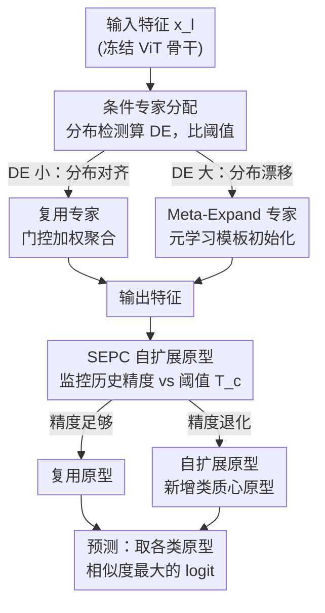

# Few-Shot Hybrid Incremental Learning: Continually Learning under Data Scarcity and Task Uncertainty

**会议**: CVPR 2026  
**论文**: [CVF Open Access](https://openaccess.thecvf.com/content/CVPR2026/html/Li_Few-Shot_Hybrid_Incremental_LearningContinually_Learning_under_Data_Scarcity_and_Task_CVPR_2026_paper.html)  
**代码**: 未公开  
**领域**: 小样本增量学习 / 持续学习  
**关键词**: 小样本增量学习, 稳定性-可塑性, 混合专家, 元学习扩展, 自扩展原型

## 一句话总结
本文提出"小样本混合增量学习（FSHIL）"这一更贴近现实的新范式——数据稀缺且任务类型（新类/新域/二者皆有）随机出现，并用「条件元扩展混合专家（CME-MoE）」在特征层调和稳定与可塑、用「自扩展原型分类器（SEPC）」在分类层建模多分布边界，在 5 个数据集、3 种增量设定上全面超过现有 FSIL 与 HIL 方法。

## 研究背景与动机
**领域现状**：小样本增量学习（FSIL）让模型只用每类 K-shot（1/5/10 个）样本就持续学新知识，主流分两支——FSCIL（静态域里学新类）和 FSDIL（固定类适配新域），两者都**预设了增量维度**（只增类，或只增域）。另一边，混合增量学习（HIL，代表作 ICON）允许增量类型不确定，但**假设数据充足**。

**现有痛点**：真实世界的智能体面对的是非平稳数据流——下一步到底是来新类、新域、还是二者都来，是**随机**的；同时新任务往往只有极少标注样本。现有方法各顾一头：FSIL 为了防小样本过拟合而**冻结特征提取器**，牺牲了跨域可塑性；HIL 为了应对任务不确定而**无约束地扩张架构**，在小样本下新模块严重过拟合。

**核心矛盾**：把 FSIL 的"稳定"和 HIL 的"可塑"简单叠加并不可行——FSIL 要冻结表征以抗过拟合，HIL 要自由扩张模块以获得跨域可塑，二者机制**直接冲突**，构成 FSHIL 特有的稳定性-可塑性悖论（stability-plasticity paradox）。

**本文目标**：拆成两个子问题——(1) 在特征层，如何**有条件地**决定"复用旧能力（稳定）"还是"扩张新能力（可塑）"，且扩张时不过拟合；(2) 在分类层，当同一类在不同域里呈现多个分布簇时，如何突破"一类一原型"的静态假设。

**切入角度**：作者观察到稳定与可塑不必全局二选一，而应**按数据分布是否漂移来逐任务、逐层条件触发**；并且新专家若从一个"元学习好的通用模板"初始化，就能在少样本下快速适配而不过拟合。

**核心 idea**：用"分布检测驱动的条件专家复用/元扩展"替代 FSIL 的全冻结与 HIL 的无脑扩张来调和稳定-可塑，并让分类器按需自扩展原型以建模多域分布。

## 方法详解

### 整体框架
方法以**冻结的 ViT-B/16** 为骨干，把可学习能力都放在两个即插即用模块上：在选定 Transformer 层的 MLP 旁路接 **CME-MoE**，在分类头处用 **SEPC**。整条流程是：每来一个增量任务，CME-MoE 先用分布检测模块量化"新数据与已有专家知识的分布偏移"——偏移小就**复用**相关专家（稳定），偏移大就触发**元扩展**实例化新专家（可塑）；专家输出汇入特征后，SEPC 监控每类的历史精度，发现某类性能退化（说明出现了未被表示的新域模式）就**按需新增一个原型**，从而用多原型刻画同一类的多分布边界。最终推理时仍只输出 $C$ 个类 logit，每个 logit 取该类所有原型相似度的最大值。

### 关键设计

**1. CME-MoE 条件专家分配：用分布检测决定该复用还是该扩展**

针对"FSIL 全冻结没可塑、HIL 全扩张会过拟合"这个矛盾，CME-MoE 不做全局取舍，而是**逐层、逐任务地条件判断**。专家单元用 adapter 瓶颈结构 $E_{l,k}(x_l)=\mathrm{ReLU}(x_l\cdot W^{down}_{l,k})\cdot W^{up}_{l,k}$，其输出与冻结的 $\mathrm{MLP}(x_l)$ 相加构成层输出 $o_l=\mathrm{MLP}(x_l)+E_{l,k}(x_l)$。关键在于每个专家都配一个**分布检测模块** $D_{l,k}(\cdot)$，它在该专家学习时被训练去重建专家所见特征，损失为 $L_D=\sum_{l\in S_L}\sum_{k\in S^K_{l,new}}\lVert x_l - D_{l,k}(x_l)\rVert_2$。

推理新数据时，所有 $D_{l,k}$ 计算重建误差 $E^D_{l,k}=\lVert x_l - D_{l,k}(x_l)\rVert_2$，再对其取 z-score 来量化"新数据 vs 历史专家知识"的分布散度。误差大→分布显著漂移→**触发扩展**；误差小→新特征与已有专家对齐→**复用**。复用时由门控网络 $m=\mathrm{Softmax}(G(x_l))$ 给各专家加权，输出 $y_l=\sum_i m_i\cdot E_{l,i}(x_l)$。这样稳定与可塑由数据本身的分布证据来决定，而不是预先写死。

**2. Meta-Expanding 机制：用元学习模板初始化新专家，从源头压制小样本过拟合**

即使决定扩展，HIL 式"随机初始化新模块"在 K-shot 下也会过拟合。本文让扩展不再从零开始：预训练阶段用 MAML 式元学习联合优化初始专家 $E_{l,0}$ 与其检测模块 $D_{l,0}$ 的参数 $\Theta_{l,0}=\{\Theta^e_{l,0},\Theta^d_{l,0}\}$，目标是

$$\min_{\Theta_{l,0}}\ \mathbb{E}_{M_i\sim p(M)}\Big[L^{query}_{M_i}\big(\Theta_{l,0}-\alpha\nabla_{\Theta_{l,0}}L^{support}_{M_i}(\Theta_{l,0})\big)\Big]$$

得到一个任务无关的先验模板 $E_{l,template}$。当条件机制触发扩展，新专家直接加载该模板权重 $\Theta^e_{l,K_l+1}\leftarrow\Theta^e_{l,0},\ \Theta^d_{l,K_l+1}\leftarrow\Theta^d_{l,0}$。因为模板已位于"既能快速适配、又最小化泛化误差"的参数空间，新专家落在良态初始点，避免了少样本扩容时常见的过度特化与参数漂移——这正是它比 HIL 朴素扩张更抗过拟合的根本原因。

**3. SEPC 自扩展原型分类器：按需为同一类新增原型，建模多域决策边界**

CME-MoE 解决的是特征层，但 FSHIL 的多域异质性会在分类层暴露另一个问题：同一类在隐空间里呈**多个分布簇**，传统"一类一原型"假设没有足够容量刻画跨域簇的边界。SEPC 把"分类容量"当作可动态分配的资源：为每个类 $c$ 维护一个基于历史精度的自适应阈值

$$T_c=\max\big(\overline{Acc}(c,n)\cdot(1-\beta),\ \tau_{min}\big)$$

其中 $\overline{Acc}(c,n)$ 是该类经过 $n$ 次增量访问的平均历史精度，$\beta$ 是允许的性能衰减容忍度，$\tau_{min}$ 是最低可接受性能。一旦某类当前表现跌破 $T_c$，说明已有原型抓不住它在新域里的表示，就触发**按需扩张**：用该类当前训练样本的特征质心生成补偿原型 $p_{c,j}=\frac{1}{|S_c|}\sum_{(\hat x,c)\in S_c}F(\hat x)$，加入原型集 $S_{P_c}$。推理时原型总数 $|S_P|\ge C$，但 logit 仍约束在 $C$ 类，每类 logit 取其所有原型相似度最大值 $Logit_c=\max_j \mathrm{sim}(f,p_{c,j})$，最终预测 $\hat c=\arg\max_c Logit_c$。由此用多原型表示一个类，既不破坏已稳定的旧边界，又在退化信号出现处注入容量。

### 损失函数 / 训练策略
总损失 $L_{total}=L_D+\lambda_1 L_{CE}+\lambda_2 L_{PD}$：$L_D$ 是上面的分布检测重建损失；$L_{CE}$ 是当前任务的交叉熵分类损失 $L_{CE}=-\frac{1}{|X^t_{train}|}\sum_{(x,y)}\log P(\hat y=y\mid x)$；$L_{PD}$ 是原型蒸馏损失，约束新任务样本在当前分类器上的 logit 与旧类知识保持一致以缓解灾难性遗忘。实验中 $\lambda_1=\lambda_2=1$ 最优，且对二者取值较鲁棒。骨干为 ImageNet-21K 预训练的冻结 ViT-B/16，Adam + CosineAnnealingLR，单卡 RTX 4090。

## 实验关键数据

### 主实验
在 Office-31 / Office-Home / iDigits / CORe50 / DomainNet 五个数据集、FSCIL/FSDIL/FSHIL 三种设定下（每任务 5-shot），对比最新 FSIL 方法（ASP、App、SEC）与唯一的 HIL 方法 ICON。下表为各数据集"三设定平均"的 Average/Last 精度（%）：

| 数据集 | 指标 | 本文 | 次优(SEC/App) | ICON(HIL) |
|--------|------|------|---------------|-----------|
| Office-31 | Avg / Last | **93.65 / 91.49** | 92.39 / 89.85 | 59.51 / 46.67 |
| Office-Home | Avg / Last | **81.77 / 80.52** | 77.58 / 76.35 | 43.96 / 41.25 |
| iDigits | Avg / Last | **72.09 / 62.37** | 68.46 / 60.12 | 46.65 / 35.14 |
| CORe50 | Avg / Last | **82.37 / 80.55** | 80.00 / 76.56 | 47.34 / 40.72 |
| DomainNet | Avg / Last | **48.67 / 42.06** | 44.03 / 26.71 | 25.58 / 20.07 |

聚焦最难的 FSHIL 列（5-shot）也全面领先，尤其在域偏移巨大的 DomainNet 上 Last 精度 40.97% 远超次优；ICON 因小样本下过拟合在所有设定里都崩盘。

### 消融实验
组件消融（FSHIL，5-shot，Avg/Last %），Baseline 即不加两模块：

| CME-MoE | SEPC | Office-31 | Office-Home | DomainNet |
|:---:|:---:|------|------|------|
| ✗ | ✗ | 64.51 / 47.33 | 35.87 / 44.11 | 24.08 / 21.29 |
| ✓ | ✗ | 84.80 / 86.36 | 70.18 / 71.94 | 39.98 / 32.23 |
| ✗ | ✓ | 88.81 / 85.39 | 77.80 / 78.31 | 40.65 / 34.41 |
| ✓ | ✓ | **96.97 / 95.10** | **81.64 / 80.00** | **47.20 / 40.97** |

### 关键发现
- **两模块各自有效、合用更强**：单加 CME-MoE 或 SEPC 都把 Office-31 的 Avg 从 64.51% 拉到 84~88%，二者协同再升到 96.97%，说明特征层与分类层的稳定-可塑调和是互补的。
- **对极端小样本更鲁棒**：1-shot 设定下本文相对 10-shot 的掉点幅度仅 ~9%，而 ASP/App/SEC 普遍掉 19~30%（图 4），元扩展的良态初始化在最稀缺数据下优势最明显。
- **超参不敏感**：$\lambda_1=\lambda_2=1$ 最优且范围内稳定；SEPC 的 $\beta\in\{0.1,0.2\}$、$\tau_{min}\in[0.4,0.8]$ 大多数取值精度几乎不变，性能波动主要发生在"遇到新决策边界、重新划分易/难类"之时。

## 亮点与洞察
- **把"稳定 vs 可塑"从全局二选一变成数据驱动的逐任务条件判断**：用分布检测模块的重建误差 z-score 当"该不该扩张"的开关，既是新颖切口也很可复用——任何需要"按分布漂移决定复用/扩展"的持续学习场景都能借鉴。
- **元学习不是用来学任务，而是用来学"扩张时的初始化模板"**：这个视角很巧——它把 MAML 的"快速适配先验"嫁接到架构扩张的初始化上，直击 HIL 在小样本下过拟合的病根。
- **分类容量当可分配资源、按精度退化信号触发**：SEPC 用历史精度阈值 $T_c$ 作为"该类是否出现新域模式"的可靠诊断，把"一类多原型"做成了按需而非一刀切。

## 局限与展望
- 方法依赖**冻结的大规模预训练 ViT-B/16** 骨干，若骨干表示对目标域覆盖不足，旁路 adapter 专家能补多少可塑性存疑 ⚠️。
- 分布检测靠**重建误差 + z-score 阈值**判定漂移，阈值与 z-score 的具体设定细节文中较略 ⚠️（以原文/附录为准）；在分布渐变而非突变的数据流上，"复用/扩展"二分决策是否够细粒度值得考察。
- 专家与原型都会**持续扩张**，论文未充分讨论长序列下的参数/原型数增长与内存成本上界。
- 代码未公开，复现需自行实现元扩展与 SEPC 的触发逻辑。

## 相关工作与启发
- **vs FSIL（ASP/App/SEC）**：它们冻结特征提取器换稳定，本文用 CME-MoE 给特征层注入条件可塑性；在跨域剧烈的 DomainNet 上本文 FSHIL Last 提升尤其大（40.97% vs 23.67%），正说明"全冻结缺可塑"是 FSIL 在混合增量下的硬伤。
- **vs HIL（ICON）**：ICON 靠无约束架构扩张获得可塑，但假设数据充足，在 5-shot 下严重过拟合（多数据集 Avg 仅 25~64%）；本文用元学习模板初始化把扩张约束在良态参数空间，从根上修复了它的小样本过拟合。
- **启发**：本文真正的贡献是把 FSCIL、FSDIL 统一进更现实的 FSHIL 范式，并给出"分布检测决定复用/扩展 + 元学习模板抗过拟合 + 自扩展原型建模多分布"这一套可迁移的设计模板。

## 评分
- 新颖性: ⭐⭐⭐⭐⭐ 提出 FSHIL 新范式并给出针对性的特征层+分类层双模块解法
- 实验充分度: ⭐⭐⭐⭐ 5 数据集 × 3 设定 × 1/5/10-shot + 组件与超参消融，但缺少计算/内存开销分析
- 写作质量: ⭐⭐⭐⭐ 问题动机与稳定-可塑悖论讲得清晰，部分阈值/z-score 细节偏略
- 价值: ⭐⭐⭐⭐ 贴近真实非平稳数据流，设计模板可迁移到更广的持续学习场景

<!-- RELATED:START -->

## 相关论文

- [\[CVPR 2026\] Semantic-Guided Global-Local Collaborative Prompt Learning for Few-Shot Class Incremental Learning](semantic-guided_global-local_collaborative_prompt_learning_for_few-shot_class_in.md)
- [\[CVPR 2026\] Quantized Residuals to Continuous Prompts for Few-Shot Class Incremental Learning in Vision-Language Models](quantized_residuals_to_continuous_prompts_for_few-shot_class_incremental_learning.md)
- [\[CVPR 2026\] HyCal: A Training-Free Prototype Calibration Method for Cross-Discipline Few-Shot Class-Incremental Learning](hycal_training_free_prototype_calibration_for_cross_discipline_fscil.md)
- [\[CVPR 2026\] From Few-way to Many-way: Rethinking Few-shot Fine-grained Image Classification](from_few-way_to_many-way_rethinking_few-shot_fine-grained_image_classification.md)
- [\[CVPR 2026\] Graph Attention Prototypical Network for Robust Few-Shot Classification](graph_attention_prototypical_network_for_robust_few-shot_classification.md)

<!-- RELATED:END -->
