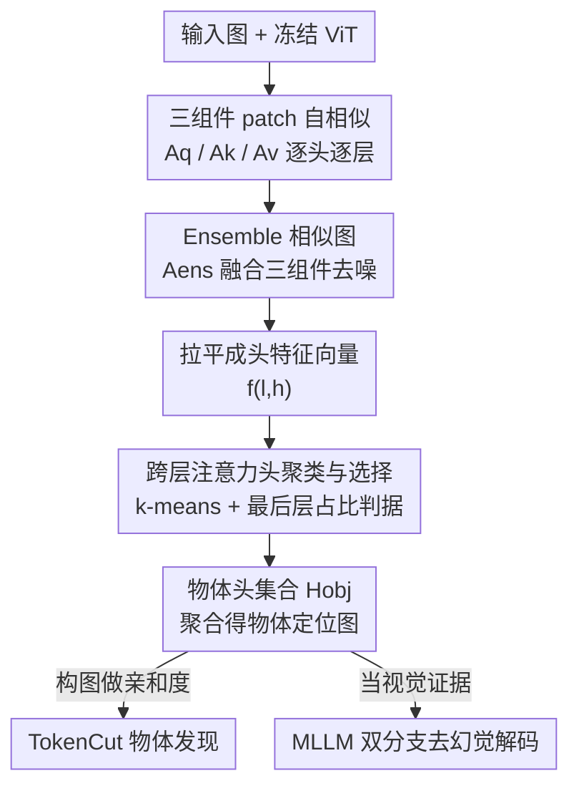

# Finding Distributed Object-Centric Properties in Self-Supervised Transformers

**会议**: CVPR 2026  
**论文**: [CVF Open Access](https://openaccess.thecvf.com/content/CVPR2026/html/Rawlekar_Finding_Distributed_Object-Centric_Properties_in_Self-Supervised_Transformers_CVPR_2026_paper.html)  
**代码**: 未提供（论文未给出代码链接）  
**领域**: 自监督表示分析 / 无监督物体发现  
**关键词**: 自监督ViT, DINO, 注意力头分析, 无监督物体发现, MLLM幻觉缓解  

## 一句话总结
论文系统分析了 DINO 这类自监督 ViT 内部「物体信息到底藏在哪」，发现它分布在所有层、并同时编码在 Query/Key/Value 三种 patch 相似度里（而非只在最后一层的 [CLS] 或 key 特征），据此提出无需训练的 Object-DINO——靠聚类跨层注意力头自动挑出「物体头」，把无监督物体发现 CorLoc 提升 +3.6~+12.4，并能给 MLLM 提供视觉证据缓解物体幻觉。

## 研究背景与动机

**领域现状**：自监督 ViT（以 DINO 为代表）在没有任何标注的情况下，会「涌现」出定位物体的能力。最常见的用法是把最后一层的 `[CLS]` token 当 query，看它的自注意力图——这张图会高亮显著物体区域，被广泛当作物体发现的信号源。后续更强的方法（如 TokenCut）则放弃 `[CLS]`，改用最后一层的 **key 特征** 构图做谱聚类/归一化割。

**现有痛点**：`[CLS]` 注意力图噪声大、定位粗糙，经常漏物体或把背景误激活。根因在于 DINO 的训练目标是**图像级**的全局匹配，`[CLS]` 被逼着去概括整张图的纹理/边缘/上下文，而不是聚焦到物体上。这种「全局目标 vs 想要的局部定位」之间的张力，让 `[CLS]` 图不可靠。即便是用 key 特征的 TokenCut，也只用了 key、且只用最后一层。

**核心矛盾**：物体信息其实存在于**局部的 patch 间交互**里——为了让 `[CLS]` 概括出语义丰富的全局摘要，自注意力必须先在 patch 之间按视觉相似度建立对应关系，于是同一物体的 patch 会自然地互相 attend、聚成簇。但这份直接的、patch 级的物体结构信息，在汇聚到 `[CLS]` 的过程中被稀释了。

**本文目标**：绕开 `[CLS]`，回答两个问题——(1) 该用 q/k/v 哪个组件、还是组合？(2) 物体信息是否只在最后一层，能否跨层利用？

**切入角度**：直接从 patch 级的 query、key、value 各自算 patch-patch 相似度矩阵，逐头、逐层地检验它们的定位能力，再用聚类把「物体头」从「噪声头」里分出来。

**核心 idea**：物体信息是**分布式**的——既跨 q/k/v 三组件，也跨网络多层；用一个 training-free 的聚类算法把这些分散的物体头自动找齐并聚合，就能得到比「最后一层 key」干净得多的物体定位图。

## 方法详解

### 整体框架

方法叫 **Object-DINO**，输入是一张图 + 一个冻结的预训练 ViT（如 DINO-V2/V3），输出是一组分布在各层的「物体头」集合 $H_{obj}$，把这些头的相似图聚合起来即得到高保真物体定位图。整条流水线无需任何训练或标注，分两个阶段：

第一阶段（**头特征提取**）逐头计算它在 q/k/v 上的 patch 自相似矩阵，融合成一张 ensemble 相似图，再拉平成描述「这个头干什么」的特征向量；第二阶段（**头聚类与选择**）对全网络 $L\times H$ 个头做 k-means 聚类，并用「哪个簇里最后一层的头最多」这个判据自动认定物体簇 $c_{obj}$。最后只聚合 $H_{obj}$ 里物体头的相似图，把非物体头的噪声滤掉，得到的定位图再喂给两个下游应用（无监督物体发现、MLLM 去幻觉）。

### 关键设计

**1. 三注意力组件的 patch 自相似矩阵：物体信息不止在 key**

针对「以往只用 key 特征、丢掉了 q 和 v」的痛点，本文对每个头 $(\ell,h)$、每种组件 $r\in\{q,k,v\}$，先做 L2 归一化 $\tilde r^{\ell,h}=r^{\ell,h}/\lVert r^{\ell,h}\rVert$，再算 patch-patch 自相似并 softmax 归一：

$$A_r^{\ell,h}=\mathrm{softmax}\!\left(\frac{\tilde r^{\ell,h}\cdot(\tilde r^{\ell,h})^{\top}}{\tau}\right)$$

其中 $\tau$ 是温度（消融取 $\tau=60$）。三张图各有侧重：$A_q$ 反映「哪些 patch 在找相似的东西」，$A_k$ 反映「哪些 patch 提供相似的上下文」，$A_v$ 反映「哪些 patch 内容相似」。论文的关键观察是这**三张图都带有强定位性**，说明 TokenCut 等只用 key 的方法其实只取了物体信息的一部分——q、v 含有互补信号。这是全文第一条核心 finding，也是后面所有设计的出发点。

**2. Ensemble 相似图 Aens：融合三组件互补、压噪**

单看 $A_q$/$A_k$/$A_v$ 各自都会出错——$A_q$、$A_v$ 有时把背景误并进前景，$A_k$ 又会漏掉物体的一部分。为了取长补短得到一张低噪声的物体显著图，本文把三者加权融合成 ensemble 矩阵：

$$A_{ens}^{\ell,h}=w_q\,A_q^{\ell,h}+w_k\,A_k^{\ell,h}+w_v\,A_v^{\ell,h}$$

默认等权 $w_q=w_k=w_v=0.33$。$A_{ens}$ 之后既是**刻画每个头行为**的统一表征（拉平成特征向量供聚类用），也是**最终输出物体图**的聚合单元。消融（Fig. 6）显示用 ensemble 选头的下游 CorLoc 一致优于任何单组件，排序为 $A_q<A_v<A_k<A_{ens}$——这从下游任务侧证明了「三组件融合 > 单用 key」。

**3. 跨层注意力头聚类与物体簇自动选择：把分布式物体头一次挑齐**

这是 Object-DINO 的算法主体，对应第二条 finding——**物体信息是跨层分布的，且最后一层并非每个头都是物体头**。论文在 4000 张 COCO 图上聚类发现：中间层（第 8–10 层）持续出现大量物体头，而最后一层（共 12 头）里有约 4 个头是非物体头、会引入噪声。因此「只取最后一层全部头」是次优的。

算法流程：先对每张图、每个头算出 $A_{ens}^{\ell,h}$ 并拉平成特征 $f^{\ell,h}$（功能相似的头会产生相关的模式、自然聚到一起）；再对全部 $L\times H$ 个头做 k-means（$K=5$）：

$$C=\text{k-means}(f^{\ell,h},K),\quad C=\{C_1,\dots,C_K\}$$

最后用一个**无需标注的判据**自动认定物体簇——既然先验和本文分析都表明最后一层物体头浓度最高，就选「包含最后一层头最多」的那个簇：

$$c_{obj}=\arg\max_k\, n_k^{(L)},\quad n_k^{(L)}=\big|\{(\ell,h)\in C_k\mid \ell=L\}\big|$$

落进该簇的所有头即 $H_{obj}=\{(\ell,h)\mid(\ell,h)\in c_{obj}\}$。妙处在于：判据只看最后一层，但被选中的簇里**天然包含了中间层的物体头**，于是既滤掉了最后一层的噪声头，又捞回了被「只看最后一层」方法忽略的中间层物体头——这正是性能提升的主来源。

**4. 两个 training-free 下游应用：把物体图当亲和度 / 当视觉证据**

物体图选出来后，论文用两个零训练应用验证其价值。其一是**无监督物体发现**：把 TokenCut 原本「最后一层全部头的 key」换成 $H_{obj}$ 物体头的 ensemble 相似度作为 patch 亲和度构图，其余 normalized-cut 流程不变，即可显著涨点。其二是**缓解 MLLM 物体幻觉**：用一个双分支解码策略——标准分支用原图 $u$ + 通用提示 $T_u$（如"描述这张图"）得到 $\text{Logits}(y\mid T_u,R,u)$，引导分支把 Object-DINO 的物体图 $v$ + 提示 $T_v$（如"描述高亮区域"）喂进同一个 MLLM 得到 $\text{Logits}(y\mid T_v,R,v)$，再线性组合：

$$L=\alpha\,\text{Logits}(y\mid T_u,R,u)+(1-\alpha)\,\text{Logits}(y\mid T_v,R,v)$$

取 $\alpha=0.4$，让与视觉证据一致的 token 被放大，从而纠正幻觉（如把"两只狗"纠正成"三只狗"）。⚠️ 正文 Eq. 5 与 Fig. 4 配图给出的组合形式略有出入（配图写作 $\text{Logits}(\cdot\mid T_u,R,u)+\alpha\cdot\text{Logits}(\cdot\mid T_v,R,v)$），以原文为准。相比 MARINE 跑监督检测器、DeGF 跑扩散反馈回环，这里只用单个自监督模型给出**开集**的空间物体图，更省算且保留了空间信息（不像把物体转成有损的文本列表）。

## 实验关键数据

### 主实验：无监督物体发现（CorLoc）

把 Object-DINO 挑出的物体头接进 TokenCut，替换其「最后一层全部头」的基线策略，在两代 DINO 上一致涨点（CorLoc，IoU>0.5）：

| 模型 | 方法 | VOC07 | VOC12 | COCO20K |
|------|------|-------|-------|---------|
| DINO-V3 | TokenCut | 26.0 | 30.3 | 19.8 |
| DINO-V3 | + Ours | 30.8 (+4.8) | 36.0 (+5.7) | 23.4 (+3.6) |
| DINO-V2 | TokenCut | 16.2 | 18.3 | 11.9 |
| DINO-V2 | + Ours | 25.7 (+9.5) | 30.7 (+12.4) | 19.7 (+7.8) |

### 主实验：MLLM 物体幻觉（POPE，越高越好）

双分支解码在三个 MLLM 上都拿到最高 Precision 与 F1：

| 方法 | LLaVA-1.5 Acc/P/F1 | InstructBLIP Acc/P/F1 | Qwen-VL Acc/P/F1 |
|------|--------------------|-----------------------|-------------------|
| Regular | 77.4 / 73.3 / 79.2 | 74.6 / 71.2 / 76.4 | 79.8 / 80.1 / 79.7 |
| VCD | 77.1 / 72.1 / 79.4 | 77.2 / 74.2 / 78.4 | 81.3 / 80.6 / 81.5 |
| DeGF | 81.6 / 80.5 / 81.9 | 80.3 / 80.9 / 80.1 | 83.4 / 84.4 / 82.9 |
| **Ours** | 83.6 / **87.4** / 82.7 | 82.7 / **87.7** / 81.6 | **86.6 / 89.2 / 86.1** |

CHAIR 上（越低越好）也大幅降低幻觉：LLaVA-1.5 上 $C_s/C_i=18.4/5.9$（Regular 为 26.2/9.4），InstructBLIP 上 $C_s=21.4$ 为最低。

### 消融实验：层/头选择拆解

| 方法 | VOC07 | VOC12 | COCO20K | 说明 |
|------|-------|-------|---------|------|
| TokenCut | 26.0 | 30.3 | 19.8 | 基线：最后一层全部头 |
| + Our Head（仅最后层） | 27.5 (+1.5) | 31.4 (+1.1) | 20.5 (+0.7) | 只去掉最后层噪声头 |
| + Our Head（全层） | 30.8 (+4.8) | 36.0 (+5.7) | 23.4 (+3.6) | 再加中间层物体头 |

### 关键发现
- **中间层贡献是性能主力**：从「仅最后层选头」到「全层选头」，中间层物体头额外带来 +3.3 / +4.6 / +2.9 CorLoc，远大于「滤最后层噪声头」的 +1.5 / +1.1 / +0.7——直接证明物体信息是分布式的，只看最后一层会丢掉大头。
- **ensemble > 单组件**：选头特征用 $A_{ens}$ 时下游 CorLoc 一致最高，单组件排序 $A_q<A_v<A_k<A_{ens}$，说明 q/v/k 互补且融合更鲁棒。
- **现象跨规模、跨目标存在**：在 DINO ViT-L/14 上分布式模式依旧；连重建式自监督的 MAE 也分布物体信息，只是信号更噪——这反过来解释了为何高保真定位任务普遍偏好 DINO。
- **效率**：双分支解码相比 Regular/VCD 只增加少量延迟与显存，却比多阶段反馈式方法（如 DeGF）省算得多。

## 亮点与洞察
- **「物体信息在哪」被当成一个可测量的实证问题**：作者不是又提一个 loss，而是逐头逐层量化 q/k/v 的定位性，把「分布式」从直觉变成可聚类、可挑选的对象——这种「先做诊断再做方法」的范式很值得迁移到其他涌现能力分析。
- **用「最后一层头占比最多」当无标注判据**很巧：既借用了「最后一层最物体中心」的先验来锚定正确的簇，又不被这个先验绑死在最后一层，被选中的簇自动带上了中间层物体头。这是一个「用强先验定位、靠聚类扩展覆盖」的好范例。
- **一份物体图喂两个看似无关的任务**：同一个 $H_{obj}$ 聚合图，既能当 TokenCut 的图亲和度，又能当 MLLM 解码的视觉证据，说明这份信号是任务无关的底层 objectness，复用价值高。
- 可迁移点：对任何带多头注意力的预训练模型，「逐头算自相似 → 融合 → 聚类 → 按先验选簇」这套零训练头选择流程，都可用于挖掘某种特定功能的头（不限于物体头）。

## 局限性 / 可改进方向
- **依赖若干预设超参与先验**：$K=5$、$\tau=60$、等权 0.33、$\alpha=0.4$ 都靠消融选定，且「选最后一层头最多的簇」这条判据本质上仍假设最后一层是物体中心——若某些自监督模型并不满足该先验，判据可能失效。
- **MAE 信号更噪未被解决**：方法对重建式自监督（MAE）只验证了「也分布」，但定位质量明显不如 DINO，论文未给出适配方案。
- **k-means 的稳定性存疑**：基于单图特征聚类，簇划分对图像分布、聚类初始化是否敏感、跨数据集是否一致，正文未充分讨论（部分放在附录）。
- ⚠️ **正文 Eq. 5 与 Fig. 4 的 logit 组合式不一致**，复现时需以代码/原文为准；论文当前也未给出代码链接。
- 可改进：把固定等权融合换成可学习/逐图自适应权重；把「选一个簇」放宽成软分配以容纳更细的头分工。

## 相关工作与启发
- **vs TokenCut**：两者都做无监督物体发现、都构亲和图。TokenCut 只用最后一层的 key 特征，本文指出这丢掉了 q/v 互补信息与中间层物体头；Object-DINO 不改 TokenCut 的割算法，只把亲和度来源换成跨层物体头的 ensemble 相似度，即取得 +3.6~+12.4 CorLoc，属于「即插即用的更好特征」。
- **vs DINO-seg / [CLS] 注意力**：早期方法直接阈值化最后一层 `[CLS]` 注意力图，受全局训练目标拖累而噪声大；本文绕开 `[CLS]`，回到 patch 级交互取信号，定位更干净。
- **vs MARINE / DeGF（MLLM 去幻觉）**：MARINE 用监督检测器生成闭集物体文本列表，DeGF 用扩散模型多轮反馈，都较重；本文用单个自监督模型给开集、保留空间结构的物体图作引导，更省算且不丢空间信息。
- **vs VCD / M3ID（对比解码）**：它们通过对比原图与噪声图的 logit 来放大视觉信号，本文则直接注入显式的物体定位图作为第二分支证据，幻觉指标（POPE Precision/F1、CHAIR）普遍更优。

## 评分
- 新颖性: ⭐⭐⭐⭐ 把「物体信息跨组件+跨层分布」做成可量化、可聚类挑选的对象，视角新颖，但单个组件（自相似、k-means、TokenCut）均为既有工具。
- 实验充分度: ⭐⭐⭐⭐ 覆盖两代 DINO、三个发现基准 + 三个幻觉基准 + 三个 MLLM，并有层/头、组件、模型规模多组消融。
- 写作质量: ⭐⭐⭐⭐ 「先诊断后方法」的论证链清晰，图示直观；个别公式（Eq.5）与配图不一致略影响复现。
- 价值: ⭐⭐⭐⭐ 训练免费、即插即用，同时利好无监督物体发现与 MLLM 可信度两个方向，复用性强。

<!-- RELATED:START -->

## 相关论文

- [\[CVPR 2026\] Towards Stable Self-Supervised Object Representations in Unconstrained Egocentric Video](towards_stable_self-supervised_object_representations_in_unconstrained_egocentri.md)
- [\[ICML 2025\] ReSA: Clustering Properties of Self-Supervised Learning](../../ICML2025/self_supervised/clustering_properties_of_self-supervised_learning.md)
- [\[CVPR 2026\] Vision Transformers Need More Than Registers](vision_transformers_need_more_than_registers.md)
- [\[CVPR 2026\] Progressive Mask Distillation for Self-supervised Video Representation](progressive_mask_distillation_for_self-supervised_video_representation.md)
- [\[CVPR 2026\] A Stitch in Time: Learning Procedural Workflow via Self-Supervised Plackett-Luce Ranking](a_stitch_in_time_learning_procedural_workflow_via_self_supervised_plackett_luce_r.md)

<!-- RELATED:END -->
