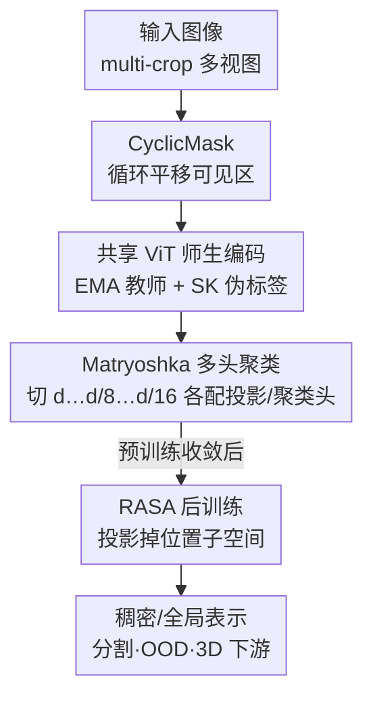

# Franca: Nested Matryoshka Clustering for Scalable Visual Representation Learning

**会议**: CVPR 2026  
**论文**: [CVF Open Access](https://openaccess.thecvf.com/content/CVPR2026/html/Venkataramanan_Franca_Nested_Matryoshka_Clustering_for_Scalable_Visual_Representation_Learning_CVPR_2026_paper.html)  
**代码**: https://github.com/valeoai/Franca （有，⚠️ 仓库地址以论文/官方发布为准）  
**领域**: 自监督表示学习  
**关键词**: 视觉基础模型, 自监督学习, Matryoshka 表示, 聚类自监督, 全开源

## 一句话总结
Franca 是首个完全开源（数据+代码+权重+中间检查点）的视觉基础模型，在 DINOv2 框架上引入「嵌套 Matryoshka 多头聚类」让特征沿维度逐层细化语义、用 CyclicMask 平衡掩码空间分布、再用 RASA 后训练把绝对位置信息从稠密特征里剥离出去，仅用公开数据就在分割、OOD 检测、3D 理解等任务上匹配甚至反超 DINOv2 / SigLIP 2 等闭源模型。

## 研究背景与动机
**领域现状**：自监督学习（SSL）是训练视觉基础模型（VFM）的主流路线，因为纯图像数据远比图文配对多。DINOv2、SigLIP 2、SEER、十亿级 MAE 等代表性模型已经把性能推得很高，典型做法是用师生蒸馏 + 基于最优传输（Sinkhorn-Knopp）的聚类伪标签，把图像特征分配到一个巨大的码本里。

**现有痛点**：两个层面。其一是**开放性**——这些 SOTA 模型几乎都依赖专有数据（DINOv2 的 LVD-142M、SigLIP 2 的 WebLI）并隐藏关键甚至全部训练代码，社区无法复现、也拿不到中间检查点去研究收敛轨迹。其二是**方法本身**：① 聚类语义天然存在歧义（一辆车可以按厂商、颜色、年份分组），现有方法只能靠堆超大码本（DINOv2 用到 131K 原型）来硬扛，参数和显存代价高；② 稠密特征会被**patch 的绝对位置**而非语义内容主导——同一语义部件若总出现在固定位置，聚类就会被位置带偏。

**核心矛盾**：单一固定维度的特征空间 + 单一巨大码本，既无法表达「粗→细」的多粒度语义层级，也无法在下游不同算力/显存预算下灵活截断；同时 ViT 的固定 patch 布局和位置编码把空间位置和语义纠缠在一起。

**本文目标**：做一个完全开源、性能不输闭源、且能在更小模型上不靠蒸馏就拿到高质量表示的 VFM，并从机制上解决聚类歧义与位置偏置。

**切入角度**：与其把所有语义压进一个维度的码本，不如让嵌套子空间各自负责不同粒度——大维度管全局语义、小维度管局部结构，天然形成 coarse-to-fine 层级；位置偏置则可以在预训练后用一个轻量线性手术切掉。

**核心 idea**：用「嵌套 Matryoshka 多头聚类」替代「单空间巨码本聚类」获得分层、可压缩的稠密表示，再用 RASA 后处理把可线性预测的位置成分投影掉。

## 方法详解
Franca 整体仍是 DINOv2 式的师生自监督框架，本文在其上叠加三个组件：CyclicMask（掩码策略）、Matryoshka 多头聚类（核心表示学习）、RASA（位置解纠缠后训练）。下面先讲整体怎么转，再逐个拆开。

### 整体框架
输入一张图像，按 DINO 的 multi-crop 切出多个全局/局部视图；每个视图切成 $n$ 个 patch 嵌入并前置一个 `[CLS]` token，送进共享的 ViT。学生 $f_\theta$ 和教师 $\bar f_{\bar\theta}$ 同架构，教师参数由学生的 EMA 更新。`[CLS]` 走 DINO 式头出图像级原型分数，patch 走 iBOT 式头出 patch 级原型分数；教师侧的投影输出用 Sinkhorn-Knopp 做成均衡的目标分布，学生用交叉熵去匹配。

Franca 在这条主干上做三处改造：训练时用 **CyclicMask** 决定哪些 patch 可见、用 **Matryoshka 多头聚类** 把编码器输出沿维度切成嵌套子集分别聚类（这是性能主力）；预训练结束后再跑一遍 **RASA** 后训练，把位置成分从稠密特征里减掉，且最终可折叠进 ViT 最后一层权重、推理零开销。

### 关键设计

**1. Matryoshka 多头聚类：让一套编码器同时学出粗→细的多粒度语义**

针对「单维度单码本扛不动聚类歧义、还得堆超大码本」的痛点。Franca 借用 Matryoshka 表示思想：把 ViT 输出 $Z_s = f_\theta(x)\in\mathbb{R}^{(n+1)\times d}$ 沿特征维度截成一组嵌套子嵌入。定义嵌套维度集合 $M=\{m_1,\dots,m_k\}$，$m_1<\dots<m_k=d$，取 $Z_s^{(j)} = Z_s[:,\,1:m_j]$（实验里 $d,\,d/8,\,d/16$ 三档）。和标准 Matryoshka「共享同一个投影头」不同，Franca **给每个子空间挂一个独立的投影头 $h_\nu^{(j)}$ 和独立的聚类头**，且原型数随 $m_j$ 减小而成比例减少——大维度配多原型、小维度配少原型，每个切片产出各自的原型与分配，被迫专门化到对应的语义粒度。每个头算一个交叉熵 $\mathcal{L}^{(j)}$，总损失等权相加：

$$\mathcal{L}_{\text{total}} = \sum_{j=1}^{k}\mathcal{L}^{(j)}.$$

关键差别在于**主干完全不动**，只在输出端做切片+多头，因此相比堆 131K 巨码本反而**更省参数、更省下游显存**（如 k-NN 分类可直接用截断后的小维度特征）。效果上：粗头抓全局语义、细头抓局部结构，形成层级；PCA 可视化显示即便切到训练时没见过的更小维度（dim/16 训练、却能看 dim/64），Franca 仍保持连贯的部件级结构，而 DINOv2 因为信息在全维度上均匀铺开、一压缩就丢语义对齐。

**2. CyclicMask：把可见 patch 的空间分布摊匀，逼模型学语义而非记位置**

针对掩码图像建模（MIM）里 random / block 掩码的老问题：它们缺乏空间结构，可见区域常常碎片化、上下文不连贯，还会让模型偏向特定空间位置。CyclicMask 不是随机挖洞或挖一整块，而是**沿空间轴循环平移可见区域**——把可见 patch 整体环形移位，打破简单的空间连续性，让可见内容在不同步骤覆盖到不同位置，从而避免模型对固定空间位置产生偏好、促进语义特征学习。它是个零成本的采样策略改动，和 Matryoshka、RASA 叠加时各自带来稳定增益（见 Figure 2）。

**3. RASA：用线性手术把绝对位置信息从稠密特征里投影掉**

针对 ViT 因固定 patch 布局 + 位置编码导致的「位置-语义纠缠」。作者先做诊断：用冻结模型把 COCO 的每个 patch 分到 65k 个 k-means 簇，统计每簇 patch 坐标的空间熵——DINOv2 很多簇在固定位置高频触发、空间熵很低，说明分配是被位置而非语义驱动。RASA（Removal of Absolute Spatial Attributes）是个预训练后的交替优化后训练：在迭代 $t$，先用一个线性位置预测头 $W\in\mathbb{R}^{2\times D}$ 在少量图像上回归归一化 patch 坐标，目标

$$\mathcal{L}_{\text{pos}} = \tfrac{1}{n}\sum_{i=1}^{n}\lVert \sigma(WZ_i) - y_i\rVert_2^2,\quad y_i\in[0,1]^2.$$

把 $W$ 的两行用 Gram–Schmidt 正交化成基向量 $u_r, u_c$，张成「位置子空间」，然后把每个特征向量在该子空间的投影减掉：$p_i = \langle Z_i,u_r\rangle u_r + \langle Z_i,u_c\rangle u_c$，$Z_i^{(t+1)} = Z_i^{(t)} - p_i^{(t)}$。由于是纯线性，单步变换可写成乘一个矩阵 $L^{(t)}=(I - u_r u_r^\top - u_c u_c^\top)$ ⚠️（原文式(3)写法略有出入，以论文为准），多步则是 $L=\prod_t L^{(t)}$。交替迭代到 $\mathcal{L}_{\text{pos}}$ 饱和（通常 9 次内），把**可线性预测的位置偏置**剥掉、保留语义。最妙的是这个最终矩阵 $L$ 可以直接**乘进 ViT 最后一层权重**，不改架构、推理零额外开销，却把 patch 簇的空间熵显著抬高、稠密任务普遍涨点。

### 损失函数 / 训练策略
预训练用 ViT-B/L/G（patch 14、不带 register），从头训 625K 步；ViT-B 用 ImageNet-21K（消融），ViT-L/G 用 LAION-600M，batch 2048（B）/3072（L、G），分辨率 224×224。随后在 IN-1K+ADE20K+COCO+KITTI+VOC 混合数据上做高分辨率微调（364² 训 30K 步、518² 训 10K 步；ViT-G 因算力跳过）。最后在 Pascal VOC 上跑 RASA 后训练 8 次迭代（lr 0.002、batch 128）。整套不依赖任何外部 teacher 蒸馏。

## 实验关键数据

### 主实验
与 DINOv2 在同一 IN-21K、同超参、均不蒸馏的受控对比（Table 2，节选）：

| 模型 | 架构 | HRFT+RASA | KNN(IN-1K) | IN-Context(ADE20K) | VOS(DAVIS) |
|------|------|-----------|-----------|--------------------|-----------|
| DINOv2 | ViT-B/14 | ✗ | 77.0 | 30.0 | 63.1 |
| Franca | ViT-B/14 | ✗ | **77.5** | **31.6** | **65.5** |
| DINOv2 | ViT-L/14 | ✓ | 80.7 | 37.9 | 66.6 |
| Franca | ViT-L/14 | ✓ | **82.5** | **39.6** | **70.0** |

稠密分割（Table 3，In-Context mIoU，节选）显示在公开数据下反超用专有数据/蒸馏的对手：

| 模型 | 架构 | 训练数据 | VOC | ADE20K |
|------|------|---------|-----|--------|
| Web-SSL | ViT-L/14 | MC-2B | 71.3 | 35.3 |
| DINOv2§(蒸馏) | ViT-L/14 | LVD-142M | 74.6 | 38.6 |
| Franca | ViT-L/14 | LAION-600M | **79.5** | **39.6** |

分类上 Franca-G 用 86.0% 线性精度匹配 Web-SSL-7B（86.0%）但参数少 7×；3D 理解（Feat2GS，Table 5）在 Geometry 与 All 设定下 PSNR/SSIM 取得最佳。

### 消融实验
逐组件累加（Figure 2，DINOv2-B / IN-21K 基线，线性探针 acc / In-Context mIoU）：

| 配置 | Linear Probe (IN-1K) | In-Context (VOC) | 说明 |
|------|---------------------|------------------|------|
| 1. Baseline | 81.2 | 69.6 | DINOv2-B 复现 |
| 2. + Matryoshka | 82.0 | 73.7 | 多粒度聚类，稠密任务涨幅最大 |
| 3. + High-Res FT | 82.6 | 76.2 | 高分辨率微调 |
| 4. + RASA | 82.6 | **76.7** | 位置解纠缠，进一步抬稠密 |

### 关键发现
- **Matryoshka 对稠密任务收益最大**：从 baseline 到加 Matryoshka，In-Context mIoU 从 69.6→73.7，是几个组件里单步涨幅最高的，印证「多粒度聚类」对像素级语义对齐最关键。
- **蒸馏才是官方 DINOv2-B 强的主因**：非蒸馏、同样 IN-21K 训练的 DINOv2-B 线性分割只有 86.9（VOC）/41.3（ADE20K），而 Franca-B 达 89.4/46.2——说明 Franca 不靠蒸馏就拿到了原本要靠 ViT-G 蒸馏才有的性能。
- **小维度仍稳**：k-NN 在 dim/64 强压缩下 Franca 仍显著优于 DINOv2，因为后者特征在全维度均匀分布、未为截断而训练。
- **RASA 零推理开销**：可折叠进最后一层权重，却把 patch 簇空间熵抬高、稠密任务普遍受益。

## 亮点与洞察
- **「全开源」当成一等公民**：不仅放权重，还放训练代码、可下载的公开数据、去重/NSFW 过滤代码，以及**中间检查点**——让社区能研究收敛轨迹和涌现行为，这在 VFM 里几乎独一份。
- **Matryoshka 用在聚类头而非单纯表示截断**：每个嵌套子空间独立投影头+独立原型，把「coarse→fine 语义层级」显式建模出来，比堆 131K 巨码本既省参数又涨点，思路可迁移到任何对比/聚类式 SSL。
- **RASA 是「线性手术」范式**：把要去除的属性（这里是位置）建成可线性预测的子空间再正交投影掉，因为是线性所以能折叠进权重、零开销——这套「诊断偏置→线性子空间→投影移除」的模板可复用到去其他可线性预测的 nuisance 因子（如光照、纹理）。
- 不蒸馏就能在中等模型尺寸拿高质量表示，降低了复现门槛。

## 局限与展望
- RASA 只能移除**可线性预测**的位置偏置；非线性纠缠的位置/语义关系它管不了，作者也指出并发的 DINOv3 仍残留位置偏置。
- ViT-G 因算力跳过高分辨率微调阶段，几个表里 G 档与 L 档的设定不完全可比 ⚠️（横向比大小需带 caveat）。
- 高分辨率微调用到了 VOC/ADE20K/COCO 等下游相关数据，虽只在有限阶段使用，但严格意义上不是纯「无下游接触」评测。
- 展望：把 Matryoshka 多头聚类与 RASA 整合进 DINOv3 这类更强框架，是作者明确点出的方向。

## 相关工作与启发
- **vs DINOv2**：同为师生 + Sinkhorn-Knopp 聚类自监督；DINOv2 靠专有 LVD-142M + ViT-G 蒸馏 + 单空间巨码本，Franca 改用公开数据 + 嵌套多头聚类 + CyclicMask + RASA，不蒸馏即匹配或反超，且完全开源。
- **vs 标准 Matryoshka 表示**：原版共享同一投影头、只是截断维度做检索；Franca 给每个嵌套子空间配独立投影头与聚类目标，让不同粒度专门化，是把 Matryoshka 从「表示压缩」升级为「分层聚类学习」。
- **vs SigLIP 2 / Web-SSL**：图文对齐或更大数据（MC-2B/2B 图像）路线在分割等稠密任务上反而弱（SigLIP 2 VOC 仅 57.8 线性分割），凸显 Franca 纯视觉、空间精确特征的价值；Franca-G 还以 7× 更少参数匹配 Web-SSL-7B 的分类精度。

## 评分
- 新颖性: ⭐⭐⭐⭐ 嵌套多头聚类 + RASA 线性去位置偏置组合扎实，单点偏「巧妙工程」而非范式级颠覆。
- 实验充分度: ⭐⭐⭐⭐⭐ 覆盖分类/分割/VOS/对象发现/OOD/3D，多骨干多数据，受控对比与消融到位。
- 写作质量: ⭐⭐⭐⭐ 动机清晰、图表丰富；个别公式排版（式3）易引歧义。
- 价值: ⭐⭐⭐⭐⭐ 首个全开源（含中间检查点）且性能对标闭源的 VFM，对社区复现意义大。

<!-- RELATED:START -->

## 相关论文

- [\[CVPR 2026\] Learning from Semantic Dictionaries: Discriminative Codebook Contrastive Learning for Unified Visual Representation and Generation](learning_from_semantic_dictionaries_discriminative_codebook_contrastive_learning.md)
- [\[CVPR 2026\] Scaling Dense Event-Stream Pretraining from Visual Foundation Models](scaling_dense_event-stream_pretraining_from_visual_foundation_models.md)
- [\[CVPR 2026\] Learning to See Through a Baby's Eyes: Early Visual Diets Enable Robust Visual Intelligence in Humans and Machines](learning_to_see_through_a_babys_eyes_early_visual_diets_enable_robust_visual_int.md)
- [\[CVPR 2026\] Exploring Visual Pretraining for Learning Language Intelligence](exploring_visual_pretraining_for_learning_language_intelligence.md)
- [\[CVPR 2026\] OpenVision 2: A Family of Generative Pretrained Visual Encoders for Multimodal Learning](openvision_2_a_family_of_generative_pretrained_visual_encoders_for_multimodal_le.md)

<!-- RELATED:END -->
