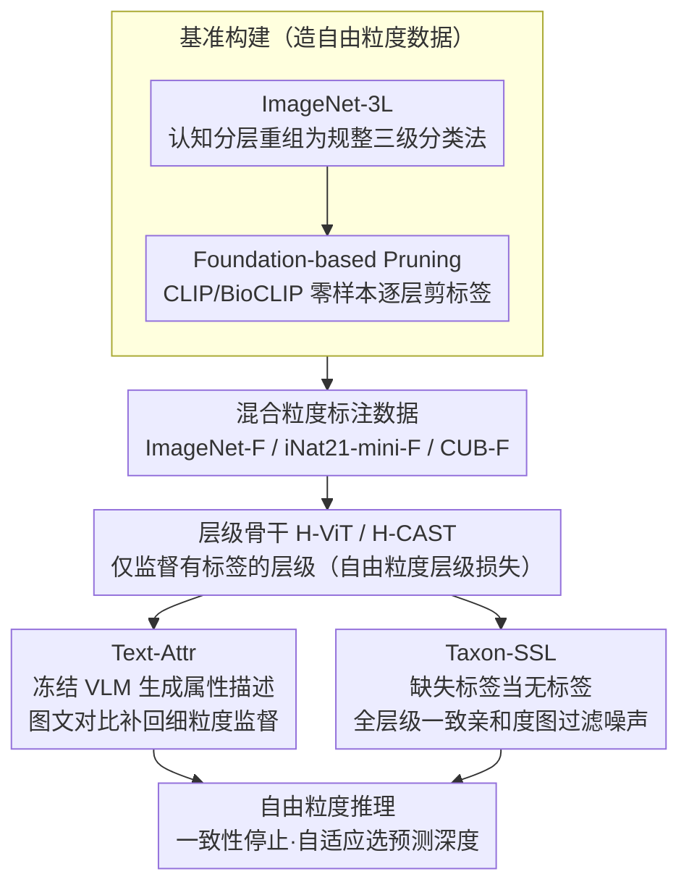

# Free-Grained Hierarchical Visual Recognition

**会议**: CVPR 2026  
**arXiv**: [2510.14737](https://arxiv.org/abs/2510.14737)  
**代码**: [FreeGrainLearning](https://github.com/seulkipark/FreeGrainLearning)  
**领域**: 自监督  
**关键词**: 层级分类, 混合粒度标注, 半监督学习, 文本引导, 分类法

## 一句话总结

提出"自由粒度"层级视觉识别（free-grained hierarchical recognition），允许训练标签出现在分类法的任意层级，并提出文本引导伪属性和分类法引导半监督学习两种方法来弥补缺失监督，推理时模型自适应选择预测深度。

## 研究背景与动机

传统层级分类假设每张训练图像在分类法的所有层级都有完整标注（如 Bird → Bird of prey → Bald eagle），但现实中标注往往不整齐：
- **内在原因**：图像可能没有足够视觉证据支持细粒度标签（如远处只能看到"鸟"但分不清种类）
- **外在原因**：标注受成本、专业水平或标注协议限制

本文定义了**自由粒度学习**设置：训练标签可以出现在分类法的任意层级，且不同样本的标注深度可以不同。模型需要从这种不完整、混合粒度的监督中学习一致的层级预测。

实验显示现有 SOTA 层级分类方法（H-CAST）在从完整标注转向自由粒度设置时，Full-Path Accuracy 暴跌 19-40 个百分点（如 iNat21-mini 从 64.9% 降至 25.6%），证明该设置的挑战性。

## 方法详解

### 整体框架

这篇论文要解决的是"自由粒度"层级识别——训练标签可以出现在分类法的任意层级、不同样本标注深度还不一样，模型得从这种缺斤短两的监督里学出一致的层级预测。整体由三块拼成：先把现有层级数据集改造成自由粒度基准（含新建的 ImageNet-3L 和模拟混合粒度标注的剪枝），再用文本引导伪属性（Text-Attr）和分类法引导半监督（Taxon-SSL）两条路补回缺失的监督，推理时让模型自适应地决定预测到哪一层停下。

### 关键设计

**1. ImageNet-3L 数据集构建：给层级评估造一个干净的三级分类法**

ImageNet 原生的 WordNet 层级又乱又深（5-19 层、30% 类别有多条路径），根本没法干净地评估层级一致性。本文据认知心理学的分层原则把它重组成规整的三级分类法（20 个 basic / 127 个 subordinate / 505 个 fine-grained），构建时移除单子女路径、最大化组内多样性、细化模糊类别，并用 LLM + 人工审核兜底，得到一个可直接做层级评测的大规模干净基准。

**2. Foundation-based Pruning：用基础模型零样本预测模拟真实的混合粒度标注**

要研究自由粒度学习，得先有"标注不整齐"的数据。本文不靠随机丢标签，而是用 CLIP/BioCLIP 的零样本预测从粗到细逐层检查：subordinate 预测对就保留、fine-grained 也对就一并保留，错的层级标签则移除。这样剪出来的 ImageNet-F 里 32.6% 保留全部三级、28.0% 保留两级、39.4% 仅剩 basic，比随机丢标签更贴近"视觉证据不足导致细粒度缺失"的真实分布。

**3. Text-Attr：用跨层级一致的视觉属性补回细粒度监督**

核心观察是：不同层级的类别名不同，但很多视觉属性（"短腿""尖耳朵"）跨层级是一致的。于是用冻结 VLM（Llama-3.2-11B）给图像生成文本描述，再用 CLIP 文本编码器编码，通过对比学习把图像特征对齐到文本嵌入。这条监督不依赖类别标签，正好在细粒度标签缺席时提供额外的语义线索，所以在标签稀缺的大规模数据上尤其管用。

**4. Taxon-SSL：把缺失层级标签当无标签数据，用分类法对齐的亲和度图过滤噪声**

另一条路是把缺失的层级标签直接当成无标签数据来做半监督。关键创新是分类法对齐的亲和度图：只有当两个样本在**所有层级**的伪标签都一致时才算正样本对（公式 3），任何一层不一致都不连边。这道"全层级一致"的闸门能有效滤掉噪声伪标签、保证层级一致性，再在此基础上用对比损失拉近正样本对、推远负样本对，所以在类间外观相似的细粒度生物数据上比 Text-Attr 更稳。

**5. 自由粒度推理：用一致性停止让模型自适应选择预测深度**

训练补回监督后，推理还要回答"该预测到哪一层"——因为一个正确的粗标签往往比一个错误的细标签更有用。本文比较两种停止策略：confidence-based 在 softmax 置信度低于阈值（$\tau=0.9$）时停下，但相似兄弟类会把概率分摊掉，常常过早停在粗层；consistency-based 则只在细层预测与其粗层祖先冲突、破坏分类法一致性时才停。后者无需调阈值，反而能更可靠地下探到更深的正确层级，所以本文采用它——这也呼应了"层级一致性越强、自由粒度推理越有效"的整体主张。

### 损失函数 / 训练策略

- **自由粒度层级损失**：$\mathcal{L}_{hier} = \sum_l \mathbb{1}_{y_l \text{ exists}} \cdot \mathcal{L}(f_l(x), y_l)$，仅在有标签的层级应用监督
- **文本对比损失**：InfoNCE 损失对齐图像-文本嵌入
- **分类法对齐对比损失**：基于全层级一致伪标签的对比学习
- 骨干网络：ViT-Small (H-ViT) 或 H-CAST；训练 100 epoch（ImageNet-F 200 epoch）

## 实验关键数据

### 主实验

| 数据集 | 方法 | FPA ↑ | Fine ↑ | Sub ↑ | Basic ↑ | TICE ↓ |
|--------|------|-------|--------|-------|---------|--------|
| ImageNet-F | H-CAST (full→free) | 57.59 | 59.02 | 82.69 | 93.53 | 21.81 |
| ImageNet-F | Text-Attr (H-CAST) | **63.20** | 64.91 | 84.47 | 93.56 | 18.58 |
| ImageNet-F | Taxon-SSL | 48.40 | 52.34 | 65.74 | 82.96 | 19.87 |
| iNat21-mini-F | H-CAST | 25.63 | 28.61 | 67.20 | 83.62 | 47.17 |
| iNat21-mini-F | Taxon-SSL + Text-Attr | **31.93** | 37.08 | 69.76 | 82.20 | 37.04 |
| iNat21-mini-F | Taxon-SSL | 31.74 | 37.11 | 69.53 | 82.02 | 37.31 |

### 消融实验

| 设置 | 关键指标 | 说明 |
|------|---------|------|
| H-CAST full → free (CUB) | FPA: 84.9% → 45.1% | 缺失标注导致 39.8pp 暴跌 |
| H-CAST full → free (iNat) | FPA: 64.9% → 25.6% | 缺失标注导致 39.3pp 暴跌 |
| Text-Attr 稀疏标签 | 优于 Taxon-SSL | 文本在标签稀缺时弥补监督 |
| Taxon-SSL 充足标签 | 优于 Text-Attr | 有足够数据时 SSL 更有效 |

### 关键发现

1. **现有方法在自由粒度设置下严重退化**：H-CAST 的 FPA 下降 19-40 pp，证明该设置的研究必要性。

2. **Text-Attr 和 Taxon-SSL 各有优势**：Text-Attr 在大规模多样化数据集（ImageNet-F）上表现更强，因文本描述提供了丰富的语义线索；Taxon-SSL 在细粒度生物数据集（iNat21-mini-F）上更优，因类间外观相似，视觉一致性更重要。

3. **一致性优于置信度的推理策略**：consistency-based stopping（当层级一致性被打破时停止）比 confidence-based stopping（当 softmax 置信度低于阈值时停止）产生更可靠、更深的正确预测，且不需要调节阈值。

4. **文本引导改善语义聚焦**：saliency map 显示 Text-Attr 帮助模型关注语义相关区域（如乐器而非人），而 Taxon-SSL 可能被视觉显著但语义无关区域误导。

## 亮点与洞察

- 定义了一个重要的新设置：自由粒度层级识别。这比传统的完整层级标注假设更贴近现实。
- ImageNet-3L 基准的构建本身就是有价值的贡献，为层级分类提供了大规模、干净的评估平台。
- 两种方法的互补性是深刻的洞察：当标签稀缺时用外部语义知识（文本）弥补，当标签适中时用结构化 SSL 利用层级一致性。这为实际应用中选择策略提供了指导。
- Consistency-based inference 是一个优雅的无参数推理策略。

## 局限与展望

- 类级别和层级级别的不平衡未被显式处理
- 标签剪枝依赖 CLIP，可能引入偏差，更好的剪枝方法（如基于多模型集成）有待探索
- 提出的两种方法虽有效但提升仍有限（5-25%），表明自由粒度学习仍有很大改进空间
- 未将方法扩展到更深的层级分类法（超过 3 级）
- 推理时仅考虑何时"停止预测"，未考虑层级间的信息传播和纠错

## 相关工作与启发

- H-CAST (CVPR'23) 是层级分类 SOTA，鼓励跨层级的一致视觉分组
- HRN (CVPR'22) 通过最大化树约束空间的边际概率处理多层级监督
- CHMatch 将粗标签用于改进伪标签，但限于两级设置
- 本文将长尾识别、半监督学习、弱监督学习和层级一致性统一在一个框架下

## 评分

- 新颖性: ⭐⭐⭐⭐⭐ （定义了重要的新问题设置，数据集和方法均有创新）
- 实验充分度: ⭐⭐⭐⭐⭐ （多数据集、多设置、详尽分析和可视化）
- 写作质量: ⭐⭐⭐⭐⭐ （问题定义清晰，图表出色，组织结构好）
- 价值: ⭐⭐⭐⭐⭐ （开辟新研究方向，提供基准和基线，实际意义强）

<!-- RELATED:START -->

## 相关论文

- [\[ICCV 2025\] Scaling Language-Free Visual Representation Learning](../../ICCV2025/self_supervised/scaling_languagefree_visual_representation_learning.md)
- [\[CVPR 2026\] CHEEM: Continual Learning by Reuse, New, Adapt and Skip -- A Hierarchical Exploration-Exploitation Approach](cheem_continual_learning_by_reuse_new_adapt_and_skip_--_a_hierarchical_explorati.md)
- [\[CVPR 2026\] HyCal: A Training-Free Prototype Calibration Method for Cross-Discipline Few-Shot Class-Incremental Learning](hycal_training_free_prototype_calibration_for_cross_discipline_fscil.md)
- [\[CVPR 2026\] SpHOR: A Representation Learning Perspective on Open-set Recognition for Identifying Unknown Classes in Deep Neural Networks](sphor_a_representation_learning_perspective_on_open-set_recognition_for_identify.md)
- [\[AAAI 2026\] FineXtrol: Controllable Motion Generation via Fine-Grained Text](../../AAAI2026/self_supervised/finextrol_controllable_motion_generation_via_fine-grained_text.md)

<!-- RELATED:END -->
