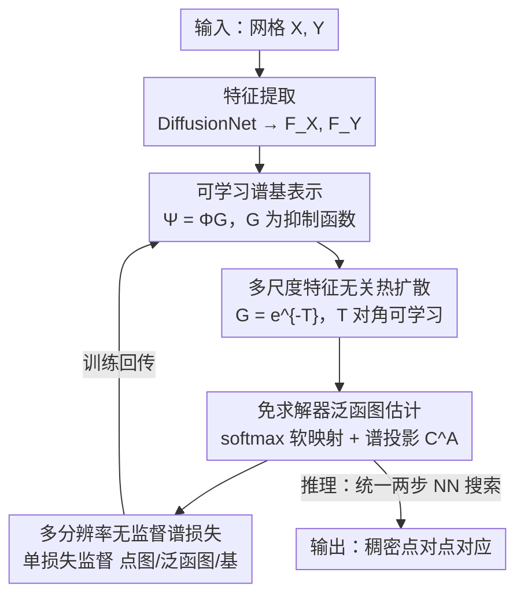

# From Feature Learning to Spectral Basis Learning: A Unifying and Flexible Framework for Efficient and Robust Shape Matching

**会议**: CVPR 2026  
**论文**: [CVF Open Access](https://openaccess.thecvf.com/content/CVPR2026/html/Luo_From_Feature_Learning_to_Spectral_Basis_Learning_A_Unifying_and_CVPR_2026_paper.html)  
**代码**: https://github.com/LuoFeifan77/Unsupervised-Spectral-Basis-Learning  
**领域**: 3D视觉 / 自监督表示学习  
**关键词**: 形状匹配, 泛函图(Functional Maps), 谱基学习, 热扩散, 无监督学习

## 一句话总结
针对深度泛函图匹配长期只优化"特征"、却把"谱基"当成固定不变的盲点，本文提出 Advanced Functional Maps：用一组可学习的"抑制函数" $G$ 把固定的拉普拉斯特征基 $\Phi$ 变成可学习基 $\Psi=\Phi G$，并以一个轻量的多尺度热扩散网络端到端联合优化特征与谱基，在非等距、拓扑噪声等困难场景下显著超越只学特征的 SOTA，同时因抛掉了泛函图求解器而更快更稳。

## 研究背景与动机

**领域现状**：非刚性 3D 形状匹配（在两个网格之间建立稠密对应）的主流范式是"深度泛函图"（deep functional map）。它把点对点映射压缩成一个 $k\times k$ 的小矩阵 $C_{XY}$，在拉普拉斯特征基张成的低频谱空间里求解，再由 ZoomOut 类算法还原成稠密对应。FMNet 开启了这一可微范式后，后续工作几乎都在做同一件事：换更强的特征提取骨干（如 DiffusionNet），加更多正则（双射性、正交性、点图-泛函图耦合一致性）去优化**特征** $F_X=\mathcal{F}_\Theta(X)$。

**现有痛点**：整条流水线里有两个被忽视的代价。其一，**谱基从头到尾是固定的**——大家用数据驱动优化特征，却把拉普拉斯特征基 $\Phi$ 当成不可改的常量。可特征再好，最终匹配都要投影到这组固定基上，基本身的表达力成了天花板，在大形变、非等距、拓扑噪声场景里直接导致次优。其二，多数 SOTA（ULRSSM、HybridFMaps、DeepFAFM 等）依赖**最小二乘泛函图求解器**外加一堆辅助损失，训练范式复杂、计算开销大且数值上不稳定。

**核心矛盾**：泛函图的质量由"特征 × 谱基"共同决定，但社区只动了乘式里的一个因子。把谱基也变成可学习的，理论上能让基随下游任务自适应地抑制噪声频段；但难点在于——怎么在保持基的可逆性、正交性、几何先验的前提下让它可微可学，又不引入昂贵参数？

**本文目标**：(1) 给出一个把"固定基"推广成"可学习基"的泛函图理论框架；(2) 基于它做出首个无监督、端到端联合优化特征与谱基的匹配方法；(3) 顺手砍掉求解器和辅助损失，换来效率与鲁棒性。

**核心 idea**：在拉普拉斯基 $\Phi_k$ 上右乘一个对角的**抑制函数矩阵** $G=\mathrm{diag}\{g_1,\dots,g_k\}$（$g_i\in(0,1]$），得到可学习基 $\Psi_k=\Phi_k G$。$G$ 像一个作用在频谱上的"注意力/滤波器"，按任务需求逐频段抑制或保留。作者进一步证明：学这组基在数学上**等价于做谱卷积**，$G$ 就是谱滤波器——这把形状匹配和谱图神经网络打通了。

## 方法详解

### 整体框架

方法要解决的是"既学特征又学谱基"。整体是一条**单分支、无求解器**的可微流水线：输入两个三角网格 $X,Y$ → DiffusionNet 提取逐顶点特征 $F_X,F_Y$（这一段沿用现成做法，是脚手架）→ **基学习模块**用多尺度热扩散把固定基 $\Phi$ 变成可学习基 $\Psi$ → **映射估计**用 softmax 直接得到软点对点映射 $\Pi_{YX}$，再经谱投影算出高级泛函图 $C^A_{XY}$ → 用一个**多分辨率无监督谱损失**同时监督点图、泛函图、基函数三者；推理时走统一的两步最近邻搜索还原稠密对应。

与图 1 里"双分支 + 求解器 + 谱投影 + 多个一致性损失"的旧架构相比，本文（图 2）只保留谱投影一条路、只用一个损失，结构被显著精简。整条 pipeline 如下：

### 关键设计

**1. 可学习谱基表示（Advanced Functional Maps）：把固定基变成可学习基**

这是全文的理论地基，直击"谱基不可优化"的痛点。给定形状上前 $k$ 个拉普拉斯基 $\Phi_k=[\phi_1,\dots,\phi_k]$ 和一组抑制函数 $G=\mathrm{diag}\{g_1,\dots,g_k\}$（$g_i:\mathbb{R}\to(0,1]$），定义可学习基

$$\Psi_k := \Phi_k G,\qquad \psi_i=g_i\phi_i.$$

抑制函数对每个频段做"逐档衰减"，直观上就是作用在频谱上的注意力/滤波。作者证明这个简单构造保留了泛函图流水线所需的全部好性质：**可逆**（$\Psi_k^\dagger=G^{-1}\Phi_k^\top M$，因 $\Psi_k^\dagger\Psi_k=I$)、**正交保持**（$\langle\psi_i,\psi_j\rangle_M=g_ig_j\langle\phi_i,\phi_j\rangle_M=0,\ i\neq j$)、**可学习**（$G$ 是数据驱动参数）、以及**结构先验不变**（低频信息原本编码在 $\phi_1$，乘 $G$ 后仍保留在 $\psi_1$，不会破坏几何语义）。在此基础上，标准泛函图优化（式 1）被改写为以 $\Psi$ 为基的"高级泛函图" $C^A_{XY}$（定理 4.2），并可等价地用谱投影直接算 $C^A_{XY}=\Psi_{Y,k}^\dagger\,\Pi_{YX}\,\Psi_{X,k}$（式 9）。相比传统只在固定基上操作，这一步把"基"也纳入了可优化变量，是后续一切的前提。

**2. 多尺度特征无关热扩散：用极少参数生成抑制函数 $G$**

光有"基可学"的定义还不够，关键是怎么参数化 $G$ 才既轻量又有表达力。最朴素的做法是借经典热扩散，把基截断到前 $k$ 个特征函数后写成 $\Psi_k=h_t(\Phi_k)=\Phi_k e^{-t\Lambda_k}$（式 17）。但作者指出它有两个硬伤：(a) 单一扩散时间 $t$ 限制了多尺度表达力；(b) 特征值 $\Lambda_k$ 充当固定权重，会**不分任务地过度压制高频**，而理想情况下频率衰减应由下游任务自适应决定。

为此本文提出**多尺度、特征值无关**的热扩散：

$$\Psi_k=\Phi_k\,e^{-T},\qquad T=\mathrm{diag}\{t_1,t_2,\dots,t_k\},$$

即把扩散时间从单个标量 $t\Lambda_k$ 换成一个**逐频段可学习的对角矩阵** $T$（式 18），彻底解绑特征值。两个细节很巧：$T$ 初始化为零，使训练初期 $G=e^{-T}=I$ 表现为恒等映射、平等保留所有原始基，给优化一个温和的起点；同时**源/目标域共享** $T$（$\Psi_{X,k}=\Phi_{X,k}G$、$\Psi_{Y,k}=\Phi_{Y,k}G$），既省参数又促成两形状间的谱一致性。整个基学习网络只用一组共享对角参数，这正是它"轻量"的来源。

**3. 免求解器的高级泛函图估计：只用谱投影 + softmax 软映射**

这一步针对"依赖最小二乘求解器、慢且不稳"的痛点。点对点映射不再解线性系统，而是直接用 softmax 生成可微的软对应矩阵

$$\Pi_{YX}=\mathrm{Softmax}(F_Y F_X^\top/\alpha),$$

其中 $\alpha$ 控制软硬程度（式 19）。高级泛函图则**只**用谱投影式 9 得到，完全不调用任何泛函图求解器。作者证明谱投影与最小二乘解在一定条件下等价（论文 Sec. 10.2），所以求解器是冗余的——既然两条路结果一致，就走更便宜的那条。由此避开了最小二乘的数值不稳定与高开销，作者据此声称计算开销显著更低（具体效率数字在补充材料 Sec. 11.3，⚠️ 正文未给表，以原文为准）。

**4. 多分辨率无监督谱损失：单一损失统一监督三件事**

旧方法通常把点图、泛函图、基函数分开用一堆损失（双射、正交、耦合一致性）去管。本文把它们**统一进一个跨多个特征向量分辨率的损失**：

$$L_{mrs}=\sum_{k=k_{init}}^{k_{end}}\big\|\Psi_{Y,k}-\Pi_{YX}\Psi_{X,k}(C^A_{XY})^\top\big\|_F^2.$$

它在 $k$ 从 $k_{init}$ 到 $k_{end}$ 的多个谱分辨率上，同时约束点图 $\Pi_{YX}$、泛函图 $C^A_{XY}$ 与可学习基 $\Psi$ 的结构一致性（式 20）。一个损失替掉一组损失，训练范式被大幅简化，作者称仅凭这一项就能超过用多损失组合的 SOTA。推理阶段同样统一：先在特征空间做最近邻 $\Pi_{YX}=\mathrm{NS}(F_Y,F_X)$（式 21），再用学到的基做一次还原 $\Pi^{end}_{YX}=\mathrm{NS}(\Psi_{Y,k_{end}},\Psi_{X,k_{end}}(C^A_{XY})^\top)$（式 22）。值得注意的是，ULRSSM/HybridFMaps 要在"非等距用特征匹配、近等距用泛函图还原"之间手动切换，而本文靠可学习基自适应抑制谱噪声、抹平非等距畸变，**一条统一流水线**就能覆盖各种场景。

> 理论彩蛋：作者证明 $\Psi=\Phi f(\Lambda)=(\Phi * f)$（式 16），即**学基函数 = 在原始基上做谱卷积，$G$ 就是谱滤波器**。这把 ChebyNet、MoNet、GRAND、DiffusionNet 等谱图/流形卷积与热扩散框架，统一解读成"直接优化基函数"的机制，给未来用谱 GNN 设计更强的基打开了入口。

### 损失函数 / 训练策略
- 训练目标即上面的单一多分辨率无监督谱损失 $L_{mrs}$（式 20），无任何辅助泛函图损失、无监督标签。
- 特征骨干用 DiffusionNet；基学习只引入共享对角参数 $T$（初始化为 0），参数量极小。
- 全程端到端联合优化特征 $\Theta$ 与基参数 $T$。

## 实验关键数据

评测覆盖近等距、跨数据集泛化、各向异性重网格、非等距四类场景，指标为平均测地误差（×100，越小越好）。基线含公理化方法（ZoomOut/SmoothShells/...）、有监督（FMNet/GeomFmaps）与一众无监督 SOTA；其中 ULRSSM、HybridFMaps 还额外测了 test-time fine-tuning 版本（w.FT，需在测试集上重训，作者仅作为"对照天花板"）。

### 主实验（近等距 + 跨数据集，节选自 Tab. 4，×100 测地误差）

| 训练→测试 | F→F | S→S | S→S19 | F→S19 |
|------|------|------|------|------|
| GeomFmaps（有监督） | 2.6 | 3.0 | 12.2 | 9.9 |
| AttentiveFMaps | 1.9 | 2.2 | 9.9 | 6.4 |
| RFMNet | 1.7 | 2.1 | 6.9 | 6.3 |
| ULRSSM | 1.6 | 1.9 | 18.5 | 14.5 |
| ULRSSM(w.FT) | 1.6 | 1.9 | 6.7 | 5.7 |
| HybridFMaps | 1.4 | 1.8 | 13.0 | 9.5 |
| DiffZO | 1.9 | 2.4 | 6.9 | 4.2 |
| **Ours** | 1.8 | 2.3 | **5.9** | 6.2 |

关键看跨数据集列：ULRSSM/HybridFMaps 不微调时在 S→S19、F→S19 上误差暴涨（如 ULRSSM 18.5、HybridFMaps 13.0），暴露泛化差、高度依赖 test-time 微调；本文不微调即拿到 S→S19 的 5.9，**优于 ULRSSM 微调后的 6.7**。近等距同分布上本文与 SOTA 持平（非最优但差距很小）。

### 非等距与鲁棒性（SMAL / DT4D-H inter-class / 各向异性，×100）

| 方法 | SMAL | DT4D-H(inter) | S→F a | S a→S a |
|------|------|------|------|------|
| ULRSSM | 4.5 | 5.2 | 8.9 | 1.9 |
| ULRSSM(w.FT) | 4.2 | 4.1 | 2.4 | 1.9 |
| HybridFMaps | 3.5 | 3.9 | 4.6 | 1.8 |
| HybridFMaps(w.FT) | 2.8 | 3.5 | 2.2 | 1.7 |
| DeepFAFM | 3.9 | 4.2 | 2.9 | 1.9 |
| **Ours** | **2.6** | **3.5** | 3.6 | 2.3 |

非等距是本文最强项：SMAL 2.6、DT4D-H inter-class 3.5，**全面超过所有无微调基线，且 SMAL/DT4D-H 上超过 HybridFMaps 的微调版**。尤其 HybridFMaps 靠引入外在弹性基才提升，而本文只用优化后的**内在拉普拉斯基**就反超，说明可学习抑制函数确实在补偿非等距畸变。各向异性重网格上（如 S→F a）本文 3.6 略逊于个别微调基线，但对网格连通性变化的整体鲁棒性更稳。

### 关键发现
- **谱基才是被忽视的瓶颈**：在固定基上把特征卷出花来，跨数据集仍会崩；让基自适应后，泛化与非等距鲁棒性同时拉起来，验证了"优化基"这条被忽略的轴确有大收益。
- **不微调 > 别人微调**：本文在多个困难基准上无 test-time adaptation 就压过 ULRSSM/HybridFMaps 的微调结果，对比凸显其泛化是结构性的而非靠测试集重训堆出来的。
- **效率**：作者称因免求解器+单损失而显著更快更省，但正文未给效率表（数字在补充 Sec. 11.3）⚠️ 以原文为准。
- ⚠️ 主文未提供独立的模块消融表（各模块贡献的拆解在补充材料），本文以上两表为主结果与跨场景对比。

## 亮点与洞察
- **一行公式撬动一个被忽视的维度**：$\Psi=\Phi G$ 极简，却把"谱基"从固定常量变成可学习变量，且证明保留可逆/正交/几何先验——简洁又自洽，是那种"为什么以前没人这么做"的设计。
- **理论统一很漂亮**：证明"学基 = 谱卷积、$G$ = 滤波器"，把形状匹配与谱图/流形 GNN（ChebyNet/GRAND/DiffusionNet）打通，等于给"如何设计更好的基"提供了一整套现成工具箱，可迁移性强。
- **做减法的勇气**：抛弃泛函图求解器、用一个多分辨率损失替掉多损失组合、推理流水线统一不分场景——少即是多，且效果不降反升。
- **可迁移 trick**：把"对角可学习扩散时间 $T$、初始化为 0 当恒等、源目标共享"这套轻量谱滤波参数化，可借鉴到任何需要在谱域逐频段自适应加权的任务。

## 局限与展望
- 作者承认：在**极端非等距形变**与**部分形状匹配**下，拉普拉斯基编码的结构信息被严重破坏，可学习抑制函数也难以补救；出路是引入形变感知表示或外在信息。
- 自己的观察：方法仍以"固定的前 $k$ 个拉普拉斯基"为底座，$G$ 只能在该子空间内逐频段缩放，无法生成全新的基方向，表达力上限受原始 $\Phi$ 约束。
- 近等距同分布场景上本文并非最优（与 SOTA 持平偏后），收益主要来自困难/跨域场景；若任务以近等距为主，提升有限。
- 各向异性某些设置（如 S→F a 的 3.6）略逊于微调基线，对网格连通性的极端变化仍有改进空间。

## 相关工作与启发
- **vs ULRSSM / HybridFMaps（两分支 + 求解器 + 多损失）**：它们只学特征、靠泛函图求解器和多个一致性损失，且要在测试时微调、在非等距/近等距间手动切换流水线。本文单分支、免求解器、单损失、统一推理，且不微调即超过其微调结果——区别在于把"基"也学了，鲁棒性来自结构而非测试集适配。
- **vs HybridFMaps 的外在弹性基**：HybridFMaps 用外在弹性基提升非等距匹配；本文只用优化后的内在拉普拉斯基就在 SMAL/DT4D-H 反超，说明内在基若可学习同样能抵抗非等距畸变，且不需引入外在信息。
- **vs DiffFMaps（有监督谱嵌入）**：DiffFMaps 在点云上分别训练谱嵌入与特征，依赖真值标签、训练解耦且昂贵，又因嵌入来自离散点云不适用于网格。本文是无监督、特征与基协同优化、面向网格数据的更整合范式。
- **vs 经典谱图/流形 CNN（ChebyNet/MoNet/GRAND）**：本文证明这些方法本质都在"优化基函数"，把它们纳入同一谱卷积视角，反过来可用其滤波器设计经验来构造更强的匹配用基。

## 评分
- 新颖性: ⭐⭐⭐⭐⭐ 首个无监督谱基学习匹配方法，并给出"基学习=谱卷积"的统一理论，切入了被长期忽视的维度
- 实验充分度: ⭐⭐⭐⭐ 跨近等距/非等距/各向异性/跨域多基准充分对比，但主文缺独立模块消融表（在补充）
- 写作质量: ⭐⭐⭐⭐⭐ 理论框架（定理+性质）与方法动机层层递进，公式与直觉解释清晰
- 价值: ⭐⭐⭐⭐⭐ 简洁可复用的框架 + 打通谱 GNN 的桥梁，对 3D 形状匹配后续研究有明确启发

<!-- RELATED:START -->

## 相关论文

- [\[CVPR 2026\] MemFlow: A Lightweight Forward Memorizing Framework for Quick Domain Adaptive Feature Mapping](memflow_a_lightweight_forward_memorizing_framework_for_quick_domain_adaptive_fea.md)
- [\[CVPR 2026\] Stabilizing Feature Geometry in Noisy Pretrained Models for Robust Downstream Tasks](stabilizing_feature_geometry_in_noisy_pretrained_models_for_robust_downstream_ta.md)
- [\[CVPR 2026\] Learning by Analogy: A Causal Framework for Compositional Generalization](learning_by_analogy_a_causal_framework_for_compositional_generalization.md)
- [\[CVPR 2026\] GM-R²: Generative Matching Learning for Unsupervised Geometric Representation and Registration](gm-r2_generative_matching_learning_for_unsupervised_geometric_representation_and.md)
- [\[AAAI 2026\] HiLoMix: Robust High- and Low-Frequency Graph Learning Framework for Mixing Address Association](../../AAAI2026/self_supervised/hilomix_robust_high-_and_low-frequency_graph_learning_framework_for_mixing_addre.md)

<!-- RELATED:END -->
