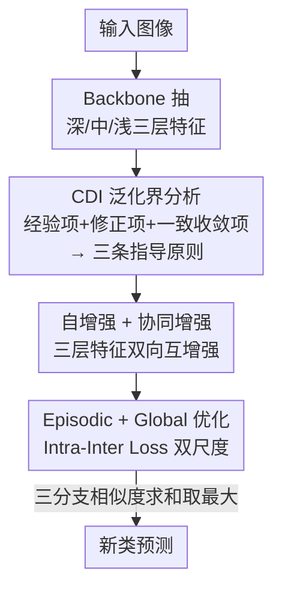

# From Few-way to Many-way: Rethinking Few-shot Fine-grained Image Classification

**会议**: CVPR 2026  
**论文**: [CVF Open Access](https://openaccess.thecvf.com/content/CVPR2026/html/Zhao_From_Few-way_to_Many-way_Rethinking_Few-shot_Fine-grained_Image_Classification_CVPR_2026_paper.html)  
**代码**: https://github.com/Legenddddd/SCEG  
**领域**: 小样本学习 / 表示学习  
**关键词**: 小样本细粒度分类, many-way 设定, 类判别指标, 多层特征协同, Intra-Inter Loss  

## 一句话总结
本文指出现有小样本细粒度分类（FSFG）只在 5-way 这种「少类」场景里训练评测，一旦面对「多类（many-way）」就失灵；作者用一个 Class Discriminative Index 的泛化界把失灵原因拆成三条可操作的指导原则，据此提出 SCEG——多层特征自增强+协同增强 + episodic/global 双尺度的 Intra-Inter Loss——在 4 个数据集的 few-way 和新提出的 many-way 设定下都显著领先。

## 研究背景与动机

**领域现状**：小样本细粒度分类（FSFG）要在每类只有几张标注图的条件下识别新的细粒度类别（如某种鸟、某款车）。主流做法是 episodic training：把训练集重组成一堆「C-way K-shot」的小任务（episode），每个任务里只采样很少几个类，模型在其中学细粒度特征提取 + query–support 交互，并默认这种能力能直接迁移到测试时同样只有几个新类的 episode 上。

**现有痛点**：现有方法几乎全押在「episode 内的局部交互」上——增强细粒度特征、放大 support 和 query 之间的区分度，而 episode 里类数很少（通常就 5 类）。可现实里要分的细粒度子类往往很多：一个「鸟」大类下面可能上百个子类。当测试 way 数从 5 涨到全部新类（many-way）时，这些方法缺乏对整个类表示空间的「可靠且全局」的刻画，光靠 episode 内适配根本撑不住。

**核心矛盾**：episodic 训练只优化了「源训练样本集两两之间的判别度」，它隐含假设「在训练样本上学到的判别能力能直接迁移到大量新类」。但当新类数量很大时，泛化误差不只取决于训练样本上的经验判别度，还被两个被忽略的因素放大：① 每类样本太少导致的有限样本估计误差；② episode 里只见过少量训练类、覆盖不了全局类分布带来的类级一致收敛误差。

**本文目标**：(1) 把 FSFG 从 few-way 推广到更贴近落地的 many-way 评测设定；(2) 给出新类行为的理论分析，搞清楚「迁移失灵」到底来自哪几项；(3) 据此设计一个同时管好「特征是否够丰富」和「特征空间是否够全局」的方法。

**切入角度**：与其只盯着训练 episode，作者把「类条件分布」本身当成数据点来分析——假设训练类和新类都从同一个类空间分布 $\mathcal{D}_C$ 上采样，于是可以推一个泛化界，把「源训练样本上的经验判别度」和「新类上的期望判别度」连起来，再从界里读出该优化什么。

**核心 idea**：先定义一个 Class Discriminative Index（CDI）量化类间可分性，证明 many-way 泛化界 = 经验 CDI + 有限样本修正项 + 类级一致收敛项，从而得到三条指导原则（降经验 CDI、补特征丰富度、扩类多样性），再用「自/协同特征提取 + episodic/global 双尺度优化」逐条对应地把这三项压下去。

## 方法详解

### 整体框架
SCEG（**S**elf and **C**ollaborative extraction + **E**pisodic and **G**lobal optimization）的设计完全由理论分析牵引。先看理论：对两个类条件分布 $T_1,T_2$，定义类判别指标

$$\mathrm{CDI}_f(T_1,T_2)=\frac{\mathrm{Var}_f(T_1)+\mathrm{Var}_f(T_2)}{2\,\lVert \mu_f(T_1)-\mu_f(T_2)\rVert^2}$$

即「类内方差 / 类间均值间隔」，越小越好。现有方法只是在最小化训练样本集两两的平均 CDI。本文进一步证明（Thm. 3.2），新类上的期望 CDI 被一个界控制：

$$\mathbb{E}_{c\neq c'}[\mathrm{CDI}_f(P_c,P_{c'})]\le \frac{2}{l(l-1)}\sum_{i\neq j}\big(\mathrm{CDI}_f(\tilde S_i,\tilde S_j)+B_{ij}\big)(1+A_{ij})^2+U$$

其中 $A_{ij},B_{ij}$ 是有限样本修正项（来自每类样本数 $m_c$ 有限、类均值估计有误差），$U$ 是类级一致收敛项（随训练类数 $l$ 增大而趋零，前提是全局最小类间隔 $\Delta(\mathcal{F}^*)$ 不塌到 0）。由此读出三条原则：**G1** 降训练样本上的经验 CDI（缩类内方差、扩类间间隔）；**G2** 在样本稀缺下要把每类特征表示做得更丰富、更接近类语义，以缩小 $A_{ij},B_{ij}$；**G3** 用尽量多的源训练类一起优化，让特征空间覆盖全局类结构。

落到网络上，pipeline 是：输入图像经 backbone 抽出深/中/浅三层特征 → 「自增强 + 双向协同增强」把三层融成更丰富更判别的样本特征（对应 G1+G2）→ 在每个 episode 上同时做「episodic 局部优化」和「global 全局优化」，用同一个 Intra-Inter Loss 驱动（对应 G1+G3）→ 测试时把 query 对各新类原型在三个分支上的相似度求和，取最大者为预测类。

### 关键设计

**1. CDI 泛化界与三条指导原则：把「many-way 为什么失灵」拆成可优化的项**

痛点是现有方法默认「episode 内学到的判别度能直接迁移到大量新类」，但从没说清这个假设在 many-way 下哪里破。本文把类条件分布看作从 $\mathcal{D}_C$ 采样的数据点，推出 Thm. 3.2 的界：新类期望 CDI ≤ 经验 CDI×（有限样本修正）+ 类级一致收敛项 $U$。关键在于这个界把「迁移失灵」显式归因到三块：经验 CDI（训练样本上类还分不开）、$A_{ij}/B_{ij}$（每类样本太少、类均值估计不准，$A_{ij}\propto \varepsilon^{(1)}/\lVert\mu_f(\tilde P_i)-\mu_f(\tilde P_j)\rVert$，随样本数 $m_c$ 增大而减小）、$U$（训练只见过 $l$ 个类、覆盖不了全局，$U$ 随 $l$ 增大趋零）。这一拆解的价值在于：它不是又一个 trick，而是给出「该补特征丰富度（压 $A,B$）+ 该扩类多样性（压 $U$）」的明确方向，后面两个模块就是逐条对账地把这三项压下去——作者还观察到 AIS-MLI、BTG-Net 这些用多层特征的方法之所以也强，恰恰是「无意中」符合了 G2，反过来佐证了理论。

**2. 自增强 + 双向协同增强：在样本稀缺下把每类特征做丰富（对应 G2）**

为压低有限样本修正项 $A_{ij},B_{ij}$，需要在特征提取阶段就拿到更丰富、更有代表性的特征。作者取 backbone 的深层 $F_l$、中层 $F_s$、浅层 $F_t$ 三级特征（覆盖从高层语义到低层细粒度细节），先各自做自增强 $\tilde F_*=g^*_\theta(F_*)$（$1\times1$ 卷积）。真正的关键是**双向协同增强**：高层特征语义强但空间粗、丢细节，低层特征每个通道对应一个卷积核、能抓细粒度局部模式但缺语义。于是把高层特征上采样对齐到低层分辨率、经 $1\times1$ 卷积压成单通道空间图、过 sigmoid 得空间权重 $S_{\hbar,\ell}$，再逐元素乘回低层特征 $\hat F_{\hbar,\ell}=S_{\hbar,\ell}\odot F_\ell$。论文用梯度分析说明这是真·双向：对高层的梯度被低层局部模式 $F^\ell_{c,i,j}$ 引导（高层据低层发现的细粒度细节调整），对低层的梯度被空间权重 $S$ 调制（低层聚焦语义相关区域）。消融里这点很硬——只做单向协同（高→低 或 低→高）明显弱于双向，印证两个方向缺一不可。最后把自增强与协同增强特征逐元素相加、池化成统一维度的特征向量 $f^*$。

**3. Intra-Inter Loss 的 episodic + global 双尺度优化：既分好局部又覆盖全局（对应 G1+G3）**

为压低类级一致收敛项 $U$，特征空间必须在尽可能多的源类上一起优化，而不只在 episode 内的几个类上。作者设计 Intra-Inter Loss（I2L），对每个特征 $f_i$ 提两条约束：与本类原型相似度 $S_{i,j}>\gamma$（类内紧凑），与所有他类原型相似度 $S_{i,j}<\gamma-m$（类间分离，$m$ 控分离间隔），并用 softplus 软化成可微目标

$$L_{i,j}=\underbrace{\mathrm{softplus}(\alpha(\gamma-S_{i,c_i}))}_{\text{类内紧凑}}+\underbrace{\mathrm{softplus}\!\Big(\log\sum_{j\neq c_i}e^{\alpha(S_{i,j}-(\gamma-m))}\Big)}_{\text{类间分离}}$$

其中类间项的梯度自适应：某个他类相似度越高、梯度越大，等于把优化力气集中到「最易混淆的类」上。妙处在于同一个 $L$ 用两个尺度跑：**episodic** 时 $N=C$，query 只和 episode 内 $C$ 个类的原型比（式 16 的 support 均值原型）；**global** 时给每个源训练类配一个**可学习的类代表** $\tilde p_{\tilde c}\in\mathbb{R}^{d_l}$，让样本和全部 $|\mathcal{L}_{train}|$ 个类代表比相似度，从而把样本在全局特征空间里摆正、不被 episode 里局部见到的少数类带偏。总损失把三分支（$l,s,t$）上的 episodic 项与 global 项相加。消融显示 global 项在 many-way 下增益尤其大——正对应理论里「$U$ 靠扩类多样性才能压下去」。

### 损失函数 / 训练策略
backbone 用 ResNet-12，输入 $3\times84\times84$。总目标式 (22) = 三分支 episodic I2L + global I2L 之和。超参 $m=0.05$（控类间分离，全数据集统一）；$\gamma$ 在 CUB / Stanford-Dogs 取 0.85，在 Stanford-Cars / Flowers102 取 0.65（后两者图像结构更规整、不需太强的类内紧凑约束）。推理用式 (23)：query 对每个新类 $j$ 在 $l,s,t$ 三分支上的相似度求和，取最大者为预测。

## 实验关键数据

### 主实验
四个细粒度数据集（CUB-200-2011 / Stanford-Dogs / Stanford-Cars / Flowers102），同时报 5-way 和 many-way（way 数 = 全部新类）。下表摘 CUB 与 Flowers102 的关键对比（准确率 %）：

| 数据集 | 设定 | 本文 SCEG | SUITED | BTG-Net | 说明 |
|--------|------|-----------|--------|---------|------|
| CUB | 5-way 1-shot | **87.79** | 86.02 | 86.44 | 较 SUITED +1.77 |
| CUB | many-way 1-shot | **56.02** | 52.46 | 53.35 | 较 SUITED +3.56，many-way 增益更大 |
| CUB | many-way 5-shot | **73.69** | 71.29 | 72.19 | — |
| Flowers102 | 5-way 1-shot | **87.07** | 86.21 | 86.01 | — |
| Flowers102 | many-way 1-shot | **69.71** | 67.11 | 66.31 | BiFI-TDM 68.89 也被超 |

关键趋势：本文在 5-way 上领先幅度温和（约 +1～2），但在 many-way 上拉开得更明显（CUB many-way 1-shot +3.56），正好印证「现有方法缺全局刻画、many-way 才暴露问题」的论点。

### 消融实验（CUB-200-2011，逐组件叠加，准确率 %）

| 配置 | 5-way 1-shot | many-way 1-shot | 说明 |
|------|-------------|-----------------|------|
| Baseline | 80.80 | 45.16 | 无任何增强 |
| + 自增强 S | 81.87 | 46.45 | 单样本表示更判别 |
| + 协同增强 C | 83.07 | 48.85 | 双向跨层互增强 |
| + Intra-Inter Loss（episodic） | 84.40 | 50.84 | 联合控类内紧凑/类间分离 |
| + Global 优化 G（完整 SCEG） | **87.79** | **56.02** | 全局结构，many-way 增益最大 |

另有协同方向消融（Tab. 4）：双向协同（⇌）在三对层组合（t-s/t-l/s-l）全开时达 83.07/48.85，明显高于只保单向（⇀ 82.21 或 ↽ 82.22），验证梯度分析里「两个方向都必要」。

### 关键发现
- **Global 优化在 many-way 下贡献最突出**：从 episodic-only 的 50.84 跳到 56.02（many-way 1-shot +5.18），远大于其在 5-way 上的增幅，直接对应理论里 $U$ 项「靠扩类多样性压低」。
- **双向 > 单向协同**：单向协同几乎退化回只有自增强的水平（48.85→约 46.x），说明高层↔低层的相互引导才是协同增强真正起作用的机制，而非简单的注意力掩码。
- **超参鲁棒**：在较宽的 $\gamma,m$ 范围内 I2L 都优于带可学习温度的交叉熵基线，$\gamma=0.85,m=0.05$ 最佳。
- t-SNE 可视化：Base 类间严重重叠 → 加 SC 同类开始聚拢但边界仍糊 → 加 EG 簇更紧边界更清 → 完整 SCEG 簇紧且贴合类语义。

## 亮点与洞察
- **用一个泛化界把「many-way 失灵」拆成三项可优化目标**：这是最「啊哈」的地方——不是先有方法再补理论，而是 CDI 界直接告诉你该补特征丰富度（压 $A,B$）+ 该扩类多样性（压 $U$），方法的两个模块逐条对账，可解释性很强。
- **协同增强的「梯度即解释」**：把双向增强的有效性落到梯度公式上（高层被低层局部模式引导、低层被语义空间权重调制），再用单向 vs 双向消融实证，论证链条干净。
- **同一个 I2L 跑两个尺度**：episodic（episode 内 $C$ 类）+ global（全部源类的可学习类代表），用 $N=C$ 或 $|\mathcal{L}_{train}|$ 一键切换，把「局部分得开」和「全局摆得正」统一进一个损失，思路可迁移到其他度量学习/检索任务。
- 作者顺手解释了为什么 AIS-MLI、BTG-Net 这类多层特征方法也强：它们「无意中」满足了 G2，反向佐证理论。

## 局限与展望
- **理论假设较强**：把类条件分布当作从 $\mathcal{D}_C$ i.i.d. 采样的数据点，并依赖有限函数类 $\mathcal{F}^*$、全局最小类间隔 $\Delta(\mathcal{F}^*)>0$ 等条件；真实细粒度类的分布是否满足这些假设、界是否紧，正文未充分讨论（完整证明在补充材料，⚠️ 以原文/附录为准）。
- **many-way 评测的对比方法是作者用其官方代码复现的**，非原论文报数，存在复现差异风险；horizontal 比较时需留意。
- **只在四个常规细粒度小数据集上验证**，未涉及更大规模或跨域 many-way；backbone 固定 ResNet-12，换更强 backbone 时三层协同是否仍最优未知。
- $\gamma$ 需按数据集视觉结构手调（0.85 vs 0.65），可考虑自适应化。

## 相关工作与启发
- **vs BiFRN / C2-Net**：它们靠 episode 内的双向重建 / 跨层跨样本交互放大类间区分，本质仍是「局部交互」，many-way 下缺全局刻画就掉点；本文用 global 类代表显式建模全局类分布，many-way 增益更大。
- **vs TDM / BiFI-TDM**：TDM 系生成任务相关通道权重强调判别区域，偏「特征选择」；本文是「特征丰富化（多层协同）+ 特征空间全局优化」双管，且有理论指引该优化哪一项。
- **vs AIS-MLI / BTG-Net**：同样用多层特征且效果不错，但缺显式理论引导与「双向、全层」协同；本文指出它们恰好满足 G2，并把这一点做成有梯度解释的系统设计，因而更强。
- **vs SUITED**：SUITED 主攻任务相似度关系建模，本文从「新类行为的理论刻画」出发，5-way 略胜、many-way 大胜（CUB many-way 1-shot +3.56）。

## 评分
- 新颖性: ⭐⭐⭐⭐⭐ 首次把 FSFG 推广到 many-way 设定，并用 CDI 泛化界给出可操作的三条指导原则，理论与方法对账紧密
- 实验充分度: ⭐⭐⭐⭐ 四数据集 × few/many-way + 逐组件消融 + 协同方向消融 + 超参 + t-SNE，但 many-way 对比依赖复现、规模有限
- 写作质量: ⭐⭐⭐⭐ 理论牵引方法的叙事清晰，梯度分析支撑设计；公式密集、部分推导留在附录
- 价值: ⭐⭐⭐⭐⭐ many-way 更贴近落地，理论框架可指导后续 FSFG 设计，代码开源

<!-- RELATED:START -->

## 相关论文

- [\[CVPR 2026\] Graph Attention Prototypical Network for Robust Few-Shot Classification](graph_attention_prototypical_network_for_robust_few-shot_classification.md)
- [\[ICLR 2026\] Exploiting Low-Dimensional Manifold of Features for Few-Shot Whole Slide Image Classification](../../ICLR2026/self_supervised/exploiting_low-dimensional_manifold_of_features_for_few-shot_whole_slide_image_c.md)
- [\[CVPR 2026\] Few-Shot Hybrid Incremental Learning: Continually Learning under Data Scarcity and Task Uncertainty](few-shot_hybrid_incremental_learningcontinually_learning_under_data_scarcity_and.md)
- [\[CVPR 2026\] Semantic-Guided Global-Local Collaborative Prompt Learning for Few-Shot Class Incremental Learning](semantic-guided_global-local_collaborative_prompt_learning_for_few-shot_class_in.md)
- [\[CVPR 2026\] Quantized Residuals to Continuous Prompts for Few-Shot Class Incremental Learning in Vision-Language Models](quantized_residuals_to_continuous_prompts_for_few-shot_class_incremental_learning.md)

<!-- RELATED:END -->
