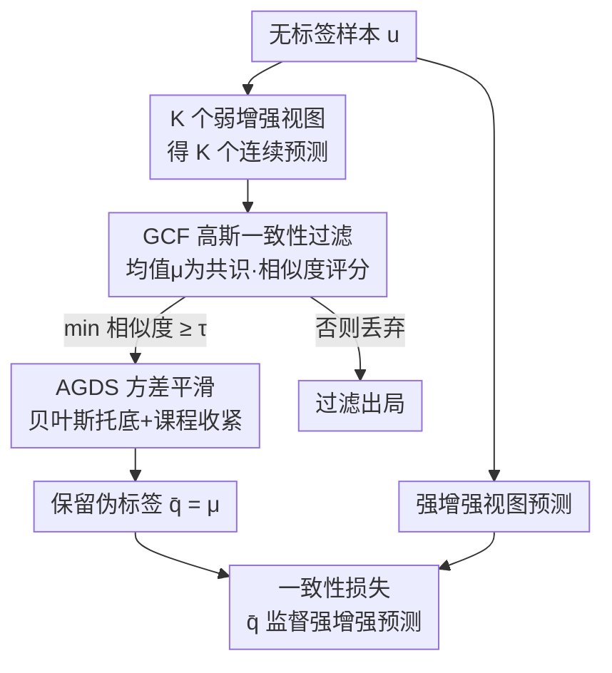

# GaussianMatch: Semi-Supervised Regression with Pseudo-Label Filtering via Multi-View Gaussian Consistency

**会议**: CVPR 2026  
**论文**: [CVF Open Access](https://openaccess.thecvf.com/content/CVPR2026/html/Wang_GaussianMatch_Semi-Supervised_Regression_with_Pseudo-Label_Filtering_via_Multi-View_Gaussian_Consistency_CVPR_2026_paper.html)  
**代码**: https://github.com/pywin/GaussianMatch  
**领域**: 自监督 / 半监督学习  
**关键词**: 半监督回归, 伪标签过滤, 多视图一致性, 高斯相似度, 课程学习  

## 一句话总结
针对半监督回归（SSR）里"连续输出没有置信度、低质伪标签会污染训练"的难题，GaussianMatch 用同一样本多个弱增强视图预测的**高斯一致性**当作伪标签可靠性的代理，只保留所有视图都落在置信区间内的样本，并用贝叶斯方差平滑防止过度过滤，在 UTKFace 30 标签的极端稀缺下把 MAE 降低 15.36%、R² 提升 50.21%。

## 研究背景与动机
**领域现状**：半监督学习（SSL）在分类任务（SSC）上已经很成熟，FixMatch 这类方法靠"高置信度伪标签过滤"——对弱增强视图预测，取 $\max(q)\ge\tau$ 的类别当伪标签——就能可靠地把不靠谱的预测筛掉。

**现有痛点**：这套机制搬不到回归上。回归输出是连续值，**天生没有概率置信度**，无法用"最大类别概率"来判断一个预测可不可信；于是大量未经验证的连续伪标签被当作监督信号直接喂进训练，误差在迭代中不断放大（error propagation），最终把预测整体带偏。

**核心矛盾**：SSC 是离散标签范式，强调类间边界、忽略类内连续性；而回归恰恰要求学到样本间**平滑渐变**的结构（年龄 18→19→20 在特征空间应该连续过渡）。范式不匹配，导致 SSC 的过滤思路在回归上既无从下手、又破坏了特征连续性。

**切入角度**：作者回到回归任务的内在特性——**平滑性假设**（smoothness assumption）：特征空间相邻的点应有相近标签。一个鲁棒的回归模型，对同一样本的多个**弱增强**视图（轻微旋转/平移/加噪，不改变本质属性）应当输出几乎一致的结果。作者据此做了一个实证观察（图 4）：多视图预测的标准差 STD 越大，伪标签相对真值的绝对误差越大——**预测一致性可以当作伪标签质量的可靠代理**。

**核心 idea**：用"多视图预测的高斯一致性"代替"类别概率置信度"来过滤伪标签——预测彼此越聚拢越可信，越离散越要被抑制，从而把 SSC 的过滤思想以**连续、方差感知**的形式移植到 SSR。

## 方法详解

### 整体框架
GaussianMatch 沿用"一致性正则 + 置信度过滤"的总范式，但完全为连续标签重新设计。对每个无标签样本 $u_j$，先生成 $K$ 个**弱增强**视图、得到 $K$ 个连续预测 $\{q_j^{(1)},\dots,q_j^{(K)}\}$；用 **Gaussian Consistency Filter（GCF）** 评估这 $K$ 个预测彼此有多一致，只有"全部视图都落进置信区间"的样本才被保留，其均值 $\bar q$ 作为伪标签；为防止 GCF 在方差趋零时把好样本误杀，**Adaptive Gaussian Standard Deviation Smoothing（AGDS）** 用贝叶斯先验给标准差托底、并随训练逐步收紧区间（课程式）。最后被保留的伪标签去监督**强增强**视图的预测，构成无标签一致性损失。

整个流程是"多视图生成 → 一致性过滤 → 方差自适应 → 伪标签监督强增强"的清晰串行管线，配框架图如下：

### 关键设计

**1. Gaussian Consistency Filter（GCF）：用多视图高斯相似度把"预测离散"翻译成"该不该过滤"**

GCF 解决的是"回归伪标签没有置信度、无法过滤"这个根本痛点。它不看类别概率，而是看同一样本 $K$ 个弱增强预测彼此有多聚拢。先取这 $K$ 个预测的均值 $\mu_j$ 当共识值、标准差 $\sigma_j$ 当离散度，然后对每个预测算一个高斯相似度分数：

$$S_j(k)=\exp\!\left(-\frac{(q_j^{(k)}-\mu_j)^2}{2\sigma_j^2}\right),\quad \forall k\in\{1,\dots,K\}$$

$S_j(k)\to 1$ 表示该预测与共识完全一致。过滤规则要求**最严苛的那一个视图**也达标——只有当所有视图的最小相似度都超过阈值 $\tau$ 才保留这个样本：$\tilde M(u_j)=\mathbb{I}(\min_k S_j(k)\ge\tau)$。这个阈值条件可以等价改写成一个置信区间：$|q_j^{(k)}-\mu_j|\le\rho\sigma_j$，其中 $\rho=\sqrt{-2\ln\tau}$（由相似度阈值反解而来）。由于 $\tau$ 固定，区间宽度 $\rho\sigma_j$ 只由 $\sigma_j$ 决定——预测越散、$\sigma_j$ 越大，理论上区间越宽。作者还从最大似然角度解释了这个分数：把每个弱增强预测看作共识值 $\mu_j$ 的独立带噪观测 $q_j^{(k)}\sim\mathcal{N}(\mu_j,\sigma_j^2)$，那 $S_j(k)$ 恰好正比于这个高斯似然（忽略归一化常数），所以离共识近的预测得分指数级更高、离群点被指数级压制。这一步让"预测一致 = 伪标签可信"有了可计算、可阈值化的形式。

**2. Adaptive Gaussian Standard Deviation Smoothing（AGDS）：贝叶斯托底 + 课程收紧，防止 GCF 在高一致时反而误杀**

GCF 有个反直觉的失效点：当 $K$ 个预测高度一致、$\sigma_j\to 0$ 时，置信区间 $[\mu_j-\rho\sigma_j,\ \mu_j+\rho\sigma_j]$ 会塌缩到几乎零宽，于是哪怕一丁点偏差都会让预测失配、把**本该最可信**的样本错误地拒掉——这与"一致性高就该保留"的目标完全矛盾。AGDS 用一个 inverse-Gamma 先验对样本方差做贝叶斯正则，给标准差设一个不会塌缩的底：

$$\hat\sigma_j=\sqrt{\frac{\beta_0+\tfrac12\sum_{k=1}^{K}(q_j^{(k)}-\mu_j)^2}{\alpha_0+\tfrac{K}{2}-1}}$$

其中自由度约束 $\alpha_0>1$ 降低对均值附近微小波动的敏感度，基线方差 $\beta_0>0$ 保证即便 $\sigma_j\to 0$ 区间仍有合理宽度。更巧的是 $\beta_0$ 不是定值，而是一条**课程式衰减**曲线：训练早期用较大的 $\beta_0$ 让区间宽松、避免一开始就因过度过滤而欠拟合；随训练推进逐步减小、把区间收紧、强制更严格的一致性。第 $t$ 步的 $\beta_t=\max\big(\bar\beta_w(1-\gamma(t)),\ \beta_{\min}\big)$，衰减进度 $\gamma(t)=\frac{t-t_w}{t_{\text{total}}-t_w}$，$t_w$ 是 warmup 时长，$\bar\beta_w$ 是 warmup 阶段在保留的有效伪标签上算出的 $\beta_0$ 均值。这个自标定设计省去了手调，又让模型"先广纳、后收紧"地稳定扩充可信伪标签集。

### 损失函数 / 训练策略
GaussianMatch 用一个复合损失联合优化有标签和无标签数据：

$$L^{GM}=\underbrace{\frac{1}{|X'|}\sum_{x,p\in X'}|p-f_\theta(x)|}_{\text{有标签项}}+\lambda_u\underbrace{\frac{1}{|U|}\sum_{u\in U}\tilde M(u)\,\|\bar q-f_\theta(A(u))\|_2^2}_{\text{无标签一致性 (MSE)}}$$

有标签项对增强后的有标签数据做误差最小化；无标签项强制**强增强**视图预测 $f_\theta(A(u))$ 向伪标签 $\bar q=\mu_j$ 对齐，且乘上 GCF 的掩码 $\tilde M(u)=\mathbb{I}(\min_k S_j(k)\ge\tau)$——只有通过过滤的样本才贡献损失，相似度评分里用 AGDS 平滑后的 $\hat\sigma_j$ 替换原始 $\sigma_j$ 以防区间塌缩。整体相当于把 MixMatch 的"平均共识"和 FixMatch 的"弱监督强"两条线，用方差感知的高斯过滤串了起来。

## 实验关键数据

### 主实验
UTKFace 年龄估计（18,964 张训练图，其余为无标签）跨不同标签量对比，⬇越低越好、⬆越高越好：

| 标签数 | 指标 | Supervised | MixMatch | RankUp | GaussianMatch | 备注 |
|--------|------|-----------|----------|--------|---------------|------|
| 30 | MAE↓ | 15.02 | 12.50 | 11.58 | **9.80** | 极端稀缺仍大幅领先 |
| 30 | R²↑ | 0.043 | 0.290 | 0.359 | **0.539** | 较 RankUp +50% 量级 |
| 30 | SRCC↑ | 0.265 | 0.616 | 0.606 | **0.743** | 序关系保持最好 |
| 50 | MAE↓ | 14.13 | 11.44 | 9.96 | **8.90** | 仅 50 标签即超过 250 标签的监督模型(9.42) |
| 2000 | MAE↓ | 6.28 | 6.03 | 5.61 | **5.36** | 接近全监督(4.85) |

跨模态泛化（Yelp Review 文本评分 + VIPL 视频心率）同样领先：VIPL 2500 标签下 MAE 7.795 vs RankUp 8.135、Pearson r 0.569 vs 0.518；Yelp 250 标签下 MAE 0.630、SRCC 0.832，均优于 RankUp。

### 消融实验
UTKFace 250 标签，仅看 MAE↓：

| 配置 | MAE↓ | 说明 |
|------|------|------|
| GaussianMatch (K=8) | **6.38** | 默认配置，最佳平衡 |
| K=2 | 6.74 | 视图太少，共识不可靠 |
| K=4 | 6.48 | 略逊于 K=8 |
| K=16 | 6.52 | GCF 过严导致过度过滤 |
| w/o GCF & AGDS | 7.41 | 同时去掉两核心组件，掉点最多 |
| w/o AGDS | 6.85 | 只去平滑，低方差下过度过滤 |
| w/o 强增强(换弱增强) | 6.56 | 强增强对增强一致性有贡献 |

### 关键发现
- **两核心组件缺一不可**：同时移除 GCF+AGDS 时 MAE 从 6.38 劣化到 7.41（掉最多）；只去 AGDS 也涨到 6.85，印证了"低方差时若不托底就会过度过滤"的分析。
- **$K$ 不是越多越好**：$K=8$ 最优；$K=16$ 反而因 GCF 选择过严而 over-filtering、$K$ 太小则共识不稳，呈现明显的 sweet spot。
- **一致性确实是可靠性代理**：图 4 显示预测 STD 与伪标签绝对误差正相关，直接支撑了用高斯一致性过滤的合理性。
- **特征空间更连续**：t-SNE（图 3）显示 GaussianMatch 的相邻年龄组顺序排列、局部线性好，接近全监督的平滑流形，而 MixMatch/Supervised 出现碎裂簇。
- **优于 SSC 范式**：把 FixMatch 直接套到年龄回归上（表 3）相比监督基线只有微弱提升（MAE 9.30 vs 9.42），而 GaussianMatch 达 6.38——说明离散标签逻辑无法建模连续目标间的关系。

## 亮点与洞察
- **把"没有置信度"变成"有置信度"**：回归最棘手的就是缺概率置信度，作者用多视图方差经高斯相似度反解出一个可阈值化的置信区间 $\rho\sigma_j$，等于给连续输出造了一个"软置信度"，这个视角很可迁移。
- **AGDS 抓住了一个反直觉 bug**：方差趋零本是"高一致"的好信号，却会让朴素 GCF 区间塌缩误杀好样本——用 inverse-Gamma 先验托底 + 课程衰减解决，既治标又自标定免调参，是这篇最巧的一笔。
- **"先广纳后收紧"的课程**：$\beta_t$ 早期大、后期小，让模型早期不过度过滤避免欠拟合、后期严格保质量，这种伪标签集随训练稳定扩张的思路可借鉴到其它伪标签方法。
- **强弱增强分工清晰**：弱增强建共识、强增强受监督，沿用 FixMatch 框架但把"概率阈值"换成"方差过滤"，迁移成本低。

## 局限与展望
- **依赖平滑性假设**：方法建立在"弱增强不改变本质属性 → 预测应一致"之上；若增强设计不当或任务本身对扰动敏感，一致性就不再是可靠代理。
- **多视图带来计算开销**：每个无标签样本要前向 $K$（默认 8）个弱增强视图，吞吐相对单视图方法更重（作者称 $K=8$ 兼顾效率，但运行时分析在附录）。
- **超参虽自标定但未完全免调**：$\tau,\alpha_0,\beta_{\min}$ 等仍需设定；⚠️ 论文称"易于设置"，但跨任务鲁棒性的系统验证放在附录 G，正文未展开。
- **作者展望**：未来扩展到**不平衡**回归场景（标签分布长尾）。

## 相关工作与启发
- **vs MixMatch**：MixMatch 对 $K$ 个弱增强视图做平均 + sharpening + MixUp 生成伪标签，但**不做可靠性过滤**，噪声伪标签照单全收；本文同样取多视图均值当伪标签，却加了一道高斯一致性过滤的闸门，质量更高。
- **vs FixMatch**：FixMatch 靠类别概率阈值 $\mathbb{I}(\max q\ge\tau)$ 过滤，是离散逻辑，无法用于连续目标；本文把"概率阈值"换成"方差感知的高斯区间"，把过滤思想搬进了回归。
- **vs RankUp**：RankUp 把回归重构成排序问题、借分类式半监督策略；本文不改任务形式，直接在连续标签空间用一致性过滤，且在多数标签量下 MAE/R²/SRCC 全面更优。
- **vs UCVME / CLSS**：UCVME 用不确定性估计、CLSS 用邻样本平滑正则来提质，但前者未充分利用回归输出的连续分布特性；本文用多视图共识做了更直接的可靠性度量。

## 评分
- 新颖性: ⭐⭐⭐⭐ 把多视图高斯一致性当作回归伪标签置信度、并用贝叶斯方差平滑修复 GCF 的塌缩缺陷，切入角度清晰。
- 实验充分度: ⭐⭐⭐⭐ 跨视觉/生理/文本三模态 + 多标签量 + 消融 + 与 SSC 范式对比，证据链完整。
- 写作质量: ⭐⭐⭐⭐ 动机—观察—方法逻辑顺，公式推导（区间反解、最大似然解释）讲得清楚。
- 价值: ⭐⭐⭐⭐ 半监督回归这一被忽视方向给出简单可泛化的方案，极端标签稀缺下提升显著。

<!-- RELATED:START -->

## 相关论文

- [\[CVPR 2026\] PAF: Perturbation-Aware Filtering for Open-Set Semi-Supervised Learning](paf_perturbation-aware_filtering_for_open-set_semi-supervised_learning.md)
- [\[CVPR 2026\] Measure The Feature Universe: Topology-based Pseudo Labeling and Gravity Consistency for Source-Free Domain Adaptation](measure_the_feature_universe_topology-based_pseudo_labeling_and_gravity_consiste.md)
- [\[CVPR 2026\] MuM: Multi-View Masked Image Modeling for 3D Vision](mum_multi-view_masked_image_modeling_for_3d_vision.md)
- [\[CVPR 2026\] GeoBridge: A Semantic-Anchored Multi-View Foundation Model for Geo-Localization](geobridge_semantic-anchored_multi-view_foundation_model_for_geo-localization.md)
- [\[CVPR 2026\] CUE: Concept-Aware Multi-Label Expansion to Mitigate Concept Confusion in Long-Tailed Learning](cue_concept-aware_multi-label_expansion_to_mitigate_concept_confusion_in_long-ta.md)

<!-- RELATED:END -->
