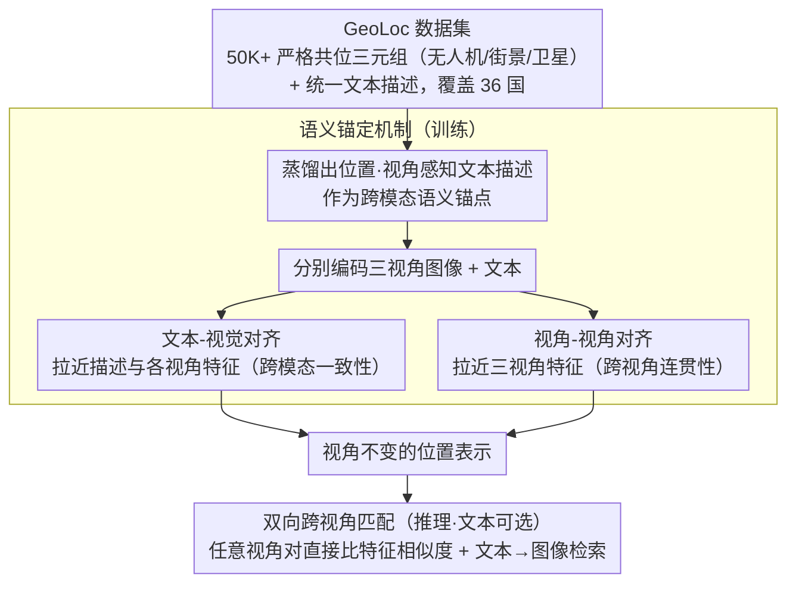

# GeoBridge: A Semantic-Anchored Multi-View Foundation Model for Geo-Localization

**会议**: CVPR 2026  
**arXiv**: [2512.02697](https://arxiv.org/abs/2512.02697)  
**代码**: 即将发布  
**领域**: 自监督  
**关键词**: 跨视角地理定位, 多视角匹配, 语义锚定, 无人机导航, 跨模态检索

## 一句话总结
GeoBridge 提出语义锚定的多视角地理定位基础模型，将无人机/街景/卫星影像通过文本描述构建跨模态语义桥梁，实现双向跨视角匹配和语言到图像定位，并构建了GeoLoc数据集（50K+对，36国）。

## 研究背景与动机
1. **领域现状**：跨视角地理定位通过检索地理标记的参考图像推断查询图像位置。多数方法采用卫星中心策略。
2. **现有痛点**：（i）卫星中心策略在高分辨率或最新卫星影像不可用时脆弱；（ii）未充分利用不同视角间的互补线索；（iii）语言与视觉的互补性被忽视。
3. **核心矛盾**：缺乏支持双向多视角匹配的统一框架——无人机↔街景匹配尤其被忽视。
4. **本文目标**：超越卫星中心范式，构建支持任意视角对匹配+文本检索的统一地理定位模型。
5. **切入角度**：用文本描述作为语义锚点桥接多视角特征。
6. **核心idea**：训练时将多视角影像蒸馏为位置和视角感知的文本描述作为跨模态语义桥梁，推理时文本分支可选——可直接匹配任意视角对。

## 方法详解

### 整体框架
GeoBridge 想解决的是同一个地点在无人机、街景全景、卫星三种视角下"长得完全不一样"，导致彼此难以互相检索的问题。它的整体思路是：先用一个严格共位、带文本标注的多视角数据集（GeoLoc）作为训练基础，再在训练时给每个地点配一段"位置 + 视角感知"的文本描述，让这段文字充当所有视角共享的语义中转站——既把文本拉近到各视角的视觉特征（跨模态一致性），又顺带把不同视角的视觉特征互相拉近（跨视角连贯性）。等表示学好之后，推理时这段文字就可以丢掉：任意两个视角的图像直接比特征相似度即可匹配，需要时也能再用一句话当查询去检索图像。

### 关键设计

**1. GeoLoc 数据集：补齐多视角完全对齐的三元组**

已有数据集（如 University-1652、VIGOR）大多是双视角、卫星中心的，既没有三视角严格共位的样本，也没有文本标注，因此根本训不出后面那套锚定机制。GeoLoc 为此收集了 50K+ 个地点，每个地点都配有严格共位的无人机图像、Google Street View 全景、卫星图像，覆盖 36 个国家，并为每个地点生成统一的文本描述。地理坐标采用非重叠设计，确保查询和参考不会因为地理相邻而"作弊"命中，让评估更严格。

**2. 语义锚定机制：用文本当所有视角的公共坐标系**

跨视角定位最难的地方在于无人机俯视、街景平视、卫星顶视三者像素层面几乎没有重叠，直接对齐视觉特征很容易学偏。GeoBridge 的做法是先把每个地点的三种影像蒸馏成一段统一的、带位置和视角信息的文本描述，再用对比学习同时优化两类配对：文本-视觉对（让描述贴近每个视角的特征）和视角-视角对（让三个视角的特征彼此靠拢）。文本天然是模态无关的中间表示，把"一座桥的北侧、临河、有双塔"这种语义写出来后，视觉差异巨大的三个视角就被钉到了同一个语义坐标上——这也是"锚定（anchor）"一词的由来。

**3. 双向跨视角匹配：把无人机↔街景这条新链路打通**

卫星中心范式默认所有查询都要和卫星图比，但现实里卫星影像未必最新、未必高分辨率。经过语义锚定训练后，模型学到的是视角不变的位置表示，于是推理时任意两个视角都能直接通过特征相似度匹配，文本不再是必需品。这尤其让此前被忽视的无人机-街景匹配第一次变得可行——而这条链路在灾害响应、低空物流验证、基础设施巡检等卫星不可靠的场景里有明确需求。

### 损失函数 / 训练策略
训练目标是多视角 + 跨模态联合对比损失：文本-视觉对齐项把描述拉近到各视角特征，视角-视角对齐项把不同视角特征互相拉近，两项一起优化得到视角不变的位置表示。

## 实验关键数据

### 主实验

| 任务 | 指标 | GeoBridge | 之前SOTA | 提升 |
|------|------|-----------|---------|------|
| 无人机→卫星 | R@1 | 提升 | - | 显著 |
| 街景→卫星 | R@1 | 提升 | - | 竞争力 |
| 无人机→街景 | R@1 | 首次实现 | N/A | 新任务 |
| 文本→图像 | R@1 | 有效 | N/A | 新能力 |

### 消融实验

| 配置 | 关键指标 | 说明 |
|------|---------|------|
| Full GeoBridge | 最优 | 三重对齐完整 |
| w/o 文本锚定 | 下降 | 语义桥梁很重要 |
| w/o GeoLoc预训练 | 显著下降 | 预训练提供多视角先验 |
| 仅双视角训练 | 下降 | 三视角联合训练更强 |

### 关键发现
- GeoLoc预训练显著提升了跨视角定位精度和跨域泛化能力。
- 语义锚定不仅实现了跨模态检索，还增强了纯视觉匹配的性能。
- 无人机-街景匹配是全新任务，GeoBridge证明了其可行性和实用价值。

## 亮点与洞察
- **超越卫星中心**的定位理念很重要：现实中卫星图像不总是可用或最新的。
- **文本作为语义桥梁**而非直接匹配工具的设计巧妙——训练时连接多视角，推理时可丢弃。
- GeoLoc数据集本身就是重要贡献：36国、50K+严格共位三元组。

## 局限与展望
- 文本描述的质量影响语义锚定效果。
- 在极端视角差异（如俯视vs正面）下的匹配仍有挑战。
- 未来可扩展到室内/地下等无卫星覆盖的场景。

## 相关工作与启发
- **vs University-1652**: 仅支持无人机-卫星双视角。GeoBridge扩展到三视角+文本。
- **vs VIGOR**: 提供了更密集的城市采样但仍是双视角。GeoBridge增加了无人机视角和文本描述。

## 评分
- 新颖性: ⭐⭐⭐⭐ 语义锚定+多视角统一是新方向
- 实验充分度: ⭐⭐⭐⭐ 多任务多数据集验证
- 写作质量: ⭐⭐⭐⭐ 框架清晰，数据集构建详细
- 价值: ⭐⭐⭐⭐⭐ 数据集+方法双重贡献，对地理定位领域有长远影响

<!-- RELATED:START -->

## 相关论文

- [\[CVPR 2026\] MuM: Multi-View Masked Image Modeling for 3D Vision](mum_multi-view_masked_image_modeling_for_3d_vision.md)
- [\[CVPR 2026\] GaussianMatch: Semi-Supervised Regression with Pseudo-Label Filtering via Multi-View Gaussian Consistency](gaussianmatch_semi-supervised_regression_with_pseudo-label_filtering_via_multi-v.md)
- [\[CVPR 2026\] MOMO: Mars Orbital Model — Foundation Model for Mars Orbital Applications](momo_mars_orbital_model_foundation_model_for_mars_orbital_applications.md)
- [\[CVPR 2026\] Global-Graph Guided and Local-Graph Weighted Contrastive Learning for Unified Clustering on Incomplete and Noise Multi-View Data](global-graph_guided_and_local-graph_weighted_contrastive_learning_for_unified_cl.md)
- [\[ICML 2025\] Foundation Model Insights and a Multi-Model Approach for Superior Fine-Grained One-shot Subset Selection](../../ICML2025/self_supervised/foundation_model_insights_and_a_multi-model_approach_for_superior_fine-grained_o.md)

<!-- RELATED:END -->
